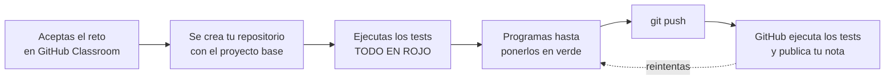
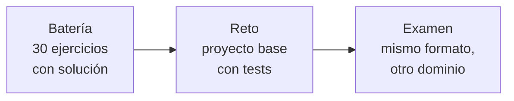

# Cómo se trabaja y cómo se comprueba

Esta página responde a tres preguntas: **qué haces en cada unidad**, **cómo sabes si lo tienes bien** y **de dónde sale tu nota**.

---

## 1. El modelo: retos con tests

En este módulo **no construyes un proyecto grande tú solo desde el primer día**. Trabajas con **retos**: proyectos base que se te entregan a medias, con los tests ya escritos.



**Los tests en rojo son el enunciado.** No hay que adivinar qué se pide: está escrito en las aserciones, con el mensaje de error diciendo exactamente qué se esperaba.

!!! info "Por qué así y no un proyecto continuo"
    Un proyecto que crece durante meses tiene un problema: **si te lías en octubre, arrastras el lío hasta marzo**. Y si faltas dos semanas, no hay forma de engancharse.

    Con retos independientes, cada uno arranca desde una base que funciona. Si uno te sale mal, el siguiente empieza limpio.

    **El proyecto completo sí existe**: lo construye el profesor en clase, sesión a sesión, y lo tienes publicado como referencia. Tú lo ves crecer y lo puedes consultar, pero tu nota sale de tus retos.

---

## 2. De dónde sale cada nota

| | Qué es | Peso en el RA |
|---|---|---|
| **Retos con tests** | Los proyectos base de cada unidad, corregidos automáticamente | Formativo *(no puntúa directamente)* |
| **Examen práctico** | La prueba de la unidad, mismo formato que los retos | **100 %** |

Los retos **no puntúan por sí mismos**, y eso es deliberado: son para aprender, no para calificar. Pero el examen es **exactamente igual que ellos**, con otro dominio. Quien lleva los retos en verde llega al examen habiéndolo hecho ya cinco veces.

!!! tip "El trato, dicho claro"
    Haz los retos y el examen te resulta familiar. No los hagas y el examen será la primera vez que te enfrentas a ese problema, con el reloj corriendo.

---

## 3. GitHub Classroom, paso a paso

### La primera vez

1. Crea una cuenta en [github.com](https://github.com) **con el correo del centro**.
2. Acepta la invitación al *classroom* que recibirás por el Aula Virtual.
3. Asóciate a tu nombre en la lista. **Hazlo bien**: es lo que enlaza tus entregas con tu nota.

### En cada reto

1. Abres el enlace de la tarea. Se crea **tu repositorio privado**, solo tuyo y del profesor.
2. Lo clonas:
   ```bash
   git clone https://github.com/dwes-2daw/ut4-capas-tunombre.git
   cd ut4-capas-tunombre
   ```
3. Ejecutas los tests para ver qué se pide:
   ```bash
   ./mvnw test
   ```
4. Programas hasta ponerlos en verde.
5. Entregas:
   ```bash
   git add .
   git commit -m "UT4: repositorio en memoria"
   git push
   ```
6. **En un par de minutos**, en la pestaña *Actions* de tu repositorio, ves los tests ejecutados y la puntuación.

!!! warning "Puedes reintentar todas las veces que quieras"
    Cada `push` vuelve a lanzar la corrección. La nota que cuenta es la del **último envío antes de la fecha límite**.

    Así que entrega pronto y mejora después. Guardarlo todo para el último día es la peor estrategia posible.

### Leer el resultado

En la pestaña **Actions** verás algo así:

```
BIEN UT4P6Test · repositorio en memoria ............ 4/4
BIEN UT4P7Test · servicio y reglas de negocio ...... 6/6
MAL  UT4P8Test · DTO y validación .................. 2/5
   → esperaba 400 pero recibí 500
   → el DTO de entrada no debe llevar id
BIEN ArquitecturaTest · capas separadas ............ 3/3

Puntuación: 15/18
```

**Los mensajes de error son la corrección.** Léelos: dicen qué esperaba el test y qué llegó.

---

## 4. Cómo sé si lo tengo bien, sin esperar a GitHub

Todo lo que hace GitHub lo puedes hacer tú en tu ordenador, y va mucho más rápido:

```bash
./mvnw test                              # todos
./mvnw test -Dtest=UT4P6Test             # solo uno
./mvnw -q test                           # silencioso: solo lo que falla
./verificar.sh                           # resumen legible, verde y rojo
```

```
PRÁCTICA       ESTADO   DETALLE
────────       ──────   ───────
UT4P6          VERDE    4/4
UT4P7          ROJO     4/6 pasan
    → esperaba 409 pero recibí 200
    → el orden de las comprobaciones importa
UT4P8          VERDE    5/5
```

!!! tip "Trabaja con los tests en marcha"
    En IntelliJ, el botón **Toggle auto-test** del panel de tests los relanza cada vez que guardas. Programas, guardas, y ves el verde aparecer solo.

    Es la forma más rápida de trabajar y la que usa cualquier equipo profesional.

---

## 5. Los retos de cada unidad

| Unidad | Reto | Sobre qué |
|---|---|---|
| **UT2** · Java | `ut2-java-base` | Records, colecciones, streams, excepciones |
| **UT3** · Datos y ficheros | `ut3-datos-base` | CSV, JSON, colecciones, repositorio |
| **UT4** · Capas | `ut4-capas-base` | Capas, DI, DTO, validación, errores |
| **UT5** · JPA | `ut5-jpa-base` | Entidades, relaciones, consultas, transacciones |
| **UT6** · Servicios web | `ut6-api-base` | REST, paginación, OpenAPI, GraphQL, tiempo real |
| **UT7** · Seguridad | `ut7-seguridad-base` | Sesión, cookies, autenticación, roles |
| **UT8** · Thymeleaf | `ut8-vistas-base` | Plantillas, fragmentos, formularios |
| **UT9** · Híbridas | `ut9-integracion-base` | APIs externas, ingesta, analítica |

Cada uno trae:

- **El esqueleto**, con las clases creadas y los métodos vacíos marcados con `// TODO`.
- **Los tests**, que son el enunciado.
- **`verificar.sh`**, para ver el estado de un vistazo.
- **`README.md`** con lo que hay que hacer y cómo se puntúa.

La UT1 no tiene reto: se evalúa con test y sus prácticas son informes, diagramas y `curl`.

---

## 6. El proyecto del profesor

En paralelo, en clase se construye **una aplicación completa**, sesión a sesión, en directo. Empieza en la UT4 con tres capas y termina en la UT9 consumiendo datos abiertos.

Está publicada en un repositorio con **un *tag* por sesión**, así que puedes ver exactamente cómo estaba el código en cualquier momento del curso:

```bash
git clone https://github.com/dwes-2daw/tienda-demo.git
cd tienda-demo
git tag                       # lista de todos los puntos del curso
git checkout ut4-s09          # el código tal como quedó en la S9 de la UT4
git diff ut4-s08 ut4-s09      # qué cambió exactamente en esa sesión
```

!!! tip "Para qué te sirve"
    Cuando te atasques en un reto, ese repositorio es la referencia: *«¿cómo lo hizo con la tienda?»*. No es la solución de tu reto —el dominio es otro— pero sí el patrón.

    Y ese `git diff` entre dos sesiones es la mejor forma de repasar una clase a la que faltaste.

---

## 7. Reglas de entrega

1. **Todo tiene que funcionar desde la consola**: `./mvnw clean test`. Si solo va con el botón del IDE, no está terminado.
2. **Nunca se sube `target/` ni `build/`.** Vienen en el `.gitignore` del reto; no lo toques.
3. **Nada de rutas absolutas** de tu ordenador.
4. **Commits con mensaje útil.** `UT4: validación del DTO` sirve; `cambios` no.
5. **No cambies los tests.** Están para comprobar tu código. Modificarlos para que pasen se detecta al instante y cuenta como copia.

!!! danger "Sobre modificar los tests"
    El sistema compara tu fichero de tests con el original. Si no coincide, la corrección se marca en rojo automáticamente.

    Si crees que un test está mal —puede pasar—, dilo en clase. Si tienes razón se corrige para todos, y eso suma.

---

## 8. Del banco al examen

Los ejercicios de cada unidad, los retos y el examen son **la misma cosa con distinta ropa**:



En la página de **preparar el examen** de cada unidad tienes la tabla que dice, apartado por apartado, de qué ejercicio sale cada punto. No hay sorpresas: si has hecho los ejercicios y el reto, el examen ya lo has visto.
