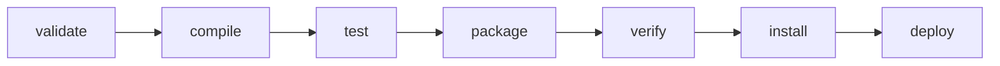

# Manual de Maven

**La herramienta de construcción del módulo.** Todos los proyectos de clase, las prácticas y los exámenes usan Maven.

## 1. Qué hace Maven por ti

Sin herramienta de construcción, para compilar un proyecto Java con tres librerías tendrías que: descargar los `.jar` a mano, meterlos en una carpeta, escribir un `javac` con un `-classpath` de cuatro líneas, repetirlo para los tests y empaquetar el resultado a mano.

Maven hace todo eso a partir de **un fichero** y **una estructura de carpetas fija**:

``` { .text .sinajuste }
mi-proyecto/
├── pom.xml                     ← la única configuración
├── src/
│   ├── main/
│   │   ├── java/               ← código de la aplicación
│   │   └── resources/          ← application.yml, plantillas, datos
│   └── test/
│       ├── java/               ← tests
│       └── resources/          ← datos de prueba
└── target/                     ← lo genera Maven. NUNCA se entrega
```

!!! tip "Convención sobre configuración"
    Esa estructura no se elige: **es la misma en todos los proyectos Maven del mundo**. Por eso puedes abrir cualquier repositorio Java y saber dónde está todo sin preguntar.

    Es también la razón de que la corrección automática de este módulo funcione: los tests siempre están en el mismo sitio.

## 2. El `pom.xml`, línea a línea

Pasa el ratón por los números para ver qué hace cada bloque.

``` { .xml .annotate title="pom.xml" hl_lines="5 6 7" }
<?xml version="1.0" encoding="UTF-8"?>
<project xmlns="http://maven.apache.org/POM/4.0.0" …>
    <modelVersion>4.0.0</modelVersion>

    <groupId>es.iesx.daw</groupId>        <!-- (1)! -->
    <artifactId>tienda</artifactId>
    <version>1.0.0-SNAPSHOT</version>     <!-- (2)! -->
    <packaging>jar</packaging>

    <properties>                          <!-- (3)! -->
        <maven.compiler.source>25</maven.compiler.source>
        <maven.compiler.target>25</maven.compiler.target>
        <project.build.sourceEncoding>UTF-8</project.build.sourceEncoding>
        <jackson.version>2.18.2</jackson.version>
    </properties>

    <dependencies>                        <!-- (4)! -->
        <dependency>
            <groupId>com.fasterxml.jackson.core</groupId>
            <artifactId>jackson-databind</artifactId>
            <version>${jackson.version}</version>
        </dependency>
        <dependency>
            <groupId>org.junit.jupiter</groupId>
            <artifactId>junit-jupiter</artifactId>
            <version>5.11.4</version>
            <scope>test</scope>           <!-- (5)! -->
        </dependency>
    </dependencies>

    <build>
        <plugins>                         <!-- (6)! -->
            <plugin>
                <groupId>org.apache.maven.plugins</groupId>
                <artifactId>maven-surefire-plugin</artifactId>
                <version>3.5.2</version>
            </plugin>
        </plugins>
    </build>
</project>
```

1.  **Las coordenadas.** `groupId` + `artifactId` + `version` identifican tu proyecto de forma única **en el mundo**. El `groupId` suele ser un dominio al revés.

2.  `SNAPSHOT` significa «en desarrollo, puede cambiar». Una versión sin `SNAPSHOT` se considera definitiva e inmutable: si la publicas, no se toca nunca más.

3.  **Propiedades.** Variables que se usan con `${nombre}`. Sirven sobre todo para tener **las versiones en un solo sitio** en vez de repartidas por el fichero.

4.  **Dependencias.** Cada una son sus tres coordenadas. Se buscan en [central.sonatype.com](https://central.sonatype.com) y se copian de ahí, no se escriben de memoria.

5.  El ***scope***. Con `test`, la librería está disponible **solo al compilar y ejecutar los tests**, y no acaba dentro del `.jar` que despliegas. Olvidarlo en JUnit es el error más común del tema.

6.  ***Plugins*.** Quien hace el trabajo de verdad: compilar, ejecutar tests, empaquetar. Maven por sí solo no hace nada; todo lo hace un *plugin*.

Las tres líneas resaltadas son **las coordenadas**: lo único que de verdad identifica tu proyecto.

## 3. El ciclo de vida

Es lo que más se pregunta y lo que más se malinterpreta. Las fases están **ordenadas**, y ejecutar una **ejecuta todas las anteriores**.



| Fase | Qué hace | Dónde deja el resultado |
|---|---|---|
| `validate` | Comprueba que el `pom.xml` es correcto | — |
| `compile` | Compila `src/main/java` | `target/classes/` |
| `test` | Compila y ejecuta los tests | `target/surefire-reports/` |
| `package` | Empaqueta en `.jar` o `.war` | `target/mi-proyecto-1.0.0.jar` |
| `verify` | Comprobaciones adicionales de calidad | — |
| `install` | Copia el `.jar` a tu repositorio local | `~/.m2/repository/` |
| `deploy` | Lo sube a un repositorio remoto | — |

`clean` va aparte: borra `target/`. Por eso se escribe `mvn clean package`, que es «borra y vuelve a empaquetar desde cero».

!!! danger "`mvn package` ejecuta los tests"
    Y si un test falla, **no genera el `.jar`**. Es deliberado: impide empaquetar código roto.

    Existe `-DskipTests`, que se usa cuando sabes lo que haces. En una entrega de este módulo, saltarse los tests para que «compile» es exactamente lo contrario de lo que se pide.

## 4. Los comandos del día a día

```bash
mvn clean                    # borra target/
mvn compile                  # compila
mvn test                     # ejecuta todos los tests
mvn package                  # compila, testea y genera el .jar
mvn clean package            # lo anterior, desde cero
mvn install                  # además lo instala en ~/.m2

# ejecutar un solo test
mvn test -Dtest=ProductoServicioTest
mvn test -Dtest='UT3*'                   # todos los que empiecen por UT3
mvn test -Dtest=ProductoServicioTest#crearFalla   # un único método

# Spring Boot
mvn spring-boot:run
mvn spring-boot:run -Dspring-boot.run.profiles=dev

# información
mvn dependency:tree                       # el árbol completo de dependencias
mvn help:effective-pom                    # el pom.xml real, con todo lo heredado
mvn versions:display-dependency-updates   # qué se puede actualizar

# depurar problemas
mvn -X clean test                         # salida detallada
mvn -o test                               # modo sin conexión
mvn -U clean install                      # fuerza a rebajar las dependencias
```

!!! tip "Los cuatro que vas a usar el 95 % del tiempo"
    `mvn clean test` · `mvn spring-boot:run` · `mvn test -Dtest=X` · `mvn dependency:tree`

## 5. Los *scopes*: dónde vale cada dependencia

```xml
<scope>test</scope>
```

| Scope | Disponible en | Va en el `.jar` | Ejemplo |
|---|---|:-:|---|
| `compile` (por defecto) | Todo | :material-check: | Jackson, Spring |
| `test` | Solo en tests | :material-close: | JUnit, AssertJ, Mockito |
| `provided` | Compilación, pero lo aporta el servidor | :material-close: | API de Servlet |
| `runtime` | Solo en ejecución | :material-check: | Driver de PostgreSQL |

!!! danger "El error más frecuente con los scopes"
    Poner JUnit **sin** `<scope>test</scope>`. Funciona, y por eso pasa desapercibido, pero acabas metiendo la librería de tests dentro del `.jar` que despliegas en producción.

    Y al revés: si pones una dependencia que necesita la aplicación con `scope test`, compila en el IDE y falla al ejecutar con `java -jar`.

## 6. Dependencias transitivas

Cuando añades Spring Boot Web, no llegan 1 librería: llegan unas 40. Cada dependencia arrastra las suyas.

```bash
mvn dependency:tree
```

```
es.iesx.daw:tienda:jar:1.0.0-SNAPSHOT
├─ org.springframework.boot:spring-boot-starter-web:jar:3.4.1:compile
│  ├─ org.springframework.boot:spring-boot-starter:jar:3.4.1:compile
│  │  └─ org.springframework.boot:spring-boot:jar:3.4.1:compile
│  ├─ org.springframework.boot:spring-boot-starter-tomcat:jar:3.4.1:compile
│  └─ com.fasterxml.jackson.core:jackson-databind:jar:2.18.2:compile
└─ org.junit.jupiter:junit-jupiter:jar:5.11.4:test
```

Ese comando responde a la pregunta *«¿de dónde ha salido esta librería que yo no he puesto?»*, y es la primera herramienta cuando hay un conflicto de versiones.

Para quitar una que llega y no quieres:

```xml title="pom.xml"
<dependency>
    <groupId>ejemplo</groupId>
    <artifactId>libreria</artifactId>
    <exclusions>
        <exclusion>
            <groupId>commons-logging</groupId>
            <artifactId>commons-logging</artifactId>
        </exclusion>
    </exclusions>
</dependency>
```

## 7. El `parent` de Spring Boot

En los proyectos de la UT4 en adelante verás esto:

```xml title="pom.xml"
<parent>
    <groupId>org.springframework.boot</groupId>
    <artifactId>spring-boot-starter-parent</artifactId>
    <version>3.4.1</version>
</parent>
```

Y las dependencias **sin versión**:

```xml title="pom.xml"
<dependency>
    <groupId>org.springframework.boot</groupId>
    <artifactId>spring-boot-starter-web</artifactId>
</dependency>
```

No es un olvido. El `parent` trae una lista enorme de versiones **probadas entre sí**: Spring, Jackson, Hibernate, Tomcat, JUnit… Todas compatibles.

!!! warning "No pongas versión a las dependencias que gestiona Spring Boot"
    Fijar a mano la versión de Jackson en un proyecto Spring Boot es la forma más rápida de romper algo que funcionaba. Deja que decida el `parent`.

Un ***starter*** es una dependencia que agrupa un conjunto coherente. `spring-boot-starter-web` trae Spring MVC, Jackson y Tomcat embebido de una vez, en lugar de quince líneas de XML.

## 8. Perfiles

Configuraciones alternativas para entornos distintos:

```xml
<profiles>
    <profile>
        <id>dev</id>
        <activation><activeByDefault>true</activeByDefault></activation>
        <properties><spring.profiles.active>dev</spring.profiles.active></properties>
    </profile>
    <profile>
        <id>prod</id>
        <dependencies>
            <dependency>
                <groupId>org.postgresql</groupId>
                <artifactId>postgresql</artifactId>
                <scope>runtime</scope>
            </dependency>
        </dependencies>
    </profile>
</profiles>
```

```bash
mvn clean package -Pprod
```

## 9. El *wrapper*: `mvnw`

Los proyectos de Spring Boot traen dos ficheros más:

```
mvnw          ← Linux y macOS
mvnw.cmd      ← Windows
.mvn/wrapper/ ← la configuración
```

Sirven para **ejecutar Maven sin tenerlo instalado**: el *wrapper* descarga la versión exacta que el proyecto necesita.

```bash
./mvnw clean test          # Linux / macOS
mvnw.cmd clean test        # Windows
```

!!! tip "Úsalo siempre en proyectos que lo traigan"
    Garantiza que tú, el profesor y el compañero con el que trabajes ejecutáis **la misma versión de Maven**. Es la diferencia entre «a mí me funciona» y que funcione en todas partes.

    Y si acabas de clonar un repositorio en Linux y te dice *permission denied*: `chmod +x mvnw`.

## 10. El repositorio local, `~/.m2`

Maven descarga las librerías una vez y las guarda en:

```
~/.m2/repository/          Linux y macOS
C:\Users\tu-usuario\.m2\repository\    Windows
```

De ahí que la primera compilación tarde y las siguientes vuelen.

**Cuando algo se corrompe** —una descarga interrumpida deja un `.jar` a medias— el síntoma es un error raro que no tiene sentido. La solución:

```bash
mvn -U clean install       # fuerza a volver a bajar
```

Y si no basta, borrar la carpeta concreta dentro de `~/.m2/repository/` y repetir. Borrar todo `.m2` funciona, pero luego tarda diez minutos en rehacerlo.

## 11. Problemas típicos y qué mirar

| Error | Causa habitual | Solución |
|---|---|---|
| `Could not resolve dependencies` | Sin internet, o coordenadas mal escritas | Comprobar en central.sonatype.com; `mvn -U` |
| `release version 25 not supported` | El JDK que usa Maven no es el 25 | `mvn -version` para ver cuál usa; revisar `JAVA_HOME` |
| `package X does not exist` | Falta la dependencia, o tiene `scope test` | Revisar el `pom.xml` |
| `No tests were executed` | El nombre no acaba en `Test`, o no está en `src/test/java` | Renombrar la clase |
| `BUILD FAILURE` sin más detalle | — | Repetir con `mvn -X` |
| Los tests pasan en el IDE y fallan en Maven | Rutas absolutas, o dependencia del orden | Revisar rutas relativas y estado compartido |
| `Plugin execution not covered by lifecycle` | Aviso de IntelliJ, no un error real | Ignorar |

!!! tip "Leer el error de Maven"
    Maven escupe cincuenta líneas. La útil es **la primera que empieza por `[ERROR]`**, no la última. Y si hay un `Caused by:`, la causa real está ahí.

## 12. El `.gitignore` obligatorio

```gitignore title=".gitignore"
target/
!.mvn/wrapper/maven-wrapper.jar
*.iml
.idea/
.vscode/
*.log
.env
application-local.yml
```

!!! danger "`target/` nunca se entrega"
    Ni se sube a Git, ni va en el `.zip` de una práctica. Son ficheros generados: pesan mucho, cambian en cada compilación y se regeneran con un comando.

    Un `.zip` de entrega con `target/` dentro puede ocupar 50 MB en vez de 200 kB, y en la rúbrica cuenta como fallo de entrega.

## Comprueba que lo tienes

1. ¿Qué tres elementos identifican un proyecto Maven?
2. Si ejecutas `mvn package`, ¿qué fases se ejecutan antes?
3. ¿Qué diferencia hay entre `compile` y `test` como *scope*, y qué falla si los confundes?
4. ¿Por qué las dependencias de Spring Boot van sin versión?
5. ¿Para qué sirve `mvn dependency:tree`?
6. ¿Qué es `mvnw` y por qué conviene usarlo?
7. ¿Dónde guarda Maven las librerías descargadas y qué haces si se corrompe una?
8. ¿Por qué `target/` no se entrega nunca?
