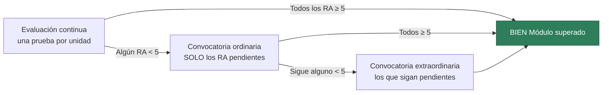

# Desarrollo Web en Entorno Servidor

**Módulo 0613 · 2.º DAW · 160 horas · 8 h semanales · Curso 2026-2027**

Bienvenido. En este módulo aprendes a construir **el lado del servidor** de una aplicación web: la lógica, los datos, la API, la seguridad y las páginas que se generan antes de llegar al navegador. El lenguaje es **Java 25 LTS** y el framework, **Spring Boot**.

Esta página es el mapa del curso: qué vas a aprender, en qué orden, cómo se evalúa y qué se espera de ti. **Léela entera una vez**; luego vuelve cuando tengas dudas de calificación.

---

## 1. Las nueve unidades y sus resultados de aprendizaje

!!! info "Marco normativo"
    **Decreto 1/2011, de 13 de enero** (BOCM de 31 de enero), por el que se establece para la Comunidad de Madrid el currículo del ciclo de Técnico Superior en Desarrollo de Aplicaciones Web.

    Módulo profesional 08 · **Desarrollo web en entorno servidor (0613)** · **160 horas** · **8 h semanales** en el horario del centro · se imparte en los **dos primeros trimestres** del 2.º curso. El tercer trimestre corresponde a la Formación en Centros de Trabajo.

El módulo se organiza en **nueve unidades de trabajo**. Cada una corresponde a **un resultado de aprendizaje (RA)**, y cada RA se aprueba o se suspende por separado.

Los RA **no pesan lo mismo**: cada uno lleva un peso según su dificultad, y ese peso es el que se usa para calcular la nota final.

!!! info "Por qué las tres primeras pesan poco"
    La UT1, la UT2 y la UT3 son **los cimientos**: panorama tecnológico, lenguaje y manejo de datos. Son necesarias, pero no son el módulo. El módulo es lo que viene después —arquitectura, base de datos, API, seguridad y páginas dinámicas—, y por eso concentra el **82 %** de la nota.

    Ojo con la lectura fácil: que pesen 6 % **no significa que se puedan suspender**. Cada RA se aprueba por separado. Un 3 en RA1 te manda a la ordinaria igual que un 3 en RA7; lo único que cambia es cuánto mueve tu nota final.

| Trim. | UT | RA | Qué aprendes | Horas | Peso |
|:-:|---|---|---|---|---:|
| **1º** | **UT1** | RA1 | Cómo funciona la web por dentro: HTTP, arquitecturas, APIs, despliegue | 6 h | 5 % |
| **1º** | **UT2** | RA2 | Java moderno en el servidor: sintaxis, POO, colecciones, excepciones | 8 h | 5 % |
| **1º** | **UT3** | RA3 | Estructuras de datos, ficheros y JSON | 10 h | 6 % |
| **1º** | **UT4** | RA5 | Separar la lógica de la presentación: capas con Spring Boot | 18 h | 11 % |
| **1º** | **UT5** | RA6 | Acceso a bases de datos con JPA | 20 h | 13 % |
| **1º** | **UT6** | RA7 | Servicios web: REST, GraphQL y WebSockets | 18 h | 11 % |
| | | | *Total primer trimestre* | *80 h* | *51 %* |
| **2º** | **UT7** | RA4 | Estado, sesiones, cookies y autenticación | 20 h | 12 % |
| **2º** | **UT8** | RA8 | Páginas dinámicas generadas en el servidor (Thymeleaf) | 26 h | 17 % |
| **2º** | **UT9** | RA9 | Aplicaciones web híbridas y tiempo real | 34 h | 10 % |
| | | | *Total segundo trimestre* | *80 h* | *39 %* |
| | | | *Suma de los nueve RA* | *160 h* | *90 %* |
| | | **FFE** | *Formación y Fomento del Emprendimiento* | — | *10 %* |
|  |  |  |  | **160 h** | **100 %** |

### Los RA repartidos por trimestre

Los **nueve resultados de aprendizaje** no se imparten en el orden en que los numera la normativa, sino en el orden en que se construye una aplicación. Este es el reparto exacto:

=== "1.er trimestre · 80 h · 51 %"

    | RA | Unidad | Qué acredita |
    |---|---|---|
    | **RA1** | UT1 | Reconoce las arquitecturas y tecnologías del desarrollo en servidor |
    | **RA2** | UT2 | Escribe código en el servidor: sintaxis, tipos, objetos, colecciones |
    | **RA3** | UT3 | Maneja estructuras de datos, ficheros y formatos de intercambio |
    | **RA5** | UT4 | Separa la lógica de negocio de la presentación con un framework |
    | **RA6** | UT5 | Desarrolla contra almacenes de datos con seguridad e integridad |
    | **RA7** | UT6 | Construye servicios web reutilizables y verifica su funcionamiento |

    **Al terminar diciembre tienes:** una API completa, con base de datos real, paginada, documentada y probada.

=== "2.º trimestre · 80 h · 49 %"

    | RA | Unidad | Qué acredita |
    |---|---|---|
    | **RA4** | UT7 | Mantiene el estado, gestiona usuarios, perfiles y autenticación |
    | **RA8** | UT8 | Genera páginas dinámicas en el servidor con un motor de plantillas |
    | **RA9** | UT9 | Desarrolla aplicaciones híbridas reutilizando código y servicios |

    **Al terminar el módulo tienes:** esa misma API protegida, con interfaz web propia y conectada a servicios externos.

!!! warning "Cada RA se aprueba por separado"
    No hay nota de trimestre ni media que compense. Si acabas el primer trimestre con RA6 suspenso, vas a la convocatoria ordinaria **solo con el RA6**, aunque el resto los tengas a 9. Y un RA aprobado en diciembre sigue aprobado en junio.

### El temario, unidad por unidad

??? note "1.er trimestre — desplegar para ver los temas"

    **UT1 · RA1 · Arquitecturas y tecnologías** — 10 temas
    : 1. El viaje de una petición · 2. Cliente y servidor · 3. Arquitecturas y MVC · 4. HTTP a fondo · 5. APIs a fondo · 6. Web dinámica y lenguajes · 7. Java en 2026 · 8. Servidores y despliegue · 9. Seguridad y monitorización · 10. Resumen

    **UT2 · RA2 · Java moderno** — 6 temas
    : 1. Primeros pasos · 2. Sintaxis y tipos · 3. POO en Java · 4. Colecciones y programación funcional · 5. Excepciones y `Optional` · 6. Proyectos y testing

    **UT3 · RA3 · Datos, ficheros y JSON** — 5 temas
    : 1. Estructuras de datos · 2. Ficheros · 3. JSON y Jackson · 4. Fechas y validación · 5. El patrón repositorio y las capas

    **UT4 · RA5 · Capas con Spring Boot** — 6 temas
    : 1. Spring Boot · 2. Inyección de dependencias · 3. Las capas en Spring · 4. DTO y validación · 5. Errores y configuración · 6. Testing en Spring

    **UT5 · RA6 · Acceso a datos (JPA)** — 6 temas
    : 1. Qué hace JPA por debajo · 2. Entidades y mapeo · 3. Spring Data JPA · 4. Relaciones · 5. Transacciones e integridad · 6. De H2 a producción

    **UT6 · RA7 · Servicios web** — 8 temas
    : 1. Diseño de APIs REST · 2. Respuestas y errores · 3. Paginación y búsqueda · 4. Documentación con OpenAPI · 5. GraphQL · 6. WebSockets y tiempo real · 7. Testing de APIs · 8. Consumir APIs

??? note "2.º trimestre — desplegar para ver los temas"

    **UT7 · RA4 · Estado, sesiones y seguridad** — 4 temas
    : 1. El estado en la web · 2. Cookies y almacenamiento · 3. Autenticación con Spring Security y JWT · 4. Sesión o token: elegir

    **UT8 · RA8 · Páginas dinámicas (Thymeleaf)** — 7 temas
    : 1. Servidor o cliente · 2. Thymeleaf esencial · 3. Fragmentos y plantillas base · 4. Formularios y validación · 5. Modificar la página sin recargar · 6. Vistas con seguridad e idiomas · 7. Probar y desplegar vistas

    **UT9 · RA9 · Aplicaciones híbridas** — 6 temas
    : 1. Qué es una aplicación híbrida · 2. Consumir servicios de terceros · 3. Crear tu propio repositorio · 4. Librerías y dependencias · 5. Analítica y cuadros de mando · 6. Probar, documentar y desplegar

Cada unidad añade, además de los temas: una **chuleta** de una página, un **reto con tests** corregido automáticamente, una **batería de ejercicios** sobre otro dominio y una página de **preparación del examen** con la rúbrica.

!!! info "Por qué este orden y no el del número de RA"
    El número de RA lo fija la normativa; el orden de impartición lo fija la lógica de aprendizaje. El curso sigue el orden en que se construye una aplicación de verdad:

    **lenguaje → arquitectura → datos → exponer → proteger → presentar**

    Por eso los datos (RA6) van antes que los servicios web: no tiene sentido paginar una lista que vive en memoria. Y por eso la seguridad (RA4) va después de la API: proteger endpoints se entiende cuando ya sabes qué hay que proteger. La UT8 va al final aunque su RA sea el 8, porque generar HTML en el servidor solo se explica bien cuando ya sabes qué es una API REST.

---

## 2. Cómo se evalúa

### Un único instrumento por unidad, que vale el 100 %

Nada de mezclar exámenes, trabajos y participación. **Cada unidad se cierra con una sola prueba**, y esa prueba es la nota del RA.

| Unidades | Instrumento | Qué es |
|---|---|---|
| **UT1 y UT2** | :material-form-select: **Test aplicado** | 30 preguntas, 55 min. No es teoría de memoria: pregunta sobre el código y los ejercicios hechos en clase |
| **UT3** | :material-form-select: **Test práctico** | 30 preguntas en 55 min, **todas con código delante**: qué imprime, por qué falla, cuál es correcta. Sin ordenador |
| **UT4 a UT9** | :material-laptop: **Examen práctico** | 2-3 sesiones programando: se te da un esqueleto y un enunciado, y entregas un proyecto que funciona |

Las **prácticas del día a día no puntúan**. Son formativas: sirven para aprender y son exactamente la materia de la prueba. Quien hace las prácticas aprueba el examen; quien no las hace, no.

### La nota de cada RA

Cada prueba se corrige con una **rúbrica de criterios publicada de antemano**. En los exámenes prácticos la corrección es en buena parte automática: se ejecuta tu proyecto contra una batería de pruebas y recibes un informe con cada comprobación, si la pasaste y por qué. La nota se puede discutir comprobación a comprobación.

!!! warning "El criterio eliminatorio"
    En los exámenes prácticos, **si el proyecto no compila o no arranca, la nota es 0**, por bien que esté el resto del código. Compila y ejecuta cada pocos minutos durante el examen; no escribas todo y pruebes al final.

---

## 3. Cómo se califica el módulo

### La fórmula

> **Nota del módulo = los nueve RA (90 %) + la FFE (10 %)**

```
NOTA = Σ (peso · nota del RA)  +  0,10 × FFE
```

Los pesos de la tabla de arriba **ya están en porcentaje del módulo** y suman 90. El 10 que falta es la FFE. No hay que hacer ninguna cuenta rara: cada RA aporta directamente los puntos de su peso.

Los **RA no pesan igual**: cada uno lleva el peso de la tabla, asignado por su dificultad y sus horas. Un RA largo y difícil pesa más que uno de panorama.

### La FFE: se tiene o no se tiene

La **FFE** (Formación y Fomento del Emprendimiento) es el 10 % restante. Es **una sola nota**, y solo admite dos valores:

| Valor | Cuándo |
|:---:|---|
| **10** | Has alcanzado la competencia de emprendimiento |
| **0** | No la has alcanzado |

Se evidencia en el **proyecto final de la UT9**, que es donde de verdad hay que decidir qué construir, con qué fuentes, con qué licencias y con qué límites. Por eso ese 10 % sale del RA9, que pasa de pesar 20 % a pesar 10 %.

!!! warning "Es todo o nada, y vale un punto entero"
    Antes la FFE se repartía entre las nueve unidades y fallar en una costaba unas décimas. **Ahora no.** Se tiene o no se tiene, y la diferencia entre tenerla y no tenerla es **un punto completo** en la nota del módulo.

### La condición que manda sobre todo lo demás

> **El módulo se aprueba solo si TODOS los RA están en 5 o más.**

No hay medias que salven, y **la FFE no rescata un RA suspenso**. Un 9 en RA1 no compensa un 3 en RA7: son competencias distintas y las dos hay que tenerlas. Si algún RA queda por debajo de 5, la calificación es *no superado* y se limita a 4 como máximo.

### Los tres momentos



1. **Evaluación continua.** Vas superando RAs unidad a unidad. Si al final los tienes todos, has terminado.
2. **Convocatoria ordinaria.** Te presentas **solo a los RA pendientes**, no a todo el módulo.
3. **Convocatoria extraordinaria.** Igual: solo lo que siga pendiente.

Un RA aprobado **no se pierde**: lo que apruebas en noviembre sigue aprobado en junio.

### Tres ejemplos

| | RA1 | RA2 | RA3 | RA5 | RA6 | RA7 | RA4 | RA8 | RA9 | Aportan los RA | FFE | Módulo |
|---|:-:|:-:|:-:|:-:|:-:|:-:|:-:|:-:|:-:|---:|:-:|---|
| **Ana** | 7 | 6 | 8 | 7 | 7 | 7 | 8 | 6 | 7 | 6,26 | **10** → +1,00 | :material-check: **7** |
| **Bruno** | 8 | 6 | 7 | 6 | 6 | 6 | 7 | 7 | 6 | 5,85 | **0** → +0,00 | :material-check: **6** |
| **Carla** | 9 | 8 | 9 | **4** | 5 | **3** | 6 | 6 | 5 | — | — | :material-close: ordinaria con **RA5 y RA7** |

**Ana** consigue la FFE: 6,26 + 1,00 = 7,26 → **7**.

**Bruno** tiene notas parecidas, pero no la consigue: se queda en 5,85 → **6**. Fíjate en que sus notas de RA están apenas cuatro décimas por debajo de las de Ana y aun así hay un punto entero de diferencia. Eso es exactamente lo que vale la FFE.

**Carla** tiene la media más alta de las tres y **no aprueba**: le faltan dos competencias, y este módulo va de saber hacer.

---

## 4. Cómo son las clases

**Aula invertida.** Antes de cada sesión lees el apartado que toca (10-15 minutos). El calendario de cada unidad te dice exactamente qué leer para cada día. La clase **no** es para que el profesor lea en voz alta lo que ya está escrito.

**En clase se hace, no se escucha.** El esquema de cada sesión de 55 minutos:

| Momento | Tiempo | Qué pasa |
|---|---|---|
| Gancho | 5' | Una pregunta, un error real, algo que no cuadra |
| Píldora | 10-15' | Explicación corta de lo esencial |
| *Live coding* | 15' | El profesor programa en directo, con sus errores incluidos |
| *Pair programming* | 15' | Tú programas, en pareja, con el ejercicio del día |
| Cierre | 5' | Puesta en común y qué leer para mañana |

**Los tests son el corrector.** Las prácticas vienen con un **proyecto base y tests que ejecutas tú**: mientras estén en rojo falta trabajo; cuando se ponen verdes, la práctica está terminada. Sin interpretaciones, sin esperar a clase y a cualquier hora. Es además el mismo mecanismo con el que se corrige el examen práctico, así que trabajar así **es** ensayar el examen. Ver [Comprobar tu trabajo](comprobar-tu-trabajo.md).

---

## 5. Qué necesitas

| Herramienta | Para qué | Desde |
|---|---|---|
| **JDK 25 LTS** ([Temurin](https://adoptium.net)) | El lenguaje. Comprueba con `java -version` | S1 |
| **IntelliJ IDEA Community** | **El entorno del módulo** | S1 |
| **Git** y una cuenta de GitHub | Control de versiones y entregas | S1 |
| **Maven** | Construcción de proyectos *(opcional: los proyectos traen `mvnw`)* | UT2 |
| **Bruno** o `curl` | Probar las APIs | UT6 |
| **Docker** | PostgreSQL y despliegue | UT5 |

!!! danger "El entorno no se improvisa"
    Se trabaja con **IntelliJ IDEA**, y es lo que hay instalado en el aula, así que es donde se hacen **las prácticas y los exámenes**.

    Puedes usar **VS Code** si lo prefieres, pero bajo tu responsabilidad: si algo de tu configuración falla el día del examen, el tiempo corre igual. Y aunque prepares el curso en casa con otro editor, asegúrate de haber trabajado también en el aula antes de la prueba.

    Todo explicado, con manuales de **IntelliJ, VS Code, Maven y Gradle**: **[Entorno de trabajo](entorno/index.md)**. Es la primera lectura del curso.

---

## 6. Normas de juego

**Entregas.** Fuera de plazo no se corrige, salvo justificación documentada. Se entrega un `.zip` del proyecto **sin la carpeta `target`**.

**Copias.** Copiar en un examen es un 0 en ese RA para todos los implicados, el que copia y el que se deja copiar. En las prácticas formativas, colaborar está bien y es lo que se busca; entregar el código de otro como propio, no.

**Uso de IA.** Puedes usar asistentes de IA para **aprender**: pedir explicaciones, que te revisen el código, que te propongan alternativas. En los exámenes **no hay IA ni internet**, así que si delegas el aprendizaje no vas a poder demostrarlo el día de la prueba. Es tu decisión y sus consecuencias son previsibles.

**Dudas.** Pregunta en clase. Si algo de estos materiales está mal explicado o tiene un error, dilo: se corrige y todos ganan.

---

## 7. Empezar

**[Entorno de trabajo](entorno/index.md)** — instala y configura antes de la primera clase.

**[UT1 · Arquitecturas y tecnologías](ut1/index.md)** — y después, a empezar.

Unidades disponibles: [UT1](ut1/index.md) · [UT2](ut2/index.md) · [UT3](ut3/index.md) · [UT4](ut4/index.md) · [UT5](ut5/index.md) · [UT6](ut6/index.md) · [UT7](ut7/index.md) · [UT8](ut8/index.md) · [UT9](ut9/index.md)

## 8. Descargar el curso en PDF

Todo el temario está también en **[una única página imprimible](curso-completo/)** con índice, portada y las soluciones desplegadas.

1. Ábrela (o pulsa el icono :material-printer: de la barra superior).
2. Espera unos segundos: los diagramas tardan un momento en dibujarse.
3. <kbd>Ctrl</kbd>+<kbd>P</kbd> → **Guardar como PDF**, activando *Gráficos de fondo*.

Sale bien aunque estés navegando en modo oscuro: la hoja de impresión fuerza fondo blanco.
