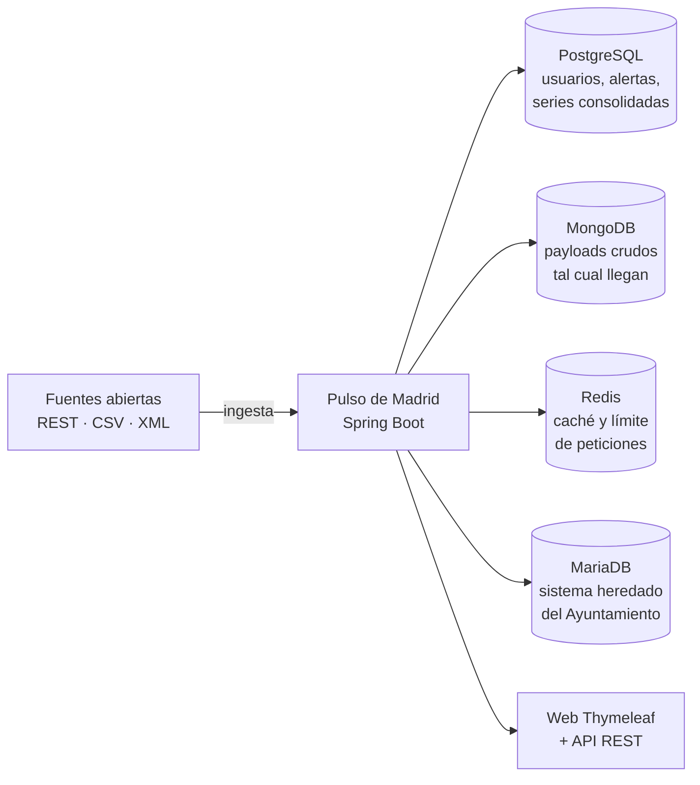

# El proyecto del 2.º trimestre — **Pulso de Madrid**

**80 h · UT7, UT8 y UT9** · Metodología: **aprendizaje basado en retos y proyectos**

El primer trimestre iba de aprender piezas: Java, datos, Spring, JPA, APIs. El segundo va de **construir una sola cosa** y defenderla. No hay prácticas sueltas: hay **un producto**, y cada unidad le añade lo que le falta.

!!! reto "El reto marco"
    > Madrid publica cientos de conjuntos de datos abiertos: calidad del aire, tráfico, bicicletas públicas, incidencias, agenda cultural. Están **dispersos, en formatos distintos y se caen a menudo**.
    >
    > **Construye una plataforma que los reúna, los mantenga vivos y responda preguntas que ninguna fuente sabe responder por separado** — y que siga funcionando, peor pero funcionando, cuando todas las fuentes estén caídas.

Ese enunciado no dice qué clases escribir. Eso es lo que lo hace un **reto** y no un ejercicio: la solución la decides tú, y la defiendes.

## Por qué este proyecto

Cubre los tres RA del trimestre sin forzar nada, porque son exactamente los problemas que aparecen:

| Unidad | RA | Lo que el proyecto obliga a resolver |
|---|:-:|---|
| **UT7** | RA4 | Hay usuarios con perfiles distintos. ¿Sesión o token? ¿Quién puede ver qué? |
| **UT8** | RA8 | Los datos no los consume una máquina: los mira una persona. Hace falta cara |
| **UT9** | RA9 | Las fuentes son ajenas, heterogéneas y poco fiables. Y hay que sacar conocimiento de ellas |

Y de paso toca lo que se pide en cualquier oferta de trabajo de la zona: **contenedores, varias bases de datos y una caché**.

## La arquitectura, y por qué cada pieza

Cuatro almacenes, y ninguno está por capricho. Que cada uno tenga un **para qué** distinto es el objetivo didáctico de la unidad: «repositorios heterogéneos» es literalmente lo que dice el RA9.

| Almacén | Para qué | Por qué no vale otro |
|---|---|---|
| **PostgreSQL** | Lo que tiene esquema y se consulta con criterios: usuarios, suscripciones, alertas, series ya limpias | Necesitas integridad referencial y transacciones |
| **MongoDB** | El JSON **tal como llegó**, sin tocar, con su fecha de captura | Cada fuente trae campos distintos; modelar eso en tablas es pelearse con la realidad |
| **Redis** | Caché de las llamadas externas y límite de peticiones por usuario | Es lo único que aguanta miles de lecturas por segundo y caduca solo |
| **MariaDB** | Un sistema heredado que ya existe y hay que leer sin poder cambiarlo | Es el caso real: nadie empieza de cero |

!!! info "El montaje ya está explicado"
    El `compose.yaml` con las cuatro, sus `healthcheck` y el arranque por orden están en [UT5 · De H2 a producción](../ut5/06-produccion.md) y en la [chuleta de la UT9](../ut9/chuleta.md). Aquí solo se usa.

## Los seis retos

El trimestre son **seis retos encadenados**. Cada uno se abre con una pregunta, no con un guion.

| # | Reto | Unidad | Sesiones | Entregable |
|:-:|---|:-:|:-:|---|
| **R1** | *¿Quién está al otro lado?* | UT7 | S1–S10 | Registro, login y dos perfiles que ven cosas distintas |
| **R2** | *¿Sesión o token? Demuéstralo* | UT7 | S11–S20 | Las dos puertas funcionando y un informe que justifica cuál para qué |
| **R3** | *Esto no lo entiende nadie* | UT8 | S1–S13 | La plataforma con cara: listados, filtros, formularios |
| **R4** | *Que lo use alguien que no sois vosotros* | UT8 | S14–S26 | Prueba con usuarios reales de otro grupo, y arreglar lo que falle |
| **R5** | *Las fuentes mienten y se caen* | UT9 | S1–S17 | Ingesta tolerante a fallos, con las cuatro bases en marcha |
| **R6** | *¿Y esto qué nos dice?* | UT9 | S18–S34 | Cuadro de mando con tres conclusiones que ninguna fuente daba sola |

Cada reto está desarrollado en **[la página de retos](retos.md)**: contexto, pregunta, restricciones, criterios de aceptación y la demo pública con la que se cierra.

## Cómo se trabaja

**Equipos de tres**, fijos durante todo el trimestre, con roles que **rotan cada reto**:

| Rol | Responsabilidad | Lo que NO es |
|---|---|---|
| **Integración** | Que la rama principal compile y los tests estén en verde | No es «el que programa mejor» |
| **Datos** | Esquemas, migraciones, calidad de lo que entra | No es «el que hace el SQL» |
| **Producto** | Que lo entregado responda a la pregunta del reto; prepara la demo | No es «el que no programa» |

Todos programan. El rol dice **de qué respondes**, no qué tecleas.

### El ritmo de la semana

| | |
|---|---|
| **Lunes** | *Arranque del sprint*: 15 min. Qué se va a poder demostrar el viernes |
| **Martes a jueves** | Taller. El profesor no explica de pie: pasa por los equipos |
| **Viernes** | *Demo de 5 minutos* ante la clase + *retro* de 10 min: qué nos frenó |

!!! tip "La demo es innegociable"
    Cinco minutos, con la aplicación en marcha, sin diapositivas. Si no arranca, no hay demo — y eso también es información. La primera vez que le pase a un equipo aprenderán más sobre despliegue que en cualquier explicación.

## Cómo se evalúa

Esto conviene tenerlo claro desde el primer día, porque **el proyecto y la nota no son lo mismo**:

| | Qué evalúa | Peso |
|---|---|---|
| **Examen práctico de cada unidad** | Que **tú, individualmente**, sabes hacerlo | **100 % de la nota de UT7, UT8 y UT9** |
| **El proyecto** | Trabajo en equipo, autonomía, iniciativa y resolución de problemas | **10 % del módulo** vía la [FFE](../index.md) |

El examen práctico de cada unidad es **una extensión del proyecto**, hecha a solas y con tiempo tasado: se te pide añadir algo que encaja con lo que el equipo ya construyó. Así que trabajar el proyecto **es** preparar el examen; no hay dos esfuerzos.

!!! warning "Y esto también hay que decirlo"
    Si en tu equipo el proyecto lo hace uno y los otros dos miran, ese uno aprobará el examen y los otros dos no. El examen es individual y el reparto de trabajo se nota en cuestión de minutos.

## Qué hay que tener el primer día

- [ ] Docker Desktop funcionando (`docker compose version` responde).
- [ ] El repositorio del equipo creado desde la plantilla de GitHub Classroom.
- [ ] La aplicación de la UT6 compilando: **el proyecto parte de ahí**, no de cero.
- [ ] Una cuenta en el portal de datos abiertos y una clave de API pedida.

---

[:material-arrow-right: Los seis retos, en detalle](retos.md){ .md-button .md-button--primary }
[:material-arrow-right: Cómo se defiende cada entrega](defensa.md){ .md-button }
