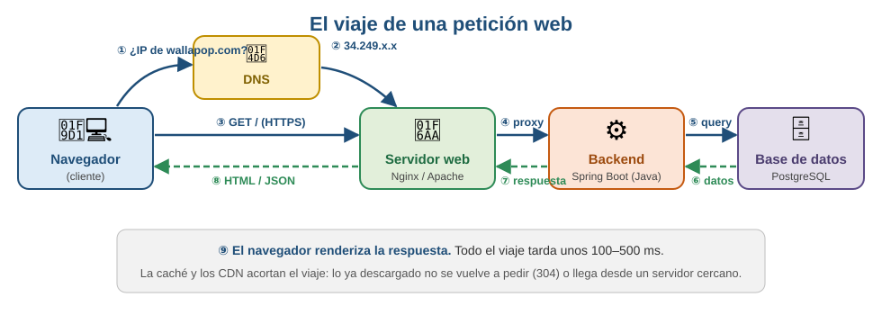

# El viaje de una petición

Escribes `wallapop.com`, pulsas Enter y medio segundo después estás viendo patinetes de segunda mano. En ese medio segundo ha pasado esto:

*Imagen: J. L. González — repo DWES 01 ([CC BY-NC-SA 4.0](https://creativecommons.org/licenses/by-nc-sa/4.0/))*

*Imagen: J. L. González — repo DWES 01 ([CC BY-NC-SA 4.0](https://creativecommons.org/licenses/by-nc-sa/4.0/))*

Cada componente tiene un papel que conviene aprender desde el primer día:

| Componente | Qué hace | Ejemplos |
|------------|----------|----------|
| **Navegador (cliente)** | Construye la petición y renderiza la respuesta | Chrome, Firefox, Safari |
| **DNS** | Traduce el dominio a una IP | — |
| **Servidor web** | Puerta de entrada: sirve estáticos y reparte el resto | Nginx, Apache |
| **Backend** | Ejecuta *nuestra* lógica: decide qué responder | Spring Boot, Node, Django |
| **Base de datos** | Guarda y devuelve la información persistente | PostgreSQL, MongoDB |

*Imagen: J. L. González — repo DWES 01 ([CC BY-NC-SA 4.0](https://creativecommons.org/licenses/by-nc-sa/4.0/))*

Dos actores secundarios que están en casi todas las webs reales: la **caché** (lo ya descargado no se vuelve a pedir: por eso la segunda visita carga más rápido, y por eso verás códigos `304 Not Modified`) y el **CDN** (copias de los ficheros estáticos repartidas por el mundo; el vídeo de Netflix no viene de California, viene de un servidor de tu operador).

> **Idea fuerza:** una página no "está" en ningún sitio esperándote: se **decide y se construye** en el momento en que la pides. Este módulo va de programar la parte que la construye.

### Pruébalo ahora (5 min)

!!! reto "Trabaja tú ahora"
    Este bloque se hace **en clase, en tu equipo**. No se entrega ni puntúa: es la práctica que hace que el examen te salga.
Abre cualquier web con `F12 → Network` y recarga.
1. Cuenta las peticiones: para "una página" suelen salir **50–150**.
2. Filtra por tipo: documento, CSS, JS, imágenes y **Fetch/XHR** (¡esas son llamadas a APIs!).
3. Recarga otra vez y busca códigos `304`: eso es la caché trabajando.

---

## Ejercicios (con solución)

### Ejercicio 1 — Pon el viaje en orden

Ordena estos pasos: *(a)* el navegador pinta la página · *(b)* el servidor consulta la base de datos · *(c)* el DNS traduce el nombre a una dirección IP · *(d)* se abre la conexión TLS · *(e)* el servidor devuelve el HTML · *(f)* el navegador pide los CSS, JS e imágenes que ha encontrado dentro.

??? success "Solución"

    **c → d → b → e → f → a**, con un matiz importante en el orden de los dos últimos.

    1. **(c) DNS.** `www.ejemplo.es` no significa nada para la red: hay que traducirlo a una IP.
    2. **(d) TLS.** Se abre la conexión cifrada, con el saludo y la comprobación del certificado.
    3. **(b) La consulta.** El servidor recibe la petición y busca lo que necesita.
    4. **(e) El HTML** sale por la red.
    5. **(f) Los recursos.** El navegador *lee* el HTML, encuentra `<link>`, `<script>` e `` y lanza **decenas de peticiones nuevas**.
    6. **(a) Pinta.** Y en realidad va pintando mientras llegan, no al final.

    Lo que hay que quedarse: **una página no es una petición, son decenas o cientos**. Por eso en la pestaña Red salen 50-150 líneas.

### Ejercicio 2 — ¿Qué tarda de verdad?

Una página tarda 2,3 segundos en cargar. Di qué mirarías primero y por qué.

??? success "Solución"

    **La primera petición, la del documento HTML**, y dentro de ella el **TTFB** (*time to first byte*): cuánto tarda el servidor en empezar a responder.

    De ahí salen dos diagnósticos muy distintos:

    | Lo que ves | Qué significa |
    |---|---|
    | TTFB alto (>500 ms), resto rápido | **El servidor es el problema.** Consultas lentas, un N+1, una llamada a un tercero |
    | TTFB bajo, la página tarda igual | **El problema está en el navegador.** Demasiados recursos, imágenes enormes, JavaScript que bloquea |

    Es la primera bifurcación de cualquier diagnóstico de rendimiento, y se decide con un dato, no con una intuición.

    Si el TTFB es alto, lo siguiente es mirar el log del servidor: casi siempre es una consulta.

### Ejercicio 3 — Los códigos 304

En la segunda recarga aparecen muchos `304`. ¿Qué significan y por qué son buena señal?

??? success "Solución"

    **304 Not Modified**: el navegador ya tenía ese fichero guardado, preguntó *«¿ha cambiado?»* y el servidor contestó *«no»*. El cuerpo **no viaja**: solo las cabeceras.

    Es buena señal porque significa que la caché funciona. Cada 304 es un fichero que no se ha vuelto a descargar.

    Se puede afinar más:

    - **304**: hubo viaje a la red, pero sin descargar el contenido. Ahorras ancho de banda, no la latencia.
    - **200 (from disk cache)**: ni siquiera preguntó. Ahorras las dos cosas. Es lo que consigue la huella en el nombre del fichero que se ve en la UT8.

    Si en la segunda recarga **no** sale ningún 304, no hay caché configurada, y todos los usuarios se están bajando el mismo CSS una y otra vez.

### Ejercicio 4 — Las peticiones Fetch/XHR

Filtras por Fetch/XHR y salen 12 peticiones. ¿Qué te dice eso de esa web?

??? success "Solución"

    Que **parte del contenido no venía en el HTML**: lo pide el JavaScript después de cargar la página.

    Si abres el HTML original —botón derecho, «Ver código fuente»— esos datos no están. Llegaron en esas 12 llamadas, en JSON.

    Es la señal de que hay **una API detrás**, y de que la web mezcla las dos formas de construir páginas que se ven en la UT8. También explica dos cosas que se notan al usarla:

    - **La página aparece antes que sus datos.** Primero el esqueleto, luego el contenido.
    - **Si esas llamadas fallan**, la página se ve pero sin datos.

    Para ti hay un aprendizaje directo: **el servidor que sirve la web y el que sirve los datos pueden ser el mismo o no**, y en este módulo vas a escribir los dos.

### Ejercicio 5 — 150 peticiones

¿Por qué "una página" son 50-150 peticiones, y qué consecuencia tiene?

??? success "Solución"

    Porque el HTML solo trae **el texto y las referencias**. Todo lo demás se pide aparte: cada hoja de estilos, cada script, cada tipografía, cada imagen, cada icono, más las llamadas a APIs y los de analítica y publicidad.

    Las consecuencias:

    1. **Cada petición tiene un coste fijo** aunque el fichero sea diminuto. Por eso se juntan los CSS en uno y los iconos en un *sprite* o en SVG en línea.
    2. **El orden importa.** Un `<script>` en la cabecera sin `defer` **para el pintado** hasta que se descarga y ejecuta.
    3. **Tu servidor recibe todas.** Si sirves los estáticos desde la misma aplicación, cada visita son 100 peticiones a tu Spring Boot. De ahí que en producción se pongan detrás de un servidor web o de una red de distribución.

    Y una que se ve en la UT9: **si la página llama a tres APIs de terceros, tu página tarda lo que tarde la más lenta de las tres.**
