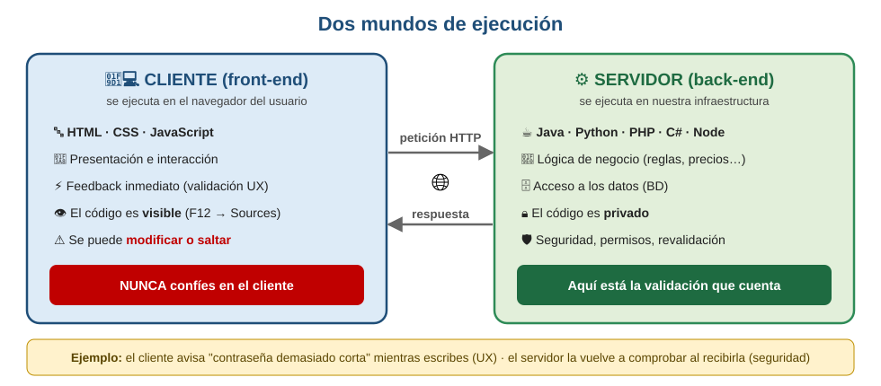
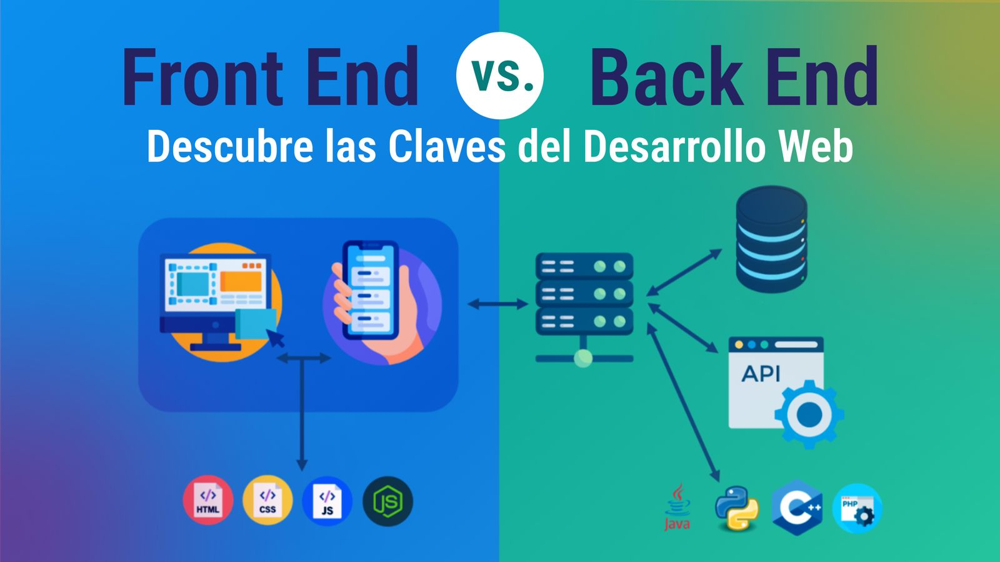

# Dos mundos: cliente y servidor

Todo el código de una aplicación web vive en uno de estos dos mundos:

*Imagen: J. L. González — repo DWES 01 ([CC BY-NC-SA 4.0](https://creativecommons.org/licenses/by-nc-sa/4.0/))*

**La regla de oro: nunca confíes en el cliente.** El código del navegador corre en una máquina que no controlas: cualquiera puede leerlo (F12), modificarlo, o directamente saltárselo y llamar al servidor con `curl`. Por tanto:

- Validar en el cliente **sí**, como cortesía: feedback inmediato sin esperar al servidor.
- Validar en el servidor **siempre**: es la única validación que cuenta. Precios, permisos, stock, formatos… todo se revalida al llegar.

**Ejemplo real:** si el precio del carrito solo lo comprobara el cliente, bastaría editar el HTML para comprar un portátil de 1.200 € por 12 €. Ha pasado. Muchas veces.

### Analogía: el restaurante
Tú (cliente) pides de la carta; el camarero (HTTP) lleva la comanda sin cocinar nada; la cocina (backend) comprueba la despensa (BD), cocina y entrega. Y aunque el comensal escriba en la comanda "esto es gratis"… **la caja la lleva la cocina**.

### Página ≠ aplicación

*Imagen: J. L. González — repo DWES 01 ([CC BY-NC-SA 4.0](https://creativecommons.org/licenses/by-nc-sa/4.0/))*

- **Página web:** un documento que se muestra. **Estática** (ficheros fijos, iguales para todos: un portafolio) o **dinámica** (el servidor la genera al vuelo: un periódico).
- **Aplicación web:** una **herramienta** con usuarios, estado y acciones (Gmail, Google Docs, el campus virtual). Siempre requiere servidor.

### Pruébalo ahora (2 min)

!!! reto "Trabaja tú ahora"
    Este bloque se hace **en clase, en tu equipo**. No se entrega ni puntúa: es la práctica que hace que el examen te salga.
Clasifica: Wikipedia · Google Docs · un portafolio en GitHub Pages · Netflix · el blog de recetas de tu tía.
??? note "Respuesta"

    Página dinámica · Aplicación · Página estática · Aplicación · Página dinámica sencilla (WordPress).

---

## Ejercicios (con solución)

### Ejercicio 1 — ¿Dónde se ejecuta?

Di si ocurre en el cliente o en el servidor: *(a)* validar que el correo tiene arroba · *(b)* comprobar la contraseña · *(c)* ordenar una tabla al pulsar la cabecera · *(d)* calcular el total de un pedido · *(e)* animar un menú al pasar el ratón · *(f)* decidir si un usuario puede borrar algo.

??? success "Solución"

    | | Dónde | Matiz |
    |---|---|---|
    | (a) validar el correo | **En los dos** | En el cliente para avisar rápido; en el servidor porque es el que cuenta |
    | (b) la contraseña | **Servidor, solo** | Si se comprobara en el cliente, el cliente conocería la contraseña buena |
    | (c) ordenar la tabla | **Cualquiera de los dos** | Si están las 20 filas, en el cliente. Si son 20.000 paginadas, en el servidor |
    | (d) el total del pedido | **Servidor** | El precio lo pone el servidor. Si lo calcula el cliente, se manipula |
    | (e) la animación | **Cliente** | Es presentación pura |
    | (f) los permisos | **Servidor, siempre** | Ocultar el botón no es proteger la ruta |

    **La regla:** todo lo que, si se falsea, te perjudica —precios, permisos, identidad, validaciones— va en el servidor. El cliente decide sobre lo que solo le afecta a él.

### Ejercicio 2 — Página, página dinámica y aplicación

Explica la diferencia con un ejemplo de cada una.

??? success "Solución"

    - **Página estática.** El servidor devuelve un fichero que ya existía en el disco. Igual para todo el mundo. *Ejemplo: un portafolio en GitHub Pages.*
    - **Página dinámica.** El HTML **se genera en el momento** con datos de una base de datos. Cambia según quién mire y cuándo. *Ejemplo: Wikipedia, o un blog en WordPress.*
    - **Aplicación web.** Además de generar contenido, mantiene **estado y sesión**, y el usuario trabaja dentro. *Ejemplo: Google Docs.*

    La frontera entre las dos últimas es borrosa a propósito, y la pregunta que la aclara es: **¿el usuario consulta o trabaja?**

    Lo importante del módulo: **«dinámica» no significa «que se mueve»**. Una página con animaciones y carrusel puede ser perfectamente estática. Dinámica significa *generada en el servidor a partir de datos*.

### Ejercicio 3 — El restaurante

Sigue la analogía: si el servidor es la cocina y el navegador el comedor, ¿qué son la carta, el camarero, la comanda y la cuenta?

??? success "Solución"

    | En el restaurante | En la web |
    |---|---|
    | **La carta** | El HTML que llega: lo que se puede pedir y cómo se ve |
    | **El camarero** | El protocolo HTTP: lleva y trae, y no cocina |
    | **La comanda** | La petición: método, ruta y datos del formulario |
    | **La cuenta** | La respuesta: código de estado y cuerpo |
    | **La cocina** | El servidor: ahí está la receta y ahí están los ingredientes |
    | **La despensa** | La base de datos |

    Y donde la analogía enseña de verdad:

    - **El cliente no entra en la cocina.** Puede pedir lo que quiera, pero no decide cómo se cocina ni qué hay en la despensa. Por eso los permisos se comprueban dentro.
    - **El camarero no recuerda.** HTTP no tiene memoria entre peticiones: cada comanda llega sola. Lo que hace que te reconozcan es el número de mesa, que es la sesión de la UT7.

### Ejercicio 4 — Clasifica

Clasifica y justifica: Wikipedia · Google Docs · un portafolio en GitHub Pages · Netflix · el blog de recetas de tu tía en WordPress.

??? success "Solución"

    | | Qué es | Por qué |
    |---|---|---|
    | **Wikipedia** | Página dinámica | El artículo sale de una base de datos y cambia con cada edición. Se consulta, no se trabaja |
    | **Google Docs** | Aplicación | Estado, sesión, edición en tiempo real entre varios |
    | **Portafolio en GitHub Pages** | Página estática | Ficheros servidos tal cual. GitHub Pages ni siquiera puede ejecutar código de servidor |
    | **Netflix** | Aplicación | Sesión, perfiles, recomendaciones propias, reproducción con estado |
    | **Blog en WordPress** | Página dinámica | Se genera con PHP desde la base de datos, aunque quien escribe no programe nada |

    El caso que hace pensar es el portafolio: puede tener animaciones y modo oscuro y **sigue siendo estático**, porque nada se genera en el servidor.

### Ejercicio 5 — ¿Por qué HTTP no recuerda?

HTTP no guarda memoria entre peticiones. ¿Es un fallo de diseño? ¿Y cómo se apaña entonces una tienda con carrito?

??? success "Solución"

    **No es un fallo: es la decisión que hizo que la web funcionara a escala.** Si cada servidor tuviera que recordar a cada visitante, no se podrían poner diez servidores detrás de un repartidor de carga: cada petición tendría que volver siempre al mismo.

    Al no recordar nada, **cualquier servidor puede atender cualquier petición**. Eso es lo que permite crecer.

    El carrito se resuelve haciendo que **el cliente traiga su identificador en cada petición**:

    1. El servidor crea una sesión y manda una cookie con un identificador.
    2. El navegador la devuelve en **cada** petición siguiente.
    3. El servidor busca esa sesión y recupera el carrito.

    El estado sigue existiendo; lo que cambia es que **el protocolo no lo lleva, lo lleva el dato que viaja**. Y por eso la sesión se guarda fuera del proceso —en Redis, como se ve en la UT9— cuando hay varias instancias.

    Es toda la UT7 en cuatro líneas.
