# Arquitecturas: cómo se organiza el software en 2026

> Ya sabes *qué* componentes hay (navegador, servidor web, backend, BD). La **arquitectura** decide cómo se organizan por dentro y entre sí. Es la decisión más cara de cambiar después, así que merece pensarse. En esta página: las arquitecturas que un desarrollador debe conocer hoy, cuándo usar cada una y el patrón MVC que usaremos todo el curso.

## 1. Cliente-servidor: la base de todo

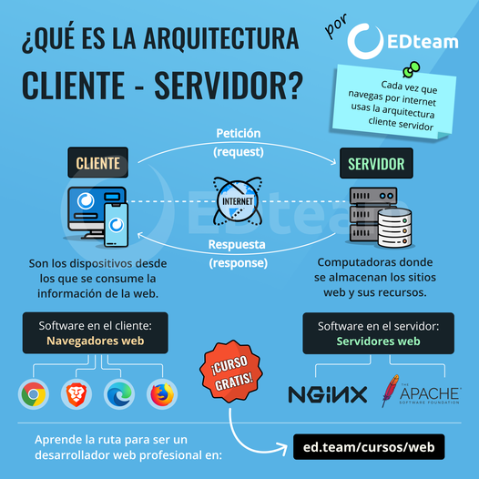
*Imagen: J. L. González — repo DWES 01 ([CC BY-NC-SA 4.0](https://creativecommons.org/licenses/by-nc-sa/4.0/))*


Uno o varios **clientes** piden servicios a un **servidor**. Sencillo, pero con consecuencias:

**Ventajas:** control centralizado (accesos, datos e integridad en un sitio), escalabilidad (cliente y servidor crecen por separado), portabilidad (el cliente es un navegador: da igual el SO) y mantenimiento (reparas o migras el servidor sin tocar a los clientes — *encapsulación*).

**Riesgos:** congestión si muchos clientes piden a la vez, **punto único de fallo** (si cae el servidor, no hay servicio) y coste de infraestructura. Se mitigan con **escalado** y **redundancia** (lo verás en la página de servidores).

### De 2 a 3 capas (tiers)

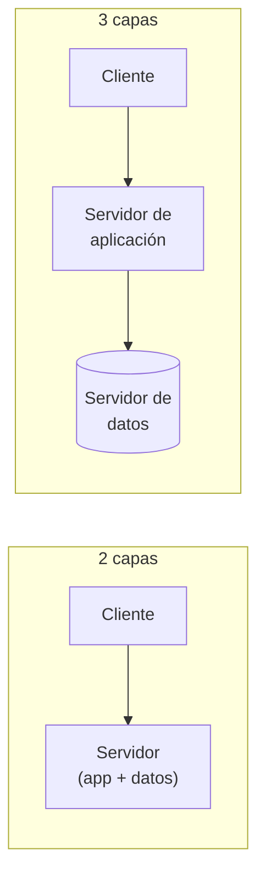

La web moderna es, como mínimo, de **3 capas físicas**: presentación (navegador), aplicación (backend) y datos (BD). Separar los datos en su propia máquina permite protegerlos, escalarlos y respaldarlos de forma independiente.

## 2. El catálogo de arquitecturas de aplicación

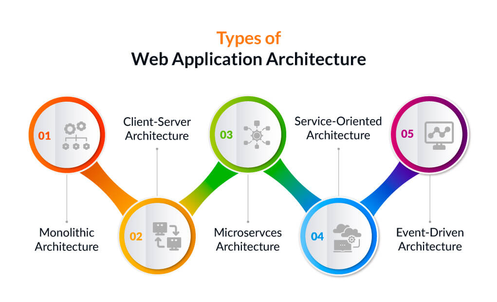
*Imagen: J. L. González — repo DWES 01 ([CC BY-NC-SA 4.0](https://creativecommons.org/licenses/by-nc-sa/4.0/))*


### 2.1. Monolito: todo en un bloque

Una sola aplicación, un solo despliegue, un solo proceso: UI + lógica + datos juntos.

- :material-check: Simple de desarrollar, probar y desplegar. Comunicación interna en memoria (rápida). Ideal para empezar.
- :material-close: Al crecer: cualquier cambio obliga a redesplegar todo, un fallo puede tumbarlo todo, y no puedes escalar solo la parte caliente (si el catálogo recibe el 90 % del tráfico, escalas la app entera).

### 2.2. Monolito modular: el término medio que domina 2026

El gran redescubrimiento de los últimos años: **un solo despliegue, pero con módulos internos bien separados** (catálogo, pedidos, usuarios…), cada uno con fronteras claras, hablándose por interfaces.

- Mantiene la simplicidad operativa del monolito (una app, una BD, un despliegue).
- Prepara el terreno: si un día un módulo necesita vivir aparte, se extrae a servicio con poco dolor.
- Es la recomendación por defecto hoy para la mayoría de equipos: *"monolito modular primero; microservicios cuando duela"*.

### 2.3. Arquitectura en capas (layers)

Dentro de una aplicación (monolito o servicio), el código se organiza en **capas lógicas** con responsabilidad única:

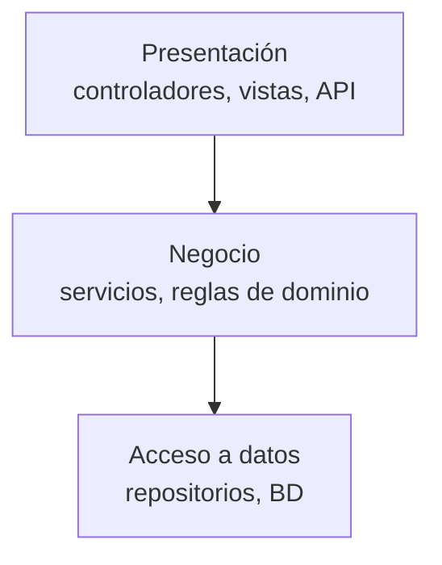

Cada capa solo habla con la adyacente a través de interfaces. Beneficios: cambias la BD sin tocar el negocio, testeas el negocio sin arrancar la web y repartes el trabajo por capas. **Así estructuraremos nuestros proyectos Spring** (controller → service → repository).

Una evolución que verás en ofertas de empleo: la **arquitectura hexagonal** (*ports & adapters*): el dominio de negocio en el centro, y todo lo externo (web, BD, colas) conectado por "puertos". Es la idea de capas llevada al extremo de proteger el núcleo.

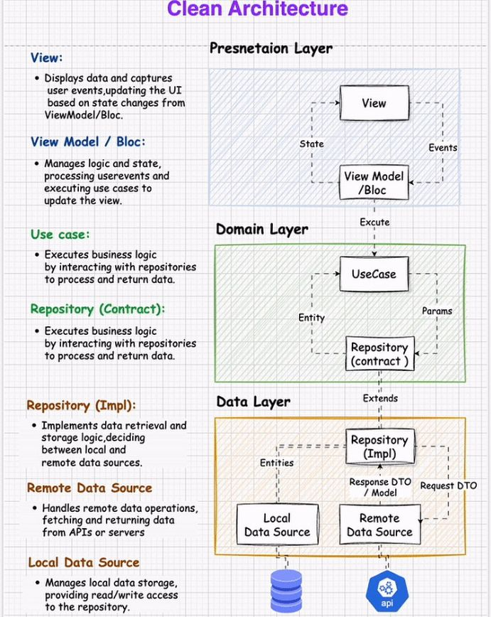
*Imagen: J. L. González — repo DWES 01 ([CC BY-NC-SA 4.0](https://creativecommons.org/licenses/by-nc-sa/4.0/))*


### 2.4. Microservicios: piezas autónomas

La aplicación se descompone en **servicios pequeños e independientes**, cada uno con una responsabilidad de negocio, su propio despliegue y (idealmente) **su propia base de datos**. Se comunican por red (REST, gRPC o eventos).

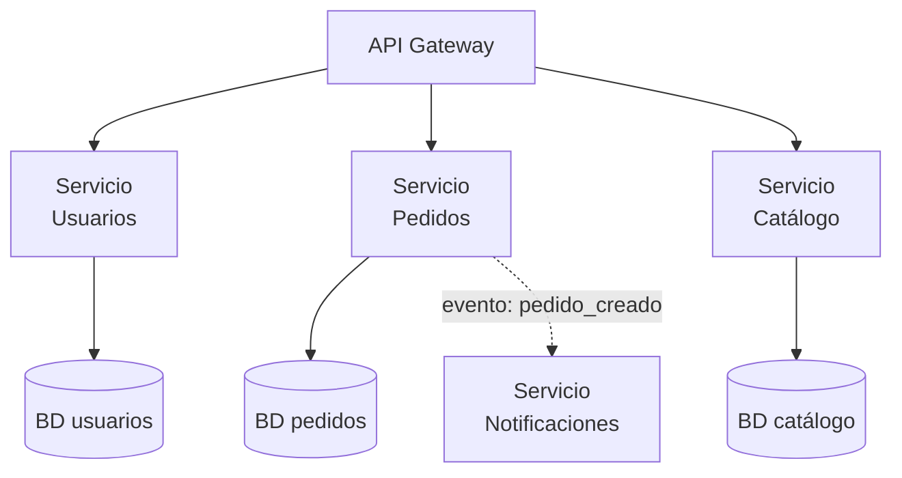

Piezas que acompañan siempre a los microservicios (vocabulario imprescindible):

| Pieza | Qué resuelve |
|-------|--------------|
| **API Gateway** | Puerta única de entrada: enruta a cada servicio, autentica, limita tráfico |
| **Balanceador de carga** | Reparte peticiones entre las copias de un servicio |
| **Descubrimiento de servicios** | Cómo se encuentran los servicios entre sí (las IPs cambian) |
| **Observabilidad** | Logs, métricas y trazas distribuidas: sin esto, depurar es imposible |

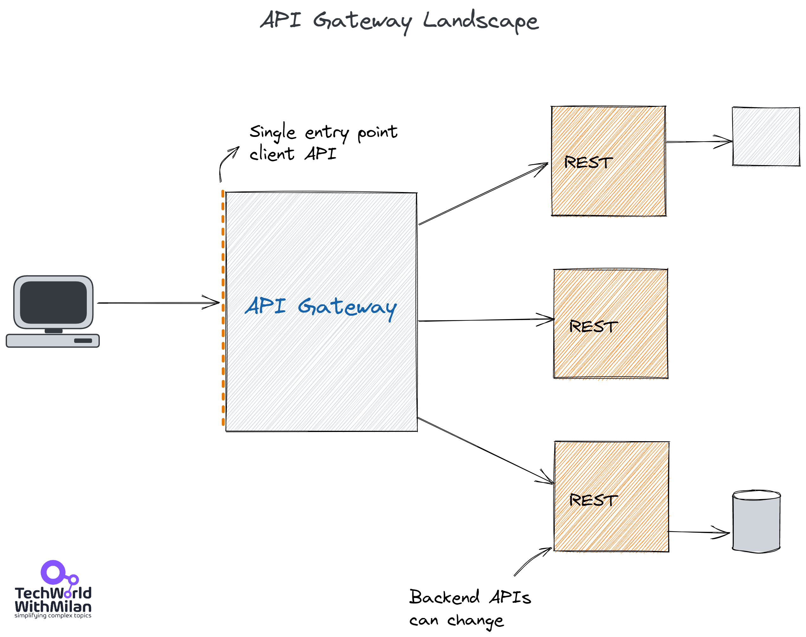
*Imagen: J. L. González — repo DWES 01 ([CC BY-NC-SA 4.0](https://creativecommons.org/licenses/by-nc-sa/4.0/))*

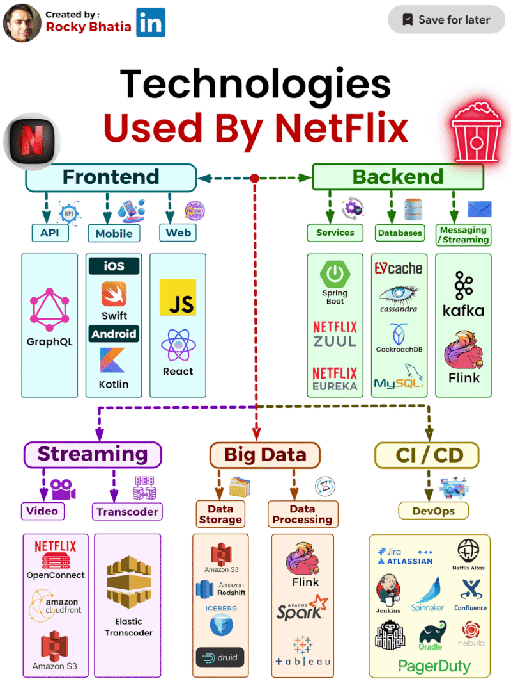
*Imagen: J. L. González — repo DWES 01 ([CC BY-NC-SA 4.0](https://creativecommons.org/licenses/by-nc-sa/4.0/))*


- :material-check: Escalado y despliegue **por servicio**; equipos autónomos; fallos aislados; cada servicio puede usar la tecnología que le convenga.
- :material-close: Complejidad enorme: red entre servicios (latencia, fallos parciales), transacciones repartidas y automatización obligatoria (Docker/Kubernetes/CI-CD) desde el día uno. **Netflix, Amazon o Cabify los necesitan; una app de 5.000 usuarios, no.**

### 2.5. Arquitectura orientada a eventos (EDA)

Los componentes no se llaman entre sí: **emiten eventos** ("pedido_creado") a un intermediario (*broker*: Kafka, RabbitMQ) y otros **se suscriben** y reaccionan. Máximo desacoplo y asincronía: el servicio de emails puede caerse 5 minutos y procesar los eventos pendientes al volver. Convive con microservicios en casi todos los sistemas grandes.

### 2.6. Serverless (FaaS)

Escribes **funciones** sueltas; la nube (AWS Lambda, etc.) las ejecuta cuando llega una petición o un evento, escala sola y pagas por ejecución. Perfecto para tareas esporádicas (redimensionar imágenes, atender un webhook). Contras: *arranque en frío*, límites de tiempo y atadura al proveedor (*vendor lock-in*).

### 2.7. Tabla resumen: elegir con criterio

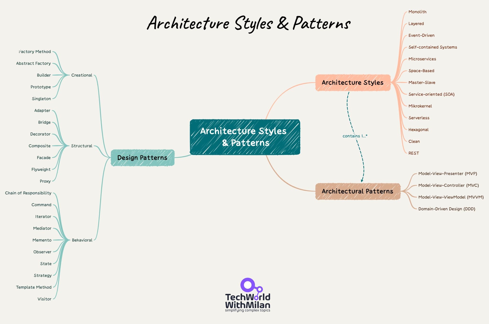
*Imagen: J. L. González — repo DWES 01 ([CC BY-NC-SA 4.0](https://creativecommons.org/licenses/by-nc-sa/4.0/))*


| | Monolito | Monolito modular | Microservicios | Serverless | EDA |
|---|---|---|---|---|---|
| Complejidad inicial | Muy baja | Baja | **Alta** | Media | Alta |
| Escalado fino | :material-close: | :material-close: | :material-check: por servicio | :material-check: automático | :material-check: |
| Aislamiento de fallos | :material-close: | Parcial | :material-check: | :material-check: | :material-check: |
| Equipos independientes | :material-close: | Parcial | :material-check: | :material-check: | :material-check: |
| Coste operativo | Bajo | Bajo | **Alto** | Pago por uso | Alto |
| Ideal para | MVP, apps pequeñas | **La mayoría de proyectos** | Sistemas grandes, muchos equipos | Tareas esporádicas | Integraciones asíncronas |

> **La regla del desarrollador con criterio:** empieza con un **monolito modular en capas**. Los microservicios no son "lo moderno": son la solución a un problema de *escala organizativa* (muchos equipos, mucho tráfico) que quizá nunca tengas. Adoptarlos sin ese problema es pagar su complejidad a cambio de nada.

### Analogía
Monolito = **navaja suiza**: todo en uno, cómoda; si se rompe el eje, se rompe todo. Microservicios = **caja de herramientas**: piezas independientes y reemplazables, pero pesa y hay que mantenerla ordenada. Monolito modular = navaja suiza **desmontable**.

## 3. MVC: el patrón que usaremos todo el curso

Dentro de la aplicación, el patrón de organización rey es **Modelo–Vista–Controlador**, hoy siempre acompañado de una capa de **Servicios**:

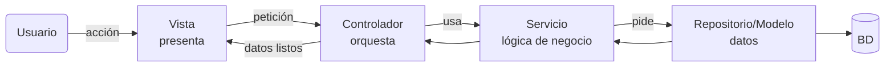

- **Modelo/Repositorio:** la información y el acceso a ella.
- **Servicio:** la lógica de negocio (reglas, cálculos, decisiones).
- **Controlador:** recibe la petición, delega y responde. **Solo orquesta.**
- **Vista:** presenta los datos (HTML con plantillas, o JSON si es una API).

:material-alert: **El error clásico — Fat Controller:** meter lógica de negocio en el controlador. Señal de alarma: un método de controlador de más de ~15 líneas. El controlador ideal tiene 3: recibir → delegar al servicio → responder.

**Ejemplo del flujo "dar like":** la Vista envía `POST /posts/123/like` → el Controlador comprueba que hay usuario y llama a `likeService.dar(123, usuario)` → el Servicio aplica reglas (¿ya dio like? ¿post bloqueado?) y persiste vía Repositorio → vuelve el nuevo total → la Vista actualiza el contador.

## 4. SOLID: cinco principios en cinco frases

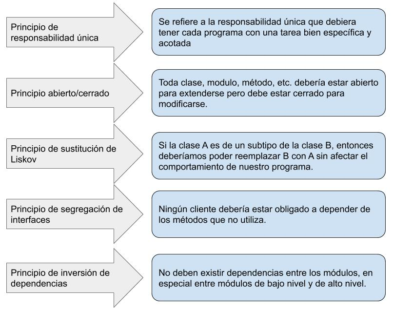
*Imagen: J. L. González — repo DWES 01 ([CC BY-NC-SA 4.0](https://creativecommons.org/licenses/by-nc-sa/4.0/))*


Los aplicaremos al programar en Spring; hoy basta con reconocerlos:

| Principio | En una frase | Ejemplo rápido |
|-----------|--------------|----------------|
| **S**RP | Una clase, una responsabilidad | `FacturaService` calcula; `FacturaPdf` imprime. No una clase para ambas |
| **O**CP | Abierto a extensión, cerrado a modificación | Añadir un método de pago sin tocar los existentes |
| **L**SP | Una subclase debe poder sustituir a su padre | Si `Ave` tiene `volar()`, `PatoDeGoma` no debería heredarla |
| **I**SP | Interfaces pequeñas y específicas | Mejor `Imprimible` + `Escaneable` que una `MultifuncionGigante` |
| **D**IP | Depende de abstracciones, no de implementaciones | El servicio usa la interfaz `Repositorio`, no `RepositorioMySQL` — esta es la **inyección de dependencias** de Spring |

---

## Ejercicios (con solución)

### Ejercicio 1 — Analista de arquitecturas
Para cada caso, elige arquitectura y justifica con 2 razones + 1 riesgo:
1. App de citas de una peluquería (2 usuarios, presupuesto mínimo).
2. Plataforma de banca con módulos (cuentas, préstamos, tarjetas) y 12 equipos.
3. MVP de startup que sale en 3 semanas y aún no sabe si tendrá clientes.
4. Sistema que redimensiona las fotos que suben los usuarios (picos: 0 de noche, miles al mediodía).
5. Tienda online mediana (50.000 usuarios/mes) con un equipo de 4 personas.

??? success "Solución"

    1. **Monolito** — simple y barato; sin necesidad de escalar. Riesgo: refactor si crece (asumible).
    2. **Microservicios** — equipos autónomos, despliegue independiente, fallos aislados. Riesgo: coste operativo alto (justificado por la escala).
    3. **Monolito** — velocidad máxima; la deuda solo se paga si hay éxito. Riesgo: deuda técnica.
    4. **Serverless** — carga esporádica con picos = pago por uso y escalado automático. Riesgo: arranque en frío y lock-in.
    5. **Monolito modular en capas** — 4 personas no pueden operar microservicios; los módulos preparan el futuro. Riesgo: disciplina para mantener las fronteras.


### Ejercicio 2 — ¿Dónde va cada cosa? (MVC + capas)
Ubica cada responsabilidad en **Controlador**, **Servicio**, **Repositorio** o **Vista**:
(a) comprobar que el DNI es válido antes de guardar · (b) el SQL que inserta el cliente · (c) decidir si un pedido tiene envío gratis (>50 €) · (d) pintar el precio en rojo si hay oferta · (e) leer el parámetro `id` de la URL y devolver 404 si no existe · (f) enviar el email de bienvenida tras registrarse.

??? success "Solución"

    (a) <b>Servicio</b> (la Vista puede avisar antes, pero la validación que cuenta va aquí) · (b) <b>Repositorio</b> · (c) <b>Servicio</b> (regla de negocio) · (d) <b>Vista</b> (presentación) · (e) <b>Controlador</b> (gestión de petición/respuesta) · (f) <b>Servicio</b> (orquesta la lógica; el envío real puede delegarlo).


### Ejercicio 3 — Detecta el Fat Controller
Este código (Java) tiene un problema de arquitectura. Identifícalo y propón el reparto correcto:

```java
@PostMapping("/pedidos")
public Pedido crear(DatosPedido datos) {
    double total = 0;
    for (var linea : datos.lineas()) {
        double precio = linea.precio() * linea.cantidad();
        if (linea.cantidad() > 10) precio *= 0.9;   // descuento por volumen
        total += precio;
    }
    if (total > 50) datos = datos.conEnvioGratis();
    for (var linea : datos.lineas())
        if (!almacen.hayStock(linea)) throw new SinStockException();
    var pedido = repositorio.guardar(new Pedido(datos, total));
    emails.enviarConfirmacion(pedido);
    return pedido;
}
```

??? success "Solución"

    Es un <b>Fat Controller</b>: descuentos, envío gratis, stock y email son <b>lógica de negocio</b>. Reparto correcto: el controlador queda en <code>return pedidoService.crear(datos);</code> y <code>PedidoService.crear()</code> orquesta: calcula el total, valida stock, guarda vía repositorio y dispara la confirmación. Beneficio: la lógica se testea sin arrancar la web y se reutiliza desde otros puntos de entrada.


### Ejercicio 4 — Arquitectura de un producto real
Elige un producto que uses (streaming, delivery, banca…) y entrega: (1) diagrama Mermaid con gateway/servicios/BD que imagines; (2) ¿monolito o microservicios? ¿por qué llegaron ahí?; (3) un evento que probablemente viaje por su sistema.

??? success "Ejemplo de solución (delivery)"

    ```mermaid
    flowchart TD
        G[API Gateway] --> U[Usuarios] & R[Restaurantes] & P[Pedidos] & Rep[Repartidores]
        P -. "pedido_creado" .-> N[Notificaciones]
        P -. "pedido_creado" .-> Rep
    ```
    Microservicios: millones de usuarios, equipos por dominio y picos a mediodía que exigen escalar "Pedidos" sin tocar el resto. Evento típico: <code>pedido_creado</code> → lo consumen Notificaciones (aviso al restaurante) y Repartidores (asignación).


---

## Pruébalo ahora (10 min)

!!! reto "Trabaja tú ahora"
    Este bloque se hace **en clase, en tu equipo**. No se entrega ni puntúa: es la práctica que hace que el examen te salga.
Busca **"Netflix tech blog"** o **"Uber engineering blog"** y hojea 5 minutos un artículo de arquitectura real. No hace falta entenderlo todo: identifica cuántas piezas de esta página (gateway, balanceador, eventos, servicios, observabilidad) aparecen, y anota dos. Acabas de leer ingeniería de verdad.
