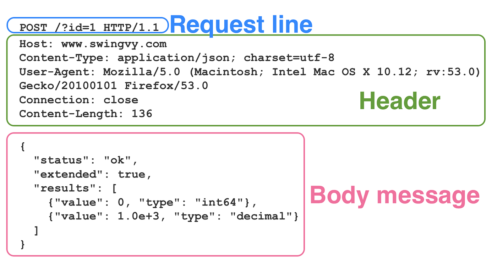
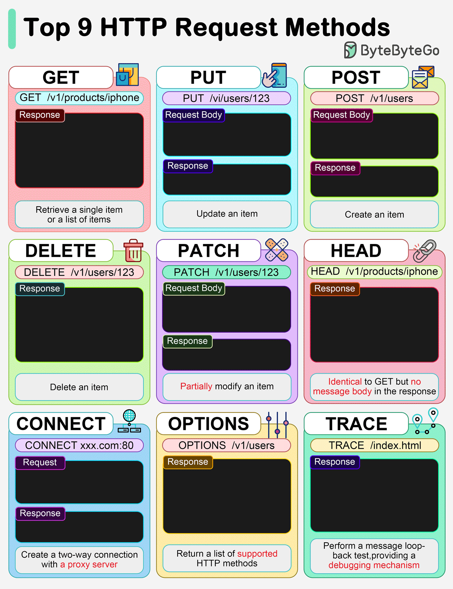
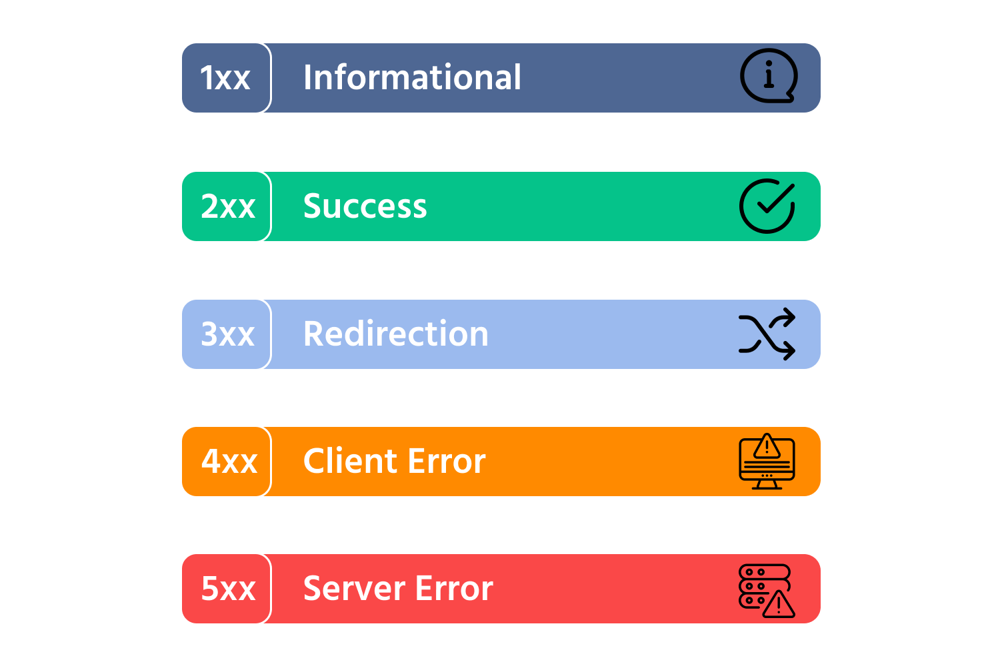
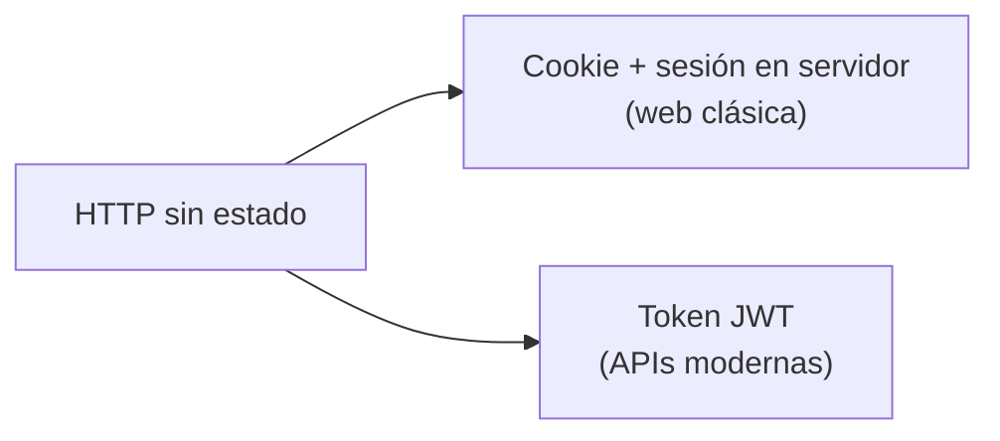
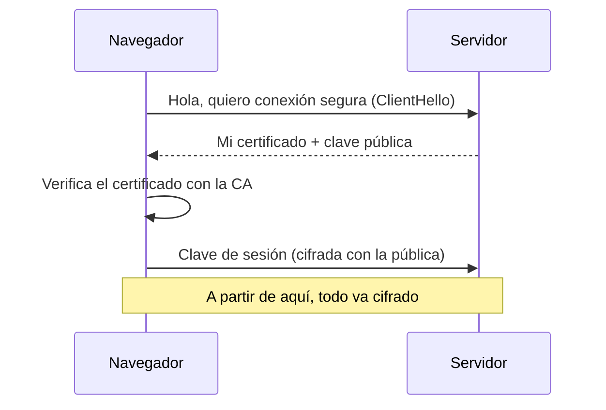
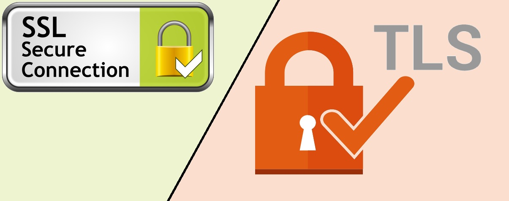

# HTTP a fondo: el idioma de la web

> Todo lo que has visto hasta ahora se comunica con un único protocolo: **HTTP**. Dominarlo no es opcional: es el idioma en el que trabajarás cada día. En esta página lo abrimos en canal: mensajes, métodos, códigos, cabeceras, cookies, versiones y HTTPS.

## 1. Tres propiedades que lo explican todo

1. **Es texto** (legible): puedes escribir una petición a mano y leer la respuesta.
2. **Es extensible**: las cabeceras permiten añadir metadatos sin cambiar el protocolo.
3. **Es sin estado (*stateless*)**: cada petición es independiente; el servidor **no recuerda** la anterior.

!!! analogia "Analogía Dory"
    el servidor tiene memoria de pez. Si quieres que te recuerde entre peticiones, pégate una nota en la frente — una **cookie** o un **token** — que viajará en cada petición.

## 2. Anatomía de los mensajes

Una conversación HTTP completa, pieza a pieza:

``` { .text .sinajuste }
→ PETICIÓN
┌─────────────────────────────────────────────┐
│ GET /productos/42 HTTP/1.1        ← línea de petición: MÉTODO + RUTA + VERSIÓN
│ Host: tienda.com                  ← cabeceras (metadatos)
│ Accept: application/json
│ Authorization: Bearer eyJhbG...
│ User-Agent: Mozilla/5.0 ...
│                                   ← línea en blanco
│ (cuerpo: vacío en un GET)         ← body (en POST/PUT lleva los datos)
└─────────────────────────────────────────────┘

← RESPUESTA
┌─────────────────────────────────────────────┐
│ HTTP/1.1 200 OK                   ← línea de estado: VERSIÓN + CÓDIGO + TEXTO
│ Content-Type: application/json    ← cabeceras
│ Content-Length: 78
│ Cache-Control: max-age=3600
│                                   ← línea en blanco
│ {"id":42,"nombre":"Patinete","precio":120.0}   ← body
└─────────────────────────────────────────────┘
```

### Las cabeceras que usarás de verdad

| Cabecera | Dirección | Para qué |
|----------|-----------|----------|
| `Host` | → | A qué dominio va la petición (permite VirtualHosts) |
| `Accept` | → | Qué formato quiero recibir (`application/json`, `text/html`) |
| `Content-Type` | ⇄ | Formato del body que envío/recibo — **la que más usarás** |
| `Authorization` | → | Credenciales (`Bearer <token>`, `Basic <base64>`) |
| `User-Agent` | → | Quién es el cliente (navegador, curl, app) |
| `Cache-Control` | ← | Cuánto tiempo puede cachearse la respuesta |
| `Set-Cookie` / `Cookie` | ← / → | El servidor crea la cookie; el cliente la reenvía siempre |
| `Location` | ← | A dónde redirigir (con 301/302) o dónde quedó lo creado (con 201) |

**Content negotiation:** el cliente dice qué quiere (`Accept: application/json`) y el servidor responde en ese formato si puede. La misma URL puede devolver JSON a una app y HTML a un navegador.


*Imagen: J. L. González — repo DWES 01 ([CC BY-NC-SA 4.0](https://creativecommons.org/licenses/by-nc-sa/4.0/))*


## 3. Métodos: los verbos del protocolo

| Método | Acción | ¿Body? | ¿Idempotente?* | CRUD |
|--------|--------|--------|----------------|------|
| **GET** | Obtener un recurso | No | Sí | Read |
| **POST** | Crear / enviar datos | Sí | **No** | Create |
| **PUT** | Reemplazar completo | Sí | Sí | Update |
| **PATCH** | Modificar parcialmente | Sí | No | Update |
| **DELETE** | Borrar | No | Sí | Delete |
| **HEAD** | Como GET pero sin body | No | Sí | — |
| **OPTIONS** | Qué métodos acepta el recurso (lo usa el navegador en CORS) | No | Sí | — |

\* **Idempotente** = repetir la petición N veces deja el sistema igual que hacerla 1 vez. Por eso el navegador te avisa con "¿reenviar formulario?" solo en los POST: repetir un POST puede crear el pedido dos veces.


*Imagen: J. L. González — repo DWES 01 ([CC BY-NC-SA 4.0](https://creativecommons.org/licenses/by-nc-sa/4.0/))*


## 4. Códigos de estado: el semáforo

| Rango | Quién falló | Mnemotecnia |
|-------|-------------|-------------|
| **2xx** | Nadie: éxito | :material-check: "aquí tienes" |
| **3xx** | Nadie: redirección | «está en otro sitio» |
| **4xx** | **El cliente** | «tú la has liado» |
| **5xx** | **El servidor** | "yo la he liado" |

Los 10 que hay que saberse de memoria:

| Código | Significado | Cuándo lo verás |
|--------|-------------|-----------------|
| **200** OK | Todo bien | El día a día |
| **201** Created | Recurso creado | Respuesta correcta de un POST |
| **204** No Content | Bien, sin cuerpo | Tras un DELETE |
| **301** Moved Permanently | Movido para siempre | Migraciones de URL |
| **304** Not Modified | Usa tu caché | Segundas visitas |
| **400** Bad Request | Petición malformada | JSON inválido, faltan campos |
| **401** Unauthorized | **No autenticado** — ¿quién eres? | Sin token o token caducado |
| **403** Forbidden | **Sin permiso** — sé quién eres y no puedes | Rol insuficiente |
| **404** Not Found | No existe | URL o recurso inexistente |
| **500** Internal Server Error | Excepción sin controlar | Tu bug en producción |

> La pareja **401 vs. 403** cae en todos los exámenes y en todas las entrevistas: 401 = identifícate; 403 = identificado pero prohibido.


*Imagen: J. L. González — repo DWES 01 ([CC BY-NC-SA 4.0](https://creativecommons.org/licenses/by-nc-sa/4.0/))*


## 5. Cookies, sesiones y tokens: darle memoria a un protocolo sin memoria

Tres estrategias para que el servidor "te recuerde":



1. **Cookie de sesión (web clásica):** al hacer login, el servidor crea una sesión en su memoria y te da una cookie con su ID (`Set-Cookie: JSESSIONID=abc123`). El navegador la reenvía solo en cada petición. Contra: el servidor debe *recordar* N sesiones (complica el escalado horizontal).
2. **Token JWT (APIs):** el servidor te firma un token con tus datos y **no guarda nada**; tú lo envías en `Authorization: Bearer ...` y él solo verifica la firma. Escala sin esfuerzo. (Lo destripamos en la página de APIs.)
3. **Cookies de rastreo:** las "otras" cookies, las de la publicidad. Mismas mecánicas, otro fin — por eso los banners de consentimiento.

## 6. Versiones de HTTP: lo que debes saber en 2026

| Versión | Año | Qué cambió | Estado |
|---------|-----|-----------|--------|
| HTTP/1.1 | 1997 | Texto, una petición por conexión (con keep-alive) | Aún muy usado |
| **HTTP/2** | 2015 | Binario, **multiplexación**: muchas peticiones a la vez por una conexión | Mayoritario |
| **HTTP/3** | 2022 | Sobre **QUIC (UDP)**: menos latencia, mejor en móvil | En plena adopción |

Para tu código apenas cambia nada (los frameworks lo gestionan), pero debes saber leerlo: en DevTools → Network, columna *Protocol*, verás `h2` y `h3`. La semántica (métodos, códigos, cabeceras) es la misma en todas.

## 7. HTTPS: HTTP dentro de un túnel cifrado

**HTTPS = HTTP sobre TLS.** Aporta tres garantías:

1. **Confidencialidad:** nadie en el camino puede leer los datos.
2. **Integridad:** nadie puede modificarlos sin que se note.
3. **Autenticidad:** el servidor es quien dice ser, avalado por un **certificado** firmado por una **Autoridad de Certificación** (hoy, gratis con *Let's Encrypt*).



En 2026 **HTTP sin S es inaceptable** en producción: los navegadores lo marcan como "No seguro" y muchas APIs directamente lo rechazan.


*Imagen: J. L. González — repo DWES 01 ([CC BY-NC-SA 4.0](https://creativecommons.org/licenses/by-nc-sa/4.0/))*


---

## Ejercicios (con solución)

### Ejercicio 1 — Lee la conversación
Dada esta petición y respuesta, contesta: (a) ¿qué intenta hacer el cliente? (b) ¿lo consiguió? (c) ¿qué debería hacer a continuación?

```
POST /api/usuarios HTTP/1.1
Host: app.ejemplo.com
Content-Type: application/json

{"email":"ana@mail.com"}
---
HTTP/1.1 400 Bad Request
Content-Type: application/json

{"error":"falta el campo obligatorio: password"}
```

??? success "Solución"

    (a) Crear un usuario (POST a la colección <code>/api/usuarios</code> con JSON). (b) No: <b>400</b> = error del cliente, la petición está incompleta. (c) Reenviar el POST incluyendo el campo <code>password</code>. Fíjate: el servidor explica el motivo en el body — así deben diseñarse las APIs.


### Ejercicio 2 — Asigna el código
¿Qué código devolverías en cada caso? (a) GET de un producto que no existe · (b) POST que crea un pedido correctamente · (c) petición con token caducado · (d) usuario autenticado intenta borrar un recurso de otro · (e) el código lanza una NullPointerException · (f) DELETE correcto sin nada que devolver · (g) el HTML pedido no cambió desde la última visita.

??? success "Solución"

    (a) 404 · (b) <b>201</b> (con cabecera <code>Location</code> apuntando al recurso) · (c) <b>401</b> · (d) <b>403</b> · (e) 500 · (f) <b>204</b> · (g) <b>304</b>.


### Ejercicio 3 — ¿Idempotente o no?
Tu conexión se corta justo después de enviar la petición y no sabes si llegó. ¿Es seguro reintentarla a ciegas? (a) `GET /facturas/7` · (b) `POST /facturas` · (c) `PUT /facturas/7` · (d) `DELETE /facturas/7`

??? success "Solución"

    (a) Sí: GET no cambia nada. (b) <b>No</b>: podrías crear la factura dos veces (por eso existen mecanismos de "idempotency key" en pasarelas de pago). (c) Sí: reemplazar dos veces con lo mismo deja igual. (d) Sí: borrar lo ya borrado no cambia el estado (te dará 404, pero sin daño).


### Ejercicio 4 — Práctica con curl (P1)
Contra `https://httpbin.org`, construye y documenta en una tabla (método, URL, código, `Content-Type`): un GET normal · un POST con `nombre=<tuyo>` · un 404 provocado · una petición que muestre tus cabeceras · **(nuevo)** una petición con una cabecera personalizada: `curl -H "X-Clase: DAW2" https://httpbin.org/headers`.

??? success "Solución"

    ```bash
    curl -i https://httpbin.org/get                     # 200, application/json
    # 200; "form": {"nombre":"ana"}
    curl -i -X POST -d "nombre=ana" https://httpbin.org/post
    curl -i https://httpbin.org/status/404              # 404
    curl -i https://httpbin.org/headers                 # 200; tus cabeceras
    curl -H "X-Clase: DAW2" \
         https://httpbin.org/headers # tu cabecera aparece en la respuesta
    ```
    La última demuestra la <b>extensibilidad</b>: puedes inventar cabeceras <code>X-...</code> y viajan como cualquier otra.


---

## Pruébalo ahora (5 min)

!!! reto "Trabaja tú ahora"
    Este bloque se hace **en clase, en tu equipo**. No se entrega ni puntúa: es la práctica que hace que el examen te salga.
En DevTools → Network, activa la columna **Protocol** (clic derecho en las cabeceras de columna) y visita una web grande. ¿Cuántas peticiones van por `h2` y cuántas por `h3`? Luego abre una petición cualquiera y localiza: método, código, `Content-Type` de la respuesta y alguna cookie en las cabeceras.
