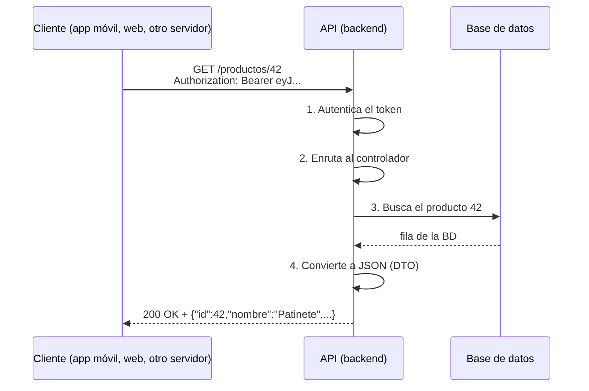
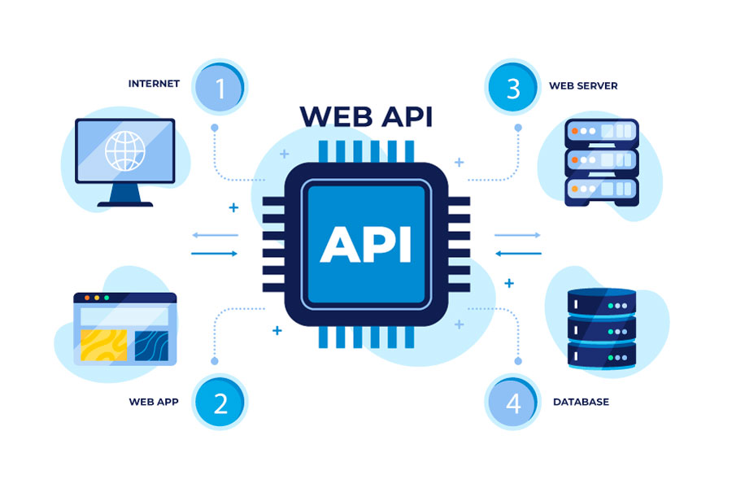
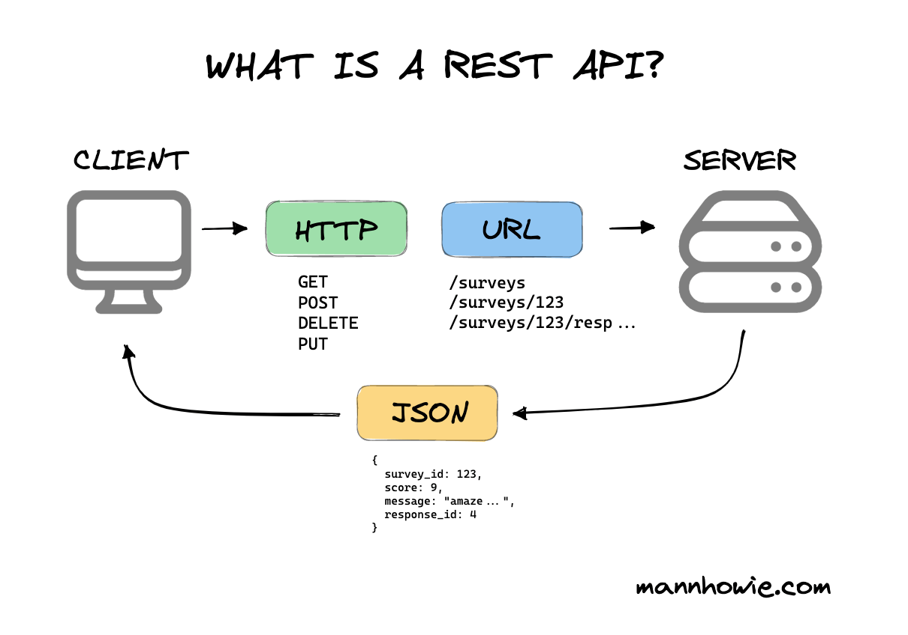
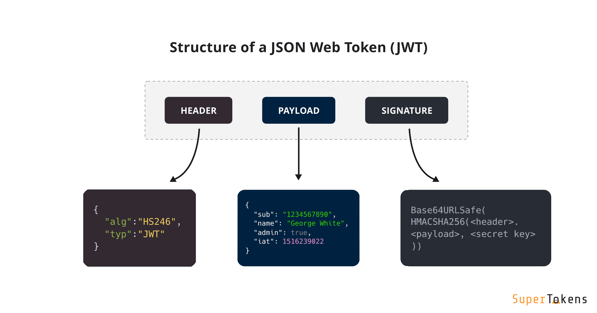
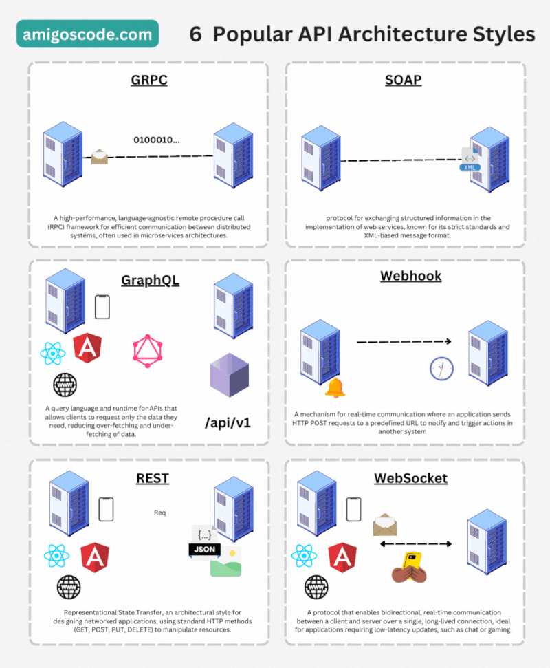

# APIs a fondo: cómo funcionan y qué tipos existen

> La mitad del trabajo de un desarrollador backend en 2026 es **construir y consumir APIs**. Esta página explica cómo funciona una API por dentro, cómo se diseña una API REST decente, cómo se protegen, y el catálogo completo de tipos (REST, GraphQL, gRPC, WebSocket, SSE, webhooks, SOAP) con un ejemplo real de cada.

## 1. Qué es una API y cómo funciona por dentro

Una **API** (*Application Programming Interface*) es un **contrato**: "si me pides *esto* con *este formato*, te respondo *esto otro*". En la web, ese contrato se materializa así:

- **Endpoint:** una URL concreta que expone una funcionalidad → `https://api.tienda.com/productos/42`
- **Método:** qué quieres hacer con ella → GET (leer), POST (crear)…
- **Datos de entrada:** parámetros en la URL o body en JSON.
- **Respuesta:** un código de estado + datos (JSON casi siempre).



Eso es lo que construiremos con Spring: los pasos 1–4 serán Spring Security, el `@RestController`, el repositorio y el DTO.

### Analogía: la máquina expendedora


*Imagen: J. L. González — repo DWES 01 ([CC BY-NC-SA 4.0](https://creativecommons.org/licenses/by-nc-sa/4.0/))*

No necesitas saber cómo funciona por dentro (motores, refrigeración). Solo su **interfaz**: botones (endpoints) y monedas (parámetros/credenciales). Pulsas B4, pagas, y sale el refresco (JSON). Fiable, predecible, sin humanos.

## 2. Diseñar una API REST como un profesional

**REST** no es un protocolo: es un **estilo** para diseñar APIs sobre HTTP. Sus reglas de oro:

### 2.1. Piensa en recursos, no en acciones

Las URLs nombran **cosas** (sustantivos en plural); los **verbos los pone HTTP**:

| :material-check: Bien | :material-close: Mal |
|---------|--------|
| `GET /productos` | `GET /getProductos` |
| `POST /productos` | `POST /crearProducto` |
| `GET /productos/42` | `GET /producto?accion=ver&id=42` |
| `DELETE /productos/42` | `POST /borrarProducto/42` |
| `GET /clientes/7/pedidos` | `GET /pedidosDelCliente?id=7` |

El CRUD completo de un recurso:


*Imagen: J. L. González — repo DWES 01 ([CC BY-NC-SA 4.0](https://creativecommons.org/licenses/by-nc-sa/4.0/))*


```
GET    /productos        → lista (200)
GET    /productos/42     → uno (200 | 404)
POST   /productos        → crea (201 + Location) 
PUT    /productos/42     → reemplaza (200 | 404)
PATCH  /productos/42     → modifica parcialmente (200)
DELETE /productos/42     → borra (204 | 404)
```

### 2.2. Filtrado, ordenación y paginación

Ninguna API seria devuelve 100.000 filas de golpe. Los **query params** modulan la consulta:

```
GET /productos?categoria=patinetes&precioMax=200&sort=precio,desc&page=2&size=20
```

La respuesta paginada suele envolver los datos con metadatos:

```json
{
  "content": [ { "id": 41, "...": "..." }, { "id": 42, "...": "..." } ],
  "page": 2, "size": 20, "totalElements": 512, "totalPages": 26
}
```

(Spring Data te dará esto casi gratis en el trimestre 1.)

### 2.3. Errores útiles

Un error sin explicación es un enemigo. El estándar moderno es **Problem Details (RFC 7807)**:

```json
{
  "type": "https://api.tienda.com/errores/sin-stock",
  "title": "Sin stock",
  "status": 409,
  "detail": "El producto 42 no tiene unidades disponibles",
  "instance": "/pedidos"
}
```

Regla: código de estado correcto **+** body que explique qué pasó y cómo arreglarlo.

### 2.4. Versionado

Las APIs evolucionan y **no puedes romper a los clientes existentes** (la app móvil vieja sigue instalada en miles de teléfonos). Estrategia más común: versión en la URL → `/api/v1/productos`, y `v2` convive con `v1` hasta jubilar la vieja.

### 2.5. Documentación: OpenAPI / Swagger

El contrato de una API se describe en un fichero **OpenAPI** (YAML/JSON) del que se genera documentación interactiva (**Swagger UI**): una web donde ves cada endpoint, sus parámetros ¡y puedes probarlos!. En Spring lo generaremos automáticamente con una dependencia. Buscar "petstore swagger" te enseña una demo clásica.

## 3. Proteger una API

Tres niveles, de menos a más:

| Mecanismo | Cómo funciona | Cuándo |
|-----------|---------------|--------|
| **API Key** | Una clave fija en la cabecera (`X-Api-Key: abc123`) | Identificar apps consumidoras (mapas, clima). No identifica usuarios |
| **JWT** | Login → token firmado → `Authorization: Bearer ...` en cada petición. El servidor solo verifica la firma: **sin estado** | El estándar para tus propias APIs (lo implementaremos) |
| **OAuth 2.0 / OIDC** | Un tercero de confianza emite los tokens ("entrar con Google") | Delegar la identidad; APIs entre empresas |

**El JWT por dentro** — tres partes separadas por puntos, `header.payload.signature`:

```
eyJhbGciOiJIUzI1NiJ9 . eyJzdWIiOiJhbmEiLCJyb2wiOiJBRE1JTiIsImV4cCI6MTc2NzIyNTYwMH0 . 4Xr9f...
   └─ alg: HS256          └─ claims: usuario, rol, expiración                        └─ firma
```

:material-alert: El payload va en **Base64, no cifrado**: cualquiera puede leerlo (pruébalo en [jwt.io](https://jwt.io)). Lo que nadie puede hacer es **modificarlo** sin invalidar la firma. Nunca metas contraseñas o secretos en un JWT. Y añade siempre expiración (`exp`).


*Imagen: J. L. González — repo DWES 01 ([CC BY-NC-SA 4.0](https://creativecommons.org/licenses/by-nc-sa/4.0/))*


**CORS**, el peaje del navegador: cuando una web en `midominio.com` llama a una API en `api.otrodominio.com`, el navegador exige que la API lo autorice explícitamente (cabecera `Access-Control-Allow-Origin`). No es seguridad de la API: es una protección del navegador. Te toparás con él en el trimestre 2 y ya sabrás por qué.

## 4. El catálogo de tipos de API en 2026


*Imagen: J. L. González — repo DWES 01 ([CC BY-NC-SA 4.0](https://creativecommons.org/licenses/by-nc-sa/4.0/))*


REST no es la única forma. Un desarrollador debe saber elegir:

### 4.1. REST — el estándar por defecto
Recursos + verbos HTTP + JSON. Sencillo, cacheable, universal.
```
GET https://api.tienda.com/productos/42  →  {"id":42,"nombre":"Patinete","precio":120.0}
```
**Debilidad:** *over-fetching* (te llega el producto entero cuando solo querías el nombre) y *under-fetching* (para pintar una pantalla necesitas 3 llamadas).

### 4.2. GraphQL — pide exactamente lo que necesitas
Un solo endpoint (`POST /graphql`); el cliente escribe una **consulta** con los campos exactos:
```graphql
{ producto(id: 42) { nombre precio vendedor { nombre } } }
```
```json
{ "data": { "producto": { "nombre": "Patinete", "precio": 120.0, "vendedor": { "nombre": "Ana" } } } }
```
Brilla en apps móviles (ahorra datos) y pantallas complejas. Precio: más complejidad en el servidor y caché HTTP difícil.

!!! analogia "Analogía"
    REST = menú del día (te traen el menú completo aunque solo quieras el filete). GraphQL = buffet (te sirves exactamente lo que quieres, en un solo viaje).

### 4.3. gRPC — velocidad entre servicios
Llamadas a procedimientos remotos con formato **binario** (Protocol Buffers) sobre HTTP/2. Rapidísimo y con contratos tipados. Ilegible para humanos y no apto para navegadores sin proxy. **Su sitio:** la comunicación interna entre microservicios.
```protobuf
service Productos { rpc Obtener (ProductoId) returns (Producto); }
```

### 4.4. WebSocket — conversación permanente
Conexión **bidireccional y persistente**: cliente y servidor se hablan cuando quieren, sin pedir permiso por petición. Es la base de chats, juegos online, cotizaciones en vivo y editores colaborativos.
```
ws://servidor/chat   →  (conexión abierta)  →  ambos envían mensajes cuando quieren
```

### 4.5. SSE (Server-Sent Events) — el servidor te va contando
Canal **unidireccional** servidor→cliente sobre HTTP normal: notificaciones, barras de progreso, y el *streaming* palabra a palabra de los chats de IA que usas a diario. Más simple que WebSocket cuando solo habla el servidor.

### 4.6. Webhooks — la API te llama a ti
Al revés que todo lo anterior: **tú registras una URL** y el proveedor te hace un POST cuando ocurre algo ("pago completado", "push al repo"). Así se integran las pasarelas de pago (Stripe) o GitHub con tu CI.
```
Stripe  →  POST https://mitienda.com/webhooks/pago  {"evento":"pago.completado","pedido":991}
```

### 4.7. SOAP — el abuelo que sigue en el banco
XML sobre HTTP con contratos rígidos (WSDL). Verboso, pero muy estandarizado (firmas, seguridad WS-*). Sigue vivo en banca, seguros y administración pública. Lo reconocerás; probablemente no lo elegirás.

### Tabla de decisión

| Necesito… | Usa |
|-----------|-----|
| Una API pública / mi backend estándar | **REST** |
| Optimizar datos en móvil, pantallas complejas | **GraphQL** |
| Microservicio ↔ microservicio a máxima velocidad | **gRPC** |
| Chat, juego, tiempo real bidireccional | **WebSocket** |
| Notificaciones en vivo solo servidor→cliente | **SSE** |
| Que un proveedor externo me avise de eventos | **Webhook** |
| Integrarme con un banco / sistema legado | **SOAP** (resignación) |

## 5. Consumir una API desde Java

En Java moderno no hace falta ninguna librería: `java.net.http.HttpClient` viene incluido. Guarda esto como `ConsultarApi.java` y ejecútalo con **`java ConsultarApi.java`** (JDK 25+, sin compilar ni proyecto):

``` { .java .numerado }
import java.net.URI;
import java.net.http.HttpClient;
import java.net.http.HttpRequest;
import java.net.http.HttpResponse;

void main() throws Exception {
    try (var client = HttpClient.newHttpClient()) {
        var peticion = HttpRequest.newBuilder(
                URI.create("https://api.github.com/users/octocat"))
            .header("Accept", "application/json")
            .GET()
            .build();

        var respuesta = client.send(peticion, HttpResponse.BodyHandlers.ofString());

        IO.println("Código de estado: " + respuesta.statusCode());
        IO.println("Content-Type: " + respuesta.headers().firstValue("content-type").orElse("¿?"));
        IO.println(respuesta.body());
    }
}
```

Salida esperada: `200`, `application/json` y el JSON del usuario. Acabas de hacer en Java lo mismo que hacías con `curl` — y este es el esqueleto de cualquier integración entre servicios que escribas en tu vida profesional.

---

## Ejercicios (con solución)

### Ejercicio 1 — Diseña la API de la biblioteca
Diseña los endpoints REST para gestionar los **libros** de una biblioteca y los **préstamos** de un socio: listar libros (con filtro por autor y paginación), ver uno, crear, modificar y borrar; y listar los préstamos del socio 12.

??? success "Solución"

    ```
    GET    /api/v1/libros?autor=cervantes&page=0&size=20
    GET    /api/v1/libros/42
    POST   /api/v1/libros            → 201 + Location: /api/v1/libros/99
    PUT    /api/v1/libros/42         (o PATCH para cambios parciales)
    DELETE /api/v1/libros/42         → 204
    GET    /api/v1/socios/12/prestamos
    ```
    Claves: sustantivos en plural, filtros como query params, versión en la URL, jerarquía para la relación socio→préstamos.


### Ejercicio 2 — Corrige la API mal diseñada
Señala todos los problemas: `GET /getUsuario?id=7` · `POST /borrarUsuario/7` · un POST correcto que devuelve `200 OK` con body `"ok"` · un error que devuelve `200 OK` con body `{"error":"no existe"}`.

??? success "Solución"

    (1) Verbo en la URL y singular: debe ser <code>GET /usuarios/7</code>. (2) Borrar con POST y verbo en URL: <code>DELETE /usuarios/7</code>. (3) Un POST que crea debe devolver <b>201</b> + cabecera <code>Location</code>. (4) El peor pecado: <b>errores con 200</b> — los clientes no pueden distinguir éxito de fallo; debe ser 404 con un body tipo Problem Details.


### Ejercicio 3 — Elige el tipo de API
¿REST, GraphQL, gRPC, WebSocket, SSE o webhook? (a) recibir avisos de Stripe cuando un pago se completa · (b) la pantalla de inicio del móvil que necesita datos de usuario+pedidos+recomendaciones en una llamada · (c) partida de ajedrez online · (d) comunicación entre los microservicios Pedidos y Facturación · (e) la barra "escribiendo…" de un chat de IA que va soltando texto · (f) la API pública de tu tienda.

??? success "Solución"

    (a) <b>Webhook</b> · (b) <b>GraphQL</b> · (c) <b>WebSocket</b> · (d) <b>gRPC</b> · (e) <b>SSE</b> · (f) <b>REST</b>.


### Ejercicio 4 — Destripa un JWT (P4)
En [jwt.io](https://jwt.io), pega el token de ejemplo: (1) identifica header, payload y signature; (2) lista los claims del payload; (3) cambia el rol en el payload y explica qué pasa con la firma; (4) responde: ¿por qué jamás se guarda una contraseña en el payload?

??? success "Solución"

    (1) Tres bloques separados por puntos. (2) Típicamente <code>sub</code> (usuario), <code>iat</code> (emitido), <code>exp</code> (expira), roles. (3) La firma deja de coincidir: el servidor rechazará el token — puedes <i>leer</i> pero no <i>falsificar</i>. (4) Porque el payload es Base64 legible por cualquiera que capture el token.


### Ejercicio 5 — Consume una API real desde Java
Modifica el `ConsultarApi.java` de arriba para: (1) llamar a `https://jsonplaceholder.typicode.com/users/3` y decir qué campos tiene el JSON; (2) provocar un 404 con `/users/9999` y mostrar el código; (3) *(extra)* llamar a `https://httpbin.org/headers` añadiendo una cabecera propia `X-Clase: DAW2` y comprobar que aparece en la respuesta.

??? success "Solución"

    Basta cambiar la URI en cada caso. (1) Campos: <code>id, name, username, email, address, phone, website, company</code>. (2) <code>respuesta.statusCode()</code> imprime <b>404</b> — y fíjate: el programa no explota; un 404 es una respuesta válida, no una excepción. (3) Añade <code>.header("X-Clase", "DAW2")</code> al builder y verás tu cabecera reflejada en el JSON devuelto.


---

## Pruébalo ahora (10 min)

!!! reto "Trabaja tú ahora"
    Este bloque se hace **en clase, en tu equipo**. No se entrega ni puntúa: es la práctica que hace que el examen te salga.
Abre la documentación Swagger de una API real: busca **"petstore swagger"** (la demo oficial). Explora: ¿qué endpoints tiene el recurso `pet`? ¿Qué códigos documenta el `GET /pet/{petId}`? Pulsa **Try it out** y ejecuta una petición desde la propia doc. Eso mismo generaremos para nuestra API en el trimestre 1.
