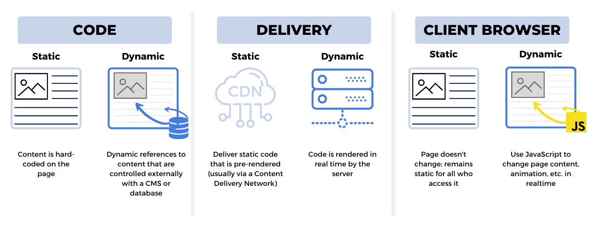
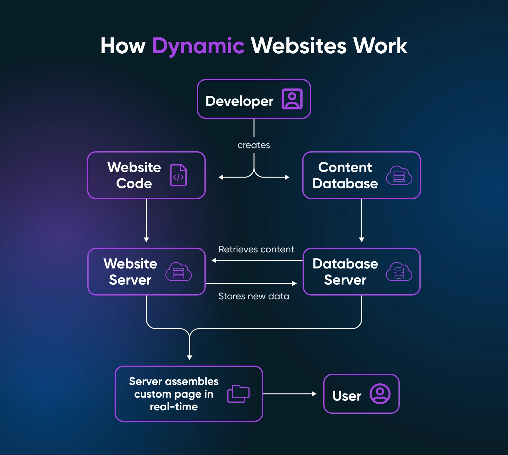

# Web dinámica y lenguajes de servidor

## 1. Estática vs. dinámica

- Estática:
    el servidor envía ficheros tal cual. Iguales para todos, rapidísima, sin BD. (Portafolios, documentación.)
- Dinámica: el servidor ejecuta código y genera la respuesta en el momento, según quién y cuándo pide. (Tiendas, redes, banca.)

!!! analogia "Analogía"
    el periódico de papel se imprime por la mañana y dice lo mismo todo el día para todos. Tu timeline se imprime **para ti, cada vez que entras**.

:material-alert: **"Dinámica" no significa "que se mueva".** Una web con mil animaciones CSS puede ser estática; una página sosa que muestra *tu* saldo es dinámica. Dinámico = **generado en el servidor según datos**.


*Imagen: J. L. González — repo DWES 01 ([CC BY-NC-SA 4.0](https://creativecommons.org/licenses/by-nc-sa/4.0/))*

Cuando el servidor genera el HTML completo se llama **SSR** (*Server-Side Rendering*). La alternativa es la **SPA** (*Single Page Application*): el servidor envía un HTML mínimo + JavaScript, y el navegador pide datos JSON y "cocina" el HTML. Las dos conviven; en este curso haremos las dos cosas (API REST en T1, SSR con plantillas en T2).


*Imagen: J. L. González — repo DWES 01 ([CC BY-NC-SA 4.0](https://creativecommons.org/licenses/by-nc-sa/4.0/))*

## 2. Los lenguajes del servidor, por forma de ejecución

| Tipo | Cómo se ejecuta | Lenguajes | A cambio de |
|---|---|---|---|
| **Scripting** | Un intérprete lee el código línea a línea | PHP, Python, JS (Node) | Desarrollo rápido; menos rendimiento |
| **Nativo** | Compilado a código máquina | Go, Rust, C++ | Máximo rendimiento; compilar por SO |
| **Bytecode** | Compilado a un intermedio que ejecuta una máquina virtual | **Java (JVM)**, C#, Kotlin | Equilibrio + "write once, run anywhere" |

!!! analogia "Analogía"
    scripting = traductor simultáneo (flexible, frase a frase); compilado = traducir el libro entero e imprimirlo (lento al principio, lectura rapidísima después).

**Stacks** con nombre propio: **LAMP** (Linux+Apache+MySQL+PHP), **MEAN/MERN** (todo JavaScript), **WISA** (Microsoft). Frameworks estrella por lenguaje: Java → **Spring Boot** · PHP → Laravel · Python → Django/FastAPI · JS → Express/NestJS · C# → ASP.NET Core.

**¿Por qué este curso usa Java + Spring Boot?** Estándar de la industria "seria" (banca, seguros, grandes plataformas), JVM portable, ecosistema gigante, y lo aprendido se transfiere directo a Kotlin o C#. No es el más rápido de escribir; es el que más empleo da. Y desde JDK 25, como vas a comprobar ahora mismo, también es **simple**.

## 3. Integración con los lenguajes de marcas

Dos formas de que el código y el HTML se encuentren:

- Server-side (plantillas): el HTML lleva huecos que el servidor rellena antes de enviar. Es el MVC clásico; lo haremos con Thymeleaf en el trimestre 2.
- Client-side (SPA):
    el HTML apenas existe; JavaScript pide JSON y construye el DOM en el navegador.

```
<!-- Plantilla Thymeleaf (se rellena EN EL SERVIDOR antes de enviar) -->
<h1 th:text="'Hola, ' + ${usuario.nombre}">Hola, invitado</h1>
<ul>
  <li th:each="producto : ${productos}">
    <span th:text="${producto.titulo}">Nombre</span> —
    <span th:text="${producto.precio}">0</span> €
  </li>
</ul>
```

> Fíjate en el detalle que hace especial a **Thymeleaf**: los atributos `th:*` conviven con HTML válido, y el texto que ves ("Hola, invitado", "Nombre") es un **valor de ejemplo** que se sustituye en el servidor. Eso significa que la plantilla **se puede abrir en el navegador como un HTML normal** y se ve bien: se llama *natural templating* y facilita el trabajo con diseñadores.

---

## Pruébalo ahora (15 min) — todo con Java, sin instalar nada más

!!! reto "Trabaja tú ahora"
    Este bloque se hace **en clase, en tu equipo**. No se entrega ni puntúa: es la práctica que hace que el examen te salga.

El JDK trae de serie las dos piezas que necesitas.

**1. Servidor estático en un comando** — el JDK incluye `jwebserver`:

```bash
mkdir web && cd web
echo "<h1>Hola, soy estática</h1>" > index.html
jwebserver -p 8000
# → http://localhost:8000  (recarga: NUNCA cambia; en la consola ves cada GET)
```

**2. Servidor dinámico en un fichero** — guarda esto como `Servidor.java` y ejecútalo con **`java Servidor.java`** (JDK 25+: sin proyecto, sin compilar aparte):

```java
import com.sun.net.httpserver.HttpServer;
import java.net.InetSocketAddress;
import java.time.LocalTime;

void main() throws Exception {
    var server = HttpServer.create(new InetSocketAddress(8001), 0);

    server.createContext("/", intercambio -> {
        var html = "<h1>Hora del servidor: " + LocalTime.now() + "</h1>";
        var bytes = html.getBytes();
        intercambio.getResponseHeaders().add("Content-Type", "text/html; charset=utf-8");
        intercambio.sendResponseHeaders(200, bytes.length);
        try (var salida = intercambio.getResponseBody()) { salida.write(bytes); }
    });

    server.start();
    IO.println("Escuchando en http://localhost:8001 …");
}
```

Abre `http://localhost:8001` y **recarga varias veces: la hora cambia**. Compárala con la estática del paso 1, que no cambia jamás. Acabas de escribir tu primer servidor dinámico **en Java**: recibe la petición, ejecuta código, genera el HTML y lo devuelve con su código 200 y su `Content-Type`. Exactamente el ciclo que industrializaremos con Spring Boot.

**3. Remata la jugada:** pídele la página a tu propio servidor con curl y mira las cabeceras que TÚ has puesto:

```bash
curl -i http://localhost:8001
```

---

## Ejercicios (con solución)

### Ejercicio 1 — ¿Estática o dinámica?

Clasifica y, si es dinámica, di qué datos consulta el servidor: (1) portafolio personal · (2) panel de tu banco · (3) menú de restaurante en PDF · (4) feed de Instagram · (5) página "quiénes somos" · (6) carrito de Amazon · (7) documentación de Java · (8) resultados de las elecciones en la web de un periódico la noche electoral.

??? success "Solución"

    (1) Estática · (2) Dinámica: cuentas, saldos, movimientos del usuario · (3) Estática · (4) Dinámica: publicaciones y relaciones del usuario · (5) Estática · (6) Dinámica: productos, stock, precios, sesión · (7) Estática · (8) Dinámica: resultados que cambian minuto a minuto (¡mismo HTML, datos nuevos!).


### Ejercicio 2 — Modifica tu servidor Java

Partiendo del `Servidor.java` de arriba: (1) añade una segunda ruta `/saludo` que devuelva "Hola DAW2"; (2) haz que `/` muestre además un contador de visitas que aumente en cada recarga; (3) ¿el contador es "estado"? ¿qué pasaría si mañana ejecutas dos copias del servidor detrás de un balanceador?

??? success "Solución"

    ```java
    // (1) segunda ruta
    server.createContext("/saludo", ex -> { /* igual que "/", con html = "<h1>Hola DAW2</h1>" */ });

    // (2) contador (campo en la clase)
    var visitas = new java.util.concurrent.atomic.AtomicInteger();
    // dentro del handler de "/":
    var html = "<h1>Hora: " + LocalTime.now() + "</h1><p>Visitas: " + visitas.incrementAndGet() + "</p>";
    ```

    (3) Sí: es estado **en memoria del proceso**. Con dos copias tras un balanceador, cada una llevaría SU cuenta y verías el contador "bailar". Por eso el estado compartido se saca a una BD o caché externa (Redis) — la razón profunda de que HTTP sea stateless.


### Ejercicio 3 — Lenguajes con criterio

Un equipo debe elegir lenguaje para: (a) el backend de un banco con 200 desarrolladores · (b) un prototipo de IA que analiza datos · (c) un proxy de red que exprime la máquina al máximo · (d) una agencia que hace webs corporativas con WordPress. Elige tipo de ejecución + lenguaje y justifica.

??? success "Solución"

    (a) Bytecode/JVM → Java (robustez, tipado, talento disponible, ecosistema Spring) · (b) Scripting → Python (ecosistema de datos/IA) · (c) Nativo → Go o Rust (rendimiento y concurrencia) · (d) Scripting → `PHP` (WordPress ES PHP; hosting barato). Moraleja: el lenguaje lo elige el problema, no la moda.

