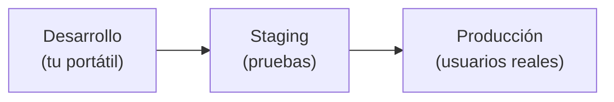
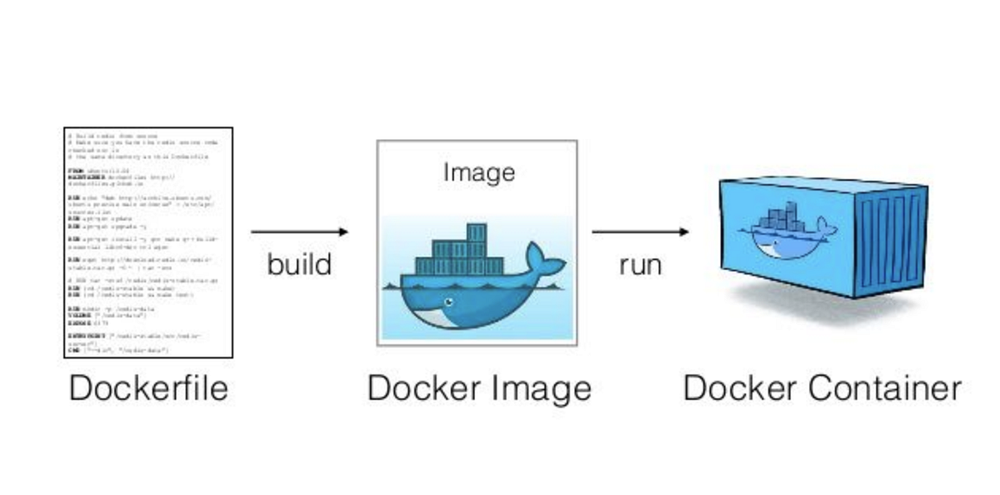
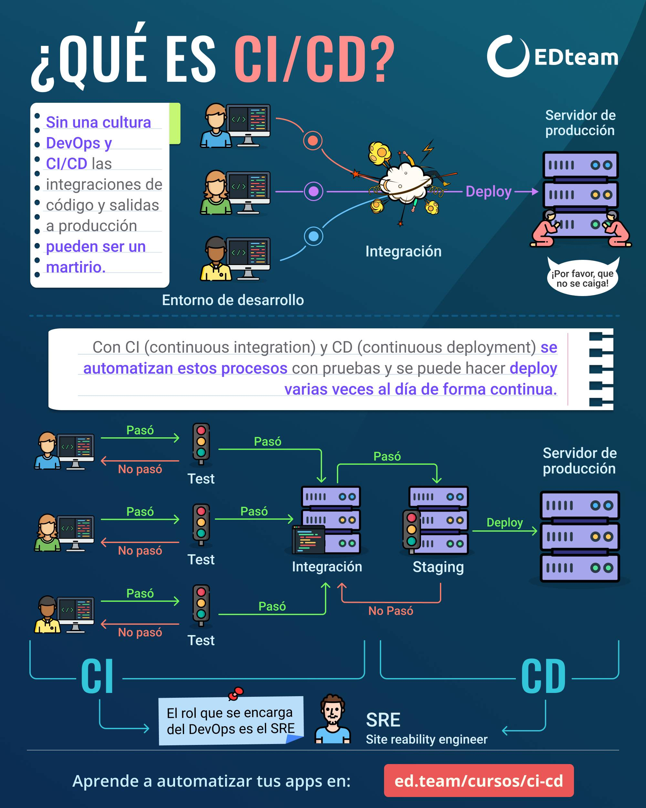

# Servidores y despliegue

## 1. Servidor web frente a servidor de aplicaciones

La confusión más repetida del RA1. Grábatela:

| | Servidor **web** | Servidor de **aplicaciones** |
|---|---|---|
| Ejemplos | **Nginx**, Apache | **Tomcat** (embebido en Spring Boot) |
| Sirve | Ficheros estáticos, proxy inverso, TLS | **Tu código**: la lógica |
| Analogía | El recepcionista | La cocina |

En producción se combinan: **Nginx delante** (puerto 443: HTTPS, estáticos, balanceo) y **Spring Boot detrás** (puerto 8080, *nunca* expuesto directamente a internet). En Spring Boot, Tomcat va **dentro del propio `.jar`**: tu aplicación lleva el servidor incorporado.

Un truco de Nginx/Apache: los **VirtualHosts** permiten alojar varias webs en la misma máquina/IP; el servidor decide cuál servir mirando la cabecera `Host` de la petición.

## 2. Del portátil a producción

**Desplegar** = llevar tu aplicación de `localhost` a un servidor accesible, y que allí sea accesible, estable, escalable y segura.



- **Docker** empaqueta tu app **con todas sus dependencias** en un contenedor: lo que funciona en tu máquina funciona igual en el servidor. Adiós al "en mi máquina funcionaba". (**Kubernetes** orquesta muchos contenedores: autoescalado, recuperación de fallos.)


*Imagen: J. L. González — repo DWES 01 ([CC BY-NC-SA 4.0](https://creativecommons.org/licenses/by-nc-sa/4.0/))*

- **La nube** (AWS, Azure, GCP) alquila infraestructura por horas: **IaaS** (máquinas virtuales: tú instalas todo) → **PaaS** (subes el código y listo) → **SaaS** (usas software final, como Gmail).
- **Escalar:** **vertical** = máquina más potente (tiene techo) · **horizontal** = más máquinas detrás de un **balanceador** (el camino de los grandes).
- **CI/CD:** en cada `git push` se ejecutan los tests automáticamente (CI) y, si pasan, se despliega solo (CD).


*Imagen: J. L. González — repo DWES 01 ([CC BY-NC-SA 4.0](https://creativecommons.org/licenses/by-nc-sa/4.0/))*


!!! analogia "Analogía mascotas vs. ganado"
    el servidor clásico es una mascota (le pones nombre, lo cuidas, si enferma lo curas de madrugada). El contenedor es ganado numerado: si falla, lo eliminas y creas otro idéntico en un segundo.

## Pruébalo ahora (10 min, opcional con Docker)

!!! reto "Trabaja tú ahora"
    Este bloque se hace **en clase, en tu equipo**. No se entrega ni puntúa: es la práctica que hace que el examen te salga.
```bash
mkdir holaweb && cd holaweb
echo "<h1>Hola desde Docker</h1>" > index.html
cat > Dockerfile << 'EOF'
FROM nginx:alpine
COPY index.html /usr/share/nginx/html/
EOF
docker build -t holaweb . && docker run -p 8080:80 holaweb
# → http://localhost:8080  · acabas de desplegar tu primer contenedor
```

---

## Ejercicios (con solución)

### Ejercicio 1 — Servidor web y servidor de aplicaciones

Diferencia, con un ejemplo de cada uno y qué hace cada uno con `/productos`.

??? success "Solución"

    - **Servidor web** (nginx, Apache): devuelve **ficheros que ya existen**. Rápido y sencillo. No ejecuta tu código.
    - **Servidor de aplicaciones** (Tomcat, dentro de tu Spring Boot): **ejecuta código** para construir la respuesta.

    Con una petición a `/productos`:

    | | Qué hace |
    |---|---|
    | **nginx** | Busca un fichero llamado `productos` en su carpeta. Si no está, 404 |
    | **Tomcat** | Busca un método anotado con `@GetMapping("/productos")`, lo ejecuta, consulta la base de datos y genera la respuesta |

    En producción **se usan los dos**, y no es redundancia: nginx delante sirve el CSS, el JS y las imágenes —que son el 90 % de las peticiones y no necesitan lógica— y pasa a Tomcat solo lo que hay que calcular. Además termina el HTTPS y reparte entre varias instancias.

### Ejercicio 2 — El `.jar` que se ejecuta solo

Spring Boot genera un `.jar` con Tomcat dentro. ¿Qué ventaja tiene frente al `.war` de toda la vida?

??? success "Solución"

    Que **el artefacto trae su propio servidor**, así que despliegas con:

    ```bash
    java -jar comercios.jar
    ```

    Frente al modelo antiguo: instalar un Tomcat, configurarlo, copiar el `.war` dentro y rezar para que la versión del servidor coincida con la de desarrollo.

    Lo que se gana:

    1. **Lo que pruebas es lo que despliegas.** El mismo Tomcat, la misma versión, la misma configuración.
    2. **Se mete en un contenedor en tres líneas**, que es justo el `Dockerfile` de abajo.
    3. **Cada aplicación es independiente.** Antes, varias aplicaciones compartían Tomcat y se pisaban: una actualización afectaba a todas, y una que consumía memoria las tumbaba a todas.

    El `.war` sigue existiendo para desplegar en servidores de aplicaciones ya montados, que los hay. Pero para empezar de cero, el `.jar` no tiene competencia.

### Ejercicio 3 — «En mi máquina funciona»

Explica cómo un contenedor mata esa frase.

??? success "Solución"

    Porque la imagen **incluye todo lo que la aplicación necesita para ejecutarse**: el sistema base, la versión exacta del JDK, las librerías y tu `.jar`.

    ```dockerfile
    FROM eclipse-temurin:25-jre-alpine
    COPY target/comercios.jar app.jar
    ENTRYPOINT ["java", "-jar", "/app.jar"]
    ```

    Esa imagen se ejecuta igual en tu portátil, en el de un compañero y en el servidor. Ya no hay un «mi máquina» distinto de «tu máquina»: es la misma.

    Los tres fallos clásicos que desaparecen:

    - **«Es que yo tengo el JDK 21».** La imagen fija la versión.
    - **«A mí me funciona porque tengo esa librería instalada».** Va dentro.
    - **«En el servidor la codificación es otra».** También va dentro.

    Lo que **no** resuelve: los datos y la configuración. Esos van fuera a propósito, en volúmenes y variables de entorno, porque cambian según el entorno.

### Ejercicio 4 — Lee este `Dockerfile`

Explica qué hace cada línea y por qué `jre` y no `jdk`.

```dockerfile
FROM eclipse-temurin:25-jre-alpine
COPY target/comercios.jar app.jar
EXPOSE 8080
ENTRYPOINT ["java", "-jar", "/app.jar"]
```

??? success "Solución"

    | Línea | Qué hace |
    |---|---|
    | `FROM eclipse-temurin:25-jre-alpine` | La imagen de partida: Alpine Linux con Java 25 ya dentro |
    | `COPY target/comercios.jar app.jar` | Mete tu `.jar` dentro de la imagen |
    | `EXPOSE 8080` | **Documenta** que la aplicación escucha ahí. No abre nada: eso lo hace `-p 8080:8080` |
    | `ENTRYPOINT [...]` | La orden que se ejecuta al arrancar el contenedor |

    **`jre` y no `jdk`** porque para *ejecutar* no hace falta el compilador. La diferencia es de tamaño: unos 180 MB frente a 450 MB. Menos que descargar, menos que almacenar, y menos superficie de ataque.

    Y `alpine` porque es una distribución mínima: la imagen baja a unos 90 MB. El aviso: Alpine usa `musl` en vez de `glibc`, y alguna librería nativa muy concreta puede dar guerra. Para una aplicación Java normal, ninguno.

    Lo que le falta a este `Dockerfile` para producción: **no ejecutar como `root`**.

    ```dockerfile
    RUN adduser -D app
    USER app
    ```

### Ejercicio 5 — Del portátil a producción

Ordena los pasos de un despliegue y di qué se automatiza: *(a)* ejecutar los tests · *(b)* construir la imagen · *(c)* compilar · *(d)* subir la imagen al registro · *(e)* arrancar la nueva versión · *(f)* comprobar que responde.

??? success "Solución"

    **c → a → b → d → e → f**, y **se automatiza todo**.

    1. **(c) Compilar.** Si no compila, no hay nada más que hacer.
    2. **(a) Tests.** Aquí se para si algo está en rojo. Es la puerta.
    3. **(b) Construir la imagen** con el `.jar` que acaba de salir.
    4. **(d) Subir la imagen** al registro, etiquetada con la versión.
    5. **(e) Arrancar la nueva** en el servidor.
    6. **(f) Comprobar** que responde, con `/actuator/health`.

    Los dos puntos que hacen que esto sea serio:

    - **El paso (a) tiene que poder fallar el despliegue.** Si los tests no bloquean, no sirven de nada.
    - **El paso (f) también.** Si la nueva versión arranca y no responde, hay que volver a la anterior automáticamente. Se llama *rollback*, y es lo que distingue un despliegue de un salto al vacío.
