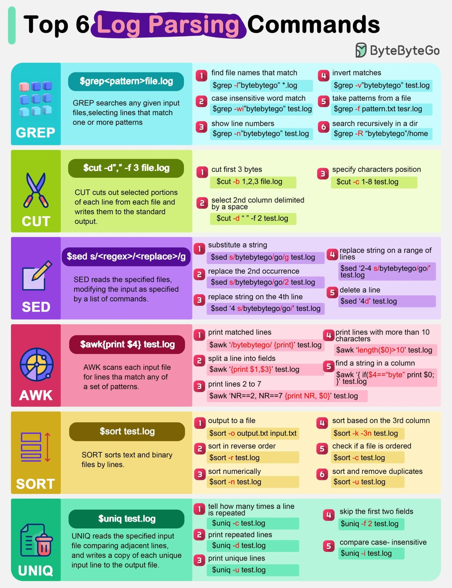

# Seguridad y monitorización

## 1. Las dos preguntas de la seguridad

- **Autenticación — ¿quién eres?** Login con usuario/contraseña, o token (JWT). El código de error asociado es **401**.
- **Autorización — ¿qué puedes hacer?** Roles y permisos. Su código es **403**: sé quién eres, y aun así no puedes pasar.

> **Analogía del hotel:** el **pasaporte** en recepción te autentica; la **pulsera** ("todo incluido" o "solo desayuno") te autoriza. Puedes ser Obama y no entrar en la zona VIP sin pulsera.

Reglas mínimas que ya puedes aplicar: todo por **HTTPS** (HTTP Basic sin TLS envía la clave en Base64 legible); valida y limpia **toda** entrada del usuario; los puertos internos (BD: 3306/5432, Tomcat: 8080) **jamás** expuestos a internet.

## 2. Logs: la caja negra del avión


*Imagen: J. L. González — repo DWES 01 ([CC BY-NC-SA 4.0](https://creativecommons.org/licenses/by-nc-sa/4.0/))*


Cuando algo falla (y fallará), la respuesta está en los logs:
- **Access log:** quién entró, qué pidió, qué código recibió. Muchos `401` seguidos en `/login` = alguien está probando contraseñas.
- **Error log:** por qué falló el servidor (excepciones, configuración).
- **Rotación** (`logrotate`): archivar, comprimir y borrar logs viejos. Si no rotas, el disco se llena y **el servidor se cae**. Pasa de verdad.

> **Del profesor:** cuando algo no te funcione este curso, mi primera pregunta será siempre la misma: *"¿qué dice el log?"*. Acostúmbrate a mirarlo **antes** de preguntar.

## Ejercicios (con solución)

### Ejercicio 1 — Autenticación y autorización

Diferencia, y el código HTTP de cada una.

??? success "Solución"

    - **Autenticación** = *¿quién eres?* Se comprueba con usuario y contraseña, un testigo o un certificado.
    - **Autorización** = *¿puedes hacer esto?* Se comprueba con roles y permisos, **después** de saber quién eres.

    | | Pregunta | Código |
    |---|---|---|
    | Autenticación | ¿Quién eres? | **401 Unauthorized** |
    | Autorización | ¿Puedes? | **403 Forbidden** |

    El **401 está mal nombrado desde 1996**: dice *unauthorized* pero significa *no autenticado*. Es una fuente eterna de confusión y hay que sabérselo tal cual.

    La diferencia práctica:

    - **401**: no sé quién eres. Identifícate y vuelve. Tiene arreglo.
    - **403**: sé perfectamente quién eres, **y no puedes**. Volver a entrar no cambia nada.

    Con un ejemplo: entras a `/admin` sin sesión → **401** (o redirección al login, si es web). Entras como usuario raso → **403**.

### Ejercicio 2 — HTTP Basic sin HTTPS

¿Por qué es inseguro, si la contraseña «va codificada»?

??? success "Solución"

    Porque **Base64 no es cifrado: es una forma de escribir**. Se deshace sin clave ninguna:

    ```bash
    echo "YW5hOnNlY3JldG8=" | base64 -d
    ana:secreto
    ```

    Existe para que caracteres raros viajen sin romper la cabecera HTTP, no para ocultar nada. Cualquiera que vea el tráfico —la wifi del bar, un proxy, el operador— lee la contraseña en claro.

    Y hay algo peor que en un formulario de sesión: **HTTP Basic manda las credenciales en CADA petición**. No hay una sola oportunidad de interceptarla, hay cientos por sesión.

    La cura no es cambiar Basic por otra cosa: es **HTTPS**. Con TLS, la cabecera viaja cifrada y ya no se puede leer por el camino.

    La regla del módulo: **si no hay TLS, no hay seguridad**, da igual el mecanismo de autenticación que pongas encima.

### Ejercicio 3 — Lo que no va en un log

Nombra tres cosas que nunca deben aparecer.

??? success "Solución"

    1. **Contraseñas**, ni siquiera al fallar el login. Ni claves de API, ni testigos JWT, ni cookies de sesión: un log con un testigo dentro es un log con una sesión secuestrable dentro.
    2. **Datos personales sin necesidad**: DNI, dirección, teléfono, datos de salud. Los logs también están sujetos a protección de datos, y se copian y se comparten mucho más que la base de datos.
    3. **Números de tarjeta**, completos o parciales. Aquí además hay normativa específica.

    A eso se añade una cuarta que se cuela sola: **el cuerpo completo de las peticiones**. Parece buena idea para depurar y acaba metiendo en el log todo lo anterior.

    Lo que **sí** debe estar: qué pasó, cuándo, quién (por identificador, no por nombre y DNI), desde dónde, y con qué resultado.

    ```java
    log.warn("Login fallido usuario={} ip={} intento={}", usuario, ip, n);   // sin la contraseña
    ```

### Ejercicio 4 — Logs que no rotan

¿Qué le pasa a un servidor cuyos logs no rotan?

??? success "Solución"

    **Se le llena el disco.** Y cuando eso pasa, no es que se pierdan los logs: es que **la aplicación entera deja de funcionar**, porque no puede escribir ni un fichero temporal. La base de datos, si está en la misma máquina, también se cae.

    Es una de las caídas más tontas y más frecuentes, y siempre llega de madrugada.

    Rotar significa: cerrar el fichero al llegar a un tamaño o al cambiar el día, comprimirlo, y **borrar los más antiguos**.

    ```yaml
    logging:
      file:
        name: /var/log/comercios/app.log
      logback:
        rollingpolicy:
          max-file-size: 10MB
          max-history: 30
          total-size-cap: 1GB
    ```

    `total-size-cap` es el que de verdad te salva: pase lo que pase, los logs no ocupan más de 1 GB.

    Y la segunda parte: **vigilar el espacio libre**. Un aviso al 80 % da tiempo a reaccionar; enterarse al 100 % es enterarse por la caída.

### Ejercicio 5 — Veinte `401` en diez segundos

Ves veinte `401` seguidos en `/login` desde la misma IP en diez segundos. ¿Qué está pasando?

??? success "Solución"

    Un **ataque de fuerza bruta**: un programa probando contraseñas. Ninguna persona escribe veinte contraseñas en diez segundos.

    Hay dos variantes, y conviene distinguirlas:

    - **Fuerza bruta**: un usuario, muchas contraseñas.
    - **Rociado de contraseñas** (*password spraying*): una contraseña muy común contra muchos usuarios. Es más difícil de ver, porque cada cuenta solo acumula uno o dos fallos.

    Qué hacer, por orden:

    1. **Limitar la tasa de intentos** por IP y por usuario. Tras cinco fallos, esperar; y aumentar la espera con cada tanda.
    2. **Bloqueo temporal de la cuenta**, con cuidado: si bloqueas para siempre, cualquiera puede dejar sin servicio a un usuario a base de fallar adrede.
    3. **Exigir contraseñas decentes** y comprobarlas contra listas de las filtradas.
    4. **Doble factor**, que convierte una contraseña acertada en insuficiente.
    5. **Alertar**, no solo registrar. Un log que nadie mira no ha detectado nada.

    Y el detalle del tema 6 de la UT8: **el mensaje de error debe ser el mismo** tanto si el usuario existe como si no. Si no, esos 401 le están confirmando al atacante qué cuentas hay.
