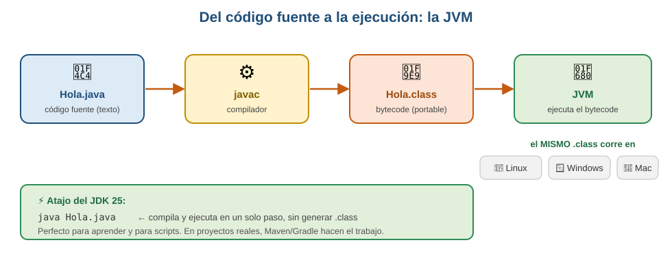

# Primeros pasos con Java 25

> Objetivo de esta página: tener el entorno listo, entender qué pasa cuando ejecutas un programa Java y escribir el primero. En 20 minutos estarás ejecutando código.

## 1. Qué es Java y por qué lo usamos

Java es un lenguaje **compilado a bytecode** que se ejecuta sobre una máquina virtual (la **JVM**). Ese diseño es el que le da su superpoder: *write once, run anywhere*.



- **JDK** (*Java Development Kit*) = todo lo que necesitas para **desarrollar**: compilador (`javac`), herramientas y la JRE.
- **JRE** (*Java Runtime Environment*) = lo necesario para **ejecutar**: la JVM y las librerías.
- **JVM** = el programa que ejecuta el bytecode y lo traduce a instrucciones de tu máquina.

En este curso usamos **JDK 25**, la versión **LTS** (soporte a largo plazo) vigente: la que encontrarás en las empresas.

!!! tip "El manual completo está aparte"
    Aquí va lo justo para arrancar. La instalación paso a paso, la configuración del JDK, los atajos que hay que memorizar y qué hacer cuando algo falla están en el **[manual de IntelliJ](../entorno/intellij.md)**.

    Si `javac -version` no te dice 25, ve allí ahora: es el problema que más tiempo hace perder en la primera semana.

## 2. Instalación en 3 pasos

1. Descarga el **JDK 25 (LTS)** de [Adoptium/Temurin](https://adoptium.net) (gratuito y open source).
2. Instálalo y comprueba en una terminal:
   ```bash
   java -version      # debe decir 25.x
   javac -version
   ```
3. Instala **IntelliJ IDEA Community** (gratis) o VS Code con el *Extension Pack for Java*.

!!! warning "Si `java -version` dice 8, 11 o 17"
    Tienes una versión antigua instalada. Varias cosas de este curso (records con `var`, `switch` moderno, el `void main()` simplificado) no funcionarán. Actualiza antes de la S2.

## 3. Tu primer programa

Crea un fichero `Hola.java` con esto:

```java
void main() {
    IO.println("¡Hola, DAW2!");
}
```

Ejecútalo:

```bash
java Hola.java
```

Sí: **sin `public class`, sin `String[] args`, sin compilar aparte**. Desde JDK 25, los ficheros simples pueden declarar directamente `void main()` y usar `IO.println` sin importar nada. Es la forma pensada para aprender (y para scripts rápidos).

### La forma "clásica" (la que verás en proyectos)

Cuando trabajemos con Maven/Spring, el código va dentro de clases:

```java
public class Hola {
    public static void main(String[] args) {
        System.out.println("¡Hola, DAW2!");
    }
}
```

Ambas hacen lo mismo. Empezaremos con la corta para centrarnos en la lógica, y pasaremos a la clásica al montar proyectos en la S10.

!!! info "¿Por qué `main`?"
    Es el **punto de entrada**: el método por el que la JVM empieza a ejecutar tu programa. Sin `main`, no hay programa que arrancar.

## 4. Anatomía de un programa Java

```java
// 1. Imports: código de otros que quiero usar
import java.time.LocalDate;

// 2. El método de entrada
void main() {
    // 3. Sentencias: cada una acaba en ;
    var hoy = LocalDate.now();
    IO.println("Hoy es " + hoy);
}
```

Tres reglas de sintaxis desde el minuto uno:

- **Cada sentencia acaba en `;`** (el error de compilación más común de la historia).
- **Los bloques van entre llaves `{ }`**.
- **Java distingue mayúsculas de minúsculas**: `nombre` y `Nombre` son cosas distintas. Convención: variables y métodos en `camelCase`, clases en `PascalCase`.

## 5. Errores: compilación vs. ejecución

Distinguirlos te ahorrará horas (y cae en el test):

| Tipo | Cuándo ocurre | Ejemplo |
|------|---------------|---------|
| **Error de compilación** | Antes de ejecutar; el código ni arranca | Falta un `;`, tipos incompatibles, variable no declarada |
| **Error de ejecución** (excepción) | El programa arranca y peta a mitad | Dividir por cero, `NullPointerException`, índice fuera de rango |

```java
int x = "hola";        // MAL  compilación: String no cabe en int
int y = 10 / 0;        // MAL  ejecución: ArithmeticException
```

Java es de **tipado estático**: el compilador comprueba los tipos antes de ejecutar. Es más estricto que Python o JavaScript, y esa es precisamente su ventaja en sistemas grandes: muchos errores se cazan antes de llegar a producción.

---

## Pruébalo ahora (10 min)

!!! reto "Trabaja tú ahora"
    Este bloque se hace **en clase, en tu equipo**. No se entrega ni puntúa: es la práctica que hace que el examen te salga.

1. Crea `Hola.java` con el ejemplo corto y ejecútalo con `java Hola.java`.
2. Modifícalo para que salude con tu nombre y muestre la fecha:
   ```java
   import java.time.LocalDate;

   void main() {
       var nombre = "Iván";
       IO.println("Hola, " + nombre + ". Hoy es " + LocalDate.now());
   }
   ```
3. **Rompe el programa a propósito**: quita un `;` y ejecuta. Lee el mensaje del compilador: te dice fichero, línea y qué esperaba. Aprender a leer errores es media asignatura.

---

## Ejercicios (con solución)

### Ejercicio 1 — ¿Compila o no?
Di si cada línea da error de **compilación**, error de **ejecución** o funciona:
(a) `int edad = 25;` · (b) `int edad = "25";` · (c) `String s = null; IO.println(s.length());` · (d) `var total = 10 / 2;` · (e) `IO.println("Hola")` · (f) `var x = 5; x = "cinco";`

??? success "Solución"

    (a) Funciona. (b) <b>Compilación</b>: no puedes meter un String en un int. (c) <b>Ejecución</b>: <code>NullPointerException</code> al llamar a un método sobre null — compila perfectamente. (d) Funciona (<code>x</code> es int, vale 5). (e) <b>Compilación</b>: falta el <code>;</code>. (f) <b>Compilación</b>: <code>var</code> infiere <code>int</code> en la declaración, y ese tipo ya no cambia.


### Ejercicio 2 — JDK, JRE, JVM
Un compañero dice: "he instalado la JRE, ya puedo programar en Java". ¿Tiene razón? ¿Qué necesita?

??? success "Solución"

    No. La <b>JRE</b> solo permite <i>ejecutar</i> programas Java. Para <i>desarrollar</i> necesita el <b>JDK</b>, que incluye el compilador <code>javac</code> (y la JRE dentro). En este curso: JDK 25 LTS.


### Ejercicio 3 — Tu conversor
Escribe un programa que declare una temperatura en grados Celsius y muestre su equivalente en Fahrenheit (`F = C * 9/5 + 32`).

??? success "Solución"

    ```java
    void main() {
        var celsius = 25.0;
        var fahrenheit = celsius * 9 / 5 + 32;
        IO.println(celsius + " °C son " + fahrenheit + " °F");
    }
    ```
    :material-alert: Ojo con la trampa clásica: si declaras `var celsius = 25;` (entero), `9 / 5` se calcula como **división entera** y da 1, no 1.8. Usa `25.0` o escribe `9.0 / 5`. Este detalle cae en el test.

