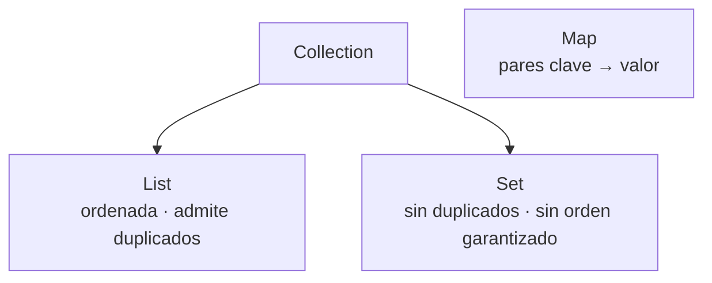

# Colecciones y programación funcional

> Guardar muchos datos y procesarlos. Aquí está el salto de calidad que separa el código de 1.º del código profesional: **streams** en vez de bucles anidados.

## 1. Las tres colecciones que debes conocer



| Interfaz | Implementación habitual | Cuándo usarla |
|---|---|---|
| **`List`** | `ArrayList` | Secuencia con orden e índices: productos de un pedido |
| **`Set`** | `HashSet` | Elementos únicos: DNIs, emails registrados |
| **`Map`** | `HashMap` | Buscar por clave: id → producto, código → descuento |

``` { .java .numerado }
// List
var productos = new ArrayList<String>();
productos.add("Patinete");
productos.add("Casco");
productos.add("Patinete");          // duplicado permitido
IO.println(productos.size());       // 3
IO.println(productos.get(0));       // Patinete

// Set
var emails = new HashSet<String>();
emails.add("ana@mail.com");
emails.add("ana@mail.com");         // ignorado
IO.println(emails.size());          // 1

// Map
var stock = new HashMap<String, Integer>();
stock.put("Patinete", 12);
stock.put("Casco", 30);
IO.println(stock.get("Patinete"));          // 12
IO.println(stock.getOrDefault("Ruedas", 0)); // 0 (no existe → valor por defecto)
```

!!! tip "Programa contra la interfaz"
    Escribe `List<String> lista = new ArrayList<>();` en vez de `ArrayList<String> lista = ...`. Así puedes cambiar la implementación sin tocar el resto del código: **DIP** otra vez.

**Listas inmutables** con `List.of(...)`: ideales para datos fijos. Cuidado, no admiten `add()` (lanzan excepción).

## 2. Recorrer colecciones

```java
var nombres = List.of("Ana", "Luis", "Marta");

for (var n : nombres) IO.println(n);        // for-each: el habitual
nombres.forEach(IO::println);               // versión funcional

// Recorrer un Map
for (var entrada : stock.entrySet()) {
    IO.println(entrada.getKey() + " → " + entrada.getValue());
}
```

## 3. Lambdas: funciones como valores

Una **lambda** es una función anónima que puedes pasar como parámetro:

```java
// (parámetros) -> cuerpo
Predicate<String> esLargo = s -> s.length() > 5;
IO.println(esLargo.test("Patinete"));   // true

// Ordenar con lambda
var lista = new ArrayList<>(List.of("Marta", "Ana", "Luis"));
lista.sort((a, b) -> a.compareTo(b));     // alfabético
lista.sort(Comparator.comparing(String::length));   // por longitud
```

`String::length` es una **referencia a método**: forma abreviada de `s -> s.length()`.

## 4. Streams: el gran salto 

Un **stream** es una tubería de procesamiento de datos. Compara:

=== "Estilo clásico (imperativo)"
    ```java
    var caros = new ArrayList<String>();
    for (var p : productos) {
        if (p.precio() > 100) {
            caros.add(p.nombre().toUpperCase());
        }
    }
    caros.sort(Comparator.naturalOrder());
    ```

=== "Estilo stream (declarativo)"
    ```java
    var caros = productos.stream()
        .filter(p -> p.precio() > 100)
        .map(p -> p.nombre().toUpperCase())
        .sorted()
        .toList();
    ```

El segundo dice **qué** quieres, no **cómo** recorrerlo. Es el estilo que verás en cualquier proyecto Spring moderno.

**Las operaciones que más usarás:**

| Operación | Qué hace | Ejemplo |
|---|---|---|
| `filter` | Se queda con los que cumplen | `.filter(p -> p.precio() > 100)` |
| `map` | Transforma cada elemento | `.map(Producto::nombre)` |
| `sorted` | Ordena | `.sorted(Comparator.comparing(Producto::precio))` |
| `limit` | Se queda con los N primeros | `.limit(5)` |
| `distinct` | Elimina duplicados | `.distinct()` |
| `count` | Cuenta (terminal) | `.count()` |
| `toList` | Recoge en lista (terminal) | `.toList()` |
| `anyMatch` | ¿Alguno cumple? (terminal) | `.anyMatch(p -> p.precio() > 500)` |
| `mapToDouble().sum()` | Suma (terminal) | `.mapToDouble(Producto::precio).sum()` |

!!! info "Intermedias vs. terminales"
    `filter`, `map`, `sorted`… son **intermedias**: devuelven otro stream y **no ejecutan nada** todavía (evaluación perezosa). Solo cuando llega una **terminal** (`toList`, `count`, `sum`, `forEach`) se procesa la tubería. Un stream sin operación terminal no hace absolutamente nada — pregunta clásica de examen.

**Agrupar** con `Collectors` (muy útil en informes):

```java
Map<String, List<Producto>> porCategoria = productos.stream()
    .collect(Collectors.groupingBy(Producto::categoria));

Map<String, Long> cuantosPorCategoria = productos.stream()
    .collect(Collectors.groupingBy(Producto::categoria, Collectors.counting()));
```

---

## Pruébalo ahora (12 min)

!!! reto "Trabaja tú ahora"
    Este bloque se hace **en clase, en tu equipo**. No se entrega ni puntúa: es la práctica que hace que el examen te salga.

Guarda como `Streams.java` y ejecuta. **Predice cada salida antes**:

``` { .java .numerado }
record Producto(String nombre, String categoria, double precio) {}

void main() {
    var productos = List.of(
        new Producto("Patinete", "movilidad", 120.0),
        new Producto("Casco", "seguridad", 35.0),
        new Producto("Bici", "movilidad", 450.0),
        new Producto("Candado", "seguridad", 25.0)
    );

    // 1. Nombres de los que cuestan más de 100 €
    IO.println(productos.stream()
        .filter(p -> p.precio() > 100)
        .map(Producto::nombre)
        .toList());

    // 2. Precio total
    IO.println(productos.stream().mapToDouble(Producto::precio).sum());

    // 3. El más caro
    IO.println(productos.stream()
        .max(Comparator.comparing(Producto::precio))
        .map(Producto::nombre)
        .orElse("ninguno"));

    // 4. Cuántos por categoría
    IO.println(productos.stream()
        .collect(Collectors.groupingBy(Producto::categoria, Collectors.counting())));
}
```

??? success "Salidas"

    <code>[Patinete, Bici]</code> · <code>630.0</code> · <code>Bici</code> · <code>{movilidad=2, seguridad=2}</code>


*(Necesitarás `import java.util.*;` y `import java.util.stream.*;` según el IDE.)*

---

## Ejercicios (con solución)

### Ejercicio 1 — Elige la colección
¿`List`, `Set` o `Map`? (a) los emails registrados, sin repetir · (b) las líneas de un pedido en orden · (c) buscar el precio de un producto por su código · (d) el historial de acciones del usuario.

??? success "Solución"

    (a) <b>Set</b> (unicidad) · (b) <b>List</b> (orden e índices) · (c) <b>Map</b> (clave → valor) · (d) <b>List</b> (orden cronológico, permite repetidos).


### Ejercicio 2 — Traduce el bucle a stream
```java
var total = 0.0;
for (var p : productos) {
    if (p.categoria().equals("movilidad")) {
        total += p.precio();
    }
}
```

??? success "Solución"

    ```java
    var total = productos.stream()
        .filter(p -> p.categoria().equals("movilidad"))
        .mapToDouble(Producto::precio)
        .sum();
    ```


### Ejercicio 3 — ¿Qué imprime?
```java
var nombres = List.of("Ana", "Luis", "Marta", "Ana");
IO.println(nombres.stream().distinct().count());

var stream = nombres.stream().map(String::toUpperCase);
IO.println("Fin");
```

??? success "Solución"

    <code>3</code> (distinct elimina el "Ana" repetido) y luego <code>Fin</code>. <b>El <code>map</code> no imprime ni ejecuta nada</b>: es una operación intermedia sin terminal, así que la tubería nunca se procesa. Trampa clásica.


### Ejercicio 4 — Informe de la tienda
Con la lista `productos` del "Pruébalo ahora", escribe un stream que devuelva los **nombres en mayúsculas** de los productos de seguridad **ordenados por precio descendente**.

??? success "Solución"

    ```java
    var resultado = productos.stream()
        .filter(p -> p.categoria().equals("seguridad"))
        .sorted(Comparator.comparing(Producto::precio).reversed())
        .map(p -> p.nombre().toUpperCase())
        .toList();
    // [CASCO, CANDADO]
    ```

