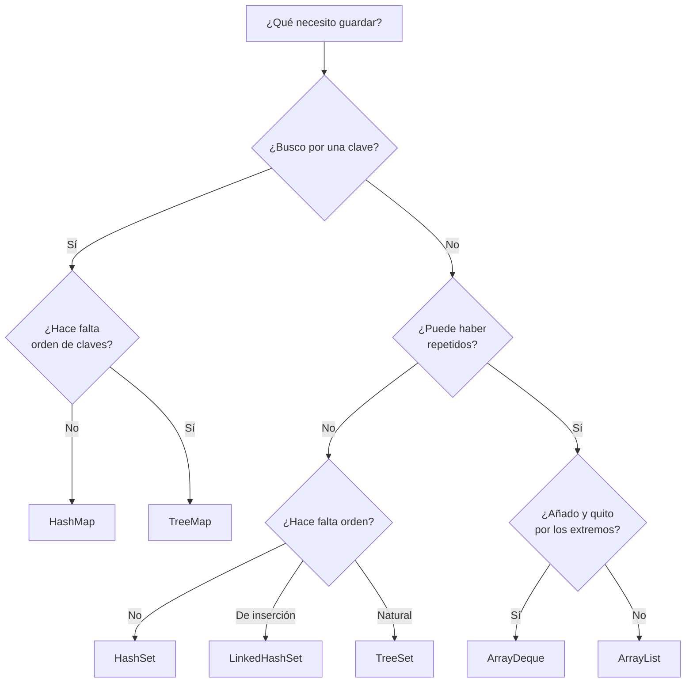

# 4. Colecciones y programación funcional

Guardar muchas cosas y hacer algo con ellas. Es la mitad del trabajo de un programa de servidor.

!!! tip "Todo esto se copia y se pega en `jshell`"
    Los bloques están escritos para pegarlos tal cual, y el comentario de la derecha dice lo que tiene que salir. Empieza pegando estos dos `import`:

    ```java
    import java.util.*;
    import java.util.stream.*;
    ```

---

## 1. El problema: buscar

Tienes los alumnos de un instituto y quieres el que tiene el número de expediente 40312.

Con una lista hay que **mirar uno a uno** hasta encontrarlo. Con 30 alumnos no se nota; con 100.000, sí. Pruébalo:

```java
var lista = new ArrayList<Integer>();
for (int i = 0; i < 200_000; i++) lista.add(i);
var conjunto = new HashSet<>(lista);

long t = System.nanoTime();
lista.contains(199_999);
System.out.println((System.nanoTime() - t) / 1000 + " µs");      // 1483 µs

t = System.nanoTime();
conjunto.contains(199_999);
System.out.println((System.nanoTime() - t) / 1000 + " µs");      // 3 µs
```

**Quinientas veces más rápido.** Y no es magia: son dos formas distintas de guardar lo mismo.

- La **lista** los pone en fila. Para saber si algo está, hay que recorrerla.
- El **conjunto** calcula un número a partir del contenido (el *hash*) y lo usa como dirección: va directo.

Elegir la colección correcta **no es un detalle de estilo**: es la diferencia entre una aplicación que responde y una que no.

---

## 2. `List`: orden y posiciones

Una lista guarda elementos **en orden**, admite **repetidos** y se accede **por posición**.

```java
var tareas = new ArrayList<String>();
tareas.add("Comprar pan");
tareas.add("Llamar al banco");
System.out.println(tareas.add("Comprar pan"));   // repetido: se admite
System.out.println(tareas);   // [Comprar pan, Llamar al banco, Comprar pan]
System.out.println(tareas.get(1));   // Llamar al banco
System.out.println(tareas.size());   // 3
System.out.println(tareas.add(0, "URGENTE"));   // insertar al principio
System.out.println(tareas);   // [URGENTE, Comprar pan, Llamar al banco, Comprar pan]
// quita SOLO la primera aparición
System.out.println(tareas.remove("Comprar pan"));   // true
System.out.println(tareas);   // [URGENTE, Llamar al banco, Comprar pan]
System.out.println(tareas.indexOf("Comprar pan"));   // 2
System.out.println(tareas.contains("Llamar al banco"));   // true
```

!!! warning "`remove(int)` y `remove(Object)` no son lo mismo"
    ```java
    var nums = new ArrayList<>(List.of(10, 20, 30));
    // posición 1
    System.out.println(nums.remove(1));   // 20
    System.out.println(nums);   // [10, 30]
    // el objeto 10
    System.out.println(nums.remove(Integer.valueOf(10)));   // true
    System.out.println(nums);   // [30]
    ```

    Con una `List<Integer>`, `remove(1)` borra **la posición 1**, no el número 1. Es una trampa clásica y cae en el examen.

### Listas fijas frente a listas que crecen

```java
var fija = List.of("a", "b", "c");
fija.add("d");
// lanza java.lang.UnsupportedOperationException
var mutable = new ArrayList<>(List.of("a", "b", "c"));
mutable.add("d");
System.out.println(mutable);   // [a, b, c, d]
```

`List.of(...)` crea una lista **inmutable**: no se puede añadir ni quitar. Es perfecta para constantes y para devolver datos sin que nadie los toque. Si necesitas modificarla, envuélvela en `new ArrayList<>(...)`.

---

## 3. `Set`: sin repetidos

Un conjunto **no admite duplicados** y, en su versión normal, **no tiene orden**.

```java
var correos = new HashSet<String>();
System.out.println(correos.add("ana@iesx.es"));   // true
System.out.println(correos.add("ana@iesx.es"));   // false  ← ya estaba, no se añade
correos.add("bruno@iesx.es");
System.out.println(correos.size());   // 2
```

`add` devuelve `true` o `false` según se haya añadido. **Eso sirve para detectar duplicados sin buscar antes:**

```java
var vistos = new HashSet<String>();
for (var linea : List.of("A", "B", "A", "C", "B")) {
    if (!vistos.add(linea)) System.out.println("Repetido: " + linea);
}
// Repetido: A
// Repetido: B
```

### Las tres variantes, y cuándo cada una

```java
var h = new HashSet<>(List.of("pera", "manzana", "kiwi"));
var l = new LinkedHashSet<>(List.of("pera", "manzana", "kiwi"));
var t = new TreeSet<>(List.of("pera", "manzana", "kiwi"));
```

| | Orden | Coste de buscar | Cuándo |
|---|---|---|---|
| `HashSet` | **Ninguno** | Constante | Por defecto |
| `LinkedHashSet` | De inserción | Constante | Cuando importa quién llegó antes |
| `TreeSet` | Natural (alfabético, numérico) | Logarítmico | Cuando hay que sacarlo ordenado |

!!! danger "Un `Set` de objetos propios necesita `equals` y `hashCode`"
    ```java
    class Alumno { String n; Alumno(String n) { this.n = n; } }
    var s = new HashSet<Alumno>();
    s.add(new Alumno("Ana")); s.add(new Alumno("Ana"));
    System.out.println(s.size());   // 2  ¡dos «Ana»!
    ```

    El conjunto compara con `equals`, y la clase no lo define. Con un `record` funciona sin hacer nada:

    ```java
    record Alumno(String n) {}
    var s2 = new HashSet<Alumno>();
    s2.add(new Alumno("Ana")); s2.add(new Alumno("Ana"));
    System.out.println(s2.size());   // 1
    ```

---

## 4. `Map`: clave → valor

Un mapa asocia **una clave** con **un valor**. Es la colección más usada en un servidor: usuario → sus datos, código → producto, día → ventas.

```java
var notas = new HashMap<String, Integer>();
notas.put("Ana", 8);
notas.put("Bruno", 6);
notas.put("Ana", 9);                        // ← misma clave: SUSTITUYE
System.out.println(notas);   // {Bruno=6, Ana=9}
System.out.println(notas.get("Ana"));   // 9
System.out.println(notas.get("Nadie"));   // null  ← ojo
```

**`get` de una clave que no existe devuelve `null`**, y eso es media hora de depuración el día que menos te apetece. Hay dos formas de evitarlo:

```java
System.out.println(notas.getOrDefault("Nadie", 0));   // 0
System.out.println(notas.containsKey("Nadie"));   // false
```

### Los métodos que ahorran la mitad del código

```java
var contador = new HashMap<String, Integer>();
for (var palabra : List.of("sol", "mar", "sol", "sol", "mar")) {
    contador.merge(palabra, 1, Integer::sum);          // (1)
}
System.out.println(contador);   // {sol=3, mar=2}
```

1. `merge(clave, valorSiNoEstá, cómoCombinar)`. Es contar en una línea.

Sin `merge`, lo mismo son cinco líneas y un `if`:

```java
if (contador.containsKey(palabra)) contador.put(palabra, contador.get(palabra) + 1);
else                               contador.put(palabra, 1);
```

Y para agrupar en listas:

```java
var porLetra = new HashMap<Character, List<String>>();
for (var p : List.of("sol", "mar", "sal", "mes")) {
    porLetra.computeIfAbsent(p.charAt(0), k -> new ArrayList<>()).add(p);   // (1)
}
System.out.println(porLetra);   // {s=[sol, sal], m=[mar, mes]}
```

1. «Si no hay lista para esa letra, créala; después añade». Otra línea en lugar de cuatro.

### Recorrer un mapa

```java
for (var e : notas.entrySet()) System.out.println(e.getKey() + " → " + e.getValue());
// Bruno → 6
// Ana → 9
notas.forEach((nombre, nota) -> System.out.println(nombre + " → " + nota));
// Bruno → 6
// Ana → 9
System.out.println(notas.keySet());   // [Bruno, Ana]
System.out.println(notas.values());   // [6, 9]
```

### `HashMap` frente a `TreeMap`

```java
new HashMap<>(Map.of("pera",1,"manzana",2,"kiwi",3));
// {kiwi=3, manzana=2, pera=1}  sin orden garantizado
new TreeMap<>(Map.of("pera",1,"manzana",2,"kiwi",3));
// {kiwi=3, manzana=2, pera=1}  alfabético, SIEMPRE
```

Aquí coinciden por casualidad. **Esa casualidad es peligrosa**: mucha gente cree que `HashMap` ordena porque con sus datos de prueba salió ordenado. No lo hace, y el día que cambien los datos cambia el orden.

---

## 5. Cuál elegir



Y la tabla, que es la que hay que saberse:

| Caso real | Estructura | Por qué |
|---|---|---|
| Las líneas de un fichero, en orden | `ArrayList` | Orden y repetidos |
| Correos suscritos | `HashSet` | Sin repetidos, orden irrelevante |
| Etiquetas para una nube, ordenadas | `TreeSet` | Sin repetidos y ordenado |
| Producto por su código | `HashMap` | Búsqueda por clave |
| Ventas por día, para un informe | `TreeMap` | Las fechas salen ordenadas |
| Últimas diez acciones para deshacer | `ArrayDeque` | Pila: `push` / `pop` |
| Cola de impresión | `ArrayDeque` | Cola: `offer` / `poll` |

!!! info "`ArrayDeque` hace de pila y de cola"
    ```java
    var pila = new ArrayDeque<String>();
    pila.push("uno"); pila.push("dos"); pila.push("tres");
    System.out.println(pila.pop());   // "tres"  el último que entró
    var cola = new ArrayDeque<String>();
    cola.offer("uno"); cola.offer("dos"); cola.offer("tres");
    System.out.println(cola.poll());   // "uno"  el primero que entró
    ```

    No uses `Stack` ni `Vector`: están obsoletas desde hace veinte años.

---

## 6. Recorrer y modificar

```java
var l = new ArrayList<>(List.of(1, 2, 3, 4, 5));
for (var n : l) { if (n % 2 == 0) l.remove(n); }
// lanza java.util.ConcurrentModificationException
```

**No se puede modificar una colección mientras se recorre con `for-each`.** El bucle usa un iterador por debajo, y quitar un elemento lo deja obsoleto.

Las tres formas correctas, de mejor a peor:

```java
var a = new ArrayList<>(List.of(1,2,3,4,5));
System.out.println(a.removeIf(n -> n % 2 == 0));   // 1 · la que se usa
System.out.println(a);   // [1, 3, 5]
var b = new ArrayList<>(List.of(1,2,3,4,5));
var it = b.iterator();   // 2 · con más control
while (it.hasNext()) { if (it.next() % 2 == 0) it.remove(); }
System.out.println(b);   // [1, 3, 5]
var c = List.of(1,2,3,4,5).stream()
         .filter(n -> n % 2 != 0).toList();    // 3 · sin mutar nada;
```

---

## 7. Lambdas: un método sin nombre

Una **lambda** es una función escrita donde se usa. Lo que hay que entender es que **no es magia**: es la implementación de una interfaz de un solo método.

```java
interface Validador { boolean vale(String texto); }
Validador noVacio = t -> !t.isBlank();   // (1)
System.out.println(noVacio.vale("hola"));   // true
System.out.println(noVacio.vale("   "));   // false
```

1. Esto es exactamente lo mismo que escribir una clase que implemente `Validador`, pero en una línea.

La sintaxis, en tres formas:

```java
Validador a = t -> !t.isBlank();   // una expresión
Validador b = (String t) -> !t.isBlank();   // con el tipo
Validador c = t -> { return !t.isBlank(); };   // con llaves y return
```

Y las **referencias a método**, que son lambdas abreviadas:

```java
List.of("uno","dos").forEach(s -> System.out.println(s));   // lambda
List.of("uno","dos").forEach(System.out::println);   // lo mismo, más corto
List.of("b","a","c").stream().map(String::toUpperCase).toList();
```

---

## 8. Streams: describir, no recorrer

Un **stream** es una tubería: entran datos, se transforman por el camino y sale un resultado. Se escribe **qué** quieres, no **cómo** recorrerlo.

Este bucle:

```java
var caros = new ArrayList<String>();
for (var p : productos) {
    if (p.precio() > 100) {
        caros.add(p.nombre().toUpperCase());
    }
}
Collections.sort(caros);
```

es este stream:

```java
var caros = productos.stream()
        .filter(p -> p.precio() > 100)
        .map(p -> p.nombre().toUpperCase())
        .sorted()
        .toList();
```

Pruébalo entero:

```java
record Producto(String nombre, String categoria, double precio) {}
var productos = List.of(
    new Producto("Patinete", "movilidad", 120.0),
    new Producto("Casco", "seguridad", 35.0),
    new Producto("Bici", "movilidad", 450.0),
    new Producto("Candado", "seguridad", 25.0),
    new Producto("Luces", "seguridad", 15.0));
System.out.println(productos.stream().filter(p -> p.precio() > 100).map(Producto::nombre).toList());
// [Patinete, Bici]
```

### Las cinco operaciones que hacen falta

```java
System.out.println(productos.stream().filter(p -> p.precio() < 30).toList());   // 1 · quedarse con algunos
// [Producto[nombre=Candado,...], Producto[nombre=Luces,...]]
System.out.println(productos.stream().map(Producto::nombre).toList());   // 2 · transformar
// [Patinete, Casco, Bici, Candado, Luces]
System.out.println(productos.stream().sorted(Comparator.comparingDouble(Producto::precio)).map(Producto::nombre).toList());
// [Luces, Candado, Casco, Patinete, Bici]  3 · ordenar
// 4 · reducir a un número
System.out.println(productos.stream().mapToDouble(Producto::precio).sum());   // 645.0
System.out.println(productos.stream().max(Comparator.comparingDouble(Producto::precio)));
// Optional[Producto[nombre=Bici, categoria=movilidad, precio=450.0]]  5 · el máximo
```

Fíjate en el último: **devuelve `Optional`**, porque la lista podría estar vacía. Se termina siempre así:

```java
System.out.println(productos.stream().max(Comparator.comparingDouble(Producto::precio))
          System.out.println(.map(Producto::nombre).orElse("—"));
// Bici
```

!!! warning "Un stream se usa una vez"
    ```java
    var s = productos.stream();
    System.out.println(s.count());   // 5
    s.count();
    // lanza java.lang.IllegalStateException: stream has already been operated upon or closed
    ```

    No se guarda en una variable para reutilizarlo. Se crea, se usa y se tira.

### Agrupar: `groupingBy`

Es la operación que más se usa en un servidor y la que más cae en el examen.

```java
System.out.println(productos.stream().collect(Collectors.groupingBy(Producto::categoria)));
// {seguridad=[Casco, Candado, Luces], movilidad=[Patinete, Bici]}
System.out.println(productos.stream().collect(
        Collectors.groupingBy(Producto::categoria, Collectors.counting())));
// {seguridad=3, movilidad=2}

System.out.println(productos.stream().collect(
        Collectors.groupingBy(Producto::categoria,
                              Collectors.averagingDouble(Producto::precio))));
// {seguridad=25.0, movilidad=285.0}
```

El segundo parámetro dice **qué hacer con cada grupo**: dejarlo como lista (por defecto), contarlo, sumarlo, promediarlo.

Y si hace falta que las claves salgan ordenadas:

```java
System.out.println(productos.stream().collect(
        Collectors.groupingBy(Producto::categoria, TreeMap::new, Collectors.counting())));
// {movilidad=2, seguridad=3}
```

!!! danger "`groupingBy` devuelve un `HashMap`"
    Sin el `TreeMap::new`, **el orden de las claves no está garantizado**. Si tu informe tiene que salir ordenado, hay que pedirlo.

---

## Pruébalo ahora (12 min)

Con la lista `productos` de arriba en `jshell`:

1. Los nombres de los de la categoría `seguridad`, en mayúsculas y ordenados.
2. El precio total de la categoría `movilidad`.
3. Un `Map<String, List<String>>` con los **nombres** agrupados por categoría (no los productos enteros).
4. El producto más barato, devolviendo `"ninguno"` si la lista estuviera vacía.
5. Cuenta cuántas veces aparece cada letra inicial usando `merge`.

??? success "Solución de las cinco"

    ```java
    // 1 · nombres de seguridad, en mayúsculas y ordenados
    productos.stream()
             .filter(p -> p.categoria().equals("seguridad"))
             .map(p -> p.nombre().toUpperCase())
             .sorted()
             .toList();                       // [CANDADO, CASCO, LUCES]

    // 2 · precio total de movilidad
    productos.stream()
             .filter(p -> p.categoria().equals("movilidad"))
             .mapToDouble(Producto::precio)
             .sum();                          // 570.0

    // 3 · los NOMBRES agrupados por categoría
    productos.stream().collect(Collectors.groupingBy(
            Producto::categoria,
            Collectors.mapping(Producto::nombre, Collectors.toList())));
    // {seguridad=[Casco, Candado, Luces], movilidad=[Patinete, Bici]}

    // 4 · el más barato, con alternativa si no hay ninguno
    productos.stream()
             .min(Comparator.comparingDouble(Producto::precio))
             .map(Producto::nombre)
             .orElse("ninguno");              // Luces

    // 5 · cuántos empiezan por cada letra
    var cuenta = new HashMap<Character, Integer>();
    productos.forEach(p -> cuenta.merge(p.nombre().charAt(0), 1, Integer::sum));
    System.out.println(cuenta);               // {P=1, B=1, C=2, L=1}
    ```

    **El 3 es el que cuesta.** `Collectors.mapping` transforma **dentro** de cada grupo antes de recogerlo; sin él tendrías los productos enteros y no sus nombres.

    **El 4 no se puede resolver con `get()`.** `min` devuelve `Optional` porque la lista podría estar vacía, y la gracia del ejercicio es terminar con `orElse`.

    **El 5 se puede hacer también con streams**, y las dos formas valen:

    ```java
    productos.stream().collect(Collectors.groupingBy(
            p -> p.nombre().charAt(0), Collectors.counting()));
    ```

    La de `merge` se lee mejor dentro de un bucle que ya existe; la de streams, cuando ya estás en una cadena.
---

## Ejercicios (con solución)

### E1 — ¿Qué imprime?

```java
var m = new HashMap<String, Integer>();
m.put("pera", 3);
m.put("manzana", 5);
m.put("pera", 7);
m.size();
m.get("pera");
m.get("kiwi");
```

??? success "Solución"

    **`2`, `7` y `null`.**

    - `size()` es 2: `put` con una clave que ya existe **sustituye**, no añade.
    - `get` de una clave inexistente devuelve `null`. Si después haces `m.get("kiwi") + 1`, tienes un `NullPointerException`.

### E2 — El `remove` traicionero

```java
var l = new ArrayList<>(List.of(10, 20, 30));
l.remove(1);
System.out.println(l);
```

??? success "Solución"

    **`[10, 30]`.** `remove(int)` borra la **posición**. Para borrar el valor 1 habría que escribir `l.remove(Integer.valueOf(1))`.

    Con `List<String>` no hay ambigüedad; con `List<Integer>`, sí.

### E3 — Elige la colección

(a) los DNI ya registrados · (b) el historial de páginas visitadas · (c) el stock por código de producto · (d) las etiquetas de un artículo, sin repetir y en orden alfabético · (e) las tareas pendientes, la más antigua primero

??? success "Solución"

    | | Cuál | Por qué |
    |---|---|---|
    | (a) DNI registrados | `HashSet` | Solo importa si está; sin repetidos |
    | (b) Historial | `ArrayList` | Orden y puede haber repetidos |
    | (c) Stock por código | `HashMap<String,Integer>` | Búsqueda por clave |
    | (d) Etiquetas | `TreeSet` | Sin repetidos y ordenado |
    | (e) Tareas | `ArrayDeque` como cola | `offer` / `poll` |

### E4 — Contar sin `if`

Cuenta cuántas veces aparece cada palabra en una lista, **con una sola línea dentro del bucle**.

```java
var texto = List.of("sol", "mar", "sol", "aire", "mar", "sol");
```

??? success "Solución"


    Cuenta cuántas veces aparece cada palabra en una lista, en una sola línea dentro del bucle.

    ```java
    var texto = List.of("sol", "mar", "sol", "aire", "mar", "sol");
    var cuenta = new HashMap<String, Integer>();
    System.out.println(texto.forEach(p -> cuenta.merge(p, 1, Integer::sum)));
    // {aire=1, sol=3, mar=2}
    ```

    O con streams, sin mapa a mano:

    ```java
    System.out.println(texto.stream().collect(Collectors.groupingBy(p -> p, Collectors.counting())));
    // {aire=1, sol=3, mar=2}
    ```

    Los dos valen. El primero se lee mejor dentro de un bucle que ya existe; el segundo, cuando ya estás en una cadena de streams.

### E5 — El orden que no estaba garantizado

Agrupa las ventas por vendedor sumando importes y después saca el ranking **por importe**, no por nombre.

```java
record Venta(String vendedor, double importe) {}
var ventas = List.of(new Venta("Ana", 300), new Venta("Bruno", 150),
                     new Venta("Ana", 200), new Venta("Carla", 500));
```

??? success "Solución"


    ```java
    record Venta(String vendedor, double importe) {}
    var ventas = List.of(new Venta("Ana", 300), new Venta("Bruno", 150),
                         new Venta("Ana", 200), new Venta("Carla", 500));

    var porVendedor = ventas.stream().collect(
            Collectors.groupingBy(Venta::vendedor,
                                  Collectors.summingDouble(Venta::importe)));
    ```

    `porVendedor` es `{Bruno=150.0, Ana=500.0, Carla=500.0}` — **sin orden fiable**, porque es un `HashMap`.

    Para un informe alfabético:

    ```java
    Collectors.groupingBy(Venta::vendedor, TreeMap::new,
                          System.out.println(Collectors.summingDouble(Venta::importe));
    // {Ana=500.0, Bruno=150.0, Carla=500.0}
    ```

    Y para el ranking por importe hay que volver a hacer stream sobre las entradas:

    ```java
    porVendedor.entrySet().stream()
               .sorted(Map.Entry.<String,Double>comparingByValue().reversed())
               .map(Map.Entry::getKey)
               .toList();                      // [Ana, Carla, Bruno] (o Carla, Ana)
    ```

    El `<String,Double>` explícito hace falta: sin él, el compilador no infiere el tipo dentro de `sorted` y da un error que no dice nada.

### E6 — `ConcurrentModificationException`

Escribe la versión que **falla** y las dos que funcionan, para quitar de una lista los nombres de menos de cuatro letras.

??? success "Solución"


    Escribe la versión que falla y las dos que funcionan, para quitar de una lista los nombres de menos de cuatro letras.

    ```java
    // FALLA
    for (var n : nombres) { if (n.length() < 4) nombres.remove(n); }

    // BIEN · 1
    nombres.removeIf(n -> n.length() < 4);

    // BIEN · 2
    var it = nombres.iterator();
    while (it.hasNext()) { if (it.next().length() < 4) it.remove(); }
    ```

    Y el aviso: las dos correctas necesitan una lista **mutable**. Sobre `List.of(...)` lanzan `UnsupportedOperationException`.
