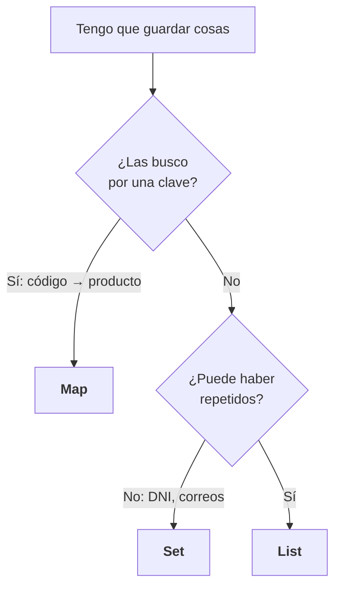
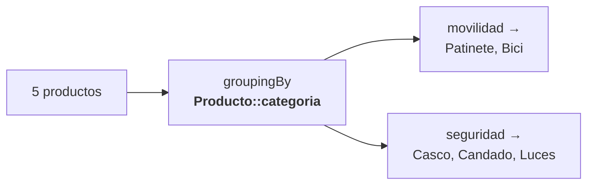

# 4. Colecciones y streams

Guardar muchas cosas y sacar información de ellas. Es la mitad del trabajo de un programa de servidor, y la parte de Java que más cuesta al principio.

!!! tip "Todo esto se copia y se pega en `jshell`"
    Los bloques están escritos para pegarlos tal cual; el comentario de la derecha dice lo que tiene que salir. Pega primero estos dos `import`:

    ```java
    import java.util.*;
    import java.util.stream.*;
    ```

!!! info "Vamos despacio y en este orden"
    1. Las **tres colecciones** y cuándo usar cada una.
    2. Cómo **recorrerlas** sin romper nada.
    3. Qué es una **lambda**, construida desde un bucle normal.
    4. Los **streams**, una operación cada vez: filtrar → transformar → recoger.
    5. **Agrupar**, que es lo que más se usa y lo que más cuesta.

    Si algo no se entiende, no pases de página: ejecútalo y cambia un valor.

---

## 1. Las tres colecciones

Java tiene muchas, pero con estas tres se resuelve casi todo:

| | Guarda | Se busca por | ¿Repetidos? | ¿Orden? |
|---|---|---|:-:|---|
| **`List`** | Cosas en fila | Posición | Sí | De inserción |
| **`Set`** | Cosas únicas | Contenido | **No** | Ninguno |
| **`Map`** | Pares clave → valor | Clave | Claves no | Ninguno |

### `List`: cuando importa el orden

```java
var tareas = new ArrayList<String>();
tareas.add("Comprar pan");
tareas.add("Llamar al banco");
tareas.add("Comprar pan");                 // repetido: se admite

System.out.println(tareas);                // [Comprar pan, Llamar al banco, Comprar pan]
System.out.println(tareas.get(1));         // Llamar al banco
System.out.println(tareas.size());         // 3
System.out.println(tareas.contains("Comprar pan"));   // true
```

!!! warning "La trampa del `remove`"
    ```java
    var nums = new ArrayList<>(List.of(10, 20, 30));
    nums.remove(1);                        // borra la POSICIÓN 1
    System.out.println(nums);              // [10, 30]
    ```

    Con una `List<Integer>`, `remove(1)` borra **la posición 1**, no el número 1. Para borrar el valor: `nums.remove(Integer.valueOf(10))`.

    Y ojo con esto:

    ```java
    var fija = List.of("a", "b");
    fija.add("c");
    // lanza java.lang.UnsupportedOperationException
    ```

    `List.of(...)` crea una lista **inmutable**. Para poder modificarla: `new ArrayList<>(List.of(...))`.

### `Set`: cuando no puede haber repetidos

```java
var correos = new HashSet<String>();
System.out.println(correos.add("ana@iesx.es"));    // true
System.out.println(correos.add("ana@iesx.es"));    // false  ← ya estaba
correos.add("bruno@iesx.es");
System.out.println(correos.size());                // 2
```

Que `add` devuelva `true` o `false` sirve para **detectar duplicados sin buscar antes**:

```java
var vistos = new HashSet<String>();
for (var linea : List.of("A", "B", "A", "C", "B")) {
    if (!vistos.add(linea)) System.out.println("Repetido: " + linea);
}
// Repetido: A
// Repetido: B
```

Si además lo quieres **ordenado**, usa `TreeSet`:

```java
System.out.println(new HashSet<>(List.of("pera", "manzana", "kiwi")));
// [kiwi, manzana, pera]   ← el orden que salga; no te fíes
System.out.println(new TreeSet<>(List.of("pera", "manzana", "kiwi")));
// [kiwi, manzana, pera]   ← alfabético, SIEMPRE
```

### `Map`: la más usada en un servidor

Asocia **una clave** con **un valor**: usuario → sus datos, código → producto, día → ventas.

```java
var notas = new HashMap<String, Integer>();
notas.put("Ana", 8);
notas.put("Bruno", 6);
notas.put("Ana", 9);                       // misma clave: SUSTITUYE

System.out.println(notas);                 // {Bruno=6, Ana=9}
System.out.println(notas.size());          // 2
System.out.println(notas.get("Ana"));      // 9
System.out.println(notas.get("Nadie"));    // null   ← ojo
```

!!! danger "`get` de una clave que no existe devuelve `null`"
    Y si después haces `notas.get("Nadie") + 1`, tienes un `NullPointerException`. Dos formas de evitarlo:

    ```java
    System.out.println(notas.getOrDefault("Nadie", 0));   // 0
    System.out.println(notas.containsKey("Nadie"));       // false
    ```

Recorrerlo:

```java
notas.forEach((nombre, nota) -> System.out.println(nombre + " → " + nota));
// Bruno → 6
// Ana → 9
```

!!! tip "Dos métodos que ahorran media docena de líneas"
    **Contar cosas**, con `merge`:

    ```java
    var cuenta = new HashMap<String, Integer>();
    for (var palabra : List.of("sol", "mar", "sol", "sol", "mar")) {
        cuenta.merge(palabra, 1, Integer::sum);
    }
    System.out.println(cuenta);            // {sol=3, mar=2}
    ```

    Se lee así: «si no está, ponle 1; si está, súmale 1». Sin `merge` son cinco líneas y un `if`.

    **Agrupar en listas**, con `computeIfAbsent`:

    ```java
    var porLetra = new HashMap<Character, List<String>>();
    for (var p : List.of("sol", "mar", "sal", "mes")) {
        porLetra.computeIfAbsent(p.charAt(0), k -> new ArrayList<>()).add(p);
    }
    System.out.println(porLetra);          // {s=[sol, sal], m=[mar, mes]}
    ```

    «Si no hay lista para esa letra, créala; después añade».

---

## 2. Cuál elijo


```mermaid
flowchart TD
    A["Tengo que guardar cosas"] --> B{"¿Las busco<br/>por una clave?"}
    B -->|"Sí: código → producto"| C["<b>Map</b>"]
    B -->|No| D{"¿Puede haber<br/>repetidos?"}
    D -->|"No: DNI, correos"| E["<b>Set</b>"]
    D -->|Sí| F["<b>List</b>"]
```

| Caso real | Estructura |
|---|---|
| Las líneas de un fichero, en orden | `ArrayList` |
| Los correos ya registrados | `HashSet` |
| Etiquetas sin repetir y ordenadas | `TreeSet` |
| El producto de cada código | `HashMap<String, Producto>` |
| Las ventas de cada día, para un informe | `TreeMap` (fechas ordenadas) |

!!! danger "Por qué esto no es un detalle de estilo"
    Buscar en una lista la **recorre entera**; buscar en un conjunto o un mapa va directo. Compruébalo:

    ```java
    var lista = new ArrayList<Integer>();
    for (int i = 0; i < 200_000; i++) lista.add(i);
    var conjunto = new HashSet<>(lista);

    long t = System.nanoTime();
    lista.contains(199_999);
    System.out.println((System.nanoTime() - t) / 1000 + " µs");      // 1483 µs

    t = System.nanoTime();
    conjunto.contains(199_999);
    System.out.println((System.nanoTime() - t) / 1000 + " µs");      // 3 µs
    ```

    Quinientas veces más rápido. Con 30 elementos no se nota; con 200.000, es la diferencia entre una aplicación que responde y una que no.

---

## 3. Recorrer sin romperlo

```java
var l = new ArrayList<>(List.of(1, 2, 3, 4, 5));
for (var n : l) { if (n % 2 == 0) l.remove(n); }
// lanza java.util.ConcurrentModificationException
```

**No se puede modificar una colección mientras se recorre con `for-each`.** La forma correcta:

```java
var a = new ArrayList<>(List.of(1, 2, 3, 4, 5));
a.removeIf(n -> n % 2 == 0);
System.out.println(a);                     // [1, 3, 5]
```

Y recuerda: sobre una lista creada con `List.of(...)`, `removeIf` lanza `UnsupportedOperationException`.

---

## 4. Lambdas: qué son en realidad

Aquí está la clave de todo lo que viene, y no es magia.

Mira este método, que comprueba si un texto sirve:

```java
boolean noEstaVacio(String texto) {
    return !texto.isBlank();
}
```

Una **lambda** es ese mismo método, **sin nombre y escrito donde se usa**:

```java
texto -> !texto.isBlank()
```

Se lee: *«dado un `texto`, devuelve `!texto.isBlank()`»*. Nada más. La flecha separa **lo que entra** de **lo que sale**.

Para poder guardarla en una variable hace falta un tipo, y ese tipo es **una interfaz de un solo método**:

```java
interface Validador { boolean vale(String texto); }

Validador noVacio = texto -> !texto.isBlank();

System.out.println(noVacio.vale("hola"));   // true
System.out.println(noVacio.vale("   "));    // false
```

!!! info "Las tres formas de escribirla"
    ```java
    Validador a = t -> !t.isBlank();                 // lo habitual
    Validador b = (String t) -> !t.isBlank();        // con el tipo, si hace falta
    Validador c = t -> { return !t.isBlank(); };     // con llaves, si son varias líneas
    ```

    Y si la lambda solo llama a un método que ya existe, se puede abreviar con `::`:

    ```java
    List.of("uno", "dos").forEach(s -> System.out.println(s));   // lambda
    List.of("uno", "dos").forEach(System.out::println);          // lo mismo, más corto

    System.out.println(List.of("b", "a").stream().map(String::toUpperCase).toList());
    // [B, A]
    ```

---

## 5. Streams: una operación cada vez

Un **stream** es una tubería: entran los elementos, se van transformando por el camino y al final sale un resultado.

Vamos a construirlo despacio. Estos son los datos:

```java
record Producto(String nombre, String categoria, double precio) {}

var productos = List.of(
    new Producto("Patinete", "movilidad", 120.0),
    new Producto("Casco",    "seguridad",  35.0),
    new Producto("Bici",     "movilidad", 450.0),
    new Producto("Candado",  "seguridad",  25.0),
    new Producto("Luces",    "seguridad",  15.0));
```

### Paso 1 · `filter` — quedarse con algunos

Con un bucle de toda la vida:

```java
var caros = new ArrayList<Producto>();
for (var p : productos) {
    if (p.precio() > 100) caros.add(p);
}
```

Con un stream:

```java
System.out.println(productos.stream()
        .filter(p -> p.precio() > 100)
        .toList());
// [Producto[nombre=Patinete, …], Producto[nombre=Bici, …]]
```

`filter` recibe **una lambda que devuelve `true` o `false`**. Los que dan `true` siguen; los demás se caen de la tubería.

### Paso 2 · `map` — transformar cada uno

```java
System.out.println(productos.stream()
        .map(p -> p.nombre())
        .toList());
// [Patinete, Casco, Bici, Candado, Luces]
```

`map` recibe **una lambda que convierte cada elemento en otra cosa**. Aquí, cada producto en su nombre.

Y se pueden encadenar:

```java
System.out.println(productos.stream()
        .filter(p -> p.precio() > 100)       // primero, quedarse con los caros
        .map(Producto::nombre)               // después, quedarse con el nombre
        .toList());
// [Patinete, Bici]
```

!!! tip "El orden importa, y se lee de arriba abajo"
    ```
    productos  →  filter (quedan 2)  →  map (ahora son textos)  →  toList
    ```

    Ese mismo código con bucles son seis líneas y una variable auxiliar. Con streams se lee **qué** quieres, no **cómo** recorrerlo.

### Paso 3 · Terminar la tubería

Un stream **no hace nada** hasta que le pones una operación final:

```java
productos.stream().filter(p -> p.precio() > 100);      // no imprime ni calcula nada
```

Las que se usan:

```java
System.out.println(productos.stream().count());                       // 5
System.out.println(productos.stream().map(Producto::nombre).toList());
System.out.println(productos.stream().mapToDouble(Producto::precio).sum());   // 645.0
productos.stream().forEach(p -> System.out.println(p.nombre()));
```

Y las que devuelven **`Optional`**, porque la lista podría estar vacía:

```java
System.out.println(productos.stream()
        .max(Comparator.comparingDouble(Producto::precio))
        .map(Producto::nombre)
        .orElse("—"));
// Bici
```

!!! warning "Un stream se usa una vez"
    ```java
    var s = productos.stream();
    System.out.println(s.count());   // 5
    s.count();
    // lanza java.lang.IllegalStateException: stream has already been operated upon or closed
    ```

    No se guarda en una variable para reutilizarlo: se crea, se usa y se tira.

### Paso 4 · Ordenar

```java
System.out.println(productos.stream()
        .sorted(Comparator.comparingDouble(Producto::precio))
        .map(Producto::nombre)
        .toList());
// [Luces, Candado, Casco, Patinete, Bici]
```

Al revés, y con desempate:

```java
System.out.println(productos.stream()
        .sorted(Comparator.comparingDouble(Producto::precio).reversed())
        .map(Producto::nombre).toList());
// [Bici, Patinete, Casco, Candado, Luces]

System.out.println(productos.stream()
        .sorted(Comparator.comparing(Producto::categoria)
                          .thenComparing(Producto::nombre))
        .map(Producto::nombre).toList());
// [Bici, Patinete, Candado, Casco, Luces]
```

!!! danger "Dónde va el `.reversed()`"
    ```java
    // MAL: invierte los DOS criterios
    Comparator.comparing(Producto::categoria).thenComparing(Producto::nombre).reversed()

    // BIEN: solo invierte la categoría
    Comparator.comparing(Producto::categoria).reversed().thenComparing(Producto::nombre)
    ```

    `reversed()` invierte **todo lo encadenado hasta ese punto**. Por eso va pegado a lo que quieres invertir.

---

## 6. Agrupar: `groupingBy`

Es la operación que más se usa en un servidor y la que más cuesta. Vamos por partes.

**La pregunta:** «dame los productos **separados por categoría**».

```java
System.out.println(productos.stream()
        .collect(Collectors.groupingBy(Producto::categoria)));
// {seguridad=[Casco, Candado, Luces], movilidad=[Patinete, Bici]}
```

Léelo así: `groupingBy` **hace montones**, y la lambda dice **por qué criterio**. El resultado es un `Map`: la clave es la categoría, el valor es la lista de los que caen en ella.


```mermaid
flowchart LR
    P["5 productos"] --> G["groupingBy<br/><b>Producto::categoria</b>"]
    G --> A["movilidad →<br/>Patinete, Bici"]
    G --> B["seguridad →<br/>Casco, Candado, Luces"]
```

### El segundo parámetro: qué hacer con cada montón

Por defecto te da la lista. Con un segundo parámetro decides otra cosa:

```java
System.out.println(productos.stream().collect(
        Collectors.groupingBy(Producto::categoria, Collectors.counting())));
// {seguridad=3, movilidad=2}                                ← cuántos hay

System.out.println(productos.stream().collect(
        Collectors.groupingBy(Producto::categoria,
                              Collectors.summingDouble(Producto::precio))));
// {seguridad=75.0, movilidad=570.0}                         ← cuánto suman

System.out.println(productos.stream().collect(
        Collectors.groupingBy(Producto::categoria,
                              Collectors.averagingDouble(Producto::precio))));
// {seguridad=25.0, movilidad=285.0}                         ← la media
```

**Es siempre el mismo esquema:**

```
groupingBy( cómo hago los montones , qué hago con cada montón )
```

Y si lo que quieres de cada montón son **solo los nombres**, se usa `mapping`:

```java
System.out.println(productos.stream().collect(
        Collectors.groupingBy(Producto::categoria,
                              Collectors.mapping(Producto::nombre, Collectors.toList()))));
// {seguridad=[Casco, Candado, Luces], movilidad=[Patinete, Bici]}
```

!!! danger "`groupingBy` NO ordena las claves"
    Devuelve un `HashMap`, así que el orden **no está garantizado**. Fíjate en la salida de arriba: sale `seguridad` antes que `movilidad`.

    Si tu informe tiene que salir ordenado, hay que pedirlo:

    ```java
    System.out.println(productos.stream().collect(
            Collectors.groupingBy(Producto::categoria, TreeMap::new, Collectors.counting())));
    // {movilidad=2, seguridad=3}
    ```

    Mucha gente cree que ordena porque con sus datos de prueba salió ordenado por casualidad. **Es la pregunta que más cae en el test.**

---

## 7. Todo junto: un informe

Un programa entero, para ejecutar con `java Informe.java`:

```java
// Informe.java
import java.util.*;
import java.util.stream.*;

record Producto(String nombre, String categoria, double precio, int stock) {}

void main() {

    var productos = List.of(
        new Producto("Patinete", "movilidad", 120.0, 4),
        new Producto("Casco",    "seguridad",  35.0, 12),
        new Producto("Bici",     "movilidad", 450.0, 2),
        new Producto("Candado",  "seguridad",  25.0, 0),
        new Producto("Luces",    "seguridad",  15.0, 30));

    IO.println("=== Disponibles, de más barato a más caro ===");
    productos.stream()
            .filter(p -> p.stock() > 0)
            .sorted(Comparator.comparingDouble(Producto::precio))
            .forEach(p -> IO.println("  %-10s %7.2f €".formatted(p.nombre(), p.precio())));

    IO.println("\n=== Cuántos hay de cada categoría ===");
    productos.stream()
            .collect(Collectors.groupingBy(Producto::categoria, TreeMap::new,
                     Collectors.counting()))
            .forEach((cat, n) -> IO.println("  %-12s %d".formatted(cat, n)));

    IO.println("\n=== Valor del inventario por categoría ===");
    productos.stream()
            .collect(Collectors.groupingBy(Producto::categoria, TreeMap::new,
                     Collectors.summingDouble(p -> p.precio() * p.stock())))
            .forEach((cat, v) -> IO.println("  %-12s %9.2f €".formatted(cat, v)));

    IO.println("\n=== Resumen ===");
    IO.println("  Productos: " + productos.size());
    IO.println("  Total:     %.2f €".formatted(
            productos.stream().mapToDouble(Producto::precio).sum()));
    IO.println("  Más caro:  " + productos.stream()
            .max(Comparator.comparingDouble(Producto::precio))
            .map(Producto::nombre).orElse("—"));
}
```

```
=== Disponibles, de más barato a más caro ===
  Luces        15,00 €
  Casco        35,00 €
  Patinete    120,00 €
  Bici        450,00 €

=== Cuántos hay de cada categoría ===
  movilidad    2
  seguridad    3

=== Valor del inventario por categoría ===
  movilidad    1380,00 €
  seguridad     870,00 €

=== Resumen ===
  Productos: 5
  Total:     645,00 €
  Más caro:  Bici
```

!!! success "Las cinco cosas que hay que saber hacer al salir de aquí"
    1. **Elegir** entre `List`, `Set` y `Map` con un argumento.
    2. Escribir una **lambda** y saber que es un método sin nombre.
    3. Encadenar **`filter` → `map` → `toList`**.
    4. **Agrupar** con `groupingBy` y cambiar qué se hace con cada montón.
    5. Saber que `groupingBy` **no ordena**, y pedir `TreeMap::new` cuando haga falta.

    En la UT3 no se vuelven a explicar: se **usan** para leer un CSV y montar un JSON.

---

## Pruébalo ahora (12 min)

Con la lista `productos` del punto 5 en `jshell`:

1. Los nombres de la categoría `seguridad`, en mayúsculas y ordenados.
2. El precio total de la categoría `movilidad`.
3. Cuántos productos hay de cada categoría, **con las categorías en orden alfabético**.
4. El producto más barato, devolviendo `"ninguno"` si la lista estuviera vacía.
5. Quita el `TreeMap::new` del punto 3 y ejecútalo varias veces. ¿Sale siempre igual?

??? success "Solución de las cinco"

    ```java
    // 1
    productos.stream()
             .filter(p -> p.categoria().equals("seguridad"))
             .map(p -> p.nombre().toUpperCase())
             .sorted()
             .toList();                       // [CANDADO, CASCO, LUCES]

    // 2
    productos.stream()
             .filter(p -> p.categoria().equals("movilidad"))
             .mapToDouble(Producto::precio)
             .sum();                          // 570.0

    // 3
    productos.stream().collect(Collectors.groupingBy(
            Producto::categoria, TreeMap::new, Collectors.counting()));
    // {movilidad=2, seguridad=3}

    // 4
    productos.stream()
             .min(Comparator.comparingDouble(Producto::precio))
             .map(Producto::nombre)
             .orElse("ninguno");              // Luces
    ```

    **El 1 se lee de arriba abajo:** primero se cae todo lo que no es seguridad, después lo que queda se convierte en texto en mayúsculas, después se ordena.

    **El 4 no se puede resolver con `get()`.** `min` devuelve `Optional` porque la lista podría estar vacía, y por eso se termina con `orElse`.

    **El 5** es el importante: con cinco productos **suele** salir siempre igual, y eso es precisamente lo que engaña. `groupingBy` devuelve un `HashMap` y la garantía no existe. El día que cambien los datos, cambia el orden y tu informe sale distinto sin que hayas tocado nada.

---

## Ejercicios (con solución)

### E1 — ¿Qué imprime?

```java
var m = new HashMap<String, Integer>();
m.put("pera", 3);
m.put("manzana", 5);
m.put("pera", 7);

System.out.println(m.size());
System.out.println(m.get("pera"));
System.out.println(m.get("kiwi"));
```

??? success "Solución"

    **`2`, `7` y `null`.**

    - `size()` es 2: `put` con una clave que ya existe **sustituye**, no añade.
    - `get` de una clave inexistente devuelve `null`. Si después haces `m.get("kiwi") + 1`, tienes un `NullPointerException`.

    Se evita con `m.getOrDefault("kiwi", 0)`.

### E2 — El `remove` traicionero

```java
var l = new ArrayList<>(List.of(10, 20, 30));
l.remove(1);
System.out.println(l);
```

??? success "Solución"

    **`[10, 30]`.** `remove(int)` borra la **posición**, no el valor.

    Para borrar el número 1 habría que escribir `l.remove(Integer.valueOf(1))`. Con `List<String>` no hay ambigüedad; con `List<Integer>`, sí.

### E3 — Elige la colección

Di cuál usarías: (a) los DNI ya registrados · (b) el historial de páginas visitadas · (c) el stock de cada código de producto · (d) las etiquetas de un artículo, sin repetir y en orden alfabético

??? success "Solución"

    | | Cuál | Por qué |
    |---|---|---|
    | (a) DNI registrados | `HashSet` | Solo importa si está; sin repetidos |
    | (b) Historial | `ArrayList` | Orden, y puede haber repetidos |
    | (c) Stock por código | `HashMap<String,Integer>` | Búsqueda directa por clave |
    | (d) Etiquetas | `TreeSet` | Sin repetidos y ordenado |

    La **(c)** es la que más se falla: mucha gente pone una `List<Producto>` y la recorre buscando. Funciona con veinte productos y se arrastra con veinte mil.

### E4 — Contar sin `if`

Cuenta cuántas veces aparece cada palabra, con **una sola línea dentro del bucle**.

```java
var texto = List.of("sol", "mar", "sol", "aire", "mar", "sol");
```

??? success "Solución"

    ```java
    var cuenta = new HashMap<String, Integer>();
    texto.forEach(p -> cuenta.merge(p, 1, Integer::sum));
    System.out.println(cuenta);            // {aire=1, sol=3, mar=2}
    ```

    O con streams, sin mapa a mano:

    ```java
    texto.stream().collect(Collectors.groupingBy(p -> p, Collectors.counting()));
    // {aire=1, sol=3, mar=2}
    ```

    Las dos valen. La de `merge` se lee mejor dentro de un bucle que ya existe; la de streams, cuando ya estás en una cadena.

### E5 — Léelo de arriba abajo

¿Qué devuelve, y en qué orden ocurre cada paso?

```java
productos.stream()
         .filter(p -> p.precio() < 100)
         .map(Producto::nombre)
         .sorted()
         .toList();
```

??? success "Solución"

    **`[Candado, Casco, Luces]`**, y el orden de los pasos es este:

    1. **`filter`** deja fuera Patinete (120) y Bici (450). Quedan tres productos.
    2. **`map`** convierte esos tres productos en tres textos: `Casco`, `Candado`, `Luces`.
    3. **`sorted`** ordena los textos alfabéticamente.
    4. **`toList`** cierra la tubería y devuelve la lista.

    Lo importante: **después del `map` ya no hay productos, hay textos**. Si pusieras el `sorted(Comparator.comparingDouble(Producto::precio))` detrás del `map`, no compila — porque los elementos ya no tienen precio.

### E6 — El orden que no estaba garantizado

```java
productos.stream().collect(Collectors.groupingBy(
        Producto::categoria, Collectors.counting()));
```

¿En qué orden salen las categorías, y cómo se arregla?

??? success "Solución"

    **No se sabe.** `groupingBy` devuelve un `HashMap` y el orden de las claves no está garantizado.

    ```java
    productos.stream().collect(Collectors.groupingBy(
            Producto::categoria, TreeMap::new, Collectors.counting()));
    // {movilidad=2, seguridad=3}
    ```

    El `TreeMap::new` va **en medio**, entre el criterio de agrupación y lo que se hace con cada grupo.

### E7 — `ConcurrentModificationException`

Escribe la versión que **falla** y la que funciona, para quitar de una lista los nombres de menos de cuatro letras.

??? success "Solución"

    ```java
    // FALLA
    for (var n : nombres) { if (n.length() < 4) nombres.remove(n); }
    // lanza java.util.ConcurrentModificationException

    // BIEN
    nombres.removeIf(n -> n.length() < 4);
    ```

    El `for-each` usa un iterador por debajo, y el `remove` de la lista lo deja obsoleto: la excepción salta en la vuelta siguiente.

    Y un aviso: `removeIf` necesita una lista **mutable**. Sobre `List.of(...)` lanza `UnsupportedOperationException`.
