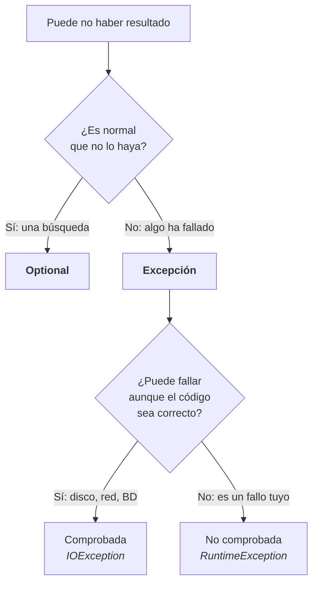

# 5. Excepciones y `Optional`

Dos situaciones que se parecen y no son lo mismo:

- **Algo ha ido mal** y no se puede continuar → **excepción**.
- **Algo simplemente no está**, y es normal → **`Optional`**.

Buscar un cliente que no existe **no es un error**: es un resultado posible. Que se caiga la base de datos, sí lo es.

!!! tip "Todo esto se copia y se pega en `jshell`"
    Los bloques están escritos para pegarlos tal cual; el comentario de la derecha dice lo que tiene que salir. Pega primero:

    ```java
    import java.util.*;
    ```

---

## 1. Qué es una excepción

Cuando Java no puede seguir, **lanza** un objeto que describe el problema y aborta lo que estaba haciendo.

```java
System.out.println(10 / 0);
// lanza java.lang.ArithmeticException: / by zero

Integer.parseInt("hola");
// lanza java.lang.NumberFormatException: For input string: "hola"

List.of(1, 2, 3).get(7);
// lanza java.lang.IndexOutOfBoundsException: Index 7 out of bounds for length 3
```

**El mensaje dice exactamente qué ha pasado.** Antes de buscar en internet, léelo.

Si nadie la captura, sube hasta arriba, el programa termina y se imprime la **traza**:

```
Exception in thread "main" java.lang.NumberFormatException: For input string: "hola"
    at java.base/java.lang.Integer.parseInt(Integer.java:652)
    at Catalogo.leer(Catalogo.java:18)      ← aquí está tu código
    at Main.main(Main.java:7)
```

**La línea que importa es la primera que lleva el nombre de una clase tuya.** Las de `java.base` son las tripas del lenguaje.

---

## 2. Capturarla: `try / catch`

```java
void convertir(String texto) {
    try {
        int n = Integer.parseInt(texto);
        System.out.println("Número: " + n);
    } catch (NumberFormatException e) {
        System.out.println("No es un número: " + texto);
    }
}

convertir("42");         // Número: 42
convertir("hola");       // No es un número: hola
```

Con varios `catch`, **del más concreto al más general**:

```java
try {
    // ...
} catch (NumberFormatException e) {
    System.out.println("Formato malo");
} catch (Exception e) {
    System.out.println("Otro fallo: " + e.getMessage());
}
```

Si pones `Exception` primero, los siguientes no compilan: ya lo captura todo él.

!!! danger "El error que más caro sale"
    ```java
    try {
        procesar(fichero);
    } catch (Exception e) {
        // nada
    }
    ```

    El programa sigue como si todo hubiera ido bien, con datos a medias, y **nadie se entera**. Semanas después aparece un resultado absurdo y no hay ni una línea de log que explique por qué.

    Un `catch` mínimamente decente siempre hace **una** de estas tres cosas: arreglarlo, informar, o volver a lanzar.

Y `finally`, que se ejecuta pase lo que pase:

```java
try {
    System.out.println(10 / 0);
} catch (ArithmeticException e) {
    System.out.println("capturada");
} finally {
    System.out.println("esto se ejecuta siempre");
}
// capturada
// esto se ejecuta siempre
```

---

## 3. Comprobadas y no comprobadas

Es la clasificación que hay que tener clara:

| | Ejemplos | ¿Obliga el compilador? |
|---|---|---|
| **No comprobadas** (`RuntimeException`) | `NullPointerException`, `IllegalArgumentException`, `NumberFormatException` | No |
| **Comprobadas** (`Exception`) | `IOException`, `SQLException` | **Sí**: o la capturas o la declaras |

```java
// No compila: java.io.IOException must be caught or declared to be thrown
java.nio.file.Files.readString(java.nio.file.Path.of("x.txt"));
```

Las dos salidas:

```java
// (a) capturarla
try {
    var t = java.nio.file.Files.readString(java.nio.file.Path.of("x.txt"));
} catch (java.io.IOException e) {
    System.out.println("No se pudo leer: " + e.getMessage());
}

// (b) declararla y que se ocupe quien llama
String leer(String ruta) throws java.io.IOException {
    return java.nio.file.Files.readString(java.nio.file.Path.of(ruta));
}
```

!!! info "La regla práctica"
    **Comprobada** = algo externo puede fallar aunque tu código sea perfecto (disco, red, base de datos).
    **No comprobada** = tu código tiene un fallo o le han pasado algo que no debía.

---

## 4. Crear tus propias excepciones

Es más simple de lo que parece: una clase que hereda y pasa el mensaje hacia arriba.

```java
class SaldoInsuficienteException extends RuntimeException {
    SaldoInsuficienteException(String mensaje) {
        super(mensaje);
    }
}
```

Eso es todo. `super(mensaje)` es lo que hace que `getMessage()` funcione.

Se lanza con `throw`:

```java
double saldo = 50;

void retirar(double cantidad) {
    if (cantidad <= 0)
        throw new IllegalArgumentException("La cantidad debe ser positiva: " + cantidad);
    if (cantidad > saldo)
        throw new SaldoInsuficienteException(
                "Saldo %.2f, se piden %.2f".formatted(saldo, cantidad));
    saldo -= cantidad;
    System.out.println("Retirados " + cantidad + ", queda " + saldo);
}

retirar(20);
// Retirados 20.0, queda 30.0

retirar(500);
// lanza SaldoInsuficienteException: Saldo 30,00, se piden 500,00

retirar(-5);
// lanza java.lang.IllegalArgumentException: La cantidad debe ser positiva: -5.0
```

!!! tip "Tres decisiones que se toman aquí"
    - **`RuntimeException` o `Exception`**: hereda de `RuntimeException` salvo que quieras obligar a quien llama a capturarla. En la práctica, casi siempre `RuntimeException`.
    - **El mensaje lleva los datos**: `"Saldo 30,00, se piden 500,00"` sirve; `"Error"` no sirve para nada.
    - **No inventes una clase por cada fallo.** Para argumentos malos ya existe `IllegalArgumentException`; créala solo cuando quien llama vaya a querer capturar **ese caso concreto**.

Y si capturas una para lanzar otra, **encadénala** con `cause` para no perder la pista:

```java
class CatalogoException extends RuntimeException {
    CatalogoException(String mensaje, Throwable causa) { super(mensaje, causa); }
}

try {
    Integer.parseInt("hola");
} catch (NumberFormatException e) {
    throw new CatalogoException("Precio mal escrito en la línea 12", e);
}
// lanza CatalogoException: Precio mal escrito en la línea 12
// Caused by: java.lang.NumberFormatException: For input string: "hola"
```

Ese **`Caused by:`** es lo que te lleva al origen real. Sin pasar la `e`, se pierde.

---

## 5. `try-with-resources`

Todo lo que se abre (fichero, conexión) hay que cerrarlo, también si hay un fallo. Se declara **dentro del paréntesis** y Java lo cierra solo:

```java
try (var lineas = java.nio.file.Files.lines(java.nio.file.Path.of("datos.txt"))) {
    lineas.forEach(System.out::println);
} catch (java.io.IOException e) {
    System.out.println("No se pudo leer: " + e.getMessage());
}
```

Sin esto harían falta un `finally`, una variable fuera y un `if (x != null)`. En la UT3, **todas las conexiones a base de datos se abren así**.

---

## 6. `Optional`: cuando el resultado puede no existir

El problema de siempre:

```java
var precios = Map.of("pan", 1.20, "leche", 0.95);
double p = precios.get("caviar") + 1;
// lanza java.lang.NullPointerException
```

`null` no avisa. Compila perfectamente y explota cuando se ejecuta.

**`Optional<T>` es una caja que puede tener un valor dentro o estar vacía**, y el tipo lo dice: quien lo recibe *sabe* que puede venir vacío.

```java
Optional<String> hay   = Optional.of("hola");
Optional<String> vacio = Optional.empty();

System.out.println(hay.isPresent());     // true
System.out.println(vacio.isPresent());   // false
System.out.println(hay);                 // Optional[hola]
System.out.println(vacio);               // Optional.empty
```

### Devolverlo

```java
record Cliente(int id, String nombre, String email) {}

var clientes = List.of(
    new Cliente(1, "Ana", "ana@iesx.es"),
    new Cliente(2, "Bruno", "bruno@iesx.es"));

Optional<Cliente> buscar(int id) {
    return clientes.stream().filter(c -> c.id() == id).findFirst();
}

System.out.println(buscar(1));    // Optional[Cliente[id=1, nombre=Ana, ...]]
System.out.println(buscar(99));   // Optional.empty
```

Fíjate: **`findFirst()` ya devuelve un `Optional`**. Los streams lo usan por todas partes.

### Sacar el valor

Aquí está el 90 % de lo que se usa:

```java
// 1 · un valor por defecto
System.out.println(buscar(99).map(Cliente::nombre).orElse("desconocido"));
// desconocido

// 2 · calcular el defecto solo si hace falta
System.out.println(buscar(99).map(Cliente::nombre).orElseGet(() -> "cliente-" + 99));
// cliente-99

// 3 · si no está, es un error de verdad → lanza
System.out.println(buscar(99)
        .orElseThrow(() -> new NoSuchElementException("No existe el cliente 99")));
// lanza java.util.NoSuchElementException: No existe el cliente 99

// 4 · hacer algo solo si está
buscar(1).ifPresent(c -> System.out.println("Encontrado: " + c.nombre()));
// Encontrado: Ana

// 5 · y si no, lo otro
buscar(99).ifPresentOrElse(
        c -> System.out.println("Encontrado: " + c.nombre()),
        () -> System.out.println("No está"));
// No está
```

### Encadenar sin un solo `if`

Esta es la razón de ser de `Optional`. «El correo del cliente 1, en mayúsculas, y si algo falta, un guion»:

```java
System.out.println(buscar(1)
        .map(Cliente::email)
        .map(String::toUpperCase)
        .orElse("—"));
// ANA@IESX.ES

System.out.println(buscar(99)
        .map(Cliente::email)
        .map(String::toUpperCase)
        .orElse("—"));
// —
```

Los `map` sobre un `Optional` vacío **no hacen nada**: la caja vacía sigue vacía hasta el final. Con `null` habría hecho falta un `if` antes de cada paso.

Y para filtrar:

```java
System.out.println(buscar(1)
        .filter(c -> c.email().endsWith("@iesx.es"))
        .map(Cliente::nombre)
        .orElse("sin correo del centro"));
// Ana
```

!!! danger "`get()` no se usa"
    ```java
    System.out.println(buscar(99).get());
    // lanza java.util.NoSuchElementException: No value present
    ```

    Llamar a `get()` sin comprobar antes es exactamente el `NullPointerException` del que querías escapar, con otro nombre. Usa `orElse`, `orElseGet`, `orElseThrow` o `ifPresent`.

!!! warning "Dónde NO se pone un `Optional`"
    - **No** como parámetro de un método: `void f(Optional<String> s)` — haz dos métodos, o acepta `null`.
    - **No** como campo de una clase o un `record`.
    - **No** en una colección: `List<Optional<String>>` no tiene sentido; filtra y quédate con los que hay.

    Su sitio es **lo que devuelve un método de búsqueda**. Y punto.

---

## 7. Cuándo cada cosa

| Situación | Qué se hace |
|---|---|
| El cliente no existe | `Optional.empty()` — es normal |
| El id es negativo | `IllegalArgumentException` — te han llamado mal |
| El CSV tiene una línea rota | Saltarla y contarla, o excepción propia si es grave |
| La base de datos no responde | Excepción — no se puede seguir |
| Falta un dato opcional del formulario | `Optional`, o un valor por defecto |



!!! success "Lo que hay que llevarse"
    1. Leer la traza y encontrar **tu** línea.
    2. Un `catch` vacío es peor que no capturar nada.
    3. Una excepción propia son **tres líneas**, y el mensaje lleva los datos.
    4. Comprobada = algo externo; no comprobada = fallo del código.
    5. `Optional` se devuelve, se encadena con `map` y se cierra con `orElse`. **Nunca con `get()`.**

---

## Pruébalo ahora (10 min)

Con el `record Cliente` y la lista del punto 6 en `jshell`:

1. Escribe `dividir(int a, int b)` que devuelva `Optional<Integer>`, vacío si `b` es 0.
2. Un método `edad(String texto)` que devuelva `Optional<Integer>`: vacío si el texto no es un número.
3. El nombre del cliente 2 en mayúsculas, con `"—"` si no existe. Pruébalo con el 2 y con el 50.
4. Haz que `buscar(50)` lance una excepción con un mensaje que incluya el id.

??? success "Solución de las cuatro"

    ```java
    // 1
    Optional<Integer> dividir(int a, int b) {
        return b == 0 ? Optional.empty() : Optional.of(a / b);
    }
    System.out.println(dividir(10, 2));    // Optional[5]
    System.out.println(dividir(10, 0));    // Optional.empty

    // 2
    Optional<Integer> edad(String texto) {
        try {
            return Optional.of(Integer.parseInt(texto));
        } catch (NumberFormatException e) {
            return Optional.empty();
        }
    }
    System.out.println(edad("34"));        // Optional[34]
    System.out.println(edad("treinta"));   // Optional.empty

    // 3
    System.out.println(buscar(2).map(c -> c.nombre().toUpperCase()).orElse("—"));
    // BRUNO
    System.out.println(buscar(50).map(c -> c.nombre().toUpperCase()).orElse("—"));
    // —

    // 4
    buscar(50).orElseThrow(() -> new NoSuchElementException("No existe el cliente 50"));
    // lanza java.util.NoSuchElementException: No existe el cliente 50
    ```

    **En el 2 se ve la frontera entera del tema:** `parseInt` avisa de un texto malo con una **excepción**, pero para quien llama a `edad` un texto que no es un número es un caso normal, así que se traduce a **`Optional`**. Ahí dentro, el `catch` no está vacío: transforma.

    **En el 3, el `map` sobre el vacío no se ejecuta.** Ni un `if`.

---

## Ejercicios (con solución)

### E1 — ¿Qué imprime?

```java
try {
    System.out.println(10 / 0);
} catch (ArithmeticException e) {
    System.out.println("A");
} finally {
    System.out.println("B");
}
System.out.println("C");
```

??? success "Solución"

    **`A`, `B` y `C`.**

    El `catch` corta la excepción, `finally` se ejecuta siempre y el programa continúa con normalidad. Si no hubiera `catch`, saldría `B` y el programa moriría sin llegar a `C`.

### E2 — Traduce el error a `Optional`

Escribe `precio(String texto)` que devuelva `Optional<Double>`: vacío si el texto no es un número o si es negativo.

??? success "Solución"

    ```java
    Optional<Double> precio(String texto) {
        try {
            double d = Double.parseDouble(texto);
            return d < 0 ? Optional.empty() : Optional.of(d);
        } catch (NumberFormatException e) {
            return Optional.empty();
        }
    }
    System.out.println(precio("12.50"));   // Optional[12.5]
    System.out.println(precio("-3"));      // Optional.empty
    System.out.println(precio("caro"));    // Optional.empty
    ```

    Es el patrón que usarás en la UT3 para leer cada celda de un CSV sucio.

### E3 — Tu excepción

Crea `ProductoNoEncontradoException` y un método `buscarProducto(String codigo)` que la lance con un mensaje que incluya el código.

??? success "Solución"

    ```java
    class ProductoNoEncontradoException extends RuntimeException {
        ProductoNoEncontradoException(String codigo) {
            super("No existe el producto con código " + codigo);
        }
    }

    var catalogo = Map.of("A1", "Casco", "B2", "Bici");

    String buscarProducto(String codigo) {
        var nombre = catalogo.get(codigo);
        if (nombre == null) throw new ProductoNoEncontradoException(codigo);
        return nombre;
    }

    System.out.println(buscarProducto("A1"));    // Casco
    buscarProducto("Z9");
    // lanza ProductoNoEncontradoException: No existe el producto con código Z9
    ```

    El constructor recibe **el dato**, no el mensaje ya montado: así todos los mensajes salen iguales y nadie se lo inventa.

    Discutible pero importante: aquí el `Optional` sería mejor diseño si «no existe» es un caso normal. Se lanza excepción cuando el código **tenía** que existir.

### E4 — Encadenar sin `if`

Con `buscar(int id)` del punto 6, escribe en **una sola expresión**: el dominio del correo (lo que va detrás de la `@`) del cliente `id`, o `"sin correo"`.

??? success "Solución"

    ```java
    String dominio(int id) {
        return buscar(id)
                .map(Cliente::email)
                .filter(e -> e.contains("@"))
                .map(e -> e.substring(e.indexOf('@') + 1))
                .orElse("sin correo");
    }
    System.out.println(dominio(1));     // iesx.es
    System.out.println(dominio(99));    // sin correo
    ```

    Tres cosas pueden faltar —el cliente, el correo, la `@`— y **no hay un solo `if`**. En cuanto la caja se vacía, los pasos siguientes se saltan.

### E5 — El `catch` vacío

Explica qué tiene de malo y arréglalo.

```java
try {
    guardar(pedido);
} catch (Exception e) { }
```

??? success "Solución"

    El pedido **no se ha guardado** y el programa continúa como si sí. El fallo aparecerá días después, en otro sitio, y no habrá rastro de dónde empezó.

    ```java
    try {
        guardar(pedido);
    } catch (SQLException e) {
        throw new PedidoException("No se pudo guardar el pedido " + pedido.id(), e);
    }
    ```

    Dos cambios: se captura **lo concreto** (`SQLException`, no `Exception`) y se relanza **con la causa**, para que el `Caused by:` lleve al origen.

### E6 — `Optional` mal usado

Di qué está mal en cada línea.

```java
// (a)
void registrar(Optional<String> telefono) { ... }

// (b)
record Cliente(String nombre, Optional<String> email) {}

// (c)
if (buscar(1).isPresent()) System.out.println(buscar(1).get().nombre());
```

??? success "Solución"

    **(a)** `Optional` no se usa como parámetro. Quien llama tiene que envolver el valor para nada, y además puede pasarte `null` — con lo que tendrías un `Optional` nulo, que es lo peor de los dos mundos. Haz dos métodos, o acepta el `String` y comprueba.

    **(b)** Tampoco como campo. `Optional` no es serializable y complica Jackson y JPA, que verás en la UT3 y la UT4.

    **(c)** Compila y funciona, pero es `Optional` escrito como si fuera `null`: hace la búsqueda **dos veces** y usa `get()`. Se escribe así:

    ```java
    buscar(1).map(Cliente::nombre).ifPresent(System.out::println);
    ```
