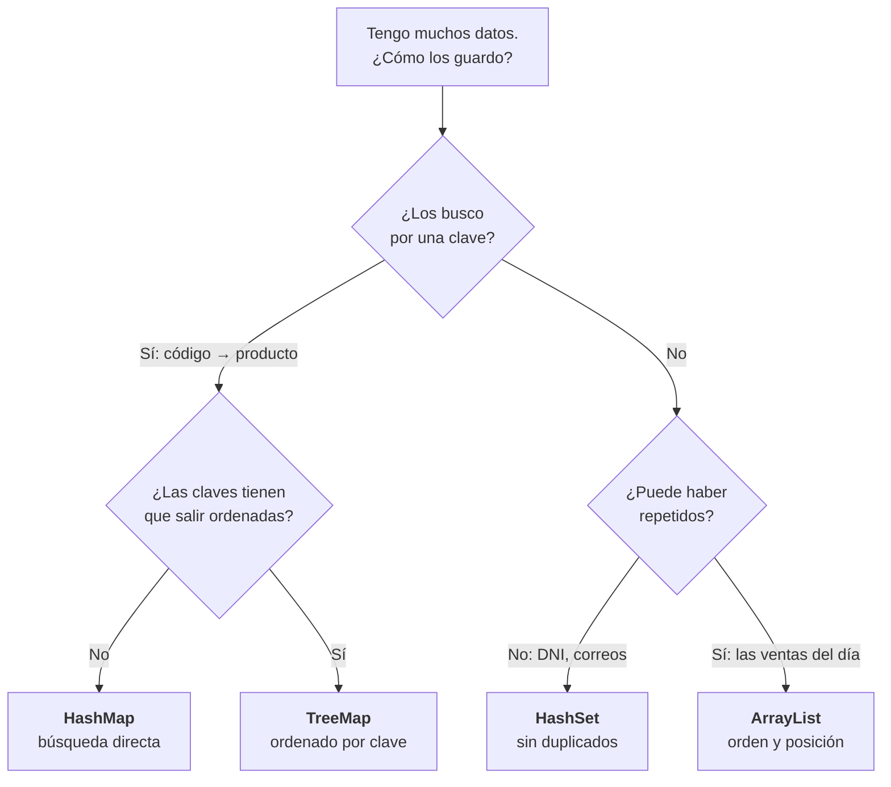
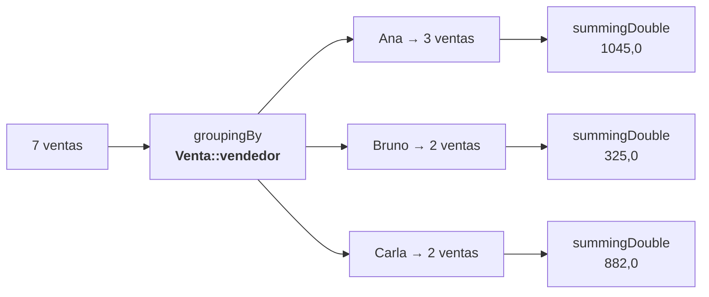

# 1. Estructuras de datos, aplicadas

En la UT2 viste qué es una `List`, un `Set` y un `Map`. Aquí se trata de **elegir la correcta para un problema real** y de sacar informes de un montón de datos.

!!! info "Un único ejemplo, en todo el tema"
    Una tienda de bicicletas con sus ventas. Todo lo de esta página se ejecuta sobre los mismos datos, y al final está el programa entero.

---

## 1. El mapa de las cuatro estructuras



Y lo que de verdad hay que retener:

| | Guarda | Busca por | Orden | Coste de buscar |
|---|---|---|---|---|
| **`ArrayList`** | Todo, con repetidos | Posición | De inserción | Recorre entero |
| **`HashSet`** | Sin repetidos | Contenido | **Ninguno** | Directo |
| **`HashMap`** | Clave → valor | Clave | **Ninguno** | Directo |
| **`TreeMap`** | Clave → valor | Clave | Natural | Logarítmico |

!!! danger "El error que hay que ver una vez con los propios ojos"
    Buscar en una lista recorre la lista entera. Con 30 elementos da igual; con 200.000, no.

    ```java
    var lista = new ArrayList<Integer>();
    for (int i = 0; i < 200_000; i++) lista.add(i);
    var conjunto = new HashSet<>(lista);

    long t = System.nanoTime();
    lista.contains(199_999);
    System.out.println((System.nanoTime() - t) / 1000 + " µs");      // 1483 µs

    t = System.nanoTime();
    conjunto.contains(199_999);
    System.out.println((System.nanoTime() - t) / 1000 + " µs");      // 3 µs
    ```

    Quinientas veces. **Elegir la estructura no es estilo: es el rendimiento de la aplicación.**

---

## 2. Los datos del ejemplo

```java
record Venta(String vendedor, String producto, String categoria,
             int unidades, double precioUnidad) {

    double importe() { return unidades * precioUnidad; }
}
```

```java
var ventas = List.of(
    new Venta("Ana",   "Bici urbana",  "bicicletas", 2, 450.0),
    new Venta("Bruno", "Casco",        "seguridad",  5,  35.0),
    new Venta("Ana",   "Candado",      "seguridad",  3,  25.0),
    new Venta("Carla", "Bici montaña", "bicicletas", 1, 780.0),
    new Venta("Bruno", "Luces",        "seguridad", 10,  15.0),
    new Venta("Ana",   "Casco",        "seguridad",  2,  35.0),
    new Venta("Carla", "Cámara",       "repuestos", 12,   8.5));
```

Pega eso en `jshell`, con los dos `import` delante, y ve probando lo que viene:

```java
import java.util.*;
import java.util.stream.*;
```

Los bloques que siguen están escritos para **copiarlos y pegarlos tal cual**; el comentario de la derecha dice lo que tiene que salir.

---

## 3. Agrupar: la operación que más se usa

**Cuánto factura cada vendedor.**

```java
System.out.println(ventas.stream().collect(Collectors.groupingBy(
        Venta::vendedor,
        Collectors.summingDouble(Venta::importe))));
// {Bruno=325.0, Ana=1045.0, Carla=882.0}
```

Lee la instrucción en dos partes:



- El **primer parámetro** dice **cómo se hacen los montones**: uno por vendedor.
- El **segundo** dice **qué se hace con cada montón**: sumar los importes.

Cambiando el segundo parámetro sale otra cosa, sin tocar nada más:

```java
System.out.println(ventas.stream().collect(Collectors.groupingBy(Venta::vendedor)));
// {Bruno=[Venta[...], Venta[...]], Ana=[...], Carla=[...]}  las ventas enteras
System.out.println(ventas.stream().collect(Collectors.groupingBy(
        Venta::vendedor, Collectors.counting())));
// {Bruno=2, Ana=3, Carla=2}          cuántas

System.out.println(ventas.stream().collect(Collectors.groupingBy(
        Venta::vendedor, Collectors.averagingDouble(Venta::importe))));
// {Bruno=162.5, Ana=348.33333333333337, Carla=441.0}   la media

System.out.println(ventas.stream().collect(Collectors.groupingBy(
        Venta::categoria,
        Collectors.mapping(Venta::producto, Collectors.toSet()))));
// {seguridad=[Casco, Luces, Candado], bicicletas=[...], repuestos=[Cámara]}
```

Ese último, `mapping`, **transforma dentro de cada grupo** antes de recogerlo. Es el que más cuesta ver y el que más se necesita.

!!! danger "El orden de las claves NO está garantizado"
    `groupingBy` devuelve un **`HashMap`**. Fíjate en la salida de arriba: sale `Bruno` antes que `Ana`.

    Si el informe tiene que salir ordenado, hay que pedirlo:

    ```java
    System.out.println(ventas.stream().collect(Collectors.groupingBy(
            Venta::vendedor, TreeMap::new, Collectors.counting())));
    // {Ana=3, Bruno=2, Carla=2}
    ```

    Mucha gente cree que `HashMap` ordena porque con sus datos de prueba salió ordenado por casualidad. **Es la pregunta que más cae en el examen.**

### Agrupar en dos niveles

```java
System.out.println(ventas.stream().collect(Collectors.groupingBy(
        Venta::categoria, TreeMap::new,
        Collectors.groupingBy(Venta::vendedor, TreeMap::new,
                              Collectors.summingDouble(Venta::importe)))));
// {bicicletas={Ana=900.0, Carla=780.0},
// repuestos={Carla=102.0},
// seguridad={Ana=70.0, Bruno=325.0}}
```

**El `TreeMap::new` hay que ponerlo en los dos niveles.** Poner solo el de fuera es el fallo clásico: las categorías salen ordenadas y los vendedores de dentro, no.

---

## 4. Ordenar con criterios

```java
System.out.println(ventas.stream()
      .sorted(Comparator.comparingDouble(Venta::importe).reversed())
      .map(v -> v.producto() + " " + v.importe())
      System.out.println(.toList());
// [Bici urbana 900.0, Bici montaña 780.0, Casco 175.0, ...]
```

Y con desempate:

```java
System.out.println(ventas.stream()
      .sorted(Comparator.comparing(Venta::categoria)
                        .thenComparing(Venta::producto))
      System.out.println(.map(Venta::producto).toList());
// [Bici montaña, Bici urbana, Cámara, Candado, Casco, Casco, Luces]
```

!!! warning "Dónde va el `.reversed()`"
    ```java
    // MAL: invierte TODO, incluido el desempate por nombre
    Comparator.comparing(Venta::categoria).thenComparing(Venta::producto).reversed()

    // BIEN: solo invierte la categoría
    Comparator.comparing(Venta::categoria).reversed().thenComparing(Venta::producto)
    ```

    `reversed()` invierte **el comparador construido hasta ese punto**. Por eso va pegado a lo que quieres invertir.

### El ranking: ordenar un mapa

Sacar el mapa de facturación ordenado **por importe** —no por nombre— requiere volver a hacer stream sobre las entradas. Es el paso que más cuesta:

```java
var facturacion = ventas.stream().collect(Collectors.groupingBy(
    Venta::vendedor, Collectors.summingDouble(Venta::importe)));
System.out.println(facturacion.entrySet().stream()
      .sorted(Map.Entry.<String, Double>comparingByValue().reversed())   // (1)
      .map(e -> e.getKey() + ": " + e.getValue())
      System.out.println(.toList());
// [Ana: 1045.0, Carla: 882.0, Bruno: 325.0]
```

1. **El `<String, Double>` explícito es obligatorio.** Sin él, el compilador no infiere el tipo dentro de `sorted` y da un error que no señala el problema real.

---

## 5. Estadísticas de una pasada

```java
var est = ventas.stream().mapToDouble(Venta::importe).summaryStatistics();
// average=321.714286, max=900.000000}
System.out.println(est.getMax());   // 900.0
System.out.println(est.getAverage());   // 321.7142857142857
```

Cinco datos recorriendo la lista **una vez**. Lo alternativo son cinco recorridos.

Y el máximo, con su matiz:

```java
System.out.println(ventas.stream().max(Comparator.comparingDouble(Venta::importe)));
// Optional[Venta[vendedor=Ana, producto=Bici urbana, ...]]
System.out.println(ventas.stream().max(Comparator.comparingDouble(Venta::importe))
      System.out.println(.map(Venta::producto).orElse("—"));
// Bici urbana
```

`max` devuelve **`Optional`** porque la lista podría estar vacía. Siempre se termina con `.map(...).orElse(...)`.

---

## 6. El programa entero

Todo junto, en un fichero que se ejecuta con `java Informe.java`:

```java
// Informe.java  ·  java Informe.java
import java.util.*;
import java.util.stream.*;

record Venta(String vendedor, String producto, String categoria,
             int unidades, double precioUnidad) {
    double importe() { return unidades * precioUnidad; }
}

void main() {

    var ventas = List.of(
        new Venta("Ana",   "Bici urbana",  "bicicletas", 2, 450.0),
        new Venta("Bruno", "Casco",        "seguridad",  5,  35.0),
        new Venta("Ana",   "Candado",      "seguridad",  3,  25.0),
        new Venta("Carla", "Bici montaña", "bicicletas", 1, 780.0),
        new Venta("Bruno", "Luces",        "seguridad", 10,  15.0),
        new Venta("Ana",   "Casco",        "seguridad",  2,  35.0),
        new Venta("Carla", "Cámara",       "repuestos", 12,   8.5));

    // 1 · facturación por vendedor, en ranking
    var facturacion = ventas.stream().collect(Collectors.groupingBy(
            Venta::vendedor, Collectors.summingDouble(Venta::importe)));

    IO.println("=== Ranking de vendedores ===");
    facturacion.entrySet().stream()
            .sorted(Map.Entry.<String, Double>comparingByValue().reversed())
            .forEach(e -> IO.println("  %-8s %9.2f €".formatted(e.getKey(), e.getValue())));

    // 2 · unidades vendidas por categoría, ordenado
    IO.println("\n=== Unidades por categoría ===");
    ventas.stream()
            .collect(Collectors.groupingBy(Venta::categoria, TreeMap::new,
                     Collectors.summingInt(Venta::unidades)))
            .forEach((cat, uds) -> IO.println("  %-12s %3d".formatted(cat, uds)));

    // 3 · productos distintos por categoría
    IO.println("\n=== Catálogo vendido ===");
    ventas.stream()
            .collect(Collectors.groupingBy(Venta::categoria, TreeMap::new,
                     Collectors.mapping(Venta::producto,
                              Collectors.toCollection(TreeSet::new))))
            .forEach((cat, prods) -> IO.println("  %-12s %s".formatted(cat, prods)));

    // 4 · estadísticas
    var est = ventas.stream().mapToDouble(Venta::importe).summaryStatistics();
    IO.println("\n=== Resumen ===");
    IO.println("  Ventas:  %d".formatted(est.getCount()));
    IO.println("  Total:   %.2f €".formatted(est.getSum()));
    IO.println("  Media:   %.2f €".formatted(est.getAverage()));
    IO.println("  Mayor:   %.2f €".formatted(est.getMax()));

    // 5 · la venta más grande
    IO.println("  Estrella: " + ventas.stream()
            .max(Comparator.comparingDouble(Venta::importe))
            .map(Venta::producto).orElse("—"));
}
```

```
=== Ranking de vendedores ===
  Ana        1045,00 €
  Carla       882,00 €
  Bruno       325,00 €

=== Unidades por categoría ===
  bicicletas     3
  repuestos     12
  seguridad     20

=== Catálogo vendido ===
  bicicletas   [Bici montaña, Bici urbana]
  repuestos    [Cámara]
  seguridad    [Candado, Casco, Luces]

=== Resumen ===
  Ventas:  7
  Total:   2252,00 €
  Media:   321,71 €
  Mayor:   900,00 €
  Estrella: Bici urbana
```

!!! success "Lo que hay que saber hacer al salir de aquí"
    1. **Elegir** entre lista, conjunto y mapa con un argumento, no por costumbre.
    2. **Agrupar** con `groupingBy` y cambiar lo que se hace con cada grupo.
    3. Saber que `groupingBy` **no ordena**, y pedir `TreeMap::new` cuando haga falta.
    4. **Ordenar un mapa por valor**, volviendo a hacer stream sobre `entrySet()`.
    5. Terminar cualquier `max`/`min` con `.map(...).orElse(...)`.

---

## Pruébalo ahora (15 min)

Con el programa de arriba:

1. Añade una venta de `"Ana"` de `"Bici urbana"` y comprueba que el ranking cambia.
2. Saca **el producto más vendido en unidades** (no en euros).
3. Saca la **media de unidades por venta** de cada categoría.
4. Cambia el punto 3 para que los productos salgan **de más caro a más barato** en vez de alfabéticamente.
5. Quita el `TreeMap::new` del punto 2 y ejecuta varias veces. ¿Sale siempre igual?

??? success "Solución de las cinco"

    **1.** Al añadir la venta, Ana sube y el ranking se recoloca:

    ```java
    new Venta("Ana", "Bici urbana", "bicicletas", 1, 450.0)
    ```

    ```
    Ana        1495,00 €
    Carla       882,00 €
    Bruno       325,00 €
    ```

    No hay que tocar ni una línea del programa: el informe se recalcula porque **describe** lo que quiere, no cómo recorrer.

    ```java
    // 2 · el más vendido en unidades
    ventas.stream()
          .collect(Collectors.groupingBy(Venta::producto,
                   Collectors.summingInt(Venta::unidades)))
          .entrySet().stream()
          .max(Map.Entry.comparingByValue())
          .map(Map.Entry::getKey)
          .orElse("—");                       // Cámara (12 unidades)

    // 3 · media de unidades por categoría
    ventas.stream().collect(Collectors.groupingBy(
            Venta::categoria, TreeMap::new,
            Collectors.averagingInt(Venta::unidades)));

    // 4 · productos ordenados por precio, no alfabéticamente
    ventas.stream().collect(Collectors.groupingBy(
            Venta::categoria, TreeMap::new,
            Collectors.collectingAndThen(
                Collectors.toList(),
                lista -> lista.stream()
                        .sorted(Comparator.comparingDouble(Venta::precioUnidad).reversed())
                        .map(Venta::producto).distinct().toList())));
    ```

    En el **2** hay que volver a hacer *stream* sobre `entrySet()`: un `Map` no es un `Stream`. Es el paso que más cuesta ver.

    En el **4**, `collectingAndThen` recoge el grupo y después lo transforma. Es la forma de ordenar **dentro** de cada montón.

    **5.** Quitando el `TreeMap::new`, con estos siete datos **suele** salir siempre igual… y eso es precisamente lo que engaña:

    ```
    {bicicletas=3, repuestos=12, seguridad=20}    ← hoy
    {seguridad=20, bicicletas=3, repuestos=12}    ← con otros datos
    ```

    `groupingBy` devuelve un `HashMap`, y **un `HashMap` no garantiza ningún orden**. Que con tus datos de prueba salga ordenado no es una garantía: es una casualidad que depende de cómo se repartan los *hash*. El día que cambien las categorías, cambia el orden y tu informe sale distinto sin que hayas tocado nada.
---

## Ejercicios (con solución)

### E1 — Elige la estructura

(a) los códigos de barras ya escaneados · (b) las líneas de un albarán, en orden · (c) el stock por código de producto · (d) el ranking de productos, ordenado alfabéticamente y sin repetir · (e) las últimas diez operaciones para deshacer

??? success "Solución"

    | | Estructura | Por qué |
    |---|---|---|
    | (a) Códigos escaneados | `HashSet` | Solo importa si ya está |
    | (b) Líneas del albarán | `ArrayList` | Orden y puede haber repetidos |
    | (c) Stock por código | `HashMap<String,Integer>` | Búsqueda directa por clave |
    | (d) Ranking sin repetir | `TreeSet` | Único y ordenado |
    | (e) Deshacer | `ArrayDeque` como pila | `push` / `pop` |

    La (c) es la que más se falla: mucha gente pone una `List<Producto>` y busca recorriéndola. Funciona con veinte productos y se arrastra con veinte mil.

### E2 — ¿Qué imprime?

```java
var m = new HashMap<String, Integer>();
m.put("pera", 3); m.put("manzana", 5); m.put("kiwi", 1);
m.keySet();
```

??? success "Solución"

    **No se puede saber.** Un `HashMap` no garantiza ningún orden.

    Con estas tres claves concretas suele salir siempre lo mismo —por cómo se reparten los *hash*— y ahí está la trampa: parece que hay un orden y no lo hay. Cambia una clave y cambia todo.

    Si el orden importa: `TreeMap` (alfabético) o `LinkedHashMap` (de inserción).

### E3 — El `TreeMap` que falta

```java
var r = ventas.stream().collect(Collectors.groupingBy(
        Venta::categoria, TreeMap::new,
        Collectors.groupingBy(Venta::vendedor,
                              Collectors.summingDouble(Venta::importe))));
```

¿Qué sale ordenado y qué no?

??? success "Solución"

    **Las categorías sí; los vendedores de dentro, no.** El `TreeMap::new` solo está en el nivel exterior; el `groupingBy` interior devuelve un `HashMap`.

    Hay que ponerlo en los dos:

    ```java
    Collectors.groupingBy(Venta::vendedor, TreeMap::new,
                          Collectors.summingDouble(Venta::importe))
    ```

    Y se ve directamente en la salida, sin necesidad de saberlo de memoria.

### E4 — El `.reversed()` mal puesto

Quieres las ventas ordenadas por categoría **descendente** y, dentro de cada categoría, por producto **alfabético**. ¿Cuál de las dos formas lo hace?

??? success "Solución"


    Quieres las ventas ordenadas por categoría descendente y, dentro, por producto alfabético.

    ```java
    // MAL
    Comparator.comparing(Venta::categoria).thenComparing(Venta::producto).reversed()

    // BIEN
    Comparator.comparing(Venta::categoria).reversed().thenComparing(Venta::producto)
    ```

    El primero invierte **los dos** criterios: las categorías salen al revés y los productos también. `reversed()` actúa sobre todo lo encadenado hasta ese punto.

### E5 — El máximo de un mapa

Dado `Map<String, Double> facturacion`, saca el nombre del que más factura.

```java
facturacion.entrySet().stream()
           .max(Map.Entry.comparingByValue())
           .map(Map.Entry::getKey)
           .orElse("—");
```

Las dos cosas que se preguntan:

??? success "Solución"

    1. **Hay que volver a hacer stream sobre `entrySet()`.** Un `Map` no es un `Stream`.
    2. `max` devuelve `Optional`, así que termina en `.orElse(...)`.

### E6 — Una pasada o cinco

Necesitas el total, la media, el mínimo, el máximo y el número de ventas. ¿Cuántas veces hay que recorrer la lista?

??? success "Solución"


    Necesitas el total, la media, el mínimo, el máximo y el número de ventas.

    ```java
    // Cinco recorridos
    double total = ventas.stream().mapToDouble(Venta::importe).sum();
    double media = ventas.stream().mapToDouble(Venta::importe).average().orElse(0);
    // … y tres más

    // Uno
    var est = ventas.stream().mapToDouble(Venta::importe).summaryStatistics();
    ```

    Con siete ventas da igual. Con dos millones de filas leídas de un fichero —que es lo que viene en el tema siguiente— la diferencia se mide en segundos.
