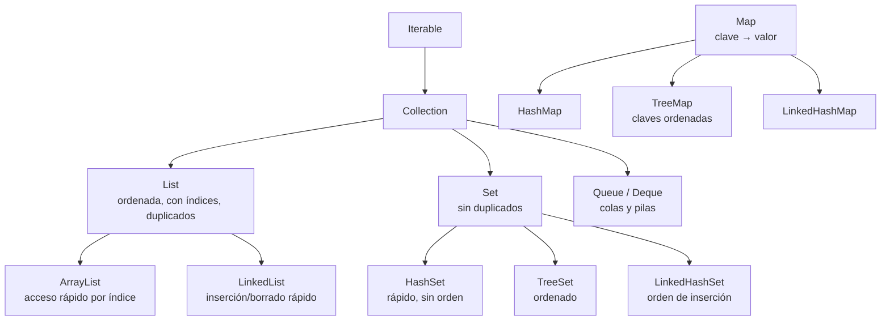

# Estructuras de datos: elegir bien

> En la UT2 viste `List`, `Set` y `Map`. Aquí aprendes a **elegir la correcta**, a anidarlas, a ordenarlas con criterios complejos y a exprimir los streams para sacar informes.

## 1. El mapa completo de colecciones



**La chuleta de decisión:**

| Necesito… | Uso | Por qué |
|---|---|---|
| Lista con orden y acceso por posición | `ArrayList` | Acceso por índice O(1) |
| Muchas inserciones/borrados al principio | `LinkedList` | No desplaza elementos |
| Elementos únicos, no me importa el orden | `HashSet` | El más rápido |
| Elementos únicos **ordenados** | `TreeSet` | Ordena solo |
| Elementos únicos en **orden de inserción** | `LinkedHashSet` | Mantiene el orden en que entraron |
| Buscar por clave | `HashMap` | Búsqueda O(1) |
| Buscar por clave con claves **ordenadas** | `TreeMap` | Orden natural o `Comparator` |
| Pila (LIFO) o cola (FIFO) | `ArrayDeque` | Rápida por ambos extremos |

```java
var pila = new ArrayDeque<String>();
pila.push("a"); pila.push("b");
IO.println(pila.pop());          // b  (LIFO: el último que entra, primero sale)

var cola = new ArrayDeque<String>();
cola.offer("a"); cola.offer("b");
IO.println(cola.poll());         // a  (FIFO: el primero que entra, primero sale)
```

!!! bug "El `HashSet` que no encuentra lo que acabas de meter"
    Un `HashSet` detecta duplicados usando `equals()` y `hashCode()`. Si metes objetos de una **clase** que no los implementa, dos objetos "iguales" se guardarán como distintos. Con un **`record`** no pasa: los genera por ti. Otra razón para usar records.

## 2. Recorrer y modificar sin romper nada

```bash
var lista = new ArrayList<>(List.of("a", "b", "c"));

// MAL  ConcurrentModificationException: modificar mientras recorres
for (var s : lista) { if (s.equals("b")) lista.remove(s); }

// BIEN La forma correcta
lista.removeIf(s -> s.equals("b"));
```

`removeIf`, `replaceAll` y `computeIfAbsent` son los métodos modernos que evitan estos accidentes:

```java
var stock = new HashMap<String, List<String>>();
// Añadir a una lista dentro de un map, exista o no la clave:
stock.computeIfAbsent("movilidad", k -> new ArrayList<>()).add("Patinete");
```

## 3. Estructuras anidadas

Los datos reales no son planos. Un `Map` de listas, una lista de records con listas dentro…

```bash
record Alumno(String nombre, List<Integer> notas) {}

var grupo = List.of(
    new Alumno("Ana",   List.of(8, 7, 9)),
    new Alumno("Bruno", List.of(4, 6, 5)),
    new Alumno("Carla", List.of(9, 9, 10))
);

// Media de cada alumno
for (var a : grupo) {
    var media = a.notas().stream().mapToInt(Integer::intValue).average().orElse(0);
    IO.println(a.nombre() + ": " + media);
}
```

## 4. Ordenar con `Comparator`

```java
record Producto(String nombre, String categoria, double precio) {}
var lista = new ArrayList<>(catalogo);

// Por un campo
lista.sort(Comparator.comparing(Producto::precio));

// Descendente
lista.sort(Comparator.comparing(Producto::precio).reversed());

// Por dos criterios: categoría y, dentro, precio descendente
lista.sort(Comparator.comparing(Producto::categoria)
                     .thenComparing(Comparator.comparing(Producto::precio).reversed()));

// Ignorando mayúsculas
lista.sort(Comparator.comparing(Producto::nombre, String.CASE_INSENSITIVE_ORDER));
```

:material-alert: `sort()` **modifica la lista original** y no funciona sobre listas inmutables (`List.of`). Si necesitas conservar el original, usa el stream: `lista.stream().sorted(...).toList()`.

## 5. Streams para informes

Lo que en la UT2 era filtrar y mapear, aquí se convierte en **análisis de datos**:

``` { .java .numerado }
// Agrupar por categoría
Map<String, List<Producto>> porCat = catalogo.stream()
    .collect(Collectors.groupingBy(Producto::categoria));

// Contar por categoría
Map<String, Long> cuantos = catalogo.stream()
    .collect(Collectors.groupingBy(Producto::categoria, Collectors.counting()));

// Sumar precios por categoría
Map<String, Double> suma = catalogo.stream()
    .collect(Collectors.groupingBy(Producto::categoria,
             Collectors.summingDouble(Producto::precio)));

// Estadísticas de golpe (min, max, media, suma, count)
var stats = catalogo.stream().mapToDouble(Producto::precio).summaryStatistics();
IO.println(stats.getMax() + " / " + stats.getAverage());

// Particionar en dos grupos (true/false)
Map<Boolean, List<Producto>> caros = catalogo.stream()
    .collect(Collectors.partitioningBy(p -> p.precio() > 100));

// Unir textos
var nombres = catalogo.stream().map(Producto::nombre)
    .collect(Collectors.joining(", ", "[", "]"));

// Reducir a un valor
var total = catalogo.stream().map(Producto::precio)
    .reduce(0.0, Double::sum);
```

## 6. Coste de las operaciones

Elegir la colección correcta es, en el fondo, elegir el **coste**. Esta tabla explica por qué:

| Operación | `ArrayList` | `LinkedList` | `HashSet` / `HashMap` | `TreeSet` / `TreeMap` |
|---|---|---|---|---|
| Acceso por índice | **O(1)** | O(n) | — | — |
| Buscar un valor | O(n) | O(n) | **O(1)** | O(log n) |
| Insertar al final | O(1)* | **O(1)** | O(1) | O(log n) |
| Insertar al principio | O(n) | **O(1)** | — | — |
| Borrar por valor | O(n) | O(n) | **O(1)** | O(log n) |

* amortizado: de vez en cuando el `ArrayList` duplica su array interno.

Traducido a la práctica: buscar 10.000 veces en una `List` de 10.000 elementos son 100 millones de comparaciones; con un `HashMap`, 10.000. Ese es el salto entre una API que responde en 3 segundos y otra que responde en 3 milisegundos.

```bash
// MAL  O(n²): por cada pedido, recorre TODOS los productos
for (var pedido : pedidos)
    for (var p : productos)
        if (p.id().equals(pedido.productoId())) { ... }

// BIEN O(n): índice por id y consulta directa
var indice = productos.stream()
    .collect(Collectors.toMap(Producto::id, Function.identity()));
for (var pedido : pedidos) {
    var p = indice.get(pedido.productoId());
    ...
}
```

Ese patrón —**construir un índice antes del bucle**— es una de las optimizaciones que más veces vas a aplicar en tu vida profesional.

## 7. Inmutabilidad

```java
var inmutable = List.of("a", "b");        // no admite add, remove ni sort
var mutable   = new ArrayList<>(inmutable);
var copia     = List.copyOf(mutable);     // copia inmutable
var vacia     = Collections.<String>emptyList();
```

`List.of(...)`, `Set.of(...)` y `Map.of(...)` devuelven colecciones **inmutables**: cualquier intento de modificarlas lanza `UnsupportedOperationException`. Eso es una ventaja, no una limitación:

- Son seguras entre hilos sin sincronizar nada.
- Nadie puede modificar por accidente los datos que devuelve tu repositorio.
- Un record con una `List.of` dentro es realmente inmutable.

!!! danger "El fallo de encapsulación más común"
    ```
    public List<Producto> buscarTodos() { return datos; }          // MAL  devuelve TU lista
    // BIEN copia inmutable
    public List<Producto> buscarTodos() { return List.copyOf(datos); }
    ```

    En la primera versión, quien reciba la lista puede hacer `.clear()` y vaciar tu almacén desde fuera. Es un error que se cuela en muchos proyectos de clase y en no pocos profesionales.

## 8. `flatMap`: aplanar lo anidado

``` { .java .numerado }
record Pedido(String cliente, List<String> productos) {}

var pedidos = List.of(
    new Pedido("Ana",   List.of("Casco", "Patinete")),
    new Pedido("Bruno", List.of("Casco", "Candado")));

// map    → Stream<List<String>>  ← una lista por pedido, no sirve
// flatMap→ Stream<String>        ← todos los productos, sueltos
var todos = pedidos.stream().flatMap(p -> p.productos().stream()).toList();
// [Casco, Patinete, Casco, Candado]

var distintos = pedidos.stream()
    .flatMap(p -> p.productos().stream())
    .collect(Collectors.toCollection(TreeSet::new));   // [Candado, Casco, Patinete]

// ¿Cuántas veces se pidió cada producto?
var frecuencia = pedidos.stream()
    .flatMap(p -> p.productos().stream())
    .collect(Collectors.groupingBy(Function.identity(), Collectors.counting()));
// {Casco=2, Candado=1, Patinete=1}
```

Regla mnemotécnica: **`map` transforma, `flatMap` transforma y aplana**. Siempre que te encuentres con un `Stream<List<X>>`, lo que querías era `flatMap`.

## 9. `toMap` y sus trampas

```java
// Índice id → producto
var porId = catalogo.stream()
    .collect(Collectors.toMap(Producto::id, Function.identity()));

// OJO Si hay claves repetidas → IllegalStateException: Duplicate key
var porNombre = catalogo.stream()
    .collect(Collectors.toMap(Producto::nombre, Function.identity(),
             (existente, nuevo) -> existente));      // ← función de mezcla obligatoria

// Map ordenado por clave
var ordenado = catalogo.stream()
    .collect(Collectors.toMap(Producto::nombre, Producto::precio,
             (a, b) -> a, TreeMap::new));
```

Otros colectores que conviene conocer:

```java
// Agrupar y quedarse solo con un campo
Map<String, List<String>> nombresPorCat = catalogo.stream()
    .collect(Collectors.groupingBy(Producto::categoria,
             Collectors.mapping(Producto::nombre, Collectors.toList())));

// Agrupar con TreeMap para que las claves salgan ordenadas
Map<String, Long> cuantos = catalogo.stream()
    .collect(Collectors.groupingBy(Producto::categoria, TreeMap::new, Collectors.counting()));

// El más caro de cada categoría
Map<String, Optional<Producto>> caro = catalogo.stream()
    .collect(Collectors.groupingBy(Producto::categoria,
             Collectors.maxBy(Comparator.comparingDouble(Producto::precio))));
```

## 10. `Optional`: ausencia sin `null`

```java
Optional<Producto> encontrado = catalogo.stream()
    .filter(p -> p.nombre().equals("Casco")).findFirst();

encontrado.ifPresent(p -> IO.println(p.precio()));
var precio = encontrado.map(Producto::precio).orElse(0.0);
var obj    = encontrado.orElseThrow(() -> new NoSuchElementException("No existe"));
var otro   = encontrado.or(() -> buscarEnCatalogoExterno("Casco"));
```

Dos reglas: **nunca** hagas `optional.get()` sin comprobar antes (para eso está `orElseThrow`, que además explica el error), y **nunca** uses `Optional` como campo de una clase ni como parámetro — su sitio es el **valor de retorno** de un método que puede no encontrar nada.

---

## Pruébalo ahora (12 min)

!!! reto "Trabaja tú ahora"
    Este bloque se hace **en clase, en tu equipo**. No se entrega ni puntúa: es la práctica que hace que el examen te salga.

``` { .java .numerado }
import java.util.*;
import java.util.stream.*;

record Venta(String vendedor, String producto, int unidades, double precio) {}

void main() {
    var ventas = List.of(
        new Venta("Ana", "Patinete", 2, 120.0),
        new Venta("Bruno", "Casco", 5, 35.0),
        new Venta("Ana", "Casco", 3, 35.0),
        new Venta("Carla", "Bici", 1, 450.0),
        new Venta("Bruno", "Patinete", 1, 120.0)
    );

    // 1. Facturación por vendedor
    var porVendedor = ventas.stream().collect(Collectors.groupingBy(
        Venta::vendedor,
        Collectors.summingDouble(v -> v.unidades() * v.precio())));
    IO.println(porVendedor);

    // 2. Vendedor con más facturación
    IO.println(porVendedor.entrySet().stream()
        .max(Map.Entry.comparingByValue())
        .map(Map.Entry::getKey).orElse("—"));

    // 3. Productos distintos vendidos (Set, sin duplicados)
    IO.println(ventas.stream().map(Venta::producto)
        .collect(Collectors.toCollection(TreeSet::new)));

    // 4. Estadísticas de unidades
    var st = ventas.stream().mapToInt(Venta::unidades).summaryStatistics();
    IO.println("total=" + st.getSum() + " media=" + st.getAverage());
}
```

??? success "Salidas esperadas"

    1. `{Bruno=295.0, Ana=345.0, Carla=450.0}` (el orden del HashMap puede variar) · 2. Carla · 3. `[Bici, Casco, Patinete]` (TreeSet → alfabético) · 4. total=12 media=2.4


---

## Ejercicios (con solución)

### Ejercicio 1 — Elige la estructura

(a) Los últimos 10 comandos escritos, para deshacer · (b) los DNI de los socios · (c) los alumnos ordenados alfabéticamente sin repetir · (d) el histórico de temperaturas por ciudad · (e) los turnos que se atienden por orden de llegada.

??? success "Solución"

    (a) `ArrayDeque` como pila (LIFO) · (b) `HashSet` (únicos, sin orden) · (c) `TreeSet` (únicos y ordenados) · (d) Map<String, List<Double>> (ciudad → lista de temperaturas) · (e) `ArrayDeque` como cola (FIFO).


### Ejercicio 2 — ¿Qué falla?

```bash
var lista = new ArrayList<>(List.of("a","b","c"));
for (var s : lista) {
    if (s.startsWith("b")) lista.remove(s);
}
```

??? success "Solución"

    Lanza `ConcurrentModificationException`: no se puede modificar una colección mientras se recorre con for-each. Solución: lista.removeIf(s -> s.startsWith("b"));


### Ejercicio 3 — Comparator doble

Ordena una lista de productos por **categoría alfabética** y, dentro de cada categoría, por **precio de mayor a menor**.

??? success "Solución"

    ```
    lista.sort(Comparator.comparing(Producto::categoria)
                         .thenComparing(Comparator.comparing(Producto::precio).reversed()));
    ```

    Con streams, sin modificar el original:

    ```java
    var ordenada = lista.stream()
        .sorted(Comparator.comparing(Producto::categoria)
                          .thenComparing(Comparator.comparing(Producto::precio).reversed()))
        .toList();
    ```


### Ejercicio 4 — Informe con streams

Con la lista `ventas` del "Pruébalo ahora": calcula **cuántas unidades se han vendido de cada producto** y devuélvelo ordenado de mayor a menor.

??? success "Solución"

    ```java
    var resultado = ventas.stream()
        .collect(Collectors.groupingBy(Venta::producto,
                 Collectors.summingInt(Venta::unidades)))
        .entrySet().stream()
        .sorted(Map.Entry.<String,Integer>comparingByValue().reversed())
        .toList();
    // [Casco=8, Patinete=3, Bici=1]
    ```


### Ejercicio 5 — `map` o `flatMap`

Tienes `List<Pedido>` y cada `Pedido` tiene `List<Linea>`. Quieres el importe total de todas las líneas de todos los pedidos.

??? success "Solución"

    ```java
    double total = pedidos.stream()
        .flatMap(p -> p.lineas().stream())          // Stream<Linea>, todas juntas
        .mapToDouble(l -> l.unidades() * l.precio())
        .sum();
    ```

    Con `map` obtendrías un `Stream

    >` y no podrías sumar. Siempre que el elemento del stream sea a su vez una colección, la respuesta es `flatMap`.


### Ejercicio 6 — El bucle lento

Este código tarda 40 segundos con 5.000 pedidos y 3.000 productos. Arréglalo.

```bash
for (var pedido : pedidos) {
    for (var p : productos) {
        if (p.id().equals(pedido.productoId())) { total += p.precio(); break; }
    }
}
```

??? success "Solución"

    ```java
    var indice = productos.stream()
        .collect(Collectors.toMap(Producto::id, Function.identity()));

    double total = pedidos.stream()
        .map(pe -> indice.get(pe.productoId()))
        .filter(Objects::nonNull)
        .mapToDouble(Producto::precio)
        .sum();
    ```

    Pasas de `O(n·m)` = 15 millones de comparaciones a `O(n+m)` = 8.000 operaciones. De 40 segundos a unos milisegundos. Construir un índice antes del bucle es la optimización que más veces aplicarás.


### Ejercicio 7 — Encapsulación rota

```java
@Repository
public class ProductoRepositorio {
    private final List<Producto> datos = new ArrayList<>();
    public List<Producto> buscarTodos() { return datos; }
}
```

¿Qué puede pasar y cómo se arregla?

??? success "Solución"

    Cualquiera que llame a `buscarTodos()` recibe la lista interna real, así que puede hacer `.clear()`, `.add(...)` o reordenarla y modificar el estado del repositorio saltándose todas sus reglas. Un servicio que ordena el resultado para mostrarlo estaría reordenando el almacén sin saberlo. Solución: devolver una copia inmutable con `List.copyOf(datos)`. Mismo razonamiento para los record que contienen listas: guarda `List.copyOf(lista)` en el constructor compacto.


### Ejercicio 8 — Informe completo

Con `List<Venta>`, produce un `Map<String, Double>` con la facturación de cada vendedor **ordenado alfabéticamente** y quedándote solo con quienes superen los 200 €.

??? success "Solución"

    ```java
    var informe = ventas.stream()
        .collect(Collectors.groupingBy(Venta::vendedor, TreeMap::new,
                 Collectors.summingDouble(v -> v.unidades() * v.precio())))
        .entrySet().stream()
        .filter(e -> e.getValue() > 200)
        .collect(Collectors.toMap(Map.Entry::getKey, Map.Entry::getValue,
                 (a, b) -> a, TreeMap::new));
    // {Ana=345.0, Bruno=295.0, Carla=450.0}
    ```

    El `TreeMap::new` aparece dos veces a propósito: el `groupingBy` agrupa ordenado, pero el `toMap` del filtrado crearía un `HashMap` y perderías el orden. Es un detalle que se escapa muy a menudo.

