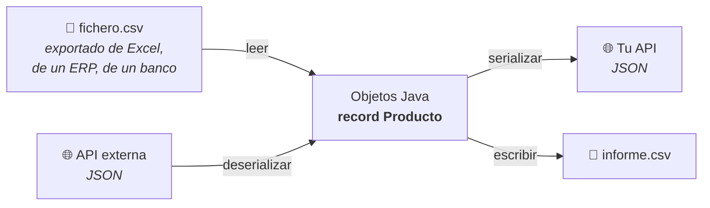
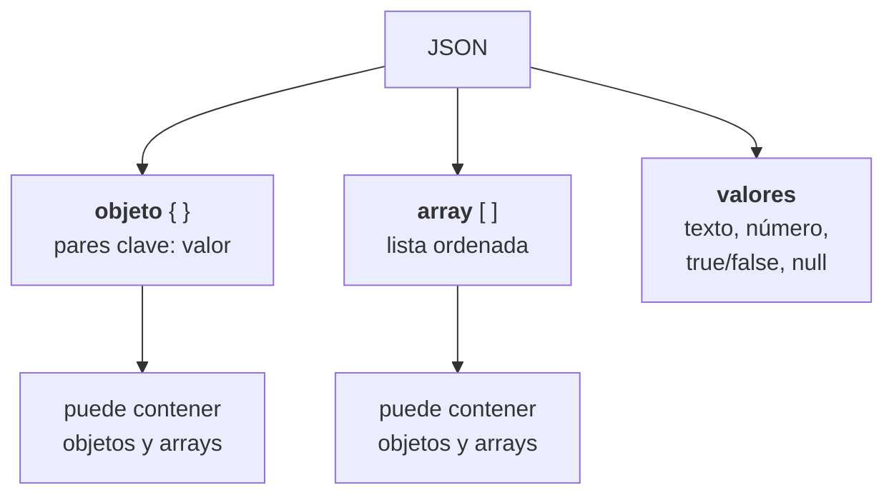

# 2. CSV y JSON con herramientas modernas

Los datos casi nunca están dentro del programa: llegan en un fichero o por una API. Estos son los dos formatos con los que vas a trabajar el resto del curso.



| | CSV | JSON |
|---|---|---|
| Para qué | **Intercambio con humanos y hojas de cálculo** | **Intercambio entre programas** |
| Estructura | Plana: filas y columnas | Anidada: objetos dentro de objetos |
| Tipos | Todo es texto | Texto, número, booleano, nulo, lista, objeto |
| Lo usarás en | Cargas iniciales, exportar informes | **Toda la UT4, UT5 y UT6** |

---

## 1. Leer un fichero: lo mínimo

Antes de CSV, tres órdenes y una regla.

```java
jshell> import java.nio.file.*
jshell> import java.nio.charset.StandardCharsets

jshell> var ruta = Path.of("datos", "productos.csv")     // (1)
jshell> Files.exists(ruta)
$3 ==> true

jshell> Files.readString(ruta, StandardCharsets.UTF_8)   // (2)
$4 ==> "codigo,nombre,categoria,precio,stock\nMOV-01,Patinete,..."
```

1. **`Path.of` con partes separadas.** Nunca `"datos/productos.csv"` a pelo: en Windows el separador es `\` y se rompe.
2. **El juego de caracteres se dice siempre.** Si no, usa el del sistema y en Windows los acentos salen como `á`.

Para ficheros grandes no se carga entero en memoria: se lee línea a línea.

```java
try (var lineas = Files.lines(ruta, StandardCharsets.UTF_8)) {   // (1)
    lineas.forEach(System.out::println);
}
```

1. **`Files.lines` deja el fichero abierto y hay que cerrarlo.** De ahí el `try` con recursos. Sin él, el sistema se queda sin descriptores cuando hay muchos ficheros.

Y para escribir:

```java
Files.writeString(Path.of("salida.txt"), "hola\n", StandardCharsets.UTF_8);
```

!!! warning "Rutas relativas"
    `Path.of("datos/x.csv")` es relativa **al directorio desde el que ejecutas**, no a donde está el `.java`. Si te da `NoSuchFileException`, comprueba dónde estás:

    ```java
    jshell> Path.of("").toAbsolutePath()
    $8 ==> /home/ana/catalogo
    ```

---

## 2. CSV a mano: qué es y dónde se rompe

Un CSV es texto plano: una fila por línea, campos separados por comas.

```csv
codigo,nombre,categoria,precio,stock
MOV-01,Patinete,movilidad,120.00,4
SEG-01,Casco,seguridad,35.00,12
SEG-02,Candado,seguridad,25.00,0
```

La versión a mano cabe en ocho líneas:

```java
List<Producto> leer(Path ruta) throws IOException {
    try (var lineas = Files.lines(ruta, StandardCharsets.UTF_8)) {
        return lineas
                .skip(1)                                  // (1)
                .filter(l -> !l.isBlank())                // (2)
                .map(l -> l.split(",", -1))               // (3)
                .map(c -> new Producto(c[0].trim(), c[1].trim(), c[2].trim(),
                                       Double.parseDouble(c[3].trim()),
                                       Integer.parseInt(c[4].trim())))
                .toList();
    }
}
```

1. **`skip(1)`** para la cabecera. Sin él, `Double.parseDouble("precio")` revienta en la primera vuelta.
2. Las **líneas en blanco** del final son la causa número uno de `ArrayIndexOutOfBoundsException`.
3. **El `-1` conserva los campos vacíos del final.** Compruébalo:

```java
jshell> "SEG-02,Candado,,,".split(",").length
$9 ==> 2                                   // ← se comió los vacíos

jshell> "SEG-02,Candado,,,".split(",", -1).length
$10 ==> 5                                  // ← correcto
```

**Esos tres detalles son tres preguntas del examen.**

### Y dónde deja de valer

```csv
codigo,nombre,precio
LIB-01,"Cien años de soledad, edición 50 aniversario",24.90
LIB-02,"Dijo: ""no"" y se fue",12.00
```

Aquí `split(",")` produce basura: la primera fila tiene una coma **dentro** de un campo entrecomillado, y la segunda tiene comillas escapadas.

Se puede resolver a mano con una expresión regular… o no hacerlo y usar la herramienta que ya existe.

---

## 3. CSV con Apache Commons CSV

```xml
<dependency>
  <groupId>org.apache.commons</groupId>
  <artifactId>commons-csv</artifactId>
  <version>1.12.0</version>
</dependency>
```

### Leer

```java
import org.apache.commons.csv.*;

List<Producto> leer(Path ruta) throws IOException {
    var formato = CSVFormat.DEFAULT.builder()
            .setHeader()                        // (1)
            .setSkipHeaderRecord(true)
            .setIgnoreEmptyLines(true)
            .setTrim(true)                      // (2)
            .get();

    try (var lector = Files.newBufferedReader(ruta, StandardCharsets.UTF_8);
         var csv = formato.parse(lector)) {

        var productos = new ArrayList<Producto>();
        for (var fila : csv) {
            productos.add(new Producto(
                    fila.get("codigo"),          // (3)
                    fila.get("nombre"),
                    fila.get("categoria"),
                    Double.parseDouble(fila.get("precio")),
                    Integer.parseInt(fila.get("stock"))));
        }
        return List.copyOf(productos);
    }
}
```

1. **Lee la cabecera del propio fichero** y la usa como nombres de columna.
2. Quita los espacios de cada campo. Adiós a los `.trim()` repartidos.
3. **Se accede por nombre, no por posición.** El día que alguien cambie el orden de las columnas, el programa sigue funcionando.

Ese punto 3 es la razón principal para usar la librería: `c[3]` se rompe en silencio cuando cambia el fichero; `fila.get("precio")` falla ruidosamente o sigue funcionando.

| | A mano | Commons CSV |
|---|---|---|
| Comas dentro de un campo | Se rompe | Bien |
| Comillas escapadas | Se rompe | Bien |
| Saltos de línea dentro de un campo | Se rompe | Bien |
| Acceso por nombre de columna | No | **Sí** |
| Otro separador (`;`) | Cambiar el `split` | `.setDelimiter(';')` |

!!! tip "El punto y coma español"
    Excel en español exporta con **`;`** y con la coma como separador decimal: `25,90`. Se configura así:

    ```java
    CSVFormat.DEFAULT.builder().setDelimiter(';').setHeader().get()
    ```

    Y el número hay que convertirlo teniendo en cuenta el idioma:

    ```java
    jshell> NumberFormat.getInstance(new Locale("es","ES")).parse("25,90")
    $12 ==> 25.9
    ```

### Escribir

```java
void escribir(Path ruta, List<Producto> productos) throws IOException {
    var formato = CSVFormat.DEFAULT.builder()
            .setHeader("codigo", "nombre", "categoria", "precio", "stock")
            .get();

    try (var escritor = Files.newBufferedWriter(ruta, StandardCharsets.UTF_8);
         var csv = new CSVPrinter(escritor, formato)) {

        for (var p : productos) {
            csv.printRecord(p.codigo(), p.nombre(), p.categoria(),
                            p.precio(), p.stock());          // (1)
        }
    }
}
```

1. **Entrecomilla solo cuando hace falta.** Si el nombre lleva una coma, la librería lo resuelve; a mano, habría que acordarse.

!!! danger "El decimal con coma corrompe el CSV"
    ```java
    String.format("%.2f", 25.9)                      // "25,90" en España  ← rompe el CSV
    String.format(Locale.ROOT, "%.2f", 25.9)         // "25.90" siempre
    ```

    Es un fallo que **no aparece en tu máquina si la tienes en inglés** y sí en la del compañero. `Locale.ROOT` para todo lo que sea intercambio de datos.

---

## 4. JSON: la estructura



```json
{
  "codigo": "MOV-01",
  "nombre": "Patinete",
  "precio": 120.0,
  "disponible": true,
  "etiquetas": ["urbano", "eléctrico"],
  "proveedor": { "nif": "B12345678", "nombre": "Ruedas SL" },
  "descatalogado": null
}
```

Las cuatro reglas que se olvidan:

1. **Las claves van entre comillas dobles.** Siempre.
2. **No hay comillas simples** ni comentarios.
3. **No se admite coma final** después del último elemento.
4. **No hay tipo fecha.** Las fechas son texto, y por eso dan tanta guerra.

---

## 5. JSON con Jackson

```xml
<dependency>
  <groupId>com.fasterxml.jackson.core</groupId>
  <artifactId>jackson-databind</artifactId>
  <version>2.18.2</version>
</dependency>
<dependency>
  <groupId>com.fasterxml.jackson.datatype</groupId>
  <artifactId>jackson-datatype-jsr310</artifactId>   <!-- fechas -->
  <version>2.18.2</version>
</dependency>
```

### De objeto a JSON

```java
import com.fasterxml.jackson.databind.ObjectMapper;

var mapper = new ObjectMapper();
var producto = new Producto("MOV-01", "Patinete", "movilidad", 120.0, 4);

System.out.println(mapper.writeValueAsString(producto));
// {"codigo":"MOV-01","nombre":"Patinete","categoria":"movilidad","precio":120.0,"stock":4}

System.out.println(mapper.writerWithDefaultPrettyPrinter()
                         .writeValueAsString(producto));
```

```json
{
  "codigo" : "MOV-01",
  "nombre" : "Patinete",
  "categoria" : "movilidad",
  "precio" : 120.0,
  "stock" : 4
}
```

**No has escrito una línea de conversión.** Jackson lee los métodos del `record` y monta el JSON.

### De JSON a objeto

```java
var json = """
    {"codigo":"SEG-01","nombre":"Casco","categoria":"seguridad",
     "precio":35.0,"stock":12}
    """;

Producto p = mapper.readValue(json, Producto.class);
System.out.println(p.nombre());          // Casco
```

### Una lista

```java
var json = """
    [{"codigo":"SEG-01","nombre":"Casco","categoria":"seguridad","precio":35.0,"stock":12},
     {"codigo":"SEG-02","nombre":"Candado","categoria":"seguridad","precio":25.0,"stock":0}]
    """;

List<Producto> productos = mapper.readValue(json, new TypeReference<>() {});   // (1)
```

1. **Con `List.class` no funciona.** Obtendrías una lista de `LinkedHashMap`, no de `Producto`, y el fallo aparecería mucho después en forma de `ClassCastException`. El motivo es el borrado de tipos: en tiempo de ejecución `List<Producto>` y `List` son lo mismo, y `TypeReference` es lo que conserva esa información.

### Fichero directamente

```java
mapper.writerWithDefaultPrettyPrinter()
      .writeValue(Path.of("datos/productos.json").toFile(), productos);

List<Producto> leidos = mapper.readValue(
        Path.of("datos/productos.json").toFile(), new TypeReference<>() {});
```

---

## 6. Las cuatro configuraciones que hacen falta

### a) Fechas legibles

```java
record Pedido(String id, LocalDate fecha, LocalTime hora) {}

var mapper = new ObjectMapper();
System.out.println(mapper.writeValueAsString(
        new Pedido("P-1", LocalDate.of(2026,3,14), LocalTime.of(20,0))));
```

```json
{"id":"P-1","fecha":[2026,3,14],"hora":[20,0]}
```

Un array de números. Inservible para cualquier cliente. Se arregla así:

```java
var mapper = new ObjectMapper()
        .registerModule(new JavaTimeModule())                              // (1)
        .disable(SerializationFeature.WRITE_DATES_AS_TIMESTAMPS);          // (2)
```

```json
{"id":"P-1","fecha":"2026-03-14","hora":"20:00:00"}
```

1. Enseña a Jackson qué son `LocalDate`, `LocalTime` y compañía.
2. Y que las escriba como **texto ISO-8601**, no como números.

**Es el fallo de Jackson que más cae en el examen.** Si ves `[2026,3,14]`, faltan estas dos líneas.

### b) Campos que no esperas

```java
var json = """
    {"codigo":"SEG-01","nombre":"Casco","precio":35.0,"stock":12,"descuento":0.1}
    """;
mapper.readValue(json, Producto.class);
```

```
UnrecognizedPropertyException: Unrecognized field "descuento"
```

Por defecto Jackson **falla** ante un campo desconocido. Al consumir APIs ajenas eso es una bomba de relojería: el día que el proveedor añada un campo —y lo hará sin avisarte— tu programa deja de funcionar sin que hayas tocado nada.

```java
var mapper = new ObjectMapper()
        .configure(DeserializationFeature.FAIL_ON_UNKNOWN_PROPERTIES, false);
```

O acotado a una clase:

```java
@JsonIgnoreProperties(ignoreUnknown = true)
record Producto(String codigo, String nombre, double precio, int stock) {}
```

### c) Nulos fuera

```java
@JsonInclude(JsonInclude.Include.NON_NULL)
record Producto(String codigo, String nombre, String descripcion) {}
```

```json
{"codigo":"SEG-01","nombre":"Casco"}      // descripcion era null: no aparece
```

### d) Nombres distintos

Cuando la API ajena usa otros nombres:

```java
record ProductoApi(
        @JsonProperty("product_code") String codigo,
        @JsonProperty("product_name") String nombre,
        double price) {}
```

---

## 7. JSON que no sabes cómo viene

Cuando la respuesta es grande y solo quieres dos campos, no merece la pena crear clases. Se recorre el árbol:

```java
var json = """
    {"estado":"ok","total":2,
     "resultados":[{"id":1,"nombre":"Casco","stock":{"almacen":5,"tienda":7}},
                   {"id":2,"nombre":"Luces"}]}
    """;

JsonNode raiz = mapper.readTree(json);

System.out.println(raiz.get("total").asInt());                       // 2
System.out.println(raiz.get("resultados").get(0).get("nombre").asText());  // Casco
System.out.println(raiz.get("resultados").get(0).get("stock").get("tienda").asInt());  // 7

for (var r : raiz.get("resultados")) {
    System.out.println(r.get("id").asInt() + " → " + r.get("nombre").asText());
}
```

!!! danger "`get` frente a `path`"
    ```java
    raiz.get("noexiste").asText()          // NullPointerException
    raiz.path("noexiste").asText("—")      // "—"
    ```

    **`get` devuelve `null` si la clave no está; `path` devuelve un nodo vacío.** Con JSON ajeno, donde los campos aparecen y desaparecen, se usa `path`:

    ```java
    for (var r : raiz.path("resultados")) {
        int enTienda = r.path("stock").path("tienda").asInt(0);   // 0 si falta
        System.out.println(r.path("nombre").asText("?") + ": " + enTienda);
    }
    // Casco: 7
    // Luces: 0        ← no tenía stock, y no ha reventado
    ```

---

## 8. El programa entero: de CSV a JSON

Un proyecto Maven con las tres dependencias que carga el CSV, filtra y exporta a JSON.

```java
// src/main/java/es/iesx/catalogo/CsvAJson.java
package es.iesx.catalogo;

import com.fasterxml.jackson.annotation.JsonInclude;
import com.fasterxml.jackson.databind.*;
import com.fasterxml.jackson.datatype.jsr310.JavaTimeModule;
import org.apache.commons.csv.*;

import java.io.IOException;
import java.nio.charset.StandardCharsets;
import java.nio.file.*;
import java.time.LocalDate;
import java.util.*;

@JsonInclude(JsonInclude.Include.NON_NULL)
record Producto(String codigo, String nombre, String categoria,
                double precio, int stock, LocalDate alta) {}

public class CsvAJson {

    private static final CSVFormat FORMATO = CSVFormat.DEFAULT.builder()
            .setHeader().setSkipHeaderRecord(true)
            .setIgnoreEmptyLines(true).setTrim(true)
            .get();

    private static final ObjectMapper MAPPER = new ObjectMapper()
            .registerModule(new JavaTimeModule())
            .disable(SerializationFeature.WRITE_DATES_AS_TIMESTAMPS)
            .configure(DeserializationFeature.FAIL_ON_UNKNOWN_PROPERTIES, false);

    public static void main(String[] args) throws IOException {

        var productos = leerCsv(Path.of("datos/productos.csv"));
        System.out.println("Cargados: " + productos.size());

        var disponibles = productos.stream()
                .filter(p -> p.stock() > 0)
                .sorted(Comparator.comparingDouble(Producto::precio))
                .toList();

        MAPPER.writerWithDefaultPrettyPrinter()
              .writeValue(Path.of("datos/disponibles.json").toFile(), disponibles);

        System.out.println("Escritos " + disponibles.size() + " en disponibles.json");

        // y de vuelta, para comprobar que se lee igual
        List<Producto> releidos = MAPPER.readValue(
                Path.of("datos/disponibles.json").toFile(), new TypeReference<>() {});
        System.out.println("Releídos: " + releidos.size());
    }

    static List<Producto> leerCsv(Path ruta) throws IOException {
        try (var lector = Files.newBufferedReader(ruta, StandardCharsets.UTF_8);
             var csv = FORMATO.parse(lector)) {

            var lista = new ArrayList<Producto>();
            int descartadas = 0;

            for (var fila : csv) {
                try {
                    lista.add(new Producto(
                            fila.get("codigo"),
                            fila.get("nombre"),
                            fila.get("categoria"),
                            Double.parseDouble(fila.get("precio")),
                            Integer.parseInt(fila.get("stock")),
                            LocalDate.parse(fila.get("alta"))));
                } catch (IllegalArgumentException | java.time.format.DateTimeParseException e) {
                    descartadas++;                                     // (1)
                    System.err.println("  Descartada línea " + csv.getRecordNumber()
                            + ": " + e.getMessage());
                }
            }
            System.out.println("Descartadas: " + descartadas);
            return List.copyOf(lista);
        }
    }
}
```

1. **Se cuentan los descartes y se dice por qué.** Un cargador que se traga las líneas malas en silencio es peor que uno que revienta: nadie se entera de que faltan datos.

`datos/productos.csv`

```csv
codigo,nombre,categoria,precio,stock,alta
MOV-01,Patinete,movilidad,120.00,4,2026-01-15
SEG-01,Casco,seguridad,35.00,12,2026-02-01
SEG-02,Candado,seguridad,25.00,0,2026-02-01
REP-01,Cámara,repuestos,8.50,50,2026-03-10
XXX-99,Rota,repuestos,ocho,3,2026-03-10
```

```
Cargados: 4
  Descartada línea 5: For input string: "ocho"
Descartadas: 1
Escritos 3 en disponibles.json
Releídos: 3
```

---

## Pruébalo ahora (20 min)

1. Monta el proyecto con las dos dependencias y ejecútalo.
2. Añade una línea al CSV con el nombre entre comillas y **una coma dentro**. Comprueba que Commons CSV la lee bien.
3. Quita el `registerModule(new JavaTimeModule())` y mira cómo sale la fecha.
4. Añade un campo `"promocion": true` al JSON y vuelve a leerlo. Quita el `FAIL_ON_UNKNOWN_PROPERTIES` y mira el error.
5. Lee el JSON con `readTree` y saca solo los nombres, usando `path` en vez de `get`.

??? success "Pistas"

    ```java
    // 2 · en el CSV
    LIB-01,"Cien años de soledad, edición especial",libros,24.90,3,2026-04-01

    // 3 · sin el módulo
    "alta" : [ 2026, 1, 15 ]

    // 5
    JsonNode raiz = MAPPER.readTree(Path.of("datos/disponibles.json").toFile());
    for (var n : raiz) System.out.println(n.path("nombre").asText("?"));
    ```

---

## Ejercicios (con solución)

??? success "E1 · ¿Cuántos campos?"

    ```java
    System.out.println("4,Casco,,".split(",").length);
    System.out.println("4,Casco,,".split(",", -1).length);
    ```

    **`2` y `4`.** Por defecto `split` descarta los campos vacíos **del final**.

    Es el origen del `ArrayIndexOutOfBoundsException` más común de la unidad: el CSV tiene cuatro columnas, pero en las filas con los últimos campos vacíos te llega un array de dos y `c[3]` revienta.

    Con Commons CSV el problema no existe: se accede por nombre de columna.

??? success "E2 · Los tres fallos"

    ```java
    List<Producto> leer(Path ruta) throws IOException {
        var lineas = Files.lines(ruta);
        return lineas.map(l -> l.split(","))
                     .map(c -> new Producto(c[0], c[1]))
                     .toList();
    }
    ```

    1. **No se cierra el stream.** `Files.lines` mantiene el fichero abierto: hace falta *try-with-resources*.
    2. **Falta `skip(1)`.** La cabecera entra como si fuera un producto.
    3. **Falta el juego de caracteres.** `Files.lines(ruta, StandardCharsets.UTF_8)`.

    Y un cuarto si el fichero acaba en línea en blanco: `filter(l -> !l.isBlank())`.

??? success "E3 · La fecha que sale como array"

    Tu API devuelve `"fecha":[2026,3,14]` y el cliente se queja. ¿Qué falta?

    ```java
    var mapper = new ObjectMapper()
            .registerModule(new JavaTimeModule())
            .disable(SerializationFeature.WRITE_DATES_AS_TIMESTAMPS);
    ```

    Las **dos** líneas. Con solo el módulo, Jackson sabe qué es un `LocalDate` pero lo sigue escribiendo como números; con solo el `disable`, no sabe ni qué es.

    En Spring Boot esto viene configurado de fábrica, así que a partir de la UT4 no habrá que acordarse. Pero hay que saberlo para el examen y para cualquier proyecto sin Spring.

??? success "E4 · `get` o `path`"

    ```java
    var json = """{"items":[{"nombre":"A"},{"nombre":"B","stock":3}]}""";
    JsonNode raiz = mapper.readTree(json);

    for (var i : raiz.get("items")) {
        System.out.println(i.get("nombre").asText() + ": " + i.get("stock").asInt());
    }
    ```

    Revienta en el primer elemento con `NullPointerException`: `A` no tiene `stock`, `get` devuelve `null` y `null.asInt()` falla.

    ```java
    for (var i : raiz.path("items")) {
        System.out.println(i.path("nombre").asText("?") + ": " + i.path("stock").asInt(0));
    }
    // A: 0
    // B: 3
    ```

    **Con JSON ajeno, `path` siempre.** Los campos aparecen y desaparecen sin avisar.

??? success "E5 · `TypeReference`"

    ```java
    List<Producto> ps = mapper.readValue(json, List.class);
    ```

    Compila y **falla más tarde**, al usar un elemento: `ClassCastException: LinkedHashMap cannot be cast to Producto`.

    En tiempo de ejecución, el tipo genérico se ha borrado y Jackson no tiene forma de saber qué poner dentro de la lista, así que pone mapas.

    ```java
    List<Producto> ps = mapper.readValue(json, new TypeReference<List<Producto>>() {});
    ```

    Esa clase anónima existe solo para **conservar el tipo genérico** hasta la ejecución.

??? success "E6 · El CSV que se corrompió"

    Un compañero exporta un informe y en su máquina sale bien; en la tuya, cada fila tiene una columna de más.

    ```java
    csv.printRecord(p.nombre(), String.format("%.2f", p.precio()));
    ```

    Su máquina está en inglés (`25.90`) y la tuya en español (`25,90`). **Esa coma parte el campo en dos.**

    ```java
    String.format(Locale.ROOT, "%.2f", p.precio())     // "25.90" siempre
    ```

    La regla: **para intercambio de datos, `Locale.ROOT` siempre**; para mostrar en pantalla a un usuario, el idioma del usuario.
