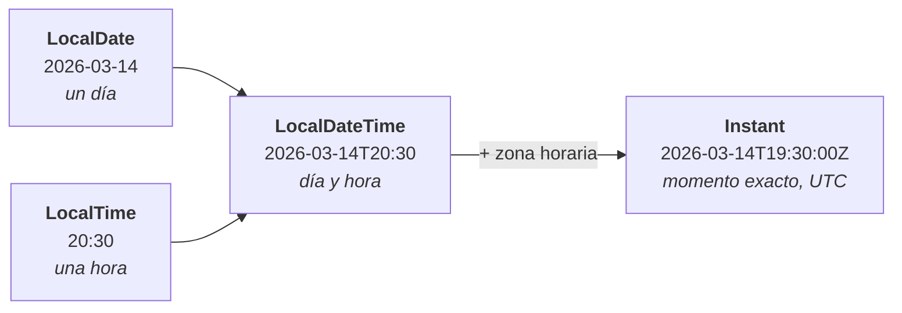

# 3. Fechas y validación

Dos cosas que parecen menores y que son la causa de la mitad de los fallos de una aplicación real: las fechas mal manejadas y los datos que entran sin comprobar.

!!! tip "Con `jshell` abierto"
    ```java
    jshell> import java.time.*
    jshell> import java.time.format.*
    jshell> import java.time.temporal.ChronoUnit
    ```

---

## 1. Las cuatro clases que hacen falta



| Clase | Para qué | Ejemplo real |
|---|---|---|
| `LocalDate` | Un día, sin hora | Fecha de nacimiento, día de una reserva |
| `LocalTime` | Una hora, sin día | Horario de apertura |
| `LocalDateTime` | Día y hora, **sin zona** | La hora de una cita presencial |
| `Instant` | Un momento exacto en UTC | Cuándo se creó un registro |

```java
jshell> LocalDate.now()
$4 ==> 2026-09-25

jshell> LocalDate.of(2026, 3, 14)
$5 ==> 2026-03-14

jshell> LocalTime.of(20, 30)
$6 ==> 20:30

jshell> LocalDateTime.of(2026, 3, 14, 20, 30)
$7 ==> 2026-03-14T20:30

jshell> Instant.now()
$8 ==> 2026-09-25T09:14:22.318Z
```

!!! info "Cuál usar, en una frase"
    - **¿Es un día del calendario?** → `LocalDate`. El cumpleaños de alguien es el 14 de marzo esté donde esté.
    - **¿Es un instante que hay que poder comparar entre países?** → `Instant`. Cuándo se registró un pedido.

    En una base de datos, las marcas de tiempo se guardan casi siempre en UTC (`Instant`) y se convierten a la zona del usuario al mostrarlas.

---

## 2. La regla que hay que interiorizar: son inmutables

```java
jshell> var f = LocalDate.of(2026, 3, 14)
jshell> f.plusDays(7)
$10 ==> 2026-03-21

jshell> f
$11 ==> 2026-03-14        // ← NO ha cambiado
```

`plusDays` **devuelve una fecha nueva** y deja la original intacta. Si no guardas el resultado, se pierde:

```java
jshell> f.plusDays(7);       // no hace nada
jshell> var nueva = f.plusDays(7)   // así sí
nueva ==> 2026-03-21
```

**El compilador no avisa**, porque la expresión es válida. Es exactamente el mismo error que `cadena.trim();` sin asignar, y es la pregunta de fechas que más cae.

Todos los métodos siguen ese patrón:

```java
jshell> f.plusMonths(2)
$14 ==> 2026-05-14
jshell> f.minusWeeks(1)
$15 ==> 2026-03-07
jshell> f.withDayOfMonth(1)
$16 ==> 2026-03-01
jshell> f.plusDays(20)                 // se ocupa solo del cambio de mes
$17 ==> 2026-04-03
jshell> LocalDate.of(2026,1,31).plusMonths(1)    // y de los meses cortos
$18 ==> 2026-02-28
```

---

## 3. Comparar y medir

```java
jshell> var entrada = LocalDate.of(2026, 7, 1)
jshell> var salida  = LocalDate.of(2026, 7, 3)

jshell> entrada.isBefore(salida)
$21 ==> true
jshell> entrada.isAfter(salida)
$22 ==> false
jshell> entrada.isEqual(LocalDate.of(2026, 7, 1))
$23 ==> true

jshell> ChronoUnit.DAYS.between(entrada, salida)
$24 ==> 2
```

!!! danger "Dos noches, no tres días"
    Del 1 al 3 hay **dos noches**: la del 1 al 2 y la del 2 al 3. Si lo que cuentas son **días de estancia** incluyendo los dos extremos, son tres y hay que sumar uno.

    Ese `±1` es el fallo clásico de cualquier aplicación de reservas. **Antes de escribir la fórmula, decide qué estás contando.**

```java
jshell> var p = Period.between(LocalDate.of(1990,5,20), LocalDate.now())
p ==> P36Y4M5D

jshell> p.getYears()
$26 ==> 36

jshell> ChronoUnit.YEARS.between(LocalDate.of(1990,5,20), LocalDate.now())
$27 ==> 36
```

`Period` da años, meses y días por separado; `ChronoUnit` da una sola unidad. Para calcular una edad, cualquiera de los dos vale.

---

## 4. Texto ↔ fecha

```java
jshell> LocalDate.parse("2026-03-14")            // formato ISO por defecto
$28 ==> 2026-03-14

jshell> LocalDate.parse("14/03/2026")
|  Exception java.time.format.DateTimeParseException: Text '14/03/2026' could not be parsed
```

Con otro formato hay que decirlo:

```java
jshell> var fmt = DateTimeFormatter.ofPattern("dd/MM/yyyy")
jshell> LocalDate.parse("14/03/2026", fmt)
$31 ==> 2026-03-14

jshell> LocalDate.of(2026,3,14).format(fmt)
$32 ==> "14/03/2026"
```

Los patrones que se usan:

| Patrón | Sale |
|---|---|
| `dd/MM/yyyy` | `14/03/2026` |
| `yyyy-MM-dd` | `2026-03-14` |
| `dd 'de' MMMM 'de' yyyy` | `14 de marzo de 2026` |
| `HH:mm` | `20:30` |
| `dd/MM/yyyy HH:mm` | `14/03/2026 20:30` |

!!! warning "`MM` y `mm` no son lo mismo"
    **`MM` es el mes; `mm` son los minutos.** Y `DD` es el día del año, no del mes. Con `dd/mm/yyyy` obtienes el día y los **minutos**, y el error pasa desapercibido buena parte del tiempo.

Y para mostrar a un usuario español:

```java
jshell> var largo = DateTimeFormatter.ofPattern("EEEE d 'de' MMMM", new Locale("es","ES"))
jshell> LocalDate.of(2026,3,14).format(largo)
$34 ==> "sábado 14 de marzo"
```

!!! info "Regla de oro de los formatos"
    **ISO para guardar e intercambiar; formato local solo para mostrar.** Un CSV o un JSON lleva `2026-03-14`; la pantalla del usuario lleva `14/03/2026`. Si guardas en formato local, el día que ese fichero lo lea otro país tienes un problema sin solución.

---

## 5. Validar: dónde y cómo

> **Regla:** un objeto no debería poder existir en un estado inválido.

Eso significa validar **en el constructor**, no en quien lo usa. Si validas fuera, hay que acordarse cada vez; si validas dentro, es imposible saltárselo.

```java
record Reserva(String cliente, String correo,
               LocalDate entrada, LocalDate salida) {

    private static final Pattern CORREO =
            Pattern.compile("^[\\w.+-]+@[\\w-]+\\.[\\w.]{2,}$");     // (1)

    Reserva {
        if (cliente == null || cliente.isBlank()) {
            throw new IllegalArgumentException("El cliente es obligatorio");
        }
        if (correo == null || !CORREO.matcher(correo).matches()) {
            throw new IllegalArgumentException("Correo no válido: " + correo);
        }
        if (entrada == null || salida == null) {
            throw new IllegalArgumentException("Las fechas son obligatorias");
        }
        if (entrada.isBefore(LocalDate.now())) {
            throw new IllegalArgumentException("La entrada no puede ser pasada");
        }
        if (!salida.isAfter(entrada)) {                               // (2)
            throw new IllegalArgumentException("La salida debe ser posterior a la entrada");
        }
    }

    long noches() { return ChronoUnit.DAYS.between(entrada, salida); }
}
```

1. **`static final`.** Compilar una expresión regular es caro y no cambia nunca: se hace una vez.
2. **`!isAfter` y no `isBefore`.** Con `isBefore`, una reserva de entrada y salida el mismo día **pasa la validación**: cero noches. Es la diferencia entre `<` y `<=`, y ahí viven los fallos de los rangos.

```java
jshell> new Reserva("Ana", "ana@iesx.es",
   ...>             LocalDate.now().plusDays(5), LocalDate.now().plusDays(8)).noches()
$36 ==> 3

jshell> new Reserva("Ana", "ana-arroba-iesx", LocalDate.now(), LocalDate.now().plusDays(1))
|  Exception java.lang.IllegalArgumentException: Correo no válido: ana-arroba-iesx

jshell> new Reserva("Ana", "ana@iesx.es", LocalDate.now(), LocalDate.now())
|  Exception java.lang.IllegalArgumentException: La salida debe ser posterior a la entrada
```

!!! tip "Prueba siempre los tres casos de un rango"
    Antes, igual y después. El del medio es el que se olvida y el que falla.

---

## 6. Expresiones regulares, las cuatro útiles

```java
jshell> "ana@iesx.es".matches("^[\\w.+-]+@[\\w-]+\\.[\\w.]{2,}$")
$39 ==> true

jshell> "12345678Z".matches("^\\d{8}[A-HJ-NP-TV-Z]$")            // DNI
$40 ==> true

jshell> "+34 600 12 34 56".replaceAll("[^0-9+]", "")             // limpiar
$41 ==> "+34600123456"

jshell> "MOV-01".matches("^[A-Z]{3}-\\d{2}$")                    // código interno
$42 ==> true
```

| Trozo | Significa |
|---|---|
| `^` … `$` | Principio y final. **Sin ellos, `matches` es otra cosa** |
| `\\d` | Un dígito |
| `\\w` | Letra, dígito o `_` |
| `+` | Uno o más |
| `{2,}` | Dos o más |
| `[A-Z]` | Una letra mayúscula |
| `[^0-9]` | Cualquier cosa **que no sea** dígito |

!!! danger "No valides correos con una expresión regular perfecta"
    La regular «completa» del estándar tiene más de 6.000 caracteres y sigue sin ser exacta. Lo razonable es una comprobación básica —hay una `@`, hay un punto después— y, si de verdad hace falta certeza, **mandar un correo de confirmación**. Es lo único que demuestra que la dirección existe.

---

## 7. Dinero: nunca `double`

```java
jshell> 0.1 + 0.2
$43 ==> 0.30000000000000004

jshell> 1.03 - 0.42
$44 ==> 0.6100000000000001
```

No es un fallo de Java: es que `double` guarda los números en binario y muchos decimales no tienen representación exacta. Con dinero, esos restos se acumulan y acaban en un descuadre.

```java
jshell> import java.math.*

jshell> new BigDecimal("0.1").add(new BigDecimal("0.2"))
$46 ==> 0.3

jshell> new BigDecimal("19.99").multiply(new BigDecimal("3"))
   ...>                        .setScale(2, RoundingMode.HALF_UP)
$47 ==> 59.97
```

!!! danger "Siempre desde `String`"
    ```java
    jshell> new BigDecimal(0.1)
    $48 ==> 0.1000000000000000055511151231257827021181583404541015625

    jshell> new BigDecimal("0.1")
    $49 ==> 0.1
    ```

    El constructor que recibe `double` **hereda el error** del `double`. Siempre `new BigDecimal("0.1")` o `BigDecimal.valueOf(0.1)`.

Y para comparar:

```java
jshell> new BigDecimal("1.0").equals(new BigDecimal("1.00"))
$50 ==> false                              // ← distinta escala

jshell> new BigDecimal("1.0").compareTo(new BigDecimal("1.00")) == 0
$51 ==> true                               // ← así
```

**`equals` compara también la escala; `compareTo` solo el valor.** Para dinero, siempre `compareTo`.

---

## 8. El programa entero

```java
// Reservas.java · java Reservas.java
import java.time.*;
import java.time.format.*;
import java.time.temporal.ChronoUnit;
import java.math.*;
import java.util.*;
import java.util.regex.Pattern;

record Reserva(String cliente, String correo, LocalDate entrada,
               LocalDate salida, BigDecimal precioNoche) {

    private static final Pattern CORREO =
            Pattern.compile("^[\\w.+-]+@[\\w-]+\\.[\\w.]{2,}$");

    Reserva {
        if (cliente == null || cliente.isBlank())
            throw new IllegalArgumentException("Cliente obligatorio");
        if (correo == null || !CORREO.matcher(correo).matches())
            throw new IllegalArgumentException("Correo no válido: " + correo);
        if (!salida.isAfter(entrada))
            throw new IllegalArgumentException("La salida debe ser posterior");
        if (precioNoche.signum() <= 0)
            throw new IllegalArgumentException("El precio debe ser positivo");
    }

    long noches() { return ChronoUnit.DAYS.between(entrada, salida); }

    BigDecimal total() {
        return precioNoche.multiply(BigDecimal.valueOf(noches()))
                          .setScale(2, RoundingMode.HALF_UP);
    }

    boolean solapaCon(Reserva otra) {                                  // (1)
        return entrada.isBefore(otra.salida) && salida.isAfter(otra.entrada);
    }
}

void main() {
    var fmt = DateTimeFormatter.ofPattern("dd/MM/yyyy");

    var reservas = new ArrayList<Reserva>();
    reservas.add(new Reserva("Ana", "ana@iesx.es",
            LocalDate.of(2027,7,1), LocalDate.of(2027,7,5), new BigDecimal("62.50")));
    reservas.add(new Reserva("Bruno", "bruno@iesx.es",
            LocalDate.of(2027,7,5), LocalDate.of(2027,7,8), new BigDecimal("62.50")));

    IO.println("=== Reservas ===");
    for (var r : reservas) {
        IO.println("  %-7s %s → %s  %d noches  %s €".formatted(
                r.cliente(), r.entrada().format(fmt), r.salida().format(fmt),
                r.noches(), r.total()));
    }

    IO.println("\n=== ¿Se solapan? ===");
    IO.println("  Ana y Bruno: " + reservas.get(0).solapaCon(reservas.get(1)));  // (2)

    var nueva = new Reserva("Carla", "carla@iesx.es",
            LocalDate.of(2027,7,3), LocalDate.of(2027,7,6), new BigDecimal("70.00"));
    IO.println("  Ana y Carla: " + reservas.get(0).solapaCon(nueva));

    IO.println("\n=== Validaciones ===");
    intentar(() -> new Reserva("", "x@y.es",
            LocalDate.of(2027,7,1), LocalDate.of(2027,7,2), BigDecimal.TEN));
    intentar(() -> new Reserva("Ana", "sin-arroba",
            LocalDate.of(2027,7,1), LocalDate.of(2027,7,2), BigDecimal.TEN));
    intentar(() -> new Reserva("Ana", "a@b.es",
            LocalDate.of(2027,7,1), LocalDate.of(2027,7,1), BigDecimal.TEN));
}

void intentar(Runnable accion) {
    try { accion.run(); IO.println("  (no lanzó)"); }
    catch (IllegalArgumentException e) { IO.println("  ✓ " + e.getMessage()); }
}
```

1. **La fórmula del solape**, que hay que memorizar: `entrada < otraSalida && salida > otraEntrada`. Con `<=` te cuelas y dos reservas que se tocan cuentan como solapadas.
2. Ana sale el 5 y Bruno entra el 5: **no se solapan, se tocan**.

```
=== Reservas ===
  Ana     01/07/2027 → 05/07/2027  4 noches  250.00 €
  Bruno   05/07/2027 → 08/07/2027  3 noches  187.50 €

=== ¿Se solapan? ===
  Ana y Bruno: false
  Ana y Carla: true

=== Validaciones ===
  ✓ Cliente obligatorio
  ✓ Correo no válido: sin-arroba
  ✓ La salida debe ser posterior
```

---

## Pruébalo ahora (15 min)

1. Ejecuta el programa y comprueba el caso «se tocan pero no se solapan».
2. Cambia `!salida.isAfter(entrada)` por `salida.isBefore(entrada)` y mira qué reserva pasa ahora que no debería.
3. Calcula los días que faltan para fin de curso con `ChronoUnit.DAYS.between`.
4. Añade una validación: la reserva no puede ser de más de 30 noches.
5. Cambia `BigDecimal` por `double` en `total()` con precio `19.99` y 3 noches. Compara la salida.

??? success "Lo que sale en el 5"

    ```
    Con BigDecimal:  59.97
    Con double:      59.97000000000001
    ```

    Con una reserva no importa. Con diez mil facturas al mes, el descuadre llega a contabilidad y alguien tiene que explicarlo.

---

## Ejercicios (con solución)

??? success "E1 · ¿Qué imprime?"

    ```java
    var f = LocalDate.of(2026, 3, 14);
    f.plusDays(7);
    System.out.println(f);
    ```

    **`2026-03-14`.** `java.time` es inmutable: `plusDays` devuelve una fecha nueva y aquí se tira.

    ```java
    var nueva = f.plusDays(7);       // así sí
    ```

??? success "E2 · Cuántas noches"

    ```java
    var entrada = LocalDate.of(2026, 7, 1);
    var salida  = LocalDate.of(2026, 7, 3);
    System.out.println(ChronoUnit.DAYS.between(entrada, salida));
    ```

    **`2`.** Dos noches. Si necesitas los **días de estancia** contando los dos extremos, son **3** y hay que sumar uno.

    Decide qué cuentas antes de escribir la fórmula.

??? success "E3 · El `<` y el `<=`"

    ```java
    if (salida.isBefore(entrada)) throw new IllegalArgumentException(...);
    ```

    ¿Qué reserva se cuela?

    Una con **entrada y salida el mismo día**: `isBefore` es estrictamente menor, así que no salta. Se guarda una reserva de cero noches, y el importe sale 0 €.

    ```java
    if (!salida.isAfter(entrada)) throw new IllegalArgumentException(...);
    ```

??? success "E4 · El solape"

    Dos reservas para la misma habitación:

    | | Entrada | Salida |
    |---|---|---|
    | A | 1 julio | 5 julio |
    | B | 5 julio | 8 julio |
    | C | 3 julio | 6 julio |

    ¿Cuáles se solapan?

    Con `entrada < otraSalida && salida > otraEntrada`:

    - **A y B:** `1 < 8` ✓ y `5 > 5` ✗ → **no se solapan.** Se tocan.
    - **A y C:** `1 < 6` ✓ y `5 > 3` ✓ → **se solapan.**
    - **B y C:** `5 < 6` ✓ y `8 > 3` ✓ → **se solapan.**

    Si en la fórmula pusieras `>=`, A y B saldrían solapadas y estarías rechazando reservas perfectamente válidas.

??? success "E5 · El patrón mal escrito"

    ```java
    DateTimeFormatter.ofPattern("dd/mm/yyyy")
    ```

    `mm` son **minutos**, no meses. Aplicado a un `LocalDate` lanza una excepción; aplicado a un `LocalDateTime`, imprime los minutos en el hueco del mes y **nadie se da cuenta** hasta que alguien mira una fecha rara.

    Lo correcto es `dd/MM/yyyy`.

??? success "E6 · El céntimo que falta"

    ```java
    double total = 0;
    for (int i = 0; i < 10; i++) total += 0.1;
    System.out.println(total == 1.0);
    ```

    **`false`.** El total es `0.9999999999999999`.

    ```java
    BigDecimal total = BigDecimal.ZERO;
    for (int i = 0; i < 10; i++) total = total.add(new BigDecimal("0.1"));
    System.out.println(total.compareTo(BigDecimal.ONE) == 0);    // true
    ```

    Y ojo: `total.add(...)` **devuelve** el resultado; `BigDecimal` también es inmutable. Escribir `total.add(x);` sin asignar es el mismo error del E1.

??? success "E7 · `equals` o `compareTo`"

    ```java
    new BigDecimal("1.0").equals(new BigDecimal("1.00"))       // ?
    new BigDecimal("1.0").compareTo(new BigDecimal("1.00"))    // ?
    ```

    **`false`** y **`0`**.

    `equals` compara valor **y escala**: `1.0` tiene un decimal y `1.00` tiene dos, así que son «distintos». `compareTo` compara solo el valor.

    Para dinero, **siempre `compareTo(...) == 0`**. Y ojo: eso significa que un `HashSet<BigDecimal>` puede contener `1.0` y `1.00` como dos elementos distintos.
