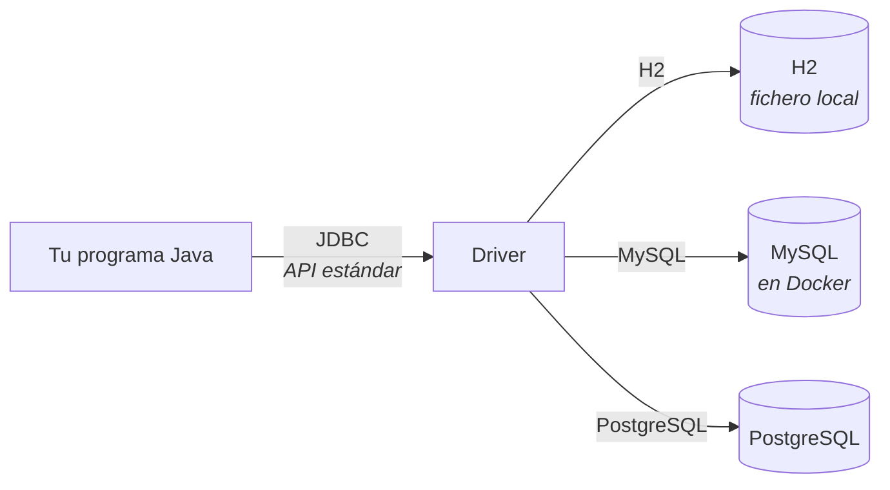
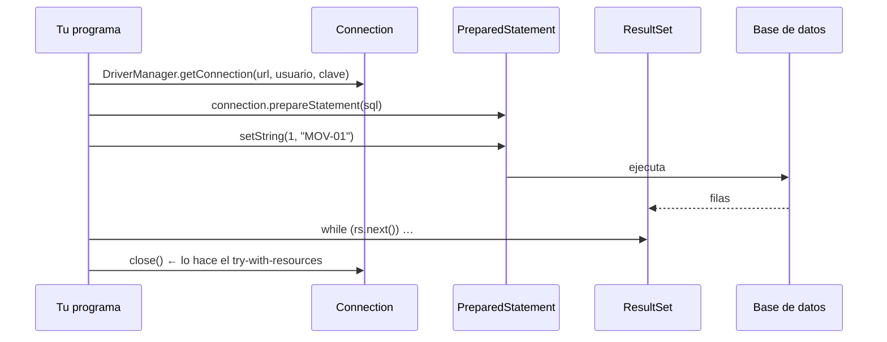

# 4. Un CRUD contra una base de datos

Último tema de la unidad y el puente hacia todo lo que viene. Aquí montas un proyecto Maven que se conecta a una base de datos real y hace las cuatro operaciones: crear, leer, modificar y borrar.

!!! info "Esto es JDBC, no JPA"
    Aquí se escribe el SQL a mano. En la **UT5** todo esto lo hará JPA por ti y no volverás a escribir una consulta salvo cuando haga falta.

    Se hace ahora a mano **una vez** por un motivo concreto: si nunca has visto lo que JPA te ahorra, no vas a entender qué está haciendo ni por qué a veces hace cosas raras.

---

## 1. Por qué una base de datos

En el tema anterior los datos estaban en un CSV. Funciona hasta que:

| Problema | Con fichero | Con base de datos |
|---|---|---|
| Buscar un producto entre 500.000 | Leer el fichero entero | Índice: directo |
| Dos usuarios escriben a la vez | Uno pisa al otro | Transacciones |
| Cambiar solo un campo | Reescribir el fichero | `UPDATE … WHERE` |
| Que no haya dos códigos iguales | Comprobarlo tú | `UNIQUE` |
| Si se corta la luz a mitad | Fichero corrupto | Se deshace sola |



**JDBC es una interfaz estándar.** Tu código habla JDBC; el *driver* traduce a lo que entiende cada motor. Por eso cambiar de H2 a MySQL es cambiar una cadena de conexión — como vas a comprobar en el punto 6.

---

## 2. El proyecto

```
crud/
├── pom.xml
└── src/main/java/es/iesx/crud/
    ├── Producto.java
    ├── ProductoDao.java
    └── Main.java
```

`pom.xml`

```xml
<project xmlns="http://maven.apache.org/POM/4.0.0" …>
  <modelVersion>4.0.0</modelVersion>

  <groupId>es.iesx</groupId>
  <artifactId>crud</artifactId>
  <version>1.0.0</version>

  <properties>
    <maven.compiler.release>25</maven.compiler.release>
    <project.build.sourceEncoding>UTF-8</project.build.sourceEncoding>
    <exec.mainClass>es.iesx.crud.Main</exec.mainClass>
  </properties>

  <dependencies>
    <dependency>                        <!-- (1) -->
      <groupId>com.h2database</groupId>
      <artifactId>h2</artifactId>
      <version>2.3.232</version>
    </dependency>

    <dependency>                        <!-- (2) -->
      <groupId>com.mysql</groupId>
      <artifactId>mysql-connector-j</artifactId>
      <version>9.1.0</version>
    </dependency>
  </dependencies>
</project>
```

1. **H2**: una base de datos entera en un `.jar`. No hay que instalar nada.
2. **MySQL**: para el punto 6. Se puede añadir después.

---

## 3. Las cuatro piezas de JDBC



| Pieza | Qué es |
|---|---|
| `Connection` | La conexión abierta. **Hay que cerrarla** |
| `PreparedStatement` | Una consulta con huecos `?` que se rellenan aparte |
| `ResultSet` | El resultado, fila a fila |
| `executeUpdate` | Para `INSERT`, `UPDATE`, `DELETE`. Devuelve **cuántas filas afectó** |

---

## 4. El modelo y la tabla

`Producto.java`

```java
package es.iesx.crud;

import java.math.BigDecimal;

public record Producto(Long id, String codigo, String nombre,
                       BigDecimal precio, int stock) {

    public Producto {
        if (codigo == null || codigo.isBlank())
            throw new IllegalArgumentException("Código obligatorio");
        if (precio == null || precio.signum() < 0)
            throw new IllegalArgumentException("Precio no válido");
        if (stock < 0)
            throw new IllegalArgumentException("Stock negativo");
    }

    public static Producto nuevo(String codigo, String nombre,
                                 String precio, int stock) {          // (1)
        return new Producto(null, codigo, nombre, new BigDecimal(precio), stock);
    }
}
```

1. Atajo para crear uno **sin id**: el id lo pone la base de datos.

El esquema, en `src/main/resources/esquema.sql`:

```sql
CREATE TABLE IF NOT EXISTS producto (
    id      BIGINT AUTO_INCREMENT PRIMARY KEY,     -- (1)
    codigo  VARCHAR(20)    NOT NULL UNIQUE,        -- (2)
    nombre  VARCHAR(100)   NOT NULL,
    precio  DECIMAL(10,2)  NOT NULL,               -- (3)
    stock   INT            NOT NULL DEFAULT 0
);
```

1. La base de datos genera el identificador.
2. **`UNIQUE`**: intentar meter dos veces el mismo código falla **en la base de datos**, no en tu `if`. Esa garantía no se la salta nadie.
3. **`DECIMAL`, nunca `DOUBLE`**, por lo mismo que `BigDecimal` en el tema anterior.

---

## 5. El DAO: las cinco operaciones

Una clase que traduce entre objetos Java y filas de la tabla. Se llama **DAO** (*Data Access Object*).

`ProductoDao.java`

```java
package es.iesx.crud;

import java.math.BigDecimal;
import java.sql.*;
import java.util.*;

public class ProductoDao {

    private final String url, usuario, clave;

    public ProductoDao(String url, String usuario, String clave) {
        this.url = url; this.usuario = usuario; this.clave = clave;
    }

    private Connection conectar() throws SQLException {
        return DriverManager.getConnection(url, usuario, clave);
    }

    // ── crear el esquema ───────────────────────────────────────────────
    public void crearTabla() {
        var sql = """
                CREATE TABLE IF NOT EXISTS producto (
                    id      BIGINT AUTO_INCREMENT PRIMARY KEY,
                    codigo  VARCHAR(20)   NOT NULL UNIQUE,
                    nombre  VARCHAR(100)  NOT NULL,
                    precio  DECIMAL(10,2) NOT NULL,
                    stock   INT           NOT NULL DEFAULT 0
                )""";

        try (var con = conectar(); var st = con.createStatement()) {    // (1)
            st.execute(sql);
        } catch (SQLException e) {
            throw new AccesoDatosException("No se pudo crear la tabla", e);
        }
    }

    // ── C · insertar ───────────────────────────────────────────────────
    public Producto insertar(Producto p) {
        var sql = "INSERT INTO producto (codigo, nombre, precio, stock) VALUES (?, ?, ?, ?)";

        try (var con = conectar();
             var ps = con.prepareStatement(sql, Statement.RETURN_GENERATED_KEYS)) {  // (2)

            ps.setString(1, p.codigo());
            ps.setString(2, p.nombre());
            ps.setBigDecimal(3, p.precio());
            ps.setInt(4, p.stock());
            ps.executeUpdate();

            try (var claves = ps.getGeneratedKeys()) {
                claves.next();
                long id = claves.getLong(1);
                return new Producto(id, p.codigo(), p.nombre(), p.precio(), p.stock());
            }
        } catch (SQLIntegrityConstraintViolationException e) {          // (3)
            throw new CodigoDuplicadoException(p.codigo(), e);
        } catch (SQLException e) {
            throw new AccesoDatosException("Error al insertar " + p.codigo(), e);
        }
    }

    // ── R · listar y buscar ────────────────────────────────────────────
    public List<Producto> listar() {
        var sql = "SELECT id, codigo, nombre, precio, stock FROM producto ORDER BY codigo";

        try (var con = conectar();
             var ps = con.prepareStatement(sql);
             var rs = ps.executeQuery()) {

            var lista = new ArrayList<Producto>();
            while (rs.next()) lista.add(aProducto(rs));                 // (4)
            return List.copyOf(lista);

        } catch (SQLException e) {
            throw new AccesoDatosException("Error al listar", e);
        }
    }

    public Optional<Producto> buscarPorCodigo(String codigo) {
        var sql = "SELECT id, codigo, nombre, precio, stock FROM producto WHERE codigo = ?";

        try (var con = conectar(); var ps = con.prepareStatement(sql)) {
            ps.setString(1, codigo);
            try (var rs = ps.executeQuery()) {
                return rs.next() ? Optional.of(aProducto(rs)) : Optional.empty();   // (5)
            }
        } catch (SQLException e) {
            throw new AccesoDatosException("Error al buscar " + codigo, e);
        }
    }

    // ── U · actualizar ─────────────────────────────────────────────────
    public boolean actualizarStock(String codigo, int stock) {
        var sql = "UPDATE producto SET stock = ? WHERE codigo = ?";

        try (var con = conectar(); var ps = con.prepareStatement(sql)) {
            ps.setInt(1, stock);
            ps.setString(2, codigo);
            return ps.executeUpdate() == 1;                             // (6)
        } catch (SQLException e) {
            throw new AccesoDatosException("Error al actualizar " + codigo, e);
        }
    }

    // ── D · borrar ─────────────────────────────────────────────────────
    public boolean borrar(String codigo) {
        try (var con = conectar();
             var ps = con.prepareStatement("DELETE FROM producto WHERE codigo = ?")) {
            ps.setString(1, codigo);
            return ps.executeUpdate() == 1;
        } catch (SQLException e) {
            throw new AccesoDatosException("Error al borrar " + codigo, e);
        }
    }

    private static Producto aProducto(ResultSet rs) throws SQLException {
        return new Producto(rs.getLong("id"), rs.getString("codigo"),
                            rs.getString("nombre"), rs.getBigDecimal("precio"),
                            rs.getInt("stock"));
    }
}
```

1. **`try-with-resources` en todas.** Una conexión sin cerrar es una fuga: con suficientes, la base de datos deja de aceptar conexiones y la aplicación entera se para.
2. `RETURN_GENERATED_KEYS` para recuperar el id que ha puesto la base de datos.
3. **La restricción `UNIQUE` en acción:** en vez de comprobar antes si el código existe —lo que además tendría una carrera entre la comprobación y la inserción—, se deja fallar y se traduce el error.
4. `while (rs.next())` recorre las filas. `next()` avanza **y** devuelve si hay fila.
5. Para un solo resultado, `rs.next()` una vez: `true` si hay algo.
6. **`executeUpdate` devuelve cuántas filas cambió.** Ese `== 1` es la forma de saber si el producto existía, sin hacer antes un `SELECT`.

Y las dos excepciones:

```java
public class AccesoDatosException extends RuntimeException {
    public AccesoDatosException(String mensaje, Throwable causa) {
        super(mensaje, causa);                 // ← la causa, SIEMPRE
    }
}

public class CodigoDuplicadoException extends RuntimeException {
    private final String codigo;
    public CodigoDuplicadoException(String codigo, Throwable causa) {
        super("Ya existe un producto con código " + codigo, causa);
        this.codigo = codigo;
    }
    public String codigo() { return codigo; }
}
```

---

## 6. La inyección SQL: por qué `?` y no concatenar

Este método hace lo mismo… y es un agujero de seguridad:

```java
// NUNCA
var sql = "SELECT * FROM producto WHERE codigo = '" + codigo + "'";
st.executeQuery(sql);
```

Si alguien manda como código:

```
x' OR '1'='1
```

la consulta que llega a la base de datos es:

```sql
SELECT * FROM producto WHERE codigo = 'x' OR '1'='1'
```

**Devuelve la tabla entera.** Y con un poco más de imaginación:

```
x'; DROP TABLE producto; --
```

Con `PreparedStatement` eso no puede pasar:

```java
var ps = con.prepareStatement("SELECT * FROM producto WHERE codigo = ?");
ps.setString(1, codigo);
```

La consulta se envía **primero** con los huecos, y el valor va **aparte**. La base de datos ya tiene decidida la estructura de la consulta cuando recibe el dato, así que el dato **no puede cambiarla**: `x' OR '1'='1` se busca tal cual, como un código rarísimo que no existe.

!!! danger "La regla, sin excepciones"
    **Ningún valor que venga de fuera se concatena en un SQL. Nunca.** Ni «solo esta vez», ni «es un número», ni «es interno».

    La inyección SQL lleva veinticinco años siendo el fallo más explotado de las aplicaciones web, y se evita con un `?`.

---

## 7. El programa, con H2

`Main.java`

```java
package es.iesx.crud;

public class Main {

    public static void main(String[] args) {

        var dao = new ProductoDao("jdbc:h2:./datos/tienda", "sa", "");   // (1)
        dao.crearTabla();

        System.out.println("=== INSERTAR ===");
        var casco = dao.insertar(Producto.nuevo("SEG-01", "Casco", "35.00", 12));
        dao.insertar(Producto.nuevo("SEG-02", "Candado", "25.00", 0));
        dao.insertar(Producto.nuevo("MOV-01", "Patinete", "120.00", 4));
        System.out.println("  Insertado con id " + casco.id());

        System.out.println("\n=== DUPLICADO ===");
        try {
            dao.insertar(Producto.nuevo("SEG-01", "Casco repetido", "40.00", 1));
        } catch (CodigoDuplicadoException e) {
            System.out.println("  " + e.getMessage());
        }

        System.out.println("\n=== LISTAR ===");
        dao.listar().forEach(p ->
                System.out.printf("  %-8s %-12s %8s €  stock %d%n",
                        p.codigo(), p.nombre(), p.precio(), p.stock()));

        System.out.println("\n=== BUSCAR ===");
        System.out.println("  SEG-01 → " +
                dao.buscarPorCodigo("SEG-01").map(Producto::nombre).orElse("no está"));
        System.out.println("  NO-HAY → " +
                dao.buscarPorCodigo("NO-HAY").map(Producto::nombre).orElse("no está"));

        System.out.println("\n=== ACTUALIZAR ===");
        System.out.println("  SEG-02 a 30 unidades: " + dao.actualizarStock("SEG-02", 30));
        System.out.println("  NO-HAY a 5 unidades:  " + dao.actualizarStock("NO-HAY", 5));

        System.out.println("\n=== BORRAR ===");
        System.out.println("  MOV-01: " + dao.borrar("MOV-01"));
        System.out.println("  Quedan " + dao.listar().size() + " productos");

        System.out.println("\n=== INYECCIÓN SQL ===");
        System.out.println("  Buscando \"x' OR '1'='1\" → " +
                dao.buscarPorCodigo("x' OR '1'='1").isPresent());       // (2)
    }
}
```

1. **`jdbc:h2:./datos/tienda`** guarda en el fichero `datos/tienda.mv.db`. Los datos **sobreviven al reinicio**, que es toda la gracia. Con `jdbc:h2:mem:tienda` viviría en memoria y desaparecería al terminar.
2. Devuelve `false`: el `?` ha hecho su trabajo.

```bash
mvn clean compile
mvn exec:java
```

```
=== INSERTAR ===
  Insertado con id 1

=== DUPLICADO ===
  Ya existe un producto con código SEG-01

=== LISTAR ===
  MOV-01   Patinete       120.00 €  stock 4
  SEG-01   Casco           35.00 €  stock 12
  SEG-02   Candado         25.00 €  stock 0

=== BUSCAR ===
  SEG-01 → Casco
  NO-HAY → no está

=== ACTUALIZAR ===
  SEG-02 a 30 unidades: true
  NO-HAY a 5 unidades:  false

=== BORRAR ===
  MOV-01: true
  Quedan 2 productos

=== INYECCIÓN SQL ===
  Buscando "x' OR '1'='1" → false
```

**Vuelve a ejecutarlo.** El segundo arranque da `CodigoDuplicadoException` en los tres `insertar`: los datos siguen ahí. Eso es la diferencia con el CSV.

!!! tip "Ver la base de datos por dentro"
    ```bash
    java -cp ~/.m2/repository/com/h2database/h2/2.3.232/h2-2.3.232.jar org.h2.tools.Server -web
    ```

    Abre `http://localhost:8082`, pon la URL `jdbc:h2:./datos/tienda`, usuario `sa` y sin contraseña. Verás la tabla y podrás lanzar consultas a mano. **Mirar la base de datos con tus ojos evita muchísimas horas de depuración a ciegas.**

---

## 8. El mismo código contra MySQL en Docker

Ahora la parte que demuestra para qué sirve JDBC.

`compose.yaml`

```yaml
services:
  mysql:
    image: mysql:8.4
    container_name: tienda-mysql
    environment:
      MYSQL_ROOT_PASSWORD: root
      MYSQL_DATABASE: tienda          # (1)
      MYSQL_USER: alumno
      MYSQL_PASSWORD: alumno
    ports:
      - "3306:3306"                   # (2)
    volumes:
      - datos-mysql:/var/lib/mysql    # (3)
    healthcheck:                      # (4)
      test: ["CMD", "mysqladmin", "ping", "-h", "localhost", "-proot"]
      interval: 5s
      retries: 10

volumes:
  datos-mysql:
```

1. Crea la base de datos al arrancar por primera vez.
2. `puerto_de_tu_máquina:puerto_del_contenedor`.
3. **Sin el volumen, los datos desaparecen** al borrar el contenedor.
4. Dice cuándo está *lista de verdad*: un contenedor arrancado no significa una base de datos que acepte conexiones.

```bash
docker compose up -d
docker compose ps           # esperar a que ponga (healthy)
```

Y el cambio en el programa es **una línea**:

```java
var dao = new ProductoDao(
        "jdbc:mysql://localhost:3306/tienda?serverTimezone=Europe/Madrid",   // (1)
        "alumno", "alumno");
```

1. El `serverTimezone` evita el clásico desfase de horas entre el contenedor y tu máquina.

```bash
mvn exec:java      # mismo código, otra base de datos
```

**No se ha tocado el DAO ni una línea.** Eso es lo que significa que JDBC sea un estándar.

Para curiosear desde fuera:

```bash
docker compose exec mysql mysql -ualumno -palumno tienda -e "SELECT * FROM producto;"
docker compose down            # parar
docker compose down -v         # parar Y borrar los datos
```

!!! warning "Las tres diferencias que sí hay que conocer"
    | | H2 | MySQL |
    |---|---|---|
    | Autoincremento | `AUTO_INCREMENT` | `AUTO_INCREMENT` |
    | Texto largo | `VARCHAR` | `VARCHAR` / `TEXT` |
    | Comillas de identificadores | `"` | **`` ` ``** |

    El SQL básico es igual, y en cuanto te sales de lo básico aparecen diferencias. Es exactamente el problema que resuelve JPA en la UT5: escribes en JPQL y **él** genera el SQL de cada motor.

    Y de ahí la regla profesional: **desarrolla contra el mismo motor que usarás en producción**. Probar con H2 y desplegar en MySQL es la forma más segura de que el error aparezca el día del despliegue.

---

## Pruébalo ahora (25 min)

1. Monta el proyecto con H2 y ejecútalo. Vuelve a ejecutarlo y comprueba que los datos siguen.
2. Abre la consola web de H2 y mira la tabla.
3. Añade `buscarPorPrecioMenorQue(BigDecimal)` que devuelva una lista.
4. Levanta MySQL con Docker, cambia la URL y ejecuta lo mismo.
5. **Escribe la versión insegura** de `buscarPorCodigo` concatenando, y pásale `x' OR '1'='1`. Mira cuántas filas devuelve. Después bórrala.

??? success "Pistas de los puntos 3 y 5"

    ```java
    // 3
    public List<Producto> buscarPorPrecioMenorQue(BigDecimal tope) {
        var sql = "SELECT id, codigo, nombre, precio, stock FROM producto "
                + "WHERE precio < ? ORDER BY precio";
        try (var con = conectar(); var ps = con.prepareStatement(sql)) {
            ps.setBigDecimal(1, tope);
            try (var rs = ps.executeQuery()) {
                var lista = new ArrayList<Producto>();
                while (rs.next()) lista.add(aProducto(rs));
                return List.copyOf(lista);
            }
        } catch (SQLException e) {
            throw new AccesoDatosException("Error al filtrar por precio", e);
        }
    }
    ```

    ```java
    // 5 · SOLO para verlo, y después se borra
    var sql = "SELECT * FROM producto WHERE codigo = '" + codigo + "'";
    try (var con = conectar(); var st = con.createStatement();
         var rs = st.executeQuery(sql)) {
        int n = 0; while (rs.next()) n++;
        System.out.println("Filas devueltas: " + n);     // ← la tabla entera
    }
    ```

    Ver ese número con tus ojos es la mejor clase de seguridad de la unidad.

---

## Ejercicios (con solución)

??? success "E1 · ¿Qué devuelve `executeUpdate`?"

    ```java
    int n = ps.executeUpdate();     // UPDATE producto SET stock = ? WHERE codigo = ?
    ```

    **El número de filas afectadas.** Si el código no existe, devuelve `0`.

    Eso permite saber si el producto estaba **sin hacer antes un `SELECT`**:

    ```java
    return ps.executeUpdate() == 1;
    ```

    Y ojo: para `SELECT` no se usa `executeUpdate`, sino `executeQuery`, que devuelve un `ResultSet`.

??? success "E2 · La conexión que no se cierra"

    ```java
    public List<Producto> listar() throws SQLException {
        var con = DriverManager.getConnection(url, usuario, clave);
        var ps = con.prepareStatement("SELECT * FROM producto");
        var rs = ps.executeQuery();
        var lista = new ArrayList<Producto>();
        while (rs.next()) lista.add(aProducto(rs));
        return lista;
    }
    ```

    **No se cierra nada.** Funciona las primeras veces y después la base de datos deja de aceptar conexiones: `Too many connections`.

    Lo malo es que el síntoma aparece lejos de la causa, y bajo carga. Con `try-with-resources` no puede pasar:

    ```java
    try (var con = conectar();
         var ps = con.prepareStatement(sql);
         var rs = ps.executeQuery()) { … }
    ```

    Se cierran los tres, en orden inverso, pase lo que pase.

??? success "E3 · La inyección"

    ```java
    var sql = "SELECT * FROM usuario WHERE nombre = '" + nombre
            + "' AND clave = '" + clave + "'";
    ```

    ¿Qué escribe un atacante en `clave` para entrar sin saberla?

    ```
    x' OR '1'='1
    ```

    La consulta queda:

    ```sql
    SELECT * FROM usuario WHERE nombre = 'ana' AND clave = 'x' OR '1'='1'
    ```

    `'1'='1'` es siempre cierto, así que devuelve **todos los usuarios** y el login da por buena la entrada.

    Con `?` es imposible: el valor nunca se interpreta como parte de la consulta.

??? success "E4 · `UNIQUE` frente a comprobarlo tú"

    ```java
    if (buscarPorCodigo(p.codigo()).isPresent()) {
        throw new CodigoDuplicadoException(p.codigo());
    }
    insertar(p);
    ```

    ¿Qué problema tiene, además de hacer dos consultas?

    **Una carrera.** Entre el `buscarPorCodigo` y el `insertar` hay un hueco en el que otro proceso puede insertar el mismo código. Los dos comprueban, los dos ven que está libre, los dos insertan.

    La restricción `UNIQUE` de la base de datos **no tiene ese hueco**: es atómica. Por eso la forma correcta es intentar insertar y traducir el error:

    ```java
    catch (SQLIntegrityConstraintViolationException e) {
        throw new CodigoDuplicadoException(p.codigo(), e);
    }
    ```

    Esto reaparece, con el mismo argumento, en la UT5.

??? success "E5 · `DECIMAL` o `DOUBLE`"

    ```sql
    precio DOUBLE NOT NULL
    ```

    Igual que en Java: `DOUBLE` guarda en binario y arrastra errores de redondeo. Sumando miles de importes aparece el descuadre.

    ```sql
    precio DECIMAL(10,2) NOT NULL
    ```

    `10` es el total de dígitos y `2` los decimales: hasta `99999999,99`. Y en Java, `BigDecimal` con `getBigDecimal` / `setBigDecimal`.

??? success "E6 · El cambio de motor"

    Tienes el CRUD funcionando con H2. Te piden pasarlo a MySQL. ¿Qué tocas?

    1. **La dependencia** del driver en el `pom.xml` (si no estaba).
    2. **La URL de conexión**, el usuario y la contraseña.

    Y nada más, si el SQL es estándar. El DAO entero se queda igual — eso es lo que aporta JDBC.

    Lo que sí puede dar guerra: tipos concretos de cada motor, el juego de caracteres y la zona horaria. Por eso lo profesional es **desarrollar contra el mismo motor que se usará en producción**, y por eso existe Docker: levantar el motor de verdad en tu máquina cuesta una orden.

??? success "E7 · Los datos que desaparecieron"

    Un compañero levanta MySQL con Docker, mete datos, hace `docker compose down` y al volver a arrancar no hay nada.

    Le falta el **volumen**:

    ```yaml
    volumes:
      - datos-mysql:/var/lib/mysql
    ```

    Sin él, los datos viven dentro del contenedor y se van con él. Con él, viven en un volumen de Docker que sobrevive.

    Y el matiz que hay que saber: **`docker compose down -v` borra también el volumen**. Esa `-v` es la que de verdad destruye los datos.
