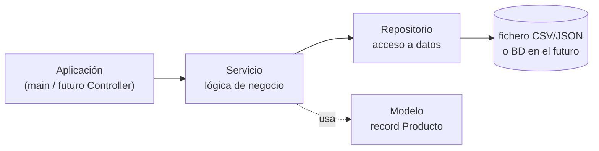

# El patrón Repositorio y las capas

> La última página de los fundamentos, y la más importante para lo que viene. Aquí montas **a mano** la arquitectura que en la UT4 te dará Spring: separar el acceso a datos de la lógica de negocio.

## 1. El problema: código que lo hace todo

```bash
// MAL  Todo mezclado: leer fichero, lógica y presentación
void main() throws IOException {
    var lineas = Files.readAllLines(Path.of("productos.csv"));
    for (var l : lineas.subList(1, lineas.size())) {
        var c = l.split(",");
        var precio = Double.parseDouble(c[3]);
        if (precio > 100) {
            IO.println("CARO: " + c[1].toUpperCase() + " (" + precio * 1.21 + " con IVA)");
        }
    }
}
```

Funciona, pero: no se puede **testear** sin fichero, no se puede **reutilizar**, y si mañana los datos vienen de una base de datos hay que reescribirlo entero. Es el equivalente al *Fat Controller* de la UT1.

## 2. La solución: capas y el patrón Repositorio



Cada pieza tiene **una responsabilidad**:

| Capa | Responsabilidad | No debe… |
|---|---|---|
| **Modelo** | Representar los datos (`record`) | Saber de dónde vienen |
| **Repositorio** | Leer y guardar (CSV, JSON, BD) | Aplicar reglas de negocio |
| **Servicio** | Reglas de negocio (descuentos, validaciones) | Saber si son ficheros o BD |
| **Aplicación** | Pedir cosas y mostrar resultados | Contener lógica |

### El contrato: una interfaz

```java
public interface ProductoRepositorio {
    List<Producto> buscarTodos();
    Optional<Producto> buscarPorId(int id);
    Producto guardar(Producto producto);
    boolean borrar(int id);
}
```

**Esta interfaz es la clave de todo.** El servicio dependerá de ella, no de la implementación (DIP, de la UT1). Cambiar CSV por base de datos será cambiar una línea.

### Una implementación: CSV

``` { .java .numerado .annotate title="repositorio/ProductoRepositorioCsv.java" hl_lines="1 8 9 13" }
public class ProductoRepositorioCsv implements ProductoRepositorio {   // (1)!
    private final Path ruta;

    public ProductoRepositorioCsv(Path ruta) { this.ruta = ruta; }     // (2)!

    @Override
    public List<Producto> buscarTodos() {
        try (var lineas = Files.lines(ruta)) {                         // (3)!
            return lineas.skip(1).filter(l -> !l.isBlank())            // (4)!
                .map(this::aProducto)
                .toList();
        } catch (IOException e) {
            throw new RepositorioException("No se pudo leer " + ruta, e);   // (5)!
        }
    }

    @Override
    public Optional<Producto> buscarPorId(int id) {
        return buscarTodos().stream().filter(p -> p.id() == id).findFirst();
    }

    @Override
    public Producto guardar(Producto p) {
        var todos = new ArrayList<>(buscarTodos());
        todos.removeIf(x -> x.id() == p.id());   // si existe, lo reemplaza
        todos.add(p);
        escribir(todos);
        return p;
    }

    @Override
    public boolean borrar(int id) {
        var todos = new ArrayList<>(buscarTodos());
        var borrado = todos.removeIf(p -> p.id() == id);
        if (borrado) escribir(todos);
        return borrado;
    }

    private Producto aProducto(String linea) {
        var c = linea.split(",");
        return new Producto(Integer.parseInt(c[0].trim()), c[1].trim(),
                            c[2].trim(), Double.parseDouble(c[3].trim()));
    }

    private void escribir(List<Producto> productos) {
        var sb = new StringBuilder("id,nombre,categoria,precio\n");
        productos.forEach(p -> sb.append("%d,%s,%s,%.2f%n"
            .formatted(p.id(), p.nombre(), p.categoria(), p.precio())));
        try {
            Files.writeString(ruta, sb.toString());
        } catch (IOException e) {
            throw new RepositorioException("No se pudo escribir " + ruta, e);
        }
    }
}
```

1.  **La clase implementa la interfaz, y el resto del programa solo conoce la interfaz.** Ese es todo el truco: cambiar CSV por JSON —o por la base de datos de la UT5— es cambiar una línea donde se crea el objeto, sin tocar el servicio.

2.  **La ruta se recibe, no se codifica dentro.** Así el mismo repositorio sirve para el fichero de producción y para uno temporal en los tests. Es inyección de dependencias a mano; en la UT4 lo hará Spring por ti.

3.  **`try-with-resources`.** `Files.lines` abre un descriptor de fichero y **hay que cerrarlo**; el `try(...)` lo cierra siempre, incluso si salta una excepción. Sin él, en Windows el fichero se queda bloqueado y no puedes ni borrarlo.

4.  **`skip(1)`** salta la cabecera del CSV. Es el fallo número uno con ficheros de texto: procesar la línea `id,nombre,categoria,precio` como si fuera un producto y reventar en el `Integer.parseInt`.

5.  **La `IOException` se envuelve en una excepción propia.** El servicio que llama a esto no tiene por qué saber que los datos vienen de un fichero: si mañana vienen de una base de datos, la excepción que ve sigue siendo la misma. Fíjate en que se pasa `e` como causa — perder la excepción original es tirar la información que necesitarás para depurar.

### El servicio: aquí viven las reglas

``` { .java .numerado }
public class ProductoServicio {
    private final ProductoRepositorio repositorio;   // ← la INTERFAZ, no la clase

    public ProductoServicio(ProductoRepositorio repositorio) {
        this.repositorio = repositorio;              // inyección por constructor
    }

    public Producto obtener(int id) {
        return repositorio.buscarPorId(id)
            .orElseThrow(() -> new ProductoNoEncontradoException(id));
    }

    public List<Producto> buscarCaros(double umbral) {
        return repositorio.buscarTodos().stream()
            .filter(p -> p.precio() > umbral)
            .sorted(Comparator.comparing(Producto::precio).reversed())
            .toList();
    }

    public double precioConIva(int id) {
        return obtener(id).precio() * 1.21;
    }

    public Producto alta(Producto p) {
        if (repositorio.buscarPorId(p.id()).isPresent())
            throw new IllegalArgumentException("Ya existe el producto " + p.id());
        return repositorio.guardar(p);
    }
}
```

Fíjate en **`ProductoServicio` no sabe que existen los ficheros**. Podrías pasarle un repositorio en memoria, uno JSON o, mañana, uno de base de datos: el servicio no cambia.

## 3. Montarlo todo

```java
void main() {
    // Se elige la implementación AQUÍ, en un solo sitio
    ProductoRepositorio repo = new ProductoRepositorioCsv(Path.of("datos/productos.csv"));
    var servicio = new ProductoServicio(repo);

    servicio.buscarCaros(100).forEach(p -> IO.println(p.nombre()));
    IO.println(servicio.precioConIva(1));
}
```

Ese "elegir la implementación en un solo sitio" es literalmente lo que hará **Spring** por ti en la UT4 con `@Repository`, `@Service` y la inyección automática. Estás construyendo el andamio a mano para entenderlo.

**Y ahora sí se puede testear** sin tocar el disco:

```java
class RepositorioEnMemoria implements ProductoRepositorio {
    private final Map<Integer, Producto> datos = new HashMap<>();
    public List<Producto> buscarTodos() { return List.copyOf(datos.values()); }
    public Optional<Producto> buscarPorId(int id) { return Optional.ofNullable(datos.get(id)); }
    public Producto guardar(Producto p) { datos.put(p.id(), p); return p; }
    public boolean borrar(int id) { return datos.remove(id) != null; }
}

@Test
void precioConIvaAplicaEl21PorCiento() {
    var repo = new RepositorioEnMemoria();
    repo.guardar(new Producto(1, "Patinete", "movilidad", 100.0));
    var servicio = new ProductoServicio(repo);

    assertEquals(121.0, servicio.precioConIva(1));
}
```

Test rápido, sin ficheros, sin efectos colaterales. **Eso es lo que ganas separando capas.**

## 4. Excepciones propias por capa

Que el servicio lance `IllegalArgumentException` para todo es tirar información. Cada capa tiene su vocabulario:

```java
// La capa de datos habla de acceso
public class ErrorAccesoDatosException extends RuntimeException {
    public ErrorAccesoDatosException(String mensaje, Throwable causa) { super(mensaje, causa); }
}

// La capa de negocio habla del dominio
public abstract class NegocioException extends RuntimeException {
    protected NegocioException(String mensaje) { super(mensaje); }
}
public class ProductoNoEncontradoException extends NegocioException {
    public ProductoNoEncontradoException(int id) { super("No existe el producto " + id); }
}
public class PrecioInvalidoException extends NegocioException {
    public PrecioInvalidoException(double precio) { super("Precio no válido: " + precio); }
}
```

Y el repositorio **traduce** la excepción técnica a una de su capa, sin perder la causa original:

```java
@Override
public List<Producto> buscarTodos() {
    try (var lineas = Files.lines(ruta)) {
        return lineas.skip(1).filter(l -> !l.isBlank()).map(this::aProducto).toList();
    } catch (IOException e) {
        // ← causa conservada
        throw new ErrorAccesoDatosException("No se pudo leer " + ruta, e);
    }
}
```

Así el servicio no necesita saber que los datos vienen de un fichero: si mañana es una base de datos, la excepción que ve sigue siendo `ErrorAccesoDatosException`. Y ese segundo parámetro `e` es fundamental: sin él pierdes la traza real y depurar se vuelve adivinar.

## 5. El servicio no devuelve `null`

```java
// MAL  Obliga a quien llama a acordarse de comprobar. Un día se olvidará.
public Producto buscar(int id) { return datos.get(id); }

// BIEN Optional: el tipo te obliga a decidir qué pasa si no hay nada
public Optional<Producto> buscar(int id) { return Optional.ofNullable(datos.get(id)); }

// BIEN O excepción, cuando la ausencia ES un error
public Producto obtener(int id) {
    return buscar(id).orElseThrow(() -> new ProductoNoEncontradoException(id));
}
```

El convenio que usaremos todo el curso: el **repositorio** devuelve `Optional` (no encontrar algo es normal a ese nivel) y el **servicio** ofrece las dos versiones — `buscar` con `Optional` y `obtener`, que lanza excepción. En la UT6 verás que esa excepción se convierte automáticamente en un **404**.

## 6. Una segunda implementación

La prueba de que las capas están bien hechas es cambiar el almacenamiento sin tocar nada más:

``` { .java .numerado }
public class ProductoRepositorioJson implements ProductoRepositorio {

    private final Path ruta;
    private final ObjectMapper mapper = new ObjectMapper();
    private final Map<Integer, Producto> cache = new LinkedHashMap<>();

    public ProductoRepositorioJson(Path ruta) {
        this.ruta = ruta;
        cargar();
    }

    private void cargar() {
        if (!Files.exists(ruta)) return;
        try {
            List<Producto> lista = mapper.readValue(ruta.toFile(), new TypeReference<>() {});
            lista.forEach(p -> cache.put(p.id(), p));
        } catch (IOException e) {
            throw new ErrorAccesoDatosException("No se pudo leer " + ruta, e);
        }
    }

    private void persistir() {
        var temporal = ruta.resolveSibling(ruta.getFileName() + ".tmp");
        try {
            mapper.writerWithDefaultPrettyPrinter()
                  .writeValue(temporal.toFile(), List.copyOf(cache.values()));
            Files.move(temporal, ruta, StandardCopyOption.REPLACE_EXISTING);  // atómico
        } catch (IOException e) {
            throw new ErrorAccesoDatosException("No se pudo escribir " + ruta, e);
        }
    }

    @Override public List<Producto> buscarTodos() { return List.copyOf(cache.values()); }
    @Override public Optional<Producto> buscarPorId(int id) {
        return Optional.ofNullable(cache.get(id));
    }
    @Override public Producto guardar(Producto p) { cache.put(p.id(), p); persistir(); return p; }
    @Override public boolean borrar(int id) {
        boolean habia = cache.remove(id) != null;
        if (habia) persistir();
        return habia;
    }
}
```

Cambiar de CSV a JSON es **una línea** en el `main`:

```java
ProductoRepositorio repo = new ProductoRepositorioJson(Path.of("datos/productos.json"));
```

El servicio, los tests y el resto de la aplicación no se enteran. Eso es el **principio de inversión de dependencias**: el negocio depende de una abstracción, no de un detalle técnico.

## 7. Dónde va cada cosa

| Responsabilidad | Capa | Ejemplo |
|---|---|---|
| Leer y escribir el almacén | Repositorio | `Files.lines`, `mapper.readValue`, SQL |
| Traducir el formato a objetos | Repositorio | `split(",")` → `Producto` |
| Reglas de negocio | Servicio | «no se puede vender bajo mínimos» |
| Cálculos del dominio | Servicio o modelo | IVA, descuentos, edad |
| Coordinar varios repositorios | Servicio | crear pedido y descontar stock |
| Interacción con el usuario | Presentación | menú por consola, controlador REST |
| Formatear la salida | Presentación | `%.2f €`, JSON |

Dos olores a código mal repartido, fáciles de detectar en tu propio proyecto:

- `Files` o `split` en el servicio
    → lógica de acceso a datos filtrada donde no toca.
- `System.out.println` en el servicio
    → tu lógica de negocio no compilaría en una API web. La presentación es otra capa.

---

## Pruébalo ahora (20 min) — proyecto integrador

!!! reto "Trabaja tú ahora"
    Este bloque se hace **en clase, en tu equipo**. No se entrega ni puntúa: es la práctica que hace que el examen te salga.

Monta el catálogo completo con esta estructura de ficheros:

```text
catalogo/
├── Producto.java                    (record)
├── ProductoRepositorio.java         (interfaz)
├── ProductoRepositorioCsv.java      (implementación)
├── ProductoServicio.java            (lógica)
└── App.java                         (main)
```

Empieza por la interfaz y el record; luego la implementación CSV; después el servicio; y al final el `main` que lo une. Cuando funcione, **añade un `ProductoRepositorioJson`** usando Jackson: verás que el servicio y el main **no cambian ni una línea**. Ese es el momento en que se entiende para qué sirven las interfaces.

---

## Ejercicios (con solución)

### Ejercicio 1 — ¿Qué capa?

Ubica: (a) `Files.readAllLines` · (b) "si el pedido supera 50 €, envío gratis" · (c) `record Cliente(...)` · (d) `IO.println` del resultado · (e) convertir una línea CSV en objeto · (f) "no se puede borrar un producto con pedidos activos".

??? success "Solución"

    (a) Repositorio · (b) Servicio · (c) Modelo · (d) Aplicación · (e) Repositorio (mapeo de la fuente de datos) · (f) Servicio (regla de negocio).


### Ejercicio 2 — Detecta el error de diseño

```java
public class ProductoRepositorioCsv implements ProductoRepositorio {
    public List<Producto> buscarCarosConIva() {
        return buscarTodos().stream()
            .filter(p -> p.precio() > 100)
            .map(p -> new Producto(p.id(), p.nombre(), p.categoria(), p.precio() * 1.21))
            .toList();
    }
}
```

??? success "Solución"

    El repositorio está aplicando lógica de negocio (el umbral de 100 € y el IVA). Su única responsabilidad es leer y guardar. Ese método debe vivir en `ProductoServicio`, que llamará a `buscarTodos()` y filtrará. Si no, cada implementación (CSV, JSON, BD) tendría que duplicar la misma regla.


### Ejercicio 3 — Cambia la fuente de datos

Tienes el servicio funcionando con CSV. Te piden pasar a JSON. ¿Qué ficheros tocas?

??? success "Solución"

    Solo dos: creas ProductoRepositorioJson implements ProductoRepositorio y cambias una línea del main:
    ```java
    ProductoRepositorio repo = new ProductoRepositorioJson(Path.of("datos/productos.json"));
    ```

    ProductoServicio

    no se toca. Esa es la recompensa de programar contra interfaces — y el motivo por el que Spring organiza así las aplicaciones.


### Ejercicio 4 — Test sin ficheros

Escribe un test que compruebe que `alta()` lanza excepción si el id ya existe, **sin usar el disco**.

??? success "Solución"

    ```java
    @Test
    void altaFallaSiElIdYaExiste() {
        var repo = new RepositorioEnMemoria();
        repo.guardar(new Producto(1, "Patinete", "movilidad", 120.0));
        var servicio = new ProductoServicio(repo);

        assertThrows(IllegalArgumentException.class,
            () -> servicio.alta(new Producto(1, "Otro", "otra", 50.0)));
    }
    ```

    La implementación en memoria hace de "doble" del repositorio real: es la idea de los *mocks* que formalizaremos con Mockito en la UT4.


### Ejercicio 5 — Traduce la excepción

El repositorio CSV puede fallar por `IOException` o por `NumberFormatException` (fila corrupta). ¿Qué debe ver el servicio?

??? success "Solución"

    Ninguna de las dos: son detalles del formato. El repositorio las captura y lanza su propia excepción de capa, conservando la causa:
    ```java
    catch (IOException e) {
        throw new ErrorAccesoDatosException("No se pudo leer " + ruta, e);
    } catch (NumberFormatException e) {
        throw new DatosCorruptosException("Fila con formato inválido en " + ruta, e);
    }
    ```

    Si el servicio tuviera que capturar IOException, estaría acoplado a que los datos vienen de un fichero — y ese acoplamiento es justo lo que las capas evitan. El segundo argumento (e) conserva la traza original: sin él, depurar es adivinar.


### Ejercicio 6 — `Optional` o excepción

¿Cuándo devuelves `Optional<Producto>` y cuándo lanzas `ProductoNoEncontradoException`?

??? success "Solución"

    Optional cuando no encontrar nada es un resultado normal y esperado: el repositorio buscando por id, un método `buscarPorEmail` que se usa para comprobar si ya existe. Excepción cuando la ausencia impide continuar: `obtener(id)` en un `GET /productos/42` — ahí el cliente pidió algo concreto y no está, y eso debe acabar en un 404. Convenio del curso: repositorio → Optional; servicio → las dos versiones, buscar (Optional) y obtener (excepción). Lo que nunca se devuelve es null.


### Ejercicio 7 — Diseña las capas

Aplicación de biblioteca: prestar un libro comprobando que existe, que está disponible y que el socio no supera 5 préstamos; registrar el préstamo y marcar el libro. ¿Qué clases creas y qué hace cada una?

??? success "Solución"

    ```
    modelo/       Libro, Socio, Prestamo                 (records, con métodos de dominio)
    repositorio/  LibroRepositorio, SocioRepositorio, PrestamoRepositorio   (interfaces)
                  ...Csv o ...Json                        (implementaciones)
    servicio/     PrestamoServicio                        (LAS REGLAS)
    presentacion/ MenuConsola  (o, en la UT4, PrestamoControlador)
    ```

    ```java
    public Prestamo prestar(int libroId, int socioId) {
        var libro = libroRepo.buscarPorId(libroId)
            .orElseThrow(() -> new LibroNoEncontradoException(libroId));
        var socio = socioRepo.buscarPorId(socioId)
            .orElseThrow(() -> new SocioNoEncontradoException(socioId));

        if (!libro.disponible())            throw new LibroPrestadoException(libroId);
        if (prestamoRepo.activosDe(socioId) >= 5) throw new LimitePrestamosException(socioId);

        var prestamo = new Prestamo(null, libroId, socioId,
                                    LocalDate.now(), LocalDate.now().plusDays(15), null);
        libroRepo.guardar(libro.conDisponible(false));
        return prestamoRepo.guardar(prestamo);
    }
    ```

    Fíjate en que las tres reglas y la coordinación de los tres repositorios están en el servicio. Los repositorios solo guardan y leen; no saben nada de límites ni de disponibilidad.


### Ejercicio 8 — Detecta las cuatro violaciones

```java
@Service
public class PedidoServicio {
    public void crear(String csv) throws IOException {
        var campos = csv.split(",");
        var lineas = Files.readAllLines(Path.of("productos.csv"));
        double total = Double.parseDouble(campos[2]) * 1.21;
        System.out.println("Total: " + total + " €");
        Files.writeString(Path.of("pedidos.csv"), csv + "\n", StandardOpenOption.APPEND);
    }
}
```

??? success "Solución"

    (1) Acceso a ficheros en el servicio (`Files.readAllLines`, `writeString`): es trabajo del repositorio. (2) Parseo de CSV en el servicio (split, `parseDouble`): el servicio debe recibir un objeto ya construido, no una línea de texto. (3) `System.out.println`: eso es presentación. Este servicio no se puede reutilizar en una API web. (4) El IVA está escrito a fuego (1.21) y sin nombre; debe ser una constante o configuración. Extra: throws IOException filtra un detalle técnico en la firma del negocio. Correcto:
    ```java
    public Pedido crear(CrearPedidoDto dto) {
        var pedido = mapper.aModelo(dto);
        var total = pedido.subtotal() * (1 + config.iva());
        return pedidoRepositorio.guardar(pedido.conTotal(total));
    }
    ```

