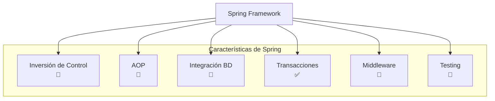
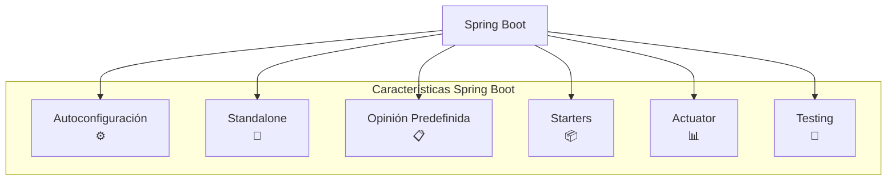
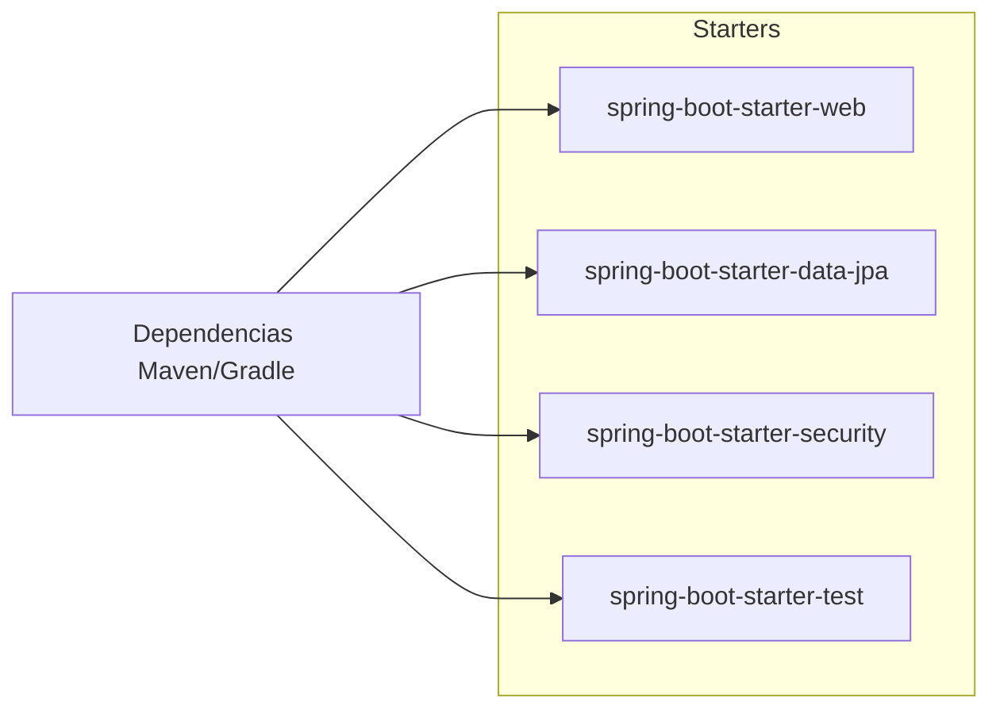
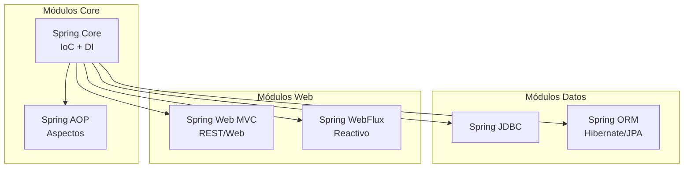
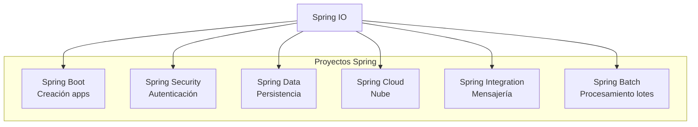
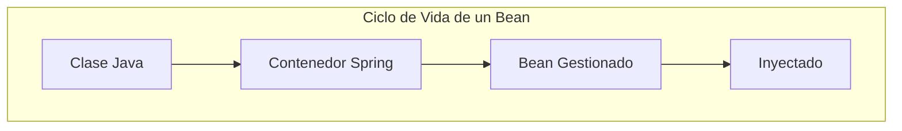
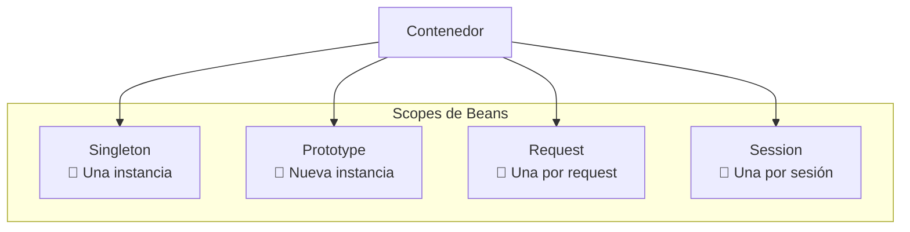
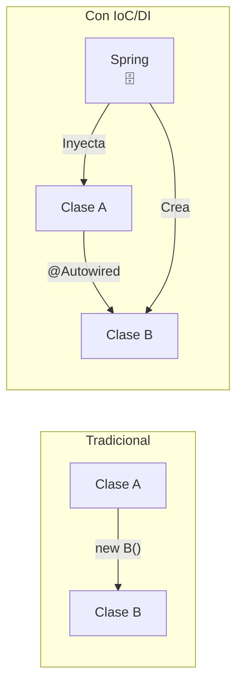
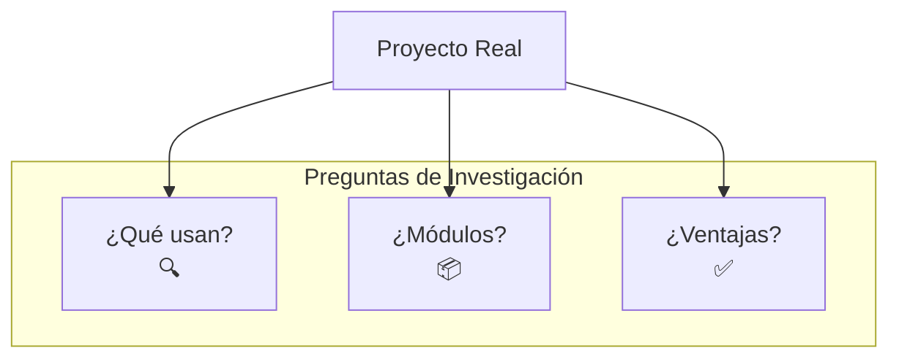

# 1. Introducción a Spring y Spring Boot

!!! quote "Autoría del material"
    Este tema es una **adaptación del material de [José Luis González Sánchez](https://github.com/joseluisgs)**, concretamente del archivo `springboot/03-Spring.md` del repositorio [DesarrolloWebEntornosServidor-02-2025-2026](https://github.com/joseluisgs/DesarrolloWebEntornosServidor-02-2025-2026).

    Publicado bajo licencia [Creative Commons Reconocimiento-NoComercial-CompartirIgual 4.0](http://creativecommons.org/licenses/by-nc-sa/4.0/). Se conservan el texto, los diagramas y los ejemplos originales; se han renumerado los apartados para encajar en la UT4 y se han añadido los ejercicios del final.

!!! note "Nota del Profesor"
    Spring es el framework más popular de Java. Dominar Spring Boot es esencial para cualquier desarrollador Java moderno.

!!! tip "Tip del Examinador"
    En el examen preguntan mucho sobre la diferencia entre IoC y DI. ¡No los confundas!

---

## 1.1. Spring Framework

[Spring](https://spring.io/) es un marco de trabajo (framework) de código abierto para el desarrollo de aplicaciones en la plataforma JVM. Fue creado para abordar la complejidad del desarrollo empresarial y es ampliamente adoptado debido a sus características, como:



1. **Inversión de Control (IoC)**: Spring maneja la creación y gestión de objetos, lo que reduce la dependencia entre los componentes del software.

2. **Programación Orientada a Aspectos (AOP)**: Spring proporciona un soporte potente para la programación orientada a aspectos, lo que permite a los desarrolladores aplicar funcionalidades transversales de manera declarativa, como registro, seguridad, transacciones, etc.

3. **Integración de la base de datos**: Spring proporciona una abstracción de la base de datos a través de su módulo JDBC y ORM, lo que facilita la integración con diferentes bases de datos.

4. **Soporte para transacciones**: Spring proporciona un mecanismo de gestión de transacciones que puede integrarse con una variedad de tecnologías de persistencia.

5. **Integración con tecnologías de middleware**: Spring se integra bien con tecnologías de middleware como JMS, EJB, etc.

6. **Soporte para pruebas**: Spring proporciona soporte para pruebas unitarias y de integración, lo que ayuda a los desarrolladores a verificar su código de manera más eficiente.

!!! tip "Tip del Examinador"
    Spring simplifica Java EE. Antiguamente había que usar EJB complejo; ahora con Spring es mucho más sencillo.

---

## 1.2. Spring Boot

Spring Boot es un proyecto que se basa en el Spring Framework y simplifica el proceso de configuración y ejecución de aplicaciones Spring. Las características clave de Spring Boot incluyen:



1. **Autoconfiguración**: Spring Boot puede configurar automáticamente una aplicación basada en las dependencias que se han agregado al proyecto.

!!! warning "Advertencia"
    La autoconfiguración es mágica, pero puede causar problemas si no entiendes qué está pasando. Usa `--debug` para ver qué se ha autoconfigurado.

2. **Standalone**: Spring Boot permite crear aplicaciones independientes con un servidor embebido, lo que significa que no necesitas un servidor web o de aplicaciones separado.

!!! note "Nota del Profesor"
    Antes: WAR desplegado en Tomcat/JBoss. Ahora: JAR ejecutable con Tomcat embebido. Mucho más sencillo.

3. **Opinión predefinida**: Spring Boot tiene una opinión predefinida para configurar proyectos Spring, aunque permite a los desarrolladores modificar la configuración para satisfacer sus necesidades.

4. **Dependencias de inicio**: Proporciona starters que son un conjunto de dependencias convenientes que simplifican la configuración de la aplicación.



5. **Actuator**: Proporciona funcionalidades de producción listas para usar, como la monitorización y la gestión de la aplicación.

6. **Pruebas**: Spring Boot proporciona soporte para pruebas con Spring Boot Test Starter, lo que facilita la escritura de pruebas para las aplicaciones Spring Boot.

---

## 1.3. Módulos principales de Spring

**Spring Framework** está diseñado de manera modular, lo que significa que puedes elegir usar solo los módulos que necesitas para tu aplicación. Aquí te describo algunos de los [módulos](https://spring.io/projects/) más comunes:




1. **Spring Core**: Este es el módulo central del framework Spring que proporciona la implementación fundamental de la Inversión de Control (IoC) y la Inyección de Dependencias (DI).

!!! tip "Tip del Examinador"
    Spring Core es la base de TODO Spring. Sin Core, no hay nada más.

2. **Spring AOP**: Este módulo proporciona soporte para la Programación Orientada a Aspectos (AOP), que permite a los desarrolladores definir métodos que se ejecutan antes, después o alrededor de los métodos de negocio.

3. **Spring DAO / Spring JDBC**: Estos módulos proporcionan una capa de abstracción sobre las operaciones de bajo nivel de JDBC, lo que facilita el manejo de las operaciones de la base de datos.

4. **Spring ORM**: Este módulo proporciona integración con tecnologías de mapeo objeto-relacional como Hibernate, JPA, JDO, etc.

5. **Spring Web MVC**: Este módulo proporciona un marco para el desarrollo de aplicaciones web y RESTful utilizando el patrón Modelo-Vista-Controlador.

6. **Spring WebFlux**: Este módulo es la respuesta de Spring al desarrollo de aplicaciones reactivas y permite la construcción de aplicaciones no bloqueantes.

!!! note "Nota del Profesor"
    WebFlux usa programación reactiva con Project Reactor (Mono/Flux). Es más avanzado y para casos de alta concurrencia.

Además de estos módulos, Spring tiene varios proyectos que extienden su funcionalidad:



1. **Spring Boot**: Facilita la creación de aplicaciones Spring autónomas y basadas en la producción, simplificando la configuración y el despliegue.

2. **Spring Security**: Es un marco de seguridad altamente personalizable que proporciona autenticación y autorización, protección contra ataques, etc.

3. **Spring Data**: Simplifica la persistencia de datos y proporciona soporte para diferentes tecnologías de base de datos, incluyendo JPA, Hibernate, JDBC, MongoDB, Redis, etc.

4. **Spring Cloud**: Proporciona herramientas para el desarrollo de aplicaciones en la nube, incluyendo la configuración centralizada, el descubrimiento de servicios, el enrutamiento, etc.

5. **Spring Integration**: Proporciona una implementación del patrón de integración de sistemas empresariales (EIP) para facilitar la integración con otros sistemas mediante la mensajería.

6. **Spring Batch**: Proporciona funciones robustas para el procesamiento por lotes, incluyendo servicios de transacción, tareas programadas, etc.

Cada uno de estos módulos y proyectos proporciona funcionalidad específica, lo que permite a los desarrolladores elegir y usar solo lo que necesitan para sus aplicaciones.

!!! info "Lo que toca en este módulo"
    En la **UT4** usamos Spring Core (IoC/DI) y Spring Web MVC. En la **UT5**, Spring Data JPA. En la **UT6**, WebSockets y GraphQL. Spring Security llega en la **UT8**.

---

## 1.4. Beans

En Spring y Spring Boot, los **Beans** son los objetos fundamentales que forman la columna vertebral de tus aplicaciones. Son objetos que son instanciados, ensamblados y administrados por el contenedor Spring.



Los Beans son creados a partir de las clases de tu aplicación. Puedes configurar cómo se crean los beans, cómo se inyectan las dependencias y cómo se gestionan en el tiempo de vida de la aplicación.

La creación de beans se puede configurar de varias maneras en Spring:

1. **Anotaciones**: Puedes usar anotaciones como `@Component`, `@Service`, `@Repository` y `@Controller` para marcar una clase como bean. Spring entonces automáticamente detectará estas clases y las registrará como beans en el contenedor.

!!! note "Nota del Profesor"
    `@Component` es la anotación genérica. Las otras son especializaciones:

    - `@Service`: Lógica de negocio
    - `@Repository`: Acceso a datos
    - `@Controller`: Web/API


```java
@Service
public class MyService {
    //...
}
```

2. **Archivos de configuración XML**: En aplicaciones Spring más antiguas, puedes definir beans en archivos de configuración XML. Sin embargo, este enfoque se utiliza con menos frecuencia en aplicaciones modernas.

```xml
<bean id="myService" class="com.example.MyService"/>
```

3. **Clases de configuración de Java**: También puedes definir beans en clases de configuración de Java usando la anotación `@Configuration` y el método `@Bean`.

```java
@Configuration
public class MyConfiguration {

    @Bean
    public MyService myService() {
        return new MyService();
    }
}
```

!!! warning "Advertencia"
    `@Configuration` crea un proxy. Si usas `@Bean` dentro de una clase sin `@Configuration`, se comporta diferente. ¡Cuidado!

Una vez que los beans están en el contenedor Spring, puedes inyectarlos en otras partes de tu aplicación usando la anotación `@Autowired`. Spring se encargará de buscar el bean correcto y de inyectarlo en tu clase.

```java
public class MyController {

    private final MyService myService;

    @Autowired
    public MyController(MyService myService) {
        this.myService = myService;
    }

    //...
}
```

!!! tip "Tip del Examinador"
    Usa inyección por constructor (como arriba). Es la forma recomendada desde Spring 4.3+. Permite inmutabilidad y testing más fácil.

En este ejemplo, Spring inyectará automáticamente el bean `MyService` en `MyController` cuando este último sea creado.

Los beans son útiles porque te permiten abstraer la creación y gestión de objetos. Esto hace que tu código sea más limpio, más fácil de probar y más modular. Además, los beans de Spring pueden tener ámbitos (como singleton, prototype, request, session, etc.) que te permiten controlar cuándo y cómo se crean y destruyen los beans.



!!! danger "El scope por defecto es `singleton`, y eso tiene consecuencias"
    Una sola instancia de tu `@Service` atiende **todas** las peticiones, y lo hace **en paralelo**. Si guardas estado mutable en un campo del servicio (un contador, una lista, el «usuario actual»), dos peticiones simultáneas se pisan.

    Los beans singleton deben ser **sin estado**. Lo que cambia va en parámetros, no en campos.

---

## 1.5. Inversión de Control e Inyección de Dependencias

**Inversión de Control (IoC)** y **Inyección de Dependencias (DI)** son dos conceptos fundamentales en Spring y Spring Boot que facilitan la creación de aplicaciones modulares y flexibles.



**Inversión de Control (IoC)**: IoC es un principio de diseño de software que invierte el control del flujo de la aplicación. En un programa tradicional, el flujo de control está dictado por el propio programa, lo que significa que el programa controla la creación y gestión de los objetos. Sin embargo, en un programa que utiliza IoC, este control se invierte, es decir, el framework (en este caso, Spring) se encarga de la creación y gestión de los objetos. Esto reduce el acoplamiento entre las clases y permite una mayor flexibilidad y modularidad.

!!! note "Nota del Profesor"
    IoC = «No me digas qué hacer, te doy lo que necesitas».

    DI = «Las dependencias llegan desde fuera, no se crean dentro».

**Inyección de Dependencias (DI)**: DI es una técnica que implementa el principio de IoC para la gestión de dependencias entre objetos. En lugar de que los objetos creen o busquen sus dependencias, estas se "inyectan" en ellos por el framework. En Spring, esto se puede hacer a través de constructores, métodos setter o campos directamente. La DI facilita la prueba unitaria, ya que las dependencias pueden ser fácilmente sustituidas por mockups.

!!! tip "Tip del Examinador"
    IoC es el PRINCIPIO. DI es la TÉCNICA que implementa ese principio.

En Spring y Spring Boot, estos conceptos se implementan a través del contenedor Spring. El contenedor Spring crea y gestiona los objetos de la aplicación, que se conocen como beans. Los beans y sus dependencias se configuran en archivos de configuración XML o mediante anotaciones en el código.

Por ejemplo, si tienes una clase `A` que depende de una clase `B`, en lugar de crear un objeto `B` dentro de `A` con `new B()`, declaras esta dependencia y Spring se encarga de inyectarla. Esto se puede hacer mediante anotaciones como `@Autowired`.

```java
public class A {
    private B b;

    @Autowired
    public A(B b) {
        this.b = b;
    }

    // resto de la clase
}
```

En este ejemplo, Spring creará un bean de `B` y lo inyectará en `A` cuando cree un bean de `A`. Esto significa que no tienes que preocuparte por la creación y gestión de `B` - eso es manejado por Spring, lo que es IoC y DI en acción.

!!! success "Lo que esto te da en la UT4"
    Es exactamente el `ServicioPedidos` que recibía un `Notificador` por el constructor en la [UT2](../ut2/03-poo-en-java.md), pero con Spring montando el cableado. Tú declaras qué necesitas; el framework decide **qué implementación** te llega y **cuándo** se crea.

    Y la consecuencia práctica: en el test puedes inyectar un doble en vez del servicio real sin tocar ni una línea del código de producción.

---

## 1.6. Práctica de clase: Spring Boot

Investiga sobre proyectos y servicios que conozcas que usen Spring Boot. ¿En qué parte lo usan? ¿Qué módulos de Spring usan? ¿Qué ventajas les da Spring Boot?



---

## Pruébalo ahora (15 min)

Crea el proyecto y comprueba a mano lo que acabas de leer.

1. Ve a [start.spring.io](https://start.spring.io), elige **Maven**, **Java 25**, **Spring Boot 3.5.x** y añade solo `Spring Web`. Descárgalo y ábrelo.
2. Arráncalo con `./mvnw spring-boot:run`. ¿En qué puerto se ha levantado? ¿Quién es el servidor web?
3. Arráncalo otra vez con `./mvnw spring-boot:run -Dspring-boot.run.arguments=--debug` y busca en la salida `CONDITIONS EVALUATION REPORT`.
4. Crea un `@Service` con un método que devuelva un texto, inyéctalo por constructor en un `@RestController` y comprueba que funciona sin haber escrito ni un `new`.
5. Añade al servicio un campo `private int contador = 0;` que incremente en cada llamada. Llama diez veces. ¿Qué te dice el resultado sobre el scope?

??? success "Solución de las cinco"

    **1 y 2.** Puerto `8080`, y el servidor es **Tomcat embebido**. En la salida se lee:

    ```
    Tomcat initialized with port 8080 (http)
    Tomcat started on port 8080 (http) with context path '/'
    Started DemoApplication in 1.284 seconds
    ```

    No has instalado Tomcat: viene dentro de `spring-boot-starter-web`. Eso es el punto 2 de la lista de características: **standalone**.

    **3.** El informe lista, una por una, todas las autoconfiguraciones y **por qué** se han aplicado o no:

    ```
    Positive matches:
    -----------------
       DispatcherServletAutoConfiguration matched:
          - @ConditionalOnClass found required class 'org.springframework.web.servlet.DispatcherServlet'

    Negative matches:
    -----------------
       DataSourceAutoConfiguration:
          Did not match:
             - @ConditionalOnClass did not find required class 'javax.sql.DataSource'
    ```

    Ahí se ve que la «magia» son `@ConditionalOnClass` y compañía: **si la clase está en el classpath, se configura**. Añadir un starter no es más que poner clases en el classpath.

    **4.**

    ```java
    @Service
    public class SaludoService {
        public String saludar(String nombre) {
            return "Hola, " + nombre;
        }
    }

    @RestController
    public class SaludoController {
        private final SaludoService servicio;

        public SaludoController(SaludoService servicio) {   // sin @Autowired: no hace falta
            this.servicio = servicio;
        }

        @GetMapping("/saludo/{nombre}")
        public String saludo(@PathVariable String nombre) {
            return servicio.saludar(nombre);
        }
    }
    ```

    ```bash
    curl localhost:8080/saludo/Ana
    # Hola, Ana
    ```

    **Con un solo constructor, `@Autowired` es opcional desde Spring 4.3.** El código de producción no menciona Spring en ninguna parte salvo las anotaciones.

    **5.** El contador sigue subiendo entre peticiones: `1, 2, 3…`. Hay **una sola instancia** del servicio, porque el scope por defecto es `singleton`.

    Y esa es la trampa: con dos peticiones a la vez, el `contador++` no es atómico y se pierden incrementos. **Los servicios no guardan estado.**

---

## Ejercicios (con solución)

### E1 — Las cuatro anotaciones

¿Qué diferencia hay entre `@Component`, `@Service`, `@Repository` y `@Controller`?

??? success "Solución"

    **Para el contenedor, ninguna**: las cuatro registran la clase como bean y `@Component` es la genérica; las otras tres son especializaciones anotadas con `@Component`.

    Las diferencias son dos:

    - **Semántica**, para quien lee el código: `@Service` lógica de negocio, `@Repository` acceso a datos, `@Controller` web.
    - **Funcional**, en un caso: `@Repository` activa la **traducción de excepciones**. Las `SQLException` del driver se convierten en la jerarquía `DataAccessException` de Spring, que no es comprobada y no ata tu código a JDBC.

    `@RestController` es `@Controller` + `@ResponseBody`, y lo verás en el tema 2.

### E2 — IoC y DI

Explica la diferencia con una frase cada uno.

??? success "Solución"

    - **IoC** es el **principio**: quien controla la creación de los objetos no es tu código, es el framework.
    - **DI** es la **técnica** concreta con la que Spring aplica ese principio: las dependencias entran por el constructor (o setter, o campo) en lugar de crearse dentro con `new`.

    Es la pregunta de examen del tema. Confundirlas es decir «el motor» cuando te preguntan por «la combustión».

### E3 — Por constructor, por setter o por campo

```java
// (a)
@Autowired
private ProductoService servicio;

// (b)
@Autowired
public void setServicio(ProductoService s) { this.servicio = s; }

// (c)
public MiControlador(ProductoService servicio) { this.servicio = servicio; }
```

¿Cuál se usa y por qué?

??? success "Solución"

    **La (c), por constructor.** Tres razones, y las tres importan:

    1. El campo puede ser **`final`**: el objeto nace completo y nadie puede cambiarle la dependencia después.
    2. **No se puede construir mal.** Con (a) y (b), si olvidas el bean obtienes un objeto a medio hacer y un `NullPointerException` en la primera petición.
    3. **Se puede instanciar en un test sin Spring**: `new MiControlador(mock)`. Con la inyección por campo hace falta reflexión o levantar el contexto entero.

    Y hay una cuarta, de diseño: si el constructor tiene siete parámetros, **se ve** que la clase hace demasiado. La inyección por campo esconde eso.

### E4 — El bean que no aparece

Arrancas y sale:

```
Parameter 0 of constructor in com.example.PedidoController required a bean
of type 'com.example.PedidoService' that could not be found.
```

Da tres causas posibles.

??? success "Solución"

    1. **Falta la anotación.** `PedidoService` no lleva `@Service` (ni `@Component`), así que Spring no lo ha registrado.
    2. **Está fuera del paquete escaneado.** `@SpringBootApplication` escanea su propio paquete **y los de debajo**. Una clase en `com.otro.cosa` no se encuentra.
    3. **Es una interfaz sin implementación anotada**, o hay **dos** implementaciones y Spring no sabe cuál (ese error es distinto: `required a single bean, but 2 were found`, y se resuelve con `@Primary` o `@Qualifier`).

    La (2) es la que más tiempo hace perder, porque el código parece correcto.

### E5 — El singleton con estado

```java
@Service
public class CarritoService {
    private List<String> items = new ArrayList<>();

    public void añadir(String item) { items.add(item); }
    public List<String> ver() { return items; }
}
```

¿Qué le pasa a esto en producción?

??? success "Solución"

    **Todos los usuarios comparten el mismo carrito**, porque hay una sola instancia del servicio para toda la aplicación.

    Y además `ArrayList` no es seguro con varios hilos: dos peticiones simultáneas pueden corromperlo o lanzar un `ArrayIndexOutOfBoundsException` desde dentro del `add`.

    El estado por usuario no vive en el servicio: vive **en la base de datos** o en la sesión, y el servicio lo recibe y lo devuelve. Un `@Service` bien escrito es una colección de funciones.

### E6 — `@Bean` o `@Component`

Necesitas un bean de `ObjectMapper` configurado con el módulo de `java.time`. ¿Cuál usas?

??? success "Solución"

    **`@Bean` dentro de una `@Configuration`**, porque `ObjectMapper` es una clase de una librería externa: no puedes anotarla.

    ```java
    @Configuration
    public class JacksonConfig {

        @Bean
        public ObjectMapper objectMapper() {
            return new ObjectMapper()
                    .registerModule(new JavaTimeModule())
                    .disable(SerializationFeature.WRITE_DATES_AS_TIMESTAMPS);
        }
    }
    ```

    **La regla:** `@Component` para **tus** clases; `@Bean` cuando el objeto lo construyes tú porque la clase no es tuya o necesita configuración.

    (En la práctica, para Jackson Spring Boot ya registra el módulo de `java.time` solo. El ejemplo vale igual para un `RestClient`, un `Clock` o un `PasswordEncoder`.)
