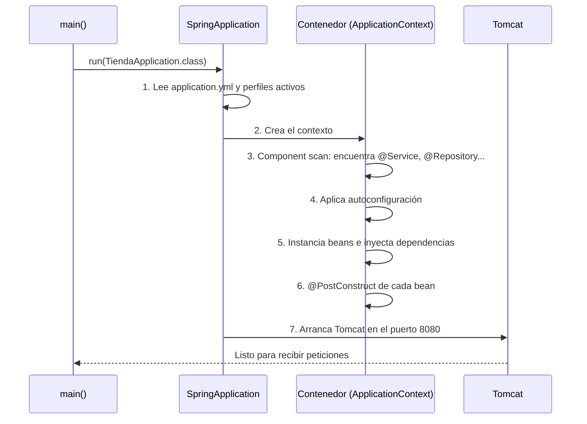
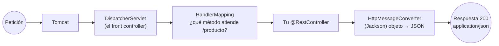

# Spring Boot: qué es y cómo funciona por dentro

> Spring es el estándar del backend Java. Esta página no se queda en "añade la anotación": explica **qué hace el framework por debajo**, porque en cuanto algo falle vas a necesitar saberlo.

## 1. El problema que resuelve

Recuerda tu `Servidor.java` de la UT1: creabas el servidor, gestionabas rutas a mano, escribías cabeceras y convertías objetos a texto. Para una aplicación real necesitarías además inyección de dependencias, acceso a BD, transacciones, seguridad, validación, configuración por entornos, métricas, tests…

| Sin framework | Con Spring Boot |
|---|---|
| Creas y configuras el servidor | Tomcat **embebido**, arranca solo |
| Rutas y parseo manual | `@GetMapping("/productos/{id}")` |
| Conviertes objetos a JSON a mano | Automático (Jackson) |
| Instancias y conectas clases con `new` | **Inyección de dependencias** |
| Configuración a mano | `application.yml` + perfiles |
| Sin métricas ni diagnóstico | Actuator |

## 2. Spring Framework vs. Spring Boot

- Spring Framework
    es el núcleo: el contenedor de beans, la inyección de dependencias, Spring MVC, transacciones. Potentísimo, pero históricamente pedía mucha configuración.
- Spring Boot es una capa encima que aplica convention over configuration. Tres mecanismos:

**a) Starters.** Dependencias agrupadas y con versiones compatibles entre sí:

| Starter | Qué trae |
|---|---|
| `spring-boot-starter-web` | Spring MVC + Tomcat embebido + Jackson |
| `spring-boot-starter-validation` | Bean Validation (Hibernate Validator) |
| `spring-boot-starter-data-jpa` | JPA + Hibernate + pool de conexiones (UT7) |
| `spring-boot-starter-security` | Spring Security |
| `spring-boot-starter-test` | JUnit 5 + Mockito + AssertJ + MockMvc |
| `spring-boot-starter-actuator` | Métricas y endpoints de diagnóstico |

**b) Autoconfiguración.** Spring examina qué hay en el *classpath* y configura por ti. La regla mental: *"si ve Jackson, configura JSON; si ve H2 y no hay `DataSource`, crea una BD en memoria"*. Todas esas decisiones son **condicionales** (`@ConditionalOnClass`, `@ConditionalOnMissingBean`): en cuanto tú defines un bean propio, el automático se aparta.

**c) Servidor embebido.** El `.jar` lleva Tomcat dentro y se ejecuta con `java -jar app.jar`. Aquí encaja la distinción de la UT1: Tomcat es el **servidor de aplicaciones**, y en producción pondrás Nginx delante.

!!! tip "Ver la autoconfiguración en acción"
    Arranca con `--debug` y Spring imprime el **informe de autoconfiguración**: qué se activó (*Positive matches*) y qué no y por qué (*Negative matches*). Cuando algo "mágicamente no funciona", ese informe suele tener la respuesta.

## 3. Crear el proyecto

En [start.spring.io](https://start.spring.io): Maven · Java **25** · Group `es.iesx.daw` · Artifact `tienda` · Dependencias **Spring Web**, **Validation**, **DevTools**.

El `pom.xml` que genera, comentado:

```
<parent>                                    <!-- fija versiones compatibles de TODO -->
    <groupId>org.springframework.boot</groupId>
    <artifactId>spring-boot-starter-parent</artifactId>
    <version>3.4.x</version>
</parent>

<properties>
    <java.version>25</java.version>
</properties>

<dependencies>
    <dependency>                            <!-- sin <version>: la pone el parent -->
        <groupId>org.springframework.boot</groupId>
        <artifactId>spring-boot-starter-web</artifactId>
    </dependency>
    <dependency>
        <groupId>org.springframework.boot</groupId>
        <artifactId>spring-boot-starter-validation</artifactId>
    </dependency>
    <dependency>
        <groupId>org.springframework.boot</groupId>
        <artifactId>spring-boot-devtools</artifactId>
        <scope>runtime</scope><optional>true</optional>
    </dependency>
</dependencies>

<build><plugins>
    <plugin>                                <!-- genera el jar ejecutable -->
        <groupId>org.springframework.boot</groupId>
        <artifactId>spring-boot-maven-plugin</artifactId>
    </plugin>
</plugins></build>
```

**Comandos que usarás a diario:**

```bash
mvn spring-boot:run                 # arrancar en desarrollo
mvn clean package                   # generar target/tienda-0.0.1-SNAPSHOT.jar
java -jar target/tienda-*.jar       # ejecutar el jar (así va a producción)
mvn dependency:tree                 # ver de dónde sale cada librería
```

## 4. Estructura y el paquete raíz

``` { .text .sinajuste }
src/main/java/es/iesx/daw/tienda/
├── TiendaApplication.java        ← clase principal, EN LA RAÍZ del paquete
├── controlador/
├── servicio/
├── repositorio/
├── modelo/
├── dto/
├── excepcion/
└── config/
src/main/resources/
├── application.yml
├── static/                       ← css, js, imágenes (se sirven tal cual)
└── templates/                    ← plantillas Thymeleaf (T2)
```

```java
@SpringBootApplication
public class TiendaApplication {
    public static void main(String[] args) {
        SpringApplication.run(TiendaApplication.class, args);
    }
}
```

`@SpringBootApplication` es la suma de tres:

| Anotación | Qué hace |
|---|---|
| `@Configuration` | Esta clase puede declarar beans |
| `@EnableAutoConfiguration` | Activa la autoconfiguración |
| `@ComponentScan` | **Escanea este paquete y sus subpaquetes** buscando componentes |

:material-alert: Ese `@ComponentScan` explica el error nº 1 de los primeros días: una clase anotada **fuera** del paquete raíz es invisible para Spring (404 o "bean no encontrado").

## 5. Qué ocurre al arrancar



Léelo bien: **todos los beans se crean al arrancar**, no en cada petición. Si un bean no se puede construir (falta una dependencia), la aplicación **no arranca** — y eso es bueno: es mejor fallar en el arranque que a las tres de la mañana con un usuario delante.

## 6. Tu primer endpoint y el viaje de una petición

``` { .java .numerado }
package es.iesx.daw.tienda.controlador;

import org.springframework.web.bind.annotation.*;
import java.time.LocalTime;

@RestController
public class SaludoControlador {

    @GetMapping("/saludo")
    public String saludo() {
        return "Hola DAW2, son las " + LocalTime.now();
    }

    @GetMapping("/saludo/{nombre}")
    public String personal(@PathVariable String nombre,
                           @RequestParam(defaultValue = "es") String idioma) {
        return idioma.equals("en") ? "Hello, " + nombre : "Hola, " + nombre;
    }

    @GetMapping("/producto")
    public Producto producto() {          // devolver un objeto → JSON automático
        return new Producto(1, "Patinete", 120.0);
    }
}
```

**Qué pasa cuando llega `GET /producto`:**



El **`DispatcherServlet`** es el corazón de Spring MVC: un único servlet que recibe todo y reparte. Ese nombre te sonará en las trazas de error, así que conviene saber qué es.

!!! info "DevTools: recarga automática"
    Con `spring-boot-devtools` en el classpath, al guardar un `.java` la aplicación se **reinicia sola** en 1-2 segundos (recarga solo tus clases, no las librerías). Ahorra horas a lo largo del curso.

---

## Pruébalo ahora (25 min)

!!! reto "Trabaja tú ahora"
    Este bloque se hace **en clase, en tu equipo**. No se entrega ni puntúa: es la práctica que hace que el examen te salga.

1. Crea el proyecto en Initializr y arráncalo. Localiza en el log: la versión de Spring, el puerto y Started TiendaApplication in X seconds.
2. Crea el paquete controlador con `SaludoControlador` y prueba los tres endpoints:

```bash
curl -i localhost:8080/saludo
curl -i "localhost:8080/saludo/Ana?idioma=en"
curl -i localhost:8080/producto        # fíjate en el Content-Type: application/json
```

1. **Experimento del component scan:** mueve `SaludoControlador` a un paquete hermano (`es.iesx.daw.otro`), reinicia y llama al endpoint → **404**. Devuélvelo a su sitio → funciona. Ya no volverás a caer.
2. **Mira la autoconfiguración:** arranca con `mvn spring-boot:run -Dspring-boot.run.arguments=--debug` y busca en la salida `JacksonAutoConfiguration` y `DispatcherServletAutoConfiguration` en los *Positive matches*.
3. **Genera el jar y ejecútalo como en producción:**
    ```bash
    mvn clean package -DskipTests
    java -jar target/tienda-0.0.1-SNAPSHOT.jar --server.port=9090
    curl localhost:9090/saludo
    ```
    Ese `.jar` de ~20 MB lleva **tu código, todas las librerías y el servidor**. Eso es lo que subirías a un servidor o meterías en un contenedor Docker.

---

## Ejercicios (con solución)

### Ejercicio 1 — Anota lo que hace cada pieza

Explica: `@SpringBootApplication`, `DispatcherServlet`, *starter*, autoconfiguración, servidor embebido.

??? success "Solución"

    `@SpringBootApplication`: configuración + autoconfiguración + escaneo del paquete raíz. `DispatcherServlet`: el servlet único que recibe todas las peticiones y las reparte al controlador adecuado. Starter: grupo de dependencias compatibles para una funcionalidad. Autoconfiguración: Spring configura componentes según lo que encuentra en el classpath, siempre que tú no lo hayas hecho ya. Servidor embebido: Tomcat va dentro del jar; se ejecuta con `java -jar` sin instalar nada.


### Ejercicio 2 — El endpoint da 404

Has creado `PedidoControlador` en `es.iesx.daw.web.PedidoControlador`, y la aplicación principal está en `es.iesx.daw.tienda`. ¿Por qué falla y cómo lo arreglas sin mover la clase?

??? success "Solución"

    El escaneo solo alcanza `es.iesx.daw.tienda` y sus subpaquetes. Lo normal es mover la clase. Si por algún motivo no puedes, se amplía el escaneo:
    ```java
    @SpringBootApplication(scanBasePackages = {"es.iesx.daw.tienda", "es.iesx.daw.web"})
    ```

    (Preferible mover: mantener todo bajo el paquete raíz es la convención.)


### Ejercicio 3 — Amplía el controlador

Añade: `GET /calculadora/suma?a=5&b=3` que devuelva la suma, y `GET /eco/{texto}` que devuelva el texto en mayúsculas y su longitud en un record.

??? success "Solución"

    ```java
    record EcoDto(String original, String mayusculas, int longitud) {}

    @GetMapping("/calculadora/suma")
    public int suma(@RequestParam int a, @RequestParam int b) { return a + b; }

    @GetMapping("/eco/{texto}")
    public EcoDto eco(@PathVariable String texto) {
        return new EcoDto(texto, texto.toUpperCase(), texto.length());
    }
    ```

    Prueba?a=hola: Spring devuelve `400` solo, porque no puede convertir el texto a int.


### Ejercicio 4 — Lee el arranque

Arranca la aplicación y responde: ¿cuántos milisegundos tarda? ¿qué versión de Tomcat usa? ¿qué perfil está activo?

??? success "Solución"

    Todo está en el log de arranque: Tomcat initialized with port 8080 (http), Tomcat started on port 8080, Started TiendaApplication in 1.842 seconds. Si no hay perfil activo verás No active profile set, falling back to 1 default profile: "default". Saber leer ese log es diagnóstico básico.

