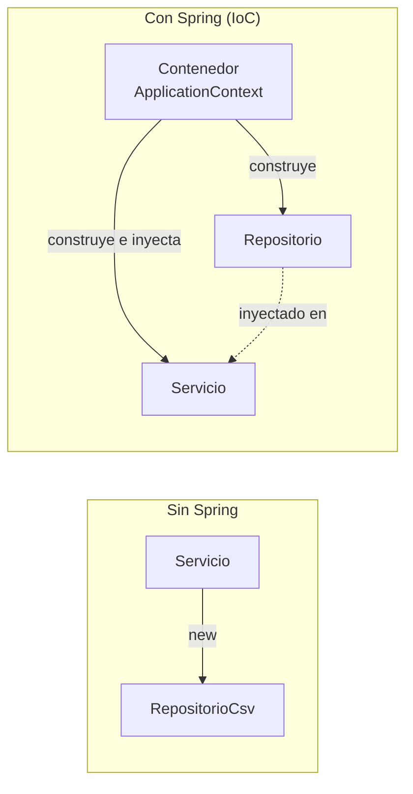

# Inyección de dependencias y el contenedor

> Si entiendes esta página, entiendes Spring. Todo lo demás son detalles y anotaciones.

## 1. El problema, con tu propio código

!!! analogia "Analogía"
    Un enchufe no fabrica la electricidad: la **recibe**. Y por eso puedes mover la lámpara de habitación sin rehacer la instalación. Una clase que hace `new` de sus dependencias es una lámpara soldada a la pared: funciona, pero no la puedes probar en otro sitio ni cambiarle la bombilla.

En la UT3 tu servicio hacía esto:

```java
public class ProductoServicio {
    private final ProductoRepositorio repo = new ProductoRepositorioCsv(Path.of("datos.csv"));
}
```

Tres consecuencias, todas malas: el servicio **decide** qué implementación usa (acoplamiento), no puedes cambiarla sin editarlo, y **no puedes testearlo** sin tocar el disco. La solución fue pasar la dependencia por constructor. Eso es **inyección de dependencias**. Lo que aporta Spring es **quién** construye y conecta todo: el **contenedor**.

## 2. IoC: quién manda



**Inversión de control**: el control de crear objetos pasa de tu código al framework. Al arrancar, el contenedor:

1. Escanea el paquete raíz buscando `@Component` y sus especializaciones.
2. Crea la definición de cada bean (aún no el objeto): nombre, tipo, dependencias, ámbito.
3. Ordena
    las dependencias y las instancia en el orden correcto.
4. Inyecta
    cada dependencia en su sitio.
5. Ejecuta los `@PostConstruct`.

El resultado es un grafo de objetos vivos, listos antes de que llegue la primera petición.

## 3. Estereotipos

```java
@Component      // genérico
@Service        // capa de negocio
@Repository     // capa de datos (+ traduce excepciones de acceso a datos)
@RestController // capa web para APIs (@Controller + @ResponseBody)
@Controller     // capa web para vistas HTML (T2 con Thymeleaf)
@Configuration  // clase que declara beans con @Bean
```

Todas son `@Component` por debajo. Usar la específica **documenta la capa** y, en el caso de `@Repository`, añade comportamiento real (traducción de excepciones).

**El nombre del bean** es el de la clase en minúscula inicial: `ProductoServicio` → bean `productoServicio`. Importa cuando hay varios candidatos.

## 4. Las tres formas de inyectar (y cuál usar)

``` { .java .numerado }
// BIEN CONSTRUCTOR — la única correcta
@Service
public class ProductoServicio {
    private final ProductoRepositorio repositorio;      // final: inmutable
    private final TiendaConfig config;

    public ProductoServicio(ProductoRepositorio repositorio, TiendaConfig config) {
        this.repositorio = repositorio;
        this.config = config;
    }
}

// MAL  CAMPO — cómoda y problemática
@Service
public class MalServicio {
    @Autowired private ProductoRepositorio repositorio;   // no puede ser final
}

// OJO SETTER — solo para dependencias realmente opcionales
@Autowired(required = false)
public void setNotificador(Notificador n) { this.notificador = n; }
```

|  | Constructor :material-check: | Campo :material-close: |
|---|---|---|
| ¿Permite `final`? | Sí | No |
| ¿Objeto siempre completo? | Sí | No (puede existir a medias) |
| ¿Testeable con `new`? | **Sí** | No, necesitas Spring o reflexión |
| ¿Se ven las dependencias? | Sí, en la firma | Escondidas por la clase |
| ¿Avisa si hay demasiadas? | Sí: un constructor de 8 parámetros canta | No, se acumulan sin ruido |

!!! success "La prueba del algodón"
    Si puedes escribir esto en un test, tu diseño es correcto:

    ```java
    var servicio = new ProductoServicio(new RepositorioFalso(), config);
    ```

    Con un solo constructor `@Autowired` es opcional: Spring lo usa automáticamente. Por eso el código moderno de Spring apenas tiene esa anotación.

## 5. Resolver ambigüedades

Con dos implementaciones de la misma interfaz, Spring falla al arrancar:

```
Parameter 0 of constructor required a single bean, but 2 were found:
    productoRepositorioCsv, productoRepositorioJson
```

Cuatro herramientas, de menos a más específica:

```java
// (a) @Primary — el favorito por defecto
@Repository @Primary
public class ProductoRepositorioJson implements ProductoRepositorio { }

// (b) @Qualifier — elegir por nombre en el punto de inyección
public ProductoServicio(@Qualifier("productoRepositorioCsv") ProductoRepositorio r) { }

// (c) @Profile — según el entorno activo
@Repository @Profile("dev")  public class RepoMemoria implements ProductoRepositorio { }
@Repository @Profile("prod") public class RepoBd      implements ProductoRepositorio { }

// (d) @ConditionalOnProperty — según una propiedad de configuración
@Repository
@ConditionalOnProperty(name = "tienda.almacen", havingValue = "json")
public class RepoJson implements ProductoRepositorio { }
```

**Inyectar todas las implementaciones a la vez** es un patrón potentísimo:

```java
@Service
public class NotificacionServicio {
    // Spring inyecta TODOS los beans Notificador
    private final List<Notificador> canales;

    public NotificacionServicio(List<Notificador> canales) { this.canales = canales; }

    public void avisar(String mensaje) {
        // email + SMS + push, sin tocar esta clase
        canales.forEach(c -> c.enviar(mensaje));
    }
}
```

Añadir un canal nuevo = crear una clase con `@Component`. **Cero cambios aquí**: eso es OCP de SOLID funcionando de verdad.

## 6. Ámbitos y ciclo de vida

```java
@Service                                   // singleton (por defecto)
@Scope("prototype")                        // una instancia nueva en cada inyección
@Scope("request")                          // una por petición HTTP
@Scope("session")                          // una por sesión de usuario
```

**El 95 % de tus beans son singleton**, y eso tiene una consecuencia crítica:

!!! danger "Los beans singleton deben ser *stateless*"
    Un singleton lo comparten **todas las peticiones a la vez**. Si guardas estado mutable en un campo, dos usuarios simultáneos se pisarán los datos:

    ```java
    @Service
    public class CarritoServicio {
        // PELIGRO: compartido por todos
        private List<Producto> carrito = new ArrayList<>();
    }
    ```

    Es exactamente el problema del contador de la UT1 con dos instancias, pero dentro de un mismo proceso. El estado va en la base de datos, la sesión o como parámetro del método.

**Ciclo de vida** de un bean:

```java
@Service
public class CatalogoServicio {

    // 1. constructor + inyección
    public CatalogoServicio(ProductoRepositorio repo) { ... }

    @PostConstruct
    void inicializar() {                                        // 2. tras construirse
        log.info("Precargando catálogo…");
    }

    @PreDestroy
    void liberar() {                                            // 3. al apagar la app
        log.info("Cerrando recursos…");
    }
}
```

## 7. Beans con `@Bean` (para clases que no son tuyas)

No puedes anotar una clase de una librería externa. Para eso están las clases de configuración:

```java
@Configuration
public class AppConfig {

    @Bean
    public RestClient restClient() {  // el nombre del método = nombre del bean
        return RestClient.builder()
            .baseUrl("https://api.externa.com")
            .build();
    }

    @Bean
    public ObjectMapper objectMapper() {
        return new ObjectMapper()
            .registerModule(new JavaTimeModule())
            .configure(DeserializationFeature.FAIL_ON_UNKNOWN_PROPERTIES, false);
    }
}
```

`@Component` es para **tus** clases; `@Bean` para **objetos de terceros** o que necesitan construcción a medida.

---

## Pruébalo ahora (30 min)

!!! reto "Trabaja tú ahora"
    Este bloque se hace **en clase, en tu equipo**. No se entrega ni puntúa: es la práctica que hace que el examen te salga.

**Parte 1 — Las tres capas conectadas.** Crea el modelo, la interfaz, la implementación en memoria, el servicio y el controlador:

``` { .java .numerado title="modelo/Producto.java" }
public record Producto(Integer id, String nombre, String categoria, double precio, int stock) {}

// repositorio/ProductoRepositorio.java
public interface ProductoRepositorio {
    List<Producto> buscarTodos();
    Optional<Producto> buscarPorId(Integer id);
    Producto guardar(Producto p);
    boolean borrar(Integer id);
}

// repositorio/ProductoRepositorioMemoria.java
@Repository
public class ProductoRepositorioMemoria implements ProductoRepositorio {
    private static final Logger log = LoggerFactory.getLogger(ProductoRepositorioMemoria.class);
    private final Map<Integer, Producto> datos = new ConcurrentHashMap<>();
    private final AtomicInteger seq = new AtomicInteger();

    @PostConstruct
    void init() {
        guardar(new Producto(null, "Patinete", "movilidad", 120.0, 8));
        guardar(new Producto(null, "Casco", "seguridad", 35.0, 40));
        log.info("Repositorio en memoria listo con {} productos", datos.size());
    }

    @Override public List<Producto> buscarTodos() { return List.copyOf(datos.values()); }
    @Override public Optional<Producto> buscarPorId(Integer id) { return Optional.ofNullable(datos.get(id)); }
    @Override public Producto guardar(Producto p) {
        var id = p.id() == null ? seq.incrementAndGet() : p.id();
        var g = new Producto(id, p.nombre(), p.categoria(), p.precio(), p.stock());
        datos.put(id, g);
        return g;
    }
    @Override public boolean borrar(Integer id) { return datos.remove(id) != null; }
}

// servicio/ProductoServicio.java
@Service
public class ProductoServicio {
    private final ProductoRepositorio repositorio;
    public ProductoServicio(ProductoRepositorio repositorio) { this.repositorio = repositorio; }

    public List<Producto> listar() { return repositorio.buscarTodos(); }
    public double precioConIva(Integer id) {
        return repositorio.buscarPorId(id).map(p -> p.precio() * 1.21)
            .orElseThrow(() -> new IllegalArgumentException("No existe " + id));
    }
}

// controlador/ProductoControlador.java
@RestController
@RequestMapping("/api/productos")
public class ProductoControlador {
    private final ProductoServicio servicio;
    public ProductoControlador(ProductoServicio servicio) { this.servicio = servicio; }

    @GetMapping public List<Producto> listar() { return servicio.listar(); }
    @GetMapping("/{id}/precio-iva") public double iva(@PathVariable Integer id) {
        return servicio.precioConIva(id);
    }
}
```

En ningún sitio has escrito `new ProductoServicio(...)`. Compara con el `main` de la UT3, donde lo montabas a mano.

**Parte 2 — Ver los beans del contenedor.** Añade esto temporalmente a tu clase principal:

```java
@Bean
CommandLineRunner listarBeans(ApplicationContext ctx) {
    return args -> {
        var mios = Arrays.stream(ctx.getBeanDefinitionNames())
            .filter(n -> n.toLowerCase().contains("producto"))
            .sorted().toList();
        System.out.println("Mis beans: " + mios);
        System.out.println("Total de beans en el contexto: " + ctx.getBeanDefinitionCount());
    };
}
```

Verás tus tres beans **y unos 150 más** que Spring ha creado por autoconfiguración.

**Parte 3 — Provoca y arregla el error de ambigüedad.** Crea `ProductoRepositorioMemoriaAlternativo` con `@Repository` y otros datos. Arranca → error de bean duplicado. Arréglalo de **dos formas** distintas (`@Primary` y luego `@Qualifier`) y comprueba con qué datos responde la API en cada caso.

**Parte 4 — Demuestra el peligro del singleton.** Añade a tu servicio un campo mutable y compruébalo:

```java
private int contadorLlamadas = 0;   // PELIGRO: estado mutable en un singleton
public List<Producto> listar() {
    contadorLlamadas++;
    log.info("Llamada número {}", contadorLlamadas);
    return repositorio.buscarTodos();
}
```

Llama al endpoint varias veces: el contador

sigue subiendo entre peticiones

porque el bean es el mismo objeto. Ahora imagina que en vez de un contador fuera "el carrito del usuario actual".

---

## Ejercicios (con solución)

### Ejercicio 1 — Corrige la inyección

```java
@Service
public class PedidoServicio {
    @Autowired private PedidoRepositorioBd repositorio;
    @Autowired private EmailServicio email;
}
```

??? success "Solución"

    Dos problemas: inyección por campo (no permite final, imposible de testear con new) y dependencia de la clase concreta en vez de la interfaz. Correcto:
    ```java
    @Service
    public class PedidoServicio {
        private final PedidoRepositorio repositorio;
        private final EmailServicio email;

        public PedidoServicio(PedidoRepositorio repositorio, EmailServicio email) {
            this.repositorio = repositorio;
            this.email = email;
        }
    }
    ```


### Ejercicio 2 — Interpreta el error

```
APPLICATION FAILED TO START
Parameter 1 of constructor in ProductoServicio required a bean of type
'TiendaConfig' that could not be found.
```

Da tres causas posibles.

??? success "Solución"

    (1) La clase `TiendaConfig` no está anotada (le falta `@Component` / `@ConfigurationProperties` + `@EnableConfigurationProperties`). (2) Está anotada pero fuera del paquete raíz, así que el escaneo no la ve. (3) Es un bean `@Profile` y ese perfil no está activo.


### Ejercicio 3 — Múltiples implementaciones

Tienes `NotificadorEmail`, `NotificadorSms` y `NotificadorPush`. Quieres que al confirmar un pedido se envíen **los tres**, y poder añadir un cuarto sin tocar el servicio.

??? success "Solución"

    ```java
    @Service
    public class PedidoServicio {
        private final List<Notificador> notificadores;
        public PedidoServicio(List<Notificador> notificadores) { this.notificadores = notificadores; }

        public void confirmar(Pedido p) {
            notificadores.forEach(n -> n.enviar("Pedido " + p.id() + " confirmado"));
        }
    }
    ```

    Spring inyecta la lista con todos los beans que implementan la interfaz. Añadir `NotificadorTelegram` con `@Component` basta: cero cambios en el servicio.


### Ejercicio 4 — Caza el bug de concurrencia

```bash
@Service
public class ImportadorServicio {
    private List<String> errores = new ArrayList<>();

    public Resultado importar(List<Fila> filas) {
        errores.clear();
        for (var f : filas) if (!valido(f)) errores.add("Fila " + f.num());
        return new Resultado(filas.size(), errores);
    }
}
```

??? success "Solución"

    El bean es singleton y errores es estado mutable compartido. Con dos usuarios importando a la vez, uno hace `clear()` mientras el otro escribe: resultados mezclados o `ConcurrentModificationException`. Solución: que la lista sea local al método:
    ```bash
    public Resultado importar(List<Fila> filas) {
        var errores = new ArrayList<String>();          // local: una por llamada
        for (var f : filas) if (!valido(f)) errores.add("Fila " + f.num());
        return new Resultado(filas.size(), errores);
    }
    ```


### Ejercicio 5 — `@Component` o `@Bean`

¿Cómo registrarías: (a) tu `ProductoServicio` · (b) un `ObjectMapper` configurado · (c) un `RestClient` con URL base · (d) tu `ProductoMapeador`?

??? success "Solución"

    (a) y (d): anotación en la clase (`@Service`, `@Component`) porque son tuyas. (b) y (c): `@Bean` en una clase `@Configuration`, porque son clases de librerías que necesitas configurar.

