# 2. Spring Web REST

!!! quote "Autoría del material"
    Este tema es una **adaptación del material de [José Luis González Sánchez](https://github.com/joseluisgs)**, concretamente del archivo `springboot/04-SpringWebRest.md` del repositorio [DesarrolloWebEntornosServidor-02-2025-2026](https://github.com/joseluisgs/DesarrolloWebEntornosServidor-02-2025-2026).

    Publicado bajo licencia [Creative Commons Reconocimiento-NoComercial-CompartirIgual 4.0](http://creativecommons.org/licenses/by-nc-sa/4.0/). Se conservan el texto, los diagramas y los ejemplos originales. **Adaptaciones de este curso:** el original usa Gradle con Kotlin DSL y Java 17; aquí los ejemplos de construcción van **en pestañas Maven / Gradle** y el proyecto del módulo es **Maven con Java 25**, que es lo que se evalúa.

!!! note "Nota del Profesor"
    Este es el tema más importante del módulo. Aquí aprendemos a crear APIs REST reales con Spring Boot.

!!! tip "Tip del Examinador"
    En el examen suelen pedir crear un controlador REST con operaciones CRUD. ¡Practica mucho este tema!

---

## 2.1. Spring Web

**Spring Web MVC** es un módulo del framework [Spring](https://spring.io/projects/spring-boot) que proporciona un marco para desarrollar aplicaciones web y servicios RESTful. Se basa en el patrón de diseño Modelo-Vista-Controlador (MVC), que es un patrón comúnmente utilizado en el desarrollo de interfaces de usuario.

Aquí está cómo funciona Spring Web MVC en términos del patrón MVC:

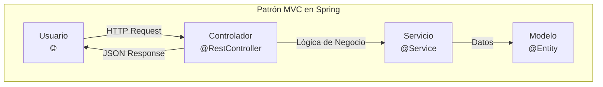

1. **Modelo**: El modelo representa los datos y las reglas de negocio de la aplicación. En Spring MVC, los modelos son a menudo objetos POJO (Plain Old Java Objects) que se pasan entre vistas y controladores.

2. **Vista**: La vista es responsable de renderizar el modelo en una forma que el usuario pueda entender (por ejemplo, HTML). Spring MVC soporta una variedad de tecnologías de vista, incluyendo JSP, Thymeleaf, FreeMarker y más.

!!! note "Nota del Profesor"
    En APIs REST con `@RestController`, la "vista" es el JSON que enviamos. No necesitamos Thymeleaf ni JSP.

3. **Controlador**: El controlador maneja las solicitudes del usuario y actualiza el modelo correspondiente. En Spring MVC, los controladores son clases anotadas con `@Controller` o `@RestController`.

El módulo Spring Web MVC proporciona una gran cantidad de funcionalidades para el desarrollo de aplicaciones web, incluyendo:

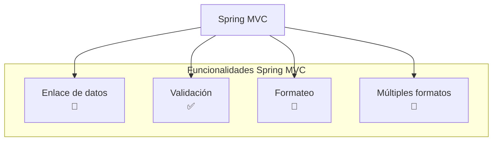

- Enlace de datos: Spring MVC puede enlazar automáticamente los parámetros de la solicitud a los parámetros del método del controlador, lo que facilita la manipulación de los datos de la solicitud.

- Validación: Spring MVC soporta la validación de los datos del modelo utilizando el API de Validación de Bean de Java.

- Formateo de datos: Spring MVC puede convertir automáticamente entre strings y tipos de datos más complejos.

- Manejo de excepciones: Spring MVC proporciona un mecanismo robusto para manejar excepciones.

- Soporte para la generación de respuestas en varios formatos, como JSON y XML.

**Spring Web** es un término más general que se refiere a todas las funcionalidades de Spring relacionadas con el desarrollo web, incluyendo Spring MVC, pero también otras como Spring WebFlux para programación reactiva, Spring Web Services para SOAP, entre otras.

!!! tip "Tip del Examinador"
    Spring Web ≠ Spring MVC. Spring Web es más amplio e incluye MVC y más.

En resumen, Spring MVC es una parte integral de la mayoría de las aplicaciones web basadas en Spring, proporcionando un marco robusto y flexible para el manejo de las interacciones web.

---

## 2.2. Creando un proyecto

Podemos crear un proyecto Spring Boot usando el plugin de IntelliJ o desde su web. Con estos [asistentes](https://start.spring.io/) podemos crear un proyecto Spring con las opciones que queramos y descargarlo, fijando su filosofía (tradicional o reactiva), el lenguaje, las dependencias, etc.


Para nuestro proyecto deberemos usar las siguientes dependencias:

- Usaremos lenguaje Java, **JVM Java 25 (LTS)** e IntelliJ
- **Maven** y packaging `jar`
- Spring Boot versión 3.5.x
- Starters y dependencias:
    - **Spring Web**: nos permite crear aplicaciones web de forma rápida y sencilla, no reactiva

!!! note "Nota del Profesor"
    El original del autor usa Java 17 porque es LTS y tiene características modernas como records y pattern matching. **En este curso usamos Java 25**, que es el LTS actual y el que hemos usado en la UT2 y la UT3: records, `switch` con patrones, `sealed` y bloques de texto siguen estando, y hay más.

Posteriormente podemos añadir las dependencias que necesitemos, por ejemplo para usar una base de datos, seguridad, testing u otras librerías (Lombok, etc.).

!!! warning "Advertencia"
    ¡Cuidado con las versiones! Spring Boot 3.x requiere Java 17+. No intentes usar Java 11 con Spring Boot 3.

Si se nos olvida alguna dependencia, podemos añadirla posteriormente desde el fichero `pom.xml` o `build.gradle.kts` sin problemas.

### 2.2.1. Starters

En Spring Boot, los "starters" son dependencias preconfiguradas que facilitan la incorporación de tecnologías y funcionalidades específicas en tu aplicación. Estas dependencias incluyen todas las bibliotecas y configuraciones necesarias para trabajar con una tecnología o funcionalidad en particular, lo que te permite comenzar rápidamente sin tener que configurar todo manualmente.

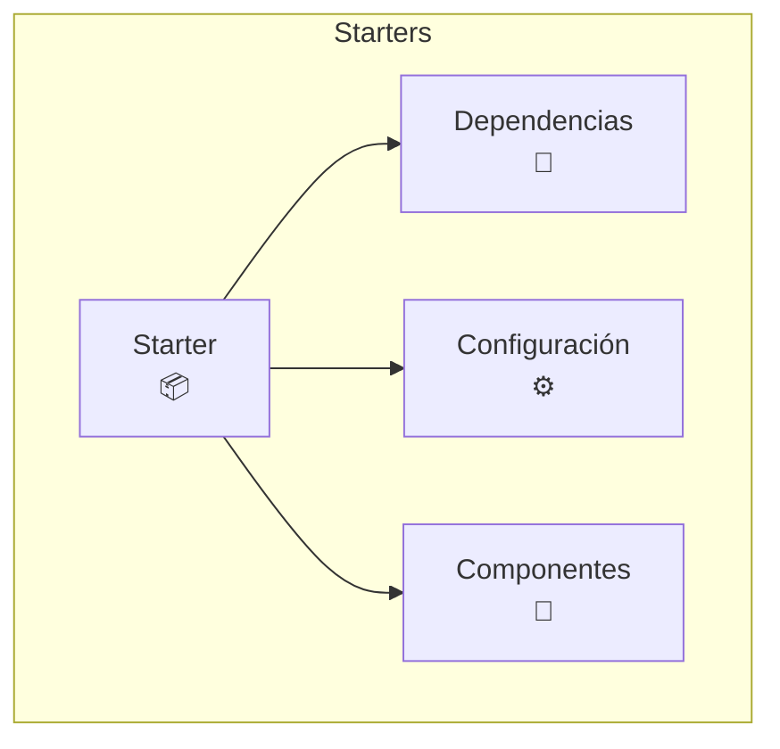

Los starters están diseñados para simplificar el proceso de desarrollo en Spring Boot al proporcionar un conjunto coherente de dependencias y configuraciones para casos de uso comunes. Cada starter se enfoca en una tecnología o funcionalidad específica, como bases de datos, seguridad, servicios web, etc.

Cuando agregas un starter a tu proyecto Spring Boot, automáticamente se incluyen todas las dependencias necesarias en tu aplicación. Además, se configuran las configuraciones predeterminadas y se activan los componentes relevantes para la tecnología o funcionalidad específica. Esto te ahorra tiempo y esfuerzo al no tener que buscar y configurar manualmente las dependencias y configuraciones correctas.

Por ejemplo, si deseas trabajar con una base de datos MySQL en tu aplicación Spring Boot, puedes agregar el starter `spring-boot-starter-data-jpa` a tu proyecto. Esto incluirá las dependencias necesarias para trabajar con JPA (Java Persistence API) y MySQL, y configurará automáticamente la conexión a la base de datos y otros aspectos relacionados.

=== "Maven (lo que usamos)"

    ```xml
    <dependencies>
      <!-- Starter de Spring Web, para apps HTML y REST -->
      <dependency>
        <groupId>org.springframework.boot</groupId>
        <artifactId>spring-boot-starter-web</artifactId>
      </dependency>

      <!-- Starter para test -->
      <dependency>
        <groupId>org.springframework.boot</groupId>
        <artifactId>spring-boot-starter-test</artifactId>
        <scope>test</scope>
      </dependency>
    </dependencies>
    ```

    Fíjate en que **no hay versiones**: las pone el `spring-boot-starter-parent`, y por eso todas las librerías de Spring que entran son compatibles entre sí.

=== "Gradle (el original)"

    ```kotlin
    dependencies {
        // Dependencias y starter de Spring Web for HTML Apps y Rest
        implementation("org.springframework.boot:spring-boot-starter-web")

        // Dependencias y starter para Test
        testImplementation("org.springframework.boot:spring-boot-starter-test")
    }
    ```

### 2.2.2. Punto de entrada

El servidor tiene su entrada y configuración en la clase `Application`. Esta lee la configuración en base al fichero de configuración (`./src/main/resources/application.properties`) y a partir de aquí se crea una instancia de la clase principal etiquetada con `@SpringBootApplication`.

```java
@SpringBootApplication
public class TiendaApiSpringApplication {

    public static void main(String[] args) {
        SpringApplication.run(TiendaApiSpringApplication.class, args);
    }

}
```

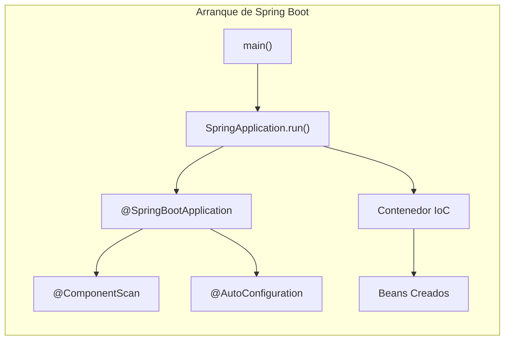

A continuación, te explico cada componente de la clase:

1. `@SpringBootApplication`: Esta anotación es una combinación de varias anotaciones de Spring Boot, incluyendo `@Configuration`, `@EnableAutoConfiguration` y `@ComponentScan`. Esta anotación marca la clase como una clase de configuración de Spring Boot y habilita la configuración automática de la aplicación. Además, escanea los componentes dentro del paquete actual y sus subpaquetes para su detección automática.

2. `public static void main(String[] args)`: Este es el método principal de la aplicación. Es el punto de entrada de la aplicación Spring Boot. Aquí, se llama al método `run` de la clase `SpringApplication` para iniciar la aplicación Spring Boot. El primer argumento (`TiendaApiSpringApplication.class`) especifica la clase principal de la aplicación, y el segundo argumento (`args`) es una matriz de argumentos de línea de comandos que se pueden pasar a la aplicación.

3. `SpringApplication.run(TiendaApiSpringApplication.class, args)`: Este método estático de la clase `SpringApplication` inicia la aplicación Spring Boot. Toma la clase principal de la aplicación y los argumentos de línea de comandos como parámetros. Internamente, este método configura y arranca el entorno de ejecución de Spring Boot, inicializa los componentes de la aplicación y comienza a escuchar las solicitudes entrantes.

!!! tip "Tip del Examinador"
    `@SpringBootApplication` = `@Configuration` + `@EnableAutoConfiguration` + `@ComponentScan`

!!! danger "Donde está la clase importa"
    `@ComponentScan` escanea **el paquete de esta clase y los de debajo**. Si dejas la clase de arranque en `es.iesx.tienda` y pones un `@Service` en `es.iesx.otro`, Spring no lo encuentra y arrancas con un error de bean que no existe.

    Por eso la clase `Application` va **siempre en el paquete raíz** del proyecto.

Si nosotros queremos hacer algo por consola o antes de todo, dentro del contexto de Spring Boot, debemos implementar `CommandLineRunner` y sobrescribir el método `run`. De esta manera, cuando se inicie la aplicación, se ejecutará el método `run` y podremos hacer lo que queramos. No es obligatorio.

```java
@SpringBootApplication
public class TiendaApiSpringApplication implements CommandLineRunner {

    public static void main(String[] args) {
        SpringApplication.run(TiendaApiSpringApplication.class, args);
    }

    @Override
    public void run(String... args) throws Exception {
        System.out.println("Hola Mundo");
    }
}
```

### 2.2.3. Parametrizando la aplicación

La aplicación está parametrizada en el fichero de configuración `application.properties` (`./src/main/resources/application.properties`) que se encuentra en el directorio `resources`. En este fichero podemos configurar el puerto, el modo de ejecución, etc.

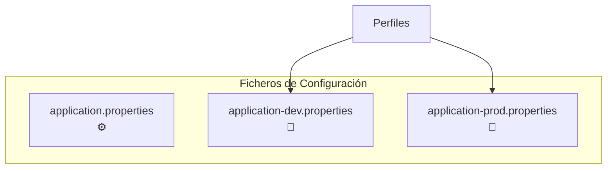

Podemos tener distintos ficheros, por ejemplo para desarrollo y producción:

- Propiedades globales: `src/main/resources/application.properties`
- Propiedades de producción: `src/main/resources/application-prod.properties`
- Propiedades de desarrollo: `src/main/resources/application-dev.properties`

Y luego desde la línea de comandos podemos cargar un perfil concreto de la siguiente manera:

```bash
java -jar -Dspring.profiles.active=prod demo-0.0.1-SNAPSHOT.jar
```

!!! tip "Tip del Examinador"
    En producción NUNCA uses `application.properties` con contraseñas. Usa variables de entorno o secrets.

```properties
server.port=${PORT:3000}
### Compresion de datos
server.compression.enabled=${COMPRESS_ENABLED:true}
server.compression.mime-types=text/html,text/xml,text/plain,text/css,application/json,application/javascript
server.compression.min-response-size=1024
### Configuramos el locale en España
spring.web.locale=es_ES
spring.web.locale-resolver=fixed
### directorio de almacenamiento
upload.root-location=uploads
### Indicamos el perfil por defecto (Base de datos y otros)
#### dev: development. application-dev.properties
#### prod: production. application-prod.properties
spring.profiles.active=dev
```

!!! info "El tema 5 va de esto"
    La sintaxis `${PORT:3000}` —«coge la variable de entorno `PORT`, y si no existe usa `3000`»— es la clave de todo. Está desarrollada en [5. Configuración y variables de entorno](05-configuracion.md), junto con los `.env`.

---

## 2.3. Spring MVC y Spring Web

Spring MVC es el conjunto de librerías que nos permite crear aplicaciones web de forma rápida y sencilla. Spring Web nos permite, mediante su starter, crear un proyecto con las librerías necesarias para crear por ejemplo una API REST, obteniendo todas las librerías y configuración básica para ello; por ejemplo, tener nuestro propio servidor web para gestionar las peticiones.

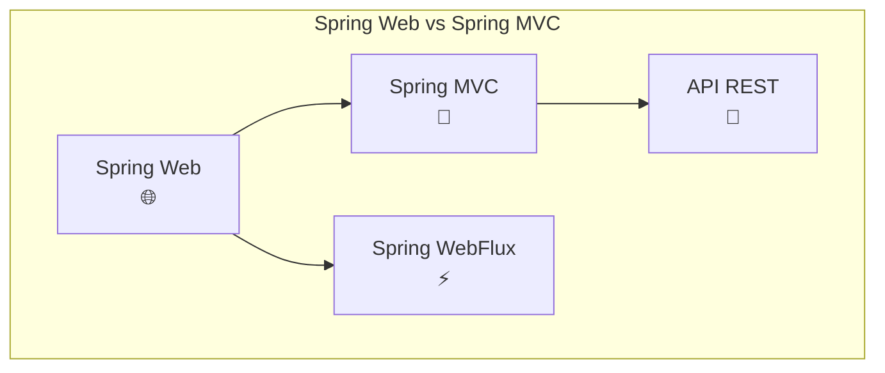

---

## 2.4. Componentes de Spring Boot

Spring Boot nos ofrece una serie de componentes que nos ayudan a crear aplicaciones web de forma rápida y sencilla. Nuestros componentes principales se etiquetarán con `@` para que el framework Spring los reconozca (módulo de inversión de control y posterior inyección de dependencias). Cada uno tiene una misión en nuestra arquitectura:


!!! note "Nota del Profesor"
    Esta arquitectura en capas es fundamental. Controller → Service → Repository es el patrón clásico.

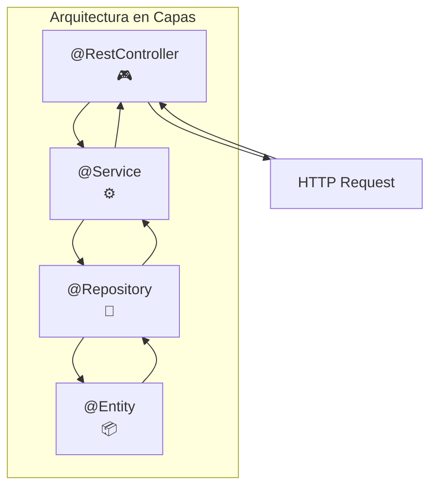

- **Controladores**: Se etiquetan como `@Controller` o, en nuestro caso al ser una API REST, como `@RestController`. Estos son los controladores que se encargan de recibir las peticiones de los usuarios y devolver respuestas, es decir, son anotaciones utilizadas para manejar las solicitudes HTTP en una aplicación web. Hay dos opciones:
    - `@Controller`: Esta anotación se utiliza para marcar una clase como un controlador en Spring MVC. Un controlador en Spring MVC se encarga de manejar las solicitudes HTTP y generar una respuesta, que puede ser una página HTML, una vista, un archivo JSON, etc. Los métodos dentro de una clase anotada con `@Controller` deben devolver una vista o un objeto `ModelAndView` que representa una vista.
    - `@RestController`: Esta anotación combina las anotaciones `@Controller` y `@ResponseBody`. Se utiliza para marcar una clase como un controlador REST en Spring MVC. Un controlador REST maneja las solicitudes HTTP y devuelve directamente objetos JSON, XML o cualquier otro formato de datos en lugar de una vista. Los métodos dentro de una clase anotada con `@RestController` devuelven directamente el objeto que se serializa en la respuesta HTTP.

- **Servicios**: Se etiquetan como `@Service`. Se encargan de implementar la parte de negocio o infraestructura. En nuestro caso puede ser el sistema de almacenamiento o parte de la seguridad y perfiles de usuario.

- **Repositorios**: Se etiquetan como `@Repository` e implementan la interfaz y operaciones de persistencia de la información. En nuestro caso, puede ser una base de datos o una API externa. Podemos extender de repositorios preestablecidos o diseñar el nuestro propio.

- **Configuración**: Se etiquetan como `@Configuration`. Se encargan de configurar los componentes de la aplicación. Se suelen iniciar al comienzo de nuestra aplicación.

- **Bean**: La anotación `@Bean` nos sirve para indicar que este bean será administrado por Spring Boot (Spring Container). La administración de estos beans se realiza mediante anotaciones como `@Configuration`. De esta manera, cuando se pida un objeto y esté anotado como `@Bean`, Spring Boot se encargará de crearlo y devolverlo.

!!! warning "Advertencia"
    `@Bean` se pone en métodos dentro de `@Configuration`. `@Component` se pone en clases directamente.

En definitiva, tratamos de fomentar una estructura de capas.

!!! success "La regla de oro de las capas"
    **Cada capa solo habla con la de abajo, y nunca al revés.**

    | Capa | Sabe de… | No sabe nada de… |
    |---|---|---|
    | `@RestController` | HTTP, códigos de estado, DTOs | SQL, JPA, el nombre de las tablas |
    | `@Service` | Reglas de negocio | HTTP, `ResponseEntity`, `@PathVariable` |
    | `@Repository` | Persistencia | Reglas de negocio |

    El síntoma de que se ha roto: un `ResponseEntity` dentro de un `@Service`, o una consulta SQL dentro de un controlador. Cuando pasa eso, el servicio ya no se puede reutilizar desde un WebSocket (UT6) ni probar sin levantar el servidor.

### 2.4.1. Scope

La anotación `@Scope` en Spring Boot se utiliza para definir el alcance de un componente gestionado por el contenedor de Spring. Permite especificar cómo se crean y se mantienen las instancias de un componente en el contexto de la aplicación.

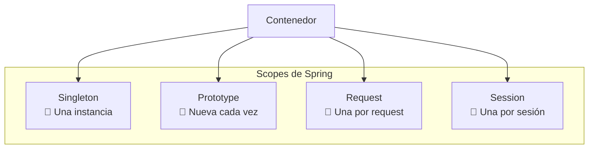

Existen diferentes valores que se pueden asignar a la anotación `@Scope`:

1. **Singleton** (valor por defecto): Indica que solo se creará una única instancia del componente en el contexto de la aplicación. Esta instancia será compartida por todos los hilos y solicitudes que accedan al componente.

2. **Prototype**: Indica que se creará una nueva instancia del componente cada vez que sea solicitado. Cada solicitud obtendrá una instancia independiente del componente.

3. **Request**: Indica que se creará una nueva instancia del componente para cada solicitud web que lo requiera. Cada solicitud obtendrá una instancia independiente del componente.

4. **Session**: Indica que se creará una nueva instancia del componente para cada sesión web. Cada sesión obtendrá una instancia independiente del componente.

5. **GlobalSession**: Similar al alcance de sesión, pero se utiliza en aplicaciones que utilizan el ámbito de sesión global.

!!! tip "Tip del Examinador"
    El 99 % de los casos usarás Singleton. Prototype solo para casos especiales donde necesitas una instancia nueva cada vez.

Para usar la anotación `@Scope`, simplemente se debe colocar encima de la declaración de la clase del componente y especificar el valor del alcance deseado. Por ejemplo:

```java
@Component
@Scope("prototype") // @Scope("singleton")
public class MiComponente {
   // ...
}
```

En este ejemplo, se define un componente llamado `MiComponente` con alcance de prototipo, lo que significa que cada vez que se solicite este componente, se creará una nueva instancia.

Es importante tener en cuenta que el uso adecuado del alcance de los componentes depende de las necesidades específicas de la aplicación. Se debe considerar cuidadosamente el impacto en el rendimiento y la gestión de recursos al elegir el alcance adecuado para cada componente.

### 2.4.2. IoC y DI en Spring Boot

La **Inversión de control** (Inversion of Control, IoC) es un principio de diseño de software en el que el flujo de ejecución de un programa se invierte respecto a los métodos de programación tradicionales. En su lugar, en la inversión de control se especifican respuestas deseadas a sucesos o solicitudes de datos concretas, dejando que algún tipo de entidad o arquitectura externa lleve a cabo las acciones de control que se requieran en el orden necesario.

```mermaid
graph LR
    subgraph "Tradicional vs IoC"
        Tradicional["Tradicional<br/>A crea B"]
        IoC["IoC/DI<br/>Spring crea B"]
    end

    Tradicional -->|new B| B1["B"]
    IoC -->|@Autowired| B2["B"]
    Spring["Spring"] -->|Inyecta| B2
```

La **inyección de dependencias** (Dependency Injection, DI) es un patrón de diseño orientado a objetos en el que se suministran objetos a una clase en lugar de ser la propia clase la que cree dichos objetos. Esos objetos cumplen contratos que necesitan nuestras clases para poder funcionar (de ahí el concepto de dependencia). Nuestras clases no crean los objetos que necesitan, sino que se los suministra otra clase 'contenedora' que inyectará la implementación deseada a nuestro contrato.

!!! note "Nota del Profesor"
    DI es la técnica que implementa IoC. Piensa en ello como "inyectar" las dependencias desde fuera en lugar de "crearlas" dentro.

El contenedor Spring IoC lee el elemento de configuración durante el tiempo de ejecución y luego ensambla el Bean a través de la configuración. La inyección de dependencia de Spring se puede lograr a través del constructor, el método setter y el dominio de entidad. Podemos hacer uso de la anotación **`@Autowired`** para inyectar la dependencia en el contexto requerido.

El contenedor llamará al constructor con parámetros al instanciar el bean, y cada parámetro representa la dependencia que queremos establecer. Spring analizará cada parámetro, primero por tipo, pero cuando sea incierto, luego de acuerdo con el nombre del parámetro.

```java
public class ProductosRestController {
    private final ProductosRepository productosRepository;

    @Autowired
    public ProductosRestController(ProductosRepository productosRepository) {
        this.productosRepository = productosRepository;
    }
}
```

!!! tip "Tip del Examinador"
    Usa inyección por constructor (recomendado). No uses `@Autowired` en campos.

A nivel de setter, Spring primero instancia el Bean y luego llama al método setter que debe inyectarse para lograr la inyección de dependencia. **No recomendado.**

```java
public class ProductosRestController {
    private ProductosRepository productosRepository;

    @Autowired
    public void setProductosRepository(ProductosRepository productosRepository) {
        this.productosRepository = productosRepository;
    }
}
```

!!! warning "Advertencia"
    La inyección por setter es menos común y puede crear objetos en estado inconsistente. Usa constructores.

!!! info "Con un solo constructor, `@Autowired` sobra"
    Desde Spring 4.3, si la clase tiene **un único constructor**, Spring lo usa sin que haya que anotarlo. En el proyecto de la unidad lo escribimos sin `@Autowired`:

    ```java
    @RestController
    public class ProductosRestController {
        private final ProductosService productosService;

        public ProductosRestController(ProductosService productosService) {
            this.productosService = productosService;
        }
    }
    ```

### 2.4.3. Creando rutas

Para crear las rutas vamos a usar un controlador de tipo **`@RestController`**. Este controlador se encargará de recibir las peticiones y devolver las respuestas en el formato por defecto, en este caso JSON. Para ello vamos a usar las anotaciones de Spring Web.

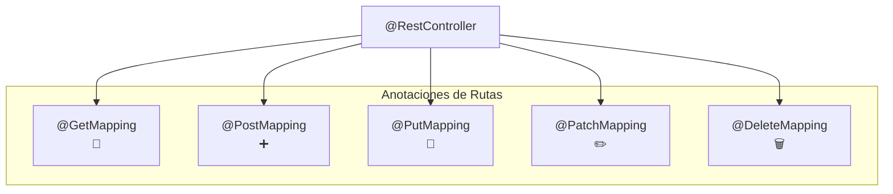

Las peticiones que vamos a recibir seguirán los verbos HTTP que conocemos: GET (`@GetMapping`), POST (`@PostMapping`), PUT (`@PutMapping`), PATCH (`@PatchMapping`) y/o DELETE (`@DeleteMapping`). De esta manera podremos hacer las peticiones CRUD que necesitemos.

Además, podemos usar **`ResponseEntity`** para devolver el código de estado de la respuesta, así como el cuerpo de la misma.

```java
@RestController
@RequestMapping("/api/productos")       // prefijo común a todas las rutas
public class ProductosRestController {
    private final ProductosRepository productosRepository;

    public ProductosRestController(ProductosRepository productosRepository) {
        this.productosRepository = productosRepository;
    }

    @GetMapping
    public ResponseEntity<List<Producto>> getProducts() {
        return ResponseEntity.ok(productosRepository.findAll());
    }

    @GetMapping("/{id}")
    public ResponseEntity<Producto> getProduct(@PathVariable Long id) {
        return productosRepository.findById(id)
                .map(ResponseEntity::ok)
                .orElse(ResponseEntity.notFound().build());
    }

    @PostMapping
    public ResponseEntity<Producto> createProduct(@RequestBody Producto producto) {
        return ResponseEntity.status(HttpStatus.CREATED).body(productosRepository.save(producto));
    }

    @PutMapping("/{id}")
    public ResponseEntity<Producto> updateProduct(@PathVariable Long id, @RequestBody Producto producto) {
        return ResponseEntity.ok(productosRepository.save(producto));
    }

    @DeleteMapping("/{id}")
    public ResponseEntity<Void> deleteProduct(@PathVariable Long id) {
        productosRepository.deleteById(id);
        return ResponseEntity.noContent().build();
    }
}
```

!!! danger "El `.get()` del original es una trampa, y a propósito"
    En el material de referencia aparece así, para que se vea el problema:

    ```java
    return ResponseEntity.ok(productosRepository.findById(id).get());
    ```

    `findById` devuelve un `Optional` (es la UT2, tema 5). Con un id que no existe, ese `.get()` lanza `NoSuchElementException` y el cliente recibe un **500 Internal Server Error** cuando lo correcto es un **404 Not Found**: no es un fallo del servidor, es que el recurso no está.

    Arriba está escrito con `.map(...).orElse(...)`. En el tema 3 lo haremos aún mejor: el servicio lanza una excepción propia y un `@ResponseStatus` la traduce a 404, para que el controlador no tenga que decidir nada.

### 2.4.4. Responses

Para devolver las respuestas vamos a usar la clase **`ResponseEntity`**. Esta clase nos permite devolver el código de estado HTTP de la respuesta, así como el cuerpo de la misma. Podemos usar los response entities para devolver respuestas concretas con los `HttpStatus` que necesitemos: `OK`, `CREATED`, `BAD_REQUEST`, `NOT_FOUND`, etc.

```java
ResponseEntity.ok(objeto);                                   // 200
ResponseEntity.status(HttpStatus.CREATED).body(objeto);      // 201
ResponseEntity.created(URI.create("/api/productos/1")).body(objeto);   // 201 + Location
ResponseEntity.noContent().build();                          // 204
ResponseEntity.badRequest().body(error);                     // 400
ResponseEntity.notFound().build();                           // 404
```

!!! tip "Tip del Examinador"
    - POST → **201 Created**
    - DELETE → **204 No Content**
    - GET/PUT/PATCH → **200 OK**

### 2.4.5. Requests

Las peticiones podemos hacerlas usando los verbos HTTP y las anotaciones de Spring Web: `@GetMapping`, `@PostMapping`, `@PutMapping`, `@PatchMapping` y `@DeleteMapping`.

#### Parámetros de ruta

Podemos usar los [parámetros de ruta](https://www.baeldung.com/spring-pathvariable) para obtener información de la petición. Para ello debemos usar la anotación `@PathVariable`.

```java
@GetMapping("/productos/{id}")
public ResponseEntity<Producto> getProduct(@PathVariable Long id) {
    return ResponseEntity.ok(productosRepository.findById(id).orElseThrow());
}
```

#### Parámetros de consulta

Podemos usar los [parámetros de consulta](https://www.baeldung.com/spring-request-param) (query) para obtener información de la petición. Para ello debemos usar la anotación **`@RequestParam`**; si indicamos que no es requerida, podremos usarla como opcional, y además podemos indicarle un valor por defecto con `defaultValue`.

```java
@GetMapping("/productos")
public ResponseEntity<List<Producto>> getProducts(
        @RequestParam(required = false) String nombre) {
    if (nombre != null) {
        return ResponseEntity.ok(productosRepository.findByNombre(nombre));
    }
    return ResponseEntity.ok(productosRepository.findAll());
}
```

!!! note "Nota del Profesor"
    `@RequestParam(required = false)` permite que el parámetro sea opcional. Sin esto, si falta el parámetro → 400 Bad Request.

!!! tip "Mejor que `null`: `Optional`"
    ```java
    @GetMapping("/productos")
    public ResponseEntity<List<Producto>> getProducts(
            @RequestParam Optional<String> nombre,
            @RequestParam(defaultValue = "0") int page) {
        return ResponseEntity.ok(
                nombre.map(productosRepository::findByNombre)
                      .orElseGet(productosRepository::findAll));
    }
    ```

    Spring entiende `Optional` en `@RequestParam` y `@PathVariable`, así que no hace falta `required = false` ni comparar con `null`. Es lo mismo que viste en la UT2.

#### Peticiones con datos serializados

Podemos enviar [datos serializados](https://www.baeldung.com/spring-request-response-body) en el cuerpo de la petición. Para ello debemos usar la anotación **`@RequestBody`** y `ResponseEntity` para devolverlos.

```java
@PostMapping("/productos")
public ResponseEntity<Producto> createProduct(@RequestBody Producto producto) {
    return ResponseEntity.status(HttpStatus.CREATED).body(productosRepository.save(producto));
}
```

!!! warning "Advertencia"
    `@RequestBody` convierte JSON → Java. Si el JSON no coincide con el objeto, tendrás errores de parsing.

!!! info "Quién hace esa conversión"
    **Jackson**, el mismo de la UT3. Spring Boot lo trae dentro de `spring-boot-starter-web` y lo registra como `HttpMessageConverter`. Todo lo que aprendiste allí sigue valiendo aquí: `@JsonInclude`, el módulo de `java.time`, `FAIL_ON_UNKNOWN_PROPERTIES`…

    De hecho, Spring Boot ya desactiva `WRITE_DATES_AS_TIMESTAMPS` por ti, así que los `LocalDate` salen en ISO sin configurar nada.

### 2.4.6. Versionado de la API

Es una buena práctica que realicemos el versionado de la API. El versionado de una API es fundamental para garantizar la estabilidad, la evolución controlada y la compatibilidad hacia atrás. Proporciona un marco para gestionar los cambios en la API de manera efectiva y permite una comunicación y colaboración más fluidas con los usuarios. Podemos hacerlo desde el fichero properties añadiendo la clave y recuperándola en el servidor.

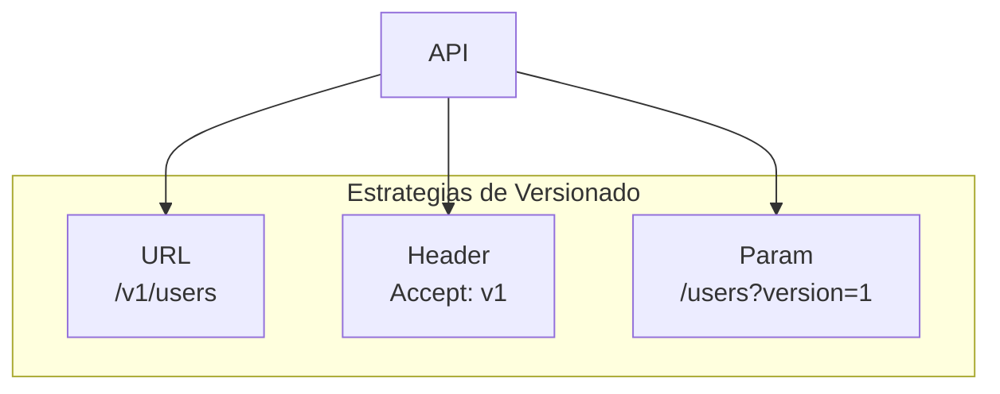

```properties
api.version=v1
```

```java
@RestController
@RequestMapping("${api.path:/api}/${api.version:v1}/users")
public class UserController {

    @GetMapping
    public ResponseEntity<String> getUsers() {
        return ResponseEntity.ok("Users API");
    }
}
```

!!! tip "Tip del Examinador"
    La forma más simple y común es versionar por URL: `/v1/users`, `/v2/users`. Es lo que espera el examinador.

!!! info "Por qué aquí va en el `@RequestMapping` y no en un `if`"
    El material de referencia muestra la versión leída con `@Value` y un `if` dentro del método. Funciona, pero mezcla dos versiones de la API en el mismo código y obliga a tocar el método cada vez que aparece una nueva.

    Poniendo la versión en el **prefijo de la ruta** (`${api.version}`), cada versión es su propio controlador: `/api/v1/users` y `/api/v2/users` conviven, y la v1 sigue funcionando sin que nadie la toque. Eso es lo que significa «compatibilidad hacia atrás».

---

## 2.5. Probar la API: Postman y `curl`

Para probar con un cliente nuestro servicio usaremos [Postman](https://www.postman.com/), que es una herramienta de colaboración para el desarrollo de APIs. Permite a los usuarios crear y compartir colecciones de peticiones HTTP, así como documentar y probar sus APIs.

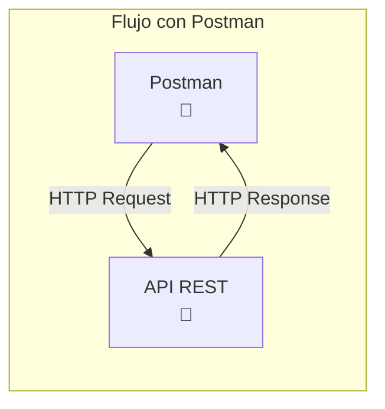

!!! note "Nota del Profesor"
    Postman es esencial para probar APIs. En el examen práctico, saber usar Postman correctamente es muy importante.

Recuerda que los cuerpos en JSON se mandan en **Body → Raw → JSON**.

!!! tip "Y en la terminal, `curl`, que es lo que entra en el test"
    Lo mismo que hiciste en la UT1, ahora contra tu propio servidor:

    ```bash
    # Listar
    curl -i localhost:8080/api/productos

    # Uno
    curl -i localhost:8080/api/productos/1

    # Crear
    curl -i -X POST localhost:8080/api/productos \
         -H "Content-Type: application/json" \
         -d '{"nombre":"Casco","precio":35.0}'

    # Borrar
    curl -i -X DELETE localhost:8080/api/productos/1
    ```

    El `-i` muestra las cabeceras, que es donde está la mitad de la respuesta: el código de estado y el `Location` del 201.

    Si olvidas el `-H "Content-Type: application/json"` en el POST, el servidor contesta **415 Unsupported Media Type**. Es el error más frecuente de la primera sesión.

---

## 2.6. Práctica de clase: mi primera API REST

1. Crea un proyecto Spring Boot con las dependencias de Spring Web.
2. Crea el controlador `FunkosRestController` con las operaciones CRUD (GET, POST, PUT, PATCH, DELETE) que devuelvan un mensaje de texto con cada operación.
3. Crea el modelo `Funko` con los siguientes atributos: id, nombre, precio, cantidad, imagen, categoría, fecha de creación y fecha de actualización.
4. Crea el repositorio de Funkos en base a la colección que quieras. Puedes importarla desde un fichero CSV que se lea de properties o desde un fichero JSON, como en ejercicios anteriores.
5. Inyecta el repositorio en el controlador de Funkos con las siguientes rutas:
    - `GET /funkos`: Devuelve todos los funkos; si tiene el query `categoria`, los filtra por categoría, por ejemplo `/funkos?categoria=disney` (cuidado con las letras en mayúscula o minúscula).
    - `GET /funkos/{id}`: Devuelve el funko con el id indicado; si no existe, devuelve un error 404.
    - `POST /funkos`: Crea un nuevo funko y lo devuelve.
    - `PUT /funkos/{id}`: Actualiza el funko con el id indicado y lo devuelve; si no existe, devuelve un error 404.
    - `PATCH /funkos/{id}`: Actualiza el funko con el id indicado y lo devuelve; si no existe, devuelve un error 404.
    - `DELETE /funkos/{id}`: Borra el funko con el id indicado y devuelve un mensaje de éxito; si no existe, devuelve un error 404.
6. Prueba las rutas con Postman.

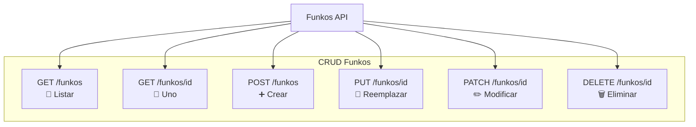

!!! reto "Esta práctica es el micro-reto de la sesión"
    El CSV de lectura lo tienes ya resuelto de la [UT3](../ut3/01-csv-y-json.md): el repositorio carga el fichero al arrancar con un `CommandLineRunner` y guarda los funkos en una `List` en memoria. La parte nueva es **solo la capa web**.

    Hazlo en pareja y en 25 minutos. El resultado se usa como punto de partida del [proyecto completo](04-proyecto-completo.md).

---

## Pruébalo ahora (12 min)

Sobre el proyecto de la práctica:

1. Llama a `GET /funkos/9999` con un id que no existe. ¿Qué código devuelve? ¿Cuál debería devolver?
2. Manda un POST con el JSON `{"nombre":"X"}` sin la cabecera `Content-Type`. Lee el error.
3. Manda un POST con un campo que no existe en `Funko`. ¿Falla? ¿Por qué?
4. Añade `?categoria=DISNEY` en mayúsculas. ¿Funciona el filtro?

??? success "Solución de las cuatro"

    **1.** Con `findById(id).get()` sale un **500**, y el log muestra `NoSuchElementException`. Debería ser un **404**: el servidor funciona perfectamente, el recurso no está.

    ```java
    return repositorio.findById(id)
            .map(ResponseEntity::ok)
            .orElse(ResponseEntity.notFound().build());
    ```

    **2.** **415 Unsupported Media Type.** Spring no sabe que lo que le mandas es JSON, así que no encuentra ningún convertidor capaz de leerlo. El cuerpo no se llega a mirar.

    **3.** **No falla**: Spring Boot configura Jackson con `FAIL_ON_UNKNOWN_PROPERTIES` desactivado, así que el campo de más se ignora en silencio. Es cómodo y a la vez peligroso: un cliente puede mandar `{"nombe":"X"}` con una errata y recibir un 201 con el nombre a `null`.

    Eso se arregla validando, y es el tema 3.

    **4.** Depende de cómo lo hayas escrito. Con `equals` no funciona; hay que normalizar:

    ```java
    .filter(f -> f.categoria().equalsIgnoreCase(categoria))
    ```

    Es exactamente el aviso del enunciado: *«cuidado con las letras en mayúscula o minúscula»*.

---

## Ejercicios (con solución)

### E1 — `@Controller` o `@RestController`

¿Qué devuelve cada uno y qué anotación extra lleva el segundo?

??? success "Solución"

    - `@Controller` devuelve **el nombre de una vista** (o un `ModelAndView`) que una plantilla como Thymeleaf renderiza a HTML.
    - `@RestController` = `@Controller` + **`@ResponseBody`**: lo que devuelve el método **es el cuerpo de la respuesta**, serializado a JSON por Jackson.

    Si pones `@Controller` por error en una API y devuelves un `Producto`, Spring busca una plantilla llamada `Producto` y contesta un 404 o un 500 según la configuración. Es un error que desconcierta porque el código del método parece bien.

### E2 — Los códigos de estado del CRUD

Completa la tabla.

| Operación | Éxito | El recurso no existe | Datos inválidos |
|---|---|---|---|

??? success "Solución"

    | Operación | Éxito | No existe | Datos inválidos |
    |---|---|---|---|
    | `GET /productos` | **200** | — (lista vacía, también 200) | — |
    | `GET /productos/{id}` | **200** | **404** | — |
    | `POST /productos` | **201** + `Location` | — | **400** |
    | `PUT /productos/{id}` | **200** | **404** | **400** |
    | `PATCH /productos/{id}` | **200** | **404** | **400** |
    | `DELETE /productos/{id}` | **204** | **404** | — |

    Dos detalles que se fallan:

    - Una **lista vacía es un 200**, no un 404. El recurso «colección de productos» existe; lo que está vacío es su contenido.
    - El **201 lleva cabecera `Location`** con la URL del recurso creado. Sin ella, el cliente no sabe dónde está lo que acaba de crear.

### E3 — `@PathVariable` o `@RequestParam`

Escribe la firma para: (a) `/productos/42` · (b) `/productos?categoria=movilidad` · (c) `/productos?page=2&size=20`

??? success "Solución"

    ```java
    // (a) identifica UN recurso → parte de la ruta
    @GetMapping("/productos/{id}")
    public ResponseEntity<Producto> uno(@PathVariable Long id) { … }

    // (b) filtra una colección → query
    @GetMapping("/productos")
    public ResponseEntity<List<Producto>> filtrar(
            @RequestParam(required = false) String categoria) { … }

    // (c) modifica cómo se presenta → query con valores por defecto
    @GetMapping("/productos")
    public ResponseEntity<List<Producto>> pagina(
            @RequestParam(defaultValue = "0")  int page,
            @RequestParam(defaultValue = "10") int size) { … }
    ```

    **El criterio:** si el dato **identifica el recurso**, va en la ruta; si **filtra, ordena o pagina** la colección, va en la query. `/productos/movilidad` estaría mal: `movilidad` no es un producto.

### E4 — El 415

Mandas un POST con JSON válido y recibes `415 Unsupported Media Type`. ¿Qué falta?

??? success "Solución"

    La cabecera **`Content-Type: application/json`**.

    ```bash
    curl -X POST localhost:8080/api/productos \
         -H "Content-Type: application/json" \
         -d '{"nombre":"Casco","precio":35.0}'
    ```

    `@RequestBody` necesita saber **en qué formato** viene el cuerpo para elegir el convertidor. Sin esa cabecera no hay convertidor que acepte la petición, y por eso el cuerpo no se llega a leer: el error es anterior.

    En Postman es el fallo de la primera clase: hay que elegir **Body → raw → JSON**, no «Text».

### E5 — PUT frente a PATCH

¿Cuál es la diferencia, y qué debería pasar si mandas un PUT con solo el nombre?

??? success "Solución"

    - **PUT reemplaza el recurso entero.** Lo que no mandes, se borra o vuelve a su valor por defecto.
    - **PATCH modifica solo los campos que mandas.** El resto se queda como estaba.

    Así que un `PUT /productos/1` con `{"nombre":"Casco nuevo"}` debería dejar el precio a `null` o a `0`, no conservarlo. Si tu PUT conserva los campos que faltan, **has implementado un PATCH y lo has llamado PUT**.

    Es el error de diseño más común de la unidad, y además rompe una promesa del protocolo: PUT es **idempotente** (mandarlo dos veces deja el mismo estado), y un PUT que fusiona no lo es necesariamente.

### E6 — El controlador que hace demasiado

```java
@GetMapping("/productos")
public ResponseEntity<List<Producto>> listar() {
    var jdbc = DriverManager.getConnection(URL, USER, PASS);
    // ... SELECT a mano, mapear el ResultSet ...
}
```

¿Qué está mal, aunque funcione?

??? success "Solución"

    El controlador **ha saltado dos capas**: habla SQL directamente.

    Las consecuencias son concretas, no estéticas:

    1. **No se puede probar** sin una base de datos levantada.
    2. **No se puede reutilizar.** Cuando en la UT6 quieras servir lo mismo por WebSocket o GraphQL, hay que copiar y pegar la consulta.
    3. **La conexión no se cierra** (falta el `try-with-resources`), así que el pool se agota tras unas cuantas peticiones.
    4. El día que cambie la tabla, hay que buscar el SQL repartido por los controladores.

    Lo correcto: `@RestController` → `@Service` → `@Repository`, y el controlador solo traduce entre HTTP y objetos.

### E7 — Versionar

Tu API `/api/productos` está en producción con tres clientes. Te piden cambiar el campo `precio` de número a objeto `{importe, moneda}`. ¿Qué haces?

??? success "Solución"

    **No tocas `/api/v1/productos`: creas `/api/v2/productos`.**

    Un cambio de tipo en un campo es **incompatible hacia atrás**: los tres clientes que esperan un número se rompen el día del despliegue, y tú no controlas cuándo se actualizan.

    ```java
    @RestController
    @RequestMapping("/api/v1/productos")
    public class ProductosV1Controller { … }   // devuelve precio: 35.0

    @RestController
    @RequestMapping("/api/v2/productos")
    public class ProductosV2Controller { … }   // devuelve precio: {importe, moneda}
    ```

    Las dos usan **el mismo `@Service`**; lo que cambia es el DTO de salida. Por eso la capa de servicio no debe devolver entidades directamente, que es justo el tema 3.

    Y lo que **sí** se puede hacer sin versionar: **añadir** un campo nuevo. Un cliente que no lo conoce lo ignora.
