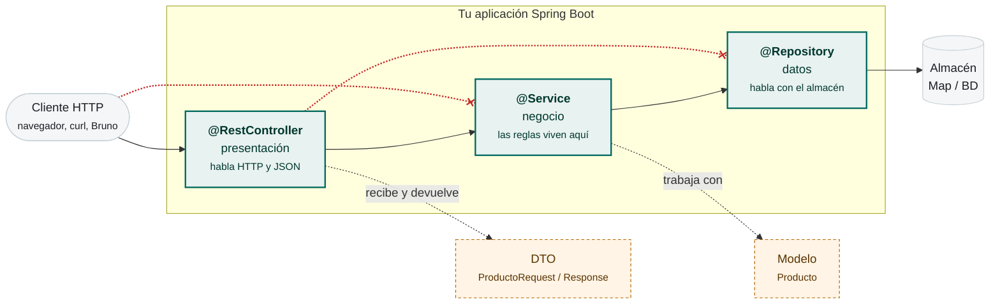
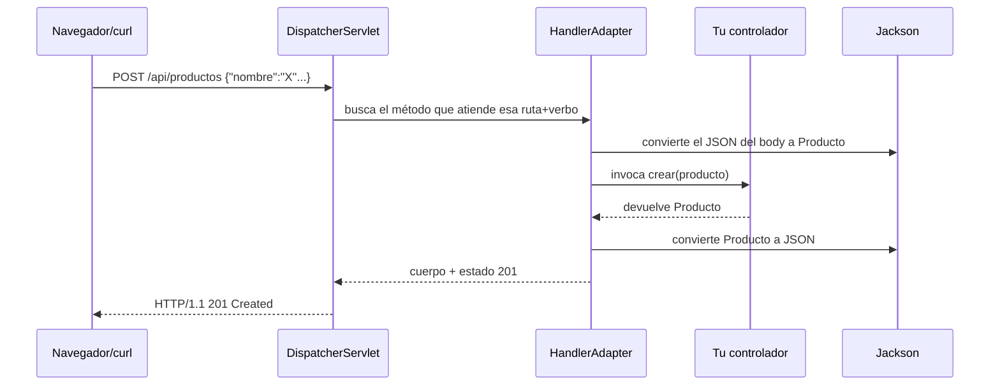

# Las capas en Spring: el CRUD completo

> Aquí montamos la aplicación entera, capa a capa, con todo el código. Esta página es la referencia que consultarás durante el resto del curso.

## 1. El mapa y la regla de oro

!!! analogia "Analogía"
    Un restaurante: el **camarero** toma la comanda y sirve (controlador), la **cocina** decide cómo se hace el plato (servicio), y el **almacén** guarda los ingredientes (repositorio). El cliente nunca entra en la cocina, y el cocinero no baja al almacén cada dos minutos. Cuando todos hacen su trabajo, se puede cambiar el proveedor sin cerrar el local.



Las dos líneas rojas terminadas en aspa son **la regla de oro**: nadie salta una capa. El cliente no llama al servicio, y el controlador no toca el repositorio. Si en un examen ves un `@RestController` con un `@Repository` inyectado, eso es un fallo de diseño aunque funcione.

**Las dependencias van en una sola dirección.** Si un repositorio llama a un servicio, has roto la arquitectura (y probablemente creado un ciclo que Spring rechazará al arrancar).

| Capa | Responsabilidad única | Nunca debe |
|---|---|---|
| **Controlador** | Traducir HTTP ⇄ objetos y devolver el código correcto | Contener reglas de negocio ni acceder al repositorio |
| **Servicio** | Reglas de negocio, orquestación, transacciones | Saber de HTTP (nada de `HttpServletRequest`) ni de SQL |
| **Repositorio** | Leer y guardar | Aplicar reglas de negocio |
| **Modelo** | Representar el dominio | Saber de dónde viene ni cómo se muestra |

## 2. Modelo y repositorio

```java title="modelo/Producto.java"
public record Producto(Integer id, String nombre, String categoria,
                       double precio, int stock) {

    public Producto conStock(int nuevoStock) {  // "modificar" un record = crear otro
        return new Producto(id, nombre, categoria, precio, nuevoStock);
    }

    public boolean hayStock(int unidades) { return stock >= unidades; }
}
```

Fíjate en `conStock`: como los records son **inmutables**, los cambios devuelven una copia nueva. Y `hayStock` es lógica que pertenece al propio dominio: un objeto puede (y debe) tener comportamiento, no solo datos.

```java title="repositorio/ProductoRepositorio.java"
public interface ProductoRepositorio {
    List<Producto> buscarTodos();
    Optional<Producto> buscarPorId(Integer id);
    List<Producto> buscarPorCategoria(String categoria);
    boolean existePorNombre(String nombre);
    Producto guardar(Producto producto);
    boolean borrar(Integer id);
}
```

``` { .java .numerado title="repositorio/ProductoRepositorioMemoria.java" }
@Repository
public class ProductoRepositorioMemoria implements ProductoRepositorio {

    private static final Logger log = LoggerFactory.getLogger(ProductoRepositorioMemoria.class);

    private final Map<Integer, Producto> datos = new ConcurrentHashMap<>();
    private final AtomicInteger secuencia = new AtomicInteger(0);

    @PostConstruct
    void cargarDatosIniciales() {
        guardar(new Producto(null, "Patinete eléctrico", "movilidad", 120.0, 8));
        guardar(new Producto(null, "Casco", "seguridad", 35.0, 40));
        guardar(new Producto(null, "Bicicleta urbana", "movilidad", 450.0, 3));
        guardar(new Producto(null, "Candado", "seguridad", 25.0, 0));
        log.info("Catálogo inicial cargado: {} productos", datos.size());
    }

    @Override
    public List<Producto> buscarTodos() {
        return datos.values().stream()
            .sorted(Comparator.comparing(Producto::id))
            .toList();
    }

    @Override
    public Optional<Producto> buscarPorId(Integer id) {
        return Optional.ofNullable(datos.get(id));
    }

    @Override
    public List<Producto> buscarPorCategoria(String categoria) {
        return datos.values().stream()
            .filter(p -> p.categoria().equalsIgnoreCase(categoria))
            .toList();
    }

    @Override
    public boolean existePorNombre(String nombre) {
        return datos.values().stream()
            .anyMatch(p -> p.nombre().equalsIgnoreCase(nombre));
    }

    @Override
    public Producto guardar(Producto p) {
        var id = (p.id() == null) ? secuencia.incrementAndGet() : p.id();
        var guardado = new Producto(id, p.nombre(), p.categoria(), p.precio(), p.stock());
        datos.put(id, guardado);
        return guardado;
    }

    @Override
    public boolean borrar(Integer id) { return datos.remove(id) != null; }
}
```

Tres decisiones profesionales aquí: **`ConcurrentHashMap`** porque el servidor atiende peticiones simultáneas (recuerda el bug del singleton); el **id lo asigna el repositorio**, nunca el cliente; y `buscarPorId` devuelve **`Optional`**, no `null`.

## 3. La capa de servicio

``` { .java .numerado title="servicio/ProductoServicio.java" }
@Service
public class ProductoServicio {

    private static final Logger log = LoggerFactory.getLogger(ProductoServicio.class);

    private final ProductoRepositorio repositorio;
    private final TiendaConfig config;

    public ProductoServicio(ProductoRepositorio repositorio, TiendaConfig config) {
        this.repositorio = repositorio;
        this.config = config;
    }

    public List<Producto> listar() { return repositorio.buscarTodos(); }

    public Producto obtener(Integer id) {
        return repositorio.buscarPorId(id)
            .orElseThrow(() -> new ProductoNoEncontradoException(id));
    }

    public List<Producto> porCategoria(String categoria) {
        if (categoria == null || categoria.isBlank())
            throw new DatosInvalidosException("La categoría es obligatoria");
        return repositorio.buscarPorCategoria(categoria);
    }

    public Producto crear(Producto producto) {
        if (repositorio.existePorNombre(producto.nombre()))
            throw new ProductoDuplicadoException(producto.nombre());     // → 409
        var creado = repositorio.guardar(producto);
        log.info("Producto creado: id={} nombre={}", creado.id(), creado.nombre());
        return creado;
    }

    public Producto actualizar(Integer id, Producto datos) {
        obtener(id);                                     // 404 si no existe
        return repositorio.guardar(
            new Producto(id, datos.nombre(), datos.categoria(), datos.precio(), datos.stock()));
    }

    public Producto ajustarStock(Integer id, int unidades) {
        var p = obtener(id);
        var nuevoStock = p.stock() + unidades;
        if (nuevoStock < 0)
            throw new StockInsuficienteException(id, p.stock(), -unidades);   // → 409
        log.debug("Stock de {}: {} → {}", id, p.stock(), nuevoStock);
        return repositorio.guardar(p.conStock(nuevoStock));
    }

    public void borrar(Integer id) {
        if (!repositorio.borrar(id)) throw new ProductoNoEncontradoException(id);
    }

    // --- Consultas de negocio ---

    public double precioConIva(Integer id) {
        return obtener(id).precio() * (1 + config.iva());
    }

    public double valorInventario() {
        return repositorio.buscarTodos().stream()
            .mapToDouble(p -> p.precio() * p.stock())
            .sum();
    }

    public Map<String, List<Producto>> agrupadosPorCategoria() {
        return repositorio.buscarTodos().stream()
            .collect(Collectors.groupingBy(Producto::categoria));
    }
}
```

**Todo lo que es una decisión del negocio vive aquí**: qué es un duplicado, cuándo no hay stock, cómo se calcula el inventario. Y todo es **testeable sin arrancar el servidor**.

Fíjate también en el **logging**: `log.info` para hechos relevantes del negocio, `log.debug` para detalle de diagnóstico. Nunca `System.out.println` en una aplicación real — no se puede filtrar por nivel ni redirigir.

## 4. El controlador

``` { .java .annotate title="controlador/ProductoControlador.java" hl_lines="1 7 8 9" }
@RestController                                  // (1)!
@RequestMapping("/api/productos")                // (2)!
public class ProductoControlador {

    private final ProductoServicio servicio;     // (3)!

    public ProductoControlador(ProductoServicio servicio) {
        this.servicio = servicio;                // (4)!
    }

    @GetMapping
    public List<Producto> listar(
            @RequestParam(required = false) String categoria) {   // (5)!
        return (categoria == null) ? servicio.listar() : servicio.porCategoria(categoria);
    }

    @GetMapping("/{id}")
    public Producto obtener(@PathVariable Integer id) {
        return servicio.obtener(id);
    }

    @PostMapping
    @ResponseStatus(HttpStatus.CREATED)                    // (6)!
    public Producto crear(@RequestBody Producto producto) {
        return servicio.crear(producto);
    }

    @PutMapping("/{id}")
    public Producto actualizar(@PathVariable Integer id, @RequestBody Producto producto) {
        return servicio.actualizar(id, producto);
    }

    @PatchMapping("/{id}/stock")
    public Producto ajustarStock(@PathVariable Integer id, @RequestParam int unidades) {
        return servicio.ajustarStock(id, unidades);
    }

    @DeleteMapping("/{id}")
    @ResponseStatus(HttpStatus.NO_CONTENT)                 // (7)!
    public void borrar(@PathVariable Integer id) {
        servicio.borrar(id);
    }

    @GetMapping("/inventario")
    public Map<String, Object> inventario() {
        return Map.of("valorTotal", servicio.valorInventario(),
                      "porCategoria", servicio.agrupadosPorCategoria());
    }
}
```

1.  **`@RestController` = `@Controller` + `@ResponseBody`.** Lo que devuelve cada método se convierte a JSON y se escribe en el cuerpo de la respuesta. Con `@Controller` a secas, `return "productos"` se interpretaría como el **nombre de una plantilla** (eso lo verás en la UT8) y aquí acabarías con un error 500 buscando una vista que no existe.

2.  **La ruta base en la clase.** Los `@GetMapping("/{id}")` de dentro se concatenan: `/api/productos/{id}`. Cambiar el prefijo de toda la API es tocar una sola línea.

3.  **`final`.** El compilador te obliga a asignarlo en el constructor, y a partir de ahí nadie puede sustituir la dependencia por accidente.

4.  **Inyección por constructor.** No lleva `@Autowired`: desde Spring 4.3, si la clase tiene **un único constructor**, Spring lo usa automáticamente. Es la forma recomendada — con `@Autowired` sobre el campo no podrías declararlo `final` ni instanciar la clase en un test sin levantar el contexto.

5.  `required = false` hace opcional el parámetro: `GET /api/productos` y `GET /api/productos?categoria=movilidad` entran los dos por aquí.

6.  **201 Created**, no 200. Sin esta anotación Spring devuelve 200 y la API miente sobre lo que ha hecho. Los códigos de estado son parte del contrato, no decoración.

7.  **204 No Content**: la operación fue bien y no hay nada que devolver. Por eso el método es `void`.

**Ningún método pasa de tres líneas.** Ese es el objetivo: recibir → delegar → responder.

### Las anotaciones de entrada, a fondo

``` { .java .numerado }
// Variable de ruta
@GetMapping("/{id}")                    // /api/productos/42
public Producto uno(@PathVariable Integer id) { }

// Varias variables
@GetMapping("/{cat}/productos/{id}")
public Producto uno(@PathVariable String cat, @PathVariable Integer id) { }

// Parámetro de consulta obligatorio
@GetMapping                             // ?categoria=movilidad
public List<Producto> lista(@RequestParam String categoria) { }

// Opcional con valor por defecto
public List<Producto> lista(@RequestParam(defaultValue = "todas") String categoria) { }

// Opcional que puede no venir
public List<Producto> lista(@RequestParam(required = false) String categoria) { }

// Cuerpo JSON
@PostMapping
public Producto crear(@RequestBody Producto p) { }

// Cabecera HTTP
public void ver(@RequestHeader("User-Agent") String agente) { }

// Varios verbos en un método
@RequestMapping(value = "/{id}", method = {RequestMethod.PUT, RequestMethod.PATCH})
```

### Qué hace Spring con tu método



Cada `@PathVariable`, `@RequestParam` y `@RequestBody` le dice al `HandlerAdapter` **de dónde sacar cada argumento**. Por eso, si mandas `?unidades=hola` a un `int`, el error es **400** y ni siquiera llega a tu código.

---

## Pruébalo ahora (30 min) — CRUD completo

!!! reto "Trabaja tú ahora"
    Este bloque se hace **en clase, en tu equipo**. No se entrega ni puntúa: es la práctica que hace que el examen te salga.

Monta las cuatro capas y recorre toda la API con curl. **Comprueba el código de estado en cada una**, no solo el cuerpo:

```bash
# 1. Listar
curl -s localhost:8080/api/productos | jq

# 2. Filtrar por categoría (mismo endpoint, con parámetro)
curl -s "localhost:8080/api/productos?categoria=seguridad" | jq '.[].nombre'

# 3. Uno concreto y uno inexistente
curl -i localhost:8080/api/productos/1
curl -i localhost:8080/api/productos/999  # de momento 500: lo arreglamos en la página 5

# 4. Crear → 201
curl -i -X POST localhost:8080/api/productos \
  -H "Content-Type: application/json" \
  -d '{"nombre":"Luces LED","categoria":"seguridad","precio":15.0,"stock":25}'

# 5. Crear duplicado → excepción de negocio
curl -i -X POST localhost:8080/api/productos \
  -H "Content-Type: application/json" \
  -d '{"nombre":"Casco","categoria":"seguridad","precio":40.0,"stock":5}'

# 6. Actualizar completo
curl -i -X PUT localhost:8080/api/productos/1 \
  -H "Content-Type: application/json" \
  -d '{"nombre":"Patinete PRO","categoria":"movilidad","precio":180.0,"stock":6}'

# 7. Ajustar stock (vender 3)
curl -i -X PATCH "localhost:8080/api/productos/1/stock?unidades=-3"

# 8. Vender más de lo que hay → excepción
curl -i -X PATCH "localhost:8080/api/productos/1/stock?unidades=-9999"

# 9. Inventario
curl -s localhost:8080/api/productos/inventario | jq

# 10. Borrar → 204
curl -i -X DELETE localhost:8080/api/productos/2

# 11. Verbo no permitido → 405 (Spring solo)
curl -i -X DELETE localhost:8080/api/productos
```

**Observa el log del servidor** mientras lo haces: verás tus `log.info` de creación y los `log.debug` si bajas el nivel en `application.yml`.

---

## Ejercicios (con solución)

### Ejercicio 1 — ¿En qué capa?

(a) `precio * 1.21` · (b) `@GetMapping("/{id}")` · (c) `datos.put(id, p)` · (d) "no se puede borrar un producto con stock" · (e) convertir el objeto a JSON · (f) `record Producto` · (g) devolver 404 si no existe · (h) comprobar si el nombre está duplicado.

??? success "Solución"

    (a) Servicio · (b) Controlador · (c) Repositorio · (d) Servicio · (e) el framework, al retornar desde el controlador · (f) Modelo · (g) el servicio lanza la excepción, y el manejador global la traduce a 404 · (h) la consulta es del repositorio (`existePorNombre`), pero la decisión de que eso es un error es del servicio.


### Ejercicio 2 — Refactoriza el Fat Controller

```java
@GetMapping("/oferta")
public List<Producto> oferta() {
    return repositorio.buscarTodos().stream()
        .filter(p -> p.stock() > 10)
        .filter(p -> p.precio() > 50)
        .map(p -> new Producto(p.id(), p.nombre(), p.categoria(), p.precio() * 0.8, p.stock()))
        .sorted(Comparator.comparing(Producto::precio))
        .toList();
}
```

??? success "Solución"

    El controlador (1) accede directo al repositorio saltándose el servicio y (2) contiene tres reglas de negocio (qué entra en oferta, cuánto se descuenta y el orden). Correcto:
    ```java
    // Controlador
    @GetMapping("/oferta")
    public List<Producto> oferta() { return servicio.productosEnOferta(); }

    // Servicio
    public List<Producto> productosEnOferta() {
        return repositorio.buscarTodos().stream()
            .filter(p -> p.stock() > config.stockMinimoOferta())
            .filter(p -> p.precio() > config.precioMinimoOferta())
            .map(p -> p.conPrecio(p.precio() * (1 - config.descuentoOferta())))
            .sorted(Comparator.comparing(Producto::precio))
            .toList();
    }
    ```

    Extra: los umbrales salen a configuración en vez de estar escritos en el código.


### Ejercicio 3 — Añade una funcionalidad completa

Implementa "productos agotados" (stock 0) recorriendo las tres capas, con endpoint `GET /api/productos/agotados`.

??? success "Solución"

    ```java
    // Repositorio (interfaz + impl)
    List<Producto> buscarAgotados();
    @Override public List<Producto> buscarAgotados() {
        return datos.values().stream().filter(p -> p.stock() == 0).toList();
    }

    // Servicio
    public List<Producto> agotados() { return repositorio.buscarAgotados(); }

    // Controlador
    @GetMapping("/agotados")
    public List<Producto> agotados() { return servicio.agotados(); }
    ```

    :material-alert: Cuidado con el orden de las rutas: `/agotados` debe declararse antes que `/{id}` si hubiera ambigüedad — aquí no la hay porque `{id}` es Integer y Spring no puede convertir "agotados", pero con String sí chocarían.


### Ejercicio 4 — Diseña las firmas

Para un sistema de reservas: listar libres por fecha, reservar (falla si ocupada), cancelar. Escribe las firmas de las tres capas.

??? success "Solución"

    ```java
    // Repositorio
    List<Sala> buscarLibres(LocalDate fecha);
    Optional<Reserva> buscarPorSalaYFecha(Integer salaId, LocalDate fecha);
    Reserva guardar(Reserva r);
    boolean borrar(Integer reservaId);

    // Servicio  (aquí van las reglas)
    List<Sala> salasLibres(LocalDate fecha);
    // SalaOcupadaException → 409
    Reserva reservar(Integer salaId, LocalDate fecha, String usuario);
    void cancelar(Integer reservaId, String usuario);  // 404 · 403 si no es suya

    // Controlador
    @GetMapping("/salas/libres")          public List<SalaDto> libres(@RequestParam LocalDate fecha)
    @PostMapping("/salas/{id}/reservas")  @ResponseStatus(CREATED) public ReservaDto reservar(...)
    @DeleteMapping("/reservas/{id}")      @ResponseStatus(NO_CONTENT) public void cancelar(...)
    ```


### Ejercicio 5 — Rompe la arquitectura y explica por qué duele

¿Qué pasaría si el repositorio inyectara el servicio para "validar antes de guardar"?

??? success "Solución"

    Crearías un ciclo de dependencias (servicio → repositorio → servicio). Spring Boot lo rechaza al arrancar por defecto con un error de circular reference. Y aunque lo forzaras, perderías la testabilidad (no puedes probar el repositorio aislado) y la lógica quedaría duplicada en cada implementación del repositorio. La validación pertenece al servicio, antes de llamar a guardar.

