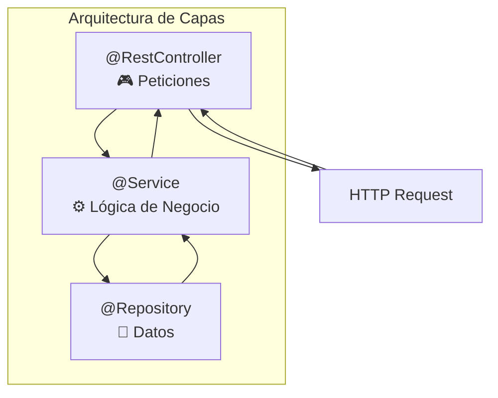
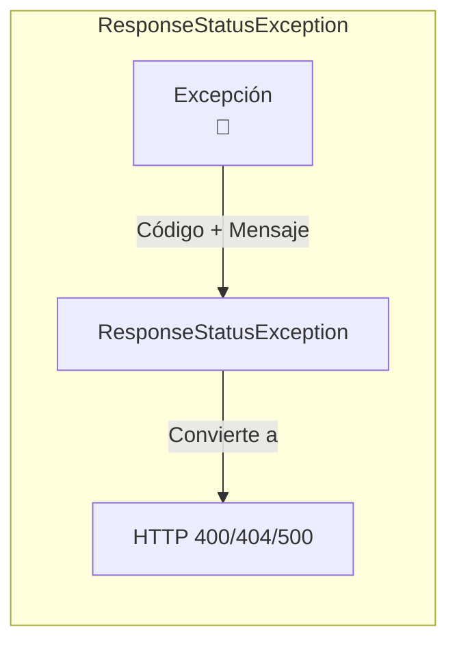
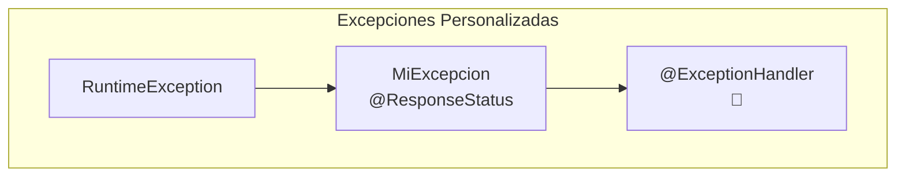
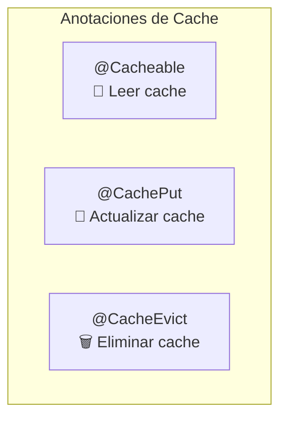
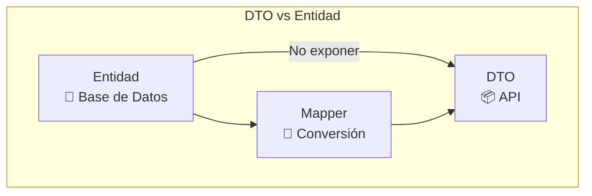
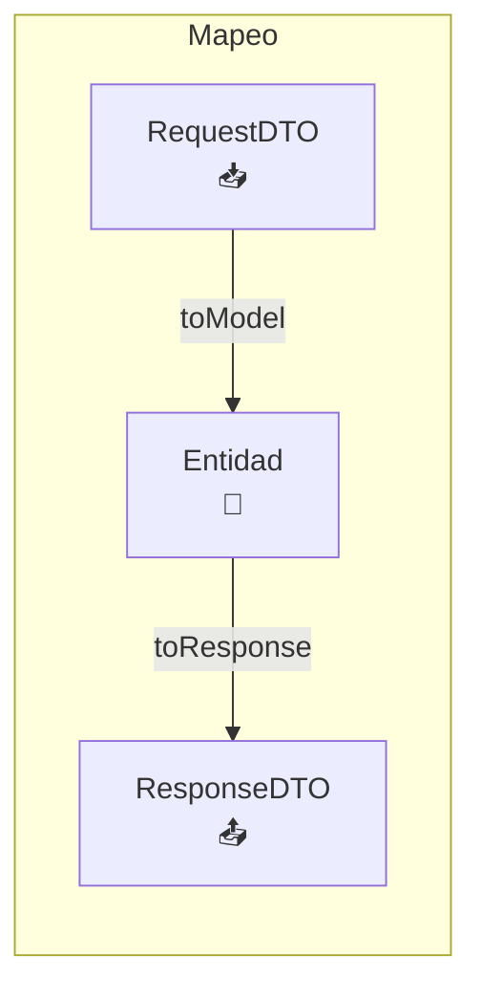
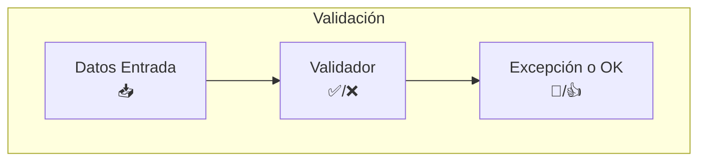
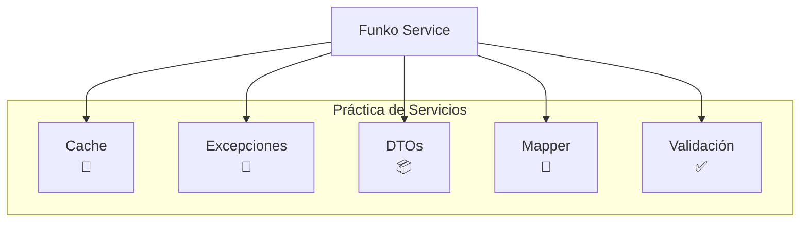

# 3. Servicios, DTOs y caché

!!! quote "Autoría del material"
    Este tema es una **adaptación del material de [José Luis González Sánchez](https://github.com/joseluisgs)**, concretamente del archivo `springboot/05-Servicios.md` del repositorio [DesarrolloWebEntornosServidor-02-2025-2026](https://github.com/joseluisgs/DesarrolloWebEntornosServidor-02-2025-2026).

    Publicado bajo licencia [Creative Commons Reconocimiento-NoComercial-CompartirIgual 4.0](http://creativecommons.org/licenses/by-nc-sa/4.0/). Se conservan el texto, los diagramas y los ejemplos originales. **Adaptaciones de este curso:** las dependencias van en pestañas Maven / Gradle, y los DTOs se escriben con `record` de Java 25 además de con clases.

!!! note "Nota del Profesor"
    Los servicios son el corazón de la lógica de negocio. Aquí aplicamos todo lo aprendido: DTOs, validación, caché y manejo de errores.

!!! tip "Tip del Examinador"
    En el examen preguntan mucho sobre DTOs vs Entidades. ¡No confundas la capa de datos con la de presentación!

---

## 3.1. Servicios

Un servicio encapsula la lógica de negocio de nuestra app. De esta manera aplicamos el principio de responsabilidad única: el controlador procesa las peticiones, y el servicio realiza las acciones necesarias para poder darle la respuesta.



Para ello vamos a crear nuestro servicio anotado con `@Service` y lo usaremos para procesar las peticiones requeridas por el controlador.

!!! note "Nota del Profesor"
    El controlador solo recibe y responde HTTP. El servicio contiene toda la lógica de negocio. Esta separación es clave.

!!! tip "La prueba de que la separación está bien hecha"
    Mira si en tu `@Service` aparece alguna de estas palabras: `ResponseEntity`, `HttpStatus`, `@PathVariable`, `HttpServletRequest`.

    Si aparece alguna, **el servicio sabe de HTTP** y se ha roto la separación. La consecuencia llega en la UT6: ese mismo servicio tiene que atender también un WebSocket y una consulta GraphQL, donde no hay códigos de estado.

Una interfaz por delante del servicio, aunque solo tengas una implementación:

```java
public interface FunkosService {
    List<FunkoResponse> findAll(Optional<String> categoria);
    FunkoResponse findById(Long id);
    FunkoResponse save(FunkoCreateRequest funko);
    FunkoResponse update(Long id, FunkoUpdateRequest funko);
    void deleteById(Long id);
}

@Service
@CacheConfig(cacheNames = {"funkos"})
public class FunkosServiceImpl implements FunkosService {
    private final FunkosRepository repositorio;
    private final FunkoMapper mapper;

    public FunkosServiceImpl(FunkosRepository repositorio, FunkoMapper mapper) {
        this.repositorio = repositorio;
        this.mapper = mapper;
    }
    // ...
}
```

Es la interfaz de la UT2, tema 3, con Spring eligiendo la implementación. Y lo que te da: en el test puedes inyectar un doble del servicio sin tocar el controlador.

---

## 3.2. Manejo de excepciones y errores

### 3.2.1. `ResponseStatusException`

Los errores se pueden manejar de dos formas: con excepciones. Desde la versión 5 de Spring, se puede usar [`ResponseStatusException`](https://www.baeldung.com/spring-response-status-exception). De esta forma, podemos lanzar una excepción y Spring se encarga de convertirla en un error HTTP en base al contenido que se le indica, dando la respuesta adecuada.



```java
public class RaquetaValidator {

    public void validate(Raqueta raqueta) {
        // las distintas condiciones
        if (raqueta.getMarca() == null || raqueta.getMarca().isEmpty()) {
            throw new ResponseStatusException(
                    HttpStatus.BAD_REQUEST, "La marca no puede estar vacía");
        }
        if (raqueta.getModelo() == null || raqueta.getModelo().isEmpty()) {
            throw new ResponseStatusException(
                    HttpStatus.BAD_REQUEST, "El modelo no puede estar vacío");
        }
        if (raqueta.getPrecio() == null || raqueta.getPrecio() < 0) {
            throw new ResponseStatusException(
                    HttpStatus.BAD_REQUEST, "El precio no puede ser negativo");
        }
    }

}
```

```java
@Override
public Raqueta findById(Long id) {
    log.info("findById");
    return raquetasRepository.findById(id).orElseThrow(
            () -> new ResponseStatusException(
                    HttpStatus.NOT_FOUND, "No se ha encontrado la raqueta con id: " + id)
    );
}
```

!!! tip "Tip del Examinador"
    `ResponseStatusException` es rápida y sencilla. Perfecta para excepciones simples. Para control más fino, usa excepciones personalizadas.

!!! warning "Y es la que mete HTTP en el servicio"
    Fíjate en lo que acaba de pasar: `HttpStatus.NOT_FOUND` está **dentro del servicio**. Funciona, se escribe en una línea, y a cambio ese servicio ya no se puede usar desde un WebSocket.

    Por eso en el proyecto de la unidad usamos la segunda opción. Esta conviene conocerla porque la verás en mucho código y porque entra en el test.

### 3.2.2. Excepciones personalizadas

La otra opción es crear nuestro sistema de excepciones y errores asociado al dominio. Para ello vamos a crear una clase `RaquetaException` que herede de `RuntimeException` y que tenga un constructor con un mensaje. De esta forma podemos lanzar una excepción y Spring se encarga de convertirla en un error HTTP en base al contenido que se le indica, dando la respuesta adecuada. El response status lo definimos con una anotación; de esta manera nos es más sencillo testear y acotar las excepciones que se produzcan.



```java
// Nos permite devolver un estado cuando salta la excepción
@ResponseStatus(HttpStatus.NOT_FOUND)
public class TenistaNotFoundException extends TenistaException {
    // Por si debemos serializar
    @Serial
    private static final long serialVersionUID = 43876691117560211L;

    public TenistaNotFoundException(String mensaje) {
        super(mensaje);
    }
}
```

```java
public class TenistaService {

    public Tenista findById(Long id) {
        log.info("findById");
        return tenistaRepository.findById(id).orElseThrow(
                () -> new TenistaNotFoundException("No se ha encontrado el tenista con id: " + id)
        );
    }
}
```

!!! note "Nota del Profesor"
    Las excepciones personalizadas son más mantenibles. Puedes tener `TiendaNotFoundException`, `FunkoNotFoundException`, etc.

!!! success "La jerarquía que montamos en el proyecto"
    ```java
    public abstract class FunkoException extends RuntimeException {
        public FunkoException(String mensaje) { super(mensaje); }
    }

    @ResponseStatus(HttpStatus.NOT_FOUND)
    public class FunkoNotFoundException extends FunkoException {
        public FunkoNotFoundException(Long id) {
            super("No se ha encontrado el funko con id: " + id);
        }
    }

    @ResponseStatus(HttpStatus.BAD_REQUEST)
    public class FunkoBadRequestException extends FunkoException {
        public FunkoBadRequestException(String mensaje) { super(mensaje); }
    }

    @ResponseStatus(HttpStatus.CONFLICT)
    public class FunkoConflictException extends FunkoException {
        public FunkoConflictException(String mensaje) { super(mensaje); }
    }
    ```

    Una base **abstracta** por dominio y una subclase por código de estado. Ventajas concretas:

    - El servicio lanza `new FunkoNotFoundException(id)` y **no menciona HTTP**: la anotación está en la excepción, no en la lógica.
    - El controlador **no captura nada**: Spring lee `@ResponseStatus` y responde 404.
    - En un test: `assertThrows(FunkoNotFoundException.class, () -> servicio.findById(99L))`, sin levantar el servidor.
    - El `catch (FunkoException e)` de un sitio captura todas las del dominio de golpe.

    Es la misma idea del `SaldoInsuficienteException` de la [UT2](../ut2/05-excepciones-y-optional.md), ahora con el código HTTP colgado de la clase.

### 3.2.3. Visualizando las excepciones

Para mostrar los errores de forma correcta debemos añadir en nuestro fichero de propiedades la siguiente configuración:

```properties
### Para que muestre el mensaje de error de excepciones
server.error.include-message=always
```

!!! warning "Advertencia"
    En producción, cuidado con mostrar demasiado detalle. Pueden revelar información sensible.

!!! danger "Nunca `include-stacktrace=always`"
    ```properties
    # Desarrollo
    server.error.include-message=always
    server.error.include-binding-errors=always

    # Producción
    server.error.include-message=never
    server.error.include-stacktrace=never
    ```

    Una traza en la respuesta le dice a cualquiera qué framework usas, con qué versión, qué librerías tienes y cómo se llaman tus clases y tus tablas. Es un mapa para quien busque una vulnerabilidad conocida.

    Lo correcto: **mensaje genérico al cliente, traza completa al log.**

---

## 3.3. Caché

Para usar [caché](https://www.baeldung.com/spring-cache-tutorial) en Spring Boot, debemos añadir la dependencia de Spring Cache:

=== "Maven (lo que usamos)"

    ```xml
    <dependency>
      <groupId>org.springframework.boot</groupId>
      <artifactId>spring-boot-starter-cache</artifactId>
    </dependency>
    ```

=== "Gradle (el original)"

    ```kotlin
    // Cache
    implementation("org.springframework.boot:spring-boot-starter-cache")
    ```



Y añadir la anotación `@EnableCaching` en la clase principal (método `main` y anotada con `@SpringBootApplication`) de nuestra aplicación, y en los servicios que queramos cachear añadimos la anotación `@CacheConfig` con el nombre de la caché que queramos usar. Aunque esto no es obligatorio, es recomendable usarlo para no tener que repetir el nombre de la caché en cada método.

!!! tip "Tip del Examinador"
    `@CacheConfig` es opcional pero recomendado para no repetir el nombre de la caché en cada método.

```java
@CacheConfig(cacheNames = {"raquetas"})
```

- **`@Cacheable`**: Se usa para indicar que un método es cacheable. Si el método ya ha sido ejecutado, se devuelve el resultado de la caché. Si no, se ejecuta el método y se guarda el resultado en la caché. Se le puede indicar el nombre de la caché, el key y el tiempo de expiración. Se recomienda usar el key como identificador.
- **`@CachePut`**: Si el método ya ha sido ejecutado, se ejecuta de nuevo y se guarda el resultado en la caché. Se recomienda usar `result.key` para la caché.
- **`@CacheEvict`**: Si el método ya ha sido ejecutado, se elimina el resultado de la caché. Se recomienda usar el key.

```java
@CacheConfig(cacheNames = {"raquetas"})
public class RaquetasCacheado {

    // ....

    public List<Raqueta> getRaquetas() {
        return raquetasRepository.findAll();
    }

    // Cachea con el id como key
    @Cacheable(key = "#id")
    public Raqueta findById(Long id) {
        //...
    }

    // Cachea con el id del resultado de la operación como key
    @CachePut(key = "#result.id")
    public Raqueta save(Raqueta raqueta) {
        //...
    }

    // El key es opcional, si no se indica
    @CacheEvict(key = "#id")
    public void deleteById(Long id) {
        //...
    }

}
```

!!! note "Nota del Profesor"
    - `@Cacheable`: «si ya lo tengo, devuelvo caché»
    - `@CachePut`: «lo ejecuto y actualizo caché»
    - `@CacheEvict`: «borro de caché»

!!! danger "Las dos trampas de la caché, y las dos salen en el test"
    **1. La caché no se invalida sola.** Si cacheas `findAll()` y después creas un funko, la lista cacheada sigue siendo la antigua: el cliente ve datos viejos y nadie ve ningún error.

    ```java
    @CacheEvict(cacheNames = "funkos", allEntries = true)
    public FunkoResponse save(FunkoCreateRequest f) { … }
    ```

    `allEntries = true` tira la caché entera, porque un elemento nuevo cambia **todas** las listas.

    **2. La caché funciona por proxy, así que una llamada interna no pasa por ella.**

    ```java
    public FunkoResponse metodoA(Long id) {
        return findById(id);          // ← NO pasa por la caché
    }

    @Cacheable
    public FunkoResponse findById(Long id) { … }
    ```

    Spring envuelve el bean en un proxy e intercepta las llamadas **que entran desde fuera**. Un `this.findById(...)` no sale del objeto, así que el proxy no lo ve. Es lo mismo que pasa con `@Transactional` en la UT5.

!!! info "Esta caché es solo de memoria, y de esta instancia"
    Sin más configuración, Spring usa un `ConcurrentHashMap`: **sin límite de tamaño y sin caducidad**. Para un ejercicio vale; en producción se cambia por Caffeine (una línea de dependencia) o por Redis si hay varias instancias.

    Y lo importante: con dos instancias de tu aplicación detrás de un balanceador, **cada una tiene su propia caché** y pueden contestar cosas distintas.

---

## 3.4. Patrón DTO

Los [DTO](https://www.oscarblancarteblog.com/2018/11/30/data-transfer-object-dto-patron-diseno/) son objetos que se usan para transportar datos entre capas. Se usan para evitar que se expongan las entidades de la base de datos o los modelos de nuestra aplicación, así como para ensamblar distintos objetos, eliminar campos que no queremos que se vean o pasar de un tipo de dato a otro.



!!! tip "Tip del Examinador"
    NUNCA devuelvas directamente entidades de base de datos. Siempre usa DTOs. Así controlas qué ve el cliente.

```java
public class RaquetaResponseDto {
    private final Long id;
    private final UUID uuid;
    private final String marca;
    private final String modelo;
    private final Double precio;
    private final String imagen;
}
```

!!! success "Con `record`, un DTO es una línea"
    Un DTO es exactamente lo que un `record` hace bien: datos, inmutables, con `equals` y `toString` gratis.

    ```java
    // Lo que el cliente RECIBE
    public record FunkoResponse(
            Long id, String nombre, Double precio,
            Integer cantidad, String imagen, String categoria,
            LocalDateTime createdAt, LocalDateTime updatedAt) {}

    // Lo que el cliente MANDA al crear: sin id ni fechas
    public record FunkoCreateRequest(
            @NotBlank(message = "El nombre no puede estar vacío")
            String nombre,
            @PositiveOrZero(message = "El precio no puede ser negativo")
            Double precio,
            @PositiveOrZero Integer cantidad,
            String imagen,
            @NotBlank String categoria) {}

    // Lo que manda al actualizar con PATCH: todo opcional
    public record FunkoUpdateRequest(
            String nombre, Double precio, Integer cantidad,
            String imagen, String categoria) {}
    ```

    **Tres DTOs, no uno**, y cada uno responde a una pregunta distinta:

    | | Lleva `id`? | Lleva fechas? | Campos obligatorios |
    |---|:-:|:-:|---|
    | `FunkoResponse` | Sí | Sí | — (solo sale) |
    | `FunkoCreateRequest` | **No** | **No** | nombre, categoría |
    | `FunkoUpdateRequest` | No | No | ninguno |

    El `id` fuera del request de creación no es un detalle: si está, un cliente puede mandarte `{"id": 1, ...}` e intentar sobrescribir otro registro.

!!! danger "Por qué «no devuelvas la entidad» es más que una recomendación"
    1. **Filtras datos.** La entidad `Usuario` tiene `passwordHash`. Devuélvela tal cual y lo has publicado.
    2. **El contrato deja de depender de la tabla.** Renombrar una columna en la UT5 no rompe a tus clientes.
    3. **Evitas bucles infinitos.** En la UT5, `Pedido` tiene `Cliente` y `Cliente` tiene `List<Pedido>`. Jackson entra en recursión y revienta con un `StackOverflowError`.
    4. **Evitas el `LazyInitializationException`.** Serializar una entidad con relaciones perezosas fuera de la transacción falla. Con un DTO ya materializado, no.

    Los puntos 3 y 4 los vas a vivir en la UT5. Que los DTOs estén puestos desde ahora es lo que los evita.

---

## 3.5. Mapeadores

Los mapeadores son clases que se encargan de convertir de un tipo de objeto a otro. En este caso, de un DTO a un modelo de nuestra aplicación y viceversa. Podemos usar librerías para mapear como [ModelMapper](https://modelmapper.org/), o hacerlo nosotros mismos.



!!! note "Nota del Profesor"
    Puedes usar ModelMapper o MapStruct para evitar código repetitivo. Pero entender el mapeo manual es fundamental.

```java
public class RaquetaMapper {
    // Aquí irán los métodos para mapear los DTOs a los modelos y viceversa
    // Mapeamos de modelo a DTO
    public RaquetaResponseDto toResponse(Raqueta raqueta) {
        return new RaquetaResponseDto(
                raqueta.getId(),
                raqueta.getUuid(),
                raqueta.getMarca(),
                raqueta.getModelo(),
                raqueta.getPrecio(),
                raqueta.getImagen()
        );
    }

    // Mapeamos una lista
    public List<RaquetaResponseDto> toResponse(List<Raqueta> raquetas) {
        return raquetas.stream()
                .map(this::toResponse)
                .toList();
    }
}
```

!!! info "El mapeador del proyecto, como `@Component`"
    ```java
    @Component
    public class FunkoMapper {

        public FunkoResponse toResponse(Funko f) {
            return new FunkoResponse(f.getId(), f.getNombre(), f.getPrecio(),
                    f.getCantidad(), f.getImagen(), f.getCategoria(),
                    f.getCreatedAt(), f.getUpdatedAt());
        }

        public List<FunkoResponse> toResponse(List<Funko> funkos) {
            return funkos.stream().map(this::toResponse).toList();
        }

        public Funko toModel(FunkoCreateRequest r) {
            return Funko.builder()
                    .nombre(r.nombre()).precio(r.precio())
                    .cantidad(r.cantidad()).imagen(r.imagen())
                    .categoria(r.categoria())
                    .createdAt(LocalDateTime.now())
                    .updatedAt(LocalDateTime.now())
                    .build();
        }

        // PATCH: solo cambia lo que llega
        public Funko toModel(Funko original, FunkoUpdateRequest r) {
            return Funko.builder()
                    .id(original.getId())
                    .nombre(r.nombre()  != null ? r.nombre()  : original.getNombre())
                    .precio(r.precio()  != null ? r.precio()  : original.getPrecio())
                    .cantidad(r.cantidad() != null ? r.cantidad() : original.getCantidad())
                    .imagen(r.imagen()  != null ? r.imagen()  : original.getImagen())
                    .categoria(r.categoria() != null ? r.categoria() : original.getCategoria())
                    .createdAt(original.getCreatedAt())
                    .updatedAt(LocalDateTime.now())
                    .build();
        }
    }
    ```

    El último método **es el PATCH**: los `!= null` son exactamente «solo cambia lo que me has mandado». Un `.map(this::toResponse).toList()` es el `map` de la UT2 haciendo su trabajo.

    Hacerlo `@Component` en lugar de con métodos `static` permite inyectarlo y sustituirlo en un test.

---

## 3.6. Validadores

Los [validadores](https://www.baeldung.com/spring-boot-bean-validation) son clases que se encargan de validar los datos que nos llegan y lanzar excepciones en caso de que no sean correctos.



Podemos crear una clase que se encargue de validar los datos de una raqueta:

```java
public class RaquetaValidator {

    public void validate(Raqueta raqueta) {
        if (raqueta.getMarca() == null || raqueta.getMarca().isBlank()) {
            throw new InvalidRaquetaException("La marca no puede ser nula o estar en blanco");
        }
        if (raqueta.getModelo() == null || raqueta.getModelo().isBlank()) {
            throw new InvalidRaquetaException("El modelo no puede ser nulo o estar en blanco");
        }
        if (raqueta.getPrecio() == null || raqueta.getPrecio() < 0) {
            throw new InvalidRaquetaException("El precio no puede ser nulo o negativo");
        }
    }
}
```

O podemos usar el sistema de validación de Spring, que nos permite validar los datos de una forma más sencilla. Para ello debemos añadir la dependencia de Spring Validation:

=== "Maven (lo que usamos)"

    ```xml
    <dependency>
      <groupId>org.springframework.boot</groupId>
      <artifactId>spring-boot-starter-validation</artifactId>
    </dependency>
    ```

=== "Gradle (el original)"

    ```kotlin
    // Validación
    implementation("org.springframework.boot:spring-boot-starter-validation")
    ```

!!! warning "Advertencia"
    Sin `@Valid`, Spring **IGNORA** las anotaciones de validación. ¡No lo olvides!

De esta manera podemos usar las anotaciones de validación:

```java
public class TenistaRequestDto {
    @NotBlank(message = "El nombre no puede estar vacío")
    private String nombre;
    @Min(value = 0, message = "El ranking no puede ser negativo")
    private Integer ranking;
    @NotBlank(message = "El país no puede estar vacío")
    private String pais;
    private String imagen;
    @Min(value = 0, message = "El id de la raqueta no puede ser negativo")
    private Long raquetaId; // Id de la raqueta, puede ser null
}
```

Ahora, si queremos validar los datos de un DTO, podemos usar `@Valid` en el parámetro del método:

```java
@PostMapping("")
public ResponseEntity<TenistaResponseDto> postTenista(
        @Valid @RequestBody TenistaRequestDto tenista
) {
    log.info("addTenista");
    return ResponseEntity.created(null).body(
            tenistaMapper.toResponse(
                    tenistasService.save(tenistaMapper.toModel(tenista)))
    );
}
```

!!! tip "Tip del Examinador"
    `@Valid` va SIEMPRE junto a `@RequestBody`. Es un error común olvidar `@Valid`.

!!! danger "Sin `@Valid` no hay validación, y no hay ningún aviso"
    Esto es lo que hace el fallo tan traicionero: el DTO está lleno de `@NotBlank` y `@Min`, el código parece perfecto, y **las anotaciones no se ejecutan**. Un POST con el nombre vacío devuelve un **201 Created** tan contento.

    No hay warning de compilación. No hay log. Solo datos basura en la base de datos.

No debes olvidar añadir un [handler](https://www.baeldung.com/spring-boot-bean-validation#the-exceptionhandler-annotation) anotado como `@ExceptionHandler` y el código de error `@ResponseStatus(HttpStatus.BAD_REQUEST)` para capturar estas excepciones en tu controlador:

```java
// Para capturar los errores de validación
@ResponseStatus(HttpStatus.BAD_REQUEST)
@ExceptionHandler(MethodArgumentNotValidException.class)
public Map<String, String> handleValidationExceptions(
        MethodArgumentNotValidException ex) {
    Map<String, String> errors = new HashMap<>();
    ex.getBindingResult().getAllErrors().forEach((error) -> {
        String fieldName = ((FieldError) error).getField();
        String errorMessage = error.getDefaultMessage();
        errors.put(fieldName, errorMessage);
    });
    return errors;
}
```

!!! success "Mejor una vez para toda la API: `@RestControllerAdvice`"
    Puesto en el controlador, ese handler solo vale **para ese controlador**. Sacado a una clase aparte, vale para todos:

    ```java
    @RestControllerAdvice
    public class GlobalExceptionHandler {

        @ResponseStatus(HttpStatus.BAD_REQUEST)
        @ExceptionHandler(MethodArgumentNotValidException.class)
        public Map<String, String> validacion(MethodArgumentNotValidException ex) {
            Map<String, String> errores = new HashMap<>();
            ex.getBindingResult().getFieldErrors()
              .forEach(e -> errores.put(e.getField(), e.getDefaultMessage()));
            return errores;
        }

        @ResponseStatus(HttpStatus.BAD_REQUEST)
        @ExceptionHandler(HttpMessageNotReadableException.class)
        public Map<String, String> jsonMalFormado(HttpMessageNotReadableException ex) {
            return Map.of("error", "El JSON del cuerpo no se puede leer");
        }
    }
    ```

    ```json
    {
      "nombre": "El nombre no puede estar vacío",
      "precio": "El precio no puede ser negativo"
    }
    ```

    **Un 400 con los errores campo a campo**, que es lo que un formulario necesita para pintar el mensaje debajo de cada casilla. Una respuesta que solo dice «datos inválidos» obliga al cliente a adivinar.

### 3.6.1. Jakarta Bean Validation

Son los [validadores](https://docs.jboss.org/hibernate/stable/validator/reference/en-US/html_single/#validator-defineconstraints-spec) que podemos usar en Spring. Aquí tienes los más importantes.

| Restricción | Descripción |
| --- | --- |
| `@Null` | El elemento debe ser nulo. |
| `@NotNull` | El elemento no debe ser nulo. |
| `@AssertTrue` | El elemento debe ser verdadero. |
| `@AssertFalse` | El elemento debe ser falso. |
| `@Min` | El elemento debe ser un número cuyo valor sea mayor o igual al mínimo especificado. |
| `@Max` | El elemento debe ser un número cuyo valor sea menor o igual al máximo especificado. |
| `@DecimalMin` | El elemento debe ser un número cuyo valor sea mayor o igual al mínimo especificado. |
| `@DecimalMax` | El elemento debe ser un número cuyo valor sea menor o igual al máximo especificado. |
| `@Negative` | El elemento debe ser un número estrictamente negativo (se considera que 0 es un valor inválido). |
| `@NegativeOrZero` | El elemento debe ser un número negativo o cero. |
| `@Positive` | El elemento debe ser un número estrictamente positivo (se considera que 0 es un valor inválido). |
| `@PositiveOrZero` | El elemento debe ser un número positivo o cero. |
| `@Size` | El tamaño del elemento debe estar entre los límites especificados (incluidos). |
| `@Digits` | El elemento debe ser un número dentro del rango aceptado. |
| `@Past` | El elemento debe ser una fecha, hora o instante en el pasado. |
| `@PastOrPresent` | El elemento debe ser una fecha, hora o instante en el pasado o en el presente. |
| `@Future` | El elemento debe ser una fecha, hora o instante en el futuro. |
| `@FutureOrPresent` | El elemento debe ser una fecha, hora o instante en el presente o en el futuro. |
| `@Pattern` | El elemento anotado debe coincidir con la expresión regular especificada. |
| `@NotEmpty` | El elemento anotado no debe ser nulo ni vacío. |
| `@NotBlank` | El elemento anotado no debe ser nulo y debe contener al menos un carácter que no sea un espacio en blanco. |
| `@Email` | La cadena debe ser una dirección de correo electrónico bien formada. |

!!! note "Nota del Profesor"
    - `@NotBlank` = `@NotNull` + no solo espacios. Úsalo para `String`.
    - `@NotEmpty` = `@NotNull` + no vacío (`length > 0`). Úsalo para colecciones.

!!! tip "Validación de negocio: la que las anotaciones no pueden hacer"
    Las anotaciones validan **la forma** de un dato aislado. Lo que depende de otros datos o de la base de datos va en el servicio:

    ```java
    @Override
    public FunkoResponse save(FunkoCreateRequest request) {
        if (repositorio.existsByNombre(request.nombre()))
            throw new FunkoConflictException(
                    "Ya existe un funko llamado " + request.nombre());
        // ...
    }
    ```

    **Dos niveles, dos sitios, dos códigos:**

    | | Dónde | Qué comprueba | Código |
    |---|---|---|---|
    | Formato | DTO, con anotaciones | `@NotBlank`, `@Positive`, `@Email` | **400** |
    | Negocio | Servicio | nombre único, stock suficiente, fechas coherentes | **409** o **400** |

    Que el nombre no esté vacío no necesita la base de datos. Que no esté repetido, sí.

---

## 3.7. Práctica de clase: servicio

1. Crea un servicio con caché para manejar tu repositorio de Funkos.
2. Crea un sistema de excepciones para las operaciones más comunes para el manejo de Funkos.
3. Usa DTOs para crear y actualizar Funkos u obtener las respuestas.
4. Crea un mapeador para convertir de DTO a modelo y viceversa.
5. Crea un validador para validar los datos de los DTOs.
6. Prueba las rutas con Postman.



!!! reto "Esto es el proyecto de la unidad"
    No lo hagas como un ejercicio suelto: es exactamente la segunda mitad de [4. Proyecto completo paso a paso](04-proyecto-completo.md), donde está escrito fichero a fichero. Haz primero la práctica tú, y después compara.

---

## Pruébalo ahora (15 min)

Sobre tu proyecto de Funkos:

1. Quita el `@Valid` del `@RequestBody` y manda un POST con el nombre vacío. ¿Qué código te devuelve?
2. Vuelve a poner el `@Valid` y manda el mismo POST. Mira el cuerpo de la respuesta.
3. Añade `@Cacheable` a `findById` y pon un `log.info` dentro. Llama dos veces al mismo id. ¿Cuántas veces sale el log?
4. Con la caché puesta, borra ese funko con DELETE y vuelve a pedirlo con GET. ¿Qué pasa?
5. Devuelve la entidad `Funko` en lugar del DTO y compara los dos JSON.

??? success "Solución de las cinco"

    **1.** **201 Created.** Sin `@Valid`, las anotaciones del DTO son decoración: nadie las ejecuta. Esto es lo que hace el fallo tan difícil de detectar.

    **2.** **400 Bad Request**, y con el `@RestControllerAdvice` puesto:

    ```json
    { "nombre": "El nombre no puede estar vacío" }
    ```

    **3.** **Una sola vez.** La segunda llamada no entra en el método: el proxy devuelve el valor guardado.

    **4.** Si el `delete` no tiene `@CacheEvict`, el GET **devuelve el funko borrado**. Está en la caché y nadie la ha invalidado.

    ```java
    @CacheEvict(key = "#id")
    public void deleteById(Long id) { … }
    ```

    **Y sigue mal:** `findAll()` cacheada también tiene la lista antigua. Hace falta `allEntries = true` en los métodos de escritura.

    **5.** La entidad saca **todos** los campos, incluidos los que no quieres publicar, y con los nombres de la tabla. El DTO saca los que tú decides, con el nombre que tú eliges. En la UT5, además, la entidad arrastra las relaciones y revienta.

---

## Ejercicios (con solución)

### E1 — DTO o entidad

Da tres razones por las que un controlador no debe devolver la entidad.

??? success "Solución"

    1. **Expone datos que no debe.** `passwordHash`, `rol`, `borradoLogico`, el id interno del proveedor.
    2. **Ata el contrato de la API a la tabla.** Renombrar una columna rompe a todos los clientes.
    3. **Explota con las relaciones.** `Pedido → Cliente → List<Pedido>` hace que Jackson entre en recursión (`StackOverflowError`), y una relación `LAZY` serializada fuera de la transacción lanza `LazyInitializationException`.

    Y una cuarta: **no puedes tener dos vistas del mismo dato**. Con DTOs, `/api/v1` y `/api/v2` devuelven formas distintas del mismo `Funko`.

### E2 — Tres DTOs y no uno

¿Por qué `FunkoCreateRequest` no lleva `id`?

??? success "Solución"

    Porque **el id lo asigna el servidor**, no el cliente.

    Si el DTO de creación lleva `id`, un cliente puede mandar `{"id": 1, "nombre": "..."}`. Según cómo esté escrito el `save`, eso puede **sobrescribir el funko 1** en lugar de crear uno nuevo. Es una vulnerabilidad, no un detalle de estilo.

    Mismo razonamiento para `createdAt`: las fechas las pone el servidor con `LocalDateTime.now()`, porque el reloj del cliente no es de fiar.

### E3 — `ResponseStatusException` o excepción propia

¿Cuál usarías en el proyecto de la unidad y por qué?

??? success "Solución"

    **Excepción propia con `@ResponseStatus`.**

    | | `ResponseStatusException` | Excepción propia |
    |---|---|---|
    | Líneas de código | Menos | Una clase por caso |
    | ¿El servicio sabe de HTTP? | **Sí** | No |
    | Testear | Hay que mirar el `HttpStatus` | `assertThrows(FunkoNotFoundException.class, …)` |
    | Reutilizar el servicio en WebSocket/GraphQL | No se puede | Sí |
    | Capturar todo un dominio de golpe | No | `catch (FunkoException e)` |

    La fila que decide es la penúltima: en la UT6 ese mismo servicio atiende un WebSocket, donde `HttpStatus.NOT_FOUND` no significa nada.

### E4 — La caché que miente

```java
@Cacheable
public List<FunkoResponse> findAll() { … }

public FunkoResponse save(FunkoCreateRequest f) { … }
```

Creas un funko y pides la lista. ¿Qué ves?

??? success "Solución"

    **La lista de antes, sin el funko nuevo**, y sin ningún error que lo delate.

    ```java
    @CacheEvict(cacheNames = "funkos", allEntries = true)
    public FunkoResponse save(FunkoCreateRequest f) { … }
    ```

    Tiene que ser `allEntries = true`: un elemento nuevo invalida **todas** las listas cacheadas, no solo una entrada.

    La regla general: **todo método que escribe invalida la caché**. `save`, `update` y `delete`, los tres.

### E5 — Las dos validaciones

Clasifica: (a) el nombre no puede estar vacío · (b) el nombre no puede estar repetido · (c) el precio debe ser positivo · (d) no se puede borrar un funko con pedidos asociados

??? success "Solución"

    | | Dónde | Cómo | Código |
    |---|---|---|---|
    | (a) nombre no vacío | DTO | `@NotBlank` | 400 |
    | (b) nombre no repetido | **Servicio** | `existsByNombre` → `FunkoConflictException` | **409** |
    | (c) precio positivo | DTO | `@PositiveOrZero` | 400 |
    | (d) no borrar con pedidos | **Servicio** | consulta → excepción | **409** |

    **El criterio:** si para comprobarlo necesitas mirar la base de datos o otros objetos, no es validación de formato. Las anotaciones solo ven **un campo aislado**.

    Y el código: **400** es «lo que me has mandado está mal escrito»; **409 Conflict** es «está bien escrito pero choca con el estado actual del sistema».

### E6 — El PATCH

Escribe el método del mapeador que aplica un `FunkoUpdateRequest` sobre un `Funko` existente.

??? success "Solución"

    ```java
    public Funko toModel(Funko original, FunkoUpdateRequest r) {
        return Funko.builder()
                .id(original.getId())
                .nombre(r.nombre() != null ? r.nombre() : original.getNombre())
                .precio(r.precio() != null ? r.precio() : original.getPrecio())
                .cantidad(r.cantidad() != null ? r.cantidad() : original.getCantidad())
                .imagen(r.imagen() != null ? r.imagen() : original.getImagen())
                .categoria(r.categoria() != null ? r.categoria() : original.getCategoria())
                .createdAt(original.getCreatedAt())   // no se toca nunca
                .updatedAt(LocalDateTime.now())       // siempre se refresca
                .build();
        }
    ```

    Los `!= null` **son** la semántica del PATCH: «lo que no me has mandado, déjalo como estaba».

    Y el límite de este diseño, que conviene saber: con este código **no se puede poner un campo a `null` a propósito**, porque `null` significa «no lo cambies». Resolverlo bien requiere `Optional<Optional<T>>` o JSON Merge Patch, y no entra en el módulo.

### E7 — `@Valid` olvidado

¿Cómo te das cuenta en un test de que falta el `@Valid`?

??? success "Solución"

    Con un test de la capa web que mande un cuerpo inválido y exija un 400:

    ```java
    @Test
    void postConNombreVacioDevuelve400() throws Exception {
        mockMvc.perform(post("/api/v1/funkos")
                    .contentType(MediaType.APPLICATION_JSON)
                    .content("""
                        {"nombre":"","precio":10.0,"cantidad":1,"categoria":"OTROS"}"""))
               .andExpect(status().isBadRequest());
    }
    ```

    Sin el `@Valid`, este test falla con «expected 400, was 201», y eso es **exactamente** lo que quieres que ocurra.

    Es la razón de fondo de la UT4: un test de capa web detecta en medio segundo algo que probándolo a mano en Postman no mirarías nunca, porque ¿quién prueba a mandar un nombre vacío?
