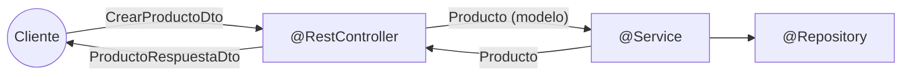

# DTO, mapeadores y validación

> Dos prácticas que separan una API de aficionado de una profesional: **no exponer tu dominio** y **no fiarte de lo que llega**. Con código completo y los casos límite que caen en el examen.

## 1. Por qué no se devuelve la entidad

```java
public record Usuario(Integer id, String email, String passwordHash,
                      String rolInterno, LocalDateTime ultimoAcceso, boolean bloqueado) {}

@GetMapping("/{id}")
// PELIGRO
public Usuario obtener(@PathVariable Integer id) { return servicio.obtener(id); }
```

Esa respuesta filtra el **hash de la contraseña**, el rol interno y si el usuario está bloqueado. Y hay tres problemas más, menos evidentes pero igual de serios:

| Problema | Consecuencia |
|---|---|
| **Acoplamiento** | Renombrar un campo del modelo rompe a todos los clientes |
| **Sin flexibilidad** | No puedes dar una vista resumida y otra detallada |
| **Sobreescritura maliciosa** | En un POST, el cliente podría enviarte `"rolInterno":"ADMIN"` |

Ese último se llama **mass assignment** y es una vulnerabilidad real: si aceptas la entidad completa en el body, el atacante rellena campos que no debería tocar.

## 2. Un DTO por dirección

```java
// dto/CrearProductoDto.java — lo que ENTRA (sin id: lo pone el servidor)
public record CrearProductoDto(String nombre, String categoria, Double precio, Integer stock) {}

// dto/ActualizarProductoDto.java — lo que se puede modificar
public record ActualizarProductoDto(String nombre, Double precio) {}

// dto/ProductoRespuestaDto.java — lo que SALE
public record ProductoRespuestaDto(Integer id, String nombre, String categoria,
                                   double precio, double precioConIva, boolean disponible) {}

// dto/ProductoResumenDto.java — vista ligera para listados
public record ProductoResumenDto(Integer id, String nombre, double precio) {}
```



**El modelo vive dentro; los DTO son la frontera.** Y fíjate en `precioConIva` y `disponible`: son **campos calculados** que no existen en el modelo. El DTO puede ofrecer al cliente exactamente lo que necesita.

## 3. Mapeadores

``` { .java .numerado }
@Component
public class ProductoMapeador {

    private final TiendaConfig config;
    public ProductoMapeador(TiendaConfig config) { this.config = config; }

    public ProductoRespuestaDto aDto(Producto p) {
        return new ProductoRespuestaDto(
            p.id(), p.nombre(), p.categoria(), p.precio(),
            redondear(p.precio() * (1 + config.iva())),      // calculado
            p.stock() > 0);                                   // calculado
    }

    public ProductoResumenDto aResumen(Producto p) {
        return new ProductoResumenDto(p.id(), p.nombre(), p.precio());
    }

    public List<ProductoRespuestaDto> aDtos(List<Producto> productos) {
        return productos.stream().map(this::aDto).toList();
    }

    public Producto aModelo(CrearProductoDto dto) {
        return new Producto(null, dto.nombre().strip(), dto.categoria().toLowerCase(),
                            dto.precio(), dto.stock());
    }

    private double redondear(double v) { return Math.round(v * 100) / 100.0; }
}
```

Fíjate: el mapeador **normaliza** (quita espacios, pasa la categoría a minúsculas). Es el sitio natural para eso.

> En proyectos grandes se automatiza con **MapStruct**, que genera este código al compilar a partir de una interfaz anotada. Para el curso lo hacemos a mano: se ve mejor qué ocurre y no hay magia que depurar.

Y el controlador queda hablando **solo** de DTO:

``` { .java .numerado }
@RestController
@RequestMapping("/api/productos")
public class ProductoControlador {

    private final ProductoServicio servicio;
    private final ProductoMapeador mapeador;

    public ProductoControlador(ProductoServicio servicio, ProductoMapeador mapeador) {
        this.servicio = servicio;
        this.mapeador = mapeador;
    }

    @GetMapping
    public List<ProductoResumenDto> listar() {
        return servicio.listar().stream().map(mapeador::aResumen).toList();
    }

    @GetMapping("/{id}")
    public ProductoRespuestaDto obtener(@PathVariable Integer id) {
        return mapeador.aDto(servicio.obtener(id));
    }

    @PostMapping
    @ResponseStatus(HttpStatus.CREATED)
    public ProductoRespuestaDto crear(@Valid @RequestBody CrearProductoDto dto) {
        return mapeador.aDto(servicio.crear(mapeador.aModelo(dto)));
    }
}
```

## 4. Bean Validation

Dependencia: `spring-boot-starter-validation`.

``` { .java .numerado }
public record CrearProductoDto(

    @NotBlank(message = "El nombre es obligatorio")
    @Size(min = 2, max = 100, message = "El nombre debe tener entre {min} y {max} caracteres")
    String nombre,

    @NotBlank(message = "La categoría es obligatoria")
    @Pattern(regexp = "movilidad|seguridad|accesorios",
             message = "Categoría no válida: use movilidad, seguridad o accesorios")
    String categoria,

    @NotNull(message = "El precio es obligatorio")
    @Positive(message = "El precio debe ser mayor que cero")
    @Digits(integer = 6, fraction = 2, message = "Máximo 6 enteros y 2 decimales")
    Double precio,

    @NotNull
    @Min(value = 0, message = "El stock no puede ser negativo")
    @Max(value = 10000, message = "Stock máximo: 10000")
    Integer stock
) {}
```

Y se **activa** con `@Valid`:

```java
@PostMapping
public ProductoRespuestaDto crear(@Valid @RequestBody CrearProductoDto dto) { }
```

!!! danger "Sin `@Valid` no se valida NADA"
    Las anotaciones del DTO son inertes por sí solas. El error más repetido del examen: DTO perfectamente anotado y un controlador que acepta datos basura porque falta `@Valid`. Si tus validaciones "no funcionan", **mira ahí primero**.

**Catálogo de anotaciones:**

| Anotación | Valida | Ojo con |
|---|---|---|
| `@NotNull` | No nulo | Deja pasar `""` |
| `@NotBlank` | Texto con contenido real | **La correcta para Strings obligatorios** |
| `@NotEmpty` | Colección/cadena no vacía | Deja pasar `"   "` |
| `@Size(min,max)` | Longitud de texto o colección |  |
| `@Min` / `@Max` | Rango numérico |  |
| `@Positive` / `@PositiveOrZero` | Signo |  |
| `@Email` | Formato de email | Permisiva: no comprueba que exista |
| `@Pattern(regexp=)` | Regex (la de la UT3) | Escapar barras: `\\d` |
| `@Past` / `@Future` | Fechas |  |
| `@Valid` en un campo | **Valida en cascada** objetos anidados |  |

**Validar listas y objetos anidados:**

```java
public record PedidoDto(
    @NotBlank String cliente,
    @NotEmpty(message = "El pedido debe tener al menos una línea")
    @Valid List<LineaDto> lineas          // @Valid propaga la validación a cada línea
) {}

public record LineaDto(@NotNull Integer productoId, @Min(1) int unidades) {}
```

**Validar parámetros sueltos** (no dentro de un DTO) requiere `@Validated` en la clase:

```java
@RestController
@Validated
public class ProductoControlador {
    @GetMapping("/buscar")
    public List<?> buscar(@RequestParam @Size(min = 3, message = "Mínimo 3 caracteres") String q) { }
}
```

## 5. Validación de formato vs. de negocio

Esta distinción cae siempre:

|  | Validación de formato | Validación de negocio |
|---|---|---|
| **Dónde** | DTO con Bean Validation | Servicio |
| **Qué comprueba** | Que el dato esté bien formado | Que la operación sea posible |
| **Necesita consultar el sistema** | No | Sí |
| **Ejemplos** | precio positivo, email con arroba, nombre no vacío | nombre duplicado, stock suficiente, sala libre |
| **Código HTTP** | 400 | 409 (conflicto) normalmente |

```java
// Formato → DTO
@Positive Double precio

// Negocio → servicio
if (repositorio.existePorNombre(p.nombre()))
    throw new ProductoDuplicadoException(p.nombre());
```

Una regla que necesita ir a la base de datos **nunca** es una anotación del DTO.

## 6. Validaciones a medida

Cuando ninguna anotación te sirve, creas la tuya:

```java
@Documented
@Constraint(validatedBy = CategoriaValidaValidador.class)
@Target({ElementType.FIELD, ElementType.RECORD_COMPONENT})
@Retention(RetentionPolicy.RUNTIME)
public @interface CategoriaValida {
    String message() default "Categoría no válida";
    Class<?>[] groups() default {};
    Class<? extends Payload>[] payload() default {};
}

public class CategoriaValidaValidador implements ConstraintValidator<CategoriaValida, String> {

    private static final Set<String> VALIDAS = Set.of("movilidad", "seguridad", "accesorios");

    @Override
    public boolean isValid(String valor, ConstraintValidatorContext ctx) {
        return valor != null && VALIDAS.contains(valor.toLowerCase());
    }
}
```

```java
public record CrearProductoDto(@NotBlank String nombre, @CategoriaValida String categoria, ...) {}
```

---

## Pruébalo ahora (25 min)

!!! reto "Trabaja tú ahora"
    Este bloque se hace **en clase, en tu equipo**. No se entrega ni puntúa: es la práctica que hace que el examen te salga.

1. Crea los cuatro DTO y el mapeador; cambia el controlador para que solo hable de DTO.
2. Añade `@Valid` y comprueba los casos:

```bash
# Correcto → 201, y fíjate en precioConIva y disponible (¡campos calculados!)
curl -s -X POST localhost:8080/api/productos -H "Content-Type: application/json" \
  -d '{"nombre":"Candado","categoria":"seguridad","precio":25.0,"stock":10}' | jq

# MAL  Nombre vacío → 400
curl -i -X POST localhost:8080/api/productos -H "Content-Type: application/json" \
  -d '{"nombre":"","categoria":"seguridad","precio":25.0,"stock":10}'

# MAL  Categoría inventada → 400 (por el @Pattern)
curl -i -X POST localhost:8080/api/productos -H "Content-Type: application/json" \
  -d '{"nombre":"X","categoria":"vehiculos","precio":25.0,"stock":10}'

# MAL  Varios errores a la vez → 400 con TODOS los campos
curl -i -X POST localhost:8080/api/productos -H "Content-Type: application/json" \
  -d '{"nombre":"","categoria":"nope","precio":-5,"stock":-1}'

# El experimento clave: quita @Valid del controlador, reinicia y repite
#    el último comando. Ahora pasa. Vuelve a ponerlo.
```

1. Comprueba que el **modelo ya no se filtra**: el listado debe devolver `ProductoResumenDto` (sin stock ni categoría) y el detalle `ProductoRespuestaDto` (con `precioConIva`).
2. Crea la anotación `@CategoriaValida` y sustituye el `@Pattern`.

---

## Ejercicios (con solución)

### Ejercicio 1 — Detecta la fuga

```java
public record Cliente(Integer id, String nombre, String email, String dni,
                      String iban, boolean moroso, String notasInternas) {}

@GetMapping("/{id}")
public Cliente obtener(@PathVariable Integer id) { return servicio.obtener(id); }
```

??? success "Solución"

    Expone DNI, IBAN, marca de moroso y notas internas a cualquiera que llame a la API: fuga de datos personales con implicaciones legales (RGPD), no solo técnicas. Solución: `ClienteRespuestaDto(Integer id, String nombre, String email)`. Y si el propio cliente consulta sus datos, un DTO distinto con lo que sí puede ver.


### Ejercicio 2 — Mass assignment

```java
@PostMapping("/usuarios")
public Usuario crear(@RequestBody Usuario usuario) { return servicio.crear(usuario); }
```

Un atacante envía: {"email":"malo@x.com","nombre":"X","rolInterno":"ADMIN","bloqueado":false}. ¿Qué ocurre y cómo se evita?

??? success "Solución"

    Jackson rellena todos los campos de la entidad, incluido `rolInterno`: el atacante se ha creado una cuenta de administrador. Se evita con un DTO de entrada que solo declare los campos que el cliente puede fijar:
    ```java
    public record RegistroUsuarioDto(@NotBlank @Email String email,
                                     @NotBlank String nombre,
                                     @NotBlank @Size(min=8) String password) {}
    ```

    El rol lo asigna el servicio, no el cliente. Es una vulnerabilidad real y frecuente.


### Ejercicio 3 — ¿Qué anotación?

(a) email obligatorio y con formato · (b) edad 18-120 · (c) nombre no vacío ni solo espacios · (d) fecha de nacimiento pasada · (e) DNI 8 dígitos + letra · (f) lista con al menos un elemento · (g) que cada elemento de la lista se valide también.

??? success "Solución"

    (a) `@NotBlank @Email` · (b) `@Min(18) @Max(120)` · (c) `@NotBlank` · (d) `@Past` · (e) `@Pattern(regexp="^\\d{8}[A-Z]$")` · (f) `@NotEmpty` · (g) `@Valid` sobre la lista.


### Ejercicio 4 — Formato o negocio

Clasifica y di dónde va cada una: (a) el precio debe ser positivo · (b) no puede haber dos productos con el mismo nombre · (c) el email debe tener arroba · (d) no se puede vender más stock del disponible · (e) la fecha de fin debe ser posterior a la de inicio · (f) el usuario debe tener saldo suficiente.

??? success "Solución"

    Formato (DTO): (a), (c). Negocio (servicio): (b), (d), (f) — todas necesitan consultar el estado del sistema. Caso especial (e): es una validación entre campos del mismo DTO; se puede hacer con una anotación a nivel de clase (validador propio que recibe el DTO entero) o en el servicio. En el examen, cualquiera de las dos se acepta si está justificada.


### Ejercicio 5 — Diseña los DTO

Endpoint de registro de usuario: el cliente envía email, nombre y contraseña; la respuesta nunca incluye la contraseña ni el rol interno; y hay un endpoint de administración que sí muestra el rol y la fecha de alta.

??? success "Solución"

    ```java
    // Entrada
    public record RegistroUsuarioDto(
        @NotBlank @Email String email,
        @NotBlank @Size(min = 2, max = 50) String nombre,
        @NotBlank @Size(min = 8, message = "Mínimo 8 caracteres") String password) {}

    // Salida pública
    public record UsuarioRespuestaDto(Integer id, String email, String nombre) {}

    // Salida para administración
    public record UsuarioAdminDto(Integer id, String email, String nombre,
                                  String rol, LocalDateTime alta, boolean bloqueado) {}
    ```

    Tres DTO para una misma entidad: cada uno expone lo que corresponde a su consumidor. Eso es imposible devolviendo el modelo.

