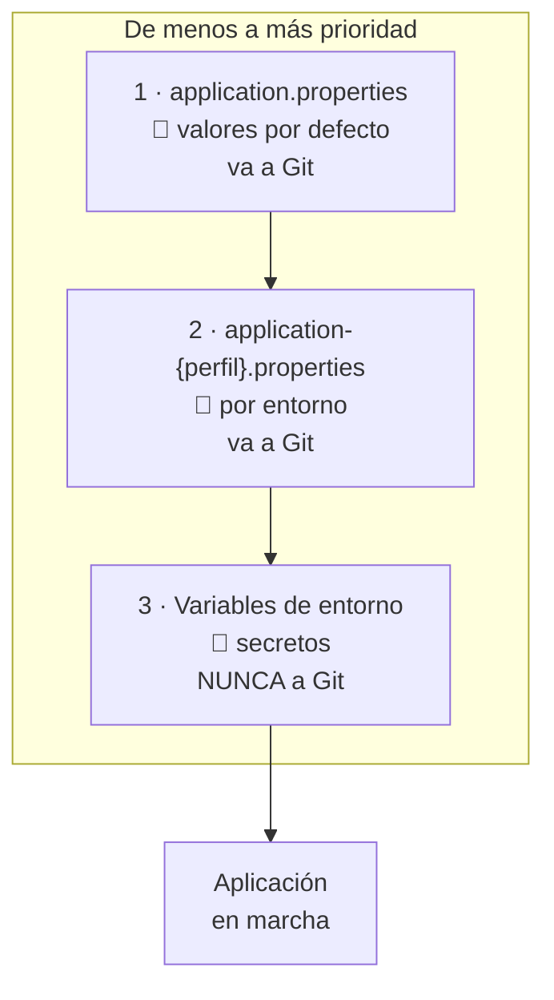
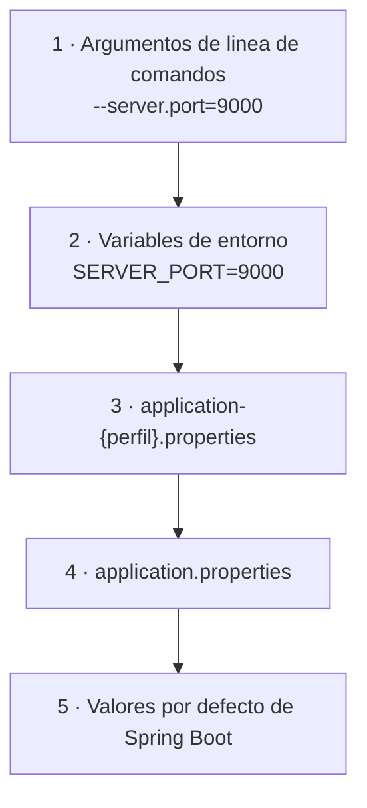

# 5. Configuración y variables de entorno

Todo lo que cambia entre tu portátil y el servidor —el puerto, la base de datos, las contraseñas— **no se escribe en el código**. Este tema va de dónde se escribe.

!!! quote "Sobre este tema"
    Apartado propio de este curso, construido sobre los apartados *4.1.3. Parametrizando la aplicación* del material de [José Luis González Sánchez](https://github.com/joseluisgs) y su tema `springboot/14-Perfiles.md`, licenciado [CC BY-NC-SA 4.0](http://creativecommons.org/licenses/by-nc-sa/4.0/).

!!! danger "La regla de la que sale todo lo demás"
    **El mismo `.jar` tiene que poder arrancar en desarrollo, en preproducción y en producción sin recompilarse.**

    Si para desplegar hay que cambiar una línea y volver a compilar, no tienes un artefacto: tienes tres programas distintos que se parecen. Y el que has probado no es el que has desplegado.

---

## 5.1. Los tres sitios donde vive la configuración



| | Qué va aquí | ¿A Git? |
|---|---|---|
| `application.properties` | Lo común y los valores por defecto | **Sí** |
| `application-dev.properties` | Lo de desarrollo: H2, logs en DEBUG | **Sí** |
| `application-prod.properties` | Lo de producción, **con huecos** | **Sí** |
| Variables de entorno / `.env` | Contraseñas, tokens, claves | **Nunca** |

La clave está en la tercera fila: el fichero de producción va a Git **porque no contiene secretos**, solo referencias a ellos.

---

## 5.2. `application.properties`

El fichero vive en `src/main/resources/` y se lee al arrancar.

```properties title="src/main/resources/application.properties"
spring.application.name=funkos-api

### Servidor
server.port=${PORT:8080}

### Rutas de la API
api.path=/api
api.version=v1

### Errores
server.error.include-message=always
server.error.include-binding-errors=always
server.error.include-stacktrace=never

### Compresion de respuestas
server.compression.enabled=true
server.compression.mime-types=application/json,text/html,text/plain
server.compression.min-response-size=1024

### Tamaño maximo de subida
spring.servlet.multipart.max-file-size=10MB
spring.servlet.multipart.max-request-size=10MB

### Locale
spring.web.locale=es_ES
spring.web.locale-resolver=fixed

### Perfil activo
spring.profiles.active=${SPRING_PROFILES_ACTIVE:dev}
```

### La sintaxis `${VARIABLE:defecto}`

Es la pieza central de todo el tema:

```properties
server.port=${PORT:8080}
```

Se lee: **«coge el valor de la variable de entorno `PORT`; si no existe, usa `8080`»**.

```bash
./mvnw spring-boot:run          # arranca en 8080
PORT=9000 ./mvnw spring-boot:run # arranca en 9000
```

!!! success "Por qué esto resuelve el problema entero"
    | | Sin `${}` | Con `${}` |
    |---|---|---|
    | Cambiar el puerto | editar el fichero y recompilar | `PORT=9000` |
    | Dos entornos | dos ficheros distintos | **un solo `.jar`** |
    | Contraseña en Git | sí, inevitablemente | **no aparece** |

    Y si el valor por defecto es razonable, el proyecto **arranca recién clonado** sin configurar nada. Eso es lo que quieres para el primer día de clase.

!!! warning "Sin el valor por defecto, falla al arrancar"
    ```properties
    datasource.password=${DB_PASSWORD}
    ```

    Si `DB_PASSWORD` no existe:

    ```
    Could not resolve placeholder 'DB_PASSWORD' in value "${DB_PASSWORD}"
    ```

    **Y eso suele ser lo correcto.** Para un secreto, es mejor no arrancar que arrancar con una contraseña por defecto que alguien se dejó puesta. Pon valor por defecto en lo inocuo (puertos, rutas, tamaños) y déjalo vacío en lo sensible.

### `.properties` o `.yml`

Spring Boot acepta los dos. Son equivalentes:

=== ".properties"

    ```properties
    server.port=8080
    server.compression.enabled=true
    spring.datasource.url=jdbc:h2:mem:funkos
    spring.datasource.username=sa
    logging.level.es.iesx.funkos=DEBUG
    ```

=== ".yml"

    ```yaml
    server:
      port: 8080
      compression:
        enabled: true

    spring:
      datasource:
        url: jdbc:h2:mem:funkos
        username: sa

    logging:
      level:
        es.iesx.funkos: DEBUG
    ```

!!! info "Cuál usar"
    **`.properties` en este módulo**, porque cada línea es autocontenida: puedes copiar una línea de la documentación y pegarla sin pensar en la indentación.

    `.yml` se lee mejor cuando hay mucha jerarquía, pero un espacio de más rompe el fichero y el error que sale no siempre señala la línea culpable. Si lo usas, **nunca tabuladores**: YAML solo admite espacios.

    No tengas los dos a la vez en el mismo proyecto: `.properties` gana y el `.yml` se ignora en silencio.

---

## 5.3. Perfiles

Un perfil es un fichero extra que **se suma** al principal y lo pisa donde coincidan las claves.

```
src/main/resources/
├── application.properties          ← se lee SIEMPRE
├── application-dev.properties      ← solo con el perfil dev
├── application-prod.properties     ← solo con el perfil prod
└── application-test.properties     ← solo en los tests
```

=== "dev"

    ```properties title="application-dev.properties"
    ### Base de datos en memoria: se borra al parar
    spring.datasource.url=jdbc:h2:mem:funkos
    spring.datasource.username=sa
    spring.datasource.password=
    spring.h2.console.enabled=true
    spring.jpa.hibernate.ddl-auto=create-drop
    spring.jpa.show-sql=true

    ### Logs hablando
    logging.level.es.iesx.funkos=DEBUG
    logging.level.org.springframework.web=DEBUG

    ### Errores con todo el detalle
    server.error.include-message=always
    server.error.include-stacktrace=on_param
    ```

=== "prod"

    ```properties title="application-prod.properties"
    ### Base de datos real, por variables de entorno
    spring.datasource.url=${DB_URL}
    spring.datasource.username=${DB_USER}
    spring.datasource.password=${DB_PASSWORD}
    spring.jpa.hibernate.ddl-auto=validate
    spring.jpa.show-sql=false

    ### Logs callados
    logging.level.root=WARN
    logging.level.es.iesx.funkos=INFO
    logging.file.name=/var/log/funkos-api/app.log

    ### Errores sin filtrar informacion
    server.error.include-message=never
    server.error.include-stacktrace=never

    ### Consola H2 cerrada
    spring.h2.console.enabled=false
    ```

=== "test"

    ```properties title="application-test.properties"
    spring.datasource.url=jdbc:h2:mem:test;DB_CLOSE_DELAY=-1
    spring.jpa.hibernate.ddl-auto=create-drop
    logging.level.root=WARN
    ```

Activarlo:

```bash
# Al ejecutar el jar
java -jar -Dspring.profiles.active=prod funkos-api-1.0.0.jar

# Por variable de entorno (lo habitual en un servidor o en Docker)
SPRING_PROFILES_ACTIVE=prod java -jar funkos-api-1.0.0.jar

# En desarrollo con Maven
./mvnw spring-boot:run -Dspring-boot.run.profiles=dev
```

Y en un test:

```java
@SpringBootTest
@ActiveProfiles("test")
class FunkosRestControllerTest { … }
```

!!! danger "Las tres diferencias entre `dev` y `prod` que no son opcionales"
    | | dev | prod | Por qué |
    |---|---|---|---|
    | `ddl-auto` | `create-drop` | **`validate`** | `create-drop` **borra la base de datos al arrancar**. En producción, eso es el peor día de tu vida |
    | `include-stacktrace` | `on_param` | **`never`** | Una traza revela framework, versiones, librerías y nombres de clases y tablas |
    | `h2.console.enabled` | `true` | **`false`** | Es una consola SQL abierta en tu servidor |

    La primera fila es la que se lleva proyectos por delante.

!!! tip "Varios perfiles a la vez"
    ```bash
    SPRING_PROFILES_ACTIVE=prod,metricas java -jar app.jar
    ```

    Se aplican **en orden**: `prod` primero, `metricas` después, y el último gana donde coincidan. Sirve para activar funcionalidades sueltas sin duplicar el fichero entero.

### Beans por perfil

Los perfiles no solo cambian propiedades: también deciden **qué beans existen**.

```java
@Configuration
public class FunkosConfig {

    /** Datos de ejemplo: solo en desarrollo. */
    @Bean
    @Profile("dev")
    public CommandLineRunner datosIniciales(FunkosService servicio) {
        return args -> {
            servicio.save(new FunkoCreateRequest("Mickey Mouse", 15.99, 10, null, "DISNEY"));
            servicio.save(new FunkoCreateRequest("Spider-Man",   19.99,  5, null, "MARVEL"));
        };
    }

    /** En desarrollo, los correos se imprimen por consola. */
    @Bean
    @Profile("dev")
    public Notificador notificadorFalso() {
        return (destino, mensaje) -> System.out.println("[FALSO] " + destino + ": " + mensaje);
    }

    /** En producción, se mandan de verdad. */
    @Bean
    @Profile("prod")
    public Notificador notificadorSmtp(JavaMailSender sender) {
        return new NotificadorSmtp(sender);
    }
}
```

!!! success "Esto es la interfaz de la UT2 cerrando el círculo"
    El mismo `Notificador` del `ServicioPedidos`, con **Spring eligiendo la implementación según el entorno**. El servicio no cambia; cambia quién le inyectan.

    Sin el `@Profile("dev")` del `CommandLineRunner`, tu API de producción arranca con dos funkos inventados dentro. Pasa más de lo que parece.

---

## 5.4. Variables de entorno

Son la capa de arriba: **pisan a todo lo demás** y no están en ningún fichero del repositorio.

### Cómo se traducen los nombres

Spring aplica *relaxed binding*: una propiedad `spring.datasource.password` se puede dar como variable de entorno `SPRING_DATASOURCE_PASSWORD`.

| Propiedad | Variable de entorno |
|---|---|
| `server.port` | `SERVER_PORT` |
| `spring.datasource.url` | `SPRING_DATASOURCE_URL` |
| `spring.profiles.active` | `SPRING_PROFILES_ACTIVE` |
| `api.version` | `API_VERSION` |
| `jwt.secret-key` | `JWT_SECRETKEY` o `JWT_SECRET_KEY` |

**La regla:** mayúsculas, y los puntos y guiones a `_`.

!!! tip "Esto significa que puedes sobrescribir cualquier propiedad sin tocar nada"
    ```bash
    SERVER_PORT=9000 \
    LOGGING_LEVEL_ES_IESX_FUNKOS=TRACE \
    java -jar funkos-api-1.0.0.jar
    ```

    No hace falta que la propiedad esté escrita con `${}` en el fichero: **toda** propiedad de Spring se puede pisar así. El `${}` solo sirve para darle un valor por defecto explícito.

### El orden de prioridad



**Gana el de arriba.** Así que un `--server.port=9000` en la línea de comandos pisa la variable de entorno, que pisa el perfil, que pisa el fichero principal.

!!! info "El orden real tiene 17 niveles"
    Esos cinco son los que se usan. La [lista completa](https://docs.spring.io/spring-boot/reference/features/external-config.html) incluye JNDI, `ServletConfig`, Spring Cloud Config y unos cuantos más que no vas a ver en el módulo.

    Lo que hay que retener: **cuanto más cerca del arranque concreto, más prioridad**. El fichero es lo genérico; la línea de comandos, lo específico de este arranque.

---

## 5.5. El fichero `.env`

Un `.env` es un fichero de texto con `CLAVE=valor` que **no se sube a Git** y que sirve para tener tus secretos de desarrollo a mano sin escribirlos en el `application.properties`.

```bash title=".env  ← NUNCA a Git"
# Base de datos
DB_URL=jdbc:mysql://localhost:3306/funkos
DB_USER=funkouser
DB_PASSWORD=unaContraseñaDeVerdad

# API
PORT=8080
SPRING_PROFILES_ACTIVE=dev

# Secretos
JWT_SECRET=clave-larga-y-aleatoria-de-al-menos-32-caracteres
```

```bash title=".env.example  ← SÍ va a Git"
# Copia este fichero a .env y rellena los valores
DB_URL=jdbc:mysql://localhost:3306/funkos
DB_USER=
DB_PASSWORD=
PORT=8080
SPRING_PROFILES_ACTIVE=dev
JWT_SECRET=
```

```gitignore title=".gitignore"
# Secretos
.env
.env.local
*.env
!.env.example

# Build
target/
*.log
```

!!! success "El patrón `.env` + `.env.example`"
    - **`.env`** tiene los valores reales y está en `.gitignore`.
    - **`.env.example`** tiene las mismas claves **vacías** y sí va a Git.

    Quien clona el repositorio hace `cp .env.example .env`, rellena, y arranca. Y nadie tiene que preguntar por el chat del grupo «¿qué variables hacen falta?», que es cómo las contraseñas acaban en un historial de mensajes.

    En las [rúbricas de la UT4 a la UT6](retos.md) esto se puntúa.

### Hacer que Spring Boot lo lea

Spring Boot **no lee `.env` por sí solo**. Tres formas, de menos a más:

=== "1 · A mano en la terminal"

    ```bash
    # Carga el .env en el entorno de este comando
    export $(grep -v '^#' .env | xargs)
    ./mvnw spring-boot:run
    ```

    Cero dependencias. Para probar algo rápido, sobra.

=== "2 · IntelliJ (lo habitual en clase)"

    **Run → Edit Configurations → Environment variables**, y pegas:

    ```
    DB_URL=jdbc:mysql://localhost:3306/funkos;DB_USER=funkouser;DB_PASSWORD=...
    ```

    O mejor, con el plugin **EnvFile** marcas el `.env` y lo carga él.

    La configuración de ejecución es local: no se sube al repositorio.

=== "3 · Docker Compose (como en producción)"

    ```yaml title="compose.yaml"
    services:
      api:
        build: .
        ports: ["${PORT:-8080}:8080"]
        env_file: .env            # ← aquí
        environment:
          SPRING_PROFILES_ACTIVE: prod
        depends_on:
          db:
            condition: service_healthy

      db:
        image: mysql:8.4
        environment:
          MYSQL_ROOT_PASSWORD: ${DB_ROOT_PASSWORD}
          MYSQL_DATABASE: funkos
          MYSQL_USER: ${DB_USER}
          MYSQL_PASSWORD: ${DB_PASSWORD}
        volumes: [dbdata:/var/lib/mysql]
        healthcheck:
          test: ["CMD", "mysqladmin", "ping", "-h", "localhost"]
          interval: 5s
          retries: 10

    volumes:
      dbdata:
    ```

    ```bash
    docker compose up -d
    ```

    **`env_file: .env`** y ya: Compose las mete como variables de entorno del contenedor, y Spring Boot las encuentra por el *relaxed binding* del apartado anterior. Es el mismo mecanismo del `docker compose` de MySQL de la [UT3](../ut3/03-base-de-datos.md).

!!! danger "Si una contraseña llega a Git, cambiarla no basta"
    Borrar la línea y hacer commit **no la quita del historial**: sigue en el commit anterior, y cualquiera con acceso al repositorio la encuentra con `git log -p`.

    Lo que hay que hacer es **rotar el secreto**: cambiar la contraseña en el servidor. El valor que se filtró ya no vale para nada. Limpiar el historial (`git filter-repo`) es opcional y reescribe todos los hashes; rotar es obligatorio.

    Y en GitHub público, los bots que rastrean claves de AWS tardan **minutos**, no días.

---

## 5.6. Leer la configuración desde el código

### `@Value` para un valor suelto

```java
@RestController
public class InfoController {

    @Value("${api.version:v1}")
    private String version;

    @Value("${spring.application.name}")
    private String nombre;

    @GetMapping("/info")
    public Map<String, String> info() {
        return Map.of("app", nombre, "version", version);
    }
}
```

### `@ConfigurationProperties` para un grupo

```properties
funkos.upload.directorio=uploads
funkos.upload.tamano-maximo=10485760
funkos.upload.extensiones-permitidas=png,jpg,webp
funkos.paginacion.tamano-por-defecto=20
```

```java
@ConfigurationProperties(prefix = "funkos")
public record FunkosProperties(Upload upload, Paginacion paginacion) {

    public record Upload(
            String directorio,
            long tamanoMaximo,
            List<String> extensionesPermitidas) {}

    public record Paginacion(int tamanoPorDefecto) {}
}
```

```java
@SpringBootApplication
@EnableConfigurationProperties(FunkosProperties.class)
public class FunkosApiApplication { … }
```

```java
@Service
public class AlmacenamientoService {
    private final FunkosProperties props;

    public AlmacenamientoService(FunkosProperties props) {
        this.props = props;
    }

    public void guardar(MultipartFile f) {
        if (f.getSize() > props.upload().tamanoMaximo())
            throw new FunkoBadRequestException("El fichero es demasiado grande");
        // ...
    }
}
```

!!! success "Cuál de los dos, y por qué importa"
    | | `@Value` | `@ConfigurationProperties` |
    |---|---|---|
    | Para | Uno o dos valores | Un grupo con prefijo común |
    | Tipado | `String` casi siempre | Tipos reales, listas, anidado |
    | Si falta la propiedad | Falla **al arrancar** si no hay defecto | Falla **al arrancar**, y se puede validar con `@Valid` |
    | Se puede inyectar en un test | Mal: hace falta el contexto | **Sí**: `new FunkosProperties(...)` |
    | Autocompletado en el IDE | No | Sí |

    La fila que decide es la penúltima: con `@ConfigurationProperties` y un `record`, la configuración es **un objeto normal** que puedes construir a mano en un test. Con `@Value` necesitas levantar Spring.

    Nota el nombre: `tamano-maximo` en el fichero → `tamanoMaximo` en el record. Spring hace esa traducción (*kebab-case* a *camelCase*) él solo.

!!! warning "`@Value` en un campo tiene el problema de siempre"
    Es inyección por campo: el valor no está disponible en el constructor, así que no puedes validarlo ahí ni hacer el campo `final`. Si lo necesitas en el constructor:

    ```java
    public InfoController(@Value("${api.version:v1}") String version) {
        this.version = version;
    }
    ```

---

## Pruébalo ahora (15 min)

Sobre el [proyecto del tema 4](04-proyecto-completo.md):

1. Arranca con `PORT=9999` y comprueba el puerto.
2. Crea `application-prod.properties` con `logging.level.root=WARN` y arranca con el perfil `prod`. ¿Se cargan los cuatro funkos de ejemplo?
3. Pon `datasource.password=${DB_PASSWORD}` sin valor por defecto y arranca. Lee el error.
4. Arranca con `--server.port=7777` **y** `SERVER_PORT=8888` a la vez. ¿Qué puerto gana?
5. Crea un `.env`, añádelo al `.gitignore`, haz `export $(grep -v '^#' .env | xargs)` y arranca.

??? success "Solución de las cinco"

    **1.**

    ```bash
    PORT=9999 ./mvnw spring-boot:run
    # Tomcat started on port 9999 (http)
    ```

    El `${PORT:8080}` del fichero ha encontrado la variable y ha usado su valor.

    **2.** **No se cargan.** El `CommandLineRunner` lleva `@Profile("dev")`, así que con `prod` activo ese bean no se crea y la API arranca vacía. Que es justo lo que quieres.

    **3.**

    ```
    java.lang.IllegalArgumentException: Could not resolve placeholder
    'DB_PASSWORD' in value "${DB_PASSWORD}"
    ```

    **La aplicación no arranca**, y está bien: mejor eso que arrancar con una contraseña vacía o con una por defecto que alguien dejó puesta.

    **4.** Gana **7777**, el argumento de línea de comandos. Es el nivel 1 de la pirámide; la variable de entorno es el 2.

    **5.** Arranca igual que en el punto 1, pero sin escribir las variables en el comando. Comprueba que funciona:

    ```bash
    git status --short      # el .env NO debe aparecer
    ```

    Si aparece, el `.gitignore` está mal escrito o el fichero ya estaba *trackeado* (entonces: `git rm --cached .env`).

---

## Ejercicios (con solución)

### E1 — `${VAR:defecto}`

¿Qué hace cada una y cuándo usarías cada forma?

```properties
a=${PORT:8080}
b=${DB_PASSWORD}
```

??? success "Solución"

    - **(a)** Coge `PORT` del entorno; si no existe, usa `8080`. La aplicación **arranca siempre**.
    - **(b)** Coge `DB_PASSWORD`; si no existe, **la aplicación no arranca**.

    **El criterio:** valor por defecto en lo **inocuo** (puertos, rutas, tamaños, niveles de log), para que el proyecto funcione recién clonado. Sin valor por defecto en lo **sensible** (contraseñas, claves, tokens), para que un despliegue mal configurado falle en el arranque y no en silencio.

    Arrancar con una contraseña por defecto es peor que no arrancar.

### E2 — Quién gana

Tienes `server.port=8080` en `application.properties`, `server.port=9090` en `application-prod.properties`, `SERVER_PORT=7070` en el entorno, y arrancas con `--server.port=6060 --spring.profiles.active=prod`. ¿Qué puerto?

??? success "Solución"

    **6060.**

    ```
    1. --server.port=6060              ← gana
    2. SERVER_PORT=7070
    3. application-prod.properties     9090
    4. application.properties          8080
    ```

    La idea de fondo: **cuanto más específico de este arranque concreto, más prioridad**. Un argumento de línea de comandos se refiere a *esta* ejecución; el fichero es lo genérico del proyecto.

### E3 — Qué va a Git

Clasifica: (a) `application.properties` · (b) `application-prod.properties` · (c) `.env` · (d) `.env.example` · (e) `compose.yaml` · (f) `target/`

??? success "Solución"

    | | ¿A Git? | Por qué |
    |---|:-:|---|
    | (a) `application.properties` | **Sí** | Configuración común, sin secretos |
    | (b) `application-prod.properties` | **Sí** | Solo tiene `${DB_PASSWORD}`, no la contraseña |
    | (c) `.env` | **No** | Secretos reales |
    | (d) `.env.example` | **Sí** | Claves vacías: documenta qué hace falta |
    | (e) `compose.yaml` | **Sí** | Referencia a `.env`, sin valores |
    | (f) `target/` | **No** | Se regenera con `mvn package` |

    La (b) es la que sorprende, y es el punto del tema: **el fichero de producción se puede publicar porque no contiene producción**, solo describe qué variables necesita.

### E4 — `ddl-auto`

¿Por qué `create-drop` en `dev` y `validate` en `prod`?

??? success "Solución"

    - **`create-drop`**: Hibernate **borra y recrea** el esquema al arrancar y lo borra al parar. En desarrollo es ideal: cambias una entidad y la tabla se adapta sin migraciones.
    - **`validate`**: solo **comprueba** que el esquema coincide con las entidades. Si no coincide, **no arranca**, que es exactamente lo que quieres: te avisa antes de empezar a escribir datos en una tabla equivocada.

    Y lo que nunca: **`create-drop` en producción borra la base de datos entera cada vez que se reinicia la aplicación**. Tampoco `update`: aplica cambios de esquema adivinando, sin control ni vuelta atrás.

    (Lo verás a fondo en la [UT5](../ut5/index.md); el patrón de configuración se decide aquí.)

### E5 — `@Value` o `@ConfigurationProperties`

Necesitas leer `funkos.upload.directorio`, `funkos.upload.tamano-maximo` y `funkos.upload.extensiones-permitidas`. ¿Cuál usas?

??? success "Solución"

    **`@ConfigurationProperties`**, por tres razones concretas:

    1. **Tipado de verdad.** `extensiones-permitidas=png,jpg,webp` llega como `List<String>`; con `@Value` llega como `String` y lo partes tú.
    2. **Agrupado.** Un objeto que se inyecta entero en vez de tres campos sueltos repartidos por la clase.
    3. **Testeable.** `new FunkosProperties(new Upload("uploads", 1024, List.of("png")), …)` y pruebas el servicio sin levantar Spring.

    `@Value` se queda para lo suelto: la versión de la API en un endpoint `/info`, y poco más.

### E6 — El secreto en el historial

Un compañero ha subido el `.env` con la contraseña de la base de datos. Lo borra y hace commit. ¿Está resuelto?

??? success "Solución"

    **No.** El fichero ya no está en la última versión, pero **sigue en el historial**: `git log -p` lo muestra, y cualquiera con acceso al repositorio lo encuentra.

    Lo que hay que hacer, en este orden:

    1. **Rotar el secreto**: cambiar esa contraseña en la base de datos. El valor filtrado deja de servir. **Esto es lo obligatorio.**
    2. Añadir `.env` al `.gitignore` y `git rm --cached .env`.
    3. Opcionalmente, limpiar el historial con `git filter-repo`. Reescribe todos los hashes y obliga a todo el equipo a reclonar, así que solo vale la pena en un repositorio público reciente.

    El orden importa: rotar primero. Mientras la contraseña siga siendo válida, limpiar el historial solo la esconde.

    Y si el repositorio es público en GitHub, asume que ya la tiene alguien: hay bots rastreando commits en busca de claves, y tardan minutos.
