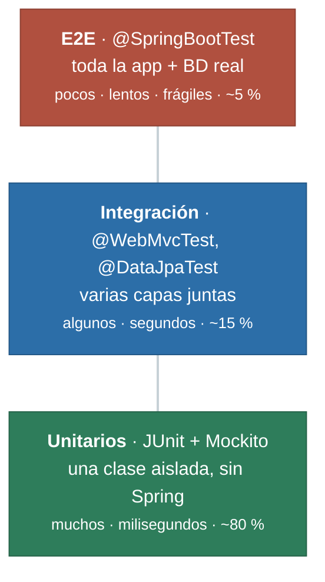

# Testing en Spring Boot

> «No tengo tiempo de escribir tests» significa, en la práctica, «tengo tiempo de arreglar el mismo bug tres veces». En 2026 ninguna empresa acepta un backend sin tests.

## 1. La pirámide de tests



Las líneas **no son flujo**: son niveles. Lo que dice la pirámide es la **proporción**. Si tu suite tiene tres tests de integración y ninguno unitario, está invertida: tarda minutos, y cuando algo falla no sabes dónde.

| Nivel | Qué arranca | Velocidad | Qué detecta |
|---|---|---|---|
| Unitario | Nada de Spring | ~1 ms | Errores de lógica |
| Slice (`@WebMvcTest`) | Solo la capa web | ~1 s | Rutas, JSON, códigos HTTP, validación |
| Integración (`@SpringBootTest`) | La aplicación entera | ~5 s | Cableado, configuración, transacciones |

Regla práctica: **muchos unitarios, algunos de slice, poquísimos completos**.

## 2. Test unitario del servicio con Mockito

El servicio depende del repositorio. No queremos el repositorio real: queremos un **doble** que responda lo que nos convenga.

``` { .java .numerado }
@ExtendWith(MockitoExtension.class)
class ProductoServicioTest {

    @Mock  ProductoRepositorio repositorio;      // doble
    @InjectMocks ProductoServicio servicio;  // clase bajo prueba, con el doble dentro

    @Test
    @DisplayName("obtener() devuelve el producto cuando existe")
    void obtenerExistente() {
        var p = new Producto(1, "Casco", "seguridad", 49.99, 10);
        when(repositorio.buscarPorId(1)).thenReturn(Optional.of(p));

        var resultado = servicio.obtener(1);

        assertThat(resultado.nombre()).isEqualTo("Casco");
        verify(repositorio).buscarPorId(1);
    }

    @Test
    @DisplayName("obtener() lanza 404 cuando no existe")
    void obtenerInexistente() {
        when(repositorio.buscarPorId(99)).thenReturn(Optional.empty());

        assertThatThrownBy(() -> servicio.obtener(99))
            .isInstanceOf(ProductoNoEncontradoException.class)
            .hasMessageContaining("99");
    }

    @Test
    @DisplayName("crear() rechaza nombres duplicados")
    void crearDuplicado() {
        when(repositorio.existePorNombre("Casco")).thenReturn(true);

        assertThatThrownBy(() -> servicio.crear(new Producto(null, "Casco", "seguridad", 10.0, 1)))
            .isInstanceOf(ProductoDuplicadoException.class);

        verify(repositorio, never()).guardar(any());   // ¡no debe llegar a guardar!
    }
}
```

### El vocabulario de Mockito

```java
when(mock.metodo(arg)).thenReturn(valor);            // programar respuesta
when(mock.metodo(any())).thenThrow(new X());         // programar excepción
verify(mock).metodo(arg);                            // se llamó exactamente 1 vez
verify(mock, times(3)).metodo(any());                // se llamó 3 veces
verify(mock, never()).borrar(any());                 // NO se llamó
verifyNoInteractions(mock);                          // no se tocó en absoluto
```

**Matchers**: `any()`, `anyInt()`, `eq("Casco")`, `argThat(p -> p.precio() > 0)`.
:material-alert: Si usas un matcher en un argumento, **todos** deben ser matchers: `verify(r).guardar(eq(1), any())`, nunca `verify(r).guardar(1, any())`.

### ArgumentCaptor: inspeccionar lo que se guardó

A veces no basta con saber que se llamó: quieres ver **con qué**.

```java
@Test
void crearNormalizaElNombre() {
    when(repositorio.existePorNombre(any())).thenReturn(false);
    when(repositorio.guardar(any())).thenAnswer(inv -> inv.getArgument(0));

    servicio.crear(new Producto(null, "  casco integral  ", "seguridad", 49.9, 5));

    var captor = ArgumentCaptor.forClass(Producto.class);
    verify(repositorio).guardar(captor.capture());
    // trim + capitalizado
    assertThat(captor.getValue().nombre()).isEqualTo("Casco integral");
}
```

### Tests parametrizados: un test, muchos casos

```java
@ParameterizedTest(name = "precio {0} → inválido")
@ValueSource(doubles = {0.0, -1.0, -99.99})
void rechazaPreciosNoPositivos(double precio) {
    assertThatThrownBy(() -> servicio.crear(new Producto(null, "X", "seguridad", precio, 1)))
        .isInstanceOf(DatosInvalidosException.class);
}

@ParameterizedTest
@CsvSource({
    "10, 5, true",     // stock 10, piden 5 → hay
    "10, 10, true",    // justo
    "10, 11, false"    // no llega
})
void hayStock(int stock, int piden, boolean esperado) {
    var p = new Producto(1, "X", "seguridad", 10.0, stock);
    assertThat(p.hayStock(piden)).isEqualTo(esperado);
}
```

## 3. Test de la capa web con `@WebMvcTest`

Arranca **solo** el controlador, el `DispatcherServlet` y Jackson. El servicio se sustituye por un mock. No hay base de datos ni servidor real, y tarda milisegundos.

``` { .java .numerado }
@WebMvcTest(ProductoControlador.class)
class ProductoControladorTest {

    @Autowired MockMvc mockMvc;
    @Autowired ObjectMapper mapper;
    @MockitoBean ProductoServicio servicio;        // mock registrado como bean

    @Test
    void getDevuelve200YElJson() throws Exception {
        when(servicio.obtener(1))
            .thenReturn(new Producto(1, "Casco", "seguridad", 49.99, 10));

        mockMvc.perform(get("/api/productos/1"))
            .andExpect(status().isOk())
            .andExpect(content().contentType(MediaType.APPLICATION_JSON))
            .andExpect(jsonPath("$.id").value(1))
            .andExpect(jsonPath("$.nombre").value("Casco"))
            .andExpect(jsonPath("$.precioConIva").value(60.49));
    }

    @Test
    void getInexistenteDevuelve404ConProblemDetail() throws Exception {
        when(servicio.obtener(99)).thenThrow(new ProductoNoEncontradoException(99));

        mockMvc.perform(get("/api/productos/99"))
            .andExpect(status().isNotFound())
            .andExpect(jsonPath("$.title").value("Recurso no encontrado"))
            .andExpect(jsonPath("$.status").value(404));
    }

    @Test
    void postValidoDevuelve201YLocation() throws Exception {
        var dto = new CrearProductoDto("Casco", "seguridad", 49.99, 10);
        when(servicio.crear(any())).thenReturn(new Producto(7, "Casco", "seguridad", 49.99, 10));

        mockMvc.perform(post("/api/productos")
                .contentType(MediaType.APPLICATION_JSON)
                .content(mapper.writeValueAsString(dto)))
            .andExpect(status().isCreated())
            .andExpect(header().string("Location", "/api/productos/7"));
    }

    @Test
    void postInvalidoDevuelve400SinLlegarAlServicio() throws Exception {
        var malo = """
            {"nombre":"", "categoria":"seguridad", "precio":-5, "stock":-1}
            """;

        mockMvc.perform(post("/api/productos")
                .contentType(MediaType.APPLICATION_JSON).content(malo))
            .andExpect(status().isBadRequest())
            .andExpect(jsonPath("$.errores.nombre").exists())
            .andExpect(jsonPath("$.errores.precio").exists());

        verifyNoInteractions(servicio);      // la validación cortó ANTES del servicio
    }

    @Test
    void deleteDevuelve204SinCuerpo() throws Exception {
        mockMvc.perform(delete("/api/productos/1"))
            .andExpect(status().isNoContent())
            .andExpect(content().string(""));
        verify(servicio).borrar(1);
    }

    @Test
    void listaDevuelveArrayConTresElementos() throws Exception {
        when(servicio.listar()).thenReturn(List.of(
            new Producto(1, "A", "seguridad", 10.0, 1),
            new Producto(2, "B", "movilidad", 20.0, 2),
            new Producto(3, "C", "accesorios", 30.0, 3)));

        mockMvc.perform(get("/api/productos"))
            .andExpect(status().isOk())
            .andExpect(jsonPath("$", hasSize(3)))
            .andExpect(jsonPath("$[0].nombre").value("A"))
            .andExpect(jsonPath("$[*].categoria", containsInAnyOrder("seguridad","movilidad","accesorios")));
    }
}
```

!!! tip "`jsonPath` en 30 segundos"
    `$` raíz · `$.campo` propiedad · `$[0]` primer elemento · `$[*].nombre` todos los nombres · `$.length()` tamaño · `$.datos[?(@.precio>50)]` filtro.
    Y para depurar: `.andDo(print())` imprime petición y respuesta completas en consola.

## 4. Test de integración con `@SpringBootTest`

``` { .java .numerado }
@SpringBootTest
@AutoConfigureMockMvc
class TiendaIntegracionTest {

    @Autowired MockMvc mockMvc;      // servicio y repositorio REALES

    @Test
    void flujoCompletoCrearLeerBorrar() throws Exception {
        // 1. Crear
        var respuesta = mockMvc.perform(post("/api/productos")
                .contentType(MediaType.APPLICATION_JSON)
                .content("""
                    {"nombre":"Patinete","categoria":"movilidad","precio":299.0,"stock":4}"""))
            .andExpect(status().isCreated())
            .andReturn().getResponse().getContentAsString();

        int id = JsonPath.read(respuesta, "$.id");

        // 2. Leer
        mockMvc.perform(get("/api/productos/" + id))
            .andExpect(status().isOk())
            .andExpect(jsonPath("$.nombre").value("Patinete"));

        // 3. Borrar
        mockMvc.perform(delete("/api/productos/" + id)).andExpect(status().isNoContent());

        // 4. Ya no está
        mockMvc.perform(get("/api/productos/" + id)).andExpect(status().isNotFound());
    }
}
```

Esto es lo que ninguna otra prueba detecta: que **todas las piezas encajan de verdad**.

## 5. Qué probar y qué no

:material-check: **Sí:** lógica de negocio, casos límite (0, negativo, vacío, nulo), rutas de error, códigos HTTP, forma del JSON, validaciones.

:material-close: **No:** getters y setters, código de Spring (ya está probado), métodos sin lógica, la implementación interna (prueba el **comportamiento**, no cómo lo hace: si refactorizas y todos los tests siguen verdes, están bien escritos).

**Cobertura:** apunta al 70-80 % en la capa de servicio. Un 100 % suele significar que estás probando trivialidades.

```bash
mvn test                                          # todos
mvn test -Dtest=ProductoServicioTest              # una clase
mvn test -Dtest=ProductoServicioTest#crearDuplicado   # un método
```

---

## Pruébalo ahora (35 min)

!!! reto "Trabaja tú ahora"
    Este bloque se hace **en clase, en tu equipo**. No se entrega ni puntúa: es la práctica que hace que el examen te salga.

**Parte 1.** Escribe `ProductoServicioTest` con al menos 5 tests: obtener OK, obtener 404, crear OK, crear duplicado, restar stock insuficiente. Todos deben pasar en menos de un segundo en total.

**Parte 2.** Escribe `ProductoControladorTest` con `@WebMvcTest` cubriendo los 6 endpoints y sus códigos: 200, 201+Location, 204, 400, 404, 409.

**Parte 3 — Comprueba que tus tests sirven.** Rompe el código a propósito:

| Rotura | ¿Qué test debería ponerse rojo? |
|---|---|
| Cambia `orElseThrow` por `orElse(null)` en `obtener` | el de 404 |
| Quita el `@Valid` del controlador | el de POST inválido |
| Cambia `201` por `200` en el POST | el de creación |
| Quita la comprobación de duplicados | `crearDuplicado` |

Si al romper algo **ningún test falla**, es que te falta un test. Anótalo y escríbelo.

**Parte 4.** Añade un `@ParameterizedTest` con `@CsvSource` que pruebe al menos 5 combinaciones de stock/unidades.

---

## Ejercicios (con solución)

### Ejercicio 1 — Elige la herramienta

(a) el descuento por volumen se calcula bien · (b) el POST devuelve 201 con `Location` · (c) toda la app arranca y el flujo CRUD funciona · (d) un precio negativo se rechaza con 400.

??? success "Solución"

    (a) Unitario con Mockito — lógica pura de servicio, sin Spring. (b) `@WebMvcTest` + MockMvc — es un asunto de la capa web. (c) `@SpringBootTest` — necesitas el cableado real. (d) `@WebMvcTest`, porque la validación con `@Valid` la ejecuta la capa web.


### Ejercicio 2 — Test del stock

Escribe el test unitario de `restarStock(id, unidades)` para el caso de stock insuficiente.

??? success "Solución"

    ```java
    @Test
    void restarStockInsuficienteLanzaExcepcionYNoGuarda() {
        when(repositorio.buscarPorId(1))
            .thenReturn(Optional.of(new Producto(1, "Casco", "seguridad", 49.99, 3)));

        assertThatThrownBy(() -> servicio.restarStock(1, 10))
            .isInstanceOf(StockInsuficienteException.class)
            .hasMessageContaining("3");

        verify(repositorio, never()).guardar(any());
    }
    ```

    Lo importante son las dos comprobaciones: que lanza la excepción correcta y que no persiste nada. Un test que solo mira la excepción dejaría pasar un bug que descuenta stock antes de fallar.


### Ejercicio 3 — Encuentra los errores

```java
@WebMvcTest(ProductoControlador.class)
class Test1 {
    @Autowired MockMvc mockMvc;
    @Autowired ProductoServicio servicio;

    @Test
    void test() throws Exception {
        mockMvc.perform(get("/api/productos/1")).andExpect(status().isOk());
    }
}
```

??? success "Solución"

    (1) `@Autowired ProductoServicio` → con `@WebMvcTest` ese bean no existe; el contexto ni arranca. Debe ser `@MockitoBean`. (2) El mock no está programado: devolvería null y el test no probaría nada real. Falta when(servicio.obtener(1)).thenReturn(...). (3) Solo comprueba el estado: debería verificar también el contenido con `jsonPath`. (4) El nombre `test()` no dice nada; usa nombres que describan el comportamiento.


### Ejercicio 4 — `@WebMvcTest` vs `@SpringBootTest`

¿Por qué no usar siempre `@SpringBootTest`, que prueba más cosas?

??? success "Solución"

    Por velocidad y por diagnóstico. `@SpringBootTest` levanta el contexto completo (segundos por clase); con 200 tests la suite pasa de 10 s a varios minutos y la gente deja de ejecutarla. Además, cuando un test completo falla tienes que averiguar en qué capa está el fallo, mientras que un test de slice rojo te señala directamente el controlador. Se usan pocos tests de integración, para los flujos críticos.


### Ejercicio 5 — Diseña la batería

Enumera los tests mínimos de un endpoint `POST /api/pedidos` que crea un pedido descontando stock.

??? success "Solución"

    Unitarios del servicio: (1) pedido válido → se crea y el stock baja la cantidad exacta (ArgumentCaptor); (2) producto inexistente → `ProductoNoEncontradoException`; (3) stock insuficiente → `StockInsuficienteException` y no se guarda nada; (4) cantidad 0 o negativa → `DatosInvalidosException`; (5) pedido con varias líneas → el total se calcula bien. `@WebMvcTest`: (6) 201 con Location; (7) 400 con body inválido y sin tocar el servicio; (8) 404 si el producto no existe; (9) 409 si no hay stock. `@SpringBootTest`: (10) flujo real crear producto → crear pedido → comprobar por GET que el stock bajó.

