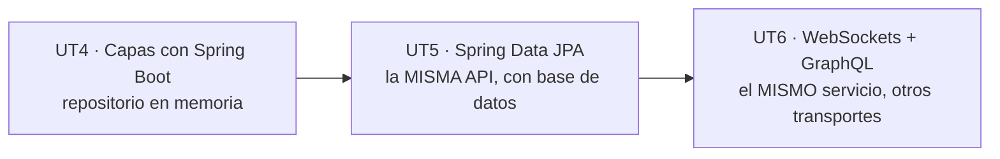

# Retos de la UT4

Tres proyectos con el mismo esqueleto que el [proyecto completo](04-proyecto-completo.md) y dominios distintos. **Los dos primeros se construyen en clase; el tercero se entrega y se califica.**

| | Reto | Formato | Sesiones |
|:-:|---|---|:-:|
| **1** | :material-check-circle: **Biblioteca** — resuelto en clase | Guiado, paso a paso | S5–S6 |
| **2** | :material-check-circle: **Gimnasio** — resuelto en clase | Guiado con huecos | S7 |
| **3** | :material-upload: **El que entregas** — a elegir entre tres | Autónomo, en pareja | S8–S9 |

!!! info "Por qué dos resueltos antes del que cuenta"
    El reto 1 se hace **contigo mirando y preguntando**; el 2, con la mitad escrita y la otra mitad en huecos; el 3, solo. Es la misma progresión de la UT1 a la UT3 pero con código: se ve una vez, se completa otra, se hace de cero.

    Y los tres usan **la misma rúbrica que el examen práctico**, para que el día del examen no haya sorpresas de formato.

---

## Reto 1 · Biblioteca :material-check-circle:

> **API REST para gestionar los libros de una biblioteca de centro.** Mismas capas que el proyecto de Funkos, pero con dos cosas nuevas: **un `enum` de verdad** en lugar del `@Pattern`, y **una operación de negocio** que no es CRUD.

### Lo que hay que construir

```
GET    /api/v1/libros                    ?genero=  &disponible=
GET    /api/v1/libros/{id}
POST   /api/v1/libros
PUT    /api/v1/libros/{id}
PATCH  /api/v1/libros/{id}
DELETE /api/v1/libros/{id}

POST   /api/v1/libros/{id}/prestamo      ← la operación de negocio
POST   /api/v1/libros/{id}/devolucion
GET    /api/v1/libros/estadisticas
```

```java
public enum Genero { NOVELA, ENSAYO, POESIA, TEATRO, COMIC, TECNICO }

public class Libro {
    private Long id;
    private String isbn;          // único
    private String titulo;
    private String autor;
    private Genero genero;
    private Integer ejemplares;   // cuántos hay
    private Integer prestados;    // cuántos están fuera
    private LocalDate publicacion;
    private LocalDateTime createdAt;
    private LocalDateTime updatedAt;
}
```

### Las reglas de negocio

| Regla | Si se incumple |
|---|---|
| El ISBN no se repite | **409 Conflict** |
| `prestados` nunca supera `ejemplares` | **409 Conflict** |
| No se puede devolver si `prestados == 0` | **409 Conflict** |
| No se puede borrar un libro con ejemplares prestados | **409 Conflict** |
| `publicacion` no puede ser futura | **400** (`@PastOrPresent`) |
| `ejemplares` mínimo 1 | **400** (`@Min(1)`) |

```java
// El enum en el DTO: Spring lo convierte solo desde el JSON
public record LibroCreateRequest(
        @NotBlank @Pattern(regexp = "\\d{13}", message = "El ISBN debe tener 13 dígitos")
        String isbn,
        @NotBlank @Size(max = 200) String titulo,
        @NotBlank String autor,
        @NotNull Genero genero,                    // ← enum, no String
        @NotNull @Min(1) Integer ejemplares,
        @NotNull @PastOrPresent LocalDate publicacion) {}
```

!!! success "Lo que se aprende con el `enum` en el DTO"
    Spring convierte `"NOVELA"` a `Genero.NOVELA` sin que escribas nada. Y si mandas `"COCINA"`, devuelve un **400** antes de llegar a tu código.

    Compara con el `@Pattern(regexp = "DISNEY|MARVEL|...")` del proyecto de Funkos: el `enum` lo hace mejor en todo salvo en el mensaje de error, que sale más feo (`Cannot deserialize value of type Genero`). Parte del reto es **arreglar ese mensaje** con un `@ExceptionHandler` de `HttpMessageNotReadableException`.

!!! reto "Las dos decisiones de diseño que se discuten en clase"
    **1. ¿`POST /libros/{id}/prestamo` o `PATCH /libros/{id}` con `{"prestados": 3}`?**

    La primera. Un préstamo **no es editar un campo**: es una operación con reglas propias (comprobar disponibilidad, incrementar, registrar). Exponerla como un PATCH del campo `prestados` permite que un cliente ponga `prestados: 999` y se salte la regla.

    **2. ¿Dónde va la comprobación `prestados < ejemplares`?**

    En el **servicio**, no en el DTO. Es una regla que compara dos campos y necesita el estado actual del libro: una anotación solo ve un campo aislado.

### `GET /libros/estadisticas`

```json
{
  "total": 42,
  "porGenero": { "COMIC": 5, "ENSAYO": 8, "NOVELA": 20, "POESIA": 3, "TECNICO": 6 },
  "ejemplaresTotales": 128,
  "prestados": 31,
  "porcentajePrestado": 24.2,
  "masAntiguo": "El Quijote"
}
```

!!! tip "Esto es la UT2 entera en un método"
    ```java
    public EstadisticasResponse estadisticas() {
        var libros = repositorio.findAll();
        return new EstadisticasResponse(
            libros.size(),
            libros.stream().collect(Collectors.groupingBy(
                    l -> l.getGenero().name(), TreeMap::new, Collectors.counting())),
            libros.stream().mapToInt(Libro::getEjemplares).sum(),
            libros.stream().mapToInt(Libro::getPrestados).sum(),
            libros.stream()
                  .min(Comparator.comparing(Libro::getPublicacion))
                  .map(Libro::getTitulo).orElse("—"));
    }
    ```

    `groupingBy` con `TreeMap::new` para que el JSON salga siempre en el mismo orden, `mapToInt(...).sum()`, `min(...)` devolviendo `Optional` y cerrado con `orElse`. Exactamente el tema 4 de la UT2.

### Entrega

Nada: se construye en clase y queda en tu repositorio como material de estudio.

---

## Reto 2 · Gimnasio :material-check-circle:

> **API REST de clases dirigidas de un gimnasio.** Se te da el proyecto **con la mitad escrita**: el modelo, los DTOs y el repositorio están; el servicio y el controlador tienen los métodos con el cuerpo vacío y un `// TODO`.

### Lo que se te da

```
gimnasio-base/
├── pom.xml                                  ✅
├── .env.example                             ✅
├── src/main/resources/
│   ├── application.properties               ✅
│   ├── application-dev.properties           ✅
│   └── application-prod.properties          ⬜ TODO
└── src/main/java/es/iesx/gimnasio/
    ├── GimnasioApplication.java             ✅
    ├── clases/
    │   ├── models/ClaseDirigida.java         ✅
    │   ├── dto/*.java                        ✅
    │   ├── repositories/*.java               ✅
    │   ├── mappers/ClaseMapper.java          ⬜ TODO (3 métodos)
    │   ├── exceptions/*.java                 ⬜ TODO
    │   ├── services/ClasesServiceImpl.java   ⬜ TODO (6 métodos)
    │   └── controllers/*.java                ⬜ TODO
    └── common/GlobalExceptionHandler.java    ⬜ TODO
```

```java
public enum Sala { PRINCIPAL, ESPEJOS, SPINNING, PISCINA }

public class ClaseDirigida {
    private Long id;
    private String nombre;         // "Yoga avanzado"
    private String monitor;
    private Sala sala;
    private DayOfWeek dia;
    private LocalTime horaInicio;
    private Integer duracionMinutos;
    private Integer plazas;
    private Integer inscritos;
    private LocalDateTime createdAt;
    private LocalDateTime updatedAt;
}
```

### Las reglas, y una difícil

| Regla | Código |
|---|---|
| Plazas entre 1 y 50 | 400 |
| Duración entre 30 y 120 minutos | 400 |
| Hora de inicio entre 07:00 y 22:00 | 400 |
| `inscritos` no supera `plazas` | 409 |
| **Dos clases no pueden solaparse en la misma sala el mismo día** | **409** |

!!! reto "La regla del solape es el reto de verdad"
    ```java
    private boolean solapan(ClaseDirigida a, ClaseDirigida b) {
        if (a.getSala() != b.getSala() || a.getDia() != b.getDia()) return false;
        var finA = a.getHoraInicio().plusMinutes(a.getDuracionMinutos());
        var finB = b.getHoraInicio().plusMinutes(b.getDuracionMinutos());
        return a.getHoraInicio().isBefore(finB) && b.getHoraInicio().isBefore(finA);
    }
    ```

    **Es el E18 de la UT3**, el de las reservas de hotel, con `LocalTime` en vez de `LocalDate`. Y la misma trampa: con `!isAfter` en lugar de `isBefore`, una clase que acaba a las 10:00 y otra que empieza a las 10:00 se declaran en conflicto, y el gimnasio pierde la mitad de su horario.

    Tres casos que hay que probar:

    | Clase A | Clase B | ¿Solapan? |
    |---|---|:-:|
    | L 09:00–10:00, PRINCIPAL | L 10:00–11:00, PRINCIPAL | **No** |
    | L 09:00–10:00, PRINCIPAL | L 09:30–10:30, PRINCIPAL | **Sí** |
    | L 09:00–10:00, PRINCIPAL | L 09:30–10:30, PISCINA | **No** |

### Operaciones extra

```
POST   /api/v1/clases/{id}/inscripcion     → 409 si está llena
DELETE /api/v1/clases/{id}/inscripcion     → 409 si no hay nadie
GET    /api/v1/clases/horario              → agrupado por día y hora
GET    /api/v1/clases?sala=SPINNING&dia=MONDAY
```

`GET /clases/horario` devuelve el cuadrante:

```json
{
  "MONDAY": [
    { "hora": "09:00", "nombre": "Yoga", "sala": "ESPEJOS", "libres": 4 },
    { "hora": "19:00", "nombre": "Spinning", "sala": "SPINNING", "libres": 0 }
  ],
  "TUESDAY": [ … ]
}
```

!!! tip "El `groupingBy` con dos criterios de orden"
    ```java
    clases.stream()
          .collect(Collectors.groupingBy(
                  ClaseDirigida::getDia,
                  () -> new TreeMap<>(Comparator.comparingInt(DayOfWeek::getValue)),
                  Collectors.collectingAndThen(
                      Collectors.toList(),
                      lista -> lista.stream()
                                    .sorted(Comparator.comparing(ClaseDirigida::getHoraInicio))
                                    .map(mapper::toHorario).toList())));
    ```

    El `TreeMap` con comparador por `getValue()` hace que los días salgan de lunes a domingo y no por orden alfabético (`FRIDAY, MONDAY, SATURDAY…`, que es lo que saldría). Y dentro de cada día, ordenado por hora.

### Entrega

Nada: se corrige en clase comparando con la solución. Pero **se exige que los tests pasen**, porque el reto 3 se construye encima.

---

## Reto 3 · El que entregas :material-upload:

> **Elige uno de los tres dominios y constrúyelo entero, en pareja.** Mismas capas, mismas garantías, sin guion.

Se entrega en la **S9** y es el **40 % de la nota de la UT4** (el 60 % restante es el examen práctico de la S10).

=== "A · Taller mecánico"

    **Reparaciones de un taller.**

    ```java
    public enum Estado { RECIBIDO, PRESUPUESTADO, EN_CURSO, TERMINADO, ENTREGADO }

    record Reparacion(Long id, String matricula, String marca, String modelo,
                      String descripcion, Estado estado, BigDecimal presupuesto,
                      List<String> piezas, LocalDate entrada, LocalDate salidaPrevista,
                      LocalDateTime createdAt, LocalDateTime updatedAt) {}
    ```

    - `POST /reparaciones/{id}/estado` con `{"estado":"EN_CURSO"}`, y **solo se permiten las transiciones válidas**: `RECIBIDO → PRESUPUESTADO → EN_CURSO → TERMINADO → ENTREGADO`. Saltarse un paso o ir hacia atrás es **409**.
    - La matrícula se valida con expresión regular: `\d{4}[A-Z]{3}`.
    - `salidaPrevista` no puede ser anterior a `entrada`.
    - No se puede pasar a `EN_CURSO` sin presupuesto.
    - `GET /reparaciones/estadisticas`: cuántas hay en cada estado, importe total presupuestado, media de días en el taller.
    - Dinero con **`BigDecimal`**, no `double`.

    **La dificultad está en la máquina de estados.** Un `Map<Estado, Set<Estado>>` con las transiciones permitidas es la forma limpia; un `switch` con patrones de Java 25 también vale.

=== "B · Comedor escolar"

    **Menús y comensales de un comedor.**

    ```java
    public enum Alergeno { GLUTEN, LACTOSA, FRUTOS_SECOS, HUEVO, PESCADO, SOJA }
    public enum TipoMenu { NORMAL, VEGETARIANO, SIN_GLUTEN, SIN_LACTOSA }

    record Menu(Long id, LocalDate fecha, TipoMenu tipo,
                String primero, String segundo, String postre,
                Set<Alergeno> alergenos, Integer plazas, Integer reservadas,
                BigDecimal precio, LocalDateTime createdAt, LocalDateTime updatedAt) {}
    ```

    - **No puede haber dos menús del mismo tipo en la misma fecha** → 409.
    - La fecha no puede ser pasada al crear → 400.
    - `TipoMenu.SIN_GLUTEN` con `Alergeno.GLUTEN` en la lista es **incoherente** → 409. Lo mismo con `SIN_LACTOSA` y `LACTOSA`.
    - `POST /menus/{id}/reserva` y `DELETE /menus/{id}/reserva`.
    - `GET /menus/semana?desde=2026-03-02`: los menús de esa semana agrupados por día, con los tipos disponibles de cada día.
    - `GET /menus?sinAlergeno=GLUTEN&sinAlergeno=LACTOSA`: **filtro múltiple** por el mismo parámetro repetido (`List<Alergeno>` en el `@RequestParam`).

    **La dificultad está en la coherencia entre `tipo` y `alergenos`**, que es una validación cruzada de dos campos: no la puede hacer una anotación de campo. O la haces en el servicio, o escribes un validador de clase con `@AssertTrue`.

=== "C · Incidencias de informática"

    **Tickets de soporte de un centro.**

    ```java
    public enum Prioridad { BAJA, MEDIA, ALTA, CRITICA }
    public enum EstadoTicket { ABIERTO, ASIGNADO, RESUELTO, CERRADO, REABIERTO }

    record Incidencia(Long id, String codigo, String titulo, String descripcion,
                      String aula, Prioridad prioridad, EstadoTicket estado,
                      String tecnico, LocalDateTime apertura, LocalDateTime cierre,
                      Integer reaperturas, LocalDateTime createdAt, LocalDateTime updatedAt) {}
    ```

    - El `codigo` lo **genera el servidor**: `INC-2026-0001`, correlativo por año.
    - `POST /incidencias/{id}/asignar` con `{"tecnico":"..."}` → pasa a `ASIGNADO`. No se puede asignar una `CERRADO`.
    - `POST /incidencias/{id}/resolver` → `RESUELTO` y pone `cierre`. Solo desde `ASIGNADO`.
    - `POST /incidencias/{id}/reabrir` → `REABIERTO`, incrementa `reaperturas`, borra `cierre`. **Máximo tres reaperturas** → 409.
    - `GET /incidencias?prioridad=CRITICA&estado=ABIERTO&aula=A12`: **tres filtros combinables**, todos opcionales.
    - `GET /incidencias/estadisticas`: por estado, por prioridad, **tiempo medio de resolución en horas**, y el técnico con más resueltas.

    **La dificultad está en los tres filtros opcionales combinables.** Con tres `if` anidados sale un engendro de ocho ramas; con una cadena de `stream().filter(...)` condicionales, cuatro líneas. Y el `codigo` correlativo por año obliga a pensar en la concurrencia.

### Lo que se entrega, en los tres casos

```
apellido1-apellido2-ut4/
├── README.md                  ← cómo arrancarlo, en 10 líneas
├── pom.xml
├── .gitignore                 ← con .env dentro
├── .env.example
├── compose.yaml               ← opcional, suma
├── postman/coleccion.json     ← o un fichero .http
└── src/
    ├── main/java/…
    ├── main/resources/
    │   ├── application.properties
    │   ├── application-dev.properties
    │   └── application-prod.properties
    └── test/java/…
```

!!! success "Rúbrica — la misma del examen práctico"
    | | Criterio | Puntos |
    |---|---|:-:|
    | **1** | **Capas separadas.** Controlador sin lógica, servicio sin `ResponseEntity`, repositorio sin reglas de negocio | **2,0** |
    | **2** | **CRUD completo** con los códigos correctos: 200 / 201+`Location` / 204 / 404 | **1,5** |
    | **3** | **DTOs separados** para respuesta, creación y actualización, y `record` con `@Valid` funcionando | **1,5** |
    | **4** | **Excepciones propias** con `@ResponseStatus` y un `@RestControllerAdvice` que devuelve los errores campo a campo | **1,5** |
    | **5** | **Las reglas de negocio del enunciado**, en el servicio, con 409 donde toca | **1,5** |
    | **6** | **Tests**: al menos 4 de servicio con Mockito y 4 de capa web con `MockMvc`, en verde | **1,0** |
    | **7** | **Configuración**: perfiles dev/prod, `${VAR:defecto}`, `.env` ignorado y `.env.example` presente | **0,5** |
    | **8** | **PATCH que parchea y PUT que reemplaza**, de verdad y distintos | **0,5** |
    | | | **10,0** |

!!! danger "Lo que resta puntos aunque funcione"
    | | |
    |---|---|
    | Un `ResponseEntity` dentro del `@Service` | −1,0 (criterio 1) |
    | Devolver la entidad en lugar del DTO | −1,0 (criterio 3) |
    | `@Valid` olvidado en algún `@RequestBody` | −1,0 (criterio 3) |
    | PUT y PATCH llamando al mismo método del mapeador | −0,5 (criterio 8) |
    | DELETE de un id inexistente devolviendo 204 | −0,5 (criterio 2) |
    | `.env` con valores reales subido al repositorio | **−1,0 y se avisa** (criterio 7) |
    | Tests que no compilan o están comentados | −1,0 (criterio 6) |

    Los seis primeros son errores de diseño que el programa no te señala: compila, arranca y responde. Por eso están en la rúbrica.

!!! info "Cómo se defiende"
    Diez minutos por pareja en la S9: arrancar el proyecto, enseñar **tres peticiones correctas y tres errores** (404, 400 con los campos, 409), ejecutar los tests y responder a una pregunta sobre una decisión de diseño.

    La pregunta habitual: *«¿por qué esta regla está en el servicio y no en el DTO?»*.

---

## Qué llevas de aquí a la UT5



En la UT5 se cambia **solo el repositorio**: `ConcurrentHashMap` fuera, `JpaRepository` dentro. Controlador, servicio, DTOs, mapeador, excepciones y tests de capa web **no se tocan**.

Si tu reto 3 tiene las capas bien separadas, eso es media sesión. Si el controlador habla con los datos directamente, es rehacerlo.
