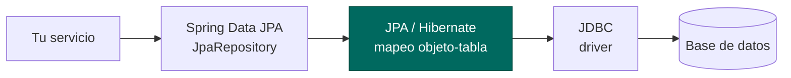
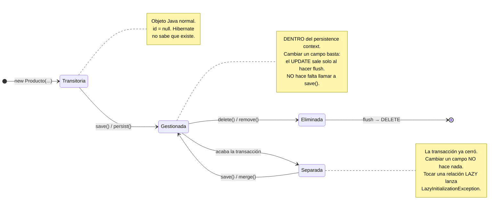

# Qué hace JPA por debajo

> En la UT4 conectaste H2, escribiste una entidad y borraste tu repositorio. Funcionó, y no supiste muy bien por qué. Esta unidad va de eso: **por qué funciona, cuándo deja de funcionar y qué hacer entonces**.

## 1. Dónde estamos

Lo que ya tienes desde la UT4:

- Una entidad mapeada a una tabla.
- Un `JpaRepository` con CRUD y consultas derivadas.
- H2 con `ddl-auto: update` creando el esquema solo.
- Datos que sobreviven al reinicio.

Lo que **no** tienes y es exactamente lo que separa un ejercicio de una aplicación:

| Te falta | Qué pasa sin ello |
|---|---|
| **Relaciones** | Un pedido no puede tener líneas |
| **Control del rendimiento** | Listar 100 pedidos lanza 101 consultas y no lo sabes |
| **Transacciones** | Una venta a medias deja el stock descontado y el pedido sin líneas |
| **Integridad** | Dos peticiones simultáneas crean el mismo producto dos veces |
| **Concurrencia** | Dos ediciones a la vez y desaparecen unidades del almacén, **sin ningún error** |
| **Migraciones** | `ddl-auto: update` no borra columnas ni migra datos: en producción es inviable |

Cada una de esas filas es una sesión de esta unidad.

## 2. Las cuatro siglas, ahora que ya las has usado

| Sigla | Qué es |
|---|---|
| **JDBC** | La API de Java para hablar con una base de datos. De bajo nivel: tú escribes el SQL y conviertes cada fila a objeto a mano |
| **JPA** | El estándar de mapeo objeto-relacional. Define las anotaciones, no ejecuta nada |
| **Hibernate** | La implementación de JPA que trae Spring Boot |
| **Spring Data JPA** | La capa que te genera el repositorio a partir de una interfaz |



## 3. Un rato con JDBC, para dimensionar lo que te ahorras

Escribe esto **una vez** en tu vida. Es el mismo `findByCategoria` que en la UT4 te salió gratis:

``` { .java .numerado }
public List<Producto> buscarPorCategoria(String categoria) {
    var sql = "SELECT id, nombre, categoria, precio, stock FROM productos WHERE categoria = ?";
    var lista = new ArrayList<Producto>();

    try (var con = DriverManager.getConnection(url, usuario, clave);
         var ps  = con.prepareStatement(sql)) {

        ps.setString(1, categoria);                 // parametrizado: sin inyección SQL

        try (var rs = ps.executeQuery()) {
            while (rs.next()) {
                var p = new Producto(rs.getString("nombre"), rs.getString("categoria"),
                                     rs.getDouble("precio"), rs.getInt("stock"));
                lista.add(p);
            }
        }
    } catch (SQLException e) {
        throw new ErrorAccesoDatosException("Fallo consultando productos", e);
    }
    return lista;
}
```

Abrir conexión, preparar sentencia, poner parámetros, recorrer el `ResultSet`, construir cada objeto columna a columna, cerrar todo y traducir la excepción. **Y es una consulta de una sola tabla sin relaciones.**

!!! danger "Lo único de JDBC que no puedes olvidar nunca"
    ```java
    // MAL  inyección SQL: escribe  ' OR '1'='1  y se lo lleva todo
    var sql = "SELECT * FROM productos WHERE categoria = '" + categoria + "'";

    // BIEN parametrizado
    var sql = "SELECT * FROM productos WHERE categoria = ?";
    ps.setString(1, categoria);
    ```
    JPA parametriza siempre por ti. Pero el día que escribas SQL a mano —y lo harás— esto es lo que separa una aplicación de una portada de periódico.

## 4. El ciclo de vida de una entidad

!!! analogia "Analogía"
    El *persistence context* es tu **mesa de trabajo**. Sacas una carpeta del archivo (`findById`), la dejas encima de la mesa y le escribes cosas. Al terminar la jornada (cerrar la transacción), quien recoge la mesa compara cada carpeta con como estaba y **archiva solo lo que cambió**. Por eso no hace falta decir «guarda esto»: mientras la carpeta esté en la mesa, se guarda sola.

Esto explica el 90 % de las sorpresas de la unidad. Una entidad está siempre en uno de tres estados:



Y de ahí sale la trampa favorita de JPA:

```java
@Transactional
public void subirPrecio(Long id, double nuevo) {
    var p = repositorio.findById(id).orElseThrow();
    p.setPrecio(nuevo);
    // ¿hace falta repositorio.save(p)?  →  NO
}
```

Dentro de una transacción la entidad está **gestionada**: Hibernate compara su estado al terminar y lanza el `UPDATE` solo. Se llama *dirty checking*.

Y al revés: **quita el `@Transactional` y ese mismo código no guarda nada, sin dar ningún error.** Silencioso y desconcertante hasta que entiendes los tres estados. Lo vas a comprobar tú mismo en el tema 5.

---

## Pruébalo ahora (30 min)

!!! reto "Trabaja tú ahora"
    Este bloque se hace **en clase, en tu equipo**. No se entrega ni puntúa: es la práctica que hace que el examen te salga.

**Parte 1 — Mira lo que ya tenías.** Arranca tu proyecto de la UT4 con `show-sql: true` y llama a tres endpoints distintos. Copia el SQL de cada uno. Ese es el punto de partida.

**Parte 2 — JDBC a pelo.** Escribe `buscarPorCategoria` con `DriverManager` y hazlo funcionar contra la misma H2. **Cuenta las líneas** y apúntalas en un comentario: son las que Spring Data te ahorró en una sola línea de interfaz.

**Parte 3 — La inyección SQL.** Monta la versión concatenada del SQL y llama con `categoria=' OR '1'='1`. Comprueba que devuelve **todos** los productos. Después usa el parámetro y verás que devuelve cero. Hazlo: entender esto leyéndolo no es lo mismo que verlo.

**Parte 4 — El `save` que no hace falta.** Escribe un método `@Transactional` que cargue un producto y le cambie el precio **sin llamar a `save`**. Comprueba en la consola H2 que el precio cambió. Ahora **quita el `@Transactional`** y repite: no cambia nada y no salta ningún error.

**Parte 5 — Los límites.** Carga 100.000 productos con un bucle y mide cuánto tarda `findAll()` frente a `findByCategoria`. Añade después un índice a mano desde la consola (`CREATE INDEX ...`) y vuelve a medir.

---

## Ejercicios (con solución)

### Ejercicio 1 — Las cuatro siglas
Explica en una línea cada una y cómo se apilan.

??? success "Solución"

    <b>JDBC</b>: API estándar de Java para hablar con la base de datos. <b>JPA</b>: especificación de mapeo objeto-relacional; define anotaciones y comportamiento, no ejecuta. <b>Hibernate</b>: la implementación de JPA que usa Spring Boot. <b>Spring Data JPA</b>: capa superior que genera los repositorios a partir de una interfaz.<br>
    Se apilan de arriba abajo: tu servicio → Spring Data → JPA/Hibernate → JDBC → base de datos. Cada capa traduce a la siguiente.


### Ejercicio 2 — El fallo de seguridad
```java
var sql = "SELECT * FROM usuarios WHERE email = '" + email + "' AND clave = '" + clave + "'";
```
¿Qué pasa si el email es `' OR '1'='1`?

??? success "Solución"

    La consulta queda como <code>... WHERE email = '' OR '1'='1' AND clave = '...'</code>, que es cierta, y el atacante <b>entra sin contraseña</b>. Es inyección SQL.<br>
    Se evita con <b>consultas parametrizadas</b>: el driver envía el SQL y los datos por separado, así que el contenido nunca se interpreta como código. JPA lo hace siempre; el riesgo aparece cuando escribes SQL nativo concatenando.


### Ejercicio 3 — Los tres estados
Un compañero modifica una entidad y no se guarda, sin ningún error. Da dos explicaciones.

??? success "Solución"

    (1) <b>No hay transacción</b>: la entidad está <b>separada</b> y Hibernate no detecta los cambios. Nadie avisa.<br>
    (2) Está modificando <b>una copia</b> —un DTO o el resultado de un <code>map</code>— en vez de la entidad gestionada que devolvió el repositorio.<br>
    Y una tercera más sutil: el método es <code>@Transactional</code> pero se llama desde <b>otro método de la misma clase</b>, así que el proxy de Spring no interviene y la transacción no existe. Se ve en el tema 5.


### Ejercicio 4 — ¿Por qué no seguir con JDBC?
Si JDBC funciona y es más explícito, ¿qué aporta JPA?

??? success "Solución"

    Ahorra el <b>código repetitivo</b> de mapear filas a objetos, que con relaciones se multiplica; gestiona el <b>ciclo de vida</b> y detecta cambios solo; genera SQL <b>portable</b> entre motores; e integra caché, paginación y consultas derivadas.<br>
    A cambio pierdes control y añades una capa que hay que entender: el N+1, el <i>lazy loading</i> y las transacciones son problemas que JDBC no tiene porque allí todo es explícito. Por eso esta unidad existe: JPA sin entenderlo es peor que JDBC.


### Ejercicio 5 — Qué falta para producción
Tu API de la UT4 guarda en H2 con `ddl-auto: update`. Enumera cinco razones por las que eso no puede ir a producción.

??? success "Solución"

    (1) <b><code>ddl-auto: update</code></b> no borra ni renombra columnas, no migra datos y produce esquemas distintos según el orden de los cambios. (2) <b>H2</b> no es una base de datos de producción. (3) <b>Sin transacciones</b>, cualquier operación con varias escrituras puede quedar a medias. (4) <b>Sin restricciones</b> más allá de las básicas, dos peticiones simultáneas duplican datos. (5) <b>Sin control de concurrencia</b>, dos ediciones a la vez pierden una sin avisar.<br>
    Y una sexta: sin copias de seguridad probadas. Las seis se resuelven en esta unidad.

