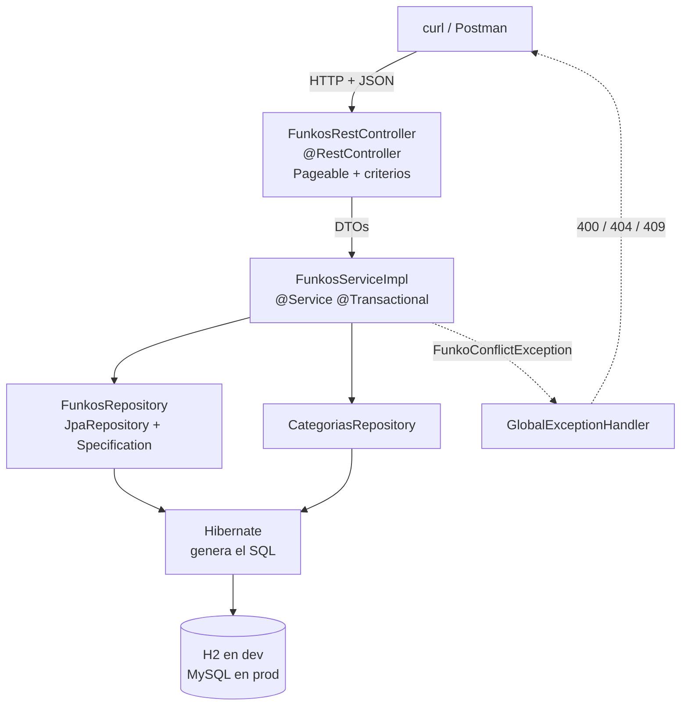

# 3. Proyecto completo paso a paso

La **API de Funkos de la UT4, ahora con base de datos de verdad**: H2 en desarrollo, MySQL en Docker, relaciones, paginación, criterios de búsqueda y tests con `@DataJpaTest`.

!!! success "El punto de partida y el de llegada"
    Partimos del [proyecto de la UT4](../ut4/04-proyecto-completo.md), que guardaba en un `ConcurrentHashMap`. Al acabar:

    ```
    GET    /api/v1/funkos          ?page= &size= &sort= &categoria= &precioMin= &precioMax= &nombre=
    GET    /api/v1/funkos/{id}
    POST   /api/v1/funkos
    PUT    /api/v1/funkos/{id}
    PATCH  /api/v1/funkos/{id}
    DELETE /api/v1/funkos/{id}     ← borrado lógico

    GET    /api/v1/categorias      CRUD completo de categorías
    GET    /api/v1/categorias/{id}/funkos
    ```

    Con **dos entidades relacionadas**, **paginación**, **criterios combinables** y los datos sobreviviendo al reinicio.

!!! danger "La promesa de la UT4, cobrada"
    Antes de empezar, cuenta los ficheros de tu proyecto de la UT4 que vas a tener que **tocar** en los pasos 1 a 5:

    | | ¿Se toca? |
    |---|:-:|
    | `FunkosRestController` | **No** |
    | `FunkosServiceImpl` | No (solo para añadir la paginación, en el paso 8) |
    | `FunkoResponse`, `FunkoCreateRequest`, `FunkoUpdateRequest` | **No** |
    | `FunkoMapper` | Casi no |
    | `FunkoNotFoundException` y familia | **No** |
    | `GlobalExceptionHandler` | **No** |
    | `Funko` | Sí: pasa a ser `@Entity` |
    | `FunkosRepositoryImpl` | **Se borra** |

    Eso es lo que compraste con las capas. Si tu proyecto de la UT4 tenía el SQL en el controlador, este tema es rehacerlo.

---

## Paso 1 · Las dependencias

```xml title="pom.xml"
<dependency>
  <groupId>org.springframework.boot</groupId>
  <artifactId>spring-boot-starter-data-jpa</artifactId>
</dependency>

<!-- Desarrollo y tests -->
<dependency>
  <groupId>com.h2database</groupId>
  <artifactId>h2</artifactId>
  <scope>runtime</scope>
</dependency>

<!-- Producción -->
<dependency>
  <groupId>com.mysql</groupId>
  <artifactId>mysql-connector-j</artifactId>
  <scope>runtime</scope>
</dependency>
```

```bash
./mvnw dependency:tree | grep -E "hibernate|jpa|h2|mysql"
```

```
+- org.springframework.boot:spring-boot-starter-data-jpa:jar:3.5.6
|  +- org.hibernate.orm:hibernate-core:jar:6.6.x
|  +- org.springframework.data:spring-data-jpa:jar:3.4.x
+- com.h2database:h2:jar:2.3.x
+- com.mysql:mysql-connector-j:jar:9.x
```

!!! info "Quién es quién"
    - **JPA** es la **especificación** (un estándar de Java, solo interfaces y anotaciones).
    - **Hibernate** es la **implementación** que Spring Boot trae por defecto. Es quien escribe el SQL.
    - **Spring Data JPA** es una capa **encima** de JPA que te genera los repositorios.

    Cuando en el log sale `Hibernate: select …`, estás viendo al de en medio trabajando.

---

## Paso 2 · La configuración por perfiles

Es el tema 5 de la UT4 aplicado: **el mismo `.jar`, dos bases de datos**.

=== "Común"

    ```properties title="application.properties"
    spring.application.name=funkos-api

    server.port=${PORT:8080}
    api.path=/api
    api.version=v1

    ### JPA, común a los dos perfiles
    spring.jpa.open-in-view=false

    spring.profiles.active=${SPRING_PROFILES_ACTIVE:dev}
    ```

=== "dev · H2"

    ```properties title="application-dev.properties"
    spring.datasource.url=jdbc:h2:mem:funkos;DB_CLOSE_DELAY=-1
    spring.datasource.username=sa
    spring.datasource.password=
    spring.datasource.driver-class-name=org.h2.Driver

    spring.jpa.hibernate.ddl-auto=create-drop
    spring.jpa.show-sql=true
    spring.jpa.properties.hibernate.format_sql=true

    ### Consola web de H2: http://localhost:8080/h2-console
    spring.h2.console.enabled=true
    spring.h2.console.path=/h2-console

    ### Datos iniciales
    spring.jpa.defer-datasource-initialization=true
    spring.sql.init.mode=always

    logging.level.es.iesx.funkos=DEBUG
    ```

=== "prod · MySQL"

    ```properties title="application-prod.properties"
    spring.datasource.url=${DB_URL}
    spring.datasource.username=${DB_USER}
    spring.datasource.password=${DB_PASSWORD}
    spring.datasource.driver-class-name=com.mysql.cj.jdbc.Driver

    spring.jpa.hibernate.ddl-auto=validate
    spring.jpa.show-sql=false

    spring.h2.console.enabled=false
    spring.sql.init.mode=never

    logging.level.root=WARN
    logging.level.es.iesx.funkos=INFO

    server.error.include-message=never
    server.error.include-stacktrace=never
    ```

=== "test · H2"

    ```properties title="application-test.properties"
    spring.datasource.url=jdbc:h2:mem:test;DB_CLOSE_DELAY=-1
    spring.jpa.hibernate.ddl-auto=create-drop
    spring.sql.init.mode=never
    logging.level.root=WARN
    ```

!!! danger "`spring.jpa.open-in-view=false`, y es importante"
    Viene **activado** por defecto, y Spring Boot incluso lo avisa en el arranque:

    ```
    WARN  JpaBaseConfiguration : spring.jpa.open-in-view is enabled by default.
    Therefore, database queries may be performed during view rendering.
    ```

    Lo que hace es mantener la sesión de Hibernate abierta **durante toda la petición**, incluida la serialización del JSON. Eso esconde los `LazyInitializationException`… lanzando consultas desde el serializador, donde no las controlas, y es una fábrica de problemas N+1 invisibles.

    Apagándolo, un `LazyInitializationException` **salta en desarrollo** y te obliga a arreglarlo donde toca: en el mapeador, dentro de la transacción.

!!! tip "`defer-datasource-initialization=true`, si usas `data.sql`"
    Sin esa línea, Spring ejecuta `data.sql` **antes** de que Hibernate cree las tablas, y falla con `Table "FUNKOS" not found`. Es el error número uno de este paso.

---

## Paso 3 · Las entidades

```java title="categorias/models/Categoria.java"
package es.iesx.funkos.categorias.models;

import jakarta.persistence.*;
import java.time.LocalDateTime;
import java.util.*;

@Entity
@Table(name = "categorias")
public class Categoria {

    @Id
    @GeneratedValue(strategy = GenerationType.IDENTITY)
    private Long id;

    @Column(nullable = false, unique = true, length = 50)
    private String nombre;

    @Column(name = "is_deleted", nullable = false)
    private boolean deleted = false;

    @Column(name = "created_at", updatable = false)
    private LocalDateTime createdAt = LocalDateTime.now();

    @Column(name = "updated_at")
    private LocalDateTime updatedAt = LocalDateTime.now();

    /** Lado INVERSO: la clave ajena está en funkos. */
    @OneToMany(mappedBy = "categoria", fetch = FetchType.LAZY)
    private List<Funko> funkos = new ArrayList<>();

    protected Categoria() {}          // JPA lo necesita

    public Categoria(String nombre) { this.nombre = nombre; }

    @PreUpdate
    void alActualizar() { this.updatedAt = LocalDateTime.now(); }

    // getters y setters…
}
```

```java title="funkos/models/Funko.java"
package es.iesx.funkos.funkos.models;

import es.iesx.funkos.categorias.models.Categoria;
import jakarta.persistence.*;
import java.math.BigDecimal;
import java.time.LocalDateTime;

@Entity
@Table(name = "funkos", indexes = {
        @Index(name = "idx_funko_nombre", columnList = "nombre"),
        @Index(name = "idx_funko_deleted", columnList = "is_deleted")
})
public class Funko {

    @Id
    @GeneratedValue(strategy = GenerationType.IDENTITY)
    private Long id;

    @Column(nullable = false, length = 100)
    private String nombre;

    @Column(nullable = false, precision = 10, scale = 2)
    private BigDecimal precio;

    @Column(nullable = false)
    private Integer cantidad;

    @Column(length = 500)
    private String imagen;

    /** Lado DUEÑO: la clave ajena vive en esta tabla. */
    @ManyToOne(fetch = FetchType.LAZY, optional = false)
    @JoinColumn(name = "categoria_id", nullable = false,
                foreignKey = @ForeignKey(name = "fk_funko_categoria"))
    private Categoria categoria;

    @Column(name = "is_deleted", nullable = false)
    private boolean deleted = false;

    @Column(name = "created_at", updatable = false)
    private LocalDateTime createdAt = LocalDateTime.now();

    @Column(name = "updated_at")
    private LocalDateTime updatedAt = LocalDateTime.now();

    protected Funko() {}

    @PreUpdate
    void alActualizar() { this.updatedAt = LocalDateTime.now(); }

    // builder, getters y setters…
}
```

!!! danger "Las seis decisiones de este paso, y por qué cada una"
    **1. `protected Funko() {}`.** JPA construye las entidades por reflexión y necesita un constructor sin argumentos. `protected` en vez de `public` para que nadie lo use desde fuera. **Y por esto una entidad no puede ser un `record`.**

    **2. `fetch = FetchType.LAZY` en el `@ManyToOne`.** El valor por defecto es `EAGER`, y es el problema de rendimiento número uno de JPA: cargar 100 funkos trae 100 categorías aunque no las mires.

    **3. `mappedBy = "categoria"` en el `@OneToMany`.** Dice «el dueño de la relación es el campo `categoria` de `Funko`». Sin él, Hibernate crea una tabla intermedia `categorias_funkos` que no quieres.

    **4. `BigDecimal` con `precision` y `scale`, no `double`.** Es dinero: `0.1 + 0.2` en `double` da `0.30000000000000004`, y eso está en la UT2, E1.

    **5. `@Column(name = "is_deleted")` y no `deleted`.** `deleted` es palabra reservada en algunos motores. Y la columna de borrado lógico va **indexada**, porque **todas** las consultas la filtran.

    **6. Sin `cascade` en el `@OneToMany`.** Con `CascadeType.ALL`, borrar una categoría borraría sus funkos. Lo que queremos es lo contrario: que **no se pueda** borrar una categoría con funkos. Eso es un 409, y se comprueba en el servicio.

!!! warning "`equals` y `hashCode` en una entidad: no los generes con el IDE"
    El `equals` que genera IntelliJ compara todos los campos. En una entidad eso rompe en cuanto la metes en un `Set`: antes de guardar, el `id` es `null`; después, no. El `hashCode` cambia y el elemento se pierde dentro del `HashSet`.

    Si los necesitas, compara **solo por el id** y devuelve un `hashCode` constante mientras el id sea `null`. En el proyecto no hacen falta: trabajamos con `List` y comparamos DTOs, que son `record` y lo traen bien hecho.

---

## Paso 4 · Los datos iniciales

```sql title="src/main/resources/data.sql"
INSERT INTO categorias (nombre, is_deleted, created_at, updated_at) VALUES
  ('DISNEY', false, CURRENT_TIMESTAMP, CURRENT_TIMESTAMP),
  ('MARVEL', false, CURRENT_TIMESTAMP, CURRENT_TIMESTAMP),
  ('ANIME',  false, CURRENT_TIMESTAMP, CURRENT_TIMESTAMP),
  ('OTROS',  false, CURRENT_TIMESTAMP, CURRENT_TIMESTAMP);

INSERT INTO funkos (nombre, precio, cantidad, imagen, categoria_id, is_deleted, created_at, updated_at) VALUES
  ('Mickey Mouse', 15.99, 10, 'https://placehold.co/300', 1, false, CURRENT_TIMESTAMP, CURRENT_TIMESTAMP),
  ('Stitch',       17.00,  8, 'https://placehold.co/300', 1, false, CURRENT_TIMESTAMP, CURRENT_TIMESTAMP),
  ('Spider-Man',   19.99,  5, 'https://placehold.co/300', 2, false, CURRENT_TIMESTAMP, CURRENT_TIMESTAMP),
  ('Iron Man',     21.50,  2, 'https://placehold.co/300', 2, false, CURRENT_TIMESTAMP, CURRENT_TIMESTAMP),
  ('Goku',         22.50,  3, 'https://placehold.co/300', 3, false, CURRENT_TIMESTAMP, CURRENT_TIMESTAMP),
  ('Naruto',       18.75,  0, 'https://placehold.co/300', 3, false, CURRENT_TIMESTAMP, CURRENT_TIMESTAMP);
```

!!! info "`data.sql` en vez del `CommandLineRunner` de la UT4"
    Con `spring.sql.init.mode=always` y `defer-datasource-initialization=true`, Spring ejecuta este fichero después de que Hibernate cree las tablas.

    Ventaja sobre el `CommandLineRunner`: **no pasa por tus validaciones ni por tu servicio**, así que puedes meter datos que el estado inicial necesita (un funko con cantidad 0, por ejemplo) sin pelearte con las reglas.

    En `prod` está en `never`: ahí los datos ya están.

---

## Paso 5 · Los repositorios

Aquí es donde desaparece el código.

```java title="funkos/repositories/FunkosRepository.java"
package es.iesx.funkos.funkos.repositories;

import es.iesx.funkos.funkos.models.Funko;
import org.springframework.data.domain.*;
import org.springframework.data.jpa.repository.*;
import java.math.BigDecimal;
import java.util.*;

public interface FunkosRepository
        extends JpaRepository<Funko, Long>, JpaSpecificationExecutor<Funko> {

    // ── derivadas del nombre: ni una línea de implementación ──
    Optional<Funko> findByIdAndDeletedFalse(Long id);
    List<Funko>     findByDeletedFalse();
    boolean         existsByNombreIgnoreCaseAndDeletedFalse(String nombre);
    List<Funko>     findByCategoriaNombreIgnoreCaseAndDeletedFalse(String categoria);
    long            countByCategoriaIdAndDeletedFalse(Long categoriaId);
    List<Funko>     findByPrecioBetweenAndDeletedFalse(BigDecimal min, BigDecimal max);
    List<Funko>     findTop5ByDeletedFalseOrderByPrecioDesc();

    // ── JPQL con JOIN FETCH: evita el N+1 al paginar ──
    @Query(value      = "SELECT f FROM Funko f JOIN FETCH f.categoria WHERE f.deleted = false",
           countQuery = "SELECT count(f) FROM Funko f WHERE f.deleted = false")
    Page<Funko> findAllConCategoria(Pageable pageable);

    // ── borrado lógico ──
    @Modifying
    @Query("UPDATE Funko f SET f.deleted = true, f.updatedAt = CURRENT_TIMESTAMP WHERE f.id = :id")
    int borradoLogico(@Param("id") Long id);
}
```

```java title="categorias/repositories/CategoriasRepository.java"
public interface CategoriasRepository extends JpaRepository<Categoria, Long> {
    Optional<Categoria> findByNombreIgnoreCaseAndDeletedFalse(String nombre);
    List<Categoria>     findByDeletedFalse();
    boolean             existsByNombreIgnoreCase(String nombre);
}
```

!!! success "Compara con la UT3 y con la UT4"
    | | Líneas de código |
    |---|:-:|
    | UT3, JDBC a mano (`DriverManager`, `PreparedStatement`, mapeo del `ResultSet`) | ~120 |
    | UT4, `ConcurrentHashMap` | ~45 |
    | UT5, Spring Data JPA | **0** |

    `findByCategoriaNombreIgnoreCaseAndDeletedFalse` navega **por la relación** (`categoria` → `nombre`) y genera el `JOIN` sola. No hay implementación en ninguna parte: Spring Data crea un proxy en el arranque leyendo el nombre del método.

    Y si escribes mal un campo (`findByCategoríaNombre`), **la aplicación no arranca**:

    ```
    PropertyReferenceException: No property 'categoría' found for type 'Funko'
    ```

    Eso es mucho mejor que un error en producción.

!!! danger "`@Modifying` necesita dos cosas, y sin ellas falla raro"
    ```java
    @Modifying                                  // 1 · «esta consulta escribe»
    @Query("UPDATE Funko f SET f.deleted = true WHERE f.id = :id")
    int borradoLogico(@Param("id") Long id);
    ```

    1. **`@Modifying`**, o salta `Not supported for DML operations`.
    2. **`@Transactional`** en el servicio que lo llama, o salta `TransactionRequiredException`.

    Y un aviso: un `UPDATE` por JPQL **no pasa por la caché de primer nivel**. Si en la misma transacción tenías el funko cargado, ese objeto en memoria sigue con `deleted = false`. Para estos casos conviene `@Modifying(clearAutomatically = true, flushAutomatically = true)`.

---

## Paso 6 · El borrado lógico

```java title="funkos/services/FunkosServiceImpl.java (fragmento)"
@Override
@Transactional
@CacheEvict(allEntries = true)
public void deleteById(Long id) {
    var funko = repositorio.findByIdAndDeletedFalse(id)
            .orElseThrow(() -> new FunkoNotFoundException(id));

    if (funko.getCantidad() > 0)
        throw new FunkoConflictException(
                "No se puede borrar un funko con %d unidades en stock"
                        .formatted(funko.getCantidad()));

    repositorio.borradoLogico(id);
}
```

!!! success "Físico frente a lógico: la tabla de decisión"
    | | Borrado físico (`DELETE`) | Borrado lógico (`is_deleted = true`) |
    |---|---|---|
    | El dato | Desaparece | Sigue ahí |
    | Histórico y auditoría | Se pierde | Se conserva |
    | Pedidos que lo referencian | Se rompen o bloquean el borrado | Siguen funcionando |
    | Recuperar un borrado por error | Backup | Un `UPDATE` |
    | Coste | Ninguno | **Todas** las consultas llevan `AND deleted = false` |
    | Derecho al olvido (RGPD) | Cumple | **No cumple**: hay que borrar de verdad |

    **La última fila importa.** Con datos personales, el borrado lógico no basta: cuando alguien ejerce su derecho de supresión, el dato tiene que desaparecer o quedar anonimizado.

!!! warning "El coste real del borrado lógico"
    **Olvidar un `AND deleted = false` en una sola consulta** hace que los registros borrados reaparezcan en ese endpoint. Y como el programa no falla, nadie se entera hasta que un cliente ve un producto que ya no existe.

    Por eso en este proyecto **todos** los métodos del repositorio llevan `AndDeletedFalse` en el nombre: es feo y es deliberado, porque un método sin ese sufijo se ve a simple vista.

    La alternativa elegante es un `@Where(clause = "is_deleted = false")` en la entidad (filtro automático de Hibernate), pero entonces **no hay forma de consultar los borrados** ni desde el panel de administración. Mejor explícito.

---

## Paso 7 · El servicio con transacciones

```java title="funkos/services/FunkosServiceImpl.java"
@Service
@CacheConfig(cacheNames = {"funkos"})
public class FunkosServiceImpl implements FunkosService {

    private static final Logger log = LoggerFactory.getLogger(FunkosServiceImpl.class);

    private final FunkosRepository repositorio;
    private final CategoriasRepository categoriasRepository;
    private final FunkoMapper mapper;

    public FunkosServiceImpl(FunkosRepository repositorio,
                             CategoriasRepository categoriasRepository,
                             FunkoMapper mapper) {
        this.repositorio = repositorio;
        this.categoriasRepository = categoriasRepository;
        this.mapper = mapper;
    }

    @Override
    @Transactional(readOnly = true)
    public Page<FunkoResponse> findAll(Optional<String> categoria,
                                       Optional<BigDecimal> precioMin,
                                       Optional<BigDecimal> precioMax,
                                       Optional<String> nombre,
                                       Pageable pageable) {

        Specification<Funko> spec = (root, q, cb) -> cb.isFalse(root.get("deleted"));

        spec = categoria.map(c -> spec.and((root, q, cb) ->
                    cb.equal(cb.upper(root.get("categoria").get("nombre")), c.toUpperCase())))
                .orElse(spec);

        spec = precioMin.map(p -> spec.and((root, q, cb) ->
                    cb.greaterThanOrEqualTo(root.get("precio"), p))).orElse(spec);

        spec = precioMax.map(p -> spec.and((root, q, cb) ->
                    cb.lessThanOrEqualTo(root.get("precio"), p))).orElse(spec);

        spec = nombre.map(n -> spec.and((root, q, cb) ->
                    cb.like(cb.lower(root.get("nombre")), "%" + n.toLowerCase() + "%")))
                .orElse(spec);

        return repositorio.findAll(spec, pageable).map(mapper::toResponse);
    }

    @Override
    @Transactional(readOnly = true)
    @Cacheable(key = "#id")
    public FunkoResponse findById(Long id) {
        return repositorio.findByIdAndDeletedFalse(id)
                .map(mapper::toResponse)
                .orElseThrow(() -> new FunkoNotFoundException(id));
    }

    @Override
    @Transactional
    @CacheEvict(allEntries = true)
    public FunkoResponse save(FunkoCreateRequest request) {
        if (repositorio.existsByNombreIgnoreCaseAndDeletedFalse(request.nombre()))
            throw new FunkoConflictException("Ya existe un funko llamado " + request.nombre());

        var categoria = categoriasRepository
                .findByNombreIgnoreCaseAndDeletedFalse(request.categoria())
                .orElseThrow(() -> new FunkoBadRequestException(
                        "La categoría " + request.categoria() + " no existe"));

        return mapper.toResponse(repositorio.save(mapper.toModel(request, categoria)));
    }

    // replace, update y deleteById igual: @Transactional + @CacheEvict
}
```

!!! danger "Las cuatro cosas de `@Transactional` que hay que saber"
    **1. `readOnly = true` en las lecturas.** Hibernate desactiva el *dirty checking* (no compara el estado de las entidades al final) y el driver puede optimizar. En una lectura con 100 entidades, se nota.

    **2. Solo revierte con `RuntimeException`.** Por defecto, una excepción **comprobada** (`IOException`) **no** provoca *rollback*: la transacción se confirma con el trabajo a medias. Tus `FunkoException` heredan de `RuntimeException`, así que van bien; si capturas una comprobada, usa `@Transactional(rollbackFor = Exception.class)`.

    **3. Funciona por proxy, igual que la caché.** Una llamada interna (`this.save(...)`) **no abre transacción**. Es el mismo problema del `@Cacheable` de la UT4, por el mismo motivo.

    **4. Si capturas la excepción, no hay *rollback*.**

    ```java
    @Transactional
    public void mal() {
        try { repositorio.save(algo); fallar(); }
        catch (Exception e) { log.error("ups"); }   // ← la transacción SE CONFIRMA
    }
    ```

    Para que haya *rollback*, la excepción tiene que **salir** del método transaccional.

!!! info "¿`@Transactional` en el servicio o en el repositorio?"
    **En el servicio**, siempre. Una operación de negocio puede tocar dos repositorios y tiene que ser atómica: o se guarda todo o nada.

    Los métodos de `JpaRepository` ya son transaccionales uno a uno, y eso es justo el problema: dos llamadas seguidas son **dos** transacciones, así que un fallo en la segunda deja la primera confirmada.

---

## Paso 8 · El controlador con paginación

```java title="funkos/controllers/FunkosRestController.java"
@GetMapping
public ResponseEntity<Page<FunkoResponse>> findAll(
        @RequestParam Optional<String> categoria,
        @RequestParam Optional<BigDecimal> precioMin,
        @RequestParam Optional<BigDecimal> precioMax,
        @RequestParam Optional<String> nombre,
        @PageableDefault(size = 20, sort = "id") Pageable pageable) {

    return ResponseEntity.ok(
            servicio.findAll(categoria, precioMin, precioMax, nombre, sanear(pageable)));
}

/** Lista blanca de campos ordenables y tope de tamaño. */
private Pageable sanear(Pageable p) {
    var permitidos = Set.of("id", "nombre", "precio", "cantidad", "createdAt");
    var orden = p.getSort().stream()
            .filter(o -> permitidos.contains(o.getProperty()))
            .toList();
    return PageRequest.of(p.getPageNumber(),
                          Math.min(p.getPageSize(), 100),
                          orden.isEmpty() ? Sort.by("id") : Sort.by(orden));
}
```

```properties
spring.data.web.pageable.default-page-size=20
spring.data.web.pageable.max-page-size=100
```

!!! danger "Por qué el `sanear` no es paranoia"
    Sin lista blanca, `?sort=` permite ordenar por **cualquier campo de la entidad**, incluidos los que no publicas. En una entidad `Usuario`, `?sort=passwordHash` no devuelve el hash pero sí revela el **orden relativo** de los hashes.

    Y sin tope de tamaño, `?size=1000000` carga la tabla entera: has escrito la paginación y no te protege de nada.

    Las dos líneas de `application.properties` cubren el tope; el `sanear` cubre los campos y además convierte un `?sort=inventado` (que daría un 500) en un orden por `id`.

---

## Paso 9 · Las categorías y su regla

```java title="categorias/services/CategoriasServiceImpl.java (fragmento)"
@Override
@Transactional
public void deleteById(Long id) {
    var categoria = repositorio.findById(id)
            .filter(c -> !c.isDeleted())
            .orElseThrow(() -> new CategoriaNotFoundException(id));

    long funkos = funkosRepository.countByCategoriaIdAndDeletedFalse(id);
    if (funkos > 0)
        throw new CategoriaConflictException(
                "No se puede borrar la categoría %s: tiene %d funkos asociados"
                        .formatted(categoria.getNombre(), funkos));

    categoria.setDeleted(true);
}
```

```java title="categorias/controllers/CategoriasRestController.java (fragmento)"
@GetMapping("/{id}/funkos")
public ResponseEntity<Page<FunkoResponse>> funkosDeCategoria(
        @PathVariable Long id,
        @PageableDefault(size = 20) Pageable pageable) {
    return ResponseEntity.ok(servicio.funkosDeCategoria(id, pageable));
}
```

!!! success "Fíjate en que no hay `save` al final del `deleteById`"
    ```java
    categoria.setDeleted(true);     // y ya está
    ```

    Dentro de una transacción, las entidades cargadas están **gestionadas**: Hibernate detecta el cambio al confirmar (*dirty checking*) y lanza el `UPDATE` él solo. Llamar a `save()` no hace daño, pero es innecesario.

    Esto sorprende viniendo de la UT3, donde cada cambio era un `executeUpdate()` explícito. Y tiene su cara b: **un `setter` llamado por error dentro de una transacción persiste el cambio sin que nadie lo pida.**

---

## Paso 10 · MySQL en Docker

```yaml title="compose.yaml"
services:
  api:
    build: .
    ports: ["${PORT:-8080}:8080"]
    env_file: .env
    environment:
      SPRING_PROFILES_ACTIVE: prod
      DB_URL: jdbc:mysql://db:3306/funkos?useUnicode=true&characterEncoding=UTF-8
    depends_on:
      db:
        condition: service_healthy

  db:
    image: mysql:8.4
    environment:
      MYSQL_ROOT_PASSWORD: ${DB_ROOT_PASSWORD}
      MYSQL_DATABASE: funkos
      MYSQL_USER: ${DB_USER}
      MYSQL_PASSWORD: ${DB_PASSWORD}
    ports: ["3306:3306"]
    volumes:
      - dbdata:/var/lib/mysql
      - ./sql/esquema.sql:/docker-entrypoint-initdb.d/01-esquema.sql:ro
    healthcheck:
      test: ["CMD", "mysqladmin", "ping", "-h", "localhost", "-p${DB_ROOT_PASSWORD}"]
      interval: 5s
      timeout: 5s
      retries: 10

volumes:
  dbdata:
```

```dockerfile title="Dockerfile"
# Fase 1 · construir
FROM maven:3.9-eclipse-temurin-25 AS build
WORKDIR /app
COPY pom.xml .
RUN mvn -B dependency:go-offline
COPY src ./src
RUN mvn -B clean package -DskipTests

# Fase 2 · ejecutar
FROM eclipse-temurin:25-jre-alpine
WORKDIR /app
COPY --from=build /app/target/*.jar app.jar
EXPOSE 8080
ENTRYPOINT ["java", "-jar", "app.jar"]
```

```bash
docker compose up -d --build
docker compose logs -f api
```

!!! danger "Dos detalles del `compose.yaml` que cuestan una tarde"
    **1. `jdbc:mysql://db:3306`, no `localhost`.** Dentro de la red de Compose, el contenedor de la API ve a la base de datos por **el nombre del servicio** (`db`). `localhost` desde dentro del contenedor de la API es el propio contenedor de la API, donde no hay ningún MySQL.

    **2. El `healthcheck` con `condition: service_healthy`.** Sin él, `depends_on` solo espera a que el contenedor **arranque**, no a que MySQL esté listo para aceptar conexiones. La API intenta conectar mientras MySQL todavía inicializa y falla con:

    ```
    Communications link failure
    ```

    Es el mismo aviso de la UT3, E25.

!!! info "El `Dockerfile` multietapa"
    La primera fase necesita Maven y el JDK completo (unos 600 MB). La segunda solo necesita el JRE y el `.jar`, así que la imagen final baja a unos 190 MB.

    Y el `dependency:go-offline` antes de copiar `src/`: así Docker cachea la capa de dependencias y un cambio en el código no vuelve a descargar medio Maven Central.

---

## Paso 11 · Los tests

=== "Repositorio · `@DataJpaTest`"

    ```java
    @DataJpaTest
    @ActiveProfiles("test")
    class FunkosRepositoryTest {

        @Autowired FunkosRepository repositorio;
        @Autowired TestEntityManager em;

        private Categoria anime;

        @BeforeEach
        void preparar() {
            anime = em.persistAndFlush(new Categoria("ANIME"));
        }

        @Test
        void noDevuelveLosBorradosLogicamente() {
            var activo  = em.persistAndFlush(funko("Goku",   anime, false));
            var borrado = em.persistAndFlush(funko("Naruto", anime, true));

            var resultado = repositorio.findByDeletedFalse();

            assertThat(resultado).extracting(Funko::getNombre)
                                 .containsExactly("Goku")
                                 .doesNotContain("Naruto");
        }

        @Test
        void buscaPorNombreDeCategoriaIgnorandoMayusculas() {
            em.persistAndFlush(funko("Goku", anime, false));

            assertThat(repositorio.findByCategoriaNombreIgnoreCaseAndDeletedFalse("anime"))
                    .hasSize(1);
        }

        @Test
        void elNombreUnicoLoImponeLaBaseDeDatos() {
            em.persistAndFlush(new Categoria("MARVEL"));

            assertThatThrownBy(() -> em.persistAndFlush(new Categoria("MARVEL")))
                    .isInstanceOf(PersistenceException.class);
        }
    }
    ```

    `@DataJpaTest` levanta **solo** la capa JPA (sin controladores ni servicios), usa H2 y envuelve cada test en una transacción **que se deshace al acabar**. Tarda menos de un segundo y no hay que limpiar nada.

=== "Servicio · Mockito"

    ```java
    @ExtendWith(MockitoExtension.class)
    class FunkosServiceImplTest {

        @Mock FunkosRepository repositorio;
        @Mock CategoriasRepository categoriasRepository;
        @Spy  FunkoMapper mapper = new FunkoMapper();
        @InjectMocks FunkosServiceImpl servicio;

        @Test
        void noBorraUnFunkoConStock() {
            var conStock = funko("Goku", 5);
            when(repositorio.findByIdAndDeletedFalse(1L)).thenReturn(Optional.of(conStock));

            assertThrows(FunkoConflictException.class, () -> servicio.deleteById(1L));
            verify(repositorio, never()).borradoLogico(anyLong());
        }

        @Test
        void noCreaConCategoriaInexistente() {
            when(repositorio.existsByNombreIgnoreCaseAndDeletedFalse(any())).thenReturn(false);
            when(categoriasRepository.findByNombreIgnoreCaseAndDeletedFalse("COCINA"))
                    .thenReturn(Optional.empty());

            var req = new FunkoCreateRequest("X", new BigDecimal("1.0"), 1, null, "COCINA");
            assertThrows(FunkoBadRequestException.class, () -> servicio.save(req));
            verify(repositorio, never()).save(any());
        }
    }
    ```

    Sin Spring y sin base de datos: milisegundos. Prueba **las reglas**, no el SQL.

=== "Integración · `@SpringBootTest`"

    ```java
    @SpringBootTest(webEnvironment = WebEnvironment.RANDOM_PORT)
    @ActiveProfiles("test")
    @AutoConfigureMockMvc
    class FunkosIntegracionTest {

        @Autowired MockMvc mockMvc;

        @Test
        void listadoPaginadoDevuelveLaEstructuraDePage() throws Exception {
            mockMvc.perform(get("/api/v1/funkos?page=0&size=2"))
                   .andExpect(status().isOk())
                   .andExpect(jsonPath("$.content", hasSize(2)))
                   .andExpect(jsonPath("$.totalElements").exists())
                   .andExpect(jsonPath("$.totalPages").exists());
        }

        @Test
        void filtroPorCategoriaEnMinusculasFunciona() throws Exception {
            mockMvc.perform(get("/api/v1/funkos?categoria=anime"))
                   .andExpect(status().isOk())
                   .andExpect(jsonPath("$.content[0].categoria").value("ANIME"));
        }

        @Test
        void noSePuedeBorrarCategoriaConFunkos() throws Exception {
            mockMvc.perform(delete("/api/v1/categorias/1"))
                   .andExpect(status().isConflict());
        }
    }
    ```

    De punta a punta, con la base de datos en memoria y los datos de `data.sql`. Es el que caza los errores de cableado entre capas.

!!! success "Los tres niveles y qué caza cada uno"
    | | Qué prueba | Tarda | Caza |
    |---|---|---|---|
    | Mockito | Reglas de negocio | ms | Un 409 que falta |
    | `@DataJpaTest` | Consultas y mapeo | ~1 s | Un `AndDeletedFalse` olvidado, un `mappedBy` mal |
    | `@SpringBootTest` | Todo junto | ~3 s | Rutas, `@Valid`, códigos de estado |

    Los tres, y en esa proporción: muchos del primero, bastantes del segundo, pocos del tercero.

---

## Paso 12 · Probarlo

```bash
./mvnw spring-boot:run
```

=== "Paginación y orden"

    ```bash
    # Página 0 de 2 elementos
    curl -s "localhost:8080/api/v1/funkos?page=0&size=2" \
      | jq '{total: .totalElements, paginas: .totalPages, nombres: [.content[].nombre]}'
    # { "total": 6, "paginas": 3, "nombres": ["Mickey Mouse", "Stitch"] }

    # Por precio descendente
    curl -s "localhost:8080/api/v1/funkos?sort=precio,desc&size=3" \
      | jq '[.content[] | {nombre, precio}]'

    # Campo inventado: NO revienta, ordena por id
    curl -s -o /dev/null -w "%{http_code}\n" \
      "localhost:8080/api/v1/funkos?sort=inventado,desc"
    # 200

    # Tamaño enorme: se recorta a 100
    curl -s "localhost:8080/api/v1/funkos?size=99999" | jq '.pageable.pageSize'
    # 100
    ```

=== "Criterios combinables"

    ```bash
    curl -s "localhost:8080/api/v1/funkos?categoria=anime" | jq '.totalElements'
    # 2

    curl -s "localhost:8080/api/v1/funkos?precioMin=18&precioMax=22" | jq '.totalElements'
    # 3

    # Los cuatro a la vez
    curl -s "localhost:8080/api/v1/funkos?categoria=MARVEL&precioMin=20&nombre=iron" \
      | jq '[.content[].nombre]'
    # ["Iron Man"]
    ```

=== "Las reglas de negocio"

    ```bash
    # 409: borrar una categoría con funkos
    curl -i -X DELETE localhost:8080/api/v1/categorias/1
    # HTTP/1.1 409
    # No se puede borrar la categoría DISNEY: tiene 2 funkos asociados

    # 409: borrar un funko con stock
    curl -i -X DELETE localhost:8080/api/v1/funkos/1
    # HTTP/1.1 409

    # 204: el que tiene cantidad 0 sí se borra
    curl -i -X DELETE localhost:8080/api/v1/funkos/6
    # HTTP/1.1 204

    # Y ya no aparece: borrado lógico
    curl -s localhost:8080/api/v1/funkos | jq '[.content[].nombre] | index("Naruto")'
    # null

    # 400: categoría que no existe
    curl -i -X POST localhost:8080/api/v1/funkos \
      -H "Content-Type: application/json" \
      -d '{"nombre":"Tarta","precio":9.99,"cantidad":1,"categoria":"COCINA"}'
    # HTTP/1.1 400
    ```

=== "Que persiste de verdad"

    ```bash
    curl -X POST localhost:8080/api/v1/funkos \
      -H "Content-Type: application/json" \
      -d '{"nombre":"Pikachu","precio":20.0,"cantidad":7,"categoria":"ANIME"}'

    docker compose restart api
    sleep 15

    curl -s "localhost:8080/api/v1/funkos?nombre=pika" | jq '.totalElements'
    # 1   ← en la UT4 esto era 0
    ```

    **Esta es la diferencia de la unidad en una línea de salida.**

---

## Lo que has construido



!!! success "Checklist antes de darlo por bueno"
    - [ ] `./mvnw clean package` en verde, con los tres tipos de test
    - [ ] Los datos **sobreviven** a un reinicio con el perfil `prod`
    - [ ] `?page=&size=&sort=` funcionan, y `?size=99999` se recorta a 100
    - [ ] `?sort=inventado` devuelve 200, no 500
    - [ ] Los cuatro criterios se combinan
    - [ ] Borrar una categoría con funkos → **409**
    - [ ] Un funko borrado **no** aparece en ningún listado
    - [ ] `spring.jpa.open-in-view=false` y **ningún** `LazyInitializationException`
    - [ ] `show-sql=true` en dev no muestra el patrón N+1 al listar
    - [ ] `ddl-auto=validate` en `prod`, nunca `create-drop`
    - [ ] El controlador **no** devuelve entidades, solo DTOs
    - [ ] `.env` en `.gitignore` y `.env.example` presente

!!! info "Y en la UT6 se cambia solo el transporte"
    El `FunkosServiceImpl` que acabas de escribir atenderá también un **WebSocket** que avisa de cada funko nuevo y una consulta **GraphQL**. Sin tocarlo: solo se añaden clases que lo llaman.

    Si tu servicio tiene un `ResponseEntity` dentro, ahí es donde se nota.
