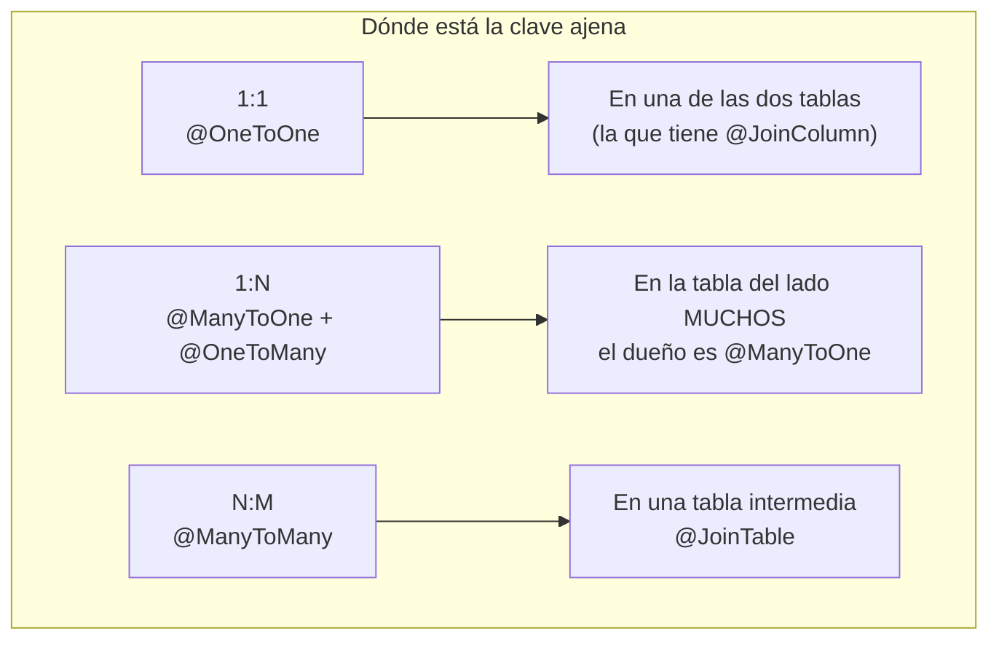
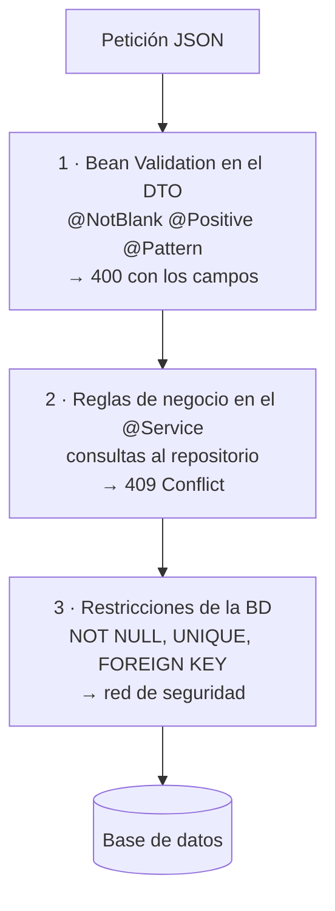

# 4. Referencia de JPA y validaciones

Página de consulta. **No se estudia: se mira mientras programas.** Todas las anotaciones de JPA y de Bean Validation que se usan en el módulo, con qué hacen y dónde van.

!!! info "Para qué sirve esta página"
    La [chuleta](chuleta.md) es la hoja de una cara que se lleva al examen. Esto es lo otro: la lista completa, con los valores por defecto y las trampas, para tenerla abierta en una pestaña mientras montas las entidades.

    Los enlaces de cada apartado llevan a la documentación oficial.

---

## 4.1. Anotaciones de entidad

| Anotación | Qué hace | Nota |
|---|---|---|
| `@Entity` | Marca la clase como entidad JPA | Necesita constructor sin argumentos y no puede ser `record` ni `final` |
| `@Table(name=)` | Nombre de la tabla | Sin ella, el nombre de la clase |
| `@Table(indexes=)` | Índices | `@Index(name=, columnList=)` |
| `@Table(uniqueConstraints=)` | Claves únicas compuestas | `@UniqueConstraint(columnNames={"a","b"})` |
| `@Id` | Clave primaria | Obligatoria |
| `@GeneratedValue(strategy=)` | Cómo se genera el id | Ver 4.2 |
| `@Column` | Mapeo de la columna | Ver 4.3 |
| `@Transient` | **No** se persiste | Para campos calculados |
| `@Enumerated(EnumType.STRING)` | Guarda un `enum` | Ver el aviso de abajo |
| `@Lob` | Texto o binario grande | `CLOB` / `BLOB` |
| `@Version` | Bloqueo optimista | Ver 4.8 |
| `@Embedded` / `@Embeddable` | Objeto de valor dentro de la tabla | Direcciones, rangos de fechas |
| `@MappedSuperclass` | Clase base con campos comunes, sin tabla propia | Para `createdAt`/`updatedAt` compartidos |
| `@EntityListeners` | Enganchar un listener | Con `AuditingEntityListener` |

!!! danger "`@Enumerated`: el valor por defecto es el malo"
    ```java
    @Enumerated                               // = EnumType.ORDINAL  ← NUNCA
    private Categoria categoria;

    @Enumerated(EnumType.STRING)              // ← SIEMPRE esto
    @Column(length = 20)
    private Categoria categoria;
    ```

    `ORDINAL` guarda **la posición** del valor en el `enum`: `DISNEY`=0, `MARVEL`=1, `ANIME`=2. El día que alguien añada un valor en medio o reordene la lista, **todos los registros de la base de datos cambian de significado en silencio**. No hay error, no hay aviso: los funkos de Disney pasan a ser de Marvel.

    `STRING` guarda `"DISNEY"`. Ocupa más y es inmune a eso.

!!! tip "`@MappedSuperclass` para no repetir las marcas temporales"
    ```java
    @MappedSuperclass
    public abstract class Auditable {

        @Column(name = "created_at", updatable = false)
        private LocalDateTime createdAt = LocalDateTime.now();

        @Column(name = "updated_at")
        private LocalDateTime updatedAt = LocalDateTime.now();

        @PreUpdate
        void alActualizar() { this.updatedAt = LocalDateTime.now(); }

        // getters
    }

    @Entity
    @Table(name = "funkos")
    public class Funko extends Auditable { … }
    ```

    `@MappedSuperclass` **no crea tabla**: sus columnas se añaden a las de cada hija. Con tres entidades, son 15 líneas que no se duplican.

---

## 4.2. Identificadores

```java
@Id @GeneratedValue(strategy = GenerationType.IDENTITY)
private Long id;
```

| Estrategia | Cómo genera | Cuándo |
|---|---|---|
| `IDENTITY` | Columna autoincremental de la BD | **Lo normal con MySQL y H2** |
| `SEQUENCE` | Secuencia de la BD, con caché | PostgreSQL y Oracle, inserciones masivas |
| `TABLE` | Tabla auxiliar de contadores | Portable y lento; no se usa |
| `AUTO` | Que elija Hibernate | Suele acabar en `SEQUENCE` |
| `UUID` | 128 bits generados en Java | El id se conoce antes de insertar |

!!! warning "`IDENTITY` impide el *batch insert*"
    Con `IDENTITY`, Hibernate necesita el id generado **después de cada `INSERT`**, así que no puede agrupar las inserciones en lotes. Si tienes que insertar 10.000 filas, `SEQUENCE` con `allocationSize` es un orden de magnitud más rápido.

    Para una API CRUD normal, da igual: `IDENTITY` y a otra cosa.

```java
// UUID: el id existe antes de ir a la base de datos
@Id @GeneratedValue
@UuidGenerator
@Column(columnDefinition = "UUID")
private UUID id;
```

!!! info "Cuándo merece la pena un UUID"
    - **No filtra el tamaño de tu negocio.** Con ids secuenciales, el cliente que recibe el id 847 sabe que tienes 847 clientes.
    - **No se puede enumerar.** Con `/clientes/1`, `/clientes/2`… un atacante recorre tu base de datos. Con UUID, no.
    - **El id se conoce antes de insertar**, lo que permite construir relaciones en memoria.

    A cambio: 16 bytes en vez de 8, índices menos eficientes y URLs ilegibles. En el módulo usamos `Long`, y un UUID en el reto 3 si el dominio lo pide.

---

## 4.3. `@Column`

```java
@Column(
    name = "nombre_completo",   // nombre de la columna
    nullable = false,           // NOT NULL
    unique = true,              // UNIQUE
    length = 100,               // VARCHAR(100), solo para texto
    precision = 10, scale = 2,  // DECIMAL(10,2), solo para BigDecimal
    updatable = false,          // no entra en los UPDATE
    insertable = true,          // entra en los INSERT
    columnDefinition = "TEXT"   // SQL literal: rompe la portabilidad
)
```

!!! success "Los tres que de verdad se usan"
    | | Para qué | Ejemplo |
    |---|---|---|
    | `nullable = false` | Obligatorio **en la base de datos** | El campo no puede quedar vacío ni por error de programa |
    | `unique = true` | Sin repetidos, garantizado por la BD | La única comprobación que no se puede saltar |
    | `precision`/`scale` | Dinero con `BigDecimal` | `DECIMAL(10,2)` |

    Y `updatable = false` para `createdAt`: así un `setter` llamado por error no puede cambiar la fecha de creación.

!!! danger "`nullable = false` y `@NotBlank` no son lo mismo"
    | | Dónde actúa | Cuándo falla | Código |
    |---|---|---|:-:|
    | `@NotBlank` (Bean Validation) | En el **DTO**, antes de tocar la BD | Al validar la petición | **400** con el campo señalado |
    | `nullable = false` (JPA) | En la **columna** de la tabla | Al hacer `INSERT` | **500** feo, o `DataIntegrityViolationException` |

    **Se ponen los dos.** El primero da un error limpio al cliente; el segundo es la red de seguridad para cuando el dato llega por otra vía (un `data.sql`, un script, otro servicio).

    Si solo pones el de JPA, el cliente recibe un 500 con un mensaje de Hibernate. Si solo pones el del DTO, un camino que no pase por el controlador mete un `null` en la tabla.

---

## 4.4. Relaciones



=== "1:1"

    ```java
    // Lado dueño: aquí está la clave ajena
    @OneToOne(fetch = FetchType.LAZY, cascade = CascadeType.ALL, orphanRemoval = true)
    @JoinColumn(name = "perfil_id", unique = true)
    private Perfil perfil;

    // Lado inverso (opcional)
    @OneToOne(mappedBy = "perfil")
    private Usuario usuario;
    ```

=== "1:N"

    ```java
    // En Funko — LADO DUEÑO (la FK está en la tabla funkos)
    @ManyToOne(fetch = FetchType.LAZY, optional = false)
    @JoinColumn(name = "categoria_id", nullable = false,
                foreignKey = @ForeignKey(name = "fk_funko_categoria"))
    private Categoria categoria;

    // En Categoria — LADO INVERSO
    @OneToMany(mappedBy = "categoria", fetch = FetchType.LAZY)
    private List<Funko> funkos = new ArrayList<>();
    ```

=== "N:M"

    ```java
    // Lado dueño
    @ManyToMany(fetch = FetchType.LAZY)
    @JoinTable(name = "alumno_modulo",
               joinColumns = @JoinColumn(name = "alumno_id"),
               inverseJoinColumns = @JoinColumn(name = "modulo_id"))
    private Set<Modulo> modulos = new HashSet<>();

    // Lado inverso
    @ManyToMany(mappedBy = "modulos")
    private Set<Alumno> alumnos = new HashSet<>();
    ```

=== "Embedded"

    ```java
    @Embeddable
    public class Direccion {
        private String calle;
        private String ciudad;
        @Column(length = 5) private String codigoPostal;
    }

    @Entity
    public class Cliente {
        @Embedded
        private Direccion direccion;      // ← NO crea tabla: 3 columnas más
    }
    ```

    Para objetos de valor sin identidad propia: una dirección, un rango de fechas, un importe con moneda.

### Valores por defecto de `fetch`, y por qué están mal

| Relación | Por defecto | Lo correcto |
|---|---|---|
| `@OneToOne` | **`EAGER`** | `LAZY` |
| `@ManyToOne` | **`EAGER`** | `LAZY` |
| `@OneToMany` | `LAZY` | `LAZY` |
| `@ManyToMany` | `LAZY` | `LAZY` |

!!! danger "Los dos `EAGER` por defecto son el problema de rendimiento número uno de JPA"
    Con `@ManyToOne` en `EAGER`, un `findAll()` de 100 funkos trae 100 categorías. Y si `Categoria` tuviera un `@ManyToOne Proveedor` también en `EAGER`, 100 proveedores más.

    **Siempre `fetch = FetchType.LAZY`**, y cuando sí necesitas la relación, la pides explícitamente:

    ```java
    @Query(value      = "SELECT f FROM Funko f JOIN FETCH f.categoria",
           countQuery = "SELECT count(f) FROM Funko f")
    Page<Funko> findAllConCategoria(Pageable pageable);

    // o, más limpio
    @EntityGraph(attributePaths = {"categoria"})
    Page<Funko> findAll(Pageable pageable);
    ```

### `cascade`

| Valor | Qué propaga |
|---|---|
| `PERSIST` | Guardar el padre guarda los hijos nuevos |
| `MERGE` | Actualizar el padre actualiza los hijos |
| `REMOVE` | **Borrar el padre borra los hijos** |
| `REFRESH` | Recargar el padre recarga los hijos |
| `DETACH` | Desvincular el padre desvincula los hijos |
| `ALL` | Los cinco |

!!! danger "`CascadeType.ALL` en un `@OneToMany` es una bomba"
    ```java
    @OneToMany(mappedBy = "categoria", cascade = CascadeType.ALL)
    private List<Funko> funkos;
    ```

    Borrar la categoría `DISNEY` **borra todos los funkos de Disney**, sin preguntar.

    Casi nunca es lo que quieres. Lo que quieres suele ser **que no se pueda borrar** una categoría con funkos, y eso es una comprobación en el servicio que lanza un 409. Nada de cascada.

    `CascadeType.ALL` tiene sentido en una composición de verdad: un `Pedido` y sus `LineaPedido`, donde una línea **no existe** sin su pedido.

### `orphanRemoval`

```java
@OneToMany(mappedBy = "pedido", cascade = CascadeType.ALL, orphanRemoval = true)
private List<LineaPedido> lineas = new ArrayList<>();
```

```java
pedido.getLineas().remove(linea);      // con orphanRemoval = true → DELETE
                                       // sin él → UPDATE poniendo la FK a null
```

!!! info "`orphanRemoval` frente a `CascadeType.REMOVE`"
    - **`REMOVE`**: borrar **el padre** borra los hijos.
    - **`orphanRemoval`**: **sacar un hijo de la colección** lo borra, aunque el padre siga vivo.

    Son complementarios, no alternativas. Para una composición real, los dos.

---

## 4.5. Consultas derivadas del nombre

| Palabra | SQL |
|---|---|
| `findBy` | `SELECT` |
| `countBy` | `SELECT count(*)` |
| `existsBy` | devuelve `boolean` |
| `deleteBy` / `removeBy` | `DELETE` (necesita `@Transactional`) |
| `And` · `Or` | `AND` · `OR` |
| `Is` · `Equals` | `=` |
| `Between` | `BETWEEN` |
| `LessThan` · `LessThanEqual` | `<` · `<=` |
| `GreaterThan` · `GreaterThanEqual` | `>` · `>=` |
| `After` · `Before` | para fechas |
| `IsNull` · `IsNotNull` | `IS NULL` · `IS NOT NULL` |
| `Like` · `NotLike` | `LIKE` (el `%` lo pones tú) |
| `StartingWith` · `EndingWith` · `Containing` | `LIKE` con los `%` puestos |
| `IgnoreCase` | `UPPER(x) = UPPER(y)` |
| `In` · `NotIn` | `IN (…)` |
| `True` · `False` | para `boolean` |
| `OrderBy…Asc` / `Desc` | `ORDER BY` |
| `Top3` · `First5` | `LIMIT` |
| `Distinct` | `SELECT DISTINCT` |

```java
List<Funko> findByCategoriaNombreIgnoreCaseAndDeletedFalse(String categoria);
List<Funko> findByPrecioBetweenOrderByPrecioAsc(BigDecimal min, BigDecimal max);
List<Funko> findTop5ByDeletedFalseOrderByCreatedAtDesc();
boolean     existsByNombreIgnoreCase(String nombre);
long        countByCategoriaId(Long id);
```

!!! success "Lo mejor de estas consultas: fallan al arrancar"
    ```
    PropertyReferenceException: No property 'categoría' found for type 'Funko'
    ```

    Un nombre de campo mal escrito **impide que la aplicación arranque**. No es un error en producción tres semanas después: es un error en tu pantalla antes del primer `curl`.

!!! tip "Navegar por las relaciones"
    `findByCategoriaNombre(...)` navega de `Funko` a `categoria` y de ahí a `nombre`, y genera el `JOIN` solo.

    Y cuando el nombre se hace ilegible (`findByCategoriaNombreIgnoreCaseAndPrecioBetweenAndDeletedFalseOrderByPrecioDesc`), es la señal de que toca pasar a `@Query` o a `Specification`.

---

## 4.6. `@Query`

```java
// JPQL: habla de ENTIDADES y campos Java
@Query("SELECT f FROM Funko f WHERE f.categoria.nombre = :cat AND f.cantidad > 0")
List<Funko> conStock(@Param("cat") String categoria);

// Proyección a un DTO directamente
@Query("""
       SELECT new es.iesx.funkos.funkos.dto.FunkoResumen(f.nombre, f.precio)
       FROM Funko f WHERE f.deleted = false
       """)
List<FunkoResumen> resumen();

// Agregado
@Query("SELECT f.categoria.nombre, count(f) FROM Funko f GROUP BY f.categoria.nombre")
List<Object[]> contarPorCategoria();

// SQL nativo: habla de TABLAS y columnas
@Query(value = "SELECT * FROM funkos WHERE MATCH(nombre) AGAINST(:texto)",
       nativeQuery = true)
List<Funko> busquedaTexto(@Param("texto") String texto);

// Escritura
@Modifying(clearAutomatically = true, flushAutomatically = true)
@Query("UPDATE Funko f SET f.deleted = true WHERE f.id = :id")
int borradoLogico(@Param("id") Long id);
```

| | JPQL | SQL nativo |
|---|---|---|
| Habla de | Entidades y campos Java | Tablas y columnas |
| Portable entre motores | **Sí** | No |
| Se valida al arrancar | **Sí** | No: falla al ejecutar |
| Funciones propias del motor | No | Sí |

!!! danger "Nunca concatenes en un `@Query`, ni en el nativo"
    ```java
    // CATÁSTROFE
    @Query(value = "SELECT * FROM funkos WHERE nombre = '" + "..." + "'", nativeQuery = true)
    ```

    Los `:nombre` y los `?1` son **parámetros preparados** en los dos casos. Es exactamente el `PreparedStatement` de la [UT3, E22](../ut3/ejercicios.md), y la inyección SQL funciona igual de bien aquí si lo haces mal.

!!! warning "`@Modifying` necesita tres cosas"
    1. **`@Modifying`**, o `Not supported for DML operations`.
    2. **`@Transactional`** en quien lo llama, o `TransactionRequiredException`.
    3. **`clearAutomatically = true`** si en la misma transacción tenías la entidad cargada: un `UPDATE` por JPQL **no actualiza la caché de primer nivel**, así que el objeto en memoria se queda desfasado.

---

## 4.7. Paginación y ordenación

```java
Page<Funko>  findAll(Pageable pageable);          // + count(*): 2 consultas
Slice<Funko> findByDeletedFalse(Pageable p);      // sin count: 1 consulta
List<Funko>  findByCategoria(String c, Sort s);   // solo orden
```

```java
PageRequest.of(0, 20);
PageRequest.of(0, 20, Sort.by("precio").descending());
PageRequest.of(0, 20, Sort.by(Sort.Order.desc("precio"), Sort.Order.asc("nombre")));
```

```java
@GetMapping
public ResponseEntity<Page<FunkoResponse>> findAll(
        @PageableDefault(size = 20, sort = "id") Pageable pageable) { … }
```

```properties
spring.data.web.pageable.default-page-size=20
spring.data.web.pageable.max-page-size=100
spring.data.web.pageable.one-indexed-parameters=false   # page empieza en 0
```

| Método de `Page` | Devuelve |
|---|---|
| `getContent()` | `List<T>` de esta página |
| `getTotalElements()` | Total de registros |
| `getTotalPages()` | Total de páginas |
| `getNumber()` | Página actual (**desde 0**) |
| `getSize()` | Tamaño pedido |
| `getNumberOfElements()` | Elementos de **esta** página |
| `hasNext()` · `hasPrevious()` | |
| `isFirst()` · `isLast()` | |
| `map(fn)` | **Otro `Page` con los elementos transformados** |

!!! success "`Page.map` es la pieza que une JPA con los DTOs"
    ```java
    return repositorio.findAll(spec, pageable).map(mapper::toResponse);
    ```

    Devuelve un `Page<FunkoResponse>` conservando `totalElements`, `totalPages` y todo lo demás. Sin él habría que reconstruir el `PageImpl` a mano.

---

## 4.8. Transacciones

```java
@Transactional(readOnly = true)     // lecturas
@Transactional                      // escrituras
@Transactional(rollbackFor = Exception.class)
@Transactional(propagation = Propagation.REQUIRES_NEW)
@Transactional(isolation = Isolation.READ_COMMITTED)
@Transactional(timeout = 10)
```

!!! danger "Las cuatro trampas de `@Transactional`"
    **1. Solo revierte con `RuntimeException`.** Una excepción comprobada (`IOException`) **confirma** la transacción con el trabajo a medias. Si capturas comprobadas, `rollbackFor = Exception.class`.

    **2. Funciona por proxy.** `this.save(...)` desde otro método del mismo bean **no abre transacción**. Igual que `@Cacheable`.

    **3. Si capturas la excepción dentro, no hay *rollback*.** Tiene que **salir** del método transaccional.

    **4. Va en el servicio, no en el repositorio.** Los métodos de `JpaRepository` ya son transaccionales uno a uno, y eso es el problema: dos llamadas seguidas son dos transacciones, así que un fallo en la segunda deja la primera confirmada.

### Bloqueo optimista

```java
@Version
private Long version;
```

```java
// Dos usuarios editan el mismo funko a la vez.
// El segundo recibe:
org.springframework.orm.ObjectOptimisticLockingFailureException
```

!!! info "Para qué sirve `@Version`"
    Hibernate añade `AND version = ?` a cada `UPDATE` e incrementa el número. Si otro ya lo había cambiado, el `UPDATE` afecta a 0 filas y salta la excepción.

    Sin esto, el último en guardar **pisa** los cambios del primero sin que nadie se entere. Se llama *lost update* y es el bug silencioso clásico de un panel de administración con dos personas trabajando.

    Se traduce a un **409 Conflict** con un «alguien ha modificado este registro, recarga y vuelve a intentarlo».

---

## 4.9. Bean Validation

### En los DTOs (lo habitual)

| Anotación | Vale para | Qué comprueba |
|---|---|---|
| `@NotNull` | Todo | No nulo |
| `@NotEmpty` | `String`, colecciones, arrays | No nulo y `size > 0` |
| `@NotBlank` | **`String`** | No nulo y al menos un carácter no blanco |
| `@Size(min=, max=)` | `String`, colecciones | Longitud o tamaño |
| `@Min` · `@Max` | Enteros | Valor |
| `@DecimalMin` · `@DecimalMax` | `BigDecimal`, `String` | Valor, con `inclusive=` |
| `@Digits(integer=, fraction=)` | Numéricos | Dígitos enteros y decimales |
| `@Positive` · `@PositiveOrZero` | Numéricos | `> 0` · `>= 0` |
| `@Negative` · `@NegativeOrZero` | Numéricos | `< 0` · `<= 0` |
| `@Email` | `String` | Forma de correo |
| `@Pattern(regexp=)` | `String` | Expresión regular |
| `@Past` · `@PastOrPresent` | Fechas | Pasado |
| `@Future` · `@FutureOrPresent` | Fechas | Futuro |
| `@AssertTrue` · `@AssertFalse` | `boolean` | Validación de clase |
| `@Valid` | Objetos anidados | Valida en cascada |
| `@Null` | Todo | Debe ser nulo |

```java
public record FunkoCreateRequest(

        @NotBlank(message = "El nombre no puede estar vacío")
        @Size(max = 100, message = "Máximo 100 caracteres")
        String nombre,

        @NotNull(message = "El precio es obligatorio")
        @DecimalMin(value = "0.0", inclusive = true, message = "El precio no puede ser negativo")
        @Digits(integer = 8, fraction = 2, message = "Máximo 2 decimales")
        BigDecimal precio,

        @NotNull @PositiveOrZero Integer cantidad,

        @Pattern(regexp = "^https?://.+", message = "La imagen debe ser una URL")
        String imagen,

        @NotBlank String categoria,

        @Valid                                  // ← valida el objeto anidado
        DireccionRequest direccion
) {}
```

!!! danger "`@NotNull`, `@NotEmpty` y `@NotBlank` no son sinónimos"
    | Valor | `@NotNull` | `@NotEmpty` | `@NotBlank` |
    |---|:-:|:-:|:-:|
    | `null` | ❌ | ❌ | ❌ |
    | `""` | ✅ | ❌ | ❌ |
    | `"   "` | ✅ | ✅ | ❌ |
    | `"hola"` | ✅ | ✅ | ✅ |

    **`@NotBlank` para texto. `@NotEmpty` para colecciones. `@NotNull` para números, fechas y booleanos.**

    Un `@NotNull` en un `String` deja pasar `""`, que es el error que llena las tablas de nombres vacíos.

!!! warning "`@Valid` en cascada: sin él, el objeto anidado no se valida"
    ```java
    record ClienteRequest(
        @NotBlank String nombre,
        @Valid DireccionRequest direccion) {}   // ← sin @Valid, DireccionRequest se ignora
    ```

    Y lo mismo para una lista: `@Valid List<LineaRequest> lineas`. Las anotaciones de dentro de cada elemento no se ejecutan sin ese `@Valid`.

### Validación de clase, con `@AssertTrue`

Para las reglas que comparan **dos campos** del mismo objeto:

```java
public record ReservaRequest(
        @NotNull LocalDate entrada,
        @NotNull LocalDate salida) {

    @AssertTrue(message = "La salida debe ser posterior a la entrada")
    public boolean isRangoValido() {
        if (entrada == null || salida == null) return true;   // ya lo dirá @NotNull
        return salida.isAfter(entrada);
    }
}
```

!!! tip "El `return true` cuando hay nulos"
    Si `entrada` es `null`, de eso ya se queja `@NotNull`. Devolviendo `true` evitas **dos mensajes de error para el mismo problema** y un `NullPointerException` dentro del validador.

    Es el patrón estándar: cada validación se ocupa de lo suyo y no opina de lo que no es su campo.

!!! danger "Lo que Bean Validation NO puede hacer"
    Todo lo que necesite **la base de datos u otros objetos**:

    | Regla | Dónde va | Código |
    |---|---|:-:|
    | El nombre no está vacío | DTO, `@NotBlank` | 400 |
    | La salida es posterior a la entrada | DTO, `@AssertTrue` | 400 |
    | **El nombre no está repetido** | **Servicio** | **409** |
    | **La categoría existe** | **Servicio** | 400 o 404 |
    | **No hay otra reserva solapada** | **Servicio** | **409** |
    | **Queda stock suficiente** | **Servicio** | **409** |

    Las tres primeras se contestan mirando el objeto. Las cuatro últimas necesitan una consulta. **Y 400 no es 409**: lo primero es «está mal escrito», lo segundo es «está bien escrito pero choca con el estado actual».

### Dónde poner cada cosa



!!! success "Las tres capas se ponen las tres, y no se solapan"
    - **La 1** da el error limpio y campo a campo al cliente, y es gratis.
    - **La 2** es la única que puede comprobar cosas que dependen del estado.
    - **La 3** es la que **no se puede saltar**: cubre los datos que llegan por otra vía (un `data.sql`, un script de migración, otro servicio).

    Quien solo pone la 1 acaba con datos corruptos. Quien solo pone la 3 devuelve 500 con mensajes de Hibernate.

---

## 4.10. Enlaces oficiales

| | |
|---|---|
| [Spring Data JPA · referencia](https://docs.spring.io/spring-data/jpa/reference/) | Repositorios, consultas derivadas, `Specification`, paginación |
| [Palabras de las consultas derivadas](https://docs.spring.io/spring-data/jpa/reference/repositories/query-keywords-reference.html) | La tabla completa del apartado 4.5 |
| [Hibernate ORM · guía de usuario](https://docs.jboss.org/hibernate/orm/current/userguide/html_single/Hibernate_User_Guide.html) | Mapeo, caché, rendimiento |
| [Jakarta Persistence · especificación](https://jakarta.ee/specifications/persistence/) | Qué anotaciones son estándar y cuáles son de Hibernate |
| [Jakarta Bean Validation · restricciones](https://jakarta.ee/specifications/bean-validation/3.0/apidocs/jakarta/validation/constraints/package-summary) | Todas las anotaciones de validación |
| [Hibernate Validator · referencia](https://docs.jboss.org/hibernate/stable/validator/reference/en-US/html_single/) | La implementación, y cómo escribir restricciones propias |
| [Spring · gestión de transacciones](https://docs.spring.io/spring-framework/reference/data-access/transaction.html) | Propagación, aislamiento, *rollback* |
| [Baeldung · Spring Data JPA](https://www.baeldung.com/spring-data-jpa-tutorial) | Ejemplos cortos de casi todo |

!!! info "Y el repositorio del que sale el material de esta unidad"
    [joseluisgs/DesarrolloWebEntornosServidor-02-2025-2026](https://github.com/joseluisgs/DesarrolloWebEntornosServidor-02-2025-2026), de **José Luis González Sánchez**, licencia [CC BY-NC-SA 4.0](http://creativecommons.org/licenses/by-nc-sa/4.0/).

    El proyecto completo del autor, con todo el código: [DesarrolloWebEntornosServidor-02-Proyecto-SpringBoot](https://github.com/joseluisgs/DesarrolloWebEntornosServidor-02-Proyecto-SpringBoot). Está organizado por etiquetas, una por tema, así que se puede ir viendo cómo crece.
