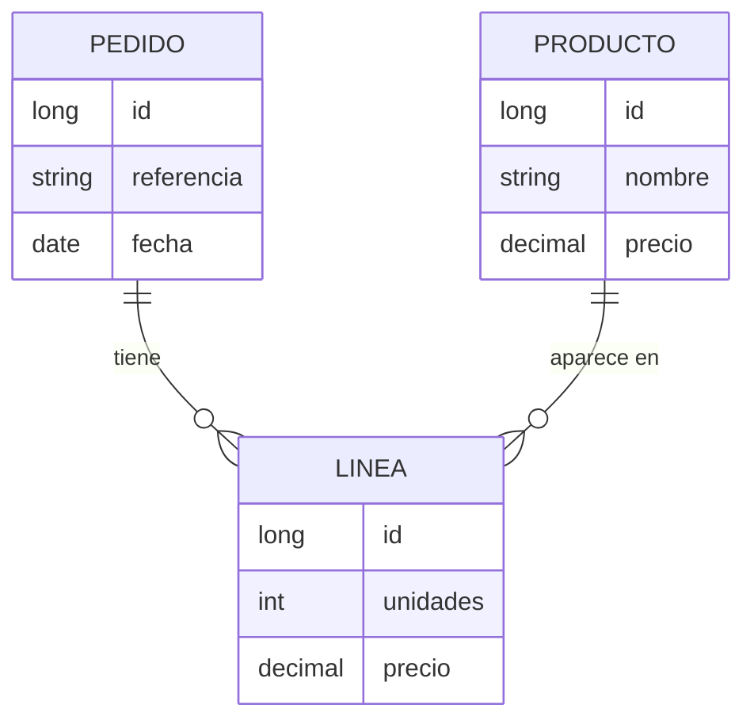

# Relaciones entre entidades

> Aquí es donde JPA deja de parecer fácil. Las relaciones son la causa del 90 % de los problemas de rendimiento de una aplicación con base de datos, y casi todos vienen del mismo sitio: **traer más de lo que necesitas, o traerlo de una en una**.

## 1. El modelo del proyecto

Un pedido tiene varias líneas; cada línea apunta a un producto.



En la base de datos eso son **claves ajenas**: la tabla `lineas` tiene `pedido_id` y `producto_id`. En Java son **referencias entre objetos**. El mapeo es decirle a JPA cuál es cuál.

## 2. `@ManyToOne`: el lado que manda

``` { .java .numerado }
@Entity
public class Linea {

    @Id @GeneratedValue(strategy = GenerationType.IDENTITY)
    private Long id;

    @ManyToOne(fetch = FetchType.LAZY, optional = false)
    @JoinColumn(name = "pedido_id", nullable = false)
    private Pedido pedido;

    @ManyToOne(fetch = FetchType.LAZY, optional = false)
    @JoinColumn(name = "producto_id", nullable = false)
    private Producto producto;

    @Column(nullable = false)
    private int unidades;

    @Column(nullable = false, precision = 10, scale = 2)
    // se copia al crear: el del producto puede cambiar
    private BigDecimal precioUnitario;
}
```

**El lado `@ManyToOne` es el dueño de la relación**: es el que tiene la columna de clave ajena. Escribir aquí es lo que persiste el vínculo.

!!! tip "`precioUnitario` copiado, no referenciado"
    Una línea de pedido guarda el precio **del momento de la venta**. Si solo tuvieras la referencia al producto, subir el precio mañana cambiaría el importe de todas las facturas del pasado. Este es un error de diseño clásico y muy caro.

## 3. `@OneToMany`, `mappedBy` y la cascada

``` { .java .numerado }
@Entity
public class Pedido {

    @Id @GeneratedValue(strategy = GenerationType.IDENTITY)
    private Long id;

    @OneToMany(mappedBy = "pedido",
               cascade = CascadeType.ALL,
               orphanRemoval = true)
    private List<Linea> lineas = new ArrayList<>();

    public void anadir(Linea linea) {  // método de conveniencia: usa SIEMPRE esto
        lineas.add(linea);
        linea.setPedido(this);                  // ← las dos direcciones
    }

    public void quitar(Linea linea) {
        lineas.remove(linea);
        linea.setPedido(null);
    }

    public BigDecimal total() {
        return lineas.stream()
                .map(l -> l.getPrecioUnitario().multiply(BigDecimal.valueOf(l.getUnidades())))
                .reduce(BigDecimal.ZERO, BigDecimal::add);
    }
}
```

Tres cosas que hay que entender bien:

**`mappedBy = "pedido"`** significa «yo no soy el dueño; la columna está en el campo `pedido` de `Linea`». Sin él, Hibernate crearía una **tabla intermedia** que no quieres.

**`cascade = ALL`** propaga las operaciones: al guardar el pedido se guardan sus líneas. Sin cascada tendrías que salvar cada línea a mano.

**`orphanRemoval = true`** borra de la base de datos la línea que sacas de la lista. Sin esto, `lineas.remove(l)` deja una fila huérfana con `pedido_id` a null… o falla por la restricción `not null`.

!!! danger "Las dos direcciones, siempre"
    ```java
    pedido.getLineas().add(linea);     // MAL  solo un lado
    linea.setPedido(pedido);           // MAL  solo el otro
    pedido.anadir(linea);              // BIEN los dos
    ```
    Si actualizas solo un lado, el objeto en memoria y la base de datos dicen cosas distintas. Y como Hibernate persiste mirando **el lado dueño**, actualizar solo la lista **no guarda nada**. Por eso se escribe el método `anadir`.

## 4. `LAZY` frente a `EAGER`, y el problema N+1

!!! analogia "Analogía"
    El problema N+1 es ir al supermercado con una lista de 100 productos y **hacer 100 viajes**, uno por producto. `JOIN FETCH` es llevar la lista entera y hacer un solo viaje. El código se ve idéntico en los dos casos; la diferencia solo aparece en el tiempo de respuesta y en el log de SQL.

**Este es el apartado más importante de la unidad.**

```java
@ManyToOne(fetch = FetchType.LAZY)     // BIEN no trae el pedido hasta que lo pidas
@ManyToOne(fetch = FetchType.EAGER)    // MAL  lo trae siempre, lo uses o no
```

Por defecto, `@ManyToOne` y `@OneToOne` son **`EAGER`**, y `@OneToMany` y `@ManyToMany` son `LAZY`. Los dos primeros por defecto están mal casi siempre: **pon `LAZY` en todo** y trae lo que necesites cuando lo necesites.

Ahora el problema famoso. Este código inocente:

```java
List<Pedido> pedidos = repositorio.findAll();       // 1 consulta
for (Pedido p : pedidos)
    total += p.getLineas().size();                   // ¡una consulta POR PEDIDO!
```

Con 100 pedidos son **101 consultas**. Con 1.000, mil una. Se llama **N+1** y es la causa número uno de que una aplicación funcione en desarrollo con 10 filas y se arrastre en producción.

Lo verás en la consola con `show-sql`: una pared de `select ... from lineas where pedido_id=?` repetida.

## 5. Las tres soluciones al N+1

**`JOIN FETCH`** — trae todo en una consulta:

```java
@Query("SELECT DISTINCT p FROM Pedido p JOIN FETCH p.lineas WHERE p.fecha >= :desde")
List<Pedido> conLineasDesde(@Param("desde") LocalDate desde);
```

El `DISTINCT` hace falta porque el `JOIN` repite el pedido una vez por línea.

**`@EntityGraph`** — lo mismo, declarativo y combinable con consultas derivadas:

```java
@EntityGraph(attributePaths = {"lineas", "lineas.producto"})
List<Pedido> findByFechaAfter(LocalDate fecha);
```

**Consulta agregada** — cuando solo necesitas un número, no traigas objetos:

```java
@Query("SELECT p.id, COUNT(l) FROM Pedido p LEFT JOIN p.lineas l GROUP BY p.id")
List<Object[]> conteoDeLineas();
```

!!! warning "`JOIN FETCH` y paginación no se llevan bien"
    Si combinas `JOIN FETCH` de una colección con `Pageable`, Hibernate avisa: `firstResult/maxResults specified with collection fetch; applying in memory`. Está trayendo **todas** las filas y paginando en memoria — exactamente lo que querías evitar. Solución: dos consultas, una para los ids paginados y otra con `JOIN FETCH ... WHERE id IN (:ids)`.

Y el error que verás seguro alguna vez:

```
LazyInitializationException: could not initialize proxy - no Session
```

Significa que pediste una relación perezosa **fuera de la transacción**, normalmente al serializar a JSON en el controlador. La solución **no** es poner `EAGER` ni `spring.jpa.open-in-view: true`: es traer lo que necesitas con `JOIN FETCH` y **devolver un DTO**, no la entidad.

## 6. `@ManyToMany` y por qué casi nunca lo quieres

```java
@ManyToMany
@JoinTable(name = "producto_etiqueta",
           joinColumns = @JoinColumn(name = "producto_id"),
           inverseJoinColumns = @JoinColumn(name = "etiqueta_id"))
private Set<Etiqueta> etiquetas = new HashSet<>();
```

Funciona para relaciones **puras**, sin datos propios: productos y etiquetas. Pero en cuanto la relación tiene algo que decir —una fecha, una cantidad, un orden— deja de valer, y eso pasa casi siempre.

La solución es la que ya estás usando sin darte cuenta: **convertir la relación en una entidad**. `Linea` no es más que un `@ManyToMany` entre `Pedido` y `Producto` con `unidades` y `precioUnitario` dentro. Dos `@ManyToOne` en vez de un `@ManyToMany`, y ganas la capacidad de guardar lo que quieras de esa relación.

---

## Pruébalo ahora (40 min)

!!! reto "Trabaja tú ahora"
    Este bloque se hace **en clase, en tu equipo**. No se entrega ni puntúa: es la práctica que hace que el examen te salga.

**Parte 1.** Crea `Pedido` y `Linea` con la relación bidireccional, `cascade` y `orphanRemoval`. Guarda un pedido con tres líneas de una sola llamada a `save`.

**Parte 2 — El bug del lado único.** Añade una línea con `pedido.getLineas().add(linea)` **sin** el `setPedido`, guarda y consulta la base de datos: la línea no está, o está con `pedido_id` nulo. Cámbialo por el método `anadir` y repite.

**Parte 3 — Provoca el N+1 y cuéntalo.** Carga 50 pedidos con líneas, ejecuta:

```java
repositorio.findAll().forEach(p -> IO.println(p.getLineas().size()));
```

y **cuenta los `select` en la consola**. Deberían salir 51. Anota el número.

**Parte 4 — Arréglalo.** Cambia a la consulta con `JOIN FETCH` y vuelve a contar: **1**. Ese salto de 51 a 1 es la lección de la sesión.

**Parte 5 — `LazyInitializationException`.** Devuelve la entidad `Pedido` directamente desde el controlador y llama al endpoint. Explota al serializar. Arréglalo con un DTO y `JOIN FETCH`.

**Parte 6 — `orphanRemoval`.** Quita una línea de la lista y guarda. Con `orphanRemoval = true` la fila desaparece; sin él, falla o queda huérfana. Pruébalo de las dos formas.

---

## Ejercicios (con solución)

### Ejercicio 1 — ¿Quién es el dueño?
En `Pedido ↔ Linea`, ¿en qué lado está la clave ajena y qué implica?

??? success "Solución"

    En <b>Linea</b>, el lado <code>@ManyToOne</code>: la tabla <code>lineas</code> tiene la columna <code>pedido_id</code>. Ese es el <b>lado dueño</b>, y es el único que Hibernate mira para persistir la relación.<br>
    Implicación práctica: si solo haces <code>pedido.getLineas().add(l)</code> sin <code>l.setPedido(pedido)</code>, <b>no se guarda el vínculo</b>. Por eso se escribe un método <code>anadir</code> que actualice los dos lados y no se toca la lista directamente.


### Ejercicio 2 — Cuenta las consultas
Con 200 pedidos de 3 líneas cada uno, ¿cuántas consultas lanza `findAll()` seguido de recorrer las líneas? ¿Y con `JOIN FETCH`?

??? success "Solución"

    Sin <code>JOIN FETCH</code>: <b>201</b> — una para los pedidos y una por cada pedido al tocar su colección perezosa. Con <code>JOIN FETCH</code>: <b>1</b>.<br>
    En una red con 2 ms de latencia por consulta, eso son 400 ms frente a 2 ms. Y crece con los datos: es el problema que hace que algo funcione en clase y se caiga en producción.


### Ejercicio 3 — ¿Por qué no poner todo `EAGER`?
Si `EAGER` evita el N+1 y la `LazyInitializationException`, ¿por qué no usarlo siempre?

??? success "Solución"

    Porque trae <b>siempre</b> la relación, la uses o no, y las relaciones encadenan: pedido → líneas → producto → categoría… Un simple <code>findById</code> puede acabar cargando media base de datos. Y no puedes desactivarlo por consulta: <code>EAGER</code> es una decisión global de la entidad.<br>
    Lo correcto es <b><code>LAZY</code> en todo</b> y decidir <b>en cada consulta</b> qué necesitas con <code>JOIN FETCH</code> o <code>@EntityGraph</code>. Optimizas por caso de uso en vez de por entidad.


### Ejercicio 4 — El precio de la línea
¿Por qué `Linea` guarda `precioUnitario` en vez de leerlo del producto?

??? success "Solución"

    Porque una factura es un <b>documento histórico</b>. Si el importe se calculara con el precio actual del producto, subir mañana el precio cambiaría el total de todas las ventas pasadas: la contabilidad dejaría de cuadrar y sería, además, ilegal.<br>
    La regla general: los datos que forman parte de un hecho consumado —precio, IVA aplicado, dirección de envío— se <b>copian</b> en el momento; los que son de referencia se enlazan.


### Ejercicio 5 — `@ManyToMany` o entidad intermedia
Alumnos y asignaturas. ¿`@ManyToMany` o una entidad `Matricula`?

??? success "Solución"

    <b>Entidad <code>Matricula</code></b>, casi seguro. En cuanto necesites el curso académico, la nota, la fecha de matriculación o el número de convocatoria —y lo vas a necesitar—, el <code>@ManyToMany</code> no tiene dónde guardarlo y hay que migrar con datos ya en producción.<br>
    <code>@ManyToMany</code> solo se sostiene cuando la relación es <b>pura</b> y estás seguro de que seguirá siéndolo: producto ↔ etiqueta, usuario ↔ rol. Ante la duda, entidad intermedia: cuesta diez líneas más hoy y te ahorra una migración mañana.

