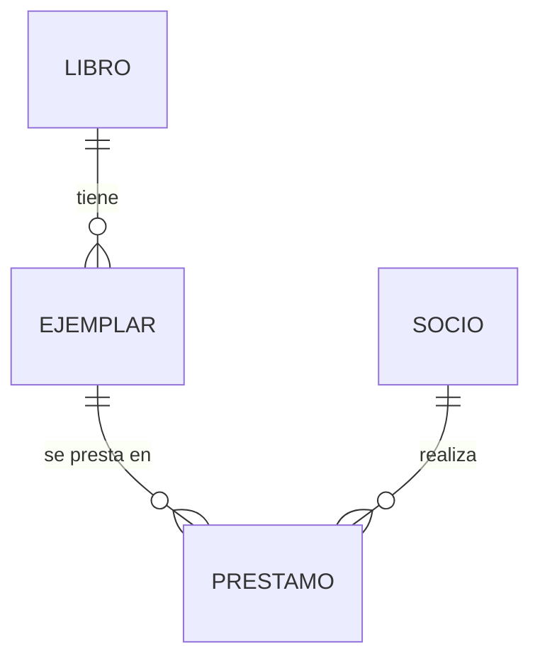

# Retos — UT5

Tres retos. **Los dos primeros vienen resueltos**; **el tercero se entrega**, y es del mismo tamaño y la misma forma que el examen práctico de la unidad.

| | Reto | Sesiones | |
|:-:|---|:-:|---|
| **R1** | Ponerle una base de datos debajo, sin romper nada | S1–S11 | :material-check-circle: Resuelto |
| **R2** | Las relaciones y el N+1 | S12–S20 | :material-check-circle: Resuelto |
| **R3** | El catálogo de la biblioteca | S21–S23 | :material-pencil: **A entregar** |

!!! info "Con el SQL a la vista, siempre"
    En toda esta unidad se trabaja con `spring.jpa.show-sql: true` y el formateo activado. **Lo que se aprende aquí es a mirar qué SQL genera JPA**, no a memorizar anotaciones.

    ```yaml
    spring:
      jpa:
        show-sql: true
        properties.hibernate.format_sql: true
    ```

---

# R1 · Ponerle una base de datos debajo

**Sesiones S1–S11** · Resuelto

## La situación

La API de la UT4 funciona perfectamente… hasta que la reinicias. Entonces el inventario vuelve a estar vacío, porque todo vivía en un `ConcurrentHashMap`.

## La pregunta

> **Haced que los datos sobrevivan al reinicio sin que el servicio, el controlador ni los tests se enteren de que ha cambiado nada.**

## Restricciones

- El **servicio no se toca**. Si te ves modificándolo, el acceso a datos estaba filtrado hacia arriba.
- Los tests del controlador **siguen en verde sin tocarlos**.
- Se mira el SQL generado. Toda consulta que no entiendas, se mira.
- Nada de `ddl-auto: create-drop` fuera de los tests.

## Criterios de aceptación

- [ ] Los datos siguen ahí después de parar y arrancar.
- [ ] `ProductoRepositorio extends JpaRepository` y **la implementación en memoria ha desaparecido** de producción.
- [ ] El servicio está **igual** que antes, salvo los nombres de los métodos del repositorio.
- [ ] Hay al menos una consulta derivada del nombre del método y una `@Query`.

??? success "Solución · de `record` a entidad"

    ```java
    @Entity
    @Table(name = "producto",
           uniqueConstraints = @UniqueConstraint(columnNames = "etiqueta"))
    public class Producto {

        @Id
        @GeneratedValue(strategy = GenerationType.IDENTITY)          // (1)
        private Long id;

        @Column(nullable = false, unique = true, length = 20)
        private String etiqueta;

        @Column(nullable = false, length = 60)
        private String nombre;

        @Enumerated(EnumType.STRING)                                 // (2)
        @Column(nullable = false, length = 20)
        private Categoria categoria;

        @Column(nullable = false, precision = 10, scale = 2)         // (3)
        private BigDecimal precio;

        @Column(nullable = false)
        private int stock;

        protected Producto() { }                                     // (4)

        public Producto(String etiqueta, String nombre,
                        Categoria categoria, BigDecimal precio, int stock) { … }

        // getters; setters solo de lo que de verdad cambia
    }
    ```

    1.  `IDENTITY` delega el identificador en la base de datos (`AUTO_INCREMENT`, `SERIAL`). Es lo normal con MySQL/MariaDB y PostgreSQL. `SEQUENCE` permite a Hibernate agrupar inserciones, y es mejor cuando insertas en lotes.
    2.  **`EnumType.STRING`, siempre.** Con `ORDINAL` se guarda la **posición** del valor en el `enum`: el día que alguien añada un valor en medio, todos los registros antiguos pasan a significar otra cosa. Es corrupción silenciosa de datos y no hay forma de deshacerla.
    3.  **`BigDecimal` para dinero**, con `precision` y `scale`. `double` arrastra errores de redondeo que en una factura acaban en una reclamación.
    4.  Constructor sin argumentos **`protected`**: JPA lo necesita para instanciar por reflexión, y `protected` impide que lo use tu código por error.

    **Y por qué ya no es un `record`.** Un `record` es inmutable y final: JPA necesita poder crear el objeto vacío y rellenarlo, y necesita poder extenderlo para los *proxies* de carga perezosa. Los records siguen siendo perfectos para los DTO — de hecho es donde deben estar.

??? success "Solución · el repositorio desaparece"

    ```java
    public interface ProductoRepositorio extends JpaRepository<Producto, Long> {

        Optional<Producto> findByEtiqueta(String etiqueta);          // (1)

        List<Producto> findByCategoriaAndStockGreaterThan(Categoria c, int stock);

        boolean existsByEtiqueta(String etiqueta);

        @Query("""
               select p from Producto p
               where p.stock < :minimo
               order by p.stock asc
               """)                                                   // (2)
        List<Producto> conStockBajo(@Param("minimo") int minimo);

        @Query(value = "select * from producto where stock = 0",
               nativeQuery = true)                                    // (3)
        List<Producto> agotados();
    }
    ```

    1.  **No escribes la implementación.** Spring Data la genera leyendo el nombre del método: `findBy` + campo + operador. Si te equivocas en el nombre de un campo, **falla al arrancar**, no en producción.
    2.  JPQL: habla de **clases y atributos** (`Producto`, `p.stock`), no de tablas y columnas. Es portable entre bases de datos.
    3.  SQL nativo: rápido y **atado al motor**. Solo cuando JPQL no llega.

    La implementación en memoria **se borra de producción** y se queda como doble de test. Ese es su papel a partir de ahora.

    Los nombres que hay que reconocer en el examen:

    | Nombre del método | SQL que genera |
    |---|---|
    | `findByNombre` | `where nombre = ?` |
    | `findByNombreContainingIgnoreCase` | `where lower(nombre) like lower('%?%')` |
    | `findByPrecioBetween` | `where precio between ? and ?` |
    | `findByCategoriaOrderByPrecioDesc` | `where categoria = ? order by precio desc` |
    | `existsByEtiqueta` | `select count(*) > 0 …` |
    | `deleteByStock` | `delete from …` (necesita `@Transactional`) |

??? success "Solución · qué cambia en el servicio (casi nada)"

    ```java
    @Service
    public class ProductoServicio {

        private final ProductoRepositorio repositorio;

        public ProductoServicio(ProductoRepositorio repositorio) {   // (1)
            this.repositorio = repositorio;
        }

        public Producto obtener(Long id) {
            return repositorio.findById(id)                          // (2)
                    .orElseThrow(() -> new ProductoNoEncontradoException(id));
        }

        @Transactional                                               // (3)
        public Producto ajustarStock(Long id, int unidades) {
            var producto = obtener(id);
            if (producto.getStock() + unidades < 0) {
                throw new StockInsuficienteException(id, producto.getStock());
            }
            producto.setStock(producto.getStock() + unidades);
            return producto;                                         // (4)
        }
    }
    ```

    1.  **Exactamente igual que antes.** El servicio no sabe que debajo hay una base de datos.
    2.  Lo único que cambia: `buscarPorId` pasa a llamarse `findById`, que es el nombre de `JpaRepository`.
    3.  `@Transactional` porque se modifica.
    4.  **Y aquí está lo que más sorprende: no hay `save`.** Dentro de una transacción, la entidad está *gestionada*: Hibernate detecta el cambio y lanza el `UPDATE` al cerrar. Se llama *dirty checking*.

        Poner `repositorio.save(producto)` tampoco está mal —es explícito y muchos equipos lo prefieren—, pero hay que saber que **no hace falta**.

    Y la prueba de que todo estaba bien montado:

    ```bash
    curl -X POST localhost:8080/api/v1/productos -H "Content-Type: application/json" \
         -d '{"etiqueta":"PC-042","nombre":"Portátil","categoria":"INFORMATICA","precio":649.99,"stock":10}'

    # Ctrl+C y volver a arrancar
    curl -s localhost:8080/api/v1/productos | jq length      # sigue ahí
    mvn test                                                 # sigue en verde
    ```

    **Si `mvn test` falla, mira qué test.** Si es uno del controlador, el acceso a datos se había filtrado hasta arriba y ese es el verdadero hallazgo del reto.

---

# R2 · Las relaciones y el N+1

**Sesiones S12–S20** · Resuelto

## La situación

Hay pedidos, y cada pedido tiene líneas. Listar veinte pedidos con sus líneas empieza a tardar, y en el log aparecen esto:

```
Hibernate: select p.* from pedido p
Hibernate: select l.* from linea l where l.pedido_id = ?
Hibernate: select l.* from linea l where l.pedido_id = ?
Hibernate: select l.* from linea l where l.pedido_id = ?
... (17 más)
```

## La pregunta

> **Averiguad por qué una sola consulta se ha convertido en veintiuna, y arregladlo sin cambiar de `LAZY` a `EAGER`.**

## Restricciones

- **`EAGER` no es la solución.** Quita el síntoma de este caso y lo empeora en todos los demás.
- El número de consultas hay que **contarlo**, no estimarlo.
- Las relaciones bidireccionales tienen **un solo dueño**.
- Nada de `CascadeType.ALL` sin pensar qué implica el borrado.

## Criterios de aceptación

- [ ] Está contado el número de consultas antes y después.
- [ ] Listar N pedidos con sus líneas hace **una** consulta, no N+1.
- [ ] `@OneToMany` con `mappedBy` en el lado correcto.
- [ ] Añadir una línea a un pedido lo guarda en cascada; borrar el pedido borra sus líneas.
- [ ] Existe un test que falla si vuelve el N+1.

??? success "Solución · el mapeo, con el dueño donde toca"

    ```java
    @Entity
    public class Pedido {

        @Id @GeneratedValue(strategy = GenerationType.IDENTITY)
        private Long id;

        @Column(nullable = false)
        private LocalDateTime creado;

        @OneToMany(mappedBy = "pedido",                              // (1)
                   cascade = CascadeType.ALL,                        // (2)
                   orphanRemoval = true)                             // (3)
        private List<LineaPedido> lineas = new ArrayList<>();

        public void anadir(LineaPedido linea) {                      // (4)
            lineas.add(linea);
            linea.setPedido(this);
        }
    }
    ```

    ```java
    @Entity
    public class LineaPedido {

        @Id @GeneratedValue(strategy = GenerationType.IDENTITY)
        private Long id;

        @ManyToOne(fetch = FetchType.LAZY, optional = false)         // (5)
        @JoinColumn(name = "pedido_id")                              // (6)
        private Pedido pedido;

        @ManyToOne(fetch = FetchType.LAZY, optional = false)
        @JoinColumn(name = "producto_id")
        private Producto producto;

        private int unidades;
        private BigDecimal precioUnitario;
    }
    ```

    1.  `mappedBy` dice **quién es el dueño**: el lado que tiene la clave ajena, o sea `LineaPedido`. Sin él, Hibernate crea una tabla intermedia que nadie ha pedido.
    2.  Guardar el pedido guarda sus líneas. Sin cascada hay que guardarlas a mano, una a una.
    3.  **`orphanRemoval`**: sacar una línea de la lista la borra de la base de datos. Sin esto, se queda huérfana con `pedido_id = null`.
    4.  **El método que sincroniza los dos lados.** Es el error más común de las relaciones bidireccionales: añadir a la lista y olvidar el `setPedido`. En memoria parece correcto y al recargar de la base de datos la línea no está en el pedido.
    5.  **`LAZY` en todos los `@ManyToOne`.** El valor por defecto de `@ManyToOne` es `EAGER`, y es una mala decisión heredada: cargar una línea trae el pedido y el producto aunque no los mires.
    6.  `@JoinColumn` da nombre a la clave ajena. Sin él, Hibernate inventa uno y tu esquema queda a merced de la versión.

??? success "Solución · contar las consultas y matar el N+1"

    **Primero, contarlas.** Estimar no vale:

    ```yaml
    logging.level.org.hibernate.SQL: DEBUG
    spring.jpa.properties.hibernate.generate_statistics: true
    ```

    Con eso el log dice al final de cada transacción cuántas sentencias se han ejecutado.

    **Por qué pasa.** `pedidoRepositorio.findAll()` trae los pedidos. Después, al tocar `pedido.getLineas()` de cada uno, la colección perezosa se carga: **una consulta por pedido**. Veinte pedidos, veintiuna consultas.

    **Lo que no vale:**

    ```java
    @OneToMany(fetch = FetchType.EAGER)   // NO
    ```

    Arregla este caso y estropea todos los demás: ahora *cualquier* consulta de pedidos arrastra las líneas, aunque solo quieras la fecha. Y con dos colecciones `EAGER` obtienes un `MultipleBagFetchException` y un producto cartesiano.

    **Lo que sí vale**, por orden de utilidad:

    ```java
    // 1 · JOIN FETCH: una consulta, con las líneas ya dentro
    @Query("""
           select distinct p from Pedido p
           join fetch p.lineas
           where p.creado >= :desde
           """)
    List<Pedido> conLineasDesde(@Param("desde") LocalDateTime desde);
    ```

    ```java
    // 2 · @EntityGraph: lo mismo, sin escribir JPQL
    @EntityGraph(attributePaths = "lineas")
    List<Pedido> findByCreadoAfter(LocalDateTime desde);
    ```

    ```yaml
    # 3 · por lotes: no elimina el N+1, lo reduce a N/10
    spring.jpa.properties.hibernate.default_batch_fetch_size: 20
    ```

    El `distinct` del JPQL hace falta porque el `join` devuelve una fila por línea y el pedido saldría repetido.

    **Y el test que impide que vuelva:**

    ```java
    @DataJpaTest
    class PedidoRepositorioTest {

        @Autowired PedidoRepositorio repositorio;
        @Autowired EntityManager em;

        @Test
        void traeLasLineasEnUnaSolaConsulta() {
            var stats = em.getEntityManagerFactory()
                          .unwrap(SessionFactory.class).getStatistics();
            stats.clear();

            var pedidos = repositorio.conLineasDesde(LocalDateTime.now().minusDays(30));
            pedidos.forEach(p -> p.getLineas().size());     // fuerza el acceso

            assertThat(stats.getPrepareStatementCount()).isEqualTo(1);
        }
    }
    ```

    Este test es el que convierte «lo arreglé» en «no puede volver a pasar».

??? success "Solución · transacciones e integridad"

    ```java
    @Service
    public class PedidoServicio {

        @Transactional                                               // (1)
        public Pedido crear(CrearPedidoDto dto) {
            var pedido = new Pedido(LocalDateTime.now());

            for (var l : dto.lineas()) {
                var producto = productoRepositorio.findById(l.productoId())
                        .orElseThrow(() -> new ProductoNoEncontradoException(l.productoId()));

                if (producto.getStock() < l.unidades()) {
                    throw new StockInsuficienteException(              // (2)
                            producto.getId(), producto.getStock());
                }
                producto.setStock(producto.getStock() - l.unidades());
                pedido.anadir(new LineaPedido(producto, l.unidades(), producto.getPrecio()));
            }
            return pedidoRepositorio.save(pedido);
        }

        @Transactional(readOnly = true)                              // (3)
        public List<Pedido> listar() { … }
    }
    ```

    1.  **Toda la creación en una transacción.** Si la tercera línea falla, las dos primeras no pueden haber descontado stock.
    2.  Excepción **no comprobada** (`RuntimeException`). Y esto importa: Spring hace *rollback* automático con `RuntimeException` y `Error`, pero **no** con excepciones comprobadas. Si lanzas una `Exception` normal, la transacción **se confirma igualmente** salvo que pongas `@Transactional(rollbackFor = ...)`.
    3.  `readOnly = true` en las lecturas: Hibernate se salta el *dirty checking* y algunos motores lo aprovechan.

    **Las tres trampas de `@Transactional`, que caen en el examen:**

    | Trampa | Qué pasa |
    |---|---|
    | Llamada **interna** (`this.otroMetodo()`) | La anotación **no se aplica**: el proxy solo intercepta llamadas desde fuera |
    | Método `private` o `final` | No se puede hacer proxy. La anotación no hace nada |
    | Excepción **comprobada** | No hay *rollback* salvo `rollbackFor` |

    Y **`@Version`** para las modificaciones concurrentes:

    ```java
    @Version
    private Long version;
    ```

    Con eso, si dos usuarios cargan el mismo producto y los dos lo guardan, el segundo recibe `OptimisticLockingFailureException` en vez de pisar silenciosamente el cambio del primero. El controlador lo traduce a **`409 Conflict`**.

---

# R3 · El catálogo de la biblioteca

**Sesiones S21–S23** · :material-pencil: **A entregar**

!!! reto "Este no lleva solución"
    Mismo tamaño y mismos criterios que el **examen práctico de la UT5**.

## La situación

La biblioteca del centro lleva los préstamos en un cuaderno. Quieren un sistema que sepa, en cualquier momento, qué ejemplares están prestados y a quién, y que no deje prestar dos veces el mismo ejemplar.

## La pregunta

> **Modelad libros, ejemplares, socios y préstamos con JPA, y haced que el listado de préstamos con su libro y su socio se resuelva en una sola consulta.**

## El modelo mínimo



| Entidad | Campos |
|---|---|
| **Libro** | isbn (único), título, autor, año |
| **Ejemplar** | código (único), libro, estado (`DISPONIBLE`, `PRESTADO`, `BAJA`) |
| **Socio** | número (único), nombre, correo, alta |
| **Préstamo** | ejemplar, socio, fecha de salida, fecha de devolución prevista, fecha real |

## Restricciones

- **`EnumType.STRING`** en todos los `enum`.
- **`BigDecimal`** si aparece cualquier importe (una sanción, por ejemplo).
- Todos los `@ManyToOne` en **`LAZY`**.
- Las relaciones bidireccionales, con `mappedBy` y método de sincronización.
- **Nada de `EAGER`** para resolver el N+1.
- `spring.jpa.show-sql: true` mientras trabajas.

## Criterios de aceptación

| # | Qué | Peso |
|:-:|---|:-:|
| **1** | Las cuatro entidades mapeadas con tipos, restricciones y unicidad correctos | 1,5 |
| **2** | Las relaciones con su dueño, `mappedBy`, cascada y `orphanRemoval` donde toque | 2,0 |
| **3** | Repositorios con **dos consultas derivadas** y **una `@Query`** con JPQL | 1,5 |
| **4** | Listar préstamos con libro y socio **en una sola consulta**, demostrado contando | 2,0 |
| **5** | Prestar un ejemplar ya prestado devuelve **`409`**; todo dentro de una transacción | 1,5 |
| **6** | Al menos **tres tests** con `@DataJpaTest`, uno de ellos contando consultas | 1,5 |

## Cómo sabrás que está bien

```bash
# 1 · prestar
curl -i -X POST localhost:8080/api/v1/prestamos \
     -H "Content-Type: application/json" \
     -d '{"codigoEjemplar":"EJ-0007","numeroSocio":"S-118","dias":15}'
# → 201 + Location

# 2 · prestar el mismo ejemplar otra vez
curl -i -X POST localhost:8080/api/v1/prestamos \
     -H "Content-Type: application/json" \
     -d '{"codigoEjemplar":"EJ-0007","numeroSocio":"S-204","dias":15}'
# → 409

# 3 · el listado, mirando el log
curl -s localhost:8080/api/v1/prestamos | jq length
# → en el log: UNA consulta, no una por préstamo
```

!!! tip "Las tres trampas"
    **El N+1 se cuela por donde no miras.** Aunque uses `join fetch` en el listado, el DTO de respuesta puede tocar `prestamo.getEjemplar().getLibro().getTitulo()` y disparar otra cadena. Cuenta las consultas **después** de serializar, no antes.

    **`orphanRemoval` y `CascadeType.REMOVE` no son lo mismo.** Borrar un libro con `cascade = ALL` borra sus ejemplares… y si alguno tiene préstamos históricos, revienta por la clave ajena. Decide qué quieres que pase y escríbelo.

    **El estado del ejemplar y el préstamo activo dicen lo mismo dos veces.** Si guardas las dos cosas, se van a desincronizar. Elige una fuente de verdad y deriva la otra.

## Cómo se entrega

Un `.zip` sin `target`, o el repositorio de Classroom. Antes de entregar:

- [ ] `mvn test` en verde. **Si no compila, es un cero.**
- [ ] Las tres órdenes de arriba dan lo que dicen.
- [ ] En el log del listado hay **una** consulta.
- [ ] `grep -rn "EAGER" src/main` no devuelve nada.
