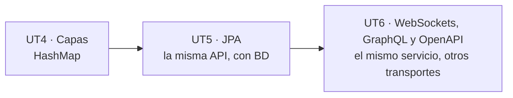

# Retos de la UT5

Tres proyectos con Spring Data JPA. **Los dos primeros se construyen en clase; el tercero se entrega y es el más completo de la unidad.**

| | Reto | Formato | Sesiones |
|:-:|---|---|:-:|
| **1** | :material-check-circle: **Videoclub** — resuelto en clase | Guiado, dos entidades 1:N | S7–S8 |
| **2** | :material-check-circle: **Instituto** — resuelto en clase | Guiado con huecos, N:M | S9 |
| **3** | :material-upload: **El que entregas** — a elegir entre tres | Autónomo, tres entidades | S10–S11 |

!!! info "La diferencia con los retos de la UT4"
    Allí el repositorio era un `HashMap` y el reto estaba en las capas. Aquí las capas ya las sabes, y el reto está en **el modelo de datos**: qué relación es cada una, dónde va la clave ajena, qué se borra en cascada y qué no, y cómo evitar el N+1.

    Son los errores que no se ven hasta que la tabla tiene 10.000 filas, y por eso están en la rúbrica.

---

## Reto 1 · Videoclub :material-check-circle:

> **API REST de un videoclub.** Dos entidades con una relación **1:N**, borrado lógico, paginación y una operación de negocio con reglas.

### El modelo

```java
@Entity @Table(name = "generos")
public class Genero {
    @Id @GeneratedValue(strategy = GenerationType.IDENTITY)
    private Long id;
    @Column(nullable = false, unique = true, length = 40)
    private String nombre;
    @Column(name = "is_deleted", nullable = false)
    private boolean deleted = false;

    @OneToMany(mappedBy = "genero", fetch = FetchType.LAZY)
    private List<Pelicula> peliculas = new ArrayList<>();
}

@Entity @Table(name = "peliculas",
        indexes = @Index(name = "idx_peli_titulo", columnList = "titulo"))
public class Pelicula {
    @Id @GeneratedValue(strategy = GenerationType.IDENTITY)
    private Long id;
    @Column(nullable = false, length = 200) private String titulo;
    @Column(nullable = false)               private String director;
    @Column(nullable = false)               private Integer anio;
    @Column(nullable = false, precision = 6, scale = 2) private BigDecimal precioAlquiler;
    @Column(nullable = false) private Integer copias;      // cuántas hay
    @Column(nullable = false) private Integer alquiladas;  // cuántas están fuera

    @ManyToOne(fetch = FetchType.LAZY, optional = false)
    @JoinColumn(name = "genero_id", nullable = false,
                foreignKey = @ForeignKey(name = "fk_peli_genero"))
    private Genero genero;

    @Column(name = "is_deleted", nullable = false) private boolean deleted = false;
}
```

### Lo que hay que construir

```
GET    /api/v1/peliculas        ?page= &size= &sort= &genero= &anioMin= &anioMax= &titulo= &disponible=
GET    /api/v1/peliculas/{id}
POST   /api/v1/peliculas
PUT    /api/v1/peliculas/{id}
PATCH  /api/v1/peliculas/{id}
DELETE /api/v1/peliculas/{id}        ← lógico

POST   /api/v1/peliculas/{id}/alquiler
POST   /api/v1/peliculas/{id}/devolucion
GET    /api/v1/peliculas/estadisticas

GET    /api/v1/generos               CRUD completo
GET    /api/v1/generos/{id}/peliculas
```

### Las reglas

| Regla | Código |
|---|:-:|
| El título no se repite dentro del mismo género | **409** |
| `alquiladas` nunca supera `copias` | **409** |
| No se puede devolver si `alquiladas == 0` | **409** |
| No se puede borrar una película con copias alquiladas | **409** |
| No se puede borrar un género con películas | **409** |
| `anio` entre 1895 y el año actual | 400 |
| `copias` mínimo 1 | 400 |
| La película debe pertenecer a un género **que exista** | 400 |

!!! reto "Las tres decisiones que se discuten en clase"
    **1. ¿Dónde va la clave ajena?** En `peliculas`, porque una película tiene **un** género y un género tiene **muchas** películas. Así que el lado dueño es el `@ManyToOne` y el `@OneToMany` lleva `mappedBy`. Sin ese `mappedBy`, Hibernate crea una tabla intermedia `generos_peliculas` que no quieres.

    **2. ¿`cascade = ALL` en el `@OneToMany`?** **No.** Borrar el género `TERROR` borraría todas las películas de terror. Lo que queremos es lo contrario: que **no se pueda** borrar un género con películas, y eso es un 409 comprobado en el servicio.

    **3. ¿`POST /peliculas/{id}/alquiler` o `PATCH` con `{"alquiladas": 3}`?** La primera. Un alquiler **no es editar un campo**: tiene reglas propias. Si lo expones como PATCH de `alquiladas`, un cliente puede poner `alquiladas: 999`.

### El índice compuesto que hay que ver

```java
@Table(name = "peliculas",
       uniqueConstraints = @UniqueConstraint(
               name = "uk_peli_titulo_genero",
               columnNames = {"titulo", "genero_id"}))
```

!!! success "Unicidad compuesta: por qué la pone la base de datos"
    «El título no se repite dentro del mismo género» significa que puede haber dos *Drácula*, una en TERROR y otra en COMEDIA. Eso es una clave única **de dos columnas**.

    Y la comprobación va en la base de datos, no solo en el servicio: entre tu `existsBy...` y tu `save` cabe otra petición haciendo lo mismo. Es el E23 de la UT3, otra vez.

    El servicio comprueba **y** captura:

    ```java
    try {
        return mapper.toResponse(repositorio.save(peli));
    } catch (DataIntegrityViolationException e) {
        throw new PeliculaConflictException("Ya existe esa película en ese género");
    }
    ```

### Entrega

Nada: se construye en clase y queda como material de estudio.

---

## Reto 2 · Instituto :material-check-circle:

> Se te da el proyecto **con las entidades escritas y el resto en huecos**. El reto es la relación **N:M** y lo que trae de cola.

### Lo que se te da

```
instituto-base/
├── pom.xml                                      ✅
├── compose.yaml                                 ✅
├── .env.example                                 ✅
├── src/main/resources/
│   ├── application.properties                   ✅
│   ├── application-dev.properties               ✅
│   ├── application-prod.properties              ⬜ TODO
│   └── data.sql                                 ✅
└── src/main/java/es/iesx/instituto/
    ├── alumnos/models/Alumno.java               ✅
    ├── modulos/models/Modulo.java               ✅
    ├── matriculas/models/Matricula.java          ✅
    ├── */dto/*.java                              ✅
    ├── */repositories/*.java                     ⬜ TODO
    ├── */mappers/*.java                          ⬜ TODO
    ├── */services/*Impl.java                     ⬜ TODO
    ├── */controllers/*.java                      ⬜ TODO
    └── common/GlobalExceptionHandler.java        ⬜ TODO
```

### La relación N:M con datos propios

```java
// Un alumno cursa varios módulos; un módulo tiene varios alumnos.
// Pero la MATRÍCULA tiene datos propios: la nota y la fecha.
// Por eso NO es un @ManyToMany: es una entidad intermedia.

@Entity @Table(name = "matriculas",
       uniqueConstraints = @UniqueConstraint(
               name = "uk_matricula",
               columnNames = {"alumno_id", "modulo_id", "curso"}))
public class Matricula {
    @Id @GeneratedValue(strategy = GenerationType.IDENTITY)
    private Long id;

    @ManyToOne(fetch = FetchType.LAZY, optional = false)
    @JoinColumn(name = "alumno_id", nullable = false)
    private Alumno alumno;

    @ManyToOne(fetch = FetchType.LAZY, optional = false)
    @JoinColumn(name = "modulo_id", nullable = false)
    private Modulo modulo;

    @Column(nullable = false, length = 9) private String curso;    // "2025-2026"
    @Column(precision = 4, scale = 2)     private BigDecimal nota; // puede ser null
    @Column(name = "fecha_matricula", nullable = false)
    private LocalDate fechaMatricula = LocalDate.now();
}
```

!!! danger "La decisión más importante del reto: `@ManyToMany` o entidad intermedia"
    | | `@ManyToMany` | Entidad intermedia |
    |---|---|---|
    | La tabla de unión | La crea Hibernate | La defines tú |
    | Datos propios en la relación | **Imposible** | Sí: nota, fecha, estado |
    | Consultar la relación | No se puede | Es un repositorio más |
    | Complejidad | Menos | Más |

    **En cuanto la relación tiene un dato propio, deja de ser un `@ManyToMany`.** Y casi todas los tienen: una matrícula tiene nota, un pedido tiene cantidad, una inscripción tiene fecha.

    El `@ManyToMany` puro vale para etiquetas: «este artículo tiene estas etiquetas», y nada más.

### Lo que hay que construir

```
GET    /api/v1/alumnos               ?page= &size= &sort= &nombre= &curso=
GET    /api/v1/alumnos/{id}
GET    /api/v1/alumnos/{id}/matriculas      ← con el módulo y la nota
GET    /api/v1/alumnos/{id}/expediente      ← media, aprobados, suspensos
POST   /api/v1/alumnos        · PUT · PATCH · DELETE (lógico)

GET    /api/v1/modulos               CRUD completo
GET    /api/v1/modulos/{id}/alumnos  ?curso=2025-2026

POST   /api/v1/matriculas            ← matricular
PATCH  /api/v1/matriculas/{id}/nota  ← poner la nota
DELETE /api/v1/matriculas/{id}       ← desmatricular
GET    /api/v1/matriculas/estadisticas
```

### Las reglas, y una que obliga a pensar

| Regla | Código |
|---|:-:|
| Un alumno no se matricula dos veces del mismo módulo en el mismo curso | **409** |
| La nota entre 0 y 10, con dos decimales | 400 |
| **No se puede matricular de un módulo de 2.º sin tener aprobados sus prerrequisitos de 1.º** | **409** |
| No se puede poner nota a una matrícula de un curso cerrado | 409 |
| No se puede borrar un módulo con matrículas | 409 |
| El DNI del alumno se valida con expresión regular y con la letra correcta | 400 |
| El curso tiene formato `AAAA-AAAA` y los años consecutivos | 400 |

!!! reto "La regla de los prerrequisitos es el reto de verdad"
    `Modulo` tiene una relación **consigo mismo**:

    ```java
    @ManyToMany(fetch = FetchType.LAZY)
    @JoinTable(name = "modulo_prerrequisitos",
               joinColumns        = @JoinColumn(name = "modulo_id"),
               inverseJoinColumns = @JoinColumn(name = "prerrequisito_id"))
    private Set<Modulo> prerrequisitos = new HashSet<>();
    ```

    Y la comprobación:

    ```java
    private void comprobarPrerrequisitos(Alumno alumno, Modulo modulo) {
        var aprobados = matriculasRepository
                .findByAlumnoIdAndNotaGreaterThanEqual(alumno.getId(), new BigDecimal("5.00"))
                .stream().map(m -> m.getModulo().getId()).collect(Collectors.toSet());

        var faltan = modulo.getPrerrequisitos().stream()
                .filter(p -> !aprobados.contains(p.getId()))
                .map(Modulo::getNombre)
                .toList();

        if (!faltan.isEmpty())
            throw new MatriculaConflictException(
                    "Faltan prerrequisitos: " + String.join(", ", faltan));
    }
    ```

    **Y aquí aparece el N+1 de manual:** ese `m.getModulo().getId()` dentro del `stream` lanza una consulta por cada matrícula. Con 40 matrículas, 41 consultas. Parte del reto es verlo en el log con `show-sql=true` y arreglarlo:

    ```java
    @Query("""
           SELECT m.modulo.id FROM Matricula m
           WHERE m.alumno.id = :alumnoId AND m.nota >= 5.00
           """)
    Set<Long> idsModulosAprobados(@Param("alumnoId") Long alumnoId);
    ```

    **Una consulta, y no trae ni una entidad entera**: solo los ids, que es lo único que se usa. De 41 consultas a 1.

### `GET /alumnos/{id}/expediente`

```json
{
  "alumno": "Ana Pérez",
  "curso": "2025-2026",
  "matriculados": 8,
  "calificados": 6,
  "aprobados": 5,
  "suspensos": 1,
  "pendientes": 2,
  "media": 6.83,
  "porModulo": {
    "Bases de Datos": 7.50,
    "DWES": 8.00,
    "Despliegue": null
  }
}
```

!!! tip "Esto es la UT2 con datos de la base de datos"
    ```java
    var matriculas = matriculasRepository.findByAlumnoIdAndCurso(id, curso);

    return new ExpedienteResponse(
        alumno.getNombre(), curso,
        matriculas.size(),
        matriculas.stream().filter(m -> m.getNota() != null).count(),
        matriculas.stream().filter(m -> m.getNota() != null
                && m.getNota().compareTo(APROBADO) >= 0).count(),
        matriculas.stream().filter(m -> m.getNota() != null
                && m.getNota().compareTo(APROBADO) < 0).count(),
        matriculas.stream().filter(m -> m.getNota() == null).count(),
        matriculas.stream().filter(m -> m.getNota() != null)
                .map(Matricula::getNota)
                .reduce(BigDecimal.ZERO, BigDecimal::add)
                .divide(BigDecimal.valueOf(calificados), 2, RoundingMode.HALF_UP),
        matriculas.stream().collect(Collectors.toMap(
                m -> m.getModulo().getNombre(),
                Matricula::getNota,
                (a, b) -> a, TreeMap::new)));
    ```

    Dos detalles que importan:

    - **La media con `BigDecimal` y `RoundingMode.HALF_UP`**, no con `average()` de `double`. Son notas: el redondeo tiene consecuencias.
    - **`Collectors.toMap` con función de mezcla y `TreeMap::new`**: la función de mezcla evita el `IllegalStateException` si hay claves repetidas (el E26 del banco de la UT2), y el `TreeMap` hace que el JSON salga siempre igual.

### Entrega

Nada, pero **se exige que los tests pasen** y que el log no muestre N+1 al pedir un expediente. El reto 3 se construye encima.

---

## Reto 3 · El que entregas :material-upload:

> **El proyecto más completo del trimestre.** Tres entidades relacionadas, paginación, criterios combinables, borrado lógico, reglas de negocio y los tres niveles de test. En pareja.

Se entrega en la **S11** y es el **40 % de la nota de la UT5**.

=== "A · Biblioteca con préstamos"

    **Tres entidades:** `Autor` (1:N) `Libro` (1:N) `Prestamo`, y `Socio` (1:N) `Prestamo`.

    ```java
    @Entity class Autor    { Long id; String nombre; String nacionalidad;
                             LocalDate nacimiento; boolean deleted;
                             @OneToMany(mappedBy="autor") List<Libro> libros; }

    @Entity class Libro    { Long id; String isbn; String titulo; Genero genero;
                             Integer ejemplares; Integer prestados; LocalDate publicacion;
                             @ManyToOne Autor autor; boolean deleted; }

    @Entity class Socio    { Long id; String numeroSocio; String nombre; String email;
                             LocalDate alta; boolean activo; boolean deleted; }

    @Entity class Prestamo { Long id; @ManyToOne Libro libro; @ManyToOne Socio socio;
                             LocalDate fecha; LocalDate vencimiento; LocalDate devolucion;
                             EstadoPrestamo estado; }
    ```

    **Las reglas:**

    - El ISBN es único y se valida con los **13 dígitos y su dígito de control**.
    - `prestados` nunca supera `ejemplares` → 409.
    - **Un socio no puede tener más de 3 préstamos activos** → 409.
    - **Un socio con un préstamo vencido no puede pedir otro** → 409.
    - El vencimiento son 15 días naturales desde el préstamo, calculado por el servidor.
    - No se puede borrar un autor con libros, ni un libro con préstamos activos → 409.
    - `GET /prestamos?vencidos=true`: los que pasaron de la fecha y siguen sin devolver.
    - `GET /socios/{id}/historial` paginado, y `GET /libros/mas-prestados`.

    **La dificultad:** las dos reglas del socio obligan a consultar el estado de **otras** filas antes de insertar, y `GET /libros/mas-prestados` es un `GROUP BY` con `ORDER BY count(*) DESC` que hay que escribir en JPQL y paginar.

=== "B · Tienda con pedidos"

    **Tres entidades:** `Categoria` (1:N) `Producto`, `Cliente` (1:N) `Pedido`, y `Pedido` (1:N) `LineaPedido` (N:1) `Producto`.

    ```java
    @Entity class Categoria   { Long id; String nombre; boolean deleted;
                                @OneToMany(mappedBy="categoria") List<Producto> productos; }

    @Entity class Producto    { Long id; String sku; String nombre; BigDecimal precio;
                                Integer stock; @ManyToOne Categoria categoria; boolean deleted; }

    @Entity class Cliente     { Long id; String nif; String nombre; String email;
                                @Embedded Direccion direccion; boolean deleted; }

    @Entity class Pedido      { Long id; String codigo; @ManyToOne Cliente cliente;
                                EstadoPedido estado; BigDecimal total;
                                LocalDateTime fecha;
                                @OneToMany(mappedBy="pedido",
                                           cascade=CascadeType.ALL, orphanRemoval=true)
                                List<LineaPedido> lineas; }

    @Entity class LineaPedido { Long id; @ManyToOne Pedido pedido; @ManyToOne Producto producto;
                                Integer cantidad; BigDecimal precioUnitario; }
    ```

    **Las reglas:**

    - El `codigo` del pedido lo genera el servidor: `PED-2026-000123`, correlativo por año.
    - **Crear un pedido descuenta el stock de cada producto, y si falta en alguno falla el pedido entero** → 409, sin descontar nada.
    - `precioUnitario` se **copia** del producto al crear la línea: si el precio sube mañana, el pedido histórico no cambia.
    - El `total` lo calcula el servidor; **nunca** se acepta del cliente.
    - Transiciones de estado: `PENDIENTE → PAGADO → ENVIADO → ENTREGADO`, y `PENDIENTE → CANCELADO`. Cancelar **devuelve el stock**.
    - No se puede modificar un pedido que no esté `PENDIENTE` → 409.
    - `GET /clientes/{id}/pedidos` paginado, `GET /pedidos/estadisticas`.

    **La dificultad está en la atomicidad.** Crear un pedido de cinco líneas toca cinco productos: o se descuentan los cinco o ninguno. Eso es `@Transactional` haciendo su trabajo de verdad, y el único reto donde un `rollback` es la respuesta correcta. Y es donde se usa `cascade = ALL` + `orphanRemoval` **bien**, porque una línea no existe sin su pedido.

=== "C · Gestión de incidencias"

    **Tres entidades:** `Departamento` (1:N) `Tecnico`, `Tecnico` (1:N) `Incidencia`, y `Incidencia` (1:N) `Comentario`.

    ```java
    @Entity class Departamento { Long id; String nombre; String ubicacion; boolean deleted;
                                 @OneToMany(mappedBy="departamento") List<Tecnico> tecnicos; }

    @Entity class Tecnico      { Long id; String nombre; String email; boolean disponible;
                                 @ManyToOne Departamento departamento; boolean deleted;
                                 @ElementCollection Set<String> especialidades; }

    @Entity class Incidencia   { Long id; String codigo; String titulo; String descripcion;
                                 String aula; Prioridad prioridad; EstadoTicket estado;
                                 @ManyToOne Tecnico tecnico;
                                 LocalDateTime apertura; LocalDateTime cierre;
                                 Integer reaperturas; @Version Long version;
                                 @OneToMany(mappedBy="incidencia",
                                            cascade=CascadeType.ALL) List<Comentario> comentarios; }

    @Entity class Comentario   { Long id; @ManyToOne Incidencia incidencia;
                                 String autor; String texto; LocalDateTime fecha; }
    ```

    **Las reglas:**

    - El `codigo` lo genera el servidor: `INC-2026-0001`, correlativo por año.
    - **Solo se asigna a un técnico del departamento adecuado y con la especialidad requerida** → 409.
    - **Un técnico no puede tener más de 5 incidencias abiertas** → 409.
    - Transiciones: `ABIERTO → ASIGNADO → RESUELTO → CERRADO`, y `CERRADO → REABIERTO` con **máximo 3 reaperturas** → 409.
    - Las `CRITICA` se asignan en menos de 1 hora: `GET /incidencias/sla-incumplido`.
    - `@Version` para bloqueo optimista: dos técnicos editando a la vez → **409**.
    - `GET /incidencias?prioridad=&estado=&aula=&tecnico=&desde=&hasta=` — **seis filtros combinables**.
    - `GET /tecnicos/{id}/estadisticas`: resueltas, tiempo medio de resolución, reaperturas.

    **La dificultad:** los seis filtros combinables son 64 combinaciones, así que `Specification` no es opcional. Y el `@Version` es el único reto donde se trabaja la concurrencia: hay que provocar el conflicto a propósito con dos peticiones y traducir la `ObjectOptimisticLockingFailureException` a un 409 con un mensaje útil.

### Lo que se entrega, en los tres casos

```
apellido1-apellido2-ut5/
├── README.md                       ← arrancar en 10 líneas + diagrama del modelo
├── pom.xml
├── Dockerfile
├── compose.yaml
├── .gitignore                      ← con .env dentro
├── .env.example
├── sql/esquema.sql                 ← DDL para MySQL
├── postman/coleccion.json
└── src/
    ├── main/java/…
    ├── main/resources/
    │   ├── application.properties
    │   ├── application-dev.properties
    │   ├── application-prod.properties
    │   └── data.sql
    └── test/java/…
```

!!! success "Rúbrica — la misma del examen práctico"
    | | Criterio | Puntos |
    |---|---|:-:|
    | **1** | **Modelo de datos correcto**: las tres relaciones bien, clave ajena en el lado que toca, `mappedBy`, índices y claves únicas | **2,0** |
    | **2** | **`LAZY` en todas las relaciones** y sin N+1 en los listados (se comprueba con `show-sql`) | **1,5** |
    | **3** | **Repositorios**: consultas derivadas, al menos una `@Query` con JPQL y `Specification` para los criterios | **1,5** |
    | **4** | **Las reglas de negocio del enunciado**, en el servicio, con `@Transactional` y 409 donde toca | **1,5** |
    | **5** | **Paginación y ordenación** con tope de tamaño y lista blanca de campos ordenables | **1,0** |
    | **6** | **Borrado lógico** consistente: ningún listado devuelve borrados | **0,5** |
    | **7** | **DTOs**: ninguna entidad sale por el controlador, ningún `LazyInitializationException` | **1,0** |
    | **8** | **Tests**: `@DataJpaTest` del repositorio, Mockito del servicio, `@SpringBootTest` de integración | **1,0** |
    | **9** | **Perfiles y Docker**: H2 en dev, MySQL en prod, `.env` ignorado, los datos sobreviven al reinicio | **0,5** |
    | | | **10,0** |

!!! danger "Lo que resta puntos aunque funcione"
    | | |
    |---|---|
    | Una relación sin `fetch = FetchType.LAZY` | −1,0 (criterio 2) |
    | N+1 visible en el log al listar | −1,0 (criterio 2) |
    | `@OneToMany` sin `mappedBy` (tabla intermedia fantasma) | −1,0 (criterio 1) |
    | `cascade = ALL` donde debería haber un 409 | −1,0 (criterio 1) |
    | Devolver una entidad en el controlador | −1,0 (criterio 7) |
    | `LazyInitializationException` en cualquier endpoint | −1,0 (criterio 7) |
    | `?size=` sin tope | −0,5 (criterio 5) |
    | `?sort=` sin lista blanca | −0,5 (criterio 5) |
    | Un listado que devuelve registros borrados | −0,5 (criterio 6) |
    | `ddl-auto=create-drop` en el perfil `prod` | **−1,0** (criterio 9) |
    | Dinero con `double` en vez de `BigDecimal` | −0,5 (criterio 1) |
    | `@Enumerated` sin `EnumType.STRING` | −0,5 (criterio 1) |
    | `.env` con valores reales en el repositorio | **−1,0 y se avisa** |

    **Todos estos errores compilan y arrancan.** Varios solo se manifiestan con volumen o con dos usuarios a la vez, y es exactamente por eso que están aquí: en un ejercicio de clase nunca se notarían.

!!! info "Cómo se defiende"
    Quince minutos por pareja en la S11:

    1. Arrancar con `docker compose up`, crear un registro, **reiniciar** y comprobar que sigue ahí.
    2. Enseñar tres errores: un 404, un 400 con los campos y un **409 de una regla de negocio**.
    3. Enseñar el log de un listado con `show-sql=true` y **contar las consultas**.
    4. Ejecutar los tests.
    5. Responder a una pregunta sobre el modelo de datos.

    La pregunta habitual: *«¿por qué la clave ajena está en esta tabla y no en la otra?»*. La segunda: *«¿qué pasa si borro este registro?»*.

---

## Qué llevas de aquí a la UT6


```mermaid
graph LR
    UT4["UT4 · Capas<br/>HashMap"] --> UT5["UT5 · JPA<br/>la misma API, con BD"]
    UT5 --> UT6["UT6 · WebSockets, GraphQL y OpenAPI<br/>el mismo servicio, otros transportes"]
```

En la UT6 **no se toca la persistencia**. Lo que se añade es:

- Un **WebSocket** que avisa a los clientes conectados cada vez que cambia algo. Llama a tu servicio.
- Un esquema **GraphQL** que consulta lo mismo con una sola petición. Llama a tu servicio.
- **OpenAPI**, que documenta la API REST que ya tienes a partir de tus propias anotaciones.

Si tu reto 3 tiene las reglas en el servicio y no en el controlador, los tres son clases nuevas y cero refactor. Si el controlador tiene la lógica, hay que copiarla tres veces.
