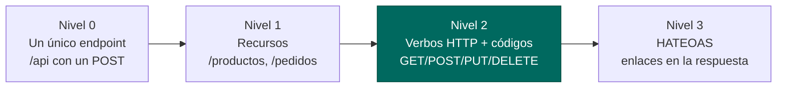

# Diseño de APIs REST

> Una API mal diseñada no se arregla: se sustituye. Y sustituirla significa romper a todos los clientes que la usan. Por eso el diseño se piensa **antes** de escribir el primer controlador.

## 1. Las seis restricciones de REST

REST no es «JSON por HTTP». Roy Fielding lo definió en 2000 como un **estilo arquitectónico** con seis restricciones. Estas son las que te van a preguntar y las que de verdad importan:

| Restricción | Qué significa en la práctica |
|---|---|
| **Cliente-servidor** | Separación de responsabilidades: el cliente pinta, el servidor guarda |
| **Sin estado** *(stateless)* | Cada petición lleva **toda** la información necesaria. El servidor no recuerda nada entre peticiones |
| **Cacheable** | Las respuestas dicen si pueden guardarse y cuánto tiempo |
| **Interfaz uniforme** | Recursos identificados por URI, manipulados por representaciones, mensajes autodescriptivos, HATEOAS |
| **Sistema en capas** | El cliente no sabe si habla con el servidor final o con un proxy/CDN |
| **Código bajo demanda** *(opcional)* | El servidor puede enviar código ejecutable |

!!! danger "Stateless: la que más se incumple"
    Si guardas el carrito del usuario en la `HttpSession` del servidor, tu API **no es REST** y, peor aún, no escala: al poner un segundo servidor detrás de un balanceador, la mitad de las peticiones caen en la máquina que no tiene la sesión. Por eso los tokens JWT sustituyeron a las sesiones: el estado viaja **con el cliente**.

### El modelo de madurez de Richardson



La inmensa mayoría de las APIs profesionales están en **nivel 2**, y ahí es donde te vamos a exigir que trabajes. El nivel 3 lo veremos por encima.

## 2. Recursos: sustantivos, no verbos

Un recurso es **una cosa**, no una acción. La acción la indica el verbo HTTP.

```
MAL  POST /api/crearProducto        BIEN POST   /api/productos
MAL  GET  /api/getProducto?id=42    BIEN GET    /api/productos/42
MAL  POST /api/borrarProducto/42    BIEN DELETE /api/productos/42
MAL  GET  /api/productos/actualizar BIEN PUT    /api/productos/42
```

Reglas que se aplican en cualquier empresa:

1. Plural siempre: `/productos`, no `/producto`. La colección contiene muchos.
2. Minúsculas y guiones para palabras compuestas: `/ordenes-de-compra`, no `/OrdenesDeCompra` ni `/ordenes_de_compra`.
3. Sin extensión: `/productos/42`, nunca `/productos/42.json`. El formato se negocia con la cabecera Accept.
4. Sin barra final: `/productos`, no `/productos/`.
5. El identificador en la ruta, los criterios de búsqueda en la query: `/productos/42` frente a /productos?categoria=movilidad.

### La tabla que debes saber de memoria

| Verbo | URL | Significado | Éxito | Seguro | Idempotente |
|---|---|---|---|---|---|
| `GET` | `/productos` | Listar | 200 | :material-check: | :material-check: |
| `GET` | `/productos/42` | Obtener uno | 200 / 404 | :material-check: | :material-check: |
| `POST` | `/productos` | Crear | 201 + `Location` | :material-close: | :material-close: |
| `PUT` | `/productos/42` | Reemplazar entero | 200 / 204 | :material-close: | :material-check: |
| `PATCH` | `/productos/42` | Modificar parcial | 200 | :material-close: | :material-close:* |
| `DELETE` | `/productos/42` | Borrar | 204 | :material-close: | :material-check: |

- Seguro = no modifica nada. Un `GET` que borra algo es un bug grave y un agujero de seguridad (los buscadores rastrean los GET).
- Idempotente = repetirlo N veces deja el sistema igual que hacerlo una vez. `DELETE /productos/42` cinco veces: el producto está borrado, punto (el primero devuelve 204, los siguientes 404, pero el estado es el mismo). En cambio, `POST /productos` cinco veces crea cinco productos.
\* `PATCH` es idempotente si envías valores absolutos (`{"stock": 10}`), pero no si envías incrementos (`{"stock": "+1"}`).

!!! tip "Por qué te importa la idempotencia"
    El móvil de un cliente pierde cobertura justo después de enviar un `POST /pedidos`. La app no sabe si llegó. ¿Reintenta? Si reintenta, puede duplicar el pedido. Solución profesional: **clave de idempotencia**.

    ```http
    POST /api/pedidos
    Idempotency-Key: 9f2a-41c8-b7e1
    ```

    El servidor guarda la clave; si llega otra petición con la misma clave, devuelve la

    respuesta original

    sin crear nada nuevo. Es lo que hacen Stripe, PayPal y cualquier pasarela de pago.

### PUT vs PATCH: el error clásico

```http
// PUT — el cliente manda el recurso COMPLETO. Los campos ausentes se ponen a null/defecto
PUT /api/productos/42
{"nombre":"Casco Pro","categoria":"seguridad","precio":59.99,"stock":8}

// PATCH — solo lo que cambia. Lo demás NO SE TOCA
PATCH /api/productos/42
{"precio": 54.99}
```

Si implementas `PUT` recibiendo un DTO parcial y solo actualizas los campos no nulos, has hecho un `PATCH` disfrazado: el cliente no puede poner un campo a `null` intencionadamente y el comportamiento deja de ser predecible.

## 3. Subrecursos, relaciones y acciones

!!! analogia "Analogía"
    **Idempotente** es el botón de llamada del ascensor: lo pulses una vez o siete, el ascensor viene una vez. **No idempotente** es el botón de una máquina de café: cada pulsación es un café más —y un cargo más—. Por eso un `PUT` se puede reintentar sin miedo tras un fallo de red y un `POST` no.

```http
GET    /api/clientes/7/pedidos          los pedidos del cliente 7
POST   /api/clientes/7/pedidos          crear un pedido para el cliente 7
GET    /api/pedidos/33/lineas           las líneas del pedido 33
DELETE /api/pedidos/33/lineas/2         quitar una línea concreta
```

**Máximo dos niveles.** `/clientes/7/pedidos/33/lineas/2/producto` es ilegible; una vez identificado el recurso, dale su propia ruta raíz: `/lineas/2`.

¿Y las acciones que no son CRUD? Un préstamo, un pago, una cancelación:

```http
POST /api/prestamos                     BIEN mejor: el préstamo ES un recurso
POST /api/libros/42/prestamo            BIEN aceptable: subrecurso-acción
POST /api/pedidos/33/cancelacion        BIEN
POST /api/cancelarPedido?id=33          MAL  verbo en la URL
```

La primera opción es la más REST: casi cualquier acción se puede modelar como **la creación de un recurso** (un préstamo, un pago, una cancelación son entidades con su fecha, su autor y su estado).

## 4. Versionado

El día que cambies el nombre de un campo, romperás a todos los clientes. Por eso las APIs se versionan **desde el primer día**.

| Estrategia | Ejemplo | Valoración |
|---|---|---|
| **En la URL** | `/api/v1/productos` | :material-check: La más usada: visible, cacheable, fácil de probar en el navegador |
| Cabecera | `Accept: application/vnd.tienda.v1+json` | Más "puro" pero incómodo de probar |
| Parámetro | `/api/productos?version=1` | Ensucia la query, se olvida fácil |

En este módulo usamos `/api/v1/...`.

**Cambios que NO rompen** (no necesitan versión nueva): añadir un campo a la respuesta, añadir un endpoint, añadir un parámetro **opcional**.
**Cambios que SÍ rompen**: quitar o renombrar un campo, cambiar su tipo, hacer obligatorio un parámetro, cambiar un código de estado.

```java
@RestController
@RequestMapping("/api/v1/productos")   // la versión, en la clase
public class ProductoControlador { }
```

## 5. Diseño de la representación

```json
{
  "id": 42,
  "nombre": "Patinete Urban 350",
  "precio": 299.00,
  "categoria": "movilidad",
  "disponible": true,
  "creadoEn": "2026-03-14T10:25:00Z",
  "etiquetas": ["eléctrico", "plegable"]
}
```

Convenios: **camelCase** en las claves (es lo que espera JavaScript), fechas en **ISO-8601 UTC**, booleanos con nombre afirmativo (`disponible`, no `noDisponible`), colecciones vacías como `[]` y **nunca** `null`, y decimales de dinero como número, no como texto.

Para las colecciones, envuelve siempre en un objeto — nunca devuelvas un array desnudo en la raíz:

```json
{
  "content": [ ... ],
  "page": { "number": 0, "size": 20, "totalElements": 137, "totalPages": 7 }
}
```

Razón: un array raíz no admite añadir metadatos después sin romper a los clientes.

## 6. Un vistazo a HATEOAS (nivel 3)

La respuesta incluye **qué puedes hacer a continuación**, de modo que el cliente no tenga que construir URLs a mano:

```json
{
  "id": 33,
  "estado": "PENDIENTE",
  "total": 349.00,
  "_links": {
    "self":      { "href": "/api/v1/pedidos/33" },
    "cancelar":  { "href": "/api/v1/pedidos/33/cancelacion", "method": "POST" },
    "cliente":   { "href": "/api/v1/clientes/7" }
  }
}
```

Ventaja real: si el pedido ya está enviado, el servidor **no incluye** el enlace `cancelar` y el cliente sabe que esa acción no está disponible, sin duplicar reglas de negocio. Se implementa con `spring-boot-starter-hateoas`. En la industria se usa poco, pero saber qué es te distingue en una entrevista.

---

## Pruébalo ahora (25 min)

!!! reto "Trabaja tú ahora"
    Este bloque se hace **en clase, en tu equipo**. No se entrega ni puntúa: es la práctica que hace que el examen te salga.

**Parte 1 — Rediseña.** Esta API existe de verdad (con los nombres cambiados). Reescríbela bien:

```http
POST /api/nuevoUsuario
GET  /api/obtenerUsuario?userId=5
POST /api/usuario/actualizar/5
GET  /api/borrarUsuario/5
GET  /api/usuario/5/listaDePedidosDelUsuario
POST /api/pedido/12/cancelarEsteP‌edido
```

**Parte 2 — Comprueba la idempotencia.** Con tu API de la UT4:

```bash
for i in 1 2 3; do curl -s -o /dev/null -w "%{http_code} " \
  -X POST localhost:8080/api/v1/productos -H "Content-Type: application/json" \
  -d '{"nombre":"Test","categoria":"seguridad","precio":10,"stock":1}'; done; echo
# → 201 409 409  (o 201 201 201 si no controlas duplicados: eso es NO idempotente)

for i in 1 2 3; do curl -s -o /dev/null -w "%{http_code} " -X DELETE \
    localhost:8080/api/v1/productos/1; done; echo
# → 204 404 404  pero el ESTADO final es el mismo: idempotente 
```

**Parte 3 — Migra a `/v1`.** Cambia el `@RequestMapping` de tus controladores a `/api/v1/...` y verifica que todo sigue funcionando. Añade después un campo nuevo a la respuesta (`precioConIva`) y razona por qué **no** hace falta pasar a `/v2`.

**Parte 4 — Explora una API real.** Abre `https://api.github.com/repos/spring-projects/spring-boot` en el navegador y localiza: el uso de plural, los subrecursos y los enlaces (`..._url`) que son HATEOAS de facto.

---

## Ejercicios (con solución)

### Ejercicio 1 — Corrige el diseño

Reescribe las seis rutas de la Parte 1.

??? success "Solución"

    ```http
    POST   /api/v1/usuarios              (201 + Location)
    GET    /api/v1/usuarios/5            (200 / 404)
    PUT    /api/v1/usuarios/5            (200)  · o PATCH si es parcial
    DELETE /api/v1/usuarios/5            (204)
    GET    /api/v1/usuarios/5/pedidos    (200)
    POST   /api/v1/pedidos/12/cancelacion (201 o 200)
    ```

    Errores originales: verbos en la URL, singular, id en query en vez de en ruta, y — el más grave — borrar con GET: un rastreador web o un prefetch del navegador puede vaciarte la base de datos.


### Ejercicio 2 — Idempotencia

Clasifica: (a) `GET /productos` · (b) `POST /productos` · (c) `PUT /productos/1` con el objeto completo · (d) `DELETE /productos/1` · (e) `PATCH /productos/1` con `{"stock": 5}` · (f) `PATCH /productos/1` con `{"stock": "+1"}`.

??? success "Solución"

    (a) Seguro e idempotente. (b) Ninguna de las dos: crea uno nuevo cada vez. (c) Idempotente. (d) Idempotente (el estado final es idéntico aunque el código cambie de 204 a 404). (e) Idempotente: fija un valor absoluto. (f)

    No

    idempotente: cada llamada suma uno.


### Ejercicio 3 — PUT o PATCH

El usuario edita solo el precio en un formulario. ¿Qué verbo usas y por qué?

??? success "Solución"

    Depende de qué envía el cliente, no de qué tocó el usuario. Si el formulario envía el objeto completo (con todos los campos, aunque solo uno haya cambiado), `PUT`. Si envía únicamente `{"precio": 54.99}`, `PATCH`. El error habitual es aceptar un cuerpo parcial en un PUT: entonces el cliente no puede vaciar un campo a propósito y el contrato se vuelve ambiguo.


### Ejercicio 4 — Versionado

Para cada cambio, di si necesita `/v2`: (a) añadir `precioConIva` a la respuesta · (b) renombrar `nombre` a `titulo` · (c) hacer obligatorio el parámetro `categoria` en el listado · (d) añadir el endpoint `/productos/destacados` · (e) cambiar `precio` de número a `{"valor":10,"moneda":"EUR"}`.

??? success "Solución"

    (a) No — añadir campos es compatible: los clientes antiguos lo ignoran. (b) Sí — rompe a quien lea nombre. (c) Sí — las llamadas existentes empezarían a fallar con 400. (d) No — endpoint nuevo. (e) Sí — cambio de tipo: el cliente esperaba un número.


### Ejercicio 5 — Diseña una API completa

Biblioteca: libros, socios, préstamos. Un socio toma prestado un libro y lo devuelve. Diseña todas las rutas con verbo y código de éxito.

??? success "Solución"

    ```http
    GET    /api/v1/libros?disponible=true&autor=Sanz     200
    GET    /api/v1/libros/42                              200 / 404
    POST   /api/v1/libros                                 201 + Location
    PUT    /api/v1/libros/42                              200
    DELETE /api/v1/libros/42                              204 (409 si está prestado)

    GET    /api/v1/socios/7                               200
    GET    /api/v1/socios/7/prestamos                     200  (subrecurso)

    POST   /api/v1/prestamos  {"libroId":42,"socioId":7}  201 + Location
           → 404 si no existen · 409 si el libro ya está prestado
           → 409 si el socio supera el máximo de préstamos
    GET    /api/v1/prestamos/99                           200
    POST   /api/v1/prestamos/99/devolucion                200 (o 201)
           → 409 si ya estaba devuelto
    ```

    Lo clave: el préstamo es un recurso, no una acción sobre el libro. Tiene fecha de inicio, fecha límite, estado y posible multa. Modelarlo así permite consultarlo, listarlo y auditarlo.

