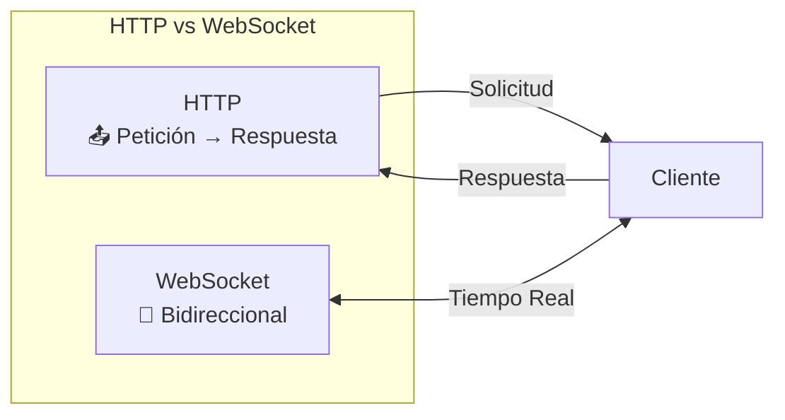
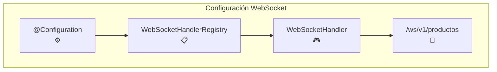
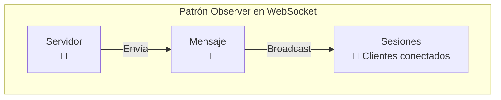
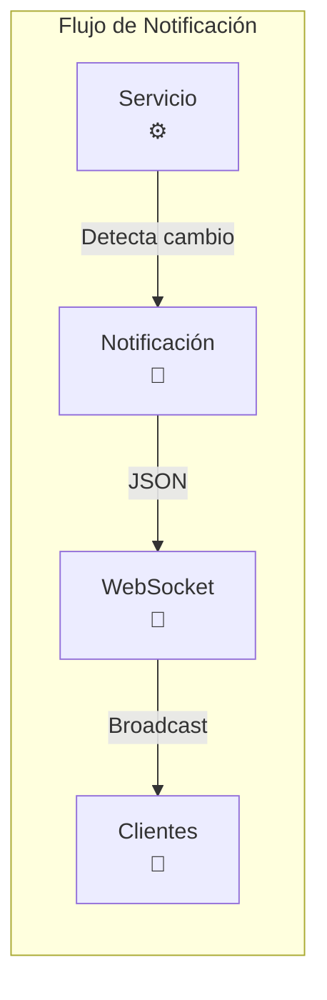
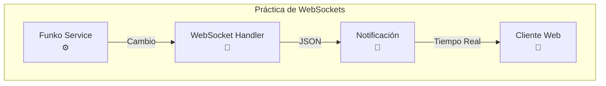

# 1. WebSockets

!!! quote "Autoría del material"
    Este tema es una **adaptación del material de [José Luis González Sánchez](https://github.com/joseluisgs)**, concretamente del archivo `springboot/09-WebSockets.md` del repositorio [DesarrolloWebEntornosServidor-02-2025-2026](https://github.com/joseluisgs/DesarrolloWebEntornosServidor-02-2025-2026).

    Publicado bajo licencia [Creative Commons Reconocimiento-NoComercial-CompartirIgual 4.0](http://creativecommons.org/licenses/by-nc-sa/4.0/). Se conservan el texto, los diagramas y los ejemplos originales; se han renumerado los apartados para la UT6 y se han añadido los ejercicios del final.

!!! note "Nota del Profesor"
    WebSocket permite comunicación bidireccional en tiempo real. A diferencia de HTTP, no requiere que el cliente pregunte constantemente al servidor.

!!! tip "Tip del Examinador"
    WebSocket es ideal para notificaciones, chat, y datos en tiempo real. HTTP polling es ineficiente para estos casos.

!!! success "Lo que esto cambia respecto a la UT4 y la UT5"
    Hasta ahora **el cliente preguntaba y el servidor contestaba**. Siempre. Si querías saber si había un funko nuevo, tenías que preguntar cada pocos segundos.

    Con un WebSocket, **el servidor habla cuando tiene algo que decir**. Y lo importante para esta unidad: el servicio que ya escribiste en la UT5 no cambia. Solo se le añade alguien que escucha.

---

Un WebSocket es un protocolo de comunicación bidireccional en tiempo real que se establece entre un cliente y un servidor a través de una conexión TCP (Transmission Control Protocol). A diferencia del protocolo HTTP (Hypertext Transfer Protocol), que sigue un modelo de solicitud-respuesta, los WebSockets permiten una comunicación continua y bidireccional entre el cliente y el servidor.



Los WebSockets se utilizan en servicios web para habilitar la comunicación en tiempo real entre el cliente y el servidor. Anteriormente, para lograr una comunicación en tiempo real, se utilizaban técnicas como la "polling" o "long polling", donde el cliente enviaba repetidamente solicitudes al servidor para verificar si había alguna actualización disponible. Esto generaba una carga adicional tanto en el cliente como en el servidor.

!!! warning "Advertencia"
    Polling es ineficiente: el cliente envía muchas solicitudes vacías. WebSocket mantiene una conexión abierta y solo envía cuando hay datos.

Con los WebSockets, se establece una conexión persistente entre el cliente y el servidor, lo que permite que los dos extremos se comuniquen de manera eficiente y en tiempo real. Una vez que se establece la conexión WebSocket, tanto el cliente como el servidor pueden enviar mensajes en cualquier momento sin necesidad de esperar una solicitud explícita.

Los WebSockets son ampliamente utilizados en aplicaciones web que requieren actualizaciones en tiempo real, como notificaciones, chats en línea, juegos multijugador, aplicaciones de colaboración en tiempo real y paneles de control en tiempo real. Proporcionan una forma eficiente y escalable de mantener una comunicación bidireccional entre el cliente y el servidor, lo que mejora la experiencia del usuario y permite la implementación de aplicaciones web más interactivas y dinámicas.


!!! tip "Tip del Examinador"
    Para conectar desde el cliente: `new WebSocket("ws://localhost:3000/ws/v1/productos")`. El prefijo es `ws://` no `http://`.

## 1.1. Instalando y Configurando WebSockets

Para configurar los web socket necesitamos una clase de configuración donde definamos los endpoints de los web sockets y el manejador que se encargará de atenderlos. 



```java
@Configuration
@EnableWebSocket
public class WebSocketConfig implements WebSocketConfigurer {

    @Value("${api.version}")
    private String apiVersion;

    // Registra uno por cada tipo de notificación que quieras con su handler y su ruta (endpoint)
    // Cuidado con la ruta que no se repita
    // Para conectar con el cliente, el cliente debe hacer una petición de conexión
    // ws://localhost:3000/ws/v1/productos
    @Override
    public void registerWebSocketHandlers(WebSocketHandlerRegistry registry) {
        registry.addHandler(webSocketProductosHandler(), "/ws/" + apiVersion + "/productos");
    }

    // Cada uno de los handlers como bean para que cada vez que nos atienda
    @Bean
    public WebSocketHandler webSocketRaquetasHandler() {
        return new WebSocketHandler("Productos");
    }

}
```

!!! note "Nota del Profesor"
    @EnableWebSocket habilita el soporte de WebSocket en Spring. Cada handler puede gestionar un tipo de notificación diferente.

Posteriormente podemos definir ese Handler con los métodos para enviar o recibir mensajes. Se puede aplicar un patrón Observer para transmitir los mensajes a los clientes conectados.



```java
@Slf4j
public class WebSocketHandler extends TextWebSocketHandler implements SubProtocolCapable, WebSocketSender {
    private final String entity; // Entidad que se notifica

    // Sesiones de los clientes conectados, para recorrelos y enviarles mensajes (patrón observer)
    // es concurrente porque puede ser compartida por varios hilos
    private final Set<WebSocketSession> sessions = new CopyOnWriteArraySet<>();

    public WebSocketHandler(String entity) {
        this.entity = entity;
    }

    /**
     * Cuando se establece la conexión con el servidor
     *
     * @param session Sesión del cliente
     * @throws Exception Error al establecer la conexión
     */
    @Override
    public void afterConnectionEstablished(WebSocketSession session) throws Exception {
        log.info("Conexión establecida con el servidor");
        log.info("Sesión: " + session);
        sessions.add(session);
        TextMessage message = new TextMessage("Updates Web socket: " + entity + " - Tienda API Spring Boot");
        log.info("Servidor envía: {}", message);
        session.sendMessage(message);
    }

    /**
     * Cuando se cierra la conexión con el servidor
     *
     * @param session Sesión del cliente
     * @param status  Estado de la conexión
     * @throws Exception Error al cerrar la conexión
     */
    @Override
    public void afterConnectionClosed(WebSocketSession session, CloseStatus status) throws Exception {
        log.info("Conexión cerrada con el servidor: " + status);
        sessions.remove(session);
    }

    /**
     * Envía un mensaje a todos los clientes conectados
     *
     * @param message Mensaje a enviar
     * @throws IOException Error al enviar el mensaje
     */
    @Override
    public void sendMessage(String message) throws IOException {
        log.info("Enviar mensaje de cambios en la entidad: " + entity + " : " + message);
        // Enviamos el mensaje a todos los clientes conectados
        for (WebSocketSession session : sessions) {
            if (session.isOpen()) {
                log.info("Servidor WS envía: " + message);
                session.sendMessage(new TextMessage(message));
            }
        }
    }

    /**
     * Envía mensajes periódicos a los clientes conectados para que sepan que el servidor sigue vivo
     *
     * @throws IOException Error al enviar el mensaje
     */
    @Scheduled(fixedRate = 1000) // Cada segundo
    @Override
    public void sendPeriodicMessages() throws IOException {
        for (WebSocketSession session : sessions) {
            if (session.isOpen()) {
                String broadcast = "server periodic message " + LocalTime.now();
                log.info("Server sends: " + broadcast);
                session.sendMessage(new TextMessage(broadcast));
            }
        }
    }

    /**
     * Maneja los mensajes de texto que le llegan al servidor, en este caso no hacemos nada porque no nos interesa
     * ya que el servidor no recibe mensajes de los clientes, solo les envía mensajes
     *
     * @param session
     * @param message
     * @throws Exception
     */
    @Override
    protected void handleTextMessage(WebSocketSession session, TextMessage message) throws Exception {
        // No hago nada con los mensajes que me llegan
        // Si quisieramos un chat, por ejemplo, aquí lo gestionaríamos,
        // leeríamos el mensaje y lo enviaríamos a todos los clientes conectados
        /*
        String request = message.getPayload();
        log.info("Server received: " + request);
        String response = String.format("response from server to '%s'", HtmlUtils.htmlEscape(request));
        log.info("Server sends: " + response);
        session.sendMessage(new TextMessage(response));
        */
    }

    /**
     * Maneja los errores de transporte que le llegan al servidor
     *
     * @param session   Sesión del cliente
     * @param exception Excepción que se ha producido
     * @throws Exception Error al manejar el error
     */
    @Override
    public void handleTransportError(WebSocketSession session, Throwable exception) throws Exception {
        log.info("Error de transporte con el servidor: " + exception.getMessage());
    }

    /**
     * Devuelve los subprotocolos que soporta el servidor
     *
     * @return Lista de subprotocolos
     */
    @Override
    public List<String> getSubProtocols() {
        return List.of("subprotocol.demo.websocket");
    }
}
```

!!! tip "Tip del Examinador"
    @Scheduled envía mensajes periódicos para mantener la conexión viva y probar que el servidor responde. Útil para debugging.

## 1.2. Implementando envío de notificaciones a clientes

Posteriormente en el servicio donde queramos enviar una notificación, usando nuestro WebSocket podemos hacer lo siguiente:



```java
 //...

@Override
@CachePut
public Producto save(ProductoCreateDto productoCreateDto) {
    log.info("Guardando producto: " + productoCreateDto);
    // Buscamos la categoría por su nombre
    var categoria = categoriaService.findByNombre(productoCreateDto.getCategoria());
    // Creamos el producto nuevo con los datos que nos vienen del dto, podríamos usar el mapper
    // Lo guardamos en el repositorio
    var productoSaved = productosRepository.save(productosMapper.toProduct(productoCreateDto, categoria));
    // Enviamos la notificación a los clientes ws
    onChange(Notificacion.Tipo.CREATE, productoSaved);
    // Devolvemos el producto guardado
    return productoSaved;
}

//...

void onChange(Notificacion.Tipo tipo, Producto data) {
    log.debug("Servicio de productos onChange con tipo: " + tipo + " y datos: " + data);

    if (webSocketService == null) {
        log.warn("No se ha podido enviar la notificación a los clientes ws, no se ha encontrado el servicio");
        webSocketService = this.webSocketConfig.webSocketRaquetasHandler();
    }

    try {
        Notificacion<ProductoNotificationDto> notificacion = new Notificacion<>(
                "PRODUCTOS",
                tipo,
                productoNotificationMapper.toProductNotificationDto(data),
                LocalDateTime.now().toString()
        );

        String json = mapper.writeValueAsString((notificacion));

        log.info("Enviando mensaje a los clientes ws");
        // Enviamos el mensaje a los clientes ws con un hilo, si hay muchos clientes, puede tardar
        // no bloqueamos el hilo principal que atiende las peticiones http
        Thread senderThread = new Thread(() -> {
            try {
                webSocketService.sendMessage(json);
            } catch (Exception e) {
                log.error("Error al enviar el mensaje a través del servicio WebSocket", e);
            }
        });
        senderThread.start();
    } catch (JsonProcessingException e) {
        log.error("Error al convertir la notificación a JSON", e);
    }
}
```

!!! warning "Advertencia"
    Enviar notificaciones en un hilo separado (Thread) evita bloquear las peticiones HTTP principales. ¡No lo hagas en el hilo principal!

!!! note "Nota del Profesor"
    Usar un hilo separado es importante para no afectar al rendimiento de la API. Las notificaciones son "best effort", no críticas.

## 1.3. Práctica de clase, Notificaciones con Websockets

1. Crea un sistema de notificaciones para recibir los cambios sobre Funkos, especialmente cuando se crea un funko nuevo, o se modifica o borra uno existente.
2. Testea los repositorios, servicios y controladores con la nueva funcionalidad.



## 1.4. Proyecto del curso

Puedes encontrar el proyecto con lo visto hasta este punto en la etiqueta: [v.0.0.4 del repositorio del curso: websockets_notificaciones](https://github.com/joseluisgs/DesarrolloWebEntornosServidor-02-Proyecto-SpringBoot/releases/tag/websockets_notificaciones).

---

## Pruébalo ahora (15 min)

Sobre el proyecto de Funkos de la UT5:

1. Añade el WebSocket en `/ws/v1/funkos`, conéctate con dos pestañas del navegador y crea un funko con `curl`. ¿Lo reciben las dos?
2. Cierra una pestaña y crea otro funko. ¿Falla el servidor?
3. Conéctate desde `wscat` o desde la consola del navegador y manda un mensaje **al servidor**. ¿Qué pasa?
4. Crea un funko dentro de una transacción que luego falle. ¿Se ha enviado la notificación?
5. Mira las cabeceras del `handshake` con `curl -i -N -H "Connection: Upgrade" -H "Upgrade: websocket" …`.

??? success "Solución de las cinco"

    **1. Sí, las dos.** El servidor recorre la lista de sesiones abiertas y manda a todas. Eso es *broadcast*, y es el caso de uso típico: un panel abierto en varios sitios que se actualiza solo.

    **2. No falla, pero el log se llena** de `IllegalStateException: The WebSocket session has been closed` si no quitas la sesión al cerrarse. Por eso el `afterConnectionClosed` tiene que hacer `sessions.remove(session)`, y por eso la colección es `CopyOnWriteArrayList` o un `ConcurrentHashMap`: se recorre y se modifica desde hilos distintos.

    **3. Nada, si no has implementado `handleTextMessage`.** El mensaje llega y se descarta. Un WebSocket es **bidireccional**, pero para notificaciones solo usamos una dirección, y eso está bien: menos superficie de ataque.

    **4. Sí, se ha enviado**, y es un bug.

    ```java
    @Transactional
    public FunkoResponse save(FunkoCreateRequest r) {
        var guardado = repositorio.save(…);
        notificador.enviar(guardado);      // ← si luego falla algo, ya se notificó
        return mapper.toResponse(guardado);
    }
    ```

    El `rollback` deshace el `INSERT`, pero **no deshace el mensaje ya enviado**. Los clientes ven un funko que no existe.

    La solución es notificar **después** de confirmar, con un evento:

    ```java
    applicationEventPublisher.publishEvent(new FunkoCreadoEvent(guardado));

    @TransactionalEventListener(phase = TransactionPhase.AFTER_COMMIT)
    public void alCrear(FunkoCreadoEvent e) { notificador.enviar(e.funko()); }
    ```

    **5.**

    ```
    HTTP/1.1 101 Switching Protocols
    Upgrade: websocket
    Connection: Upgrade
    Sec-WebSocket-Accept: s3pPLMBiTxaQ9kYGzzhZRbK+xOo=
    ```

    Un WebSocket **empieza siendo HTTP**: el `101 Switching Protocols` es el momento en que la conexión deja de ser petición-respuesta y pasa a ser un canal abierto. Por eso funciona por el puerto 80/443 y atraviesa los *proxies*.

---

## Ejercicios (con solución)

### E1 ● — WebSocket, *polling* o SSE

Tienes que avisar al cliente de cambios en el servidor. ¿Qué eliges en cada caso?

(a) un panel de stock que cambia cada pocos segundos · (b) un chat · (c) el progreso de un informe que tarda 2 minutos · (d) el precio de unas acciones

??? success "Solución"

    | | Qué usar | Por qué |
    |---|---|---|
    | (a) Panel de stock | **WebSocket** o SSE | Muchos cambios, muchos clientes |
    | (b) Chat | **WebSocket** | Hace falta **bidireccional** |
    | (c) Progreso de un informe | **SSE** | Solo servidor → cliente, y acaba |
    | (d) Precio de acciones | **WebSocket** | Alta frecuencia |

    | | Dirección | Reconexión automática | Complejidad |
    |---|---|:-:|---|
    | *Polling* | Cliente pregunta | — | Mínima, y muy ineficiente |
    | **SSE** | Solo servidor → cliente | **Sí, el navegador** | Baja |
    | **WebSocket** | Bidireccional | No: la haces tú | Media |

    **SSE está infravalorado**: para notificaciones de servidor a cliente (que es el 80 % de los casos) es más simple, va sobre HTTP normal y el navegador reconecta solo. WebSocket solo hace falta cuando el cliente **también** tiene que mandar.

### E2 ● — El `101`

¿Qué significa `HTTP/1.1 101 Switching Protocols`?

??? success "Solución"

    Que el servidor acepta **cambiar de protocolo** en esa misma conexión TCP: deja de ser HTTP petición-respuesta y pasa a ser un canal WebSocket abierto en los dos sentidos.

    Dos consecuencias prácticas:

    1. **Va por el puerto 80 o 443**, así que atraviesa cortafuegos y *proxies* como tráfico web normal.
    2. **La conexión no se cierra**, así que el servidor mantiene recursos por cada cliente conectado. Diez mil conexiones abiertas son diez mil sesiones en memoria.

    Es el único código `1xx` que vas a ver en tu vida.

### E3 ●● — La lista de sesiones

```java
private final List<WebSocketSession> sesiones = new ArrayList<>();
```

¿Qué está mal?

??? success "Solución"

    **`ArrayList` no es seguro con varios hilos**, y aquí hay varios garantizados: cada conexión entra por un hilo distinto, y el *broadcast* recorre la lista mientras alguien se conecta o se desconecta.

    Resultado: `ConcurrentModificationException` (el de la [UT2, E18](../ut2/ejercicios.md)) o, peor, corrupción silenciosa.

    ```java
    private final Set<WebSocketSession> sesiones = new CopyOnWriteArraySet<>();
    ```

    `CopyOnWriteArraySet` copia el array en cada escritura, así que recorrerlo es seguro siempre. Para pocas escrituras y muchas lecturas —que es exactamente este caso— es la elección correcta.

    Y hay que **quitar la sesión al cerrarse**:

    ```java
    @Override
    public void afterConnectionClosed(WebSocketSession session, CloseStatus status) {
        sesiones.remove(session);
    }
    ```

    Sin eso, la lista crece para siempre y cada *broadcast* intenta escribir en sesiones muertas.

### E4 ●● — Enviar a una sesión cerrada

```java
for (var s : sesiones) {
    s.sendMessage(new TextMessage(json));
}
```

Un cliente ha cerrado el navegador. ¿Qué pasa?

??? success "Solución"

    ```
    java.lang.IllegalStateException: The WebSocket session has been closed
    ```

    Y lo peor: la excepción **corta el bucle**, así que los clientes que vienen después en la lista **no reciben nada**. Un cliente desconectado deja sin notificación a todos los demás.

    ```java
    for (var s : sesiones) {
        try {
            if (s.isOpen()) s.sendMessage(new TextMessage(json));
            else sesiones.remove(s);
        } catch (IOException e) {
            log.warn("No se pudo notificar a {}: {}", s.getId(), e.getMessage());
            sesiones.remove(s);
        }
    }
    ```

    **Comprobar `isOpen()` no basta**: entre la comprobación y el envío, la conexión puede caerse. Hace falta el `try` también.

### E5 ●● — Notificar antes de confirmar

```java
@Transactional
public FunkoResponse save(FunkoCreateRequest r) {
    var guardado = repositorio.save(mapper.toModel(r));
    notificador.notificar("CREATE", guardado);
    return mapper.toResponse(guardado);
}
```

??? success "Solución"

    Si algo falla **después** del `notificar` pero antes de confirmar, el `rollback` deshace el `INSERT` y **el mensaje ya está enviado**. Los clientes conectados ven un funko que no existe en la base de datos.

    Y al revés también pasa: notificar fuera de la transacción puede mandar datos de una entidad que aún no es visible para otras conexiones.

    ```java
    public record FunkoCreadoEvent(FunkoResponse funko) {}

    // en el servicio
    eventos.publishEvent(new FunkoCreadoEvent(mapper.toResponse(guardado)));

    // en el notificador
    @TransactionalEventListener(phase = TransactionPhase.AFTER_COMMIT)
    public void alCrear(FunkoCreadoEvent e) {
        notificar("CREATE", e.funko());
    }
    ```

    `AFTER_COMMIT` significa exactamente lo que dice: **se ejecuta solo si la transacción se ha confirmado**.

    Y hay un segundo motivo para los eventos: el servicio deja de conocer al notificador. En la [UT2](../ut2/03-poo-en-java.md) eso era una interfaz inyectada; aquí es un evento, y el acoplamiento es aún menor.

### E6 ●●● — El notificador completo

Escribe el `WebSocketHandler` y el notificador que se usa desde el servicio.

??? success "Solución"

    ```java title="websockets/FunkosWebSocketHandler.java"
    @Component
    public class FunkosWebSocketHandler extends TextWebSocketHandler {

        private static final Logger log = LoggerFactory.getLogger(FunkosWebSocketHandler.class);
        private final Set<WebSocketSession> sesiones = new CopyOnWriteArraySet<>();

        @Override
        public void afterConnectionEstablished(WebSocketSession session) {
            sesiones.add(session);
            log.info("Conectado {} · total: {}", session.getId(), sesiones.size());
        }

        @Override
        public void afterConnectionClosed(WebSocketSession session, CloseStatus status) {
            sesiones.remove(session);
            log.info("Desconectado {} · total: {}", session.getId(), sesiones.size());
        }

        @Override
        public void handleTransportError(WebSocketSession session, Throwable e) {
            log.warn("Error de transporte en {}: {}", session.getId(), e.getMessage());
            sesiones.remove(session);
        }

        /** Manda el mensaje a todos los conectados, sin que uno roto afecte al resto. */
        public void enviarATodos(String mensaje) {
            for (var s : sesiones) {
                try {
                    if (s.isOpen()) s.sendMessage(new TextMessage(mensaje));
                    else sesiones.remove(s);
                } catch (IOException e) {
                    log.warn("No se pudo enviar a {}: {}", s.getId(), e.getMessage());
                    sesiones.remove(s);
                }
            }
        }
    }
    ```

    ```java title="config/WebSocketConfig.java"
    @Configuration
    @EnableWebSocket
    public class WebSocketConfig implements WebSocketConfigurer {

        private final FunkosWebSocketHandler handler;

        public WebSocketConfig(FunkosWebSocketHandler handler) { this.handler = handler; }

        @Override
        public void registerWebSocketHandlers(WebSocketHandlerRegistry registry) {
            registry.addHandler(handler, "/ws/v1/funkos")
                    .setAllowedOrigins("http://localhost:5173");   // CORS, tema 3
        }
    }
    ```

    ```java title="websockets/FunkosNotificador.java"
    @Component
    public class FunkosNotificador {

        private final FunkosWebSocketHandler handler;
        private final ObjectMapper mapper;

        public FunkosNotificador(FunkosWebSocketHandler handler, ObjectMapper mapper) {
            this.handler = handler;
            this.mapper = mapper;
        }

        @TransactionalEventListener(phase = TransactionPhase.AFTER_COMMIT)
        public void alCambiar(FunkoCambiadoEvent evento) throws JsonProcessingException {
            handler.enviarATodos(mapper.writeValueAsString(
                    new Notificacion("FUNKO", evento.tipo(), evento.funko(),
                                     LocalDateTime.now().toString())));
        }

        public record Notificacion(String entidad, String tipo,
                                   FunkoResponse datos, String fecha) {}
    }
    ```

    ```html title="Para probarlo, en la consola del navegador"
    const ws = new WebSocket("ws://localhost:8080/ws/v1/funkos");
    ws.onmessage = e => console.log(JSON.parse(e.data));
    ```

    **Tres cosas que hacen que esto sea correcto y no solo funcional:**

    1. **`setAllowedOrigins`.** Sin él, cualquier página de internet puede abrir un WebSocket contra tu servidor. Los WebSockets **no están sujetos a la política del mismo origen** del navegador, así que esta línea es la única protección.
    2. **`@TransactionalEventListener(AFTER_COMMIT)`.** No se notifica nada que no esté confirmado.
    3. **Se manda el `FunkoResponse`, no la entidad.** Es el DTO de la UT4: ni expone campos de más ni arrastra relaciones perezosas (que aquí serían un `LazyInitializationException` **dentro** del notificador, fuera de toda transacción).
