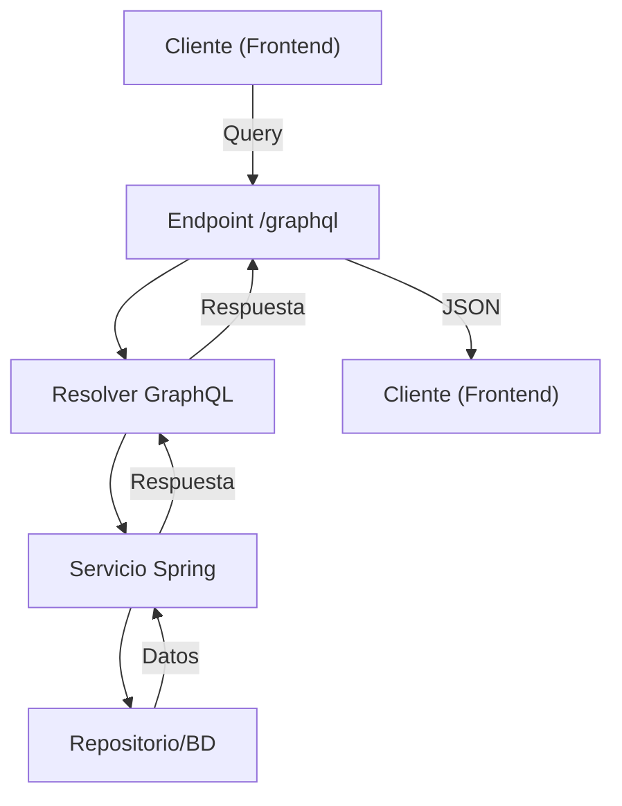

# 2. GraphQL

!!! quote "Autoría del material"
    Este tema es una **adaptación del material de [José Luis González Sánchez](https://github.com/joseluisgs)**, concretamente del archivo `springboot/16-GraphQL.md` del repositorio [DesarrolloWebEntornosServidor-02-2025-2026](https://github.com/joseluisgs/DesarrolloWebEntornosServidor-02-2025-2026).

    Publicado bajo licencia [Creative Commons Reconocimiento-NoComercial-CompartirIgual 4.0](http://creativecommons.org/licenses/by-nc-sa/4.0/). Se conservan el texto, los diagramas y los ejemplos originales; se han renumerado los apartados para la UT6, las dependencias van en **pestañas Maven / Gradle** y se han añadido los ejercicios del final.

!!! note "Nota del Profesor"
    GraphQL es una alternativa a REST que permite al cliente solicitar exactamente los datos que necesita. Es ideal para aplicaciones móviles y SPA.

!!! tip "Tip del Examinador"
    GraphQL usa "queries" para leer y "mutations" para escribir, similar a GET y POST en REST.

!!! info "GraphQL no sustituye a REST: se suma"
    En este módulo la API REST de la UT5 **se queda tal cual**. GraphQL se añade en `/graphql` como una segunda puerta a los **mismos servicios**.

    Eso es la idea de la unidad entera: tres transportes (REST, WebSocket, GraphQL) sobre una sola capa de negocio.

---

## 2.1. ¿Qué es GraphQL? ¿Por qué es especial?

**GraphQL** es un lenguaje de consulta para APIs y un entorno de ejecución para tus datos. Fue creado por Facebook en 2012 y liberado en 2015.

### 2.1.1. Ventajas y Características

- **Consulta flexible:** El cliente pide exactamente los datos que necesita.
- **Un solo endpoint:** Se accede siempre a `/graphql`.
- **Tipo fuerte:** El esquema define los tipos y validaciones.
- **Consultas anidadas y relaciones:** Puedes obtener objetos relacionados y jerarquía de datos en una sola petición.
- **Introspección:** El cliente puede explorar el esquema y autocompletar queries desde el playground.
- **Mutaciones:** Permite modificar datos de forma estructurada y tipada.
- **Suscripciones:** Permite recibir notificaciones en tiempo real (como WebSockets).
- **Evolución sin versionado:** El esquema puede crecer sin romper clientes antiguos.

### 2.1.2. Comparación con REST

| REST             | GraphQL                               |
| ---------------- | ------------------------------------- |
| Múltiples URLs   | Un solo endpoint                      |
| Respuestas fijas | El cliente elige los campos           |
| Overfetching     | Solo lo que pides                     |
| Underfetching    | Consultas anidadas y relaciones       |
| Versionado       | No es necesario, evoluciona el schema |
| Difícil de tipar | Tipado fuerte y validación automática |

---

## 2.2. Sintaxis básica de GraphQL

### 2.2.1. Elementos del esquema

- **type**: Define un objeto (como una clase Java).
- **input**: Define tipos de entrada para mutaciones.
- **enum**: Un conjunto finito de valores posibles.
- **Query**: Operaciones de lectura.
- **Mutation**: Operaciones de escritura (crear, modificar, borrar).
- **Subscription**: Operaciones en tiempo real (push de eventos).
- **interface**: Contrato que deben implementar varios tipos.
- **union**: Un campo puede ser uno de varios tipos.

### 2.2.2. Tipos soportados

- **Escalares**:  
  - `Int` (número entero)
  - `Float` (número decimal)
  - `String` (texto)
  - `Boolean` (true/false)
  - `ID` (identificador único, string o int)
- **Enum**: Enumerados.
- **Objetos**: Definidos con `type`.
- **Listas**: `[Tipo]`  
  Ejemplo: `[Producto!]!` (lista obligatoria de productos obligatorios)
- **Campos obligatorios**: `!`  
  Ejemplo: `nombre: String!` (el campo no puede ser nulo)
- **Campos opcionales**: sin `!`  
  Ejemplo: `descripcion: String`
- **Relaciones**: Un campo puede ser otro tipo o una lista de otro tipo.

### 2.2.3. Ejemplo de sintaxis

```graphql
type Producto {
    id: ID!
    nombre: String!
    precio: Float!
    categoria: Categoria!
    etiquetas: [String!]! # lista obligatoria de strings obligatorios
}

type Categoria {
    id: ID!
    nombre: String!
    productos: [Producto!]!
}
```

- `[Producto!]!` significa:
    - Lista no nula (`!` al final)
    - De elementos no nulos (`!` tras el tipo)
    - Es decir: la lista siempre existe y no puede tener elementos nulos.

---

## 2.3. Instalación y configuración en Spring Boot

### 2.3.1. Dependencias

=== "Maven (lo que usamos)"

    ```xml
    <dependency>
      <groupId>org.springframework.boot</groupId>
      <artifactId>spring-boot-starter-graphql</artifactId>
    </dependency>

    <!-- Para el playground web -->
    <dependency>
      <groupId>org.springframework.boot</groupId>
      <artifactId>spring-boot-starter-web</artifactId>
    </dependency>

    <!-- Para suscripciones: opcional, pero necesario si usas Subscription -->
    <dependency>
      <groupId>org.springframework.boot</groupId>
      <artifactId>spring-boot-starter-webflux</artifactId>
    </dependency>

    <!-- Para los tests de GraphQL -->
    <dependency>
      <groupId>org.springframework.graphql</groupId>
      <artifactId>spring-graphql-test</artifactId>
      <scope>test</scope>
    </dependency>
    ```

=== "Gradle (el original)"

    ```kotlin
    implementation("org.springframework.boot:spring-boot-starter-graphql")
    implementation("org.springframework.boot:spring-boot-starter-web") // Para playground web
    implementation("org.springframework.boot:spring-boot-starter-webflux") // Para suscripciones (opcional, pero necesario si usas Subscription)
    ```

### 2.3.2. Configuración básica

En `src/main/resources/application.properties`:

```properties
spring.graphql.graphiql.enabled=true         # Activa el playground web
spring.graphql.graphiql.path=/graphiql       # Ruta del playground
spring.graphql.path=/graphql                 # Ruta del endpoint principal
```

---

## 2.4. Definiendo el esquema GraphQL

El esquema se escribe en un archivo:  
`src/main/resources/graphql/schema.graphqls`

### 2.4.1. Esquema de ejemplo: Producto y Categoría (queries, mutaciones y suscripciones)

```graphql
# ==== TIPOS ====
type Producto {
    id: ID!
    nombre: String!
    precio: Float!
    stock: Int!
    categoria: Categoria!
}

type Categoria {
    id: ID!
    nombre: String!
    productos: [Producto!]!
}

# ==== TIPOS DE ENTRADA PARA MUTACIONES ====
input ProductoInput {
    nombre: String!
    precio: Float!
    stock: Int!
    categoriaId: ID!
}

input CategoriaInput {
    nombre: String!
}

# ==== QUERIES ====
type Query {
    productos: [Producto!]!
    productoById(id: ID!): Producto
    categorias: [Categoria!]!
    categoriaById(id: ID!): Categoria
}

# ==== MUTACIONES ====
type Mutation {
    crearProducto(input: ProductoInput!): Producto!
    actualizarProducto(id: ID!, input: ProductoInput!): Producto!
    eliminarProducto(id: ID!): Boolean!

    crearCategoria(input: CategoriaInput!): Categoria!
    actualizarCategoria(id: ID!, input: CategoriaInput!): Categoria!
    eliminarCategoria(id: ID!): Boolean!
}

# ==== SUSCRIPCIONES (notificaciones en tiempo real) ====
type Subscription {
    # Notifica cuando se crea un producto
    productoCreado: Producto!
    # Notifica cuando se actualiza un producto
    productoActualizado: Producto!
    # Notifica cuando se elimina un producto
    productoEliminado: ID!
}
```

---

## 2.5. Ejemplo de Controlador GraphQL en Spring Boot (queries, mutaciones y suscripciones)

*Recuerda: los servicios y repositorios ya existen. Aquí solo resolvers y lógica GraphQL.*

```java
package com.ejemplo.demo.graphql;

import com.ejemplo.demo.model.Producto;
import com.ejemplo.demo.model.Categoria;
import com.ejemplo.demo.service.ProductoService;
import com.ejemplo.demo.service.CategoriaService;
import org.springframework.beans.factory.annotation.Autowired;
import org.springframework.graphql.data.method.annotation.*;
import org.springframework.stereotype.Controller;
import reactor.core.publisher.Flux;
import reactor.core.publisher.Sinks;

import java.util.List;

@Controller
public class ProductoCategoriaGraphQLController {

    private final ProductoService productoService;
    private final CategoriaService categoriaService;

    // Sinks para suscripciones en tiempo real
    private final Sinks.Many<Producto> productoCreadoSink = Sinks.many().multicast().onBackpressureBuffer();
    private final Sinks.Many<Producto> productoActualizadoSink = Sinks.many().multicast().onBackpressureBuffer();
    private final Sinks.Many<Long> productoEliminadoSink = Sinks.many().multicast().onBackpressureBuffer();

    @Autowired
    public ProductoCategoriaGraphQLController(ProductoService productoService, CategoriaService categoriaService) {
        this.productoService = productoService;
        this.categoriaService = categoriaService;
    }

    // === Queries ===
    @QueryMapping
    public List<Producto> productos() {
        return productoService.findAll();
    }

    @QueryMapping
    public Producto productoById(@Argument Long id) {
        return productoService.findById(id).orElse(null);
    }

    @QueryMapping
    public List<Categoria> categorias() {
        return categoriaService.findAll();
    }

    @QueryMapping
    public Categoria categoriaById(@Argument Long id) {
        return categoriaService.findById(id).orElse(null);
    }

    // === Mutaciones ===
    @MutationMapping
    public Producto crearProducto(@Argument ProductoInput input) {
        Producto producto = productoService.save(input);
        productoCreadoSink.tryEmitNext(producto); // Notifica a suscriptores
        return producto;
    }

    @MutationMapping
    public Producto actualizarProducto(@Argument Long id, @Argument ProductoInput input) {
        Producto producto = productoService.update(id, input);
        productoActualizadoSink.tryEmitNext(producto); // Notifica a suscriptores
        return producto;
    }

    @MutationMapping
    public Boolean eliminarProducto(@Argument Long id) {
        productoService.deleteById(id);
        productoEliminadoSink.tryEmitNext(id); // Notifica a suscriptores
        return true;
    }

    @MutationMapping
    public Categoria crearCategoria(@Argument CategoriaInput input) {
        return categoriaService.save(input);
    }

    @MutationMapping
    public Categoria actualizarCategoria(@Argument Long id, @Argument CategoriaInput input) {
        return categoriaService.update(id, input);
    }

    @MutationMapping
    public Boolean eliminarCategoria(@Argument Long id) {
        categoriaService.deleteById(id);
        return true;
    }

    // === Suscripciones ===
    @SubscriptionMapping
    public Flux<Producto> productoCreado() {
        return productoCreadoSink.asFlux();
    }

    @SubscriptionMapping
    public Flux<Producto> productoActualizado() {
        return productoActualizadoSink.asFlux();
    }

    @SubscriptionMapping
    public Flux<Long> productoEliminado() {
        return productoEliminadoSink.asFlux();
    }
}
```

### 2.5.1. ¿Cómo funciona la suscripción?
- Cada vez que se crea, actualiza o elimina un producto, se emite una notificación.
- Los clientes suscritos (por ejemplo, desde el playground o desde una app usando Apollo Client) reciben el evento en tiempo real.
- Para usar suscripciones necesitas tener configurado WebFlux y usar el playground o cliente compatible con WebSocket.

---

## 2.6. Ejemplos de consultas, mutaciones y suscripciones

### 2.6.1. Obtener todos los productos con su categoría
```graphql
query {
  productos {
    id
    nombre
    precio
    categoria {
      id
      nombre
    }
  }
}
```

### 2.6.2. Crear un producto
```graphql
mutation {
  crearProducto(input: {
    nombre: "Raqueta Pro",
    precio: 120.5,
    stock: 10,
    categoriaId: "1"
  }) {
    id
    nombre
    precio
    categoria {
      nombre
    }
  }
}
```

### 2.6.3. Actualizar un producto
```graphql
mutation {
  actualizarProducto(id: "1", input: {
    nombre: "Raqueta Ultra Pro",
    precio: 150.0,
    stock: 20,
    categoriaId: "1"
  }) {
    id
    nombre
    precio
  }
}
```

### 2.6.4. Eliminar un producto
```graphql
mutation {
  eliminarProducto(id: "1")
}
```

### 2.6.5. Consulta de una categoría y sus productos
```graphql
query {
  categoriaById(id: "1") {
    id
    nombre
    productos {
      id
      nombre
      precio
    }
  }
}
```

### 2.6.6. Ejemplo de suscripción (en el playground o Apollo Client)

```graphql
subscription {
  productoCreado {
    id
    nombre
    precio
  }
}
```

Al ejecutar esta suscripción, cualquier cliente conectado recibirá en tiempo real el producto que se cree en el sistema.

---

## 2.7. Consejos y buenas prácticas

- Usa tipos `input` para mutaciones: más claro, extensible y tipado.
- Las relaciones se muestran como campos de otro tipo o listas.
- Usa el autocompletado y la introspección del playground: ayuda mucho a descubrir el esquema.
- Valida los datos en los resolvers; GraphQL valida tipos, pero no lógica de negocio.
- Añade comentarios en el esquema, los clientes los verán en la documentación automática.
- Si tienes muchas entidades, añade paginación y filtros.
- Las suscripciones requieren WebFlux y configuración especial, pero son potentes para tiempo real.
- Recuerda: `[Tipo!]!` -> lista no nula de elementos no nulos; `!` indica campo obligatorio.

---

## 2.8. Ejercicio propuesto: API GraphQL de Funkos

**Enunciado:**

Crea una API GraphQL para gestionar una colección de Funkos y sus categorías.

### 2.8.1. Requisitos

1. **Entidades**:
    - Funko: id, nombre, precio, stock, imagen, categoría.
    - Categoria: id, nombre, lista de funkos.
2. **Operaciones**:
    - Queries para obtener todos los funkos, un funko por id, todas las categorías, una categoría por id, los funkos de una categoría.
    - Mutaciones para crear, actualizar y borrar funkos y categorías.
    - Suscripciones para notificar cuando se crea un funko.
3. **Relaciones**:
    - Cada Funko pertenece a una categoría.
    - Cada categoría puede tener muchos Funkos.
4. **Extras** (opcional):
    - Añadir paginación.
    - Permitir buscar funkos por nombre o por rango de precio.
    - Validaciones (por ejemplo: precio > 0, stock >= 0).
    - Documentar el esquema con comentarios.
5. **Entrega**:
    - Implementa el schema en `schema.graphqls`.
    - Implementa los resolvers en el controlador (puedes asumir que los servicios y repositorios ya existen).
    - Incluye ejemplos de queries, mutaciones y suscripciones en un archivo markdown de ejemplos.
    - (Opcional) Añade tests automatizados para los resolvers.

---

## 2.9. Diagrama didáctico: Flujo de una consulta GraphQL



*Diagrama: Flujo de una consulta GraphQL en Spring Boot.*

## 2.10. Resumen didáctico

- **GraphQL** permite a los clientes pedir exactamente los datos que necesitan, optimizando el tráfico y la experiencia.
- El endpoint `/graphql` centraliza todas las operaciones (queries, mutaciones, suscripciones).
- Los resolvers son responsables de transformar las peticiones en llamadas a servicios y repositorios.
- El uso de suscripciones permite notificaciones en tiempo real.
- Spring Boot integra GraphQL de forma sencilla y productiva.

---

## 2.11. Recursos y enlaces útiles

- [Documentación oficial de GraphQL](https://graphql.org/learn/)
- [Spring Boot GraphQL Reference](https://docs.spring.io/spring-graphql/docs/current/reference/html/)
- [Ejemplo de Playground online](https://graphqlbin.com/v2/new)
- [Ejemplo avanzado de API GraphQL con Spring Boot](https://github.com/spring-projects/spring-graphql-samples)

---

## Pruébalo ahora (15 min)

Sobre el proyecto de Funkos, con el esquema y el controlador GraphQL puestos:

1. Abre `http://localhost:8080/graphiql` y pide solo `{ productos { nombre } }`. Mira el SQL en el log.
2. Pide `{ productos { nombre categoria { nombre } } }`. Cuenta las consultas del log.
3. Pide un campo que no existe en el esquema. ¿Qué código HTTP devuelve?
4. Provoca un error en el servicio (un id que no existe) y mira la forma de la respuesta.
5. Pide `{ productos { categoria { productos { categoria { nombre } } } } }`.

??? success "Solución de las cinco"

    **1.** Una consulta, y **solo con las columnas del esquema si has hecho la proyección**; si devuelves la entidad, Hibernate trae todas las columnas igual. GraphQL optimiza lo que viaja por la red, **no** lo que se pide a la base de datos.

    **2. Aquí está el N+1 de GraphQL**, y es el problema característico de la tecnología: una consulta para los productos y **una por cada producto** para su categoría.

    Se arregla con un **`@BatchMapping`**:

    ```java
    @BatchMapping(typeName = "Producto")
    public Map<Producto, Categoria> categoria(List<Producto> productos) {
        var ids = productos.stream().map(Producto::getCategoriaId).toList();
        var categorias = categoriasRepository.findAllById(ids).stream()
                .collect(Collectors.toMap(Categoria::getId, c -> c));
        return productos.stream().collect(Collectors.toMap(
                p -> p, p -> categorias.get(p.getCategoriaId())));
    }
    ```

    De N+1 a **2 consultas**, hagas la pregunta que hagas.

    **3. `200 OK`.** Y esto sorprende siempre: **GraphQL responde 200 casi siempre**, con los errores dentro del cuerpo:

    ```json
    {
      "errors": [{
        "message": "Field 'inventado' in type 'Producto' is undefined",
        "extensions": { "classification": "ValidationError" }
      }]
    }
    ```

    Así que **no puedes monitorizar una API GraphQL por el código de estado**. Es la diferencia práctica más grande con REST.

    **4.** También un 200, con el error en `errors` y, si lo has configurado, `data: null` o parcialmente rellenado:

    ```json
    { "data": { "productoById": null },
      "errors": [{ "message": "No existe el producto 99",
                   "extensions": { "classification": "NOT_FOUND" } }] }
    ```

    Una respuesta GraphQL puede traer **datos y errores a la vez**: lo que se pudo resolver, resuelto.

    **5.** Si no lo has limitado, la consulta se anida indefinidamente y puedes tumbar el servidor. Se limita en la configuración:

    ```properties
    spring.graphql.schema.introspection.enabled=false   # en producción
    ```

    ```java
    @Bean
    public GraphQlSourceBuilderCustomizer limites() {
        return builder -> builder.configureGraphQl(graphQl ->
                graphQl.instrumentation(List.of(
                        new MaxQueryDepthInstrumentation(10),
                        new MaxQueryComplexityInstrumentation(200))));
    }
    ```

    **Es el riesgo propio de GraphQL:** en REST, cada endpoint tiene un coste conocido. En GraphQL, **el cliente decide** el coste de la consulta.

---

## Ejercicios (con solución)

### E1 ● — GraphQL frente a REST

Completa la tabla.

??? success "Solución"

    | | REST | GraphQL |
    |---|---|---|
    | Endpoints | Uno por recurso | **Uno solo**: `/graphql` |
    | Qué datos llegan | Los que decide el servidor | **Los que pide el cliente** |
    | Varios recursos | Varias peticiones | **Una** |
    | Verbos | GET/POST/PUT/PATCH/DELETE | `query` y `mutation` |
    | Códigos de estado | 200/201/400/404/409… | **200 casi siempre** |
    | Caché HTTP | Nativa (`ETag`, `Cache-Control`) | **No, hay que montarla** |
    | Esquema y tipos | OpenAPI, opcional | **Obligatorio y verificado** |
    | Subir ficheros | Natural | Incómodo |
    | Versionado | `/v1`, `/v2` | Añadir campos, marcar `@deprecated` |

    **Las dos filas que deciden en la práctica:** la caché HTTP (que en REST es gratis y en GraphQL hay que construir) y los códigos de estado (que en REST son la mitad del contrato).

    GraphQL gana claramente cuando el cliente es una app móvil con muchas pantallas distintas sobre los mismos datos. REST gana cuando el consumo es homogéneo y la caché importa.

### E2 ● — Los símbolos del esquema

¿Qué significan `String`, `String!`, `[String]`, `[String!]!`?

??? success "Solución"

    | | Significa |
    |---|---|
    | `String` | Puede ser `null` |
    | `String!` | **No** puede ser `null` |
    | `[String]` | La lista puede ser `null`, y sus elementos también |
    | `[String]!` | La lista no es `null`; sus elementos sí pueden serlo |
    | `[String!]!` | **Ni la lista ni los elementos** pueden ser `null` |

    **`[Producto!]!` es lo correcto para un listado:** nunca devuelves `null` en vez de una lista, y nunca metes un `null` dentro de la lista. Una lista vacía es `[]`.

    Y el detalle que importa: si un campo es `!` y tu resolutor devuelve `null`, **GraphQL anula el objeto padre entero** y lo reporta como error. La no-nulabilidad se propaga hacia arriba.

### E3 ●● — `query`, `mutation` y `subscription`

¿Qué hace cada una y con qué se corresponde en REST?

??? success "Solución"

    | | GraphQL | REST |
    |---|---|---|
    | Leer | `query` | `GET` |
    | Escribir | `mutation` | `POST` / `PUT` / `PATCH` / `DELETE` |
    | Tiempo real | `subscription` | WebSocket o SSE |

    Dos diferencias de comportamiento, no solo de nombre:

    - **Las `query` se ejecutan en paralelo**; las `mutation`, **en serie y en orden**. Si pides dos mutaciones en una petición, la segunda ve el efecto de la primera.
    - **Todas van por `POST`** a `/graphql`, también las `query`. Por eso la caché HTTP no funciona de serie.

    Y `subscription` es la pieza que une este tema con el 1: por debajo va sobre un WebSocket.

### E4 ●● — El N+1 de GraphQL

```graphql
{ productos { nombre categoria { nombre } } }
```

Con 100 productos, ¿cuántas consultas y cómo se arregla?

??? success "Solución"

    **101.** Una para los productos y una por cada producto para su categoría. Es el problema característico de GraphQL, y es peor que en REST porque **el cliente decide** cuándo ocurre: tú no controlas qué campos piden.

    ```java
    @BatchMapping(typeName = "Producto")
    public Map<Producto, Categoria> categoria(List<Producto> productos) {
        var ids = productos.stream().map(Producto::getCategoriaId).distinct().toList();
        var porId = categoriasRepository.findAllById(ids).stream()
                .collect(Collectors.toMap(Categoria::getId, c -> c));
        return productos.stream().collect(Collectors.toMap(
                p -> p, p -> porId.get(p.getCategoriaId())));
    }
    ```

    **`@BatchMapping` recibe la lista entera de productos de golpe** y hace una sola consulta con todos los ids. De 101 a **2**.

    Es el mismo problema del [E11 de la UT5](../ut5/ejercicios.md), pero aquí la solución no puede ser un `JOIN FETCH` fijo: la consulta depende de lo que pida el cliente, así que hace falta el agrupamiento.

### E5 ●● — El 200 que es un error

Tu monitorización avisa cuando hay respuestas 4xx y 5xx. Con GraphQL no avisa nunca. ¿Por qué?

??? success "Solución"

    Porque **GraphQL devuelve 200 casi siempre**, incluso cuando la consulta es inválida o el servicio ha lanzado una excepción. Los errores van en el cuerpo:

    ```json
    { "data": null,
      "errors": [{ "message": "...", "extensions": { "classification": "NOT_FOUND" } }] }
    ```

    Los 4xx solo salen cuando el error es anterior a GraphQL: un JSON mal formado (400) o un fallo de autenticación (401).

    **Lo que hay que hacer:** monitorizar **la presencia del campo `errors`** en la respuesta, no el código de estado. Y traducir las excepciones a clasificaciones útiles:

    ```java
    @Component
    public class GraphQlExceptionHandler extends DataFetcherExceptionResolverAdapter {
        @Override
        protected GraphQLError resolveToSingleError(Throwable ex, DataFetchingEnvironment env) {
            if (ex instanceof FunkoNotFoundException) {
                return GraphqlErrorBuilder.newError(env)
                        .errorType(ErrorType.NOT_FOUND)
                        .message(ex.getMessage())
                        .build();
            }
            return null;    // que lo trate el por defecto
        }
    }
    ```

    **Y fíjate en lo que esto demuestra:** las excepciones propias de la [UT4](../ut4/03-servicios-dtos-y-cache.md) funcionan aquí sin tocarlas. Si el servicio lanzara `ResponseStatusException` con `HttpStatus`, no habría nada que traducir, porque en GraphQL un código HTTP no significa nada.

### E6 ●●● — El controlador GraphQL

Escribe el esquema y el controlador para consultar y crear funkos, reutilizando el servicio de la UT5.

??? success "Solución"

    ```graphql title="src/main/resources/graphql/schema.graphqls"
    type Funko {
        id: ID!
        nombre: String!
        precio: Float!
        cantidad: Int!
        categoria: Categoria!
    }

    type Categoria {
        id: ID!
        nombre: String!
        funkos: [Funko!]!
    }

    input FunkoInput {
        nombre: String!
        precio: Float!
        cantidad: Int!
        categoria: String!
    }

    type Query {
        funkos(categoria: String): [Funko!]!
        funkoById(id: ID!): Funko
    }

    type Mutation {
        crearFunko(input: FunkoInput!): Funko!
        borrarFunko(id: ID!): Boolean!
    }
    ```

    ```java title="funkos/controllers/FunkosGraphQlController.java"
    @Controller
    public class FunkosGraphQlController {

        private final FunkosService servicio;              // ← EL MISMO de REST
        private final CategoriasRepository categoriasRepository;

        public FunkosGraphQlController(FunkosService servicio,
                                       CategoriasRepository categoriasRepository) {
            this.servicio = servicio;
            this.categoriasRepository = categoriasRepository;
        }

        @QueryMapping
        public List<FunkoResponse> funkos(@Argument Optional<String> categoria) {
            return servicio.findAll(categoria, Optional.empty(), Optional.empty(),
                                    Optional.empty(), Pageable.unpaged()).getContent();
        }

        @QueryMapping
        public FunkoResponse funkoById(@Argument Long id) {
            return servicio.findById(id);          // lanza FunkoNotFoundException
        }

        @MutationMapping
        public FunkoResponse crearFunko(@Argument @Valid FunkoCreateRequest input) {
            return servicio.save(input);
        }

        @MutationMapping
        public Boolean borrarFunko(@Argument Long id) {
            servicio.deleteById(id);
            return true;
        }

        /** Resuelve el campo "categoria" de Funko, agrupando para evitar el N+1. */
        @BatchMapping(typeName = "Funko")
        public Map<FunkoResponse, CategoriaResponse> categoria(List<FunkoResponse> funkos) {
            var nombres = funkos.stream().map(FunkoResponse::categoria).distinct().toList();
            var porNombre = categoriasRepository.findByNombreIn(nombres).stream()
                    .collect(Collectors.toMap(Categoria::getNombre, mapper::toResponse));
            return funkos.stream().collect(Collectors.toMap(
                    f -> f, f -> porNombre.get(f.categoria())));
        }
    }
    ```

    ```properties
    spring.graphql.graphiql.enabled=true               # /graphiql — solo en dev
    spring.graphql.schema.printer.enabled=true
    spring.graphql.schema.introspection.enabled=false  # false en PROD
    ```

    !!! success "Lo importante de este ejercicio es lo que NO hay"
        **Ni una línea de lógica de negocio.** El controlador GraphQL llama exactamente a los mismos métodos de `FunkosService` que el `@RestController`, y las excepciones propias suben igual.

        Son **cuatro métodos de fontanería** y un `@BatchMapping`. Eso es lo que compraste con las capas en la UT4: el tercer transporte sale casi gratis.

    !!! danger "`introspection.enabled=false` en producción"
        La introspección permite a cualquiera **descargar tu esquema completo**: todos los tipos, todos los campos, todas las mutaciones. Es lo que hace funcionar el playground, y es un mapa regalado para quien busque por dónde entrar.

        En desarrollo, activada. En producción, apagada.
