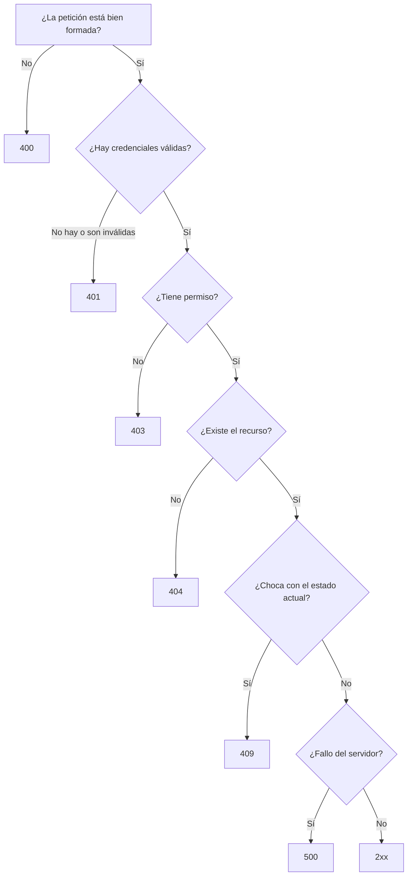

# Respuestas, cabeceras y errores

> El código de estado es la primera línea de tu respuesta y la única que muchos clientes miran. Equivocarte en él es equivocarte en todo.

## 1. `ResponseEntity`: control total

Devolver el objeto directamente está bien para el caso feliz. Cuando necesitas fijar el estado, añadir cabeceras o decidir en tiempo de ejecución, usas `ResponseEntity<T>`.

``` { .java .numerado }
@RestController
@RequestMapping("/api/v1/productos")
public class ProductoControlador {

    private final ProductoServicio servicio;
    private final ProductoMapper mapper;

    public ProductoControlador(ProductoServicio servicio, ProductoMapper mapper) {
        this.servicio = servicio;
        this.mapper = mapper;
    }

    // 200 con cuerpo
    @GetMapping("/{id}")
    public ResponseEntity<ProductoDto> obtener(@PathVariable Integer id) {
        return ResponseEntity.ok(mapper.aDto(servicio.obtener(id)));
    }

    // 201 + Location  ← el patrón que se examina
    @PostMapping
    public ResponseEntity<ProductoDto> crear(@Valid @RequestBody CrearProductoDto dto) {
        var creado = servicio.crear(mapper.aModelo(dto));
        var location = ServletUriComponentsBuilder.fromCurrentRequest()
                .path("/{id}")
                .buildAndExpand(creado.id())
                .toUri();
        return ResponseEntity.created(location).body(mapper.aDto(creado));
    }

    // 204 sin cuerpo
    @DeleteMapping("/{id}")
    public ResponseEntity<Void> borrar(@PathVariable Integer id) {
        servicio.borrar(id);
        return ResponseEntity.noContent().build();
    }

    // Cabeceras personalizadas
    @GetMapping
    public ResponseEntity<List<ProductoDto>> listar() {
        var lista = servicio.listar().stream().map(mapper::aDto).toList();
        return ResponseEntity.ok()
                .header("X-Total-Count", String.valueOf(lista.size()))
                .cacheControl(CacheControl.maxAge(Duration.ofMinutes(5)).cachePublic())
                .body(lista);
    }
}
```

**Catálogo de constructores:**

```
ResponseEntity.ok(cuerpo);                                   // 200
ResponseEntity.created(uri).body(cuerpo);                    // 201
ResponseEntity.accepted().body(cuerpo);                      // 202 (proceso asíncrono)
ResponseEntity.noContent().build();                          // 204
ResponseEntity.badRequest().body(cuerpo);                    // 400
ResponseEntity.notFound().build();                           // 404
ResponseEntity.status(HttpStatus.CONFLICT).body(cuerpo);     // cualquier otro
```

!!! warning "`Location` no es decorativo"
    Tras un `POST` exitoso, la cabecera `Location` indica **dónde ha quedado** el recurso creado. Clientes automáticos y tests la usan para el siguiente paso. Una API que devuelve 201 sin `Location` está incompleta, y en el examen se penaliza.

## 2. Cabeceras que debes conocer

| Cabecera | Dirección | Para qué |
|---|---|---|
| `Content-Type` | ambas | Formato del cuerpo: `application/json` |
| `Accept` | petición | Qué formatos acepta el cliente |
| `Authorization` | petición | `Bearer <token>` |
| `Location` | respuesta | URL del recurso recién creado |
| `Cache-Control` | respuesta | `max-age=300`, `no-store`… |
| `ETag` / `If-None-Match` | respuesta / petición | Caché por validación |
| `X-Total-Count` | respuesta | Total de elementos (convención de facto) |

### Negociación de contenido

```java
@GetMapping(value = "/{id}", produces = {MediaType.APPLICATION_JSON_VALUE,
                                          MediaType.APPLICATION_XML_VALUE})
public ProductoDto obtener(@PathVariable Integer id) { ... }
```

```bash
curl -H "Accept: application/json" localhost:8080/api/v1/productos/1
# 406 si no está soportado
curl -H "Accept: application/xml"  localhost:8080/api/v1/productos/1
```

`consumes` hace lo simétrico en la entrada: si el cliente manda `Content-Type: text/plain` a un endpoint que solo consume JSON, recibe **415 Unsupported Media Type**.

### Caché con ETag

```java
@GetMapping("/{id}")
public ResponseEntity<ProductoDto> obtener(@PathVariable Integer id) {
    var dto = mapper.aDto(servicio.obtener(id));
    var etag = "\"" + dto.hashCode() + "\"";
    return ResponseEntity.ok().eTag(etag).body(dto);
}
```

El cliente guarda el ETag y en la siguiente petición envía `If-None-Match: "..."`. Si nada cambió, el servidor responde **304 Not Modified** sin cuerpo: ancho de banda ahorrado. Spring lo automatiza con el `ShallowEtagHeaderFilter`.

## 3. Errores con Problem Details (RFC 7807)

Todo el mundo inventaba su propio formato de error. En 2016 el IETF estandarizó uno y desde Spring 6 hay soporte nativo con `ProblemDetail`.

```json
{
  "type":     "https://api.tienda.com/errores/stock-insuficiente",
  "title":    "Stock insuficiente",
  "status":   409,
  "detail":   "Producto 42: hay 3 unidades y se piden 10",
  "instance": "/api/v1/pedidos",
  "timestamp": "2026-03-14T10:25:00Z",
  "stockDisponible": 3
}
```

Cinco campos estándar: `type` (URI que documenta el tipo de error), `title` (resumen legible, siempre el mismo para ese tipo), `status`, `detail` (concreto de **esta** ocurrencia) e `instance` (la URI que falló). Puedes añadir los tuyos con `setProperty`.

``` { .java .annotate title="ManejadorErrores.java" hl_lines="1 7 8" }
@RestControllerAdvice                                                       // (1)!
public class ManejadorErrores {

    private static final Logger log = LoggerFactory.getLogger(ManejadorErrores.class);
    private static final URI BASE = URI.create("https://api.tienda.com/errores/");

    @ExceptionHandler(RecursoNoEncontradoException.class)                    // (2)!
    public ProblemDetail noEncontrado(RecursoNoEncontradoException e, HttpServletRequest req) {
        return construir(HttpStatus.NOT_FOUND, "Recurso no encontrado",
                         "no-encontrado", e.getMessage(), req);
    }

    @ExceptionHandler(StockInsuficienteException.class)
    public ProblemDetail sinStock(StockInsuficienteException e, HttpServletRequest req) {
        var pd = construir(HttpStatus.CONFLICT, "Stock insuficiente",
                           "stock-insuficiente", e.getMessage(), req);
        pd.setProperty("stockDisponible", e.getDisponible());               // (3)!
        return pd;
    }

    @ExceptionHandler(MethodArgumentNotValidException.class)
    public ProblemDetail validacion(MethodArgumentNotValidException e, HttpServletRequest req) {
        var errores = e.getBindingResult().getFieldErrors().stream()
            .collect(Collectors.toMap(FieldError::getField,
                     f -> Objects.toString(f.getDefaultMessage(), "inválido"), (a,b) -> a));
        var pd = construir(HttpStatus.BAD_REQUEST, "Datos no válidos", "validacion",
                           "La petición contiene %d campo(s) incorrecto(s)".formatted(errores.size()), req);
        pd.setProperty("errores", errores);
        return pd;
    }

    @ExceptionHandler(Exception.class)                                      // (4)!
    public ProblemDetail interno(Exception e, HttpServletRequest req) {
        log.error("Error no controlado en {} {}", req.getMethod(), req.getRequestURI(), e);
        return construir(HttpStatus.INTERNAL_SERVER_ERROR, "Error interno", "interno",
                         "Se ha producido un error. Inténtalo más tarde.", req);  // (5)!
    }

    private ProblemDetail construir(HttpStatus estado, String titulo, String tipo,
                                    String detalle, HttpServletRequest req) {
        var pd = ProblemDetail.forStatusAndDetail(estado, detalle);
        pd.setTitle(titulo);
        pd.setType(BASE.resolve(tipo));
        pd.setInstance(URI.create(req.getRequestURI()));                    // (6)!
        pd.setProperty("timestamp", Instant.now());
        return pd;
    }
}
```

1.  **`@RestControllerAdvice` captura las excepciones de *todos* los controladores.** Sin él tendrías `try/catch` repetidos en cada método. Con él, los controladores lanzan y se olvidan: la traducción excepción → respuesta HTTP vive en un único sitio.

2.  **Una excepción de dominio, un código HTTP.** El servicio lanza `RecursoNoEncontradoException` sin saber nada de HTTP; es aquí donde se decide que eso es un 404. Esa separación es justo lo que permite reutilizar el servicio desde una vista Thymeleaf o desde un test.

3.  **Campos extra.** RFC 7807 permite añadir propiedades propias al JSON. Aquí el cliente recibe cuánto stock queda, no solo que no hay bastante: un error útil en vez de un error correcto.

4.  **El cajón de sastre va el último.** Spring elige siempre el manejador **más específico**, así que este solo entra si ningún otro encaja. Sin él, una excepción imprevista se escaparía con la traza de Java en el cuerpo de la respuesta.

5.  **Aquí se registra el detalle y se devuelve un mensaje genérico.** Nunca se manda al cliente el `e.getMessage()` de un error interno: puede contener nombres de tablas, rutas de ficheros o fragmentos de SQL. La información técnica va al log; al cliente, lo justo.

6.  `instance` es **la URL concreta que ha fallado**. Junto al `timestamp`, es lo primero que te van a pedir cuando alguien abra una incidencia.

Spring envía estas respuestas con `Content-Type: application/problem+json`, el tipo MIME oficial.

### Elegir el código correcto



| Confusión frecuente | Correcto |
|---|---|
| 401 vs 403 | **401** = no sé quién eres (falta token o es inválido) · **403** = sé quién eres y no puedes |
| 400 vs 422 | **400** = malformado o falla la validación de formato · **422** = sintaxis correcta pero regla de negocio incumplida. Muchas APIs usan solo 400 |
| 404 vs 403 | Ocultar la existencia de un recurso ajeno con **404** en vez de 403 es una técnica legítima de seguridad |
| 200 con `{"error": ...}` | :material-close: **Nunca.** El estado HTTP es el contrato; devolver 200 en un error rompe a todos los clientes, proxies y monitorizaciones |

---

## Pruébalo ahora (30 min)

!!! reto "Trabaja tú ahora"
    Este bloque se hace **en clase, en tu equipo**. No se entrega ni puntúa: es la práctica que hace que el examen te salga.

**Parte 1 — Location.** Implementa el POST con `ServletUriComponentsBuilder` y verifica:

```bash
curl -i -X POST localhost:8080/api/v1/productos -H "Content-Type: application/json" \
  -d '{"nombre":"Casco Pro","categoria":"seguridad","precio":59.99,"stock":8}'
# HTTP/1.1 201 · Location: http://localhost:8080/api/v1/productos/7

curl -s $(curl -si -X POST localhost:8080/api/v1/productos -H "Content-Type: application/json" \
  -d '{"nombre":"Otro","categoria":"seguridad","precio":10,"stock":1}' \
  | grep -i '^location:' | tr -d '\r' | cut -d' ' -f2) | jq
```

Esa segunda orden crea un producto y

sigue el `Location`

para leerlo: exactamente lo que hace un cliente real.

**Parte 2 — Problem Details.** Monta el `@RestControllerAdvice` y comprueba los cinco errores:

```bash
curl -s localhost:8080/api/v1/productos/999 | jq                     # 404
curl -s -X POST localhost:8080/api/v1/productos -H "Content-Type: application/json" \
     # 400 + mapa errores
     -d '{"nombre":"","precio":-1,"stock":-1,"categoria":"xx"}' | jq
# 409 + stockDisponible
curl -s -X PATCH "localhost:8080/api/v1/productos/1/stock?unidades=-999" | jq
curl -i localhost:8080/api/v1/productos/abc                          # 400
curl -i -H "Accept: application/xml" localhost:8080/api/v1/productos/1  # 406
```

Comprueba con `curl -i` que el Content-Type es application/problem+json.

**Parte 3 — Cabeceras y caché.**

```bash
curl -i localhost:8080/api/v1/productos | grep -Ei 'x-total-count|cache-control'
ETAG=$(curl -si localhost:8080/api/v1/productos/1 | grep -i etag | tr -d '\r' | cut -d' ' -f2)
curl -i -H "If-None-Match: $ETAG" localhost:8080/api/v1/productos/1  # → 304, sin cuerpo
```

**Parte 4 — 415 y 405.**

```bash
# 415
curl -i -X POST localhost:8080/api/v1/productos -H "Content-Type: text/plain" -d 'hola'
curl -i -X DELETE localhost:8080/api/v1/productos  # 405
```

Estos dos los devuelve Spring solo. Comprueba si tu manejador los formatea como Problem Details o se escapan con el formato por defecto.

---

## Ejercicios (con solución)

### Ejercicio 1 — Códigos

(a) login con contraseña incorrecta · (b) usuario normal intenta `DELETE` reservado a admin · (c) crear con email ya registrado · (d) `GET` de un id inexistente · (e) el body no es JSON · (f) la API de pagos externa no responde · (g) borrado correcto · (h) creación correcta.

??? success "Solución"

    (a) `401` · (b) `403` · (c) `409` · (d) `404` · (e) `400` · (f) `502` Bad Gateway (o `503` / `504` si es indisponibilidad o timeout; nunca 500, que significa «fallo mío») · (g) `204` · (h) `201` con Location.


### Ejercicio 2 — Tres fallos

```java
@PostMapping
public Producto crear(@RequestBody Producto p) {
    return servicio.crear(p);
}
```

??? success "Solución"

    (1) Devuelve `200` en lugar de 201 y sin Location. (2) Falta `@Valid`: no se valida nada. (3) Expone la entidad de dominio en vez de un DTO, con riesgo de mass assignment (un cliente podría enviar id o campos internos). Correcto:
    ```java
    @PostMapping
    public ResponseEntity<ProductoDto> crear(@Valid @RequestBody CrearProductoDto dto) {
        var creado = servicio.crear(mapper.aModelo(dto));
        var location = ServletUriComponentsBuilder.fromCurrentRequest()
            .path("/{id}").buildAndExpand(creado.id()).toUri();
        return ResponseEntity.created(location).body(mapper.aDto(creado));
    }
    ```


### Ejercicio 3 — Problem Details completo

Escribe el manejador de `SocioConMultaException` (el socio debe dinero y no puede tomar prestado), incluyendo el importe adeudado.

??? success "Solución"

    ```java
    @ExceptionHandler(SocioConMultaException.class)
    public ProblemDetail multa(SocioConMultaException e, HttpServletRequest req) {
        var pd = ProblemDetail.forStatusAndDetail(HttpStatus.CONFLICT, e.getMessage());
        pd.setTitle("Socio con multa pendiente");
        pd.setType(URI.create("https://api.biblioteca.com/errores/multa-pendiente"));
        pd.setInstance(URI.create(req.getRequestURI()));
        pd.setProperty("importePendiente", e.getImporte());
        pd.setProperty("timestamp", Instant.now());
        return pd;
    }
    ```

    409

    porque la petición es correcta pero choca con el estado actual del sistema. El campo extra

    importePendiente

    permite al cliente mostrar «Debes 4,50 € para poder seguir tomando libros prestados» sin una segunda llamada.


### Ejercicio 4 — 401 o 403

(a) petición sin cabecera `Authorization` · (b) token caducado · (c) token válido de un usuario sin rol ADMIN · (d) token con firma manipulada.

??? success "Solución"

    (a) `401` · (b) `401` (la identidad ya no es verificable) · (c) `403` (identidad conocida, permisos insuficientes) · (d) `401`. Regla mnemotécnica: 401 = unauthenticated, 403 = unauthorized. Los nombres oficiales están cambiados y por eso todo el mundo se confunde.


### Ejercicio 5 — Diseña las respuestas

`POST /api/v1/prestamos` con `{"libroId": 42, "socioId": 7}`. Enumera todas las respuestas posibles con su código y su cuerpo.

??? success "Solución"

    | Situación | Código | Cuerpo |
    |---|---|---|
    | Préstamo creado | 201 + `Location: /api/v1/prestamos/99` | DTO del préstamo con fecha límite |
    | Falta `libroId` o es nulo | 400 | ProblemDetail con mapa `errores` |
    | Sin token | 401 | ProblemDetail «No autenticado» |
    | El socio 7 no es el del token y no eres admin | 403 | ProblemDetail «Sin permiso» |
    | El libro 42 no existe | 404 | ProblemDetail «Recurso no encontrado» |
    | El libro está prestado | 409 | ProblemDetail + `prestadoHasta` |
    | El socio alcanzó el máximo | 409 | ProblemDetail + `prestamosActivos`, `maximo` |
    | El socio tiene multa | 409 | ProblemDetail + `importePendiente` |
    | Fallo inesperado | 500 | ProblemDetail genérico (traza solo en el log) |

