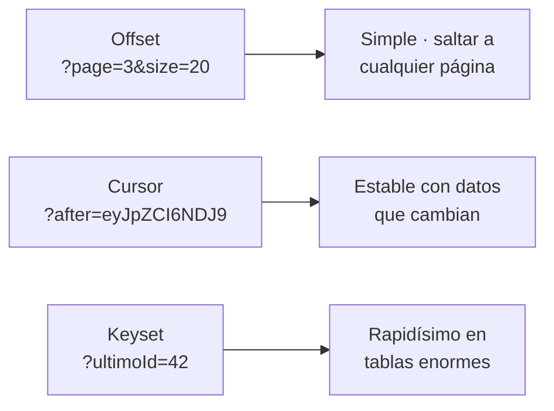

# Paginación, ordenación y búsqueda

> `GET /api/v1/productos` con 400.000 filas en la base de datos tumba el servidor, la red y el navegador del cliente. Ninguna API profesional devuelve una colección completa. Nunca.

## 1. Por qué se pagina

| Sin paginar | Paginado |
|---|---|
| 400.000 objetos en memoria del servidor | 20 objetos |
| ~80 MB de JSON por petición | ~4 KB |
| 12 s de respuesta | 30 ms |
| El navegador se congela al renderizar | Instantáneo |

Además, la paginación es **el contrato**: el cliente sabe que recibirá como mucho `size` elementos y puede pedir el siguiente bloque.

### Los tres modelos



**Offset** (el de Spring) es el que usarás: sencillo, permite ir a la página 7 directamente y es lo que espera cualquier tabla de UI. Su punto débil: si alguien inserta un registro mientras paginas, un elemento puede aparecer dos veces o ninguna. **Cursor** lo resuelve y es lo que usan Twitter, Slack o Stripe para *timelines*.

## 2. `Pageable` y `Page` en Spring

Spring inyecta un `Pageable` en el controlador a partir de los parámetros `page`, `size` y `sort`. No tienes que parsear nada.

```java
@GetMapping
public Page<ProductoDto> listar(
        @PageableDefault(size = 20, sort = "nombre") Pageable pageable) {
    return servicio.listar(pageable).map(mapper::aDto);
}
```

```http
GET /api/v1/productos?page=0&size=10
GET /api/v1/productos?page=2&size=5&sort=precio,desc
GET /api/v1/productos?sort=categoria,asc&sort=precio,desc     ← doble criterio
```

Respuesta:

```json
{
  "content": [ { "id": 1, "nombre": "Casco" }, { "id": 2, "nombre": "Patinete" } ],
  "pageable": { "pageNumber": 0, "pageSize": 10 },
  "totalElements": 137,
  "totalPages": 14,
  "number": 0,
  "size": 10,
  "first": true,
  "last": false,
  "numberOfElements": 10,
  "empty": false
}
```

!!! warning "Tres detalles que caen en el examen"
    1. `page` empieza en 0. La primera página es page=0.
    2. Una página fuera de rango devuelve 200 con `content: []`, no 404. La colección existe; simplemente no hay elementos en ese tramo.
    3. Limita el `size`. Sin límite, un cliente pide?size=1000000 y te tumba el servidor:
        ```yaml
        spring:
          data:
            web:
              pageable:
                max-page-size: 100
                default-page-size: 20
                one-indexed-parameters: false
        ```

### Paginar a mano sobre una lista en memoria

Todavía no tenemos base de datos, así que construimos el `Page` nosotros. Esto además te obliga a entender qué hay dentro.

```bash
public Page<Producto> listar(Pageable pageable) {
    var todos = repositorio.buscarTodos();

    // 1. Ordenar según el Sort recibido
    var comparador = construirComparador(pageable.getSort());
    var ordenados = comparador == null ? todos
                  : todos.stream().sorted(comparador).toList();

    // 2. Recortar la ventana
    int desde = (int) pageable.getOffset();                       // page * size
    int hasta = Math.min(desde + pageable.getPageSize(), ordenados.size());
    var ventana = desde >= ordenados.size() ? List.<Producto>of()
                                            : ordenados.subList(desde, hasta);

    // 3. Envolver indicando el total real
    return new PageImpl<>(ventana, pageable, ordenados.size());
}

private Comparator<Producto> construirComparador(Sort sort) {
    if (sort.isUnsorted()) return null;
    Comparator<Producto> resultado = null;
    for (Sort.Order orden : sort) {
        Comparator<Producto> c = switch (orden.getProperty()) {
            case "nombre"    -> Comparator.comparing(Producto::nombre, String.CASE_INSENSITIVE_ORDER);
            case "precio"    -> Comparator.comparingDouble(Producto::precio);
            case "stock"     -> Comparator.comparingInt(Producto::stock);
            case "categoria" -> Comparator.comparing(Producto::categoria);
            default -> throw new DatosInvalidosException(
                           "No se puede ordenar por '" + orden.getProperty() + "'");
        };
        if (orden.isDescending()) c = c.reversed();
        resultado = (resultado == null) ? c : resultado.thenComparing(c);
    }
    return resultado;
}
```

!!! danger "Lista blanca de campos ordenables"
    Fíjate en el `default -> throw`. Aceptar cualquier nombre de propiedad es un agujero: con JPA, `?sort=usuario.password` filtraría información, y con SQL construido a mano es una vía de inyección. **Siempre lista blanca.**

## 3. Filtrado y búsqueda

Los filtros van en la *query string* y son **opcionales**:

```http
GET /api/v1/productos?categoria=movilidad
GET /api/v1/productos?precioMin=50&precioMax=300
GET /api/v1/productos?q=patinete&disponible=true&sort=precio,asc&page=0&size=10
```

```java
@GetMapping
public Page<ProductoDto> buscar(
        @RequestParam(required = false) String q,
        @RequestParam(required = false) String categoria,
        @RequestParam(required = false) @PositiveOrZero Double precioMin,
        @RequestParam(required = false) @PositiveOrZero Double precioMax,
        @RequestParam(required = false) Boolean disponible,
        @PageableDefault(size = 20, sort = "nombre") Pageable pageable) {

    var criterios = new CriteriosBusqueda(q, categoria, precioMin, precioMax, disponible);
    return servicio.buscar(criterios, pageable).map(mapper::aDto);
}

public record CriteriosBusqueda(String q, String categoria,
                                Double precioMin, Double precioMax, Boolean disponible) {}
```

Y el servicio encadena predicados, cada uno neutro si el criterio no viene:

``` { .java .numerado .annotate title="servicio/BusquedaServicio.java" hl_lines="2 3 6" }
public Page<Producto> buscar(CriteriosBusqueda c, Pageable pageable) {
    if (c.precioMin() != null && c.precioMax() != null && c.precioMin() > c.precioMax())
        throw new DatosInvalidosException("precioMin no puede ser mayor que precioMax");  // (1)!

    var filtrados = repositorio.buscarTodos().stream()
        .filter(p -> c.q() == null           || contieneIgnorandoTildes(p.nombre(), c.q()))   // (2)!
        .filter(p -> c.categoria() == null   || p.categoria().equalsIgnoreCase(c.categoria()))
        .filter(p -> c.precioMin() == null   || p.precio() >= c.precioMin())
        .filter(p -> c.precioMax() == null   || p.precio() <= c.precioMax())
        .filter(p -> c.disponible() == null  || (p.stock() > 0) == c.disponible())
        .toList();

    return paginar(filtrados, pageable);
}

private boolean contieneIgnorandoTildes(String texto, String busqueda) {
    return normalizar(texto).contains(normalizar(busqueda));
}
private String normalizar(String s) {
    return Normalizer.normalize(s, Normalizer.Form.NFD)
                     .replaceAll("\\p{M}", "")     // (3)!
                     .toLowerCase();
}
```

1.  **Validar la coherencia entre parámetros, no solo cada uno por separado.** `precioMin=100&precioMax=50` tiene los dos valores bien formados y la combinación no tiene sentido: devuelve una lista vacía sin explicar por qué. Un 400 con el motivo es mucho mejor servicio que un `[]` silencioso.

2.  **El patrón «filtro neutro».** Si el criterio no viene (`== null`), la condición es cierta para todos y el filtro no descarta nada. Así los cinco filtros se combinan solos en cualquier orden, sin un solo `if` anidado. Compáralo con la alternativa: 2⁵ = 32 combinaciones de criterios que habría que escribir a mano.

3.  **`\p{M}` son las marcas diacríticas.** `NFD` separa «á» en «a» + tilde, y este `replaceAll` borra la tilde suelta. Es la diferencia entre una búsqueda que encuentra «Batería» cuando el usuario escribe «bateria» y una que le frustra.

### Convenios de nombres de filtro

| Intención | Parámetro |
|---|---|
| Búsqueda de texto libre | `q` o `search` |
| Igualdad | `categoria=movilidad` |
| Rango | `precioMin` / `precioMax`, o `precio[gte]` / `precio[lte]` |
| Varios valores | `categoria=movilidad,seguridad` → `List<String>` |
| Fechas | `desde` / `hasta` en ISO-8601 |
| Booleano | `disponible=true` |

Para varios valores, Spring lo hace solo:

```
// ?categoria=a&categoria=b  o  ?categoria=a,b
@RequestParam(required = false) List<String> categoria
```

## 4. Respuesta paginada propia

`Page` de Spring serializa mucho ruido (`pageable`, `sort`…) y su formato **no es estable entre versiones** — Spring incluso lo avisa por consola. En una API pública conviene un DTO propio:

```java
public record PaginaDto<T>(List<T> content, MetaPagina page) {

    public record MetaPagina(int number, int size, long totalElements,
                             int totalPages, boolean first, boolean last) {}

    public static <T> PaginaDto<T> de(Page<T> p) {
        return new PaginaDto<>(p.getContent(),
            new MetaPagina(p.getNumber(), p.getSize(), p.getTotalElements(),
                           p.getTotalPages(), p.isFirst(), p.isLast()));
    }
}
```

```json
{
  "content": [ ... ],
  "page": { "number": 0, "size": 20, "totalElements": 137,
            "totalPages": 7, "first": true, "last": false }
}
```

Nítido, estable y documentable.

---

## Pruébalo ahora (30 min)

!!! reto "Trabaja tú ahora"
    Este bloque se hace **en clase, en tu equipo**. No se entrega ni puntúa: es la práctica que hace que el examen te salga.

**Parte 0 — Datos suficientes.** Carga 50 productos de prueba con `@PostConstruct` o un bucle de curl; con 3 productos no se aprecia nada.

**Parte 1 — Paginación.**

```bash
curl \
     -s "localhost:8080/api/v1/productos?page=0&size=5" | jq '.content|length, .totalElements, .totalPages'
# → 0, con estado 200
curl -s "localhost:8080/api/v1/productos?page=999&size=5" | jq '.content|length'
curl -si "localhost:8080/api/v1/productos?page=999&size=5" | head -1  # confirma el 200
# ¿lo limitas?
curl -s "localhost:8080/api/v1/productos?size=1000000" | jq '.content|length'
```

**Parte 2 — Ordenación.**

```bash
curl \
     -s "localhost:8080/api/v1/productos?sort=precio,desc&size=3" | jq '.content[].precio'
curl -s "localhost:8080/api/v1/productos?sort=categoria,asc&sort=precio,desc&size=10" \
  | jq -r '.content[] | "\(.categoria)  \(.precio)"'
curl -s "localhost:8080/api/v1/productos?sort=inventado,asc" | jq   # → 400, no 500
```

**Parte 3 — Filtros.**

```bash
curl -s "localhost:8080/api/v1/productos?categoria=movilidad" | jq '.totalElements'
curl \
     -s "localhost:8080/api/v1/productos?precioMin=50&precioMax=300" | jq '.content[].precio'
# ¿encuentra "Batería"?
curl -s "localhost:8080/api/v1/productos?q=bateria" | jq '.content[].nombre'
curl -s "localhost:8080/api/v1/productos?precioMin=500&precioMax=100" | jq     # → 400
curl \
     -s "localhost:8080/api/v1/productos?q=pat&categoria=movilidad&precioMax=400&sort=precio,asc&page=0&size=5" | jq
```

**Parte 4 — Recorre todas las páginas** como haría un cliente real:

```bash
TOTAL=$(curl -s "localhost:8080/api/v1/productos?size=10" | jq '.totalPages')
for ((p=0;p<TOTAL;p++)); do
  echo "--- página $p ---"
  curl -s "localhost:8080/api/v1/productos?page=$p&size=10" | jq -r '.content[].nombre'
done
```

---

## Ejercicios (con solución)

### Ejercicio 1 — Interpreta la URL

`GET /api/v1/productos?page=2&size=15&sort=precio,desc&categoria=movilidad`

??? success "Solución"

    Tercera página (los índices empiezan en 0) de 15 elementos — es decir, los elementos 31 a 45 del resultado ya filtrado —, ordenados por precio de mayor a menor, y solo de la categoría movilidad. Orden de operaciones: filtrar → ordenar → paginar. Hacerlo en otro orden da resultados distintos y equivocados.


### Ejercicio 2 — El bug del filtro

```
.filter(p -> p.categoria().equals(categoria))
```

¿Qué falla cuando el cliente no envía

categoria

?

??? success "Solución"

    categoria es null, así que `equals(null)` devuelve false para todos: la respuesta llega vacía en lugar de traer todos los productos. Y si se invirtiera el orden (categoria.equals(p.categoria())) sería peor: `NullPointerException` → 500. Correcto:
    ```
    .filter(p -> categoria == null || p.categoria().equalsIgnoreCase(categoria))
    ```

    El

    ||

    con cortocircuito hace que el predicado sea neutro cuando el filtro no viene.


### Ejercicio 3 — 404 o 200

El cliente pide `?page=50` y solo hay 3 páginas. ¿Qué devuelves?

??? success "Solución"

    `200` con content: [], totalElements: 47, totalPages: 3. El recurso colección existe; la consulta es válida y su resultado, legítimamente vacío. Un 404 significaría «esta URL no corresponde a ningún recurso», que es falso. Misma regla para un filtro que no encuentra nada: 200 con lista vacía.


### Ejercicio 4 — Implementa un filtro por rango de fechas

Añade `desde` y `hasta` sobre `creadoEn` (`LocalDate`), validando que `desde ≤ hasta`.

??? success "Solución"

    ```
    @RequestParam(required = false) @DateTimeFormat(iso = ISO.DATE) LocalDate desde,
    @RequestParam(required = false) @DateTimeFormat(iso = ISO.DATE) LocalDate hasta
    ```

    ```java
    if (desde != null && hasta != null && desde.isAfter(hasta))
        throw new DatosInvalidosException("'desde' no puede ser posterior a 'hasta'");

    .filter(p -> desde == null || !p.creadoEn().toLocalDate().isBefore(desde))
    .filter(p -> hasta == null || !p.creadoEn().toLocalDate().isAfter(hasta))
    ```

    Dos detalles: `@DateTimeFormat` es necesario para que Spring convierta?desde=2026-01-01 en `LocalDate`, y usar!isBefore /!isAfter hace que el rango sea inclusivo en ambos extremos, que es lo que espera el usuario.


### Ejercicio 5 — Diseña la búsqueda de una biblioteca

Buscar libros por título o autor, filtrar por género, año e idioma, ver solo los disponibles, ordenar y paginar. Diseña la URL y la firma del método.

??? success "Solución"

    ```http
    GET /api/v1/libros?q=quijote&genero=novela&anioMin=1600&anioMax=1620
        &idioma=es&disponible=true&sort=anio,desc&page=0&size=20
    ```

    ```java
    @GetMapping
    public PaginaDto<LibroDto> buscar(
            @RequestParam(required = false) String q,             // título O autor
            @RequestParam(required = false) List<String> genero,  // multivalor
            @RequestParam(required = false) @Min(1000) Integer anioMin,
            @RequestParam(required = false) @Max(2100) Integer anioMax,
            @RequestParam(required = false) String idioma,
            @RequestParam(required = false) Boolean disponible,
            @PageableDefault(size = 20, sort = "titulo") Pageable pageable) {
        return PaginaDto.de(servicio.buscar(new CriteriosLibro(...), pageable).map(mapper::aDto));
    }
    ```

    Claves: todos los filtros opcionales, q busca en dos campos normalizando tildes, genero admite varios valores, los rangos se validan (anioMin ≤ anioMax) y la ordenación usa lista blanca de campos.

