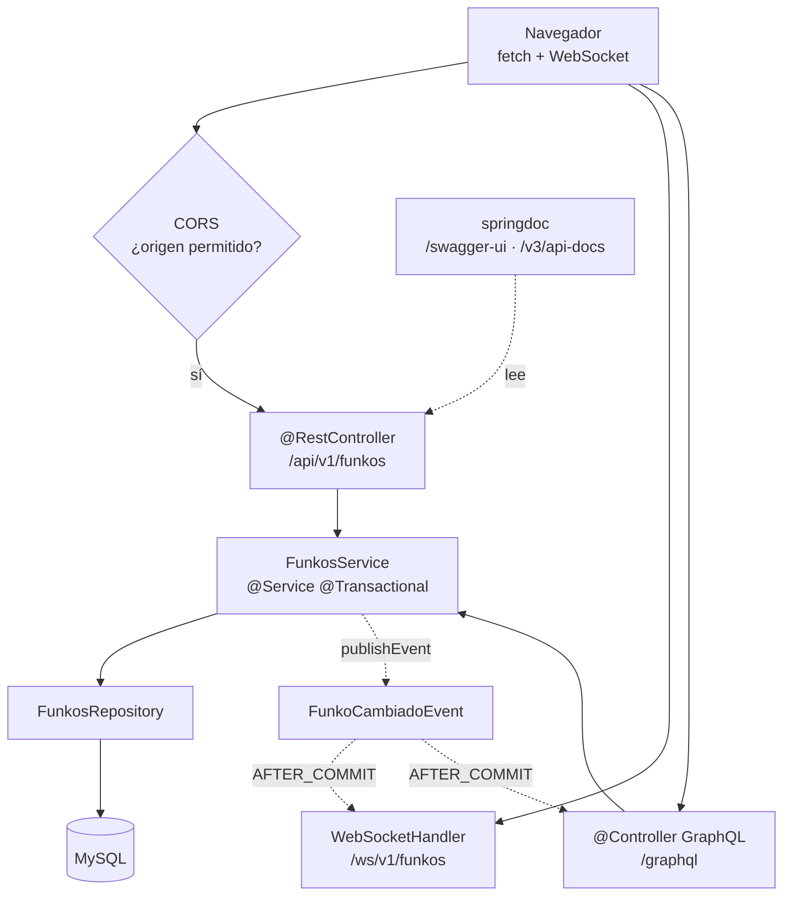

# 4. Proyecto completo paso a paso

Añadir **WebSockets**, **GraphQL** y **documentación OpenAPI** al proyecto de la UT5. Sin tocar el servicio ni el repositorio.

!!! success "La tesis de la unidad, en una frase"
    **Un servicio, tres transportes.** La API REST de la UT5 se queda intacta; se le añaden dos puertas más y la documentación de la primera.

    ```mermaid
    graph TB
        REST["REST<br/>/api/v1/funkos"] --> S["FunkosService<br/>@Service"]
        WS["WebSocket<br/>/ws/v1/funkos"] --> S
        GQL["GraphQL<br/>/graphql"] --> S
        S --> R["FunkosRepository<br/>JpaRepository"]
        R --> BD[("MySQL")]
        DOC["OpenAPI<br/>/swagger-ui"] -.->|documenta| REST
    ```

!!! danger "Antes de empezar: comprueba que tu servicio está limpio"
    ```bash
    grep -rn "ResponseEntity\|HttpStatus\|@PathVariable" src/main/java/**/services/
    ```

    **Si eso devuelve algo, este tema no se puede hacer** sin refactorizar primero. Un servicio que habla HTTP no se puede reutilizar desde un WebSocket ni desde GraphQL, donde no hay códigos de estado.

    Es la factura de la UT4, y llega aquí.

---

## Parte I · WebSockets

### Paso 1 · La dependencia y el evento

```xml title="pom.xml"
<dependency>
  <groupId>org.springframework.boot</groupId>
  <artifactId>spring-boot-starter-websocket</artifactId>
</dependency>
```

```java title="funkos/events/FunkoCambiadoEvent.java"
package es.iesx.funkos.funkos.events;

import es.iesx.funkos.funkos.dto.FunkoResponse;

/** Lo que ha pasado con un funko. Se publica DENTRO de la transacción
 *  y se consume DESPUÉS de confirmarla. */
public record FunkoCambiadoEvent(Tipo tipo, FunkoResponse funko) {
    public enum Tipo { CREATE, UPDATE, DELETE }
}
```

!!! success "Por qué un evento y no una llamada directa"
    Podrías inyectar el notificador en el servicio y llamarlo. Con un evento ganas dos cosas:

    1. **El servicio no conoce al notificador.** Publica «ha pasado esto» y se desentiende. Mañana puedes añadir un segundo oyente (un log de auditoría, un correo) sin tocar el servicio.
    2. **Se puede escuchar `AFTER_COMMIT`**, que es la pieza que arregla el bug del paso 3.

    Es la interfaz `Notificador` de la [UT2](../ut2/03-poo-en-java.md) con el acoplamiento aún más bajo: ahora el servicio no conoce ni la interfaz.

### Paso 2 · El `handler`

```java title="websockets/FunkosWebSocketHandler.java"
package es.iesx.funkos.websockets;

import org.slf4j.*;
import org.springframework.stereotype.Component;
import org.springframework.web.socket.*;
import org.springframework.web.socket.handler.TextWebSocketHandler;

import java.io.IOException;
import java.util.Set;
import java.util.concurrent.CopyOnWriteArraySet;

@Component
public class FunkosWebSocketHandler extends TextWebSocketHandler {

    private static final Logger log = LoggerFactory.getLogger(FunkosWebSocketHandler.class);

    /** Concurrente a propósito: se recorre y se modifica desde hilos distintos. */
    private final Set<WebSocketSession> sesiones = new CopyOnWriteArraySet<>();

    @Override
    public void afterConnectionEstablished(WebSocketSession session) {
        sesiones.add(session);
        log.info("WS conectado {} · total: {}", session.getId(), sesiones.size());
    }

    @Override
    public void afterConnectionClosed(WebSocketSession session, CloseStatus status) {
        sesiones.remove(session);
        log.info("WS desconectado {} ({}) · total: {}",
                 session.getId(), status.getCode(), sesiones.size());
    }

    @Override
    public void handleTransportError(WebSocketSession session, Throwable e) {
        log.warn("WS error en {}: {}", session.getId(), e.getMessage());
        sesiones.remove(session);
    }

    /** Un cliente roto no debe dejar sin mensaje a los demás. */
    public void enviarATodos(String mensaje) {
        for (var s : sesiones) {
            try {
                if (s.isOpen()) s.sendMessage(new TextMessage(mensaje));
                else sesiones.remove(s);
            } catch (IOException e) {
                log.warn("WS no se pudo enviar a {}: {}", s.getId(), e.getMessage());
                sesiones.remove(s);
            }
        }
    }

    public int conectados() { return sesiones.size(); }
}
```

!!! danger "Las tres cosas que hacen que esto no se rompa en producción"
    **1. `CopyOnWriteArraySet`, no `HashSet`.** Cada conexión entra por un hilo distinto, y el *broadcast* recorre la colección mientras alguien se conecta. Con un `HashSet` normal: `ConcurrentModificationException`, el mismo de la [UT2, E18](../ut2/ejercicios.md).

    **2. Quitar la sesión en los tres sitios**: al cerrarse, al dar error de transporte y al fallar el envío. Sin eso, la colección crece para siempre y cada mensaje intenta escribir en sesiones muertas.

    **3. El `try` dentro del bucle.** Sin él, un cliente desconectado lanza `IllegalStateException`, **corta el bucle** y los clientes que vienen después **no reciben nada**. Y `isOpen()` no basta: entre la comprobación y el envío la conexión puede caerse.

### Paso 3 · El notificador, después de confirmar

```java title="websockets/FunkosNotificador.java"
package es.iesx.funkos.websockets;

import com.fasterxml.jackson.core.JsonProcessingException;
import com.fasterxml.jackson.databind.ObjectMapper;
import es.iesx.funkos.funkos.dto.FunkoResponse;
import es.iesx.funkos.funkos.events.FunkoCambiadoEvent;
import org.slf4j.*;
import org.springframework.stereotype.Component;
import org.springframework.transaction.event.*;

import java.time.LocalDateTime;

@Component
public class FunkosNotificador {

    private static final Logger log = LoggerFactory.getLogger(FunkosNotificador.class);

    private final FunkosWebSocketHandler handler;
    private final ObjectMapper mapper;

    public FunkosNotificador(FunkosWebSocketHandler handler, ObjectMapper mapper) {
        this.handler = handler;
        this.mapper = mapper;
    }

    /** AFTER_COMMIT: solo se notifica lo que se ha guardado de verdad. */
    @TransactionalEventListener(phase = TransactionPhase.AFTER_COMMIT)
    public void alCambiar(FunkoCambiadoEvent evento) {
        try {
            handler.enviarATodos(mapper.writeValueAsString(new Notificacion(
                    "FUNKO",
                    evento.tipo().name(),
                    evento.funko(),
                    LocalDateTime.now().toString())));
        } catch (JsonProcessingException e) {
            log.error("No se pudo serializar la notificación", e);
        }
    }

    public record Notificacion(String entidad, String tipo,
                               FunkoResponse datos, String fecha) {}
}
```

!!! danger "`AFTER_COMMIT` arregla un bug que, sin él, es invisible"
    Sin `@TransactionalEventListener(AFTER_COMMIT)`, la notificación sale **antes** de que la transacción se confirme. Si algo falla después, el `rollback` deshace el `INSERT` pero **no deshace el mensaje ya enviado**.

    Resultado: los clientes conectados ven un funko que no existe en la base de datos. Y nadie lo detecta, porque en desarrollo la transacción nunca falla.

!!! tip "Se manda el `FunkoResponse`, no la entidad"
    Dos razones, y las dos son de la UT5:

    1. La entidad **expone campos** que no quieres publicar.
    2. La entidad **arrastra relaciones perezosas**, y aquí estamos **fuera de toda transacción**: serializarla sería un `LazyInitializationException` garantizado dentro del notificador, donde además es más difícil de diagnosticar.

### Paso 4 · Publicar desde el servicio

```java title="funkos/services/FunkosServiceImpl.java (los cambios)"
@Service
@CacheConfig(cacheNames = {"funkos"})
public class FunkosServiceImpl implements FunkosService {

    private final FunkosRepository repositorio;
    private final CategoriasRepository categoriasRepository;
    private final FunkoMapper mapper;
    private final ApplicationEventPublisher eventos;          // ← lo único nuevo

    public FunkosServiceImpl(FunkosRepository repositorio,
                             CategoriasRepository categoriasRepository,
                             FunkoMapper mapper,
                             ApplicationEventPublisher eventos) {
        this.repositorio = repositorio;
        this.categoriasRepository = categoriasRepository;
        this.mapper = mapper;
        this.eventos = eventos;
    }

    @Override
    @Transactional
    @CacheEvict(allEntries = true)
    public FunkoResponse save(FunkoCreateRequest request) {
        if (repositorio.existsByNombreIgnoreCaseAndDeletedFalse(request.nombre()))
            throw new FunkoConflictException("Ya existe un funko llamado " + request.nombre());

        var categoria = categoriasRepository
                .findByNombreIgnoreCaseAndDeletedFalse(request.categoria())
                .orElseThrow(() -> new FunkoBadRequestException(
                        "La categoría " + request.categoria() + " no existe"));

        var respuesta = mapper.toResponse(repositorio.save(mapper.toModel(request, categoria)));
        eventos.publishEvent(new FunkoCambiadoEvent(Tipo.CREATE, respuesta));   // ← nuevo
        return respuesta;
    }

    // igual en update, replace y deleteById, con Tipo.UPDATE y Tipo.DELETE
}
```

!!! success "El diff completo del servicio: 2 líneas"
    Una dependencia en el constructor y un `publishEvent` por cada método de escritura. **La lógica de negocio no se ha tocado.**

    `ApplicationEventPublisher` es un bean que Spring inyecta sin que haya que declararlo en ninguna parte.

### Paso 5 · Registrar el endpoint

```java title="config/WebSocketConfig.java"
@Configuration
@EnableWebSocket
public class WebSocketConfig implements WebSocketConfigurer {

    private final FunkosWebSocketHandler funkos;
    private final String[] origenes;

    public WebSocketConfig(FunkosWebSocketHandler funkos,
                           @Value("${cors.origenes-permitidos}") String[] origenes) {
        this.funkos = funkos;
        this.origenes = origenes;
    }

    @Override
    public void registerWebSocketHandlers(WebSocketHandlerRegistry registry) {
        registry.addHandler(funkos, "/ws/v1/funkos")
                .setAllowedOrigins(origenes);
    }
}
```

!!! danger "`setAllowedOrigins` no es opcional"
    **Los WebSockets no están sujetos a la política del mismo origen** del navegador. Sin esta línea, cualquier página de internet puede abrir una conexión contra tu servidor y escuchar todas las notificaciones.

    Y ojo: `setAllowedOrigins("*")` es lo mismo que no ponerlo.

### Paso 6 · Probarlo

```html title="src/main/resources/static/ws-test.html"
<!doctype html>
<html lang="es">
<head><meta charset="utf-8"><title>Notificaciones de funkos</title></head>
<body>
  <h1>Notificaciones</h1>
  <p id="estado">Conectando…</p>
  <ul id="log"></ul>

  <script>
    const ws = new WebSocket(`ws://${location.host}/ws/v1/funkos`);
    const log = document.getElementById('log');
    const estado = document.getElementById('estado');

    ws.onopen    = () => estado.textContent = 'Conectado';
    ws.onclose   = () => estado.textContent = 'Desconectado';
    ws.onerror   = e  => estado.textContent = 'Error';
    ws.onmessage = e  => {
      const n = JSON.parse(e.data);
      const li = document.createElement('li');
      li.textContent = `${n.fecha} · ${n.tipo} · ${n.datos.nombre}`;
      log.prepend(li);
    };
  </script>
</body>
</html>
```

```bash
# Abre http://localhost:8080/ws-test.html en DOS pestañas, y después:
curl -X POST localhost:8080/api/v1/funkos \
  -H "Content-Type: application/json" \
  -d '{"nombre":"Pikachu","precio":20.0,"cantidad":7,"categoria":"ANIME"}'
```

```
2026-10-07T12:34:56 · CREATE · Pikachu        ← en las dos pestañas, al instante
```

```bash
# Desde la terminal, con wscat
npx wscat -c ws://localhost:8080/ws/v1/funkos
```

!!! success "Comprueba las cuatro cosas"
    - [ ] Las **dos** pestañas reciben la notificación.
    - [ ] Cierras una pestaña, creas otro funko y **el servidor no se queja** (y el log dice `total: 1`).
    - [ ] Un POST que devuelve **409** (nombre repetido) **no genera notificación**.
    - [ ] Un POST que devuelve **400** (validación) tampoco.

    Las dos últimas son `AFTER_COMMIT` haciendo su trabajo.

---

## Parte II · GraphQL

### Paso 7 · Dependencias y esquema

```xml title="pom.xml"
<dependency>
  <groupId>org.springframework.boot</groupId>
  <artifactId>spring-boot-starter-graphql</artifactId>
</dependency>
<dependency>
  <groupId>org.springframework.graphql</groupId>
  <artifactId>spring-graphql-test</artifactId>
  <scope>test</scope>
</dependency>
```

```graphql title="src/main/resources/graphql/schema.graphqls"
# ==== TIPOS ====
type Funko {
    id: ID!
    nombre: String!
    precio: Float!
    cantidad: Int!
    imagen: String
    categoria: Categoria!
    createdAt: String!
}

type Categoria {
    id: ID!
    nombre: String!
    funkos: [Funko!]!
}

type PaginaFunkos {
    contenido: [Funko!]!
    total: Int!
    pagina: Int!
    totalPaginas: Int!
}

# ==== ENTRADAS ====
input FunkoInput {
    nombre: String!
    precio: Float!
    cantidad: Int!
    imagen: String
    categoria: String!
}

input FunkoFiltro {
    categoria: String
    precioMin: Float
    precioMax: Float
    nombre: String
}

# ==== QUERIES ====
type Query {
    funkos(filtro: FunkoFiltro, pagina: Int = 0, tamano: Int = 20): PaginaFunkos!
    funkoById(id: ID!): Funko
    categorias: [Categoria!]!
    categoriaByNombre(nombre: String!): Categoria
}

# ==== MUTACIONES ====
type Mutation {
    crearFunko(input: FunkoInput!): Funko!
    actualizarFunko(id: ID!, input: FunkoInput!): Funko!
    borrarFunko(id: ID!): Boolean!
}

# ==== SUSCRIPCIONES ====
type Subscription {
    funkoCambiado: NotificacionFunko!
}

type NotificacionFunko {
    tipo: String!
    funko: Funko!
    fecha: String!
}
```

!!! success "Los `!` del esquema son el contrato, y se propagan"
    `[Funko!]!` significa: **ni la lista ni sus elementos pueden ser `null`**. Una lista vacía es `[]`, nunca `null`.

    Y el detalle que cuesta entender: si un campo es `!` y tu resolutor devuelve `null`, **GraphQL anula el objeto padre entero** y lo reporta como error. La no-nulabilidad sube hacia arriba, así que `categoria: Categoria!` obliga a que **todos** los funkos tengan categoría.

    Es un contrato verificado en tiempo de ejecución, al revés que OpenAPI, que solo describe.

### Paso 8 · El controlador GraphQL

```java title="funkos/controllers/FunkosGraphQlController.java"
package es.iesx.funkos.funkos.controllers;

import es.iesx.funkos.funkos.dto.*;
import es.iesx.funkos.funkos.services.FunkosService;
import es.iesx.funkos.categorias.services.CategoriasService;
import jakarta.validation.Valid;
import org.springframework.data.domain.PageRequest;
import org.springframework.graphql.data.method.annotation.*;
import org.springframework.stereotype.Controller;

import java.util.*;
import java.util.stream.Collectors;

@Controller
public class FunkosGraphQlController {

    private final FunkosService servicio;                 // ← EL MISMO que usa REST
    private final CategoriasService categoriasService;

    public FunkosGraphQlController(FunkosService servicio,
                                   CategoriasService categoriasService) {
        this.servicio = servicio;
        this.categoriasService = categoriasService;
    }

    @QueryMapping
    public PaginaFunkosResponse funkos(@Argument Optional<FunkoFiltro> filtro,
                                       @Argument int pagina,
                                       @Argument int tamano) {
        var f = filtro.orElse(FunkoFiltro.vacio());
        var page = servicio.findAll(
                Optional.ofNullable(f.categoria()),
                Optional.ofNullable(f.precioMin()),
                Optional.ofNullable(f.precioMax()),
                Optional.ofNullable(f.nombre()),
                PageRequest.of(pagina, Math.min(tamano, 100)));

        return new PaginaFunkosResponse(page.getContent(), (int) page.getTotalElements(),
                                        page.getNumber(), page.getTotalPages());
    }

    @QueryMapping
    public FunkoResponse funkoById(@Argument Long id) {
        return servicio.findById(id);          // lanza FunkoNotFoundException
    }

    @MutationMapping
    public FunkoResponse crearFunko(@Argument("input") @Valid FunkoCreateRequest input) {
        return servicio.save(input);
    }

    @MutationMapping
    public FunkoResponse actualizarFunko(@Argument Long id,
                                         @Argument("input") @Valid FunkoCreateRequest input) {
        return servicio.replace(id, input);
    }

    @MutationMapping
    public Boolean borrarFunko(@Argument Long id) {
        servicio.deleteById(id);
        return true;
    }

    /** Resuelve el campo "categoria" de Funko para TODOS los funkos de golpe. */
    @BatchMapping(typeName = "Funko")
    public Map<FunkoResponse, CategoriaResponse> categoria(List<FunkoResponse> funkos) {
        var nombres = funkos.stream().map(FunkoResponse::categoria).distinct().toList();
        var porNombre = categoriasService.findByNombres(nombres).stream()
                .collect(Collectors.toMap(CategoriaResponse::nombre, c -> c));
        return funkos.stream().collect(Collectors.toMap(f -> f,
                                       f -> porNombre.get(f.categoria())));
    }
}
```

!!! danger "El `@BatchMapping` es la diferencia entre 2 y 101 consultas"
    Sin él, esta consulta:

    ```graphql
    { funkos { contenido { nombre categoria { nombre } } } }
    ```

    lanza **una consulta por cada funko** para su categoría. Es el N+1 de la [UT5](../ut5/ejercicios.md), pero aquí **no lo puedes arreglar con un `JOIN FETCH` fijo**, porque la consulta depende de qué campos pida el cliente.

    `@BatchMapping` recibe **la lista entera** de funkos de golpe, hace una sola consulta con todos los nombres y devuelve el mapa. De 101 a **2**, independientemente de lo que se pida.

    **Es el problema característico de GraphQL**, y la razón de que haya que medirlo con `show-sql=true` en vez de suponer.

### Paso 9 · Las excepciones y la suscripción

```java title="config/GraphQlExceptionHandler.java"
@Component
public class GraphQlExceptionHandler extends DataFetcherExceptionResolverAdapter {

    @Override
    protected GraphQLError resolveToSingleError(Throwable ex, DataFetchingEnvironment env) {
        return switch (ex) {
            case FunkoNotFoundException e -> error(env, ErrorType.NOT_FOUND, e);
            case FunkoConflictException e -> error(env, ErrorType.BAD_REQUEST, e);
            case FunkoBadRequestException e -> error(env, ErrorType.BAD_REQUEST, e);
            default -> null;                     // que lo trate el por defecto
        };
    }

    private GraphQLError error(DataFetchingEnvironment env, ErrorType tipo, Throwable e) {
        return GraphqlErrorBuilder.newError(env)
                .errorType(tipo)
                .message(e.getMessage())
                .build();
    }
}
```

```java title="funkos/controllers/FunkosSubscriptionController.java"
@Controller
public class FunkosSubscriptionController {

    private final Sinks.Many<NotificacionFunko> emisor =
            Sinks.many().multicast().onBackpressureBuffer();

    @SubscriptionMapping
    public Flux<NotificacionFunko> funkoCambiado() {
        return emisor.asFlux();
    }

    @TransactionalEventListener(phase = TransactionPhase.AFTER_COMMIT)
    public void alCambiar(FunkoCambiadoEvent e) {
        emisor.tryEmitNext(new NotificacionFunko(
                e.tipo().name(), e.funko(), LocalDateTime.now().toString()));
    }
}
```

!!! success "Fíjate en lo que ha pasado con las excepciones"
    `FunkoNotFoundException` —escrita en la UT4, sin tocar desde entonces— se traduce a:

    | Transporte | Resultado |
    |---|---|
    | REST | **404 Not Found**, por su `@ResponseStatus` |
    | GraphQL | **200** con `errors[0].extensions.classification = "NOT_FOUND"` |
    | WebSocket | No aplica: no se notifica nada |

    **Si el servicio lanzara `ResponseStatusException` con `HttpStatus`, aquí no habría nada que traducir**, porque en GraphQL un código HTTP no significa nada. Es la decisión del [tema 3 de la UT4](../ut4/03-servicios-dtos-y-cache.md) cobrando intereses.

    Y el `switch` con patrones es Java 25, el de la UT2.

!!! info "La suscripción usa el mismo evento que el WebSocket"
    Un solo `FunkoCambiadoEvent` alimenta **dos** canales de tiempo real: el WebSocket crudo y la suscripción GraphQL. Si mañana añades Server-Sent Events, es un tercer oyente y cero cambios.

### Paso 10 · Probarlo

```properties title="application-dev.properties"
spring.graphql.graphiql.enabled=true
spring.graphql.graphiql.path=/graphiql
spring.graphql.schema.printer.enabled=true
spring.graphql.schema.introspection.enabled=true
```

```properties title="application-prod.properties"
spring.graphql.graphiql.enabled=false
spring.graphql.schema.introspection.enabled=false
```

=== "Consulta mínima"

    ```graphql
    { funkos { contenido { nombre } total } }
    ```

    ```json
    { "data": { "funkos": {
        "contenido": [{"nombre":"Mickey Mouse"},{"nombre":"Stitch"}],
        "total": 6 } } }
    ```

    **Solo el nombre.** Compara con el `GET /api/v1/funkos`, que devuelve los ocho campos de cada funko quiera el cliente o no.

=== "Con la relación"

    ```graphql
    { funkos(filtro: {categoria: "ANIME"}, tamano: 5) {
        contenido { nombre precio categoria { nombre } }
        total totalPaginas } }
    ```

    En el log: **2 consultas** gracias al `@BatchMapping`. Sin él serían 1 + número de funkos.

=== "Mutación"

    ```graphql
    mutation {
      crearFunko(input: {
        nombre: "Pikachu", precio: 20.0, cantidad: 7, categoria: "ANIME"
      }) { id nombre categoria { nombre } }
    }
    ```

    Y si el nombre está repetido:

    ```json
    { "data": { "crearFunko": null },
      "errors": [{ "message": "Ya existe un funko llamado Pikachu",
                   "extensions": { "classification": "BAD_REQUEST" } }] }
    ```

    **Con código HTTP 200.** Es la trampa del tema 2.

=== "Desde `curl`"

    ```bash
    curl -s localhost:8080/graphql \
      -H "Content-Type: application/json" \
      -d '{"query":"{ funkos { contenido { nombre } total } }"}' | jq
    ```

    Un solo endpoint, siempre `POST`, siempre con `{"query": "…"}`. Por eso la caché HTTP no sirve.

=== "Suscripción"

    En GraphiQL:

    ```graphql
    subscription { funkoCambiado { tipo funko { nombre } fecha } }
    ```

    Déjala abierta y manda un POST por REST. **El mensaje llega a la suscripción GraphQL y al WebSocket a la vez**, desde el mismo evento.

---

## Parte III · Documentación OpenAPI

### Paso 11 · CORS y OpenAPI

```xml title="pom.xml"
<dependency>
  <groupId>org.springdoc</groupId>
  <artifactId>springdoc-openapi-starter-webmvc-ui</artifactId>
  <version>2.7.0</version>
</dependency>
```

```java title="config/CorsConfig.java"
@Configuration
public class CorsConfig implements WebMvcConfigurer {

    private final String[] origenes;

    public CorsConfig(@Value("${cors.origenes-permitidos}") String[] origenes) {
        this.origenes = origenes;
    }

    @Override
    public void addCorsMappings(CorsRegistry registry) {
        registry.addMapping("/api/**")
                .allowedOrigins(origenes)
                .allowedMethods("GET", "POST", "PUT", "PATCH", "DELETE", "OPTIONS")
                .allowedHeaders("*")
                .exposedHeaders("Location")      // para que el cliente lea el 201
                .allowCredentials(true)
                .maxAge(3600);
    }
}
```

```properties title="application-dev.properties"
cors.origenes-permitidos=http://localhost:5173,http://localhost:3000
```

```properties title="application-prod.properties"
cors.origenes-permitidos=https://miapp.es
```

```java title="config/OpenApiConfig.java"
@Configuration
public class OpenApiConfig {

    @Bean
    public OpenAPI apiInfo(@Value("${api.version:v1}") String version) {
        return new OpenAPI()
            .info(new Info()
                .title("API REST de Funkos — DWES 2.º DAW")
                .version(version)
                .description("""
                    API REST de gestión de funkos y categorías.

                    Construida en la UT4 (capas), la UT5 (JPA) y la UT6
                    (WebSockets, GraphQL y documentación).

                    Además de REST, la misma lógica está disponible en:
                    - **WebSocket**: `/ws/v1/funkos` (notificaciones)
                    - **GraphQL**: `/graphql` (consultas, mutaciones y suscripciones)
                    """)
                .contact(new Contact().name("2.º DAW · IES Ejemplo").email("dwes@iesx.es"))
                .license(new License().name("CC BY-NC-SA 4.0")
                         .url("https://creativecommons.org/licenses/by-nc-sa/4.0/")))
            .servers(List.of(
                new Server().url("http://localhost:8080").description("Desarrollo"),
                new Server().url("https://api.miapp.es").description("Producción")))
            .tags(List.of(
                new Tag().name("Funkos").description("CRUD y búsqueda de funkos"),
                new Tag().name("Categorías").description("CRUD de categorías")));
    }
}
```

```properties title="application-prod.properties"
springdoc.api-docs.enabled=false
springdoc.swagger-ui.enabled=false
```

### Paso 12 · Documentar un endpoint de verdad

```java title="funkos/controllers/FunkosRestController.java (anotado)"
@RestController
@RequestMapping("${api.path:/api}/${api.version:v1}/funkos")
@Tag(name = "Funkos", description = "CRUD y búsqueda de funkos")
public class FunkosRestController {

    @Operation(
        summary = "Lista funkos, paginados y con filtros opcionales",
        description = """
            Devuelve una página de funkos. Todos los filtros son opcionales y
            combinables. Los borrados lógicamente no aparecen nunca.

            El tamaño máximo de página es 100; valores mayores se recortan.
            Los campos ordenables son: id, nombre, precio, cantidad, createdAt.
            """)
    @ApiResponses({
        @ApiResponse(responseCode = "200", description = "Página de funkos")
    })
    @GetMapping
    public ResponseEntity<Page<FunkoResponse>> findAll(
            @Parameter(description = "Filtra por nombre de categoría, sin distinguir mayúsculas",
                       example = "ANIME")
            @RequestParam Optional<String> categoria,
            @Parameter(description = "Precio mínimo, incluido", example = "10.00")
            @RequestParam Optional<BigDecimal> precioMin,
            @PageableDefault(size = 20, sort = "id") Pageable pageable) { … }

    @Operation(summary = "Obtiene un funko por su id")
    @ApiResponses({
        @ApiResponse(responseCode = "200", description = "Funko encontrado",
            content = @Content(schema = @Schema(implementation = FunkoResponse.class))),
        @ApiResponse(responseCode = "400", description = "El id no es un número",
            content = @Content),
        @ApiResponse(responseCode = "404", description = "No existe un funko con ese id",
            content = @Content)
    })
    @GetMapping("/{id}")
    public ResponseEntity<FunkoResponse> findById(
            @Parameter(description = "Id del funko", example = "1", required = true)
            @PathVariable Long id) { … }

    @Operation(summary = "Crea un funko")
    @ApiResponses({
        @ApiResponse(responseCode = "201", description = "Creado. Devuelve la cabecera Location",
            content = @Content(schema = @Schema(implementation = FunkoResponse.class))),
        @ApiResponse(responseCode = "400", description = "Datos inválidos, con el detalle por campo",
            content = @Content),
        @ApiResponse(responseCode = "409", description = "Ya existe un funko con ese nombre",
            content = @Content)
    })
    @PostMapping
    public ResponseEntity<FunkoResponse> create(
            @Valid @RequestBody FunkoCreateRequest funko) { … }
}
```

```java title="funkos/dto/FunkoResponse.java (anotado)"
@Schema(description = "Datos de un funko")
public record FunkoResponse(
        @Schema(description = "Identificador único", example = "1")
        Long id,
        @Schema(description = "Nombre del funko", example = "Mickey Mouse")
        String nombre,
        @Schema(description = "Precio en euros", example = "15.99")
        BigDecimal precio,
        @Schema(description = "Unidades en stock", example = "10")
        Integer cantidad,
        @Schema(description = "URL de la imagen", example = "https://placehold.co/300")
        String imagen,
        @Schema(description = "Nombre de la categoría", example = "DISNEY")
        String categoria,
        @Schema(description = "Fecha de creación, en ISO-8601")
        LocalDateTime createdAt,
        @Schema(description = "Fecha de la última modificación, en ISO-8601")
        LocalDateTime updatedAt) {}
```

!!! success "Qué deduce `springdoc` solo y qué hay que escribir"
    | Lo deduce de tu código | Hay que escribirlo |
    |---|---|
    | Ruta, verbo, parámetros | **Para qué sirve** el endpoint |
    | Tipos y obligatoriedad (de `@NotBlank`, `@Min`…) | **Qué errores** devuelve y cuándo |
    | Esquema completo de los DTOs | **Ejemplos** de valores reales |
    | Enumerados y sus valores | Las **reglas** que no son de formato |

    La columna de la izquierda sale sola y es lo que convierte Swagger en útil desde el minuto uno. La de la derecha es la que convierte «una lista de endpoints» en **documentación**.

    Y lo que nunca se podrá deducir: que un POST devuelve 409 si el nombre está repetido. Eso es una regla de negocio y hay que decirla.

### Paso 13 · Probarlo

```bash
./mvnw spring-boot:run
```

| | |
|---|---|
| `http://localhost:8080/swagger-ui/index.html` | La interfaz, con «Try it out» |
| `http://localhost:8080/v3/api-docs` | El JSON de la especificación |
| `http://localhost:8080/graphiql` | El playground de GraphQL |
| `http://localhost:8080/graphql/schema` | El esquema GraphQL impreso |
| `http://localhost:8080/ws-test.html` | La página de notificaciones |

```bash
# Comprobar CORS: el preflight
curl -i -X OPTIONS localhost:8080/api/v1/funkos \
  -H "Origin: http://localhost:5173" \
  -H "Access-Control-Request-Method: POST" \
  -H "Access-Control-Request-Headers: content-type"
```

```
HTTP/1.1 200
Access-Control-Allow-Origin: http://localhost:5173
Access-Control-Allow-Methods: POST
Access-Control-Allow-Headers: content-type
Access-Control-Max-Age: 3600
```

```bash
# Un origen NO permitido
curl -i -X OPTIONS localhost:8080/api/v1/funkos \
  -H "Origin: https://sitio-malo.es" \
  -H "Access-Control-Request-Method: POST"
# HTTP/1.1 403
# Invalid CORS request
```

```bash
# Y en el perfil prod, Swagger no existe
SPRING_PROFILES_ACTIVE=prod ./mvnw spring-boot:run
curl -s -o /dev/null -w "%{http_code}\n" localhost:8080/swagger-ui/index.html
# 404
```

---

## Paso 14 · Los tests

=== "WebSocket"

    ```java
    @SpringBootTest(webEnvironment = WebEnvironment.RANDOM_PORT)
    @ActiveProfiles("test")
    class FunkosWebSocketTest {

        @LocalServerPort int puerto;
        @Autowired FunkosService servicio;

        @Test
        void notificaAlCrearUnFunko() throws Exception {
            var recibido = new CompletableFuture<String>();

            var cliente = new StandardWebSocketClient();
            cliente.execute(new TextWebSocketHandler() {
                @Override
                protected void handleTextMessage(WebSocketSession s, TextMessage m) {
                    recibido.complete(m.getPayload());
                }
            }, "ws://localhost:" + puerto + "/ws/v1/funkos").get(2, TimeUnit.SECONDS);

            servicio.save(new FunkoCreateRequest(
                    "Test WS", new BigDecimal("10.00"), 1, null, "OTROS"));

            var mensaje = recibido.get(3, TimeUnit.SECONDS);
            assertThat(mensaje).contains("CREATE").contains("Test WS");
        }
    }
    ```

=== "GraphQL"

    ```java
    @SpringBootTest
    @AutoConfigureGraphQlTester
    @ActiveProfiles("test")
    class FunkosGraphQlTest {

        @Autowired GraphQlTester tester;

        @Test
        void consultaDevuelveSoloLosCamposPedidos() {
            tester.document("{ funkos { contenido { nombre } total } }")
                  .execute()
                  .path("funkos.total").entity(Integer.class).isEqualTo(6)
                  .path("funkos.contenido[0].nombre").entity(String.class).isNotNull();
        }

        @Test
        void idQueNoExisteDevuelveErrorNotFound() {
            tester.document("{ funkoById(id: 9999) { nombre } }")
                  .execute()
                  .errors()
                  .satisfy(errores -> assertThat(errores)
                          .anyMatch(e -> e.getErrorType() == ErrorType.NOT_FOUND));
        }

        @Test
        void mutacionConNombreRepetidoFalla() {
            tester.document("""
                    mutation {
                      crearFunko(input: {nombre: "Goku", precio: 10.0,
                                         cantidad: 1, categoria: "ANIME"}) { id }
                    }""")
                  .execute()
                  .errors().expect(e -> e.getMessage().contains("Ya existe"));
        }
    }
    ```

=== "CORS y OpenAPI"

    ```java
    @SpringBootTest @AutoConfigureMockMvc @ActiveProfiles("test")
    class CorsYDocsTest {

        @Autowired MockMvc mockMvc;

        @Test
        void elPreflightDeUnOrigenPermitidoDevuelveLasCabeceras() throws Exception {
            mockMvc.perform(options("/api/v1/funkos")
                        .header("Origin", "http://localhost:5173")
                        .header("Access-Control-Request-Method", "POST"))
                   .andExpect(status().isOk())
                   .andExpect(header().string("Access-Control-Allow-Origin",
                                              "http://localhost:5173"));
        }

        @Test
        void unOrigenNoPermitidoSeRechaza() throws Exception {
            mockMvc.perform(options("/api/v1/funkos")
                        .header("Origin", "https://sitio-malo.es")
                        .header("Access-Control-Request-Method", "POST"))
                   .andExpect(status().isForbidden());
        }

        @Test
        void laEspecificacionOpenApiSeGenera() throws Exception {
            mockMvc.perform(get("/v3/api-docs"))
                   .andExpect(status().isOk())
                   .andExpect(jsonPath("$.openapi").exists())
                   .andExpect(jsonPath("$.paths['/api/v1/funkos']").exists());
        }
    }
    ```

---

## Lo que has construido



!!! success "Checklist antes de darlo por bueno"
    **WebSockets**

    - [ ] Dos pestañas reciben la notificación a la vez
    - [ ] Cerrar una pestaña no rompe las notificaciones a la otra
    - [ ] Un POST que devuelve 409 o 400 **no** genera notificación
    - [ ] `setAllowedOrigins` configurado, sin comodín

    **GraphQL**

    - [ ] `{ funkos { contenido { nombre } } }` devuelve **solo** el nombre
    - [ ] Pedir la categoría de 100 funkos son **2 consultas**, no 101
    - [ ] Un id inexistente devuelve `errors` con `classification: NOT_FOUND`
    - [ ] Las excepciones de la UT4 funcionan **sin tocarlas**
    - [ ] `introspection.enabled=false` en el perfil `prod`

    **Documentación y CORS**

    - [ ] Swagger lista todos los endpoints con descripciones y errores
    - [ ] El *preflight* de un origen permitido devuelve las cabeceras
    - [ ] Un origen no permitido devuelve **403**
    - [ ] `exposedHeaders("Location")` para que el cliente lea el 201
    - [ ] Swagger devuelve **404** con el perfil `prod`

    **Y lo que demuestra que la arquitectura aguanta**

    - [ ] `git diff` de los servicios: **solo el `publishEvent`**
    - [ ] `git diff` de los repositorios: **vacío**
    - [ ] `grep ResponseEntity` en los servicios: **vacío**

!!! info "El diff de toda la unidad, en el servicio"
    ```diff
    + private final ApplicationEventPublisher eventos;
    + eventos.publishEvent(new FunkoCambiadoEvent(Tipo.CREATE, respuesta));
    ```

    Dos líneas, y a cambio tienes dos transportes nuevos y la API documentada.

    **Eso es lo que se evalúa en esta unidad**: no escribir WebSockets, sino haber construido en la UT4 algo sobre lo que se puedan añadir.
