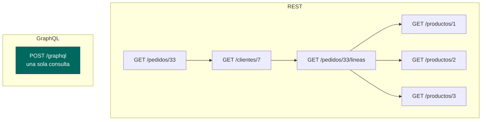

# GraphQL: cuando REST se queda corto

> REST es el estándar y lo seguirá siendo. Pero hay dos problemas que REST no resuelve bien, y GraphQL nació exactamente para eso. Saber cuándo **no** usarlo vale tanto como saber usarlo.

## 1. Los dos problemas de REST

**Over-fetching.** La app móvil necesita el nombre y la foto de un producto. `GET /api/v1/productos/42` devuelve 25 campos: descripción larga, historial de precios, datos del vendedor… Se descargan 4 KB para usar 60 bytes. En una lista de 50 productos, con datos móviles, se nota.

**Under-fetching (el problema N+1 del cliente).** Para pintar la pantalla de un pedido hacen falta el pedido, su cliente, cada línea y el producto de cada línea. Con REST: 1 + 1 + 1 + N llamadas. Cada una con su latencia.



La solución clásica en REST es un **endpoint agregador** (`/api/v1/pedidos/33/pantalla`) hecho a medida de esa vista. Funciona, y es lo que se hace en el 90 % de los casos. GraphQL generaliza esa idea: que sea el **cliente** quien declare qué campos quiere.

## 2. La idea en un minuto

Un solo endpoint, `POST /graphql`, y un **esquema tipado** que define qué se puede pedir.

```graphql title="src/main/resources/graphql/schema.graphqls"
type Producto {
    id: ID!
    nombre: String!
    precio: Float!
    categoria: String!
    vendedor: Vendedor
}

type Vendedor {
    id: ID!
    nombre: String!
    valoracion: Float
}

type Query {
    producto(id: ID!): Producto
    productos(categoria: String, limite: Int = 20): [Producto!]!
}

type Mutation {
    crearProducto(entrada: CrearProductoInput!): Producto!
}

input CrearProductoInput {
    nombre: String!
    categoria: String!
    precio: Float!
}
```

El cliente pide **exactamente** lo que necesita:

```graphql
query {
  producto(id: 42) {
    nombre
    precio
    vendedor { nombre }
  }
}
```

Y recibe exactamente eso, con la misma forma:

```json
{ "data": { "producto": { "nombre": "Patinete", "precio": 299.0,
                          "vendedor": { "nombre": "Ana" } } } }
```

El `!` significa «no nulo». `[Producto!]!` es una lista no nula de elementos no nulos.

## 3. En Spring Boot

```xml title="pom.xml"
<dependency>
    <groupId>org.springframework.boot</groupId>
    <artifactId>spring-boot-starter-graphql</artifactId>
</dependency>
```

El esquema va en `src/main/resources/graphql/schema.graphqls`. Los resolutores son un controlador más:

``` { .java .numerado }
@Controller
public class ProductoGraphQlControlador {

    private final ProductoServicio servicio;

    public ProductoGraphQlControlador(ProductoServicio servicio) {
        this.servicio = servicio;
    }

    @QueryMapping
    public Producto producto(@Argument Integer id) {
        return servicio.obtener(id);
    }

    @QueryMapping
    public List<Producto> productos(@Argument String categoria, @Argument Integer limite) {
        return servicio.buscar(categoria).stream().limit(limite).toList();
    }

    @MutationMapping
    public Producto crearProducto(@Argument("entrada") CrearProductoDto entrada) {
        return servicio.crear(mapper.aModelo(entrada));
    }

    /** Resolutor de campo: solo se ejecuta si el cliente pide 'vendedor'. */
    @SchemaMapping(typeName = "Producto", field = "vendedor")
    public Vendedor vendedor(Producto producto) {
        return vendedorServicio.obtener(producto.vendedorId());
    }
}
```

Fíjate en `@SchemaMapping`: **el resolutor de campo solo se ejecuta si el cliente pidió ese campo**. Ahí está la magia y también el peligro.

```yaml title="src/main/resources/application.yml"
spring:
  graphql:
    graphiql:
      enabled: true      # consola interactiva en /graphiql
    schema:
      printer:
        enabled: true
```

## 4. El problema N+1, que ahora es tuyo

Si el cliente pide 50 productos con su vendedor, tu resolutor de campo se ejecuta **50 veces**. Has movido el N+1 del cliente al servidor.

La solución son los *data loaders*, que agrupan las peticiones de un mismo ciclo en una sola:

```java
@BatchMapping(typeName = "Producto", field = "vendedor")
public Map<Producto, Vendedor> vendedores(List<Producto> productos) {
    var ids = productos.stream().map(Producto::vendedorId).toList();
    var porId = vendedorServicio.buscarPorIds(ids).stream()
            .collect(Collectors.toMap(Vendedor::id, v -> v));
    return productos.stream()
            .collect(Collectors.toMap(p -> p, p -> porId.get(p.vendedorId())));
}
```

Una consulta en vez de cincuenta. **Un GraphQL sin `@BatchMapping` es una bomba de relojería en producción.**

## 5. Lo que se pierde al dejar REST

| | REST | GraphQL |
|---|---|---|
| Caché HTTP | Nativa: `GET` + `ETag` + CDN | Se pierde: todo es `POST` a una URL |
| Códigos de estado | 200/201/404/409 con significado | **Siempre 200**, los errores van en el cuerpo |
| Curva de aprendizaje | Baja | Media |
| Documentación | OpenAPI, que hay que mantener | El esquema **es** la documentación |
| Riesgo | Endpoints de más | Consultas maliciosamente profundas |

Ese «siempre 200» es lo que más choca: en GraphQL una consulta que falla devuelve `200` con un array `errors`. Los monitores que cuentan 5xx no ven nada.

!!! danger "Consultas maliciosas"
    Nada impide pedir `producto { vendedor { productos { vendedor { productos { … } } } } }` anidado veinte niveles y tumbar el servidor. En producción **hay que limitar** la profundidad y la complejidad:
    ```yaml
    spring:
      graphql:
        schema:
          inspection:
            enabled: true
    ```
    y añadir un `MaxQueryDepthInstrumentation`. En REST este problema no existe.

## 6. Cuándo usar cada cosa

**REST** por defecto: API pública, terceros, caché importante, operaciones con semántica clara de recurso.

**GraphQL** cuando: hay muchos clientes distintos con necesidades distintas (web, móvil, TV), las pantallas agregan datos de muchas entidades, y el equipo de front cambia de requisitos a menudo.

**Los dos a la vez** es perfectamente normal: REST para lo público y GraphQL para la app propia.

---

## Pruébalo ahora (30 min)

!!! reto "Trabaja tú ahora"
    Este bloque se hace **en clase, en tu equipo**. No se entrega ni puntúa: es la práctica que hace que el examen te salga.

**Parte 1.** Añade el *starter*, crea `schema.graphqls` con `Producto`, `Query.producto` y `Query.productos`, y el controlador con `@QueryMapping`. Arranca y abre `http://localhost:8080/graphiql`.

**Parte 2 — Comprueba el *over-fetching*.** En GraphiQL, ejecuta las dos consultas y compara el tamaño de la respuesta:

```graphql
query { producto(id: 1) { nombre } }
query { producto(id: 1) { id nombre precio categoria stock } }
```

**Parte 3 — Desde consola**, para ver que no hay magia:

```bash
curl -s localhost:8080/graphql -H "Content-Type: application/json" \
  -d '{"query":"{ productos(limite:3) { nombre precio } }"}' | jq
```

**Parte 4 — Provoca el N+1.** Añade el resolutor de campo `vendedor` con un `log.info` dentro, pide 10 productos con su vendedor y **cuenta las líneas del log**. Después cámbialo por `@BatchMapping` y vuelve a contar.

**Parte 5 — Rompe algo.** Pide un campo que no existe en el esquema y observa que devuelve **200** con un array `errors`. Esa es la diferencia más importante con REST.

---

## Ejercicios (con solución)

### Ejercicio 1 — Over-fetching y under-fetching
Explica cada uno con un ejemplo de la TiendaAPI y di cómo lo resolverías **sin** GraphQL.

??? success "Solución"

    <b>Over-fetching:</b> el listado del móvil solo necesita nombre y precio, pero <code>GET /productos</code> devuelve todos los campos. Sin GraphQL se resuelve con un <b>DTO resumido</b> y un endpoint <code>/productos?vista=resumen</code>, o con dos DTO distintos.<br>
    <b>Under-fetching:</b> la pantalla de pedido necesita 4 recursos. Sin GraphQL, un <b>endpoint agregador</b> <code>/pedidos/33/pantalla</code> que devuelva el DTO compuesto.<br>
    La conclusión que se busca: <b>los dos problemas tienen solución en REST</b>. GraphQL compensa cuando esas soluciones a medida se multiplican por cada pantalla y cada cliente.


### Ejercicio 2 — Escribe el esquema
Modela `Pedido` con su cliente y sus líneas, y una consulta que devuelva un pedido por id.

??? success "Solución"

    ```graphql
    type Cliente { id: ID!  nombre: String!  email: String }
    type Producto { id: ID!  nombre: String!  precio: Float! }
    type Linea { producto: Producto!  unidades: Int!  importe: Float! }
    type Pedido {
        id: ID!
        fecha: String!
        estado: String!
        total: Float!
        cliente: Cliente!
        lineas: [Linea!]!
    }
    type Query { pedido(id: ID!): Pedido }
    ```
    Detalles que se puntúan: `[Linea!]!` (ni la lista ni sus elementos son nulos), `cliente: Cliente!` obligatorio frente a `email: String` opcional, e `importe` como campo **calculado** que resolverá el servidor.


### Ejercicio 3 — El N+1
¿Por qué `@SchemaMapping` puede ser un problema y cómo se arregla?

??? success "Solución"

    Porque se ejecuta <b>una vez por elemento</b>: pedir 50 productos con su vendedor son 50 consultas. Se arregla con <code>@BatchMapping</code>, que recibe la lista completa y devuelve un <code>Map</code>, resolviendo todo en una sola consulta. Es el mismo problema N+1 de las bases de datos, trasladado a la capa de API.


### Ejercicio 4 — Códigos de estado
Un cliente pide un producto que no existe. ¿Qué devuelve REST y qué devuelve GraphQL?

??? success "Solución"

    <b>REST:</b> <code>404</code> con un ProblemDetail. <b>GraphQL:</b> <code>200 OK</code> con <code>{"data":{"producto":null},"errors":[{...}]}</code>.<br>
    Consecuencia práctica: los proxies, las cachés y los paneles de monitorización que se guían por el código HTTP <b>no ven el error</b>. Hay que instrumentar aparte. Es el precio de tener un único endpoint.


### Ejercicio 5 — Decide
Para cada caso, REST o GraphQL: (a) API pública de una administración · (b) app móvil propia con 30 pantallas · (c) webhook de una pasarela de pago · (d) panel interno que cruza cinco entidades · (e) descarga de un informe en PDF.

??? success "Solución"

    (a) <b>REST</b>: terceros, caché, estabilidad y documentación estándar. (b) <b>GraphQL</b>: muchas pantallas con necesidades distintas y un front que itera rápido. (c) <b>REST</b>: lo impone el proveedor, y además es una llamada entrante. (d) <b>GraphQL</b>, o un agregador REST si es la única pantalla así. (e) <b>REST</b>: GraphQL devuelve JSON; un binario se sirve por HTTP normal.

