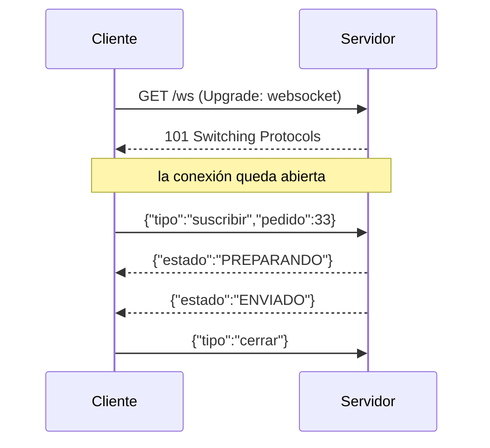
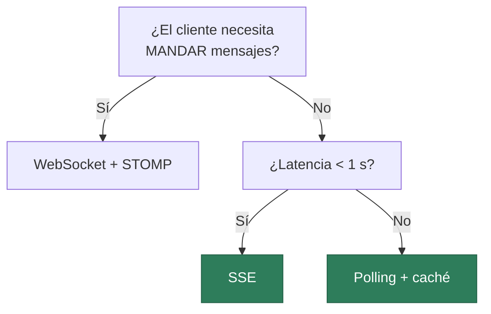

# WebSockets: cuando el servidor tiene que hablar primero

> Con HTTP, el servidor solo habla cuando se le pregunta. Para un chat, un marcador en directo o una notificación, eso obliga a preguntar sin parar. WebSocket invierte la relación.

## 1. El problema

Quieres mostrar el estado de un pedido en tiempo real. Con HTTP tienes tres opciones malas y una buena:

| Técnica | Cómo funciona | Coste |
|---|---|---|
| **Polling** | El cliente pregunta cada 5 s | 720 peticiones/hora por usuario, casi todas para nada |
| **Long polling** | El servidor deja la petición abierta hasta que hay novedad | Mantiene un hilo por cliente esperando |
| **SSE** | Canal HTTP unidireccional servidor → cliente | :material-check: Simple, si solo el servidor habla |
| **WebSocket** | Conexión permanente **bidireccional** | :material-check: Cuando hablan los dos |



Ese **101 Switching Protocols** es la clave: se empieza con una petición HTTP normal y, a partir de ahí, el mismo socket TCP se usa para mandar mensajes en ambos sentidos sin cabeceras ni peticiones nuevas.

## 2. SSE, la opción que casi siempre basta

Antes de sacar WebSockets, plantéate si el cliente necesita hablar. Si solo recibe —notificaciones, marcador, progreso de una tarea— **Server-Sent Events** es HTTP normal, atraviesa proxies sin problemas y se reconecta solo.

```java
@GetMapping(value = "/api/v1/pedidos/{id}/estado", produces = MediaType.TEXT_EVENT_STREAM_VALUE)
public SseEmitter estado(@PathVariable Integer id) {
    var emitter = new SseEmitter(Duration.ofMinutes(30).toMillis());
    servicio.suscribir(id, estado -> {
        try {
            emitter.send(SseEmitter.event().name("estado").data(estado));
        } catch (IOException e) {
            emitter.completeWithError(e);
        }
    });
    return emitter;
}
```

```javascript
const es = new EventSource('/api/v1/pedidos/33/estado');
es.addEventListener('estado', e => console.log(JSON.parse(e.data)));
```

Sin dependencias, sin protocolo nuevo, y con reconexión automática de regalo.

## 3. WebSocket con STOMP en Spring

Cuando hacen falta los dos sentidos —un chat—, Spring usa **STOMP** sobre WebSocket: un protocolo de mensajería sencillo con destinos, parecido a los *topics* de una cola.

```xml title="pom.xml"
<dependency>
    <groupId>org.springframework.boot</groupId>
    <artifactId>spring-boot-starter-websocket</artifactId>
</dependency>
```

```java
@Configuration
@EnableWebSocketMessageBroker
public class WebSocketConfig implements WebSocketMessageBrokerConfigurer {

    @Override
    public void registerStompEndpoints(StompEndpointRegistry registry) {
        registry.addEndpoint("/ws")
                .setAllowedOriginPatterns("http://localhost:*")
                .withSockJS();                     // respaldo si no hay WebSocket
    }

    @Override
    public void configureMessageBroker(MessageBrokerRegistry config) {
        config.enableSimpleBroker("/tema");        // por donde SALEN los mensajes
        config.setApplicationDestinationPrefixes("/app");  // por donde ENTRAN
    }
}
```

``` { .java .numerado }
@Controller
public class ChatControlador {

    private final SimpMessagingTemplate mensajeria;

    public ChatControlador(SimpMessagingTemplate mensajeria) {
        this.mensajeria = mensajeria;
    }

    public record Mensaje(String autor, String texto, Instant momento) {}

    /** Llega a /app/chat.sala1 y se reenvía a todos los suscritos a /tema/sala1 */
    @MessageMapping("/chat.{sala}")
    @SendTo("/tema/{sala}")
    public Mensaje recibir(@DestinationVariable String sala, Mensaje entrante) {
        return new Mensaje(entrante.autor(), entrante.texto(), Instant.now());
    }

    /** Desde cualquier servicio se puede empujar sin que nadie pregunte */
    public void avisarCambioDeEstado(Integer pedidoId, String estado) {
        mensajeria.convertAndSend("/tema/pedidos/" + pedidoId,
                Map.of("estado", estado, "momento", Instant.now()));
    }
}
```

Cliente:

```javascript
const cliente = new StompJs.Client({ brokerURL: 'ws://localhost:8080/ws' });
cliente.onConnect = () => {
    cliente.subscribe('/tema/sala1', m => pintar(JSON.parse(m.body)));
    cliente.publish({ destination: '/app/chat.sala1',
                      body: JSON.stringify({ autor: 'Ana', texto: 'hola' }) });
};
cliente.activate();
```

## 4. Lo que nadie cuenta hasta que falla

**El estado vuelve.** Una conexión abierta **es** estado en el servidor. Con dos instancias detrás de un balanceador, un usuario conectado a la instancia A no recibe lo que publica la instancia B. Solución: un *broker* externo (Redis, RabbitMQ) en vez de `enableSimpleBroker`.

**La autenticación es distinta.** El navegador **no** deja poner cabeceras en el *handshake* de WebSocket, así que no puedes enviar `Authorization: Bearer`. Las salidas habituales: mandar el token en la trama STOMP `CONNECT`, o pasarlo como parámetro de la URL —con el riesgo de que quede en los logs—.

**Los hilos virtuales lo cambian todo.** Mantener 10.000 conexiones abiertas era caro con hilos de plataforma. Con los hilos virtuales de Java 21+ deja de ser el cuello de botella.

!!! warning "Piensa si de verdad lo necesitas"
    Un marcador que se actualiza cada 30 segundos **no** necesita WebSocket: con *polling* cada 30 s y una caché estás resuelto, y te ahorras el estado, el *broker* y el problema de autenticación. Reserva WebSocket para cuando la latencia importe de verdad y hablen los dos lados.

## 5. Elegir



---

## Pruébalo ahora (30 min)

!!! reto "Trabaja tú ahora"
    Este bloque se hace **en clase, en tu equipo**. No se entrega ni puntúa: es la práctica que hace que el examen te salga.

**Parte 1 — SSE primero.** Expón `GET /api/v1/reloj` que emita la hora cada segundo y consúmelo:

```bash
curl -N localhost:8080/api/v1/reloj
```
El `-N` desactiva el búfer: verás llegar los eventos uno a uno. Eso es *streaming* de verdad.

**Parte 2 — Chat con WebSocket.** Monta la configuración y el controlador, y una página con `stomp.js` desde CDN. Ábrela en **dos pestañas** y escribe: el mensaje llega a la otra sin recargar.

**Parte 3 — Empuja desde el backend.** En el servicio de pedidos, tras cambiar el estado, llama a `convertAndSend("/tema/pedidos/33", …)`. Cambia el estado con un `curl` a tu API REST y comprueba que **la pestaña abierta se entera sin preguntar**. Ese es el momento en que se entiende para qué sirve.

**Parte 4 — Rompe la conexión.** Para el servidor con la pestaña abierta y observa la reconexión. Compara el comportamiento de SSE (se reconecta solo) con el de WebSocket (hay que gestionarlo).

---

## Ejercicios (con solución)

### Ejercicio 1 — Elige la técnica
(a) chat de soporte · (b) notificación de «tu pedido ha salido» · (c) cotización de bolsa cada 100 ms · (d) recuento de visitas actualizado cada minuto · (e) progreso de una subida de fichero.

??? success "Solución"

    (a) <b>WebSocket</b>: hablan los dos. (b) <b>SSE</b>: solo baja. (c) <b>WebSocket</b>: latencia crítica y volumen alto. (d) <b>Polling</b> con caché: un minuto no justifica nada más. (e) <b>SSE</b>, o incluso la propia respuesta HTTP en <i>streaming</i>.


### Ejercicio 2 — El 101
¿Qué significa `101 Switching Protocols` y por qué WebSocket empieza con una petición HTTP?

??? success "Solución"

    Significa que cliente y servidor acuerdan <b>cambiar de protocolo</b> sobre la conexión TCP ya establecida. Empieza como HTTP para poder atravesar la infraestructura existente —proxies, cortafuegos, balanceadores— y reutilizar el puerto 443 con TLS. Si empezara con un protocolo propio, media internet lo bloquearía.


### Ejercicio 3 — El fallo del escalado
Tu chat funciona en local y en producción los usuarios no se ven entre sí. ¿Qué pasa?

??? success "Solución"

    Hay <b>más de una instancia</b> detrás del balanceador y estás usando el <i>broker</i> en memoria (<code>enableSimpleBroker</code>). Los suscritos a la instancia A no reciben lo publicado en la B. Solución: un <i>broker</i> externo (RabbitMQ, ActiveMQ o Redis) con <code>enableStompBrokerRelay</code>, para que el estado de suscripción viva fuera de la aplicación. Es el mismo problema que las sesiones en memoria, con otro disfraz.


### Ejercicio 4 — Autenticación
No puedes mandar `Authorization: Bearer` en el <i>handshake</i>. ¿Qué haces?

??? success "Solución"

    El navegador no permite cabeceras propias al abrir un WebSocket. Opciones, de mejor a peor: (1) enviar el token en la trama STOMP <b>CONNECT</b> y validarlo en un <code>ChannelInterceptor</code>; (2) usar una cookie de sesión, que el navegador sí manda en el <i>handshake</i>; (3) pasarlo como parámetro de la URL, que es lo más fácil y lo peor, porque queda en los logs del servidor y del proxy.


### Ejercicio 5 — Diseña
Un panel de cocina de un restaurante: los camareros mandan comandas y la cocina las ve aparecer y las marca como listas. Diseña la solución completa.

??? success "Solución"

    <b>WebSocket + STOMP</b>, porque hablan los dos lados y la latencia importa.<br>
    Destinos: <code>/app/comanda.nueva</code> y <code>/app/comanda.lista</code> de entrada; <code>/tema/cocina</code> y <code>/tema/sala</code> de salida.<br>
    Claves de diseño: la comanda se <b>persiste por REST</b> y el WebSocket solo <b>notifica</b> —nunca uses el socket como única vía de escritura, porque si se cae se pierde el pedido—; al conectar, el cliente pide por REST el estado actual y a partir de ahí escucha; y con varias instancias, <i>broker</i> externo.

