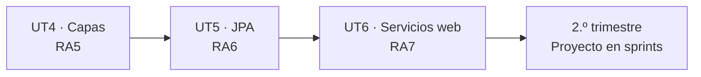

# Retos de la UT6

**Nueve enunciados: tres de WebSockets, tres de GraphQL y tres de documentación.** Los dos primeros de cada bloque se construyen en clase; el tercero se entrega.

| Bloque | Resueltos en clase | Que se entrega | Sesiones |
|---|---|---|:-:|
| **1 · WebSockets** | R1.1 · R1.2 | **R1.3** | S4–S5 |
| **2 · GraphQL** | R2.1 · R2.2 | **R2.3** | S8–S9 |
| **3 · Documentación** | R3.1 · R3.2 | **R3.3** | S12 |

!!! success "Todos se construyen sobre el proyecto de la UT5"
    No se empieza nada de cero. Cada reto es **una capa nueva** sobre la API que ya tienes, y la primera comprobación de cada rúbrica es siempre la misma:

    ```bash
    git diff --stat src/main/java/**/services/
    ```

    Si el servicio ha cambiado en algo más que un `publishEvent`, el reto está mal resuelto aunque funcione.

---

# Bloque 1 · WebSockets

## R1.1 · Notificador de funkos :material-check-circle:

> **Lo del [tema 4, parte I](04-proyecto-completo.md), paso a paso en clase.** Cada vez que se crea, actualiza o borra un funko, todos los clientes conectados se enteran.

**Lo que hay que construir:**

```
WS   /ws/v1/funkos         → {"entidad":"FUNKO","tipo":"CREATE","datos":{…},"fecha":"…"}
GET  /ws-test.html          → página de prueba con el log en pantalla
GET  /api/v1/ws/conectados  → cuántos clientes hay escuchando
```

**Lo que se discute mientras se escribe:**

| Pregunta | Respuesta |
|---|---|
| ¿`ArrayList` o `CopyOnWriteArraySet`? | La segunda: se recorre y se modifica desde hilos distintos |
| ¿Notificar desde el servicio o con un evento? | Evento, para poder usar `AFTER_COMMIT` |
| ¿Mandar la entidad o el DTO? | El DTO: estamos fuera de la transacción |
| ¿Qué pasa si un cliente se ha ido? | `try` dentro del bucle, o deja sin mensaje a los demás |

!!! reto "El micro-reto de la sesión, antes de explicar nada"
    *«Abrid dos pestañas de la página de prueba. Una de vosotros cierra la suya. El otro crea un funko. ¿Qué veis en el log del servidor? Cinco minutos.»*

    Lo que sale: `IllegalStateException: The WebSocket session has been closed`. Y a partir de ahí se explica por qué hay que quitar la sesión en tres sitios distintos.

## R1.2 · Panel de stock en tiempo real :material-check-circle:

> **Con la mitad escrita.** Se te da el `handler` y el notificador funcionando; tú escribes **los eventos filtrados y el canal por categoría**.

```
WS   /ws/v1/stock                    → solo cambios de cantidad
WS   /ws/v1/funkos/categoria/{nombre} → solo los de esa categoría
```

**Lo que se te da** ✅ **· lo que escribes** ⬜

```
websockets/
├── FunkosWebSocketHandler.java        ✅
├── FunkosNotificador.java             ✅
├── StockWebSocketHandler.java         ⬜ TODO
├── CategoriaWebSocketHandler.java     ⬜ TODO  (con sesiones por categoría)
└── config/WebSocketConfig.java        ⬜ TODO  (registrar los tres, con patrón de ruta)
```

**Los requisitos:**

1. `/ws/v1/stock` solo notifica cuando **cambia la cantidad**, no cuando cambia el precio o el nombre. Hay que comparar el antes y el después.
2. `/ws/v1/funkos/categoria/ANIME` solo recibe los de ANIME. La categoría sale **de la URL**, así que hace falta leerla de la sesión.
3. Cuando el stock llega a **0**, el mensaje lleva `"alerta": true`.
4. `GET /api/v1/ws/conectados` devuelve el recuento **por canal**.

!!! reto "La dificultad: sesiones agrupadas y la ruta variable"
    ```java
    private final Map<String, Set<WebSocketSession>> porCategoria = new ConcurrentHashMap<>();

    @Override
    public void afterConnectionEstablished(WebSocketSession session) {
        var categoria = categoriaDeLaUri(session.getUri());
        porCategoria.computeIfAbsent(categoria, k -> new CopyOnWriteArraySet<>())
                    .add(session);
    }

    private String categoriaDeLaUri(URI uri) {
        var partes = uri.getPath().split("/");
        return partes[partes.length - 1].toUpperCase();
    }
    ```

    Es el `computeIfAbsent` de la [UT2, E17](../ut2/ejercicios.md) con la colección interna concurrente.

    Y el punto 1 obliga a que el evento lleve **el estado anterior**:

    ```java
    public record FunkoCambiadoEvent(Tipo tipo, FunkoResponse funko,
                                     FunkoResponse anterior) {}
    ```

    Porque «ha cambiado la cantidad» no se puede saber mirando solo el resultado.

## R1.3 · El que entregas :material-upload:

> **Elige uno de los tres y constrúyelo sobre tu proyecto.** En pareja.

=== "A · Sala de subastas"

    **Pujas en tiempo real sobre un artículo.**

    ```
    WS   /ws/v1/subastas/{id}      bidireccional: el cliente PUJA por aquí
    POST /api/v1/subastas          crear subasta con precio inicial y fin
    GET  /api/v1/subastas/{id}     estado actual
    ```

    **Requisitos:**

    - El cliente **manda** su puja por el WebSocket: `{"usuario":"ana","importe":45.00}`.
    - El servidor valida: **mayor que la puja actual**, subasta abierta, importe positivo. Si no, responde **solo a ese cliente** con un error.
    - Si es válida, hace *broadcast* a todos los de esa subasta: `{"tipo":"PUJA","importe":45.00,"usuario":"ana","pujas":12}`.
    - Al llegar la hora de fin, el servidor manda `{"tipo":"CERRADA","ganador":"ana","importe":45.00}` **sin que nadie pregunte** (con `@Scheduled`).
    - Las pujas se **persisten**: al reconectar, el cliente recibe el estado actual.

    **La dificultad:** es el único reto **de verdad bidireccional**, así que hay que implementar `handleTextMessage`, validar la entrada que llega por el socket (que no pasa por `@Valid`) y responder a un cliente concreto en lugar de a todos. Y la concurrencia importa: dos pujas simultáneas por el mismo importe tienen que resolverse de forma determinista.

=== "B · Chat de soporte"

    **Chat entre un usuario y un técnico, por salas.**

    ```
    WS   /ws/v1/chat/{salaId}
    POST /api/v1/salas              abrir sala
    POST /api/v1/salas/{id}/cerrar
    GET  /api/v1/salas/{id}/mensajes  historial paginado
    ```

    **Requisitos:**

    - Mensajes bidireccionales, **persistidos** en una entidad `Mensaje`.
    - Al conectarse, el cliente recibe **los últimos 20 mensajes** de la sala.
    - `{"tipo":"ESCRIBIENDO","usuario":"ana"}` se reenvía a los demás **sin guardarse**.
    - `{"tipo":"ENTRA"}` y `{"tipo":"SALE"}` cuando alguien se conecta o desconecta.
    - Una sala **cerrada** rechaza mensajes nuevos.
    - `GET /api/v1/salas/{id}/mensajes` paginado, para el historial.

    **La dificultad:** hay **dos tipos de mensaje con comportamiento distinto** (los que se guardan y los efímeros), y hay que identificar **quién** es cada sesión para los avisos de entrada y salida. Eso significa guardar datos en `session.getAttributes()`, que es la primera vez que una sesión WebSocket tiene estado.

=== "C · Monitor de pedidos"

    **Panel de cocina de un restaurante.**

    ```
    WS   /ws/v1/cocina              todos los pedidos en curso
    WS   /ws/v1/pedidos/{id}        solo ese pedido (para el cliente)
    POST /api/v1/pedidos/{id}/estado
    ```

    **Requisitos:**

    - Dos canales con **mensajes distintos**: cocina ve todos los pedidos con sus líneas; el cliente ve solo el estado del suyo.
    - Cada cambio de estado (`RECIBIDO → PREPARANDO → LISTO → ENTREGADO`) notifica a **los dos canales**, con contenido distinto en cada uno.
    - El canal de cocina incluye **el tiempo que lleva cada pedido**, recalculado y reenviado cada 30 segundos con `@Scheduled`.
    - Un pedido que lleva más de 20 minutos se marca `"retrasado": true`.
    - Al conectarse a `/ws/v1/cocina`, se recibe **el estado completo** de los pedidos abiertos.

    **La dificultad:** un evento genera **dos mensajes diferentes** para dos audiencias, y el `@Scheduled` que reenvía los tiempos obliga a pensar qué pasa cuando no hay nadie conectado (respuesta: no hacer nada, y comprobarlo).

!!! success "Rúbrica del bloque 1 — sobre 10"
    | | Criterio | Puntos |
    |---|---|:-:|
    | 1 | **El servicio no cambia** más que para publicar eventos | **2,0** |
    | 2 | Colección de sesiones **concurrente** y limpiada en los tres sitios | 1,5 |
    | 3 | `try` por sesión: un cliente roto no afecta a los demás | 1,5 |
    | 4 | **`AFTER_COMMIT`**: un 409 o un 400 no notifican nada | 1,5 |
    | 5 | Se manda el **DTO**, no la entidad | 1,0 |
    | 6 | `setAllowedOrigins` configurado, sin comodín | 1,0 |
    | 7 | Los requisitos funcionales del enunciado | 1,5 |
    | 8 | Un test que compruebe que la notificación llega | 1,0 |

---

# Bloque 2 · GraphQL

## R2.1 · Consultas y mutaciones de funkos :material-check-circle:

> **Lo del [tema 4, parte II](04-proyecto-completo.md), paso a paso en clase.** El esquema, el controlador y el `@BatchMapping`.

**Lo que se discute mientras se escribe:**

| Pregunta | Respuesta |
|---|---|
| ¿`[Funko]` o `[Funko!]!`? | La segunda: ni la lista ni los elementos son `null` |
| ¿Por qué 101 consultas? | El N+1 de GraphQL: un resolutor por elemento |
| ¿Cómo se arregla? | `@BatchMapping`, no `JOIN FETCH` |
| ¿Qué código HTTP devuelve un error? | **200.** Los errores van en `errors` |
| ¿Hay que tocar el servicio? | **No.** Cuatro métodos de fontanería |

!!! reto "El micro-reto de la sesión"
    *«Pedid `{ funkos { contenido { nombre categoria { nombre } } } }` con `show-sql=true`. Contad las consultas del log. Después pedid solo `{ funkos { contenido { nombre } } }` y contadlas otra vez. Cinco minutos.»*

    Lo que sale: 7 consultas frente a 1. Y la pregunta siguiente se responde sola: **el cliente decide el coste de tu consulta**, que es la diferencia fundamental con REST.

## R2.2 · GraphQL del instituto :material-check-circle:

> **Con el esquema escrito y los resolutores en huecos.** Sobre el modelo de alumnos, módulos y matrículas de la [UT5, reto 2](../ut5/retos.md).

```graphql title="schema.graphqls — se te da completo"
type Alumno {
    id: ID!
    nombre: String!
    dni: String!
    matriculas: [Matricula!]!
    expediente: Expediente!
}

type Modulo {
    id: ID!
    nombre: String!
    curso: Int!
    prerrequisitos: [Modulo!]!
    alumnos(curso: String): [Alumno!]!
}

type Matricula {
    id: ID!
    alumno: Alumno!
    modulo: Modulo!
    curso: String!
    nota: Float
    aprobada: Boolean!
}

type Expediente {
    matriculados: Int!
    aprobados: Int!
    suspensos: Int!
    pendientes: Int!
    media: Float
}

type Query {
    alumnos(nombre: String, pagina: Int = 0, tamano: Int = 20): [Alumno!]!
    alumnoById(id: ID!): Alumno
    modulos(curso: Int): [Modulo!]!
}

type Mutation {
    matricular(alumnoId: ID!, moduloId: ID!, curso: String!): Matricula!
    ponerNota(matriculaId: ID!, nota: Float!): Matricula!
    desmatricular(matriculaId: ID!): Boolean!
}
```

**Lo que escribes:**

- Los `@QueryMapping` y `@MutationMapping`, llamando a los servicios de la UT5.
- **Cuatro `@BatchMapping`**: `Alumno.matriculas`, `Matricula.modulo`, `Matricula.alumno` y `Modulo.alumnos`.
- `@SchemaMapping` para los campos calculados: `Matricula.aprobada` y `Alumno.expediente`.
- El `DataFetcherExceptionResolver` que traduce tus excepciones.
- Límites de profundidad y complejidad.

!!! reto "La dificultad: la recursión que GraphQL permite"
    ```graphql
    {
      alumnos {
        matriculas {
          modulo {
            alumnos {
              matriculas {
                modulo { nombre }
              }
            }
          }
        }
      }
    }
    ```

    **Esto es legal con tu esquema**, y puede tumbar el servidor. En REST no existe: cada endpoint tiene un coste fijo.

    ```java
    @Bean
    public GraphQlSourceBuilderCustomizer limites() {
        return builder -> builder.configureGraphQl(graphQl ->
                graphQl.instrumentation(List.of(
                        new MaxQueryDepthInstrumentation(8),
                        new MaxQueryComplexityInstrumentation(300))));
    }
    ```

    Y lo otro: con cuatro `@BatchMapping` bien puestos, incluso esa consulta se resuelve en **un número fijo y pequeño** de consultas SQL, porque cada nivel se agrupa.

    Parte del reto es **medirlo**: ejecutar la consulta anidada y contar el SQL antes y después de los `@BatchMapping`.

## R2.3 · El que entregas :material-upload:

> **Elige uno de los tres.** Sobre el dominio de tu [reto 3 de la UT5](../ut5/retos.md).

=== "A · API GraphQL completa de tu dominio"

    **El esquema entero del dominio que elegiste en la UT5**, con las tres entidades.

    **Requisitos:**

    - **Queries** para las tres entidades, con filtros, paginación y campos anidados en las dos direcciones.
    - **Mutaciones** para todas las operaciones de escritura, incluidas las de negocio (no solo CRUD).
    - **`@BatchMapping` en todas las relaciones**, medido con `show-sql=true`.
    - **Al menos dos campos calculados** con `@SchemaMapping` que no existan en la entidad.
    - Las excepciones de tu dominio traducidas a `ErrorType` con mensajes útiles.
    - Límites de profundidad y complejidad, e introspección apagada en `prod`.
    - Tests con `GraphQlTester`: tres de consulta, dos de mutación, dos de error.

    **Lo que se mide en la defensa:** se pide una consulta anidada a tres niveles y **se cuentan las consultas SQL**. Con los `@BatchMapping` bien puestos, el número no debe crecer con la cantidad de datos.

=== "B · GraphQL con suscripciones"

    **Lo mismo que en A, pero el núcleo es el tiempo real.**

    ```graphql
    type Subscription {
        entidadCambiada(tipo: String): Notificacion!
        contadorEnVivo: Estadisticas!
    }
    ```

    **Requisitos:**

    - Las queries y mutaciones básicas (menos exhaustivas que en A).
    - **`subscription` con filtro por argumento**: `entidadCambiada(tipo: "CREATE")` solo recibe las creaciones.
    - **`contadorEnVivo`** emite estadísticas agregadas **cada 5 segundos**, con `Flux.interval`.
    - El mismo `ApplicationEvent` alimenta **la suscripción GraphQL y el WebSocket del bloque 1**.
    - Comprobar que **cerrar el navegador cancela la suscripción** y libera el `Flux`.
    - Tests de suscripción con `GraphQlTester` y `StepVerifier`.

    **La dificultad:** el `Sinks.Many` y los `Flux` son programación reactiva, que no se ha dado. Es el reto más difícil de los tres, y a cambio es el que enseña por qué `spring-boot-starter-webflux` aparece entre las dependencias de GraphQL.

    Y lo importante: **un `Flux` que nadie cancela es una fuga de memoria**. Hay que comprobarlo.

=== "C · GraphQL frente a REST, medido"

    **Las dos APIs sobre el mismo servicio, y un informe con datos.**

    **Requisitos:**

    - La API GraphQL de tu dominio (nivel de A, pero con dos entidades en vez de tres).
    - Un **cliente HTML** que pinte la misma pantalla **dos veces**: una llamando a REST y otra a GraphQL.
    - Medir y documentar, para tres pantallas distintas:

    | | REST | GraphQL |
    |---|---|---|
    | Peticiones HTTP | ? | 1 |
    | Bytes transferidos | ? | ? |
    | Consultas SQL | ? | ? |
    | Tiempo hasta pintar | ? | ? |

    - Un **`README.md` con las conclusiones**: en qué pantalla gana cada uno y por qué.
    - Probar también el caso en que **REST gana**: una pantalla que pide un recurso completo y se beneficia de la caché HTTP.

    **La dificultad no es técnica, es de criterio.** Hay que diseñar tres pantallas donde el resultado sea distinto y **explicar la causa**, no solo medir. Es el reto para quien quiera entender cuándo *no* usar GraphQL.

!!! success "Rúbrica del bloque 2 — sobre 10"
    | | Criterio | Puntos |
    |---|---|:-:|
    | 1 | **El servicio no cambia**: los resolutores solo delegan | **2,0** |
    | 2 | Esquema correcto: `!`, `input`, tipos propios | 1,5 |
    | 3 | **`@BatchMapping` en todas las relaciones**, medido | **2,0** |
    | 4 | Mutaciones con validación, y las de negocio, no solo CRUD | 1,5 |
    | 5 | Excepciones traducidas a `ErrorType` con mensaje útil | 1,0 |
    | 6 | Límites de profundidad/complejidad e introspección apagada en `prod` | 1,0 |
    | 7 | Tests con `GraphQlTester`, incluidos los de error | 1,0 |

---

# Bloque 3 · Documentación y CORS

## R3.1 · Documentar la API de funkos :material-check-circle:

> **Lo del [tema 4, parte III](04-proyecto-completo.md).** CORS configurado por perfiles y OpenAPI con metadatos, endpoints y DTOs anotados.

**Lo que se discute mientras se escribe:**

| Pregunta | Respuesta |
|---|---|
| ¿Quién bloquea una petición por CORS? | **El navegador**, no tu servidor |
| ¿Por qué funciona con `curl` y no en el navegador? | `curl` no aplica la política del mismo origen |
| ¿Por qué hay un `OPTIONS` antes de cada POST? | El *preflight*: `Content-Type: application/json` ya lo dispara |
| ¿Se puede `allowedOrigins("*")` con credenciales? | **No.** El navegador lo rechaza, y a propósito |
| ¿Swagger en producción? | **Apagado.** Es un cliente HTTP completo |

!!! reto "El micro-reto de la sesión"
    *«Abrid este HTML desde `file://` o desde otro puerto y haced `fetch` a vuestra API. Leed el error de la consola. Después mirad el log del servidor. Cinco minutos.»*

    Lo que descubren: **el servidor responde 200**. La petición llegó, se procesó, se respondió — y el navegador tiró la respuesta. Es la mejor explicación de CORS que existe, y no la das tú.

## R3.2 · Documentación completa del instituto :material-check-circle:

> **Con la configuración puesta y las anotaciones en huecos.** Sobre el proyecto del instituto.

**Lo que escribes:**

- `@Operation` con `summary` y `description` en **todos** los endpoints.
- `@ApiResponses` con **todos** los códigos posibles de cada uno, incluidos los 409 de negocio.
- `@Parameter` con `description` y `example` en todos los parámetros.
- `@Schema` en todos los DTOs, con ejemplos realistas.
- Agrupación por `@Tag`, con descripciones.
- CORS por perfiles, con `exposedHeaders`.
- Un test que compruebe que `/v3/api-docs` se genera y contiene las rutas esperadas.

!!! reto "La dificultad: documentar lo que la herramienta no puede adivinar"
    `springdoc` deduce las rutas, los tipos y la obligatoriedad. **No puede deducir** que `POST /matriculas` devuelve 409 si el alumno no tiene los prerrequisitos aprobados.

    Y ese es justo el dato que necesita quien va a consumir tu API.

    ```java
    @ApiResponse(responseCode = "409",
        description = """
            Conflicto. Puede ser por:
            - El alumno ya está matriculado de ese módulo en ese curso
            - Faltan prerrequisitos aprobados (el mensaje dice cuáles)
            - El curso indicado está cerrado
            """)
    ```

    La prueba de que está bien hecho: **otra pareja usa tu API solo con la documentación**, sin preguntarte nada. En la S12 se hace eso literalmente, cruzando proyectos.

## R3.3 · El que entregas :material-upload:

> **Elige uno de los tres.**

=== "A · Documentación completa de tu API"

    **Toda la API de tu reto 3 de la UT5, documentada para que alguien la use sin preguntar.**

    **Requisitos:**

    - `@Operation`, `@ApiResponses` y `@Parameter` en **todos** los endpoints de las tres entidades.
    - `@Schema` con ejemplos realistas en **todos** los DTOs.
    - Los **409 de negocio documentados uno por uno**, diciendo en qué caso salta cada uno.
    - CORS por perfiles con `exposedHeaders`.
    - Swagger y `api-docs` **apagados en `prod`**, comprobado con un `curl`.
    - Un `README.md` con la URL de Swagger y tres ejemplos de `curl` que funcionen al copiar y pegar.
    - La colección de Postman **exportada desde el `/v3/api-docs`**, no hecha a mano.

    **La prueba de la defensa:** se le da tu Swagger a otra pareja y se les pide que hagan cinco operaciones, incluida una que provoque un 409. **Si tienen que preguntarte algo, falta documentación.**

=== "B · Cliente de otra API"

    **Consume la API de otra pareja usando solo su documentación.**

    **Requisitos:**

    - Documentar la tuya al nivel de A (es la mitad del trabajo).
    - Escribir un **cliente Java con `RestClient`** que consuma la API de otra pareja: listar, crear, provocar un error y manejarlo.
    - El cliente mapea las respuestas a **tus propios records**, no a los suyos.
    - Un **informe** de lo que faltaba en su documentación y lo que tuviste que adivinar o preguntar.
    - Tests del cliente con `MockRestServiceServer`, sin depender de que su servidor esté levantado.

    **La dificultad es la lección:** descubrir **desde el otro lado** qué hace útil una documentación. Casi todos los informes dicen lo mismo: faltan los códigos de error y faltan ejemplos con valores reales.

=== "C · Página de integración"

    **Una página web que consuma tus tres transportes a la vez.**

    **Requisitos:**

    - Documentar la API al nivel de A.
    - Una página HTML + JavaScript, **servida desde otro puerto** (así CORS es obligatorio de verdad), que:
        - Liste los datos con **REST** paginado, con botones de página.
        - Pinte un detalle con **GraphQL**, pidiendo solo los campos que muestra.
        - Se actualice en vivo por **WebSocket** cuando alguien cambie algo desde Postman.
    - Manejar los tres tipos de error: el 4xx de REST, el `errors` de GraphQL y la desconexión del WebSocket (con reintento).
    - CORS configurado para el puerto de la página, y **documentar en el README por qué hace falta**.

    **La dificultad:** los tres transportes a la vez obligan a entender **qué hace cada uno bien**, y la reconexión del WebSocket es la parte que nadie hace y siempre falta en producción.

!!! success "Rúbrica del bloque 3 — sobre 10"
    | | Criterio | Puntos |
    |---|---|:-:|
    | 1 | **Todos** los endpoints con `@Operation` y `@ApiResponses` completos | **2,0** |
    | 2 | Los **409 de negocio** documentados caso por caso | **2,0** |
    | 3 | DTOs con `@Schema` y ejemplos realistas | 1,5 |
    | 4 | CORS por perfiles, sin comodín, con `exposedHeaders` | 1,5 |
    | 5 | Swagger y `api-docs` apagados en `prod`, comprobado | 1,0 |
    | 6 | `README.md` con `curl` que funcionan al copiar | 1,0 |
    | 7 | Los requisitos propios de la variante elegida | 1,0 |

---

## Lo que se entrega, en los tres bloques

```
apellido1-apellido2-ut6/
├── README.md                       ← arrancar, Swagger, GraphiQL, WS, y 3 curl
├── pom.xml
├── Dockerfile · compose.yaml
├── .gitignore · .env.example
├── postman/coleccion.json          ← exportada del /v3/api-docs
├── graphql/consultas.md            ← las consultas de ejemplo
└── src/
    ├── main/java/…
    ├── main/resources/
    │   ├── graphql/schema.graphqls
    │   ├── static/ws-test.html
    │   └── application*.properties
    └── test/java/…
```

!!! danger "El criterio 1 de las tres rúbricas es el mismo, y vale 2 puntos"
    ```bash
    git diff --stat src/main/java/**/services/
    git diff --stat src/main/java/**/repositories/
    ```

    - **Servicios:** solo deben aparecer las líneas del `publishEvent`.
    - **Repositorios:** vacío.

    Si un bloque de la UT6 ha obligado a reescribir la lógica de negocio, lo que está mal **no es el reto: es la arquitectura de la UT4**. Y eso es exactamente lo que esta unidad mide.

!!! info "Cómo se defiende"
    Quince minutos por pareja, con el proyecto arrancado:

    1. **`git diff` de los servicios**, en pantalla.
    2. Tres peticiones REST (una correcta, un 404, un 409 de negocio).
    3. Una consulta GraphQL anidada **con el log de SQL visible**, contando las consultas.
    4. Un cambio desde Postman que **aparece solo** en la página del WebSocket.
    5. Swagger abierto, y después el mismo `curl` con el perfil `prod` devolviendo 404.

    La pregunta habitual: *«¿por qué este `@BatchMapping` y no un `JOIN FETCH`?»*. La segunda: *«¿qué pasa si la transacción falla después de notificar?»*.

---

## Y con esto se cierra el trimestre



En enero, el proyecto por sprints parte de lo que tienes aquí: **una API con capas, persistencia, tiempo real y documentada**. Lo que se añade es seguridad (UT8), despliegue (UT9) y el trabajo en equipo.

Si has llegado hasta aquí con los servicios limpios, el proyecto de enero es añadir funcionalidad. Si no, es rehacerlo con prisa y en grupo, que es el peor escenario posible.
