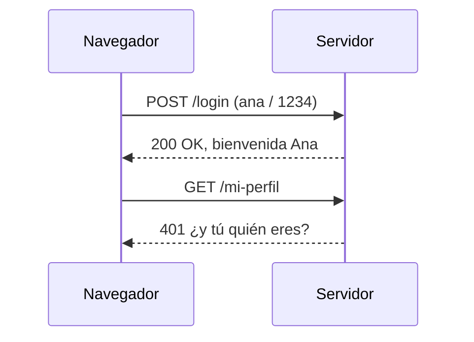
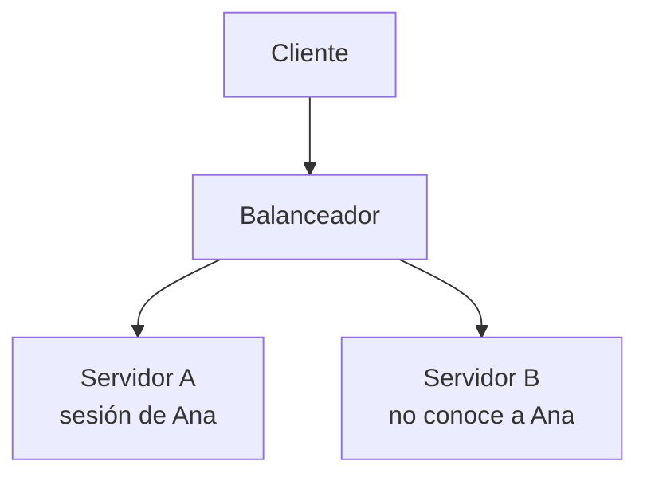

# El estado en la web

> HTTP no tiene memoria. Cada petición llega como si fuera la primera. Todo lo que en una web parece «recordar» algo —el carrito, el usuario conectado, el idioma— es un truco construido encima de esa amnesia.

## 1. El problema



El servidor no miente: **no lo sabe**. Entre las dos peticiones no ha guardado nada, y puede que ni siquiera sea la misma máquina la que atienda la segunda.

Las tres formas de resolverlo:

| Mecanismo | Dónde vive el dato | Quién lo envía |
|---|---|---|
| **Sesión de servidor** | En el servidor; el cliente solo lleva un identificador | El navegador, en una cookie, automáticamente |
| **Cookie** | En el cliente | El navegador, automáticamente |
| **Token** | En el cliente | El código JavaScript, explícitamente |

## 2. La sesión de servidor

El servidor crea un espacio de memoria por usuario y le da una llave: el `JSESSIONID`.

``` { .java .numerado }
@PostMapping("/login-web")
public String login(@RequestParam String usuario, HttpSession sesion) {
    sesion.setAttribute("usuario", usuario);
    sesion.setAttribute("carrito", new ArrayList<Linea>());
    return "redirect:/inicio";
}

@GetMapping("/mi-perfil")
public String perfil(HttpSession sesion, Model modelo) {
    var usuario = (String) sesion.getAttribute("usuario");
    if (usuario == null) return "redirect:/login";
    modelo.addAttribute("usuario", usuario);
    return "perfil";
}

@PostMapping("/logout-web")
public String logout(HttpSession sesion) {
    sesion.invalidate();          // se destruye entera
    return "redirect:/";
}
```

En Spring conviene usar `@SessionAttributes` cuando el dato es de un flujo concreto, en vez de manosear `HttpSession` a mano:

```java
@Controller
@SessionAttributes("carrito")
public class CarritoControlador {

    @ModelAttribute("carrito")
    public Carrito crearCarrito() { return new Carrito(); }

    @PostMapping("/carrito/lineas")
    public String anadir(@ModelAttribute("carrito") Carrito carrito,
                         @RequestParam Integer productoId) {
        carrito.anadir(productoId);
        return "redirect:/carrito";
    }
}
```

```yaml title="src/main/resources/application.yml"
server:
  servlet:
    session:
      timeout: 30m
      cookie:
        http-only: true
        secure: true
        same-site: lax
```

!!! danger "El carrito en un campo del `@Service`"
    Es el error que ya vimos en la UT4 y que aquí cobra sentido pleno: un `@Service` es **un único objeto compartido**. Si guardas ahí el carrito, todos los usuarios comparten el mismo. El estado de usuario va en la **sesión**, en el cliente o en la base de datos. Nunca en un bean.

## 3. Por qué la sesión no escala



La segunda petición de Ana puede caer en el servidor B, que no tiene su sesión. Tres salidas:

| Solución | Qué implica |
|---|---|
| *Sticky sessions* | El balanceador ata a cada usuario a un servidor. Si ese servidor cae, se pierde la sesión |
| Sesión compartida | Spring Session con Redis: la sesión vive fuera. Funciona bien, añade una pieza |
| **Sin estado** | El estado viaja con el cliente en un token. Es lo que hacen las APIs |

Y por eso una API REST es **stateless**: no porque sea más elegante, sino porque poner un segundo servidor no debería romper nada.

## 4. Qué guardar en cada sitio

| Dato | Dónde | Por qué |
|---|---|---|
| Usuario autenticado | Sesión (web) o token (API) | Es la identidad |
| Carrito de la compra | Sesión, o base de datos si debe sobrevivir | Volumen medio, temporal |
| Idioma y tema visual | Cookie | Pequeño, no sensible, lo necesita el servidor |
| Último filtro de una tabla | `localStorage` | Solo lo necesita el navegador |
| Datos personales | **Base de datos** | Nunca en el cliente |
| Precio de un producto | **Nunca en el cliente** | El cliente lo manipularía |

!!! warning "La regla de oro"
    **Nada que el cliente pueda modificar puede ser la fuente de la verdad.** Si el precio o el rol viajan en una cookie sin firmar, alguien los cambiará. El servidor recalcula siempre lo que importa.

---

## Pruébalo ahora (20 min)

!!! reto "Trabaja tú ahora"
    Este bloque se hace **en clase, en tu equipo**. No se entrega ni puntúa: es la práctica que hace que el examen te salga.

**Parte 1.** Crea `POST /demo/login-web` que guarde el usuario en sesión y `GET /demo/quien-soy` que lo devuelva. Con `curl` y una cookie jar:

```bash
curl -c galletas.txt -X POST "localhost:8080/demo/login-web?usuario=ana"
curl -b galletas.txt localhost:8080/demo/quien-soy      # → ana
cat galletas.txt | grep JSESSIONID
curl localhost:8080/demo/quien-soy                       # sin cookie → nadie
```

Ese fichero `galletas.txt` **es** lo que hace el navegador por ti.

**Parte 2 — Contador de sesión.** Un endpoint que incremente y devuelva un contador guardado en sesión. Pruébalo con dos *cookie jars* distintas y comprueba que cada una lleva su cuenta.

**Parte 3 — Caducidad.** Pon `timeout: 1m`, espera y vuelve a llamar. La sesión ha muerto.

**Parte 4 — El error clásico.** Guarda el contador en un campo del `@Service` en vez de en la sesión y repite la Parte 2 con dos *jars*. Verás las dos sesiones compartiendo número. Ese experimento vale por media clase de teoría.

---

## Ejercicios (con solución)

### Ejercicio 1 — ¿Dónde va cada dato?
(a) id del usuario conectado · (b) idioma preferido · (c) carrito · (d) rol ADMIN · (e) columna por la que ordena una tabla · (f) el total a pagar.

??? success "Solución"

    (a) sesión o token · (b) cookie · (c) sesión, o base de datos si debe sobrevivir al cierre del navegador · (d) <b>token firmado o sesión</b>, jamás en una cookie sin firmar · (e) <code>localStorage</code>, solo lo necesita el navegador · (f) <b>en ningún sitio del cliente</b>: se recalcula en el servidor en cada operación.


### Ejercicio 2 — El fallo del balanceador
Una web funciona con un servidor y al añadir el segundo los usuarios pierden la sesión aleatoriamente. Explica y da dos soluciones.

??? success "Solución"

    La sesión vive en la <b>memoria</b> del servidor que atendió el login; las peticiones que caen en el otro no la encuentran. Soluciones: (1) <b>sesión compartida</b> con Spring Session + Redis, que es la buena; (2) <i>sticky sessions</i> en el balanceador, que es un parche —si ese nodo cae, se pierde la sesión—; (3) pasar a <b>tokens</b> y eliminar el estado del servidor.


### Ejercicio 3 — Sesión o token
¿Por qué una API REST no debe usar `HttpSession`?

??? success "Solución"

    Porque rompe la restricción <b>sin estado</b> de REST y, en la práctica, porque impide escalar horizontalmente sin infraestructura adicional. Además, los clientes que no son navegadores —una app móvil, otro servicio— no gestionan cookies de forma natural. El token viaja con el cliente en cada petición y cualquier instancia puede validarlo sin consultar nada.


### Ejercicio 4 — Carrito compartido
Un alumno guarda el carrito en un campo del `@Service`. ¿Qué ocurre y por qué?

??? success "Solución"

    Que <b>todos los usuarios comparten el mismo carrito</b>: el bean es un singleton y hay un único objeto para toda la aplicación. Además hay condición de carrera, porque varios hilos lo modifican a la vez. Va en la sesión (<code>@SessionAttributes</code> o <code>HttpSession</code>) o, si debe sobrevivir, en base de datos.

