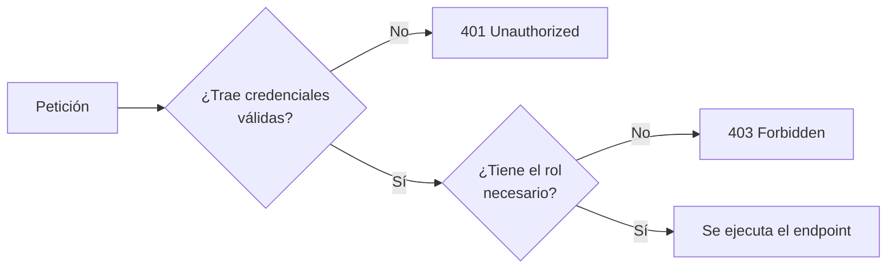
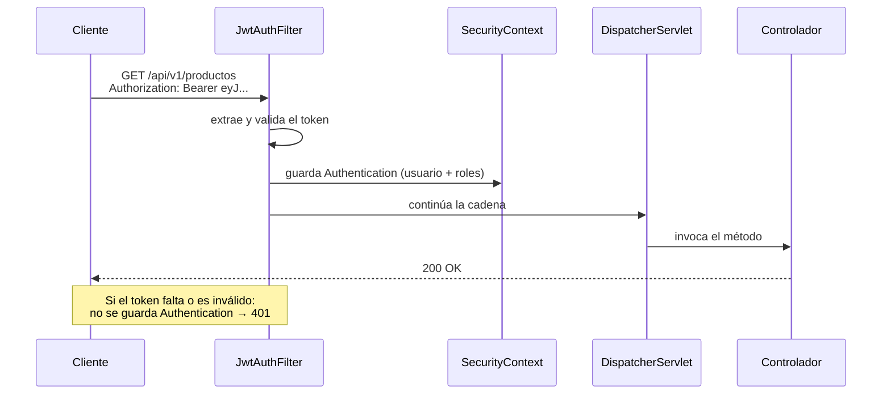

# Autenticación: Spring Security y JWT

> Este es el tema que más se pregunta en las entrevistas de backend y el que más rápido delata a quien copió el código sin entenderlo.

## 1. Autenticación vs autorización

- Autenticación (authn): ¿quién eres? → login, token, credenciales. Si falla: `401`.
- Autorización (authz): ¿puedes hacer esto? → roles y permisos. Si falla: `403`.



### Sesión vs token

|  | Sesión (cookie `JSESSIONID`) | Token (JWT) |
|---|---|---|
| Dónde vive el estado | En el **servidor** | En el **cliente** |
| Escalado horizontal | Requiere sesión compartida (Redis) o *sticky sessions* | Trivial: cualquier servidor valida el token |
| Clientes móviles / otras APIs | Incómodo | Natural |
| Revocación inmediata | Fácil (se borra la sesión) | Difícil: hay que llevar lista negra |
| CSRF | Vulnerable, hay que protegerse | No aplica si no se usan cookies |

Para una API REST **sin estado**, el token es la opción coherente. Por eso desactivamos CSRF y ponemos la política de sesión en `STATELESS`: no hay sesión que atacar.

## 2. La cadena de filtros

Spring Security es, en esencia, **una cadena de filtros servlet** delante de tu `DispatcherServlet`. Cada petición los recorre antes de llegar al controlador.



```xml title="pom.xml"
<dependency>
    <groupId>org.springframework.boot</groupId>
    <artifactId>spring-boot-starter-security</artifactId>
</dependency>
```

!!! warning "Nada más añadir la dependencia, tu API se cierra entera"
    Spring Security protege **todo** por defecto y genera una contraseña aleatoria que imprime en el arranque. Eso es una buena noticia: el valor por defecto es seguro. Ahora hay que abrir lo justo.

## 3. Usuarios, roles y contraseñas

```java
public record Usuario(Integer id, String username, String password, Set<String> roles) {}
```

**Nunca, jamás, en ninguna circunstancia se guarda una contraseña en claro.** Se guarda un *hash* con un algoritmo lento y con sal, como BCrypt.

```java
@Bean
public PasswordEncoder passwordEncoder() {
    return new BCryptPasswordEncoder(12);   // "coste" 12: ~250 ms por hash
}
```

```java
// al registrar
var hash = passwordEncoder.encode("secreta123");
// $2a$12$N9qo8uLOickgx2ZMRZoMye.IjZAgcfl7p92ldGxad68LJZdL17lhW

// al hacer login
boolean ok = passwordEncoder.matches("secreta123", hash);
```

Tres propiedades que debes saber explicar:

1. Es unidireccional
    : del hash no se puede volver a la contraseña.
2. Lleva sal incorporada: dos usuarios con la misma contraseña tienen hashes distintos, así que las rainbow tables no sirven.
3. Es deliberadamente lento: el coste configurable hace que probar millones de contraseñas por segundo sea inviable. Por eso no se usa MD5 ni SHA-256: son demasiado rápidos.

Spring Security necesita un `UserDetailsService` que le diga cómo buscar usuarios:

```java
@Service
public class UsuarioDetailsService implements UserDetailsService {

    private final UsuarioRepositorio repositorio;

    @Override
    public UserDetails loadUserByUsername(String username) {
        var u = repositorio.buscarPorUsername(username)
            .orElseThrow(() -> new UsernameNotFoundException("Usuario no encontrado"));

        return User.builder()
            .username(u.username())
            .password(u.password())              // el HASH, no la contraseña
            .roles(u.roles().toArray(String[]::new))   // "ADMIN" → autoridad ROLE_ADMIN
            .build();
    }
}
```

!!! tip "`ROLE_` es el prefijo mágico"
    `.roles("ADMIN")` crea internamente la autoridad `ROLE_ADMIN`. Por eso `hasRole("ADMIN")` funciona pero `hasAuthority("ADMIN")` no: esta última necesita el nombre completo, `hasAuthority("ROLE_ADMIN")`. Es la causa del 80 % de los 403 inexplicables.

## 4. El token JWT

Un JWT son **tres partes en Base64URL separadas por puntos**:

```text
eyJhbGciOiJIUzI1NiJ9 . eyJzdWIiOiJhbmEiLCJyb2xlcyI6WyJBRE1JTiJdLCJleHAiOjE3NzM0MDAwMDB9 . 4pQ8vHc...
└──── cabecera ────┘   └──────────────── payload ────────────────┘                        └─ firma ─┘
```

```
// cabecera
{ "alg": "HS256", "typ": "JWT" }
// payload (claims)
{ "sub": "ana", "roles": ["ADMIN"], "iat": 1773396400, "exp": 1773400000 }
```

!!! danger "El payload NO está cifrado, solo codificado"
    Cualquiera puede pegar tu token en [jwt.io](https://jwt.io) y leerlo entero. **Nunca metas dentro contraseñas, DNI, tarjetas ni datos personales sensibles.** Lo que la firma garantiza es la **integridad**: si alguien cambia `"roles":["USER"]` por `"roles":["ADMIN"]`, la firma deja de cuadrar y el token se rechaza. Confidencialidad ≠ integridad.

```xml title="pom.xml"
<dependency>
    <groupId>io.jsonwebtoken</groupId>
    <artifactId>jjwt-api</artifactId>
    <version>0.12.6</version>
</dependency>
<dependency>
    <groupId>io.jsonwebtoken</groupId>
    <artifactId>jjwt-impl</artifactId>
    <version>0.12.6</version>
    <scope>runtime</scope>
</dependency>
<dependency>
    <groupId>io.jsonwebtoken</groupId>
    <artifactId>jjwt-jackson</artifactId>
    <version>0.12.6</version>
    <scope>runtime</scope>
</dependency>
```

``` { .java .numerado }
@Service
public class JwtServicio {

    private final SecretKey clave;
    private final long duracionMs;

    public JwtServicio(@Value("${jwt.secreto}") String secreto,
                       @Value("${jwt.duracion-ms:3600000}") long duracionMs) {
        this.clave = Keys.hmacShaKeyFor(secreto.getBytes(StandardCharsets.UTF_8));
        this.duracionMs = duracionMs;
    }

    public String generar(UserDetails usuario) {
        var ahora = new Date();
        return Jwts.builder()
            .subject(usuario.getUsername())
            .claim("roles", usuario.getAuthorities().stream()
                                   .map(GrantedAuthority::getAuthority).toList())
            .issuedAt(ahora)
            .expiration(new Date(ahora.getTime() + duracionMs))
            .signWith(clave)
            .compact();
    }

    public String extraerUsuario(String token) {
        return parsear(token).getSubject();
    }

    public boolean esValido(String token, UserDetails usuario) {
        try {
            var claims = parsear(token);
            return claims.getSubject().equals(usuario.getUsername())
                && claims.getExpiration().after(new Date());
        } catch (JwtException | IllegalArgumentException e) {
            return false;     // firma inválida, caducado, malformado…
        }
    }

    private Claims parsear(String token) {
        return Jwts.parser().verifyWith(clave).build()
                   .parseSignedClaims(token).getPayload();
    }
}
```

```
jwt:
  secreto: ${JWT_SECRET:cambiaEstoEnProduccionPorAlgoLargoDeAlMenos32Bytes}
  duracion-ms: 3600000        # 1 hora
```

:material-alert: El secreto **fuera del repositorio**, en una variable de entorno. Con HS256 necesita al menos 32 bytes.

## 5. El filtro que valida cada petición

``` { .java .numerado }
@Component
public class JwtAuthFilter extends OncePerRequestFilter {

    private final JwtServicio jwtServicio;
    private final UserDetailsService userDetailsService;

    @Override
    protected void doFilterInternal(HttpServletRequest req, HttpServletResponse res,
                                    FilterChain chain) throws ServletException, IOException {

        String cabecera = req.getHeader("Authorization");

        if (cabecera == null || !cabecera.startsWith("Bearer ")) {
            // sin token: que decida la configuración de rutas
            chain.doFilter(req, res);
            return;
        }

        String token = cabecera.substring(7);
        try {
            String username = jwtServicio.extraerUsuario(token);

            if (username != null && SecurityContextHolder.getContext().getAuthentication() == null) {
                var usuario = userDetailsService.loadUserByUsername(username);
                if (jwtServicio.esValido(token, usuario)) {
                    var auth = new UsernamePasswordAuthenticationToken(
                        usuario, null, usuario.getAuthorities());
                    auth.setDetails(new WebAuthenticationDetailsSource().buildDetails(req));
                    SecurityContextHolder.getContext().setAuthentication(auth);
                }
            }
        } catch (Exception e) {
            SecurityContextHolder.clearContext();  // token corrupto: sigue como anónimo
        }
        chain.doFilter(req, res);
    }
}
```

Detalle importante: el filtro **no devuelve 401 por su cuenta**. Se limita a autenticar si puede; quien decide si esa ruta exige autenticación es la configuración de abajo. Así los endpoints públicos siguen funcionando aunque llegue un token basura.

### Login

``` { .java .numerado }
@RestController
@RequestMapping("/auth")
public class AuthControlador {

    private final AuthenticationManager authManager;
    private final JwtServicio jwtServicio;
    private final UserDetailsService userDetailsService;

    @PostMapping("/login")
    public LoginRespuesta login(@Valid @RequestBody LoginPeticion peticion) {
        try {
            authManager.authenticate(new UsernamePasswordAuthenticationToken(
                peticion.username(), peticion.password()));
        } catch (BadCredentialsException e) {
            throw new CredencialesInvalidasException("Usuario o contraseña incorrectos");
        }
        var usuario = userDetailsService.loadUserByUsername(peticion.username());
        return new LoginRespuesta(jwtServicio.generar(usuario), "Bearer", 3600);
    }

    @GetMapping("/yo")
    public Map<String, Object> yo(@AuthenticationPrincipal UserDetails usuario) {
        return Map.of("username", usuario.getUsername(),
                      "roles", usuario.getAuthorities());
    }
}

public record LoginPeticion(@NotBlank String username, @NotBlank String password) {}
public record LoginRespuesta(String token, String tipo, long expiraEn) {}
```

!!! warning "El mensaje de error, siempre genérico"
    Nunca respondas «ese usuario no existe» o «contraseña incorrecta» por separado: le estarías confirmando a un atacante qué usuarios existen (*user enumeration*). Un único mensaje: «Usuario o contraseña incorrectos».

## 6. La configuración que lo une todo

Esta clase es **el examen de la UT7 en una página**. Pincha en los números: cada uno es una decisión que hay que saber justificar.

``` { .java .numerado .annotate title="config/SecurityConfig.java" hl_lines="11 13 22 26" }
@Configuration
@EnableWebSecurity
@EnableMethodSecurity          // (1)!
public class SecurityConfig {

    private final JwtAuthFilter jwtAuthFilter;

    @Bean
    public SecurityFilterChain filterChain(HttpSecurity http) throws Exception {
        return http
            .csrf(csrf -> csrf.disable())                       // (2)!
            .cors(Customizer.withDefaults())
            .sessionManagement(s -> s.sessionCreationPolicy(SessionCreationPolicy.STATELESS))  // (3)!
            .authorizeHttpRequests(auth -> auth
                .requestMatchers("/auth/login", "/auth/registro").permitAll()
                .requestMatchers("/swagger-ui/**", "/v3/api-docs/**").permitAll()
                .requestMatchers(HttpMethod.GET, "/api/v1/productos/**").permitAll()
                .requestMatchers(HttpMethod.POST, "/api/v1/productos/**").hasRole("ADMIN")
                .requestMatchers(HttpMethod.PUT, "/api/v1/productos/**").hasRole("ADMIN")
                .requestMatchers(HttpMethod.DELETE, "/api/v1/productos/**").hasRole("ADMIN")  // (4)!
                .requestMatchers("/api/v1/pedidos/**").authenticated()
                .anyRequest().authenticated())                  // (5)!
            .exceptionHandling(e -> e
                .authenticationEntryPoint(this::sinAutenticar)  // (6)!
                .accessDeniedHandler(this::sinPermiso))         // (7)!
            .addFilterBefore(jwtAuthFilter, UsernamePasswordAuthenticationFilter.class)  // (8)!
            .build();
    }

    @Bean
    public AuthenticationManager authenticationManager(AuthenticationConfiguration cfg)
            throws Exception { return cfg.getAuthenticationManager(); }

    @Bean
    public PasswordEncoder passwordEncoder() { return new BCryptPasswordEncoder(12); }

    private void sinAutenticar(HttpServletRequest req, HttpServletResponse res,
                               AuthenticationException e) throws IOException {
        escribirProblema(res, HttpStatus.UNAUTHORIZED, "No autenticado",
                         "Falta el token o no es válido", req);
    }
    private void sinPermiso(HttpServletRequest req, HttpServletResponse res,
                            AccessDeniedException e) throws IOException {
        escribirProblema(res, HttpStatus.FORBIDDEN, "Sin permiso",
                         "No tienes permisos para esta operación", req);
    }
    private void escribirProblema(HttpServletResponse res, HttpStatus estado, String titulo,
                                  String detalle, HttpServletRequest req) throws IOException {
        res.setStatus(estado.value());
        res.setContentType("application/problem+json");
        res.getWriter().write("""
            {"title":"%s","status":%d,"detail":"%s","instance":"%s"}"""
            .formatted(titulo, estado.value(), detalle, req.getRequestURI()));
    }
}
```

1.  Habilita `@PreAuthorize` / `@PostAuthorize` **sobre los métodos**. La cadena de filtros protege por ruta; las anotaciones protegen por regla («solo el dueño del pedido o un admin»). Se necesitan las dos cosas: la ruta no sabe de quién es el pedido.

2.  **Desactivar CSRF solo se justifica si NO usas cookies.** Con JWT en la cabecera `Authorization`, el navegador no manda nada automáticamente, así que el ataque CSRF no aplica. En la UT8, con formularios y sesión, **CSRF se queda activado**: desactivarlo allí sería un fallo grave.

3.  **`STATELESS` = Spring no crea ni consulta `HttpSession`.** Es lo que hace que la API sea escalable: cualquier instancia puede atender cualquier petición porque toda la identidad viaja en el token.

4.  **El orden importa: de lo más concreto a lo más general.** Spring evalúa las reglas de arriba abajo y se queda con **la primera que encaja**. Si `anyRequest()` estuviera aquí, las reglas de debajo no se evaluarían nunca.

5.  **El cierre por defecto.** Todo lo que no esté explícitamente abierto queda cerrado. La alternativa (`permitAll()` al final) es la forma habitual de publicar sin querer un endpoint nuevo: te olvidas de añadir su regla y queda abierto a todo el mundo.

6.  **401 Unauthorized: no sé quién eres.** Falta el token, ha caducado o la firma no cuadra.

7.  **403 Forbidden: sé quién eres y no te dejo.** Estás autenticado pero te falta el rol. Confundir 401 con 403 es de los errores que más se repiten.

8.  **`addFilterBefore` coloca tu filtro JWT antes del de usuario y contraseña.** Si el token es válido, el filtro deja la autenticación puesta en el `SecurityContext` y el resto de la cadena ya te reconoce. Sin esto, el token se ignora y todo devuelve 401.

!!! danger "Las tres que caen en el examen"
    El **orden** de los `requestMatchers`, el **cierre por defecto** con `anyRequest().authenticated()`, y **401 frente a 403**. Si te sabes justificar esas tres, esta clase la escribes de memoria.

!!! danger "El orden de las reglas importa: gana la primera que casa"
    Si pones `.anyRequest().permitAll()` arriba, todo lo de debajo es decorativo y tu API está abierta. Regla: **de lo más específico a lo más general**, y siempre terminar con `.anyRequest().authenticated()` para que un endpoint nuevo nazca protegido en lugar de abierto.

### Autorización a nivel de método

```
@PreAuthorize("hasRole('ADMIN')")
public void borrar(Integer id) { ... }

@PreAuthorize("hasAnyRole('ADMIN','GESTOR')")
public void actualizar(...) { ... }

// El usuario solo puede ver SUS pedidos, salvo que sea admin
@PreAuthorize("hasRole('ADMIN') or #username == authentication.name")
public List<Pedido> pedidosDe(String username) { ... }
```

### CORS

El navegador bloquea las peticiones JavaScript a un origen distinto salvo que el servidor lo autorice. `curl` y Bruno **no** aplican CORS: por eso «funciona en Bruno pero no en el navegador».

```java
@Bean
public CorsConfigurationSource corsConfigurationSource() {
    var config = new CorsConfiguration();
    config.setAllowedOrigins(List.of("http://localhost:5173", "https://tienda.com"));
    config.setAllowedMethods(List.of("GET","POST","PUT","PATCH","DELETE","OPTIONS"));
    config.setAllowedHeaders(List.of("Authorization","Content-Type"));
    config.setExposedHeaders(List.of("Location","X-Total-Count"));
    config.setMaxAge(3600L);
    var source = new UrlBasedCorsConfigurationSource();
    source.registerCorsConfiguration("/api/**", config);
    return source;
}
```

:material-alert: `setAllowedOrigins(List.of("*"))` junto con credenciales es un error de seguridad clásico y, de hecho, el navegador lo rechaza. Lista explícita de orígenes.

### Refresh tokens: la idea

Un token de acceso de una hora obliga a volver a hacer login cada hora. La solución estándar son **dos tokens**: uno de acceso de vida corta (15 min) que viaja en cada petición, y uno de refresco de vida larga (7 días) que solo se usa contra `POST /auth/refresh` para obtener uno nuevo. Si roban el de acceso, caduca enseguida; el de refresco se guarda en el servidor y **sí se puede revocar**.

---

## Pruébalo ahora (40 min)

!!! reto "Trabaja tú ahora"
    Este bloque se hace **en clase, en tu equipo**. No se entrega ni puntúa: es la práctica que hace que el examen te salga.

**Parte 1 — Cierra la API.** Añade la dependencia, arranca y comprueba que **todo** devuelve 401. Ese es el punto de partida seguro.

**Parte 2 — Usuarios y login.** Crea dos usuarios en memoria (`ana`/ADMIN y `luis`/USER) con contraseñas hasheadas y monta `/auth/login`.

```bash
TOKEN=$(curl -s -X POST localhost:8080/auth/login -H "Content-Type: application/json" \
  -d '{"username":"ana","password":"1234"}' | jq -r .token)
echo $TOKEN
curl -s localhost:8080/auth/yo -H "Authorization: Bearer $TOKEN" | jq
```

**Parte 3 — Descifra tu propio token.** Pégalo en `jwt.io` o hazlo en consola:

```bash
echo $TOKEN | cut -d. -f2 | base64 -d 2>/dev/null | jq
```

Comprueba que lees el payload sin ningún secreto. Interioriza esto: nada sensible ahí dentro.

**Parte 4 — La matriz de permisos.** Comprueba las nueve combinaciones:

```bash
LUIS=$(curl -s -X POST localhost:8080/auth/login -H "Content-Type: application/json" \
  -d '{"username":"luis","password":"1234"}' | jq -r .token)

echo "GET sin token"
curl -s -o /dev/null -w "%{http_code}\n" localhost:8080/api/v1/productos
echo "DELETE sin token"
curl -s -o /dev/null -w "%{http_code}\n" -X DELETE localhost:8080/api/v1/productos/1
echo "DELETE con USER"
curl -s -o /dev/null -w "%{http_code}\n" -X DELETE localhost:8080/api/v1/productos/1 \
    -H "Authorization: Bearer $LUIS"
echo "DELETE con ADMIN"
curl -s -o /dev/null -w "%{http_code}\n" -X DELETE localhost:8080/api/v1/productos/1 \
    -H "Authorization: Bearer $TOKEN"
```

Esperado: 200, 401, 403, 204. Si el tercero te da 401 en vez de 403, revisa el prefijo `ROLE_`.

**Parte 5 — Manipula el token.** Cambia un carácter del payload y reenvía:

```bash
FALSO="${TOKEN:0:60}X${TOKEN:61}"
curl -s -o /dev/null -w "%{http_code}\n" localhost:8080/api/v1/productos -X POST \
  -H "Authorization: Bearer $FALSO" -H "Content-Type: application/json" -d '{}'  # → 401
```

La firma no cuadra: rechazado. Ahí ves para qué sirve firmar.

**Parte 6 — Caducidad.** Pon `jwt.duracion-ms: 10000`, saca un token, espera 15 segundos y úsalo. Debe dar **401**.

---

## Ejercicios (con solución)

### Ejercicio 1 — 401 o 403

(a) sin cabecera `Authorization` · (b) token caducado · (c) USER intenta un endpoint de ADMIN · (d) token con la firma alterada · (e) usuario correcto pidiendo el pedido de otro.

??? success "Solución"

    (a) 401 · (b) 401 · (c) `403` · (d) 401 · (e) `403` (o 404 si prefieres no revelar que ese pedido existe: es una decisión legítima de diseño). Regla: 401 = no sé quién eres; 403 = sé quién eres y no puedes.


### Ejercicio 2 — Tres errores graves

```java
public String login(String user, String pass) {
    var u = repo.buscar(user);
    if (u.getPassword().equals(pass)) return Jwts.builder()
        .subject(user).claim("password", pass).signWith(clave).compact();
    throw new RuntimeException("Contraseña incorrecta para " + user);
}
```

??? success "Solución"

    (1) Compara la contraseña en claro con equals: significa que están almacenadas sin hashear. Debe ser passwordEncoder.matches(pass, u.getPassword()). (2) Mete la contraseña dentro del JWT, que es legible por cualquiera: fuga total de credenciales. (3) El token no caduca (falta `.expiration(...)`): sirve para siempre. Extra: el mensaje de error revela si el usuario existe, y un `NullPointerException` si buscar devuelve null.


### Ejercicio 3 — Por qué BCrypt y no SHA-256

Ambos son unidireccionales. ¿Por qué SHA-256 no vale para contraseñas?

??? success "Solución"

    Porque es demasiado rápido: una GPU calcula miles de millones de SHA-256 por segundo, así que un ataque de diccionario o de fuerza bruta sobre una base de datos robada es cuestión de minutos. BCrypt está diseñado para ser lento y con coste configurable (subes el factor conforme mejora el hardware), e incorpora sal aleatoria automáticamente, lo que anula las tablas precalculadas. Alternativas modernas igual de válidas: Argon2 y scrypt.


### Ejercicio 4 — Configura la seguridad

Biblioteca: catálogo público; ver préstamos solo el propio socio o un admin; crear préstamos, cualquier usuario autenticado; alta y baja de libros, solo ADMIN.

??? success "Solución"

    ```
    .authorizeHttpRequests(auth -> auth
        .requestMatchers("/auth/**").permitAll()
        .requestMatchers(HttpMethod.GET, "/api/v1/libros/**").permitAll()
        .requestMatchers(HttpMethod.POST,   "/api/v1/libros/**").hasRole("ADMIN")
        .requestMatchers(HttpMethod.PUT,    "/api/v1/libros/**").hasRole("ADMIN")
        .requestMatchers(HttpMethod.DELETE, "/api/v1/libros/**").hasRole("ADMIN")
        .requestMatchers(HttpMethod.POST, "/api/v1/prestamos").authenticated()
        .anyRequest().authenticated())
    ```

    La regla «solo el propio socio» no se puede expresar por ruta, porque depende del dato: va en el método.
    ```
    @PreAuthorize("hasRole('ADMIN') or #username == authentication.name")
    public List<Prestamo> prestamosDe(String username) { ... }
    ```


### Ejercicio 5 — Diseña la seguridad completa

Enumera las medidas mínimas que debe tener una API en producción en 2026.

??? success "Solución"

    (1) `HTTPS` siempre: sin él, el token viaja en claro y todo lo demás sobra. (2) Contraseñas con BCrypt/Argon2. (3) Tokens con caducidad corta + refresh token revocable. (4) Secreto en variable de entorno, nunca en el repositorio. (5) Validación de toda entrada (ya la tienes con `@Valid`). (6) `CORS` con lista explícita de orígenes. (7) Rate limiting en `/auth/login` para frenar la fuerza bruta (429). (8) Sin datos sensibles en el JWT ni en los logs. (9) Mensajes de error genéricos, sin trazas al cliente. (10) Principio de mínimo privilegio: cerrado por defecto y se abre lo justo. (11) Dependencias actualizadas y auditadas (`mvn versions:display-dependency-updates`, análisis de CVE).

